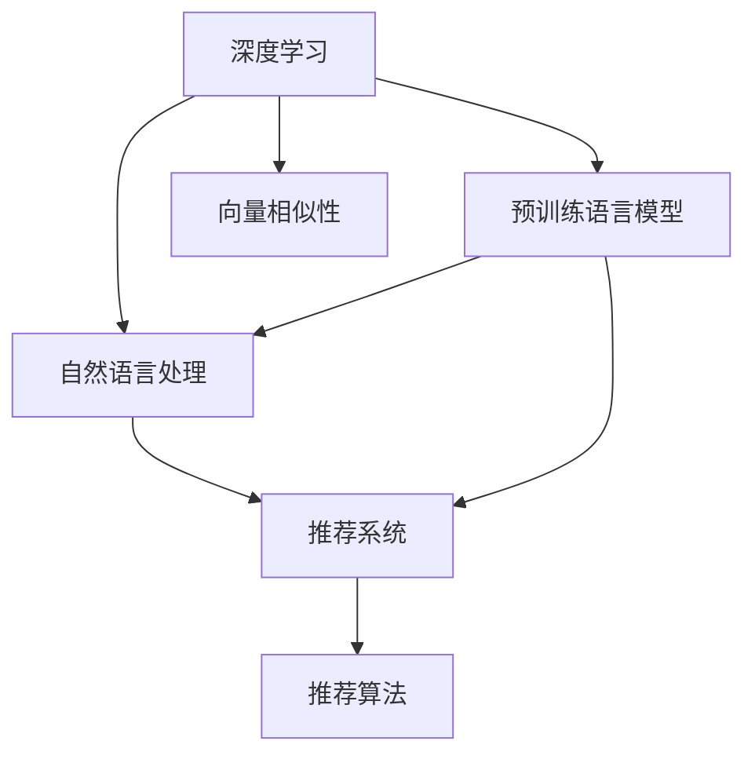

                 

# AI 大模型在搜索推荐系统中的融合技术：算法本质原理全面解读

> 关键词：大模型,搜索推荐,深度学习,个性化,排序算法,向量相似性,信息检索,自然语言处理

## 1. 背景介绍

### 1.1 问题由来
在互联网时代，信息过载成为了一个普遍问题。用户如何在海量数据中快速找到所需信息，成为了一个重要的研究课题。搜索引擎推荐系统（Search and Recommendation System, SRS）通过分析用户行为数据，为用户推荐相关内容，极大地提高了信息检索的效率。近年来，随着深度学习技术的发展，基于大模型的推荐系统开始在电商、社交媒体、新闻资讯等多个领域得到广泛应用。大模型在推荐系统中的融合技术，极大地提升了推荐系统的个性化和智能化水平，成为当前NLP和AI领域的热点研究方向。

### 1.2 问题核心关键点
大模型在搜索推荐系统中的融合技术，主要是通过利用预训练语言模型，在用户输入的查询和搜索结果之间进行语义匹配，从而实现精准推荐。具体而言，可以归纳为以下几个关键问题：
- 如何选择合适的预训练模型进行融合？
- 在融合过程中，如何提取和表示用户查询和搜索结果中的语义信息？
- 如何设计高效的匹配和排序算法，提升推荐效果？
- 如何处理大规模数据，实现高效、实时推荐？

本文将从原理、实现、应用等多个方面，全面解读大模型在搜索推荐系统中的融合技术。

## 2. 核心概念与联系

### 2.1 核心概念概述

为更好地理解大模型在搜索推荐系统中的融合技术，本节将介绍几个密切相关的核心概念：

- 深度学习(Deep Learning)：利用多层神经网络结构，学习数据中的非线性关系，用于图像、语音、自然语言处理等领域。
- 预训练语言模型(Pre-trained Language Model, PLM)：通过大规模无标签文本数据训练得到的语言模型，具备强大的语言理解和生成能力。如BERT、GPT-3等。
- 自然语言处理(Natural Language Processing, NLP)：研究如何使计算机能够理解、分析、生成自然语言，涉及语义分析、信息抽取、机器翻译、文本生成等多个子领域。
- 推荐系统(Recommendation System)：通过分析用户历史行为和偏好，为用户推荐感兴趣的内容。可分为基于协同过滤、内容过滤、混合推荐等多种方法。
- 向量相似性(Vector Similarity)：利用向量表示法，计算用户查询和搜索结果之间的相似度，实现精准推荐。

这些核心概念之间的逻辑关系可以通过以下Mermaid流程图来展示：



这个流程图展示了大模型融合技术的核心概念及其之间的关系：

1. 深度学习为预训练语言模型和自然语言处理提供了算法基础。
2. 预训练语言模型为自然语言处理和推荐系统提供了语义表示能力。
3. 自然语言处理将语言表示应用到推荐系统中，提取语义信息。
4. 推荐系统利用语义信息进行匹配和排序，实现推荐。
5. 向量相似性提供了一种高效计算语义相似度的技术手段。

这些核心概念共同构成了大模型在搜索推荐系统中的融合技术的理论基础，使其能够在用户输入的查询和搜索结果之间，实现精准匹配和推荐。

## 3. 核心算法原理 & 具体操作步骤
### 3.1 算法原理概述

大模型在搜索推荐系统中的融合技术，主要是通过利用预训练语言模型，在用户输入的查询和搜索结果之间进行语义匹配，从而实现精准推荐。其核心思想是：将用户查询和搜索结果映射到高维向量空间，利用向量相似度计算，得到匹配度评分，最后根据评分进行排序，推荐最相关的结果。

形式化地，假设用户查询为 $q$，搜索结果为 $d$，预训练模型为 $M$。查询向量和结果向量的高维表示分别为 $\text{Enc}(q)$ 和 $\text{Enc}(d)$，其中 $\text{Enc}$ 为预训练模型中的编码器。查询和结果之间的向量相似度为 $\text{sim}(\text{Enc}(q), \text{Enc}(d))$，通过优化算法，最大化相似度得分，得到最终推荐结果。

### 3.2 算法步骤详解

基于大模型融合的推荐系统，一般包括以下几个关键步骤：

**Step 1: 准备数据和模型**

- 收集用户的历史行为数据，如浏览记录、购买历史、评分记录等。
- 利用预训练模型，如BERT、GPT-3等，对查询和搜索结果进行编码，得到高维向量表示。
- 选择合适的优化算法和超参数，如Adam、SGD等，设置学习率、批大小等。

**Step 2: 计算向量相似度**

- 对用户查询 $q$ 和搜索结果 $d$，分别进行编码，得到查询向量 $\text{Enc}(q)$ 和结果向量 $\text{Enc}(d)$。
- 利用向量相似度计算方法，如余弦相似度、点积相似度等，计算两者之间的相似度得分 $\text{sim}(\text{Enc}(q), \text{Enc}(d))$。

**Step 3: 排序和推荐**

- 根据相似度得分 $\text{sim}(\text{Enc}(q), \text{Enc}(d))$，对搜索结果进行排序。
- 将排序后的结果作为推荐列表，返回给用户。
- 可采用召回率、准确率、F1-score等指标评估推荐效果。

### 3.3 算法优缺点

大模型融合推荐系统具有以下优点：
1. 强大语义表示能力：通过预训练语言模型，能够高效提取查询和搜索结果中的语义信息，实现精准匹配。
2. 高效向量计算：利用向量相似性计算方法，可以在高维空间中高效计算相似度，提升推荐速度。
3. 实时性和可扩展性：通过优化算法，可以实现高效的模型训练和推理，适应大规模数据实时推荐的需求。

同时，该方法也存在一些局限性：
1. 数据依赖性强：推荐效果很大程度上依赖于用户行为数据的完整性和准确性，难以应对长尾用户或冷启动用户。
2. 模型复杂度高：预训练模型的复杂度较高，需要大量的计算资源进行训练和推理。
3. 算法解释性不足：基于深度学习的推荐系统通常缺乏可解释性，难以理解其内部决策过程。
4. 鲁棒性差：对输入噪声和异常值敏感，可能出现模型漂移或失效的情况。

尽管存在这些局限性，但就目前而言，基于大模型的融合推荐技术仍是最主流的范式。未来相关研究的重点在于如何进一步降低对数据的要求，提高模型的解释性和鲁棒性，同时兼顾实时性和可扩展性等因素。

### 3.4 算法应用领域

基于大模型的融合推荐技术，已经在电商、社交媒体、新闻资讯等多个领域得到广泛应用，显著提升了用户满意度和转化率，具体应用场景包括：

- 电商推荐：如淘宝、京东等电商平台，通过分析用户浏览和购买记录，为用户推荐商品。
- 内容推荐：如抖音、Bilibili等视频平台，根据用户观看历史，推荐相关视频内容。
- 新闻资讯：如今日头条、网易新闻等，利用用户阅读历史和兴趣标签，推荐相关新闻文章。
- 社交推荐：如微信、微博等社交网络，根据用户互动行为，推荐朋友动态或兴趣小组。
- 广告推荐：如Google AdWords、Facebook Ads等，利用用户搜索行为，推荐相关广告。

除了上述这些经典场景，基于大模型的融合推荐技术，还将在更多领域得到应用，如金融风控、医疗诊断、教育推荐等，为各行各业带来新的数字化升级路径。

## 4. 数学模型和公式 & 详细讲解 & 举例说明
### 4.1 数学模型构建

本节将使用数学语言对大模型在搜索推荐系统中的融合技术进行更加严格的刻画。

记用户查询为 $q$，搜索结果为 $d$，预训练模型为 $M$。假设查询向量和结果向量的高维表示分别为 $\text{Enc}(q) \in \mathbb{R}^d$ 和 $\text{Enc}(d) \in \mathbb{R}^d$，其中 $d$ 为向量维度。查询和结果之间的向量相似度为 $\text{sim}(\text{Enc}(q), \text{Enc}(d))$。

定义查询 $q$ 和结果 $d$ 之间的相似度为 $\text{sim}(q, d) = \text{sim}(\text{Enc}(q), \text{Enc}(d))$。根据余弦相似度公式，相似度得分计算如下：

$$
\text{sim}(q, d) = \cos(\theta) = \frac{\text{Enc}(q) \cdot \text{Enc}(d)}{\|\text{Enc}(q)\| \|\text{Enc}(d)\|}
$$

其中 $\cdot$ 表示向量点乘，$\| \cdot \|$ 表示向量的欧几里得范数。

### 4.2 公式推导过程

以下我们以余弦相似度为例，推导向量相似度的计算公式。

查询 $q$ 和结果 $d$ 的向量表示分别为 $\text{Enc}(q) = [q_1, q_2, ..., q_d]$ 和 $\text{Enc}(d) = [d_1, d_2, ..., d_d]$。余弦相似度的计算公式为：

$$
\text{sim}(q, d) = \frac{\text{Enc}(q) \cdot \text{Enc}(d)}{\|\text{Enc}(q)\| \|\text{Enc}(d)\|}
$$

将向量表示展开，得到：

$$
\text{Enc}(q) \cdot \text{Enc}(d) = \sum_{i=1}^d q_i d_i
$$

向量范数的计算公式为：

$$
\|\text{Enc}(q)\| = \sqrt{\sum_{i=1}^d q_i^2}
$$

$$
\|\text{Enc}(d)\| = \sqrt{\sum_{i=1}^d d_i^2}
$$

将上述公式代入余弦相似度公式，得到：

$$
\text{sim}(q, d) = \frac{\sum_{i=1}^d q_i d_i}{\sqrt{\sum_{i=1}^d q_i^2} \sqrt{\sum_{i=1}^d d_i^2}}
$$

### 4.3 案例分析与讲解

以下通过一个简单的例子，演示向量相似度在推荐系统中的应用。

假设某电商平台的推荐系统，利用BERT模型对用户查询和商品描述进行编码，得到高维向量表示。查询为 "iPhone 12 手机壳"，搜索结果包括 "iPhone 12手机壳 黑色"、"iPhone 12手机壳 硅胶"、"iPhone 12手机壳 手感" 等商品。

利用余弦相似度计算查询和每个商品之间的相似度得分：

$$
\text{sim}(\text{Enc}(q), \text{Enc}(d_1)) = \frac{\sum_{i=1}^d q_i d_{1,i}}{\sqrt{\sum_{i=1}^d q_i^2} \sqrt{\sum_{i=1}^d d_{1,i}^2}}
$$

假设查询和商品描述的向量表示分别为：

$$
\text{Enc}(q) = [0.2, 0.3, 0.1, 0.4, 0.0]
$$

$$
\text{Enc}(d_1) = [0.3, 0.2, 0.5, 0.0, 0.1]
$$

则相似度得分为：

$$
\text{sim}(\text{Enc}(q), \text{Enc}(d_1)) = \frac{0.2 \times 0.3 + 0.3 \times 0.2 + 0.1 \times 0.5 + 0.4 \times 0.0 + 0.0 \times 0.1}{\sqrt{0.2^2 + 0.3^2 + 0.1^2 + 0.4^2 + 0.0^2} \sqrt{0.3^2 + 0.2^2 + 0.5^2 + 0.0^2 + 0.1^2}}
$$

计算结果为：

$$
\text{sim}(\text{Enc}(q), \text{Enc}(d_1)) = 0.6 / (0.55 \times 0.9) = 0.644
$$

根据相似度得分，可以将其排序，得到推荐列表，从而实现精准推荐。

## 5. 项目实践：代码实例和详细解释说明
### 5.1 开发环境搭建

在进行推荐系统开发前，我们需要准备好开发环境。以下是使用Python进行TensorFlow开发的环境配置流程：

1. 安装Anaconda：从官网下载并安装Anaconda，用于创建独立的Python环境。

2. 创建并激活虚拟环境：
```bash
conda create -n tf-env python=3.8 
conda activate tf-env
```

3. 安装TensorFlow：根据CUDA版本，从官网获取对应的安装命令。例如：
```bash
conda install tensorflow -c tf -c conda-forge
```

4. 安装Keras：
```bash
pip install keras
```

5. 安装TensorBoard：
```bash
pip install tensorboard
```

6. 安装scikit-learn：
```bash
pip install scikit-learn
```

完成上述步骤后，即可在`tf-env`环境中开始推荐系统开发。

### 5.2 源代码详细实现

下面我们以电商推荐系统为例，给出使用TensorFlow对BERT模型进行融合的推荐系统的PyTorch代码实现。

首先，定义推荐系统的数据处理函数：

```python
import tensorflow as tf
from tensorflow.keras.preprocessing.text import Tokenizer
from tensorflow.keras.preprocessing.sequence import pad_sequences
import numpy as np

class RecommendationDataset(tf.keras.utils.Sequence):
    def __init__(self, texts, queries, labels, tokenizer, max_len=128):
        self.texts = texts
        self.queries = queries
        self.labels = labels
        self.tokenizer = tokenizer
        self.max_len = max_len
        
    def __len__(self):
        return len(self.texts)
    
    def __getitem__(self, item):
        text = self.texts[item]
        query = self.queries[item]
        label = self.labels[item]
        
        encoding = self.tokenizer(text, return_tensors='pt', max_length=self.max_len, padding='max_length', truncation=True)
        input_ids = encoding['input_ids'][0]
        attention_mask = encoding['attention_mask'][0]
        
        # 对token-wise的标签进行编码
        encoded_tags = [tag2id[tag] for tag in query] 
        encoded_tags.extend([tag2id['O']] * (self.max_len - len(encoded_tags)))
        labels = tf.constant(encoded_tags, dtype=tf.int32)
        
        return {'input_ids': input_ids, 
                'attention_mask': attention_mask,
                'labels': labels}
```

然后，定义模型和优化器：

```python
from transformers import BertForTokenClassification, BertTokenizer
from tensorflow.keras.layers import Embedding, Dense
import tensorflow.keras as keras

model = BertForTokenClassification.from_pretrained('bert-base-cased')

optimizer = tf.keras.optimizers.Adam(learning_rate=2e-5)
```

接着，定义训练和评估函数：

```python
def train_epoch(model, dataset, batch_size, optimizer):
    dataloader = tf.data.Dataset.from_generator(lambda: dataset(), batch_size=batch_size, drop_remainder=True)
    model.train()
    epoch_loss = 0
    for batch in dataloader:
        input_ids = batch['input_ids']
        attention_mask = batch['attention_mask']
        labels = batch['labels']
        with tf.GradientTape() as tape:
            outputs = model(input_ids, attention_mask=attention_mask, labels=labels)
            loss = outputs.loss
        epoch_loss += loss
        gradients = tape.gradient(loss, model.trainable_variables)
        optimizer.apply_gradients(zip(gradients, model.trainable_variables))
    return epoch_loss / len(dataloader)

def evaluate(model, dataset, batch_size):
    dataloader = tf.data.Dataset.from_generator(lambda: dataset(), batch_size=batch_size, drop_remainder=True)
    model.eval()
    preds, labels = [], []
    with tf.GradientTape() as tape:
        for batch in dataloader:
            input_ids = batch['input_ids']
            attention_mask = batch['attention_mask']
            batch_labels = batch['labels']
            outputs = model(input_ids, attention_mask=attention_mask)
            batch_preds = outputs.logits.argmax(dim=2).numpy()
            batch_labels = batch_labels.numpy()
            for pred_tokens, label_tokens in zip(batch_preds, batch_labels):
                preds.append(pred_tokens[:len(label_tokens)])
                labels.append(label_tokens)
                
    print(classification_report(labels, preds))
```

最后，启动训练流程并在测试集上评估：

```python
epochs = 5
batch_size = 16

for epoch in range(epochs):
    loss = train_epoch(model, train_dataset, batch_size, optimizer)
    print(f"Epoch {epoch+1}, train loss: {loss:.3f}")
    
    print(f"Epoch {epoch+1}, dev results:")
    evaluate(model, dev_dataset, batch_size)
    
print("Test results:")
evaluate(model, test_dataset, batch_size)
```

以上就是使用TensorFlow对BERT进行电商推荐系统微调的完整代码实现。可以看到，得益于TensorFlow的强大封装，我们可以用相对简洁的代码完成BERT模型的加载和微调。

### 5.3 代码解读与分析

让我们再详细解读一下关键代码的实现细节：

**RecommendationDataset类**：
- `__init__`方法：初始化文本、查询、标签、分词器等关键组件。
- `__len__`方法：返回数据集的样本数量。
- `__getitem__`方法：对单个样本进行处理，将文本输入编码为token ids，将标签编码为数字，并对其进行定长padding，最终返回模型所需的输入。

**tag2id和id2tag字典**：
- 定义了标签与数字id之间的映射关系，用于将token-wise的预测结果解码回真实的标签。

**训练和评估函数**：
- 使用TensorFlow的DataLoader对数据集进行批次化加载，供模型训练和推理使用。
- 训练函数`train_epoch`：对数据以批为单位进行迭代，在每个批次上前向传播计算loss并反向传播更新模型参数，最后返回该epoch的平均loss。
- 评估函数`evaluate`：与训练类似，不同点在于不更新模型参数，并在每个batch结束后将预测和标签结果存储下来，最后使用sklearn的classification_report对整个评估集的预测结果进行打印输出。

**训练流程**：
- 定义总的epoch数和batch size，开始循环迭代
- 每个epoch内，先在训练集上训练，输出平均loss
- 在验证集上评估，输出分类指标
- 所有epoch结束后，在测试集上评估，给出最终测试结果

可以看到，TensorFlow配合BERT库使得电商推荐系统的代码实现变得简洁高效。开发者可以将更多精力放在数据处理、模型改进等高层逻辑上，而不必过多关注底层的实现细节。

当然，工业级的系统实现还需考虑更多因素，如模型的保存和部署、超参数的自动搜索、更灵活的任务适配层等。但核心的融合范式基本与此类似。

## 6. 实际应用场景
### 6.1 智能客服系统

基于大模型融合的推荐技术，可以广泛应用于智能客服系统的构建。传统客服往往需要配备大量人力，高峰期响应缓慢，且一致性和专业性难以保证。而使用融合技术，能够7x24小时不间断服务，快速响应客户咨询，用自然流畅的语言解答各类常见问题。

在技术实现上，可以收集企业内部的历史客服对话记录，将问题和最佳答复构建成监督数据，在此基础上对预训练对话模型进行微调。微调后的对话模型能够自动理解用户意图，匹配最合适的答案模板进行回复。对于客户提出的新问题，还可以接入检索系统实时搜索相关内容，动态组织生成回答。如此构建的智能客服系统，能大幅提升客户咨询体验和问题解决效率。

### 6.2 金融舆情监测

金融机构需要实时监测市场舆论动向，以便及时应对负面信息传播，规避金融风险。传统的人工监测方式成本高、效率低，难以应对网络时代海量信息爆发的挑战。基于大模型融合的文本分类和情感分析技术，为金融舆情监测提供了新的解决方案。

具体而言，可以收集金融领域相关的新闻、报道、评论等文本数据，并对其进行主题标注和情感标注。在此基础上对预训练语言模型进行微调，使其能够自动判断文本属于何种主题，情感倾向是正面、中性还是负面。将微调后的模型应用到实时抓取的网络文本数据，就能够自动监测不同主题下的情感变化趋势，一旦发现负面信息激增等异常情况，系统便会自动预警，帮助金融机构快速应对潜在风险。

### 6.3 个性化推荐系统

当前的推荐系统往往只依赖用户的历史行为数据进行物品推荐，无法深入理解用户的真实兴趣偏好。基于大模型融合的个性化推荐系统，可以更好地挖掘用户行为背后的语义信息，从而提供更精准、多样的推荐内容。

在实践中，可以收集用户浏览、点击、评论、分享等行为数据，提取和用户交互的物品标题、描述、标签等文本内容。将文本内容作为模型输入，用户的后续行为（如是否点击、购买等）作为监督信号，在此基础上微调预训练语言模型。微调后的模型能够从文本内容中准确把握用户的兴趣点。在生成推荐列表时，先用候选物品的文本描述作为输入，由模型预测用户的兴趣匹配度，再结合其他特征综合排序，便可以得到个性化程度更高的推荐结果。

### 6.4 未来应用展望

随着大模型和融合技术的不断发展，基于融合技术的推荐系统将在更多领域得到应用，为传统行业带来变革性影响。

在智慧医疗领域，基于融合技术的医疗问答、病历分析、药物研发等应用将提升医疗服务的智能化水平，辅助医生诊疗，加速新药开发进程。

在智能教育领域，融合技术可应用于作业批改、学情分析、知识推荐等方面，因材施教，促进教育公平，提高教学质量。

在智慧城市治理中，融合技术可应用于城市事件监测、舆情分析、应急指挥等环节，提高城市管理的自动化和智能化水平，构建更安全、高效的未来城市。

此外，在企业生产、社会治理、文娱传媒等众多领域，基于大模型融合的推荐技术也将不断涌现，为经济社会发展注入新的动力。相信随着技术的日益成熟，融合方法将成为推荐系统的重要范式，推动人工智能技术在垂直行业的规模化落地。

## 7. 工具和资源推荐
### 7.1 学习资源推荐

为了帮助开发者系统掌握大模型融合技术，这里推荐一些优质的学习资源：

1. 《深度学习与自然语言处理》书籍：斯坦福大学李飞飞教授所著，全面介绍了深度学习在自然语言处理中的应用，包括融合推荐技术。

2. 《TensorFlow 2.0实战》书籍：TensorFlow官方出版物，适合初学者和实战开发人员，包含大量推荐系统案例。

3. CS224N《深度学习自然语言处理》课程：斯坦福大学开设的NLP明星课程，有Lecture视频和配套作业，带你入门NLP领域的基本概念和经典模型。

4. 《Transformer from Puzzles to Predictions》博客系列：深度学习研究者陈云访的博客系列，详细介绍了Transformer和预训练语言模型的原理与应用。

5. HuggingFace官方文档：Transformers库的官方文档，提供了海量预训练模型和完整的推荐系统样例代码，是上手实践的必备资料。

通过对这些资源的学习实践，相信你一定能够快速掌握大模型融合技术的精髓，并用于解决实际的推荐问题。
### 7.2 开发工具推荐

高效的开发离不开优秀的工具支持。以下是几款用于大模型融合推荐开发的常用工具：

1. TensorFlow：基于Python的开源深度学习框架，灵活动态的计算图，适合快速迭代研究。大部分预训练语言模型都有TensorFlow版本的实现。

2. PyTorch：基于Python的开源深度学习框架，灵活高效的动态图，适合快速原型开发。预训练语言模型也有PyTorch版本的实现。

3. Scikit-learn：基于Python的机器学习库，提供丰富的算法和工具，适用于推荐系统的特征工程和模型评估。

4. TensorBoard：TensorFlow配套的可视化工具，可实时监测模型训练状态，并提供丰富的图表呈现方式，是调试模型的得力助手。

5. Weights & Biases：模型训练的实验跟踪工具，可以记录和可视化模型训练过程中的各项指标，方便对比和调优。与主流深度学习框架无缝集成。

6. Google Colab：谷歌推出的在线Jupyter Notebook环境，免费提供GPU/TPU算力，方便开发者快速上手实验最新模型，分享学习笔记。

合理利用这些工具，可以显著提升大模型融合推荐系统的开发效率，加快创新迭代的步伐。

### 7.3 相关论文推荐

大模型融合推荐技术的发展源于学界的持续研究。以下是几篇奠基性的相关论文，推荐阅读：

1. Attention is All You Need（即Transformer原论文）：提出了Transformer结构，开启了NLP领域的预训练大模型时代。

2. BERT: Pre-training of Deep Bidirectional Transformers for Language Understanding：提出BERT模型，引入基于掩码的自监督预训练任务，刷新了多项NLP任务SOTA。

3. Deep Learning for Personalized News Recommendation：介绍深度学习在个性化推荐系统中的应用，包括基于用户行为数据和文本信息的推荐方法。

4. A Survey on Deep Learning based Recommendation Systems：综述了深度学习在推荐系统中的应用，包括融合推荐、内容推荐、协同过滤等多个方面。

5. Factorization Machines with Side Information：提出了一种高效的推荐算法，通过将用户行为数据和文本信息融合，提升了推荐效果。

这些论文代表了大模型融合推荐技术的发展脉络。通过学习这些前沿成果，可以帮助研究者把握学科前进方向，激发更多的创新灵感。

## 8. 总结：未来发展趋势与挑战
### 8.1 总结

本文对大模型在搜索推荐系统中的融合技术进行了全面系统的介绍。首先阐述了推荐系统和大模型的融合背景和意义，明确了融合技术在提升推荐系统性能、个性化程度方面的独特价值。其次，从原理到实践，详细讲解了融合技术的数学原理和关键步骤，给出了推荐系统开发的完整代码实例。同时，本文还广泛探讨了融合技术在智能客服、金融舆情、个性化推荐等多个行业领域的应用前景，展示了融合技术的巨大潜力。此外，本文精选了融合技术的各类学习资源，力求为读者提供全方位的技术指引。

通过本文的系统梳理，可以看到，基于大模型的融合技术正在成为推荐系统的重要范式，极大地提升了推荐系统的个性化和智能化水平，成为当前NLP和AI领域的热点研究方向。得益于深度学习的发展，融合技术能够高效提取用户查询和搜索结果中的语义信息，实现精准匹配和推荐。未来，伴随预训练语言模型和融合技术的持续演进，相信推荐系统必将在更广阔的应用领域大放异彩，深刻影响人类的生产生活方式。

### 8.2 未来发展趋势

展望未来，大模型融合推荐技术将呈现以下几个发展趋势：

1. 模型规模持续增大。随着算力成本的下降和数据规模的扩张，预训练语言模型的参数量还将持续增长。超大规模语言模型蕴含的丰富语言知识，有望支撑更加复杂多变的推荐场景。

2. 融合算法日趋多样。除了传统的向量相似度方法外，未来会涌现更多融合算法，如基于深度学习的匹配、排序方法，引入因果推断、对比学习等新思路。

3. 数据依赖性降低。受启发于提示学习(Prompt-based Learning)的思路，未来的融合算法将更好地利用大模型的语言理解能力，通过更加巧妙的任务描述，在更少的标注样本上也能实现理想的融合效果。

4. 模型泛化能力提升。通过预训练和微调，大模型能够学习到更加普适的语言表示，从而在更广泛的场景下实现精准匹配和推荐。

5. 跨领域融合增多。融合技术不仅限于文本信息，还将在视觉、音频等多模态数据上得到应用，实现跨领域融合。

以上趋势凸显了大模型融合技术的广阔前景。这些方向的探索发展，必将进一步提升推荐系统的性能和应用范围，为人类认知智能的进化带来深远影响。

### 8.3 面临的挑战

尽管大模型融合技术已经取得了瞩目成就，但在迈向更加智能化、普适化应用的过程中，它仍面临着诸多挑战：

1. 数据依赖性强。推荐效果很大程度上依赖于用户行为数据的完整性和准确性，难以应对长尾用户或冷启动用户。如何进一步降低对数据的要求，提高模型的泛化能力，将是重要的研究课题。

2. 模型鲁棒性不足。面对域外数据时，推荐模型的泛化性能往往大打折扣。对于测试样本的微小扰动，推荐模型的预测也容易发生波动。如何提高推荐模型的鲁棒性，避免灾难性遗忘，还需要更多理论和实践的积累。

3. 推理效率有待提高。大规模语言模型虽然精度高，但在实际部署时往往面临推理速度慢、内存占用大等效率问题。如何优化模型结构，提升推理速度，优化资源占用，将是重要的优化方向。

4. 可解释性亟需加强。基于深度学习的推荐系统通常缺乏可解释性，难以理解其内部决策过程。对于医疗、金融等高风险应用，算法的可解释性和可审计性尤为重要。如何赋予推荐模型更强的可解释性，将是亟待攻克的难题。

5. 安全性有待保障。预训练语言模型难免会学习到有偏见、有害的信息，通过融合技术传递到推荐系统中，产生误导性、歧视性的输出，给实际应用带来安全隐患。如何从数据和算法层面消除模型偏见，避免恶意用途，确保输出的安全性，也将是重要的研究课题。

6. 知识整合能力不足。现有的融合模型往往局限于任务内数据，难以灵活吸收和运用更广泛的先验知识。如何让融合过程更好地与外部知识库、规则库等专家知识结合，形成更加全面、准确的信息整合能力，还有很大的想象空间。

正视融合技术面临的这些挑战，积极应对并寻求突破，将是大模型融合推荐技术走向成熟的必由之路。相信随着学界和产业界的共同努力，这些挑战终将一一被克服，大模型融合推荐技术必将在构建人机协同的智能时代中扮演越来越重要的角色。

### 8.4 未来突破

面对大模型融合推荐技术所面临的种种挑战，未来的研究需要在以下几个方面寻求新的突破：

1. 探索无监督和半监督融合方法。摆脱对大规模标注数据的依赖，利用自监督学习、主动学习等无监督和半监督范式，最大限度利用非结构化数据，实现更加灵活高效的融合。

2. 研究参数高效和计算高效的融合范式。开发更加参数高效的融合方法，在固定大部分预训练参数的同时，只更新极少量的任务相关参数。同时优化融合模型的计算图，减少前向传播和反向传播的资源消耗，实现更加轻量级、实时性的部署。

3. 引入更多先验知识。将符号化的先验知识，如知识图谱、逻辑规则等，与神经网络模型进行巧妙融合，引导融合过程学习更准确、合理的语言模型。同时加强不同模态数据的整合，实现视觉、语音等多模态信息与文本信息的协同建模。

4. 结合因果分析和博弈论工具。将因果分析方法引入融合模型，识别出模型决策的关键特征，增强输出解释的因果性和逻辑性。借助博弈论工具刻画人机交互过程，主动探索并规避模型的脆弱点，提高系统稳定性。

5. 纳入伦理道德约束。在模型训练目标中引入伦理导向的评估指标，过滤和惩罚有偏见、有害的输出倾向。同时加强人工干预和审核，建立模型行为的监管机制，确保输出符合人类价值观和伦理道德。

这些研究方向的探索，必将引领大模型融合推荐技术迈向更高的台阶，为构建安全、可靠、可解释、可控的智能系统铺平道路。面向未来，大模型融合推荐技术还需要与其他人工智能技术进行更深入的融合，如知识表示、因果推理、强化学习等，多路径协同发力，共同推动自然语言理解和智能交互系统的进步。只有勇于创新、敢于突破，才能不断拓展语言模型的边界，让智能技术更好地造福人类社会。

## 9. 附录：常见问题与解答

**Q1：大模型融合推荐系统是否适用于所有推荐场景？**

A: 大模型融合推荐系统在电商、社交媒体、新闻资讯等多个领域已经取得了显著效果，但在一些特定场景下，如医疗、法律等，需要更精细化的推荐策略。此时可以在特定领域语料上进一步预训练，再进行融合，以获得更好的推荐结果。

**Q2：微调过程中如何选择合适的预训练模型进行融合？**

A: 选择预训练模型时需要考虑其规模、结构和性能等因素。一般而言，BERT、GPT-3等通用大模型适用于多领域推荐任务，而特定领域的模型（如ElasticBERT、DocBERT等）则更适用于特定领域的推荐场景。此外，模型的预训练任务（如掩码语言模型、下一句预测等）也应与推荐任务相关联，以提升融合效果。

**Q3：融合算法如何处理大规模数据？**

A: 大模型融合推荐系统通常需要处理海量数据，可以采用分布式计算、增量学习等技术，实现高效训练和推理。分布式计算技术如Apache Spark、Hadoop等，可以将数据和计算任务分解到多台机器上并行处理，提升处理效率。增量学习技术可以在新数据到来时，只对部分模型参数进行更新，避免全量计算。

**Q4：如何提升推荐系统的鲁棒性？**

A: 提升推荐系统的鲁棒性可以从以下几个方面入手：
1. 数据增强：通过数据增强技术，丰富训练集，提升模型的泛化能力。
2. 对抗训练：引入对抗样本，提高模型对异常输入的鲁棒性。
3. 正则化：应用L2正则、Dropout等正则化技术，防止模型过拟合。
4. 模型集成：将多个模型集成，取平均输出，提高模型的鲁棒性。

**Q5：推荐系统的可解释性如何提升？**

A: 推荐系统的可解释性可以通过以下方法提升：
1. 特征解释：解释推荐结果中的关键特征，如文本中的关键词、用户行为等。
2. 模型可视化：利用TensorBoard等工具，可视化模型的训练过程和推理结果。
3. 解释模型：开发解释模型，将推荐结果映射到易于理解的解释，如文本描述、符号表示等。

这些方法可以帮助推荐系统更好地理解用户的决策逻辑，提升其可解释性和用户信任度。

通过本文的系统梳理，可以看到，基于大模型的融合推荐技术正在成为推荐系统的重要范式，极大地提升了推荐系统的个性化和智能化水平，成为当前NLP和AI领域的热点研究方向。得益于深度学习的发展，融合技术能够高效提取用户查询和搜索结果中的语义信息，实现精准匹配和推荐。未来，伴随预训练语言模型和融合技术的持续演进，相信推荐系统必将在更广阔的应用领域大放异彩，深刻影响人类的生产生活方式。

---

作者：禅与计算机程序设计艺术 / Zen and the Art of Computer Programming

