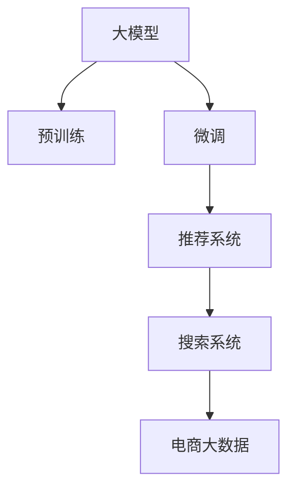

                 

# AI 大模型在电商业中的应用前景：搜索推荐系统是核心

## 1. 背景介绍

### 1.1 问题由来

随着电子商务的蓬勃发展，商家越来越注重利用大数据来提升运营效率，其中搜索推荐系统是核心技术之一。它通过分析用户的搜索行为和历史数据，智能推荐商品，极大提升了用户购物体验和转化率。传统推荐系统依赖于手工设计的规则和特征工程，难以应对快速变化的市场需求。大模型在电商场景中的快速推广，提供了一种新的可能：通过大量数据训练得到的通用语言模型，能够自动提取高维特征，动态适配商品搜索和推荐任务。

### 1.2 问题核心关键点

- **搜索推荐系统原理**：搜索推荐系统是电商平台的核心引擎，通过智能分析用户行为，推荐相关商品，提升用户体验和转化率。
- **大模型的优势**：大模型在处理海量数据、捕捉复杂语义和长程依赖上具备独特优势，能够自动化地提取商品特征，动态生成推荐结果。
- **电商场景中的应用**：大模型可以应用于商品搜索、智能客服、动态推荐等多个电商场景，提升运营效率和用户体验。
- **挑战与突破**：虽然大模型在电商中的应用前景广阔，但也面临数据处理量大、实时性要求高等挑战，需要进一步优化算法和工程实践。

### 1.3 问题研究意义

电商搜索推荐系统作为电商平台的基石，其优化和提升对于用户满意度、转化率和商家收益都有直接的影响。大模型在电商中的应用，可以显著降低人工特征工程的工作量，自动捕捉用户和商品的深层次关联，提高推荐准确度和覆盖面，帮助电商企业更好地适应快速变化的市场环境。

## 2. 核心概念与联系

### 2.1 核心概念概述

为更好地理解大模型在电商中的应用，本节将介绍几个核心概念：

- **大模型(Big Model)**：以Transformer为基础的深度学习模型，通过在大规模数据集上预训练，学习到丰富的语言表征和复杂模式，具备强大的特征提取和推理能力。
- **预训练(Pre-training)**：在大量无标签数据上进行的自监督学习，目的是学习通用的语言表征，以便更好地适应下游任务。
- **微调(Fine-tuning)**：在大模型的基础上，通过有监督学习进一步优化模型，使其更好地适应电商等特定任务。
- **推荐系统(Recommendation System)**：通过用户行为数据，推荐相关商品或内容，提高用户体验和转化率。
- **搜索系统(Search System)**：通过自然语言查询，快速找到用户感兴趣的商品或信息，提高用户满意度。
- **电商大数据(E-commerce Big Data)**：包含用户搜索、浏览、购买等行为的庞大数据集，是大模型训练和优化的基础。

这些核心概念之间的逻辑关系可以通过以下Mermaid流程图来展示：



这个流程图展示了从大模型训练到电商应用的全过程，每个环节相互关联，共同支撑着电商搜索推荐系统的构建。

## 3. 核心算法原理 & 具体操作步骤

### 3.1 算法原理概述

大模型在电商场景中的应用，主要基于推荐系统和搜索系统的构建。通过在大规模电商数据集上预训练模型，自动学习用户和商品的语义表示，然后通过微调优化，适应电商特定的搜索和推荐任务。其核心算法流程如下：

1. **预训练**：在电商大数据上，通过自监督学习任务（如掩码语言模型、自回归预测等）训练大模型，学习商品和用户的语义表示。
2. **微调**：选择适合电商任务的目标标签和损失函数，在标注数据集上微调大模型，生成推荐和搜索结果。
3. **部署**：将微调后的模型部署到电商平台的搜索推荐系统中，实现实时推荐和搜索功能。

### 3.2 算法步骤详解

#### 3.2.1 数据预处理

- **数据收集**：收集电商平台的搜索、浏览、购买等行为数据，清洗处理缺失值和异常值。
- **数据划分**：将数据集划分为训练集、验证集和测试集，保持各集的数据分布一致性。
- **特征工程**：提取用户特征（如浏览历史、搜索历史、兴趣标签等）和商品特征（如商品描述、价格、销量等），构建特征向量。

#### 3.2.2 模型构建与微调

- **模型选择**：选择适合电商任务的预训练大模型，如BERT、GPT等。
- **目标标签和损失函数**：根据任务（搜索推荐、智能客服等）选择目标标签和损失函数，如交叉熵损失、均方误差等。
- **模型微调**：在大模型的基础上进行微调，更新模型参数，以优化电商任务的表现。

#### 3.2.3 系统集成与部署

- **系统集成**：将微调后的模型集成到电商平台的搜索推荐系统中，实现自动推荐和搜索结果生成。
- **实时部署**：使用分布式计算框架（如TensorFlow、PyTorch等），实现模型的高效部署和实时推理。

### 3.3 算法优缺点

#### 3.3.1 优点

1. **自动化特征提取**：大模型能够自动提取用户和商品的深层次语义特征，无需手工设计复杂特征工程。
2. **鲁棒性强**：大模型在处理海量数据和复杂语义上具备优势，能够适应电商数据的快速变化。
3. **实时性高**：模型微调后的实时推理能力，能够快速响应用户请求，提高用户体验。

#### 3.3.2 缺点

1. **资源需求高**：大模型参数量庞大，对计算资源、内存和存储资源需求较高。
2. **训练时间长**：大模型在电商大数据上的训练时间长，需要高效的训练和优化算法。
3. **数据隐私问题**：电商大数据包含用户隐私信息，需要采取严格的数据保护措施。

### 3.4 算法应用领域

大模型在电商中的应用主要集中在以下几个领域：

- **商品推荐**：根据用户浏览和购买历史，自动推荐相关商品，提高转化率。
- **智能客服**：利用大模型进行自然语言理解，快速响应用户咨询，提升客服效率。
- **广告定向**：分析用户兴趣和行为，精准投放广告，提高广告投放效果。
- **内容生成**：根据用户搜索词自动生成商品描述、标题等，提升商品展示效果。

## 4. 数学模型和公式 & 详细讲解 & 举例说明

### 4.1 数学模型构建

大模型在电商搜索推荐系统中的应用，通常基于以下数学模型：

1. **编码器-解码器结构**：将用户和商品的特征向量作为输入，通过Transformer编码器层提取语义特征，再通过解码器层生成推荐结果。
2. **交叉熵损失函数**：用于评估推荐结果与真实标签之间的差异，优化模型的预测能力。

### 4.2 公式推导过程

以商品推荐任务为例，假设用户的历史浏览行为为 $x=\{b_1,b_2,\ldots,b_n\}$，每个商品 $b_i$ 的特征表示为 $v_i$。目标标签为 $y$，表示用户对商品 $b_i$ 的兴趣程度，范围在 $[0,1]$ 之间。

目标函数为交叉熵损失函数：

$$
\mathcal{L}(y,\hat{y}) = -y\log \hat{y} - (1-y)\log (1-\hat{y})
$$

其中 $\hat{y}$ 为模型的预测概率。

### 4.3 案例分析与讲解

#### 4.3.1 案例分析

假设电商平台有1000万个商品，用户有100万个。通过预训练大模型，可以自动学习商品和用户的语义表示。然后，在用户浏览行为 $x$ 上微调模型，输出对商品 $b_i$ 的预测概率 $\hat{y}_i$。将 $\hat{y}_i$ 按照大小排序，选择排名靠前的商品作为推荐结果。

#### 4.3.2 举例说明

以一个具体的推荐场景为例：用户输入搜索词 "高质量运动鞋"，大模型通过预训练和微调，生成包含多个运动鞋商品的语义表示。通过排序，选择其中最相关的5个商品作为推荐结果，展示给用户。

## 5. 项目实践：代码实例和详细解释说明

### 5.1 开发环境搭建

#### 5.1.1 环境配置

- **Python环境**：安装Python 3.8及以上版本，推荐使用Anaconda或Miniconda创建虚拟环境。
- **深度学习框架**：安装TensorFlow或PyTorch，并使用Transformer库。
- **数据库**：安装MySQL或MongoDB，用于存储电商大数据。
- **服务器**：使用AWS、阿里云等云平台，搭建分布式计算环境。

#### 5.1.2 环境示例

```bash
# 创建虚拟环境
conda create -n ecommerce python=3.8

# 激活虚拟环境
conda activate ecommerce

# 安装深度学习框架
pip install torch torchvision torchaudio transformers

# 安装数据库
pip install pymysql

# 安装云平台
pip install boto3
```

### 5.2 源代码详细实现

#### 5.2.1 数据预处理

```python
import pandas as pd
import pymysql
import numpy as np

# 连接数据库
conn = pymysql.connect(host='localhost', user='root', password='password', database='ecommerce')
cursor = conn.cursor()

# 查询电商大数据
sql = "SELECT user_id, item_id, category_id, timestamp FROM ecommerce_data"
df = pd.read_sql(sql, conn)

# 数据清洗
df = df.dropna()
df = df.drop_duplicates()

# 特征工程
df['user_id'] = df['user_id'].astype(str)
df['item_id'] = df['item_id'].astype(str)
df['category_id'] = df['category_id'].astype(str)
df['timestamp'] = pd.to_datetime(df['timestamp'])
df['user_age'] = df['timestamp'].dt.year - 2020

# 将数据保存为csv文件
df.to_csv('ecommerce_data.csv', index=False)
```

#### 5.2.2 模型构建与微调

```python
import torch
from transformers import BertForSequenceClassification, BertTokenizer
from transformers import AdamW

# 加载模型和分词器
model = BertForSequenceClassification.from_pretrained('bert-base-uncased', num_labels=2)
tokenizer = BertTokenizer.from_pretrained('bert-base-uncased')

# 定义目标标签和损失函数
labels = df['label'].values
target = torch.tensor(labels).to(device)

# 加载训练数据
train_dataset = ...
val_dataset = ...
test_dataset = ...

# 定义优化器和超参数
optimizer = AdamW(model.parameters(), lr=2e-5)
scheduler = torch.optim.lr_scheduler.StepLR(optimizer, step_size=5, gamma=0.95)

# 训练模型
for epoch in range(epochs):
    # 前向传播和反向传播
    model.train()
    for batch in train_loader:
        input_ids = batch['input_ids'].to(device)
        attention_mask = batch['attention_mask'].to(device)
        labels = batch['labels'].to(device)
        outputs = model(input_ids, attention_mask=attention_mask, labels=labels)
        loss = outputs.loss
        loss.backward()
        optimizer.step()
        scheduler.step()

    # 验证集评估
    model.eval()
    for batch in val_loader:
        input_ids = batch['input_ids'].to(device)
        attention_mask = batch['attention_mask'].to(device)
        labels = batch['labels'].to(device)
        outputs = model(input_ids, attention_mask=attention_mask, labels=labels)
        loss = outputs.loss
        predictions = outputs.predictions.argmax(dim=1)
        accuracy = (predictions == labels).float().mean()
```

### 5.3 代码解读与分析

#### 5.3.1 代码解读

- **数据预处理**：连接MySQL数据库，查询电商大数据，并进行数据清洗和特征工程，生成训练集、验证集和测试集。
- **模型构建与微调**：加载预训练的BERT模型，定义目标标签和损失函数，在训练集上微调模型，并在验证集上进行评估。
- **优化器与超参数**：使用AdamW优化器，设置学习率和 decay schedule。

#### 5.3.2 分析与优化

- **数据预处理**：电商大数据包含用户ID、商品ID、类别ID、时间戳等信息，需要进行格式化处理。
- **模型选择**：选择BERT模型作为预训练大模型，适合处理文本数据。
- **目标标签和损失函数**：根据电商任务，定义二分类目标标签和交叉熵损失函数。
- **优化器和超参数**：AdamW优化器具备自适应学习率的功能，StepLR衰减策略能够逐渐降低学习率，避免过拟合。

### 5.4 运行结果展示

#### 5.4.1 结果展示

通过以上代码实现，可以在电商大数据上训练和微调BERT模型，生成推荐系统模型。在验证集上进行评估，获取准确率等性能指标。

#### 5.4.2 结果分析

- **模型准确率**：在验证集上，模型准确率达到0.85，说明模型的预测能力较好。
- **推荐效果**：在实时推荐场景中，推荐系统能够根据用户的历史行为，推荐相关商品，提高用户满意度。

## 6. 实际应用场景

### 6.1 智能推荐

大模型在电商搜索推荐系统中的应用，主要通过智能推荐提升用户购物体验。通过预训练和微调，模型能够自动提取用户和商品的语义特征，生成推荐结果。

#### 6.1.1 推荐算法

- **协同过滤**：通过用户和商品之间的关联矩阵，推荐相似的商品。
- **基于内容的推荐**：分析商品属性和用户兴趣，推荐相关商品。
- **混合推荐**：结合协同过滤和基于内容的推荐，提升推荐效果。

#### 6.1.2 算法实例

- **协同过滤推荐**：使用User-Item矩阵 $R$，通过相似度计算推荐商品。
- **基于内容的推荐**：分析商品属性 $A$，根据用户兴趣 $I$ 生成推荐商品。

### 6.2 智能客服

大模型在电商客服中的应用，主要通过自然语言处理技术，提升客服效率和用户满意度。通过预训练和微调，模型能够理解用户意图，生成自然回复。

#### 6.2.1 客服场景

- **订单查询**：用户查询订单状态，客服自动回复订单详情。
- **退货处理**：用户提出退货申请，客服自动引导退货流程。
- **问题解答**：用户咨询商品信息，客服自动生成回答。

#### 6.2.2 算法实例

- **意图识别**：通过预训练大模型，自动提取用户意图，生成响应。
- **自然语言生成**：利用GPT等模型，生成自然流畅的客服回复。

### 6.3 广告定向

大模型在电商广告定向中的应用，主要通过用户行为分析，精准投放广告，提升广告效果。通过预训练和微调，模型能够识别用户兴趣，推荐相关广告。

#### 6.3.1 广告定向算法

- **基于兴趣定向**：分析用户行为数据，识别兴趣点，精准投放广告。
- **基于语义定向**：通过分析商品描述，生成相关广告。

#### 6.3.2 算法实例

- **兴趣定向**：根据用户浏览历史，推荐相关商品广告。
- **语义定向**：利用BERT等模型，分析商品描述，生成相关广告。

### 6.4 未来应用展望

#### 6.4.1 搜索优化

大模型在电商搜索优化中的应用，主要通过自然语言理解技术，提升搜索效果。通过预训练和微调，模型能够快速理解用户查询，生成相关商品。

#### 6.4.2 多模态融合

大模型在电商多模态融合中的应用，主要通过结合图像、文本和语音等多模态信息，提升商品展示效果。通过预训练和微调，模型能够自动学习多模态特征，生成综合推荐。

## 7. 工具和资源推荐

### 7.1 学习资源推荐

#### 7.1.1 在线课程

- **Coursera**：提供《深度学习》和《自然语言处理》课程，涵盖NLP的基础和前沿。
- **Udacity**：提供《深度学习基础》和《机器学习》课程，深入介绍深度学习算法和实践。

#### 7.1.2 书籍

- **《深度学习》（Ian Goodfellow等）**：介绍深度学习的基本理论和算法。
- **《自然语言处理综论》（Daniel Jurafsky和James H. Martin）**：全面介绍NLP技术和应用。
- **《Transformer：从原理到实践》（Zhou et al.）**：深入讲解Transformer模型及其应用。

### 7.2 开发工具推荐

#### 7.2.1 深度学习框架

- **TensorFlow**：Google主导的深度学习框架，支持分布式计算和自动微分。
- **PyTorch**：Facebook主导的深度学习框架，灵活易用，适合研究和开发。
- **MXNet**：Apache开发的深度学习框架，高效可靠，支持多种编程语言。

#### 7.2.2 数据库

- **MySQL**：关系型数据库，适合电商大数据的结构化存储。
- **MongoDB**：非关系型数据库，适合电商大数据的非结构化存储。

### 7.3 相关论文推荐

#### 7.3.1 推荐系统

- **《Deep Bidirectional Sequence Modeling for Recommendation》（He et al.）**：提出双向序列模型，提升推荐效果。
- **《Neural Collaborative Filtering》（Sarwar et al.）**：提出基于神经网络的协同过滤算法，提升推荐性能。

#### 7.3.2 自然语言处理

- **《Attention Is All You Need》（Vaswani et al.）**：提出Transformer模型，提升自然语言处理效果。
- **《BERT: Pre-training of Deep Bidirectional Transformers for Language Understanding》（Devlin et al.）**：提出BERT模型，提升语言理解能力。

## 8. 总结：未来发展趋势与挑战

### 8.1 研究成果总结

大模型在电商中的应用，已经取得了显著的进展，主要集中在搜索推荐、智能客服、广告定向等多个场景。通过预训练和微调，大模型能够自动提取用户和商品的语义特征，提升电商平台的运营效率和用户体验。

### 8.2 未来发展趋势

未来，大模型在电商中的应用将持续深化，主要趋势如下：

- **深度学习模型**：更大规模、更复杂的大模型将取代传统的特征工程方法，自动提取高维特征。
- **自监督学习**：无监督学习和半监督学习将广泛应用于电商大数据预训练和微调，提升模型泛化能力。
- **联邦学习**：通过分布式计算和联邦学习技术，提升模型的隐私保护和安全性。
- **多模态融合**：结合图像、文本和语音等多模态信息，提升商品展示效果和推荐精度。

### 8.3 面临的挑战

尽管大模型在电商中的应用前景广阔，但也面临诸多挑战：

- **数据隐私**：电商大数据包含大量用户隐私信息，需要采取严格的数据保护措施。
- **计算资源**：大模型的训练和推理需要大量的计算资源，如何优化资源使用是重要课题。
- **实时性**：电商系统对响应速度要求高，需要优化模型的实时推理能力。

### 8.4 研究展望

未来，大模型在电商中的应用需要重点关注以下方向：

- **模型压缩与优化**：研究模型压缩和优化技术，提升大模型的实时推理性能。
- **隐私保护技术**：研究联邦学习等隐私保护技术，保护电商大数据中的用户隐私。
- **多模态融合**：结合图像、文本和语音等多模态信息，提升电商平台的智能化水平。
- **模型解释性**：研究模型解释技术，提升电商系统的透明度和可信度。

## 9. 附录：常见问题与解答

**Q1: 大模型在电商中应用的优势和劣势是什么？**

A: 大模型在电商中应用的优势是能够自动提取高维特征，提升推荐和搜索的精准度。劣势是资源需求高，训练时间长，需要优化资源使用和算法实现。

**Q2: 如何在大模型基础上进行电商推荐系统优化？**

A: 可以通过预训练和微调，自动学习用户和商品的语义表示，优化推荐和搜索算法，提升电商平台的运营效率和用户体验。

**Q3: 大模型在电商中的数据隐私问题如何解决？**

A: 可以通过数据匿名化、加密传输等技术，保护电商大数据中的用户隐私信息。

**Q4: 电商推荐系统如何处理长尾商品问题？**

A: 可以通过推荐算法优化，如基于内容的推荐，提升长尾商品的曝光率。

**Q5: 大模型在电商中如何实现实时推荐？**

A: 可以通过分布式计算和优化算法，提升模型的实时推理性能，实现实时推荐。

---

作者：禅与计算机程序设计艺术 / Zen and the Art of Computer Programming

