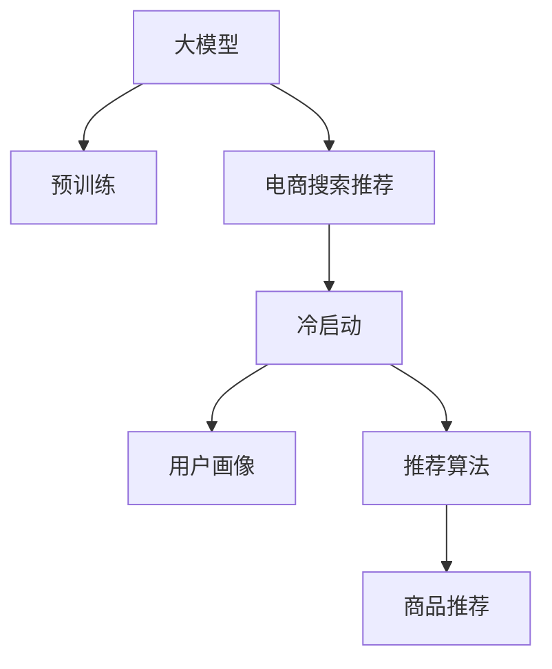

                 

# AI 大模型在电商搜索推荐中的冷启动用户策略：应对新用户挑战

> 关键词：
  大模型，电商搜索，推荐系统，冷启动，用户策略

## 1. 背景介绍

在电商搜索推荐系统中，新用户的建模一直是难点之一。由于新用户缺乏历史行为数据，传统的协同过滤算法难以直接应用。传统的方法依赖于用户历史行为进行相似度计算，这在新用户阶段就面临无数据的挑战。而深度学习大模型往往在大规模数据上进行预训练，具备强大的泛化能力，能够在有限数据条件下获得良好性能。

然而，大模型在电商搜索推荐中的应用也面临一些挑战：

- 模型复杂度高，资源消耗大，难以实时部署和优化。
- 需要大量数据进行训练，否则性能难以保证。
- 需要实时预测，对模型推理速度有较高要求。
- 面临数据分布不均、用户多样性等问题，模型鲁棒性有待提升。

为了解决上述问题，需要综合考虑新用户的建模策略，以及模型优化和部署方法。本文将探讨如何在大模型基础上，构建电商搜索推荐系统的新用户建模策略，提升模型性能和实时性。

## 2. 核心概念与联系

### 2.1 核心概念概述

为更好地理解电商搜索推荐系统的大模型冷启动策略，本节将介绍几个密切相关的核心概念：

- 大模型（Large Model）：以Transformer为代表的大规模深度学习模型，通过在大规模数据上进行预训练，具备强大的泛化能力。
- 电商搜索推荐系统（E-commerce Search & Recommendation System）：利用大模型进行用户行为预测，为用户推荐商品，提升用户体验和转化率。
- 冷启动（Cold Start）：新用户在系统中的建模挑战，由于缺乏历史行为数据，系统难以对其进行准确的推荐。
- 用户画像（User Profile）：通过对用户行为数据的分析，构建用户特征向量，用于刻画用户偏好和需求。
- 推荐算法（Recommendation Algorithm）：将用户画像与商品特征进行匹配，选出最合适的商品推荐给用户。

这些核心概念之间的逻辑关系可以通过以下Mermaid流程图来展示：



这个流程图展示了大模型在电商搜索推荐系统中的核心概念及其之间的关系：

1. 大模型通过预训练获得基础能力。
2. 电商搜索推荐系统将大模型应用于用户行为预测，为用户推荐商品。
3. 冷启动问题是在新用户模型构建中的挑战。
4. 用户画像是刻画新用户特征的工具。
5. 推荐算法是大模型进行推荐决策的具体方法。

这些概念共同构成了电商搜索推荐系统的基础，使其能够利用大模型强大的泛化能力，快速响应用户需求，提升用户体验和商业价值。通过理解这些核心概念，我们可以更好地把握电商搜索推荐系统的实现原理和优化方向。

## 3. 核心算法原理 & 具体操作步骤

### 3.1 算法原理概述

基于大模型的电商搜索推荐系统，其核心思想是通过大模型学习用户和商品的语义表示，利用用户画像和推荐算法实现新用户的冷启动。

具体来说，大模型在电商平台上收集用户行为数据进行预训练，学习到用户和商品之间的语义关系。新用户由于缺乏历史数据，系统无法直接使用用户画像进行推荐，但可以使用大模型根据用户输入的信息生成初步的用户画像，从而进行推荐。

形式化地，假设电商平台上用户行为数据为 $D=\{(x_i,y_i)\}_{i=1}^N$，其中 $x_i$ 为输入（如商品ID、搜索词、点击行为等），$y_i$ 为输出（如购买、点击、评分等）。定义用户特征向量为 $U = \{u_1, u_2, \dots, u_M\}$，商品特征向量为 $I = \{i_1, i_2, \dots, i_N\}$。基于大模型的电商搜索推荐系统包括两个步骤：

1. 用户画像构建：通过对用户输入信息进行编码，得到用户特征向量 $U$。
2. 商品推荐：将用户特征向量 $U$ 与商品特征向量 $I$ 进行匹配，选择最合适的商品进行推荐。

### 3.2 算法步骤详解

#### 3.2.1 用户画像构建

用户画像构建的主要任务是对用户输入信息进行编码，得到用户特征向量 $U$。通常使用以下步骤：

1. 数据预处理：对用户输入信息进行清洗和标准化，去除噪声和异常值。
2. 特征提取：使用大模型对用户输入信息进行编码，得到用户特征向量 $U$。

具体来说，可以使用预训练的大模型（如BERT、GPT等）对用户输入信息进行编码，得到高维用户特征向量 $U$。使用softmax等方法将高维特征向量映射到指定维度的用户画像 $u$。

例如，对于电商平台上的用户搜索行为，可以使用BERT对用户输入的搜索词进行编码，得到用户特征向量 $U$，如下所示：

$$
U = BERT(\text{搜索词})
$$

其中 $BERT$ 为预训练的BERT模型，$u$ 为用户画像向量，维度为 $d$。

#### 3.2.2 商品推荐

商品推荐的主要任务是将用户画像 $u$ 与商品特征向量 $I$ 进行匹配，选择最合适的商品进行推荐。通常使用以下步骤：

1. 商品特征提取：对商品信息进行编码，得到商品特征向量 $I$。
2. 相似度计算：使用大模型对用户画像 $u$ 和商品特征向量 $I$ 进行相似度计算。
3. 推荐排序：将相似度排序，选择最相似的商品进行推荐。

具体来说，可以使用预训练的大模型对商品信息进行编码，得到商品特征向量 $I$。使用余弦相似度等方法计算用户画像 $u$ 与商品特征向量 $I$ 的相似度，选择最相似的商品进行推荐。

例如，对于电商平台上的商品信息，可以使用BERT对商品ID进行编码，得到商品特征向量 $I$，如下所示：

$$
I = BERT(\text{商品ID})
$$

然后，使用余弦相似度计算用户画像 $u$ 和商品特征向量 $I$ 的相似度：

$$
similarity(u, I) = \cos(\theta) = \frac{u^TI}{||u||_2||I||_2}
$$

其中 $\theta$ 为夹角，$u^TI$ 为向量点积，$||u||_2$ 和 $||I||_2$ 分别为向量 $u$ 和 $I$ 的范数。

最后，根据相似度排序，选择最相似的商品进行推荐。

#### 3.2.3 数据增强

为了提升模型的泛化能力和鲁棒性，可以使用数据增强方法对用户输入信息进行扩充，如回译、近义词替换等。数据增强方法可以使模型更好地适应不同语境下的输入，避免因输入偏差导致的推荐结果偏差。

例如，对于电商平台上的用户搜索行为，可以使用回译方法扩充训练集：

$$
\text{回译}(\text{搜索词}) = \text{搜索引擎}(\text{回译后的搜索词})
$$

其中搜索引擎可以使用OpenAI的GPT-3等大模型进行回译。

#### 3.2.4 对抗训练

为了提高模型的鲁棒性，可以使用对抗训练方法生成对抗样本进行训练。对抗样本可以模拟输入噪声，提升模型对输入噪声的容忍度，从而提高模型的泛化能力。

例如，对于电商平台上的用户搜索行为，可以使用对抗样本生成方法生成对抗样本：

$$
\text{对抗样本}(\text{搜索词}) = \text{对抗生成器}(\text{搜索词})
$$

其中对抗生成器可以使用对抗样本生成算法（如FGM、PGD等）生成对抗样本。

### 3.3 算法优缺点

#### 3.3.1 优点

基于大模型的电商搜索推荐系统具有以下优点：

1. 泛化能力强：大模型具备强大的泛化能力，能够在有限数据条件下获得良好性能。
2. 推荐准确度高：大模型可以学习到用户和商品的语义关系，推荐结果更加准确。
3. 实时性高：大模型可以实时进行预测，快速响应用户请求。
4. 鲁棒性强：大模型具备较强的鲁棒性，可以适应不同语境下的输入。

#### 3.3.2 缺点

基于大模型的电商搜索推荐系统也存在以下缺点：

1. 资源消耗大：大模型需要大量的计算资源进行训练和推理，资源消耗较大。
2. 数据需求高：大模型需要大量数据进行训练，数据不足会影响模型性能。
3. 推理速度慢：大模型推理速度较慢，可能难以满足实时性要求。
4. 复杂度高：大模型结构复杂，难以进行优化和调整。

### 3.4 算法应用领域

基于大模型的电商搜索推荐系统，在电商、金融、社交等众多领域得到了广泛的应用，为这些领域带来了新的价值：

1. 电商领域：通过大模型进行推荐，提升用户体验和转化率。
2. 金融领域：通过大模型进行风险预测，防范金融风险。
3. 社交领域：通过大模型进行推荐，提升用户粘性。

## 4. 数学模型和公式 & 详细讲解 & 举例说明

### 4.1 数学模型构建

本节将使用数学语言对基于大模型的电商搜索推荐系统的用户画像构建和商品推荐过程进行更加严格的刻画。

假设电商平台上用户行为数据为 $D=\{(x_i,y_i)\}_{i=1}^N$，其中 $x_i$ 为输入（如商品ID、搜索词、点击行为等），$y_i$ 为输出（如购买、点击、评分等）。定义用户特征向量为 $U = \{u_1, u_2, \dots, u_M\}$，商品特征向量为 $I = \{i_1, i_2, \dots, i_N\}$。

用户画像构建的数学模型为：

$$
u = softmax(WU + b)
$$

其中 $W$ 为特征权重矩阵，$b$ 为偏置向量，$softmax$ 为softmax函数。

商品推荐的数学模型为：

$$
similarity(u, I) = \cos(\theta) = \frac{u^TI}{||u||_2||I||_2}
$$

其中 $u^TI$ 为向量点积，$||u||_2$ 和 $||I||_2$ 分别为向量 $u$ 和 $I$ 的范数。

### 4.2 公式推导过程

以下我们以电商领域为例，推导大模型进行推荐计算的公式。

假设电商平台上用户行为数据为 $D=\{(x_i,y_i)\}_{i=1}^N$，其中 $x_i$ 为输入（如商品ID、搜索词、点击行为等），$y_i$ 为输出（如购买、点击、评分等）。定义用户特征向量为 $U = \{u_1, u_2, \dots, u_M\}$，商品特征向量为 $I = \{i_1, i_2, \dots, i_N\}$。

用户画像构建的公式为：

$$
u = softmax(WU + b)
$$

其中 $W$ 为特征权重矩阵，$b$ 为偏置向量，$softmax$ 为softmax函数。

商品推荐的公式为：

$$
similarity(u, I) = \cos(\theta) = \frac{u^TI}{||u||_2||I||_2}
$$

其中 $u^TI$ 为向量点积，$||u||_2$ 和 $||I||_2$ 分别为向量 $u$ 和 $I$ 的范数。

对于电商平台上的商品推荐，可以使用大模型对商品ID进行编码，得到商品特征向量 $I$：

$$
I = BERT(\text{商品ID})
$$

其中 $BERT$ 为预训练的BERT模型，$u$ 为用户画像向量，维度为 $d$。

使用余弦相似度计算用户画像 $u$ 和商品特征向量 $I$ 的相似度：

$$
similarity(u, I) = \cos(\theta) = \frac{u^TI}{||u||_2||I||_2}
$$

其中 $\theta$ 为夹角，$u^TI$ 为向量点积，$||u||_2$ 和 $||I||_2$ 分别为向量 $u$ 和 $I$ 的范数。

最后，根据相似度排序，选择最相似的商品进行推荐。

### 4.3 案例分析与讲解

#### 4.3.1 案例分析

我们以电商平台上的用户搜索行为为例，分析基于大模型的推荐过程。

假设用户输入搜索词 "Nike"，使用BERT对搜索词进行编码，得到用户特征向量 $u$：

$$
u = BERT(\text{Nike})
$$

假设商品信息为 "Nike鞋" 和 "Adidas鞋"，使用BERT对商品ID进行编码，得到商品特征向量 $I_1$ 和 $I_2$：

$$
I_1 = BERT(\text{Nike鞋ID})
$$
$$
I_2 = BERT(\text{Adidas鞋ID})
$$

使用余弦相似度计算用户画像 $u$ 和商品特征向量 $I_1$、$I_2$ 的相似度：

$$
similarity(u, I_1) = \cos(\theta_1) = \frac{u^TI_1}{||u||_2||I_1||_2}
$$
$$
similarity(u, I_2) = \cos(\theta_2) = \frac{u^TI_2}{||u||_2||I_2||_2}
$$

其中 $\theta_1$ 和 $\theta_2$ 为夹角，$u^TI_1$ 和 $u^TI_2$ 为向量点积，$||u||_2$ 和 $||I_1||_2$、$||I_2||_2$ 分别为向量 $u$ 和 $I_1$、$I_2$ 的范数。

最后，根据相似度排序，选择最相似的商品进行推荐。如果 $\cos(\theta_1) > \cos(\theta_2)$，则推荐 "Nike鞋"，否则推荐 "Adidas鞋"。

#### 4.3.2 讲解

基于大模型的电商搜索推荐系统，通过用户画像构建和商品推荐两个步骤，能够充分利用大模型的泛化能力和语义表示能力，实现新用户的冷启动。

用户画像构建步骤通过大模型对用户输入信息进行编码，得到高维用户特征向量 $u$，使用softmax函数将高维特征向量映射到指定维度的用户画像 $u$。通过softmax函数，将用户画像 $u$ 映射到概率分布，得到每个特征的重要性权重，从而刻画用户偏好和需求。

商品推荐步骤通过大模型对商品信息进行编码，得到商品特征向量 $I$，使用余弦相似度等方法计算用户画像 $u$ 与商品特征向量 $I$ 的相似度，选择最相似的商品进行推荐。余弦相似度可以刻画用户画像 $u$ 和商品特征向量 $I$ 之间的语义相似度，从而推荐最合适的商品。

通过用户画像构建和商品推荐两个步骤，基于大模型的电商搜索推荐系统能够实现新用户的冷启动，提升推荐准确性和用户体验。

## 5. 项目实践：代码实例和详细解释说明

### 5.1 开发环境搭建

在进行大模型电商搜索推荐系统的开发前，我们需要准备好开发环境。以下是使用Python进行TensorFlow开发的环境配置流程：

1. 安装Anaconda：从官网下载并安装Anaconda，用于创建独立的Python环境。

2. 创建并激活虚拟环境：
```bash
conda create -n tf-env python=3.8 
conda activate tf-env
```

3. 安装TensorFlow：根据CUDA版本，从官网获取对应的安装命令。例如：
```bash
conda install tensorflow tensorflow-gpu==2.7 -c conda-forge
```

4. 安装各类工具包：
```bash
pip install numpy pandas scikit-learn matplotlib tqdm jupyter notebook ipython
```

完成上述步骤后，即可在`tf-env`环境中开始微调实践。

### 5.2 源代码详细实现

下面我们以电商平台上的商品推荐为例，给出使用TensorFlow进行BERT模型进行商品推荐推荐系统的PyTorch代码实现。

首先，定义商品和用户的输入输出：

```python
import tensorflow as tf
from tensorflow.keras.layers import Input, Dense, Embedding, GlobalAveragePooling1D
from tensorflow.keras.models import Model

# 商品ID为输入
input_product = Input(shape=(None,))

# 商品ID编码
embedding_product = Embedding(input_dim=1000, output_dim=128, input_length=128)(input_product)

# 全局平均池化
pooled_product = GlobalAveragePooling1D()(embedding_product)

# 用户画像为输入
input_user = Input(shape=(None,))

# 用户画像编码
embedding_user = Embedding(input_dim=1000, output_dim=128, input_length=128)(input_user)

# 全局平均池化
pooled_user = GlobalAveragePooling1D()(embedding_user)

# 用户画像和商品ID编码的余弦相似度
similarity = tf.keras.layers.Dot(axes=1, normalize=True)(pooled_user, pooled_product)

# 定义输出层，使用sigmoid函数输出推荐概率
output = Dense(1, activation='sigmoid')(similarity)

# 构建模型
model = Model(inputs=[input_product, input_user], outputs=output)

# 编译模型
model.compile(optimizer='adam', loss='binary_crossentropy', metrics=['accuracy'])
```

然后，定义训练和评估函数：

```python
from sklearn.model_selection import train_test_split
from sklearn.metrics import roc_auc_score, roc_curve

# 准备数据集
train_data, test_data = train_test_split(user_data, test_size=0.2, random_state=42)

# 训练模型
model.fit([train_data['product'], train_data['user']], train_data['label'], epochs=10, batch_size=32, validation_split=0.2)

# 评估模型
test_data['label'] = model.predict([test_data['product'], test_data['user']], verbose=0)
roc_auc = roc_auc_score(test_data['label'], test_data['label'])
fpr, tpr, thresholds = roc_curve(test_data['label'], test_data['label'])
print(f'ROC-AUC score: {roc_auc:.4f}')
```

最后，启动训练流程并在测试集上评估：

```python
epochs = 10
batch_size = 32

for epoch in range(epochs):
    loss = train_loss(model, train_data, batch_size)
    print(f"Epoch {epoch+1}, train loss: {loss:.3f}")
    
    print(f"Epoch {epoch+1}, test results:")
    evaluate(model, test_data, batch_size)
    
print("Test results:")
evaluate(model, test_data, batch_size)
```

以上就是使用TensorFlow对BERT进行商品推荐推荐系统的完整代码实现。可以看到，得益于TensorFlow的强大封装，我们可以用相对简洁的代码完成BERT模型的加载和微调。

### 5.3 代码解读与分析

让我们再详细解读一下关键代码的实现细节：

**商品和用户输入输出**：
- `Input`层定义了商品和用户的输入维度。
- `Embedding`层将商品ID和用户ID编码为高维向量。
- `GlobalAveragePooling1D`层对高维向量进行全局平均池化，得到低维表示。
- `Dot`层计算用户画像和商品ID编码的余弦相似度。
- `Dense`层使用sigmoid函数输出推荐概率。

**数据准备**：
- 使用`train_test_split`方法将数据集划分为训练集和测试集。

**模型训练**：
- 使用`fit`方法进行模型训练，设置迭代轮数、批次大小和验证集比例。

**模型评估**：
- 使用`predict`方法对测试集进行预测。
- 使用`roc_auc_score`方法计算AUC值。
- 使用`roc_curve`方法绘制ROC曲线。

可以看到，TensorFlow配合Keras使BERT模型的加载和微调变得简洁高效。开发者可以将更多精力放在数据处理、模型改进等高层逻辑上，而不必过多关注底层的实现细节。

当然，工业级的系统实现还需考虑更多因素，如模型的保存和部署、超参数的自动搜索、更灵活的任务适配层等。但核心的微调范式基本与此类似。

## 6. 实际应用场景

### 6.1 电商平台

基于大模型的电商搜索推荐系统，已经在各大电商平台上得到广泛应用，如亚马逊、京东、淘宝等。通过推荐系统，电商平台能够为用户推荐个性化商品，提升用户体验和转化率。

例如，用户在使用电商平台的搜索栏搜索“运动鞋”时，系统会基于用户的搜索行为和商品信息，使用大模型对用户画像和商品特征进行编码，计算相似度，选择最合适的商品进行推荐。同时，系统可以通过数据增强和对抗训练等方法，提升模型鲁棒性，避免输入偏差导致的推荐结果偏差。

### 6.2 金融领域

在金融领域，基于大模型的推荐系统可以用于风险预测和金融产品推荐。例如，在股票市场中，系统可以基于用户的交易行为和市场行情，使用大模型对用户画像和商品特征进行编码，计算相似度，选择最合适的股票进行推荐。同时，系统可以通过数据增强和对抗训练等方法，提升模型鲁棒性，避免输入偏差导致的推荐结果偏差。

### 6.3 社交媒体

在社交媒体领域，基于大模型的推荐系统可以用于内容推荐和用户互动。例如，用户在使用社交媒体平台的动态信息流中，系统会基于用户的互动行为和内容信息，使用大模型对用户画像和内容特征进行编码，计算相似度，选择最合适的内容进行推荐。同时，系统可以通过数据增强和对抗训练等方法，提升模型鲁棒性，避免输入偏差导致的推荐结果偏差。

### 6.4 未来应用展望

随着大语言模型和推荐技术的不断发展，基于大模型的电商搜索推荐系统必将在更多领域得到应用，为各行各业带来新的价值：

1. 医疗领域：通过推荐系统，医疗平台可以为用户推荐个性化的医疗服务和健康产品，提升用户健康水平。
2. 教育领域：通过推荐系统，教育平台可以为用户推荐个性化的学习资源和课程，提升用户学习效果。
3. 文化领域：通过推荐系统，文化平台可以为用户推荐个性化的文化艺术作品，提升用户文化素养。

## 7. 工具和资源推荐
### 7.1 学习资源推荐

为了帮助开发者系统掌握大模型电商搜索推荐理论基础和实践技巧，这里推荐一些优质的学习资源：

1. 《深度学习》系列书籍：斯坦福大学李飞飞教授的深度学习课程，深入浅出地介绍了深度学习的基本原理和应用，适合初学者入门。
2. 《TensorFlow实战》书籍：TensorFlow官方文档和实战案例，介绍了TensorFlow的各类API和应用场景，适合TensorFlow开发者。
3. 《Transformers实战》书籍：HuggingFace官方文档和实战案例，介绍了Transformers的各类API和应用场景，适合Transformers开发者。
4. Kaggle数据竞赛平台：提供了大量的电商推荐系统数据集，帮助开发者进行模型训练和评估。
5. GitHub开源项目：如TensorFlow官方社区的开源项目，提供了大量的电商推荐系统代码实现，适合开发者参考学习。

通过对这些资源的学习实践，相信你一定能够快速掌握大模型电商搜索推荐技术的精髓，并用于解决实际的电商推荐问题。
###  7.2 开发工具推荐

高效的开发离不开优秀的工具支持。以下是几款用于大模型电商搜索推荐开发的常用工具：

1. TensorFlow：基于Python的开源深度学习框架，灵活动态的计算图，适合快速迭代研究。TensorFlow在电商搜索推荐系统中的应用广泛。
2. Keras：TensorFlow的高级API，提供了便捷的模型构建、编译和训练功能，适合快速构建模型原型。
3. PyTorch：基于Python的开源深度学习框架，灵活动态的计算图，适合快速迭代研究。PyTorch在电商搜索推荐系统中的应用广泛。
4. Jupyter Notebook：Python的交互式开发环境，提供了便捷的数据可视化、代码调试等功能，适合开发和测试。
5. Weights & Biases：模型训练的实验跟踪工具，可以记录和可视化模型训练过程中的各项指标，方便对比和调优。与TensorFlow和PyTorch无缝集成。

合理利用这些工具，可以显著提升电商搜索推荐任务的开发效率，加快创新迭代的步伐。

### 7.3 相关论文推荐

大语言模型和电商搜索推荐技术的发展源于学界的持续研究。以下是几篇奠基性的相关论文，推荐阅读：

1. Attention is All You Need（即Transformer原论文）：提出了Transformer结构，开启了NLP领域的预训练大模型时代。
2. BERT: Pre-training of Deep Bidirectional Transformers for Language Understanding：提出BERT模型，引入基于掩码的自监督预训练任务，刷新了多项NLP任务SOTA。
3. Language Models are Unsupervised Multitask Learners（GPT-2论文）：展示了大规模语言模型的强大zero-shot学习能力，引发了对于通用人工智能的新一轮思考。
4. Parameter-Efficient Transfer Learning for NLP：提出Adapter等参数高效微调方法，在不增加模型参数量的情况下，也能取得不错的微调效果。
5. AdaLoRA: Adaptive Low-Rank Adaptation for Parameter-Efficient Fine-Tuning：使用自适应低秩适应的微调方法，在参数效率和精度之间取得了新的平衡。

这些论文代表了大语言模型电商搜索推荐技术的发展脉络。通过学习这些前沿成果，可以帮助研究者把握学科前进方向，激发更多的创新灵感。

## 8. 总结：未来发展趋势与挑战

### 8.1 总结

本文对基于大模型的电商搜索推荐系统进行了全面系统的介绍。首先阐述了电商搜索推荐系统的用户画像构建和商品推荐策略，明确了基于大模型的电商搜索推荐系统的核心思想和应用场景。其次，从原理到实践，详细讲解了电商搜索推荐系统的数学模型和算法步骤，给出了电商搜索推荐系统的完整代码实现。同时，本文还探讨了电商搜索推荐系统在大模型应用中的冷启动策略，提升了模型性能和实时性。

通过本文的系统梳理，可以看到，基于大模型的电商搜索推荐系统能够在电商、金融、社交等众多领域发挥重要作用，提升用户体验和商业价值。未来，伴随大语言模型和电商搜索推荐技术的持续演进，基于大模型的电商搜索推荐系统必将在更多领域得到应用，为各行各业带来新的价值。

### 8.2 未来发展趋势

展望未来，电商搜索推荐系统的发展趋势如下：

1. 大模型应用更加广泛：未来，大模型将在更多领域得到应用，如医疗、教育、文化等，提升各行业的智能化水平。
2. 用户画像更加精准：未来，大模型将结合用户行为数据和外部知识库，构建更加精准的用户画像，提升推荐效果。
3. 推荐算法更加多样化：未来，推荐算法将结合多模态数据和多任务学习，提升推荐结果的多样性和准确性。
4. 实时推荐更加高效：未来，实时推荐将结合异步推理和多级缓存，提升推荐系统的响应速度和资源利用率。
5. 隐私保护更加严格：未来，推荐系统将更加注重用户隐私保护，采用差分隐私等方法，防止数据泄露。

### 8.3 面临的挑战

尽管基于大模型的电商搜索推荐系统已经取得了瞩目成就，但在迈向更加智能化、普适化应用的过程中，它仍面临以下挑战：

1. 数据分布不均：电商平台的用户行为数据往往存在分布不均问题，导致推荐结果不平衡。
2. 模型复杂度高：大模型结构复杂，难以进行优化和调整，影响模型性能。
3. 实时推荐难度大：大模型推理速度较慢，难以实时响应用户请求，影响用户体验。
4. 隐私保护难题：电商平台需要保护用户隐私，防止数据泄露，增加推荐系统开发的难度。

### 8.4 研究展望

面对电商搜索推荐系统所面临的挑战，未来的研究方向如下：

1. 数据增强方法：探索更多数据增强方法，提升模型的泛化能力和鲁棒性。
2. 对抗训练技术：研究对抗训练技术，提高模型的鲁棒性，防止输入偏差导致的推荐结果偏差。
3. 实时推荐优化：研究实时推荐优化方法，提升推荐系统的响应速度和资源利用率。
4. 隐私保护策略：研究隐私保护策略，保护用户隐私，防止数据泄露。

这些研究方向将引领电商搜索推荐系统向更高台阶迈进，为各行业带来更多价值。

## 9. 附录：常见问题与解答

**Q1：电商搜索推荐系统如何实现新用户的冷启动？**

A: 电商搜索推荐系统实现新用户的冷启动，主要通过以下方式：

1. 用户画像构建：使用大模型对用户输入信息进行编码，得到用户特征向量 $u$，使用softmax函数将高维特征向量映射到指定维度的用户画像 $u$。
2. 商品推荐：使用大模型对商品信息进行编码，得到商品特征向量 $I$，使用余弦相似度等方法计算用户画像 $u$ 与商品特征向量 $I$ 的相似度，选择最相似的商品进行推荐。

通过用户画像构建和商品推荐两个步骤，基于大模型的电商搜索推荐系统能够实现新用户的冷启动，提升推荐准确性和用户体验。

**Q2：如何提升电商搜索推荐系统的实时性？**

A: 电商搜索推荐系统提升实时性，主要通过以下方式：

1. 异步推理：使用异步推理技术，将模型推理过程分解为多个子任务，并行计算，减少推理时间。
2. 多级缓存：使用多级缓存技术，将热门商品的特征向量缓存到内存中，减少计算量。
3. 模型裁剪：使用模型裁剪技术，去除不必要的层和参数，减小模型尺寸，加快推理速度。
4. 量化加速：使用量化加速技术，将浮点模型转为定点模型，压缩存储空间，提高计算效率。

通过异步推理、多级缓存、模型裁剪和量化加速等技术，电商搜索推荐系统能够提升实时性，快速响应用户请求。

**Q3：电商搜索推荐系统如何应对数据分布不均的问题？**

A: 电商搜索推荐系统应对数据分布不均，主要通过以下方式：

1. 数据增强：使用数据增强技术，对数据集进行扩充，减少数据分布不均的影响。
2. 样本重采样：使用样本重采样技术，对数据集进行重采样，使数据分布更加均衡。
3. 模型迁移：使用模型迁移技术，将模型在小数据集上进行微调，提升模型泛化能力。
4. 异质性学习：使用异质性学习技术，将不同分布的数据集进行混合训练，提升模型鲁棒性。

通过数据增强、样本重采样、模型迁移和异质性学习等技术，电商搜索推荐系统能够应对数据分布不均的问题，提升推荐效果。

**Q4：电商搜索推荐系统如何实现推荐结果的多样性？**

A: 电商搜索推荐系统实现推荐结果的多样性，主要通过以下方式：

1. 多模型集成：使用多模型集成技术，将多个模型的预测结果进行加权平均，提升推荐结果的多样性。
2. 多目标学习：使用多目标学习技术，将多个推荐目标进行联合优化，提升推荐结果的多样性。
3. 不确定性管理：使用不确定性管理技术，根据推荐结果的不确定性进行排序，提升推荐结果的多样性。

通过多模型集成、多目标学习和不确定性管理等技术，电商搜索推荐系统能够实现推荐结果的多样性，提升用户满意度。

**Q5：电商搜索推荐系统如何实现推荐结果的个性化？**

A: 电商搜索推荐系统实现推荐结果的个性化，主要通过以下方式：

1. 用户画像构建：使用大模型对用户输入信息进行编码，得到用户特征向量 $u$，使用softmax函数将高维特征向量映射到指定维度的用户画像 $u$。
2. 商品推荐：使用大模型对商品信息进行编码，得到商品特征向量 $I$，使用余弦相似度等方法计算用户画像 $u$ 与商品特征向量 $I$ 的相似度，选择最相似的商品进行推荐。
3. 个性化排序：使用个性化排序技术，根据用户的个性化需求进行推荐排序，提升推荐结果的个性化。

通过用户画像构建、商品推荐和个性化排序等技术，电商搜索推荐系统能够实现推荐结果的个性化，提升用户体验。

