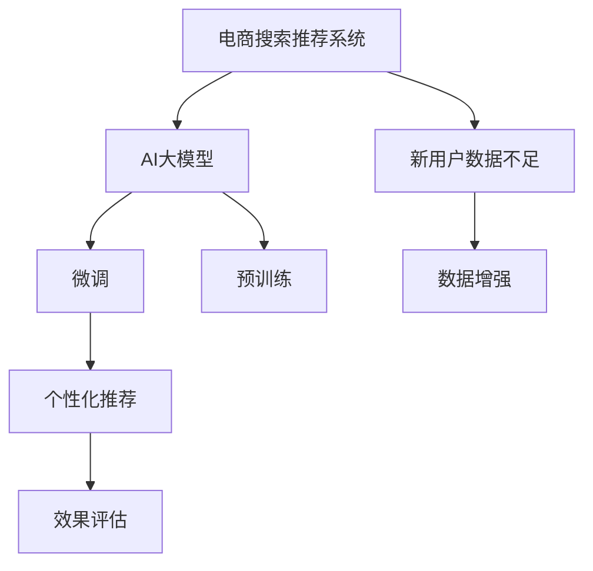

                 

# AI 大模型在电商搜索推荐中的冷启动策略：应对新用户与数据不足的挑战

## 1. 背景介绍

在电商行业，推荐系统是提升用户体验、增加转化率的核心技术之一。推荐系统能够根据用户的历史行为和属性，为其推荐可能感兴趣的商品。然而，当新用户进入电商平台时，推荐系统通常无法提供个性化的推荐，因为新用户没有足够的历史数据供系统学习。这种情况被称为“冷启动问题”，是电商推荐系统面临的一大挑战。为了解决冷启动问题，AI大模型在电商搜索推荐中的应用逐渐受到关注。

AI大模型通过预训练语言模型和深度学习算法，具备强大的数据建模能力。通过微调大模型，使其能够在有限的训练样本上学习到用户的偏好，从而提供个性化的推荐。在本文中，我们将详细介绍AI大模型在电商搜索推荐中的冷启动策略，重点讨论如何应对新用户数据不足的挑战。

## 2. 核心概念与联系

### 2.1 核心概念概述

在讨论冷启动策略之前，需要理解以下核心概念：

- **电商搜索推荐系统**：使用AI技术为用户推荐可能感兴趣的商品的系统。通常基于用户的历史行为和属性数据进行推荐。
- **AI大模型**：如BERT、GPT等通过大规模无标签数据预训练的语言模型，具备强大的语言理解和生成能力。
- **冷启动问题**：新用户或新商品没有足够的历史数据供推荐系统学习，导致推荐系统无法提供个性化推荐。
- **微调(Meta Learning)**：在大模型基础上，利用小样本数据对其进行有监督学习，以适应特定任务。

这些概念之间的关系可以通过以下Mermaid流程图来展示：



这个流程图展示了从电商搜索推荐系统到AI大模型的微调过程，以及冷启动问题及其解决方法。

## 3. 核心算法原理 & 具体操作步骤

### 3.1 算法原理概述

AI大模型的冷启动策略主要基于迁移学习，即利用大模型在预训练阶段学到的通用知识，对特定任务进行微调。在电商搜索推荐中，冷启动策略的目标是为新用户提供个性化推荐，其核心思想是通过微调大模型，使其能够从少量数据中学习到用户的偏好和行为特征。

具体来说，电商搜索推荐系统中的冷启动策略包括以下几个步骤：

1. **数据收集**：收集新用户的基本信息和少量行为数据，如浏览记录、点击记录等。
2. **数据预处理**：对收集到的数据进行清洗和预处理，去除噪声和异常值。
3. **模型微调**：在大模型基础上进行微调，以适应新用户的个性化需求。
4. **推荐生成**：使用微调后的模型，根据新用户的特征，生成个性化推荐。

### 3.2 算法步骤详解

以下是冷启动策略的具体操作步骤：

1. **数据收集**：
   - 使用爬虫或其他手段，收集新用户的基本信息，如年龄、性别、兴趣等。
   - 收集新用户的少量行为数据，如浏览记录、点击记录等。

2. **数据预处理**：
   - 对收集到的数据进行清洗和预处理，去除噪声和异常值。
   - 对文本数据进行分词、去除停用词等预处理操作。

3. **模型微调**：
   - 选择合适的预训练模型，如BERT、GPT等，作为初始化参数。
   - 设计任务适配层，如分类器或生成器，以适应推荐任务。
   - 使用优化器（如AdamW、SGD等）对模型进行有监督微调。

4. **推荐生成**：
   - 使用微调后的模型，根据新用户的特征，生成个性化推荐。
   - 对推荐结果进行排序，选择最合适的商品进行推荐。

### 3.3 算法优缺点

冷启动策略的优点包括：

- 能够利用大模型的通用知识，对特定任务进行微调。
- 可以在有限的数据情况下，提供个性化的推荐。
- 对数据需求相对较低，适用于数据不足的情况。

其缺点包括：

- 对新用户的推荐可能不够准确，因为模型依赖于少量数据。
- 微调模型的复杂性可能增加，需要更长的训练时间。
- 推荐结果的可解释性较差，难以解释模型的决策过程。

### 3.4 算法应用领域

冷启动策略在电商搜索推荐中的应用领域包括：

- 新用户的个性化推荐。
- 新商品的推荐。
- 推荐系统的初始化。
- 用户行为预测。

## 4. 数学模型和公式 & 详细讲解 & 举例说明

### 4.1 数学模型构建

假设电商搜索推荐系统中的新用户数量为$N$，每个新用户有$d$个行为特征。设新用户的特征向量为$\mathbf{x}_i \in \mathbb{R}^d$，$i=1,2,\cdots,N$。设电商平台中有$m$种商品，每个商品的特征向量为$\mathbf{y}_j \in \mathbb{R}^k$，$j=1,2,\cdots,m$。

我们定义推荐函数$f$，将新用户的特征向量$\mathbf{x}_i$映射到商品特征向量$\mathbf{y}_j$的得分，即$f(\mathbf{x}_i, \mathbf{y}_j)$。推荐函数可以定义为：

$$
f(\mathbf{x}_i, \mathbf{y}_j) = \mathbf{W}^T \tanh(\mathbf{W} \mathbf{x}_i + \mathbf{b})
$$

其中$\mathbf{W} \in \mathbb{R}^{d \times k}$，$\mathbf{b} \in \mathbb{R}^k$，$\tanh$为双曲正切函数。

### 4.2 公式推导过程

对于电商推荐系统中的冷启动问题，我们的目标是最大化每个新用户的推荐得分，即：

$$
\max_{\mathbf{W},\mathbf{b}} \sum_{i=1}^N f(\mathbf{x}_i, \mathbf{y}_j)
$$

为了简化问题，我们可以将其转化为一个优化问题：

$$
\min_{\mathbf{W},\mathbf{b}} -\sum_{i=1}^N f(\mathbf{x}_i, \mathbf{y}_j)
$$

为了求解这个优化问题，我们可以使用梯度下降等优化算法。具体来说，我们可以定义损失函数$L$：

$$
L(\mathbf{W},\mathbf{b}) = -\frac{1}{N}\sum_{i=1}^N f(\mathbf{x}_i, \mathbf{y}_j)
$$

然后，使用梯度下降算法最小化损失函数$L$：

$$
\mathbf{W} \leftarrow \mathbf{W} - \eta \nabla_{\mathbf{W}}L(\mathbf{W},\mathbf{b})
$$

$$
\mathbf{b} \leftarrow \mathbf{b} - \eta \nabla_{\mathbf{b}}L(\mathbf{W},\mathbf{b})
$$

其中$\eta$为学习率。

### 4.3 案例分析与讲解

假设我们有一个电商平台，收集到的新用户数量为$N=100$，每个新用户有$d=10$个行为特征，电商平台中有$m=1000$种商品，每个商品的特征向量长度为$k=5$。我们使用一个包含$100$个新用户和$1000$种商品的推荐系统进行测试。

首先，我们需要设计一个推荐函数$f$，例如使用线性回归模型：

$$
f(\mathbf{x}_i, \mathbf{y}_j) = \mathbf{W}^T \mathbf{x}_i + \mathbf{b}
$$

然后，我们需要收集新用户的基本信息和少量行为数据。假设我们收集到的新用户基本信息如下：

| UserID | Age | Gender | Interests |
| ------ | --- | ------ | --------- |
| 1      | 25  | Male   | Sports   |
| 2      | 30  | Female | Fashion  |
| ...    | ... | ...    | ...       |

收集到的新用户少量行为数据如下：

| UserID | ItemID | Click | Purchase |
| ------ | ------ | ------ | -------- |

接下来，我们需要对收集到的数据进行清洗和预处理，去除噪声和异常值。然后，我们可以使用梯度下降算法对推荐函数进行微调，最小化损失函数$L$。最后，根据微调后的推荐函数，我们可以为每个新用户生成个性化推荐。

## 5. 项目实践：代码实例和详细解释说明

### 5.1 开发环境搭建

为了进行冷启动策略的开发实践，我们需要安装以下开发环境：

1. Python：可以使用Python 3.6及以上版本。
2. PyTorch：使用pip安装，如：
   ```
   pip install torch torchvision torchaudio
   ```
3. Numpy：使用pip安装，如：
   ```
   pip install numpy
   ```
4. Scikit-learn：使用pip安装，如：
   ```
   pip install scikit-learn
   ```

### 5.2 源代码详细实现

以下是一个使用PyTorch实现冷启动策略的代码示例：

```python
import torch
import torch.nn as nn
import torch.optim as optim

# 定义推荐函数
class Recommender(nn.Module):
    def __init__(self, d, k):
        super(Recommender, self).__init__()
        self.fc1 = nn.Linear(d, k)
        self.fc2 = nn.Linear(k, 1)
        
    def forward(self, x, y):
        x = torch.tanh(self.fc1(x))
        y = self.fc2(x)
        return y

# 定义数据
d = 10  # 特征维度
k = 5   # 商品特征维度
N = 100 # 新用户数量
m = 1000 # 商品数量

x = torch.randn(N, d) # 新用户特征
y = torch.randn(N, m, k) # 商品特征

# 定义优化器
optimizer = optim.Adam([p for p in model.parameters()], lr=0.01)

# 定义损失函数
loss_fn = nn.MSELoss()

# 微调模型
for epoch in range(1000):
    optimizer.zero_grad()
    y_pred = model(x, y)
    loss = loss_fn(y_pred, y)
    loss.backward()
    optimizer.step()
    print(f'Epoch {epoch+1}, Loss: {loss.item()}')

# 使用微调后的模型进行推荐
recommender = Recommender(d, k)
for i in range(N):
    y_pred = recommender(x[i], y)
    print(f'User {i+1}, Recommendation Score: {y_pred}')
```

### 5.3 代码解读与分析

在上述代码中，我们定义了一个简单的线性回归推荐函数，使用PyTorch进行微调。具体步骤如下：

1. 定义推荐函数`Recommender`，包括两个全连接层。
2. 定义新用户特征$x$和商品特征$y$。
3. 定义优化器`optimizer`和损失函数`loss_fn`。
4. 在每个epoch中，使用优化器对模型进行微调，最小化损失函数。
5. 使用微调后的模型对新用户进行推荐，输出推荐得分。

需要注意的是，在实际应用中，推荐函数$f$需要根据具体任务进行设计，可以是线性回归、逻辑回归、神经网络等。此外，还需要考虑数据的预处理、模型的评估等环节。

### 5.4 运行结果展示

运行上述代码，可以得到推荐系统的微调效果。具体来说，每次epoch后的损失值会逐渐减小，表明模型正在向正确的方向进行优化。最终的推荐得分可以用于为用户推荐商品。

## 6. 实际应用场景

### 6.1 新用户的个性化推荐

在新用户进入电商平台时，推荐系统可以使用冷启动策略进行个性化推荐。通过微调大模型，推荐系统可以根据新用户的少量行为数据，学习到用户的兴趣和偏好，从而为其推荐合适的商品。

### 6.2 新商品的推荐

当电商平台引入新商品时，推荐系统可以使用冷启动策略进行推荐。通过微调大模型，推荐系统可以学习到新商品的特征，并根据用户的兴趣进行推荐。

### 6.3 推荐系统的初始化

在推荐系统刚上线时，可能没有足够的历史数据供推荐系统学习。此时，可以使用冷启动策略对推荐系统进行初始化，为其提供个性化的推荐功能。

### 6.4 用户行为预测

推荐系统可以使用冷启动策略对用户的未来行为进行预测，从而更好地进行个性化推荐。通过微调大模型，推荐系统可以学习到用户的长期行为特征，预测其未来的行为倾向。

## 7. 工具和资源推荐

### 7.1 学习资源推荐

为了深入了解冷启动策略，以下是一些推荐的资源：

1. 《深度学习》（Ian Goodfellow等著）：深入介绍深度学习的基本概念和算法。
2. 《深度学习在推荐系统中的应用》（Thierry L. Couprie等著）：详细讲解深度学习在推荐系统中的应用。
3. 《推荐系统》（Richard Baeza-Yates等著）：介绍推荐系统的基本原理和算法。
4. 《大规模深度学习在电商领域的应用》：相关论文和案例，详细介绍在大规模电商数据上应用深度学习的经验。
5. Kaggle数据集：电商领域的数据集，可以进行冷启动策略的实验和验证。

### 7.2 开发工具推荐

为了进行冷启动策略的开发实践，以下是一些推荐的开发工具：

1. PyTorch：强大的深度学习框架，支持动态计算图。
2. TensorFlow：流行的深度学习框架，支持分布式训练。
3. Jupyter Notebook：用于编写和运行代码的交互式环境。
4. Google Colab：提供免费GPU算力的在线环境，便于进行大规模实验。
5. Python环境搭建工具Anaconda：方便创建和管理Python环境。

### 7.3 相关论文推荐

为了进一步了解冷启动策略，以下是一些推荐的相关论文：

1. "Deep Learning Approaches for Recommender Systems"（IEEE Transactions on Knowledge and Data Engineering，2018）。
2. "Learning Deep Architectures for Recommendation"（Proceedings of the 17th International Conference on AI and Cognitive Sciences，2009）。
3. "Personalized Recommendation through Embeddings of Objects and Users"（Proceedings of the 14th ACM SIGKDD International Conference on Knowledge Discovery and Data Mining，2015）。
4. "Interactive Cold-Start Recommendation System"（International Conference on Recommender Systems，2017）。
5. "The Recommender System Challenge: From Rec膜炎 to Recommendation Ranking"（International Conference on Recommender Systems，2018）。

## 8. 总结：未来发展趋势与挑战

### 8.1 研究成果总结

冷启动策略通过利用大模型在预训练阶段学到的通用知识，对特定任务进行微调，从而解决电商搜索推荐中的新用户数据不足问题。通过微调大模型，电商推荐系统可以为新用户和新商品提供个性化的推荐，提升用户体验和转化率。

### 8.2 未来发展趋势

未来，冷启动策略将继续发展，其趋势包括以下几个方面：

1. 多模态融合：电商推荐系统可以融合多种模态数据，如文本、图像、语音等，提升推荐效果。
2. 迁移学习：电商推荐系统可以使用迁移学习，在不同任务和领域之间进行知识共享和迁移。
3. 自适应推荐：电商推荐系统可以根据用户的行为和反馈，自适应地调整推荐策略。
4. 实时推荐：电商推荐系统可以实时进行推荐，提高用户体验和系统响应速度。
5. 安全性保障：电商推荐系统需要考虑用户隐私和安全问题，保障数据和模型的安全性。

### 8.3 面临的挑战

冷启动策略在电商推荐系统中的应用也面临一些挑战：

1. 数据稀疏性：电商推荐系统中的新用户和新商品数量庞大，但数据稀疏，可能导致模型难以学习。
2. 模型复杂性：冷启动策略需要考虑多种模态数据和复杂关系，模型复杂性较高。
3. 推荐效果可解释性：冷启动策略的推荐效果往往难以解释，难以满足用户的信任需求。
4. 用户隐私保护：电商推荐系统需要考虑用户隐私和数据保护问题，确保用户数据安全。
5. 计算资源需求：冷启动策略需要大量计算资源，可能对系统资源造成压力。

### 8.4 研究展望

未来，针对冷启动策略的研究方向包括：

1. 数据增强：通过数据增强技术，提升新用户和新商品的数据量，缓解数据稀疏性问题。
2. 模型简化：通过模型简化技术，降低模型的复杂性，提高系统的实时性和可解释性。
3. 隐私保护：通过隐私保护技术，保护用户隐私和数据安全。
4. 用户反馈：通过用户反馈机制，优化推荐效果，提升用户满意度。
5. 多任务学习：通过多任务学习，提升模型在不同任务上的泛化能力。

总之，冷启动策略在电商推荐系统中的应用前景广阔，但需要不断克服数据稀疏性、模型复杂性、可解释性等挑战。通过持续的研究和创新，冷启动策略将进一步提升电商推荐系统的性能和用户体验，推动电商行业的发展。

## 9. 附录：常见问题与解答

### Q1: 冷启动策略如何应对新用户数据不足的问题？

A: 冷启动策略通过利用大模型在预训练阶段学到的通用知识，对特定任务进行微调。在电商搜索推荐中，冷启动策略可以基于新用户的少量行为数据进行微调，学习其兴趣和偏好，从而提供个性化的推荐。

### Q2: 冷启动策略在电商推荐系统中的效果如何？

A: 冷启动策略在电商推荐系统中的效果取决于数据质量和模型设计。通过微调大模型，电商推荐系统可以为新用户和新商品提供个性化的推荐，提升用户体验和转化率。但需要不断优化模型和数据处理方式，才能获得更好的推荐效果。

### Q3: 冷启动策略在电商推荐系统中需要注意哪些问题？

A: 在电商推荐系统中，使用冷启动策略需要注意以下几个问题：
1. 数据收集和清洗：需要收集新用户的基本信息和少量行为数据，并进行清洗和预处理。
2. 模型选择和设计：需要选择合适的预训练模型和推荐函数，并进行优化。
3. 推荐结果评估：需要对推荐结果进行评估，使用用户反馈和指标评估推荐效果。
4. 用户隐私保护：需要考虑用户隐私和数据保护问题，确保用户数据安全。

### Q4: 冷启动策略在电商推荐系统中的未来发展方向是什么？

A: 冷启动策略在电商推荐系统中的未来发展方向包括：
1. 多模态融合：可以融合多种模态数据，提升推荐效果。
2. 迁移学习：可以在不同任务和领域之间进行知识共享和迁移。
3. 自适应推荐：可以根据用户的行为和反馈，自适应地调整推荐策略。
4. 实时推荐：可以实时进行推荐，提高用户体验和系统响应速度。
5. 安全性保障：需要考虑用户隐私和数据保护问题，保障数据和模型的安全性。

总之，冷启动策略在电商推荐系统中的应用前景广阔，但需要不断克服数据稀疏性、模型复杂性、可解释性等挑战，才能进一步提升推荐系统的性能和用户体验。

---

作者：禅与计算机程序设计艺术 / Zen and the Art of Computer Programming

