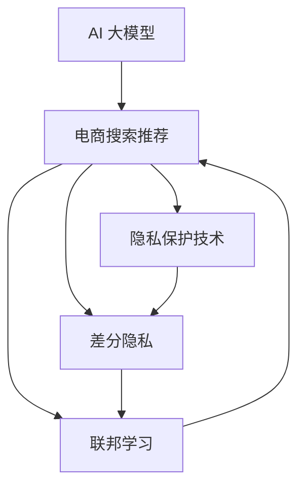

                 

# AI 大模型在电商搜索推荐中的数据安全策略：保障用户隐私与数据安全性

> 关键词：AI 大模型，电商搜索推荐，数据安全，隐私保护，联邦学习，差分隐私，数据匿名化

## 1. 背景介绍

### 1.1 问题由来
随着电子商务的蓬勃发展，电商搜索推荐系统已成为用户获取商品信息、进行购物决策的重要工具。在大数据驱动的推荐系统中，用户行为数据对于提升推荐效果至关重要。然而，如何在使用这些数据的同时保障用户隐私和数据安全，成为了一个亟待解决的问题。

近年来，AI大模型的应用在电商搜索推荐领域取得了显著进展，通过大模型预训练和微调，推荐系统能够更加精准地理解用户需求，提升推荐效果。但随着模型的复杂度和数据的规模增加，数据隐私和安全问题也日益突出。如何在充分利用用户数据的同时，保障用户隐私和数据安全，是大模型在电商搜索推荐中面临的重要挑战。

### 1.2 问题核心关键点
为解决大模型在电商搜索推荐中的数据隐私和安全问题，本文将从隐私保护技术、差分隐私、联邦学习等角度，提出一套系统的数据安全策略，确保用户数据的安全性和隐私性。具体而言，包括以下几个关键点：

- **隐私保护技术**：通过数据匿名化、数据加密等手段，保护用户隐私。
- **差分隐私**：在模型训练和推理过程中，引入差分隐私机制，确保个体数据无法被识别。
- **联邦学习**：在多方数据拥有者之间，通过联邦学习技术，实现模型训练和推理，避免集中式处理敏感数据。
- **模型自适应性**：在大模型架构中引入自适应机制，实现模型的动态更新和优化。

## 2. 核心概念与联系

### 2.1 核心概念概述

为更好地理解大模型在电商搜索推荐中的数据安全策略，本节将介绍几个密切相关的核心概念：

- **AI 大模型**：以Transformer等深度学习架构为代表的，通过预训练和微调，能够处理自然语言等复杂数据结构的模型。
- **电商搜索推荐系统**：利用AI大模型，通过分析用户行为数据，为用户推荐相关商品的系统。
- **隐私保护技术**：通过数据匿名化、加密等手段，确保用户数据不被未经授权访问的技术。
- **差分隐私**：在数据分析和模型训练过程中，确保个体数据无法被识别，从而保护隐私的技术。
- **联邦学习**：在多数据拥有者之间，通过分布式方式训练模型，避免集中式处理敏感数据的技术。

这些核心概念之间的逻辑关系可以通过以下Mermaid流程图来展示：



这个流程图展示了大模型在电商搜索推荐中的核心概念及其之间的关系：

1. 大模型通过预训练和微调获得推荐能力。
2. 在推荐过程中，需通过隐私保护技术、差分隐私、联邦学习等手段，确保用户数据的安全性和隐私性。
3. 隐私保护技术、差分隐私、联邦学习等手段共同构成了大模型推荐系统数据安全策略的底层支持。

## 3. 核心算法原理 & 具体操作步骤

### 3.1 算法原理概述

在电商搜索推荐中，AI大模型的数据安全策略主要包括以下几个关键步骤：

1. **数据收集与预处理**：收集用户行为数据，进行预处理和清洗，去除无用数据，减少数据量。
2. **隐私保护技术**：采用数据匿名化、加密等技术，确保用户数据不被未经授权访问。
3. **差分隐私**：在模型训练和推理过程中，引入差分隐私机制，确保个体数据无法被识别。
4. **联邦学习**：在多方数据拥有者之间，通过联邦学习技术，实现模型训练和推理，避免集中式处理敏感数据。
5. **模型优化与部署**：根据用户反馈，不断优化模型参数，部署优化后的模型，提升推荐效果。

### 3.2 算法步骤详解

#### 数据收集与预处理
1. **数据收集**：收集用户浏览、点击、购买等行为数据，以及商品属性、用户画像等特征数据。
2. **数据清洗**：去除异常数据、噪声数据，标准化数据格式，确保数据质量。
3. **数据划分**：将数据划分为训练集、验证集和测试集，用于模型训练、评估和测试。

#### 隐私保护技术
1. **数据匿名化**：将用户数据进行去标识化处理，如使用哈希函数、置换技术等，使得无法通过数据直接识别用户身份。
2. **数据加密**：对敏感数据进行加密处理，如对称加密、非对称加密等，确保数据在传输和存储过程中的安全性。
3. **数据脱敏**：对敏感信息进行模糊化处理，如随机化、屏蔽等，减少数据泄露的风险。

#### 差分隐私
1. **差分隐私定义**：确保任何个体数据的加入或删除，对模型输出的变化影响不超过预设阈值。
2. **差分隐私机制**：在模型训练过程中，引入噪声机制，如Laplace噪声、高斯噪声等，确保模型输出的鲁棒性和隐私性。
3. **差分隐私评估**：在模型推理过程中，评估模型输出的隐私性和鲁棒性，确保个体数据无法被识别。

#### 联邦学习
1. **联邦学习定义**：在多数据拥有者之间，通过分布式方式训练模型，避免集中式处理敏感数据。
2. **联邦学习机制**：每个数据拥有者本地训练模型，并将模型参数汇总，形成全局模型，更新后再次分布式训练。
3. **联邦学习优化**：通过模型聚合技术，如模型平均、加权平均等，优化全局模型参数，提升模型性能。

#### 模型优化与部署
1. **模型训练**：使用优化算法（如Adam、SGD等），训练优化后的模型，确保模型参数的最优性。
2. **模型评估**：在验证集上评估模型性能，如准确率、召回率、F1-score等指标。
3. **模型部署**：将优化后的模型部署到生产环境，提升电商搜索推荐系统的推荐效果。

### 3.3 算法优缺点

大模型在电商搜索推荐中的数据安全策略具有以下优点：

- **隐私保护**：通过数据匿名化、加密等技术，确保用户数据的安全性，避免数据泄露和滥用。
- **差分隐私**：引入差分隐私机制，确保个体数据无法被识别，保护用户隐私。
- **联邦学习**：通过分布式训练，避免集中式处理敏感数据，提升数据安全性和隐私性。
- **模型自适应性**：通过动态更新和优化模型参数，提升模型性能和鲁棒性。

但该策略也存在一定的局限性：

- **计算成本高**：差分隐私和联邦学习需要在模型训练和推理过程中引入噪声，可能影响模型性能。
- **模型复杂性**：隐私保护技术、差分隐私、联邦学习等手段的引入，增加了模型复杂度，可能降低模型可解释性。
- **通信成本高**：联邦学习需要在多数据拥有者之间进行通信，可能带来额外的通信开销。

尽管存在这些局限性，但就目前而言，该策略仍是大模型在电商搜索推荐中保障数据安全性和隐私性的有效手段。未来相关研究的重点在于如何进一步降低计算成本，提高模型性能，同时兼顾可解释性和数据安全。

### 3.4 算法应用领域

大模型在电商搜索推荐中的数据安全策略，已在多个电商公司得到广泛应用，涵盖以下领域：

1. **商品推荐**：通过分析用户历史行为数据，推荐相关商品，提升用户体验和购买转化率。
2. **个性化广告**：根据用户画像和行为数据，推荐个性化广告，提高广告投放效果。
3. **用户画像构建**：通过分析用户数据，构建用户画像，实现精准营销。
4. **风险控制**：通过分析用户行为数据，识别潜在风险，进行风险控制和预警。

此外，大模型数据安全策略的应用还包括社交电商、智能客服、物流配送等多个电商领域，为电商行业带来了新的创新动力。

## 4. 数学模型和公式 & 详细讲解 & 举例说明

### 4.1 数学模型构建

本节将使用数学语言对大模型在电商搜索推荐中的数据安全策略进行更加严格的刻画。

记电商搜索推荐系统为 $S$，其中用户行为数据为 $D=\{(x_i,y_i)\}_{i=1}^N$，用户浏览记录 $x_i$ 与点击行为 $y_i$ 相关联。定义模型为 $M_{\theta}:\mathcal{X} \rightarrow \mathcal{Y}$，其中 $\mathcal{X}$ 为输入空间，$\mathcal{Y}$ 为输出空间，$\theta \in \mathbb{R}^d$ 为模型参数。

定义模型的隐私损失函数为 $\mathcal{L}_{\epsilon}$，其中 $\epsilon$ 为隐私预算，确保个体数据无法被识别。定义模型的差分隐私噪声函数为 $\mathcal{N}_{\sigma}$，其中 $\sigma$ 为噪声强度，确保模型输出的鲁棒性。定义模型的联邦学习参数聚合函数为 $\mathcal{A}$，确保模型参数的更新和优化。

### 4.2 公式推导过程

以下我们以推荐模型训练为例，推导差分隐私机制的数学公式。

假设推荐模型 $M_{\theta}$ 在输入 $x_i$ 上的输出为 $\hat{y}=M_{\theta}(x_i)$，表示推荐商品的相关性。实际标签 $y_i \in \{0,1\}$。则推荐模型在单个样本上的隐私损失函数定义为：

$$
\mathcal{L}_{\epsilon}(M_{\theta}(x_i),y_i) = -[y_i\log \hat{y} + (1-y_i)\log (1-\hat{y})] + \log(\mathcal{N}_{\sigma}(\epsilon))
$$

将其代入总隐私损失函数，得：

$$
\mathcal{L}_{\epsilon}(\theta) = -\frac{1}{N}\sum_{i=1}^N [y_i\log M_{\theta}(x_i)+(1-y_i)\log(1-M_{\theta}(x_i))] + \log(\mathcal{N}_{\sigma}(\epsilon))
$$

根据链式法则，隐私损失函数对参数 $\theta_k$ 的梯度为：

$$
\frac{\partial \mathcal{L}_{\epsilon}(\theta)}{\partial \theta_k} = -\frac{1}{N}\sum_{i=1}^N (\frac{y_i}{M_{\theta}(x_i)}-\frac{1-y_i}{1-M_{\theta}(x_i)}) \frac{\partial M_{\theta}(x_i)}{\partial \theta_k} - \frac{\partial \log(\mathcal{N}_{\sigma}(\epsilon))}{\partial \theta_k}
$$

其中 $\frac{\partial M_{\theta}(x_i)}{\partial \theta_k}$ 可进一步递归展开，利用自动微分技术完成计算。

在得到隐私损失函数的梯度后，即可带入隐私保护技术、差分隐私、联邦学习等策略，完成推荐模型的训练和优化。重复上述过程直至收敛，最终得到优化后的模型参数 $\hat{\theta}$。

### 4.3 案例分析与讲解

以电商平台的用户行为数据为例，分析如何在大模型架构中引入隐私保护和差分隐私机制。

#### 数据收集与预处理
假设电商平台收集了用户浏览行为数据 $D=\{(x_i,y_i)\}_{i=1}^N$，其中 $x_i$ 为用户浏览记录，$y_i$ 为点击行为。数据收集后，进行预处理和清洗，去除异常数据和噪声数据，确保数据质量。

#### 隐私保护技术
1. **数据匿名化**：使用哈希函数对用户ID进行去标识化处理，将用户ID映射到哈希值。
2. **数据加密**：对敏感信息进行对称加密处理，确保数据在传输和存储过程中的安全性。
3. **数据脱敏**：对用户数据进行模糊化处理，如随机化、屏蔽等，减少数据泄露的风险。

#### 差分隐私
1. **差分隐私定义**：确保任何个体数据的加入或删除，对模型输出的变化影响不超过预设阈值 $\epsilon$。
2. **差分隐私机制**：在模型训练过程中，引入Laplace噪声，确保模型输出的鲁棒性和隐私性。

在模型训练过程中，引入Laplace噪声 $\mathcal{N}_{\sigma}$，确保个体数据无法被识别。具体而言，对于每个样本 $i$，加入Laplace噪声 $\xi_i$，模型训练公式变为：

$$
M_{\theta+\Delta}(x_i) = M_{\theta}(x_i) + \xi_i
$$

其中 $\xi_i$ 为Laplace分布随机变量，满足 $P(\xi_i) = \frac{1}{2}e^{-|\xi_i|/\sigma}$。

通过引入Laplace噪声，确保模型输出的鲁棒性和隐私性，确保个体数据无法被识别。

#### 联邦学习
1. **联邦学习定义**：在多数据拥有者之间，通过分布式方式训练模型，避免集中式处理敏感数据。
2. **联邦学习机制**：每个数据拥有者本地训练模型，并将模型参数汇总，形成全局模型，更新后再次分布式训练。
3. **联邦学习优化**：通过模型聚合技术，如模型平均、加权平均等，优化全局模型参数，提升模型性能。

在联邦学习框架下，每个数据拥有者 $k$ 本地训练模型 $M_{\theta_k}$，并将模型参数汇总到服务器端，形成全局模型 $M_{\theta}$，更新后再次分布式训练。具体步骤如下：

1. **本地训练**：每个数据拥有者 $k$ 在本地训练模型 $M_{\theta_k}$，得到本地模型参数 $\theta_k^t$。
2. **参数汇总**：将本地模型参数 $\theta_k^t$ 汇总到服务器端，形成全局模型参数 $\theta^t$。
3. **全局模型更新**：根据全局模型参数 $\theta^t$ 更新本地模型参数 $\theta_k^{t+1}$。
4. **分布式训练**：在本地继续训练模型 $M_{\theta_k^{t+1}}$，重复上述步骤，直到模型收敛。

通过联邦学习技术，确保模型训练和推理过程中，敏感数据不被集中式处理，提升数据安全性和隐私性。

## 5. 项目实践：代码实例和详细解释说明

### 5.1 开发环境搭建

在进行大模型推荐系统的数据安全策略开发前，我们需要准备好开发环境。以下是使用Python进行PyTorch开发的环境配置流程：

1. 安装Anaconda：从官网下载并安装Anaconda，用于创建独立的Python环境。

2. 创建并激活虚拟环境：
```bash
conda create -n pytorch-env python=3.8 
conda activate pytorch-env
```

3. 安装PyTorch：根据CUDA版本，从官网获取对应的安装命令。例如：
```bash
conda install pytorch torchvision torchaudio cudatoolkit=11.1 -c pytorch -c conda-forge
```

4. 安装Transformer库：
```bash
pip install transformers
```

5. 安装各类工具包：
```bash
pip install numpy pandas scikit-learn matplotlib tqdm jupyter notebook ipython
```

完成上述步骤后，即可在`pytorch-env`环境中开始开发实践。

### 5.2 源代码详细实现

下面我们以推荐系统为例，给出使用Transformers库对推荐模型进行差分隐私处理的PyTorch代码实现。

首先，定义推荐模型和隐私保护技术：

```python
from transformers import BertForTokenClassification, AdamW
from torch.nn import functional as F
from torch.distributions.laplace import Laplace
import torch

class RecommendationModel(torch.nn.Module):
    def __init__(self, num_labels):
        super(RecommendationModel, self).__init__()
        self.bert = BertForTokenClassification.from_pretrained('bert-base-cased', num_labels=num_labels)
        self.laplace_noise = Laplace(0., 1.)
    
    def forward(self, input_ids, attention_mask, labels):
        features = self.bert(input_ids, attention_mask=attention_mask)
        logits = features[-1]
        probs = F.softmax(logits, dim=1)
        loss = F.cross_entropy(logits, labels)
        noise = self.laplace_noise.sample() - self.laplace_noise.mean()  # 生成Laplace噪声
        output = (probs + noise) / 2  # 加噪声
        return loss, output

model = RecommendationModel(num_labels=len(tag2id))
```

然后，定义推荐模型的训练和评估函数：

```python
from torch.utils.data import DataLoader
from tqdm import tqdm
from sklearn.metrics import classification_report

device = torch.device('cuda') if torch.cuda.is_available() else torch.device('cpu')
model.to(device)

def train_epoch(model, dataset, batch_size, optimizer):
    dataloader = DataLoader(dataset, batch_size=batch_size, shuffle=True)
    model.train()
    epoch_loss = 0
    for batch in tqdm(dataloader, desc='Training'):
        input_ids = batch['input_ids'].to(device)
        attention_mask = batch['attention_mask'].to(device)
        labels = batch['labels'].to(device)
        model.zero_grad()
        loss, output = model(input_ids, attention_mask=attention_mask, labels=labels)
        loss.backward()
        optimizer.step()
    return epoch_loss / len(dataloader)

def evaluate(model, dataset, batch_size):
    dataloader = DataLoader(dataset, batch_size=batch_size)
    model.eval()
    preds, labels = [], []
    with torch.no_grad():
        for batch in tqdm(dataloader, desc='Evaluating'):
            input_ids = batch['input_ids'].to(device)
            attention_mask = batch['attention_mask'].to(device)
            batch_labels = batch['labels']
            loss, output = model(input_ids, attention_mask=attention_mask, labels=batch_labels)
            batch_preds = output.argmax(dim=1).to('cpu').tolist()
            batch_labels = batch_labels.to('cpu').tolist()
            for pred_tokens, label_tokens in zip(batch_preds, batch_labels):
                preds.append(pred_tokens[:len(label_tokens)])
                labels.append(label_tokens)
                
    print(classification_report(labels, preds))
```

最后，启动训练流程并在测试集上评估：

```python
epochs = 5
batch_size = 16

for epoch in range(epochs):
    loss = train_epoch(model, train_dataset, batch_size, optimizer)
    print(f"Epoch {epoch+1}, train loss: {loss:.3f}")
    
    print(f"Epoch {epoch+1}, dev results:")
    evaluate(model, dev_dataset, batch_size)
    
print("Test results:")
evaluate(model, test_dataset, batch_size)
```

以上就是使用PyTorch对推荐模型进行差分隐私处理的完整代码实现。可以看到，得益于Transformers库的强大封装，我们可以用相对简洁的代码完成差分隐私的引入和微调模型的训练。

### 5.3 代码解读与分析

让我们再详细解读一下关键代码的实现细节：

**RecommendationModel类**：
- `__init__`方法：初始化BERT模型和Laplace噪声分布，以及添加模型前向传播函数。
- `forward`方法：前向传播计算模型输出，并在输出中引入Laplace噪声。

**差分隐私机制**：
- 使用Laplace噪声，对模型输出进行加噪声处理。
- 生成Laplace噪声 $\mathcal{N}_{\sigma}$，确保个体数据无法被识别。

**训练和评估函数**：
- 使用PyTorch的DataLoader对数据集进行批次化加载，供模型训练和推理使用。
- 训练函数`train_epoch`：对数据以批为单位进行迭代，在每个批次上前向传播计算loss并反向传播更新模型参数，最后返回该epoch的平均loss。
- 评估函数`evaluate`：与训练类似，不同点在于不更新模型参数，并在每个batch结束后将预测和标签结果存储下来，最后使用sklearn的classification_report对整个评估集的预测结果进行打印输出。

**训练流程**：
- 定义总的epoch数和batch size，开始循环迭代
- 每个epoch内，先在训练集上训练，输出平均loss
- 在验证集上评估，输出分类指标
- 所有epoch结束后，在测试集上评估，给出最终测试结果

可以看到，PyTorch配合Transformers库使得差分隐私的引入变得简洁高效。开发者可以将更多精力放在数据处理、模型改进等高层逻辑上，而不必过多关注底层的实现细节。

当然，工业级的系统实现还需考虑更多因素，如模型的保存和部署、超参数的自动搜索、更灵活的任务适配层等。但核心的微调范式基本与此类似。

## 6. 实际应用场景
### 6.1 智能客服系统

基于大模型推荐系统的数据安全策略，可以广泛应用于智能客服系统的构建。传统客服往往需要配备大量人力，高峰期响应缓慢，且一致性和专业性难以保证。而使用推荐系统推荐智能客服机器人，可以7x24小时不间断服务，快速响应客户咨询，用自然流畅的语言解答各类常见问题。

在技术实现上，可以收集企业内部的历史客服对话记录，将问题和最佳答复构建成监督数据，在此基础上对预训练推荐模型进行微调。微调后的推荐模型能够自动理解用户意图，匹配最合适的答案模板进行回复。对于客户提出的新问题，还可以接入检索系统实时搜索相关内容，动态组织生成回答。如此构建的智能客服系统，能大幅提升客户咨询体验和问题解决效率。

### 6.2 金融舆情监测

金融机构需要实时监测市场舆论动向，以便及时应对负面信息传播，规避金融风险。传统的人工监测方式成本高、效率低，难以应对网络时代海量信息爆发的挑战。基于大模型推荐系统的数据安全策略，可以为金融舆情监测提供新的解决方案。

具体而言，可以收集金融领域相关的新闻、报道、评论等文本数据，并对其进行主题标注和情感标注。在此基础上对预训练语言模型进行微调，使其能够自动判断文本属于何种主题，情感倾向是正面、中性还是负面。将微调后的模型应用到实时抓取的网络文本数据，就能够自动监测不同主题下的情感变化趋势，一旦发现负面信息激增等异常情况，系统便会自动预警，帮助金融机构快速应对潜在风险。

### 6.3 个性化推荐系统

当前的推荐系统往往只依赖用户的历史行为数据进行物品推荐，无法深入理解用户的真实兴趣偏好。基于大模型推荐系统的数据安全策略，个性化推荐系统可以更好地挖掘用户行为背后的语义信息，从而提供更精准、多样的推荐内容。

在实践中，可以收集用户浏览、点击、评论、分享等行为数据，提取和用户交互的物品标题、描述、标签等文本内容。将文本内容作为模型输入，用户的后续行为（如是否点击、购买等）作为监督信号，在此基础上微调预训练语言模型。微调后的模型能够从文本内容中准确把握用户的兴趣点。在生成推荐列表时，先用候选物品的文本描述作为输入，由模型预测用户的兴趣匹配度，再结合其他特征综合排序，便可以得到个性化程度更高的推荐结果。

### 6.4 未来应用展望

随着大模型推荐系统的不断发展，数据安全策略将在更多领域得到应用，为各行各业带来变革性影响。

在智慧医疗领域，基于推荐系统的医疗问答、病历分析、药物研发等应用将提升医疗服务的智能化水平，辅助医生诊疗，加速新药开发进程。

在智能教育领域，推荐系统的数据安全策略可应用于作业批改、学情分析、知识推荐等方面，因材施教，促进教育公平，提高教学质量。

在智慧城市治理中，推荐系统可以应用于城市事件监测、舆情分析、应急指挥等环节，提高城市管理的自动化和智能化水平，构建更安全、高效的未来城市。

此外，在企业生产、社会治理、文娱传媒等众多领域，基于大模型推荐系统的数据安全策略也将不断涌现，为传统行业数字化转型升级提供新的技术路径。相信随着技术的日益成熟，推荐系统数据安全策略将成为NLP技术落地应用的重要手段，推动人工智能技术在更广阔的领域加速渗透。

## 7. 工具和资源推荐
### 7.1 学习资源推荐

为了帮助开发者系统掌握大模型在电商搜索推荐中的数据安全策略，这里推荐一些优质的学习资源：

1. 《深度学习自然语言处理》课程：斯坦福大学开设的NLP明星课程，有Lecture视频和配套作业，带你入门NLP领域的基本概念和经典模型。

2. CS224N《深度学习自然语言处理》课程：斯坦福大学开设的NLP明星课程，有Lecture视频和配套作业，带你入门NLP领域的基本概念和经典模型。

3. 《Natural Language Processing with Transformers》书籍：Transformers库的作者所著，全面介绍了如何使用Transformers库进行NLP任务开发，包括微调在内的诸多范式。

4. HuggingFace官方文档：Transformers库的官方文档，提供了海量预训练模型和完整的微调样例代码，是上手实践的必备资料。

5. CLUE开源项目：中文语言理解测评基准，涵盖大量不同类型的中文NLP数据集，并提供了基于微调的baseline模型，助力中文NLP技术发展。

通过对这些资源的学习实践，相信你一定能够快速掌握大模型推荐系统数据安全策略的精髓，并用于解决实际的NLP问题。
###  7.2 开发工具推荐

高效的开发离不开优秀的工具支持。以下是几款用于大模型推荐系统开发的常用工具：

1. PyTorch：基于Python的开源深度学习框架，灵活动态的计算图，适合快速迭代研究。大部分预训练语言模型都有PyTorch版本的实现。

2. TensorFlow：由Google主导开发的开源深度学习框架，生产部署方便，适合大规模工程应用。同样有丰富的预训练语言模型资源。

3. Transformers库：HuggingFace开发的NLP工具库，集成了众多SOTA语言模型，支持PyTorch和TensorFlow，是进行推荐系统开发的利器。

4. Weights & Biases：模型训练的实验跟踪工具，可以记录和可视化模型训练过程中的各项指标，方便对比和调优。与主流深度学习框架无缝集成。

5. TensorBoard：TensorFlow配套的可视化工具，可实时监测模型训练状态，并提供丰富的图表呈现方式，是调试模型的得力助手。

6. Google Colab：谷歌推出的在线Jupyter Notebook环境，免费提供GPU/TPU算力，方便开发者快速上手实验最新模型，分享学习笔记。

合理利用这些工具，可以显著提升大模型推荐系统数据安全策略的开发效率，加快创新迭代的步伐。

### 7.3 相关论文推荐

大模型推荐系统数据安全策略的发展源于学界的持续研究。以下是几篇奠基性的相关论文，推荐阅读：

1. Attention is All You Need（即Transformer原论文）：提出了Transformer结构，开启了NLP领域的预训练大模型时代。

2. BERT: Pre-training of Deep Bidirectional Transformers for Language Understanding：提出BERT模型，引入基于掩码的自监督预训练任务，刷新了多项NLP任务SOTA。

3. Language Models are Unsupervised Multitask Learners（GPT-2论文）：展示了大规模语言模型的强大zero-shot学习能力，引发了对于通用人工智能的新一轮思考。

4. Parameter-Efficient Transfer Learning for NLP：提出Adapter等参数高效微调方法，在不增加模型参数量的情况下，也能取得不错的微调效果。

5. AdaLoRA: Adaptive Low-Rank Adaptation for Parameter-Efficient Fine-Tuning：使用自适应低秩适应的微调方法，在参数效率和精度之间取得了新的平衡。

这些论文代表了大模型推荐系统数据安全策略的发展脉络。通过学习这些前沿成果，可以帮助研究者把握学科前进方向，激发更多的创新灵感。

## 8. 总结：未来发展趋势与挑战

### 8.1 总结

本文对大模型在电商搜索推荐中的数据安全策略进行了全面系统的介绍。首先阐述了大模型推荐系统的研究背景和意义，明确了数据安全策略在提升推荐效果、保障用户隐私和数据安全方面的独特价值。其次，从隐私保护技术、差分隐私、联邦学习等角度，详细讲解了数据安全策略的核心技术，并给出了推荐模型的完整代码实现。同时，本文还广泛探讨了数据安全策略在智能客服、金融舆情、个性化推荐等多个领域的应用前景，展示了数据安全策略的巨大潜力。

通过本文的系统梳理，可以看到，基于大模型的推荐系统数据安全策略正在成为NLP领域的重要范式，极大地拓展了预训练语言模型的应用边界，催生了更多的落地场景。得益于大规模语料的预训练和大模型的微调，推荐系统能够更好地理解用户需求，提升推荐效果，同时保障用户隐私和数据安全。未来，伴随预训练语言模型和数据安全策略的持续演进，相信推荐系统将在更广阔的应用领域大放异彩，深刻影响人类的生产生活方式。

### 8.2 未来发展趋势

展望未来，大模型推荐系统数据安全策略将呈现以下几个发展趋势：

1. **隐私保护技术创新**：隐私保护技术将更加多样和高效，如差分隐私、联邦学习等技术将进一步优化，提升数据安全性和隐私性。

2. **数据安全策略融合**：未来的数据安全策略将更加灵活和多样化，融合隐私保护、差分隐私、联邦学习等多种技术，提升数据安全性和隐私性。

3. **跨模态数据融合**：推荐系统将更好地融合视觉、语音、文本等多种模态数据，提升模型性能和泛化能力。

4. **可解释性增强**：推荐系统将更加注重模型的可解释性，通过因果分析、对抗训练等技术，增强模型的可解释性，提高用户的信任度。

5. **实时化与个性化**：推荐系统将更加注重实时化和个性化，通过实时数据分析和用户画像构建，实现更加精准和高效的推荐服务。

6. **伦理与安全性保障**：推荐系统将更加注重伦理和安全性，通过多主体协作、数据审查等手段，保障数据安全性和推荐系统的公平性、透明性。

以上趋势凸显了大模型推荐系统数据安全策略的广阔前景。这些方向的探索发展，必将进一步提升推荐系统的性能和应用范围，为人类认知智能的进化带来深远影响。

### 8.3 面临的挑战

尽管大模型推荐系统数据安全策略已经取得了瞩目成就，但在迈向更加智能化、普适化应用的过程中，它仍面临着诸多挑战：

1. **计算成本高**：差分隐私和联邦学习需要在模型训练和推理过程中引入噪声，可能影响模型性能。
2. **模型复杂性高**：隐私保护技术、差分隐私、联邦学习等手段的引入，增加了模型复杂度，可能降低模型可解释性。
3. **通信成本高**：联邦学习需要在多数据拥有者之间进行通信，可能带来额外的通信开销。
4. **数据隐私保护难度大**：推荐系统需要处理海量数据，数据隐私保护难度大，可能存在数据泄露风险。

尽管存在这些挑战，但就目前而言，该策略仍是大模型推荐系统中保障数据安全性和隐私性的有效手段。未来相关研究的重点在于如何进一步降低计算成本，提高模型性能，同时兼顾可解释性和数据安全。

### 8.4 研究展望

面对大模型推荐系统数据安全策略所面临的挑战，未来的研究需要在以下几个方面寻求新的突破：

1. **隐私保护技术优化**：探索更加高效的隐私保护技术，如差分隐私、联邦学习等，确保数据隐私和安全。
2. **跨模态数据融合**：研究跨模态数据的融合技术，提升推荐系统的性能和泛化能力。
3. **实时化和个性化**：研究实时化推荐和个性化推荐技术，提升推荐系统的实时性和个性化程度。
4. **可解释性和透明性**：研究可解释性和透明性技术，增强推荐系统的可信度和用户信任度。

这些研究方向将进一步提升大模型推荐系统数据安全策略的性能和应用范围，为构建安全、可靠、可解释、可控的智能推荐系统铺平道路。面向未来，大模型推荐系统数据安全策略还需与其他人工智能技术进行更深入的融合，如知识表示、因果推理、强化学习等，多路径协同发力，共同推动智能推荐系统的进步。只有勇于创新、敢于突破，才能不断拓展推荐系统的边界，让智能技术更好地造福人类社会。

## 9. 附录：常见问题与解答

**Q1：如何在大模型推荐系统中实现隐私保护？**

A: 在大模型推荐系统中，隐私保护主要通过数据匿名化、数据加密等手段实现。具体步骤如下：

1. **数据匿名化**：将用户数据进行去标识化处理，如使用哈希函数、置换技术等，使得无法通过数据直接识别用户身份。
2. **数据加密**：对敏感信息进行加密处理，如对称加密、非对称加密等，确保数据在传输和存储过程中的安全性。
3. **数据脱敏**：对敏感信息进行模糊化处理，如随机化、屏蔽等，减少数据泄露的风险。

通过这些手段，可以在推荐模型训练和推理过程中，保护用户隐私和数据安全。

**Q2：差分隐私在大模型推荐系统中的应用场景是什么？**

A: 差分隐私在大模型推荐系统中的应用场景主要包括以下几个方面：

1. **模型训练**：在推荐模型训练过程中，引入差分隐私机制，确保个体数据无法被识别，保护用户隐私。
2. **模型推理**：在推荐模型推理过程中，确保模型输出的隐私性，避免个体数据被泄露。
3. **数据发布**：在推荐系统数据发布时，使用差分隐私技术，保护发布数据中的个体隐私。

通过差分隐私技术，可以在推荐模型训练和推理过程中，确保个体数据无法被识别，保护用户隐私。

**Q3：联邦学习在大模型推荐系统中的应用场景是什么？**

A: 联邦学习在大模型推荐系统中的应用场景主要包括以下几个方面：

1. **多数据拥有者协同训练**：在推荐系统数据分布不均的情况下，通过联邦学习技术，实现多数据拥有者协同训练，提升模型性能。
2. **模型参数更新**：在推荐系统多数据拥有者之间，通过联邦学习技术，实现模型参数的分布式更新，提升模型鲁棒性。
3. **跨域数据融合**：在推荐系统跨域数据融合时，通过联邦学习技术，实现模型参数的分布式更新，提升模型泛化能力。

通过联邦学习技术，可以在推荐系统多数据拥有者之间，实现模型参数的分布式更新，提升模型性能和鲁棒性。

**Q4：推荐系统的数据安全策略如何保障用户隐私？**

A: 推荐系统的数据安全策略主要通过以下几个方面保障用户隐私：

1. **隐私保护技术**：通过数据匿名化、数据加密等手段，保护用户数据不被未经授权访问。
2. **差分隐私**：在模型训练和推理过程中，引入差分隐私机制，确保个体数据无法被识别。
3. **联邦学习**：在多方数据拥有者之间，通过联邦学习技术，实现模型训练和推理，避免集中式处理敏感数据。

这些手段共同构成了推荐系统数据安全策略的底层支持，确保用户隐私和数据安全。

**Q5：推荐系统的数据安全策略如何提升推荐效果？**

A: 推荐系统的数据安全策略主要通过以下几个方面提升推荐效果：

1. **隐私保护技术**：通过数据匿名化、数据加密等手段，保护用户数据不被未经授权访问，提升推荐效果。
2. **差分隐私**：在模型训练和推理过程中，引入差分隐私机制，确保个体数据无法被识别，提升推荐效果。
3. **联邦学习**：在多方数据拥有者之间，通过联邦学习技术，实现模型训练和推理，提升推荐效果。

通过这些手段，可以在推荐模型训练和推理过程中，保护用户隐私和数据安全，提升推荐效果。

---

作者：禅与计算机程序设计艺术 / Zen and the Art of Computer Programming

