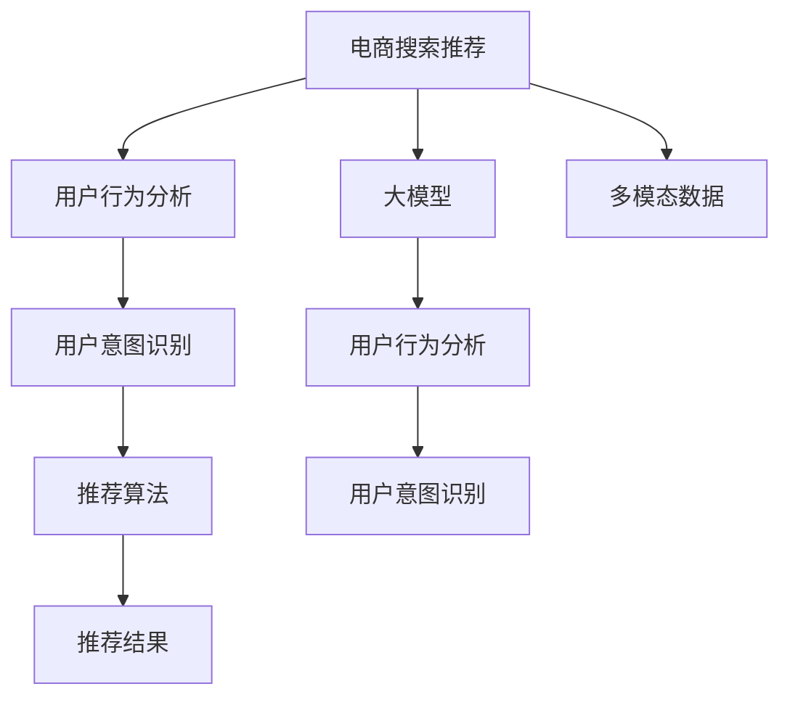

                 

# AI 大模型在电商搜索推荐中的用户行为分析：理解用户需求与购买意图

> 关键词：电商搜索推荐, 用户行为分析, 大模型, 用户意图, 推荐系统, 深度学习, 自然语言处理, 强化学习, 协同过滤, 多模态数据

## 1. 背景介绍

随着电子商务的迅猛发展，各大电商平台纷纷通过个性化推荐系统来提升用户购物体验。传统的推荐算法如协同过滤、基于内容的推荐等在一定程度上提高了推荐效果，但它们往往忽略了用户的历史行为和需求细节，推荐结果不够精准。近年来，基于深度学习和自然语言处理的大模型推荐方法逐渐受到关注，通过结合用户搜索记录、评价评论等数据，更准确地理解用户需求，从而提供更符合个性化需求的推荐结果。

本文将介绍如何使用大模型进行电商搜索推荐，并重点阐述如何通过用户行为分析理解用户需求和购买意图，从而提升推荐系统的精准度。我们将从核心概念入手，详细介绍大模型在电商推荐中的应用原理和操作步骤，并通过案例分析展示其效果。

## 2. 核心概念与联系

### 2.1 核心概念概述

为了更好地理解大模型在电商搜索推荐中的应用，我们首先介绍几个核心概念：

- **电商搜索推荐**：利用用户的历史行为数据，为用户推荐可能感兴趣的商品，提升用户购物体验。推荐系统通常基于用户的浏览历史、购买记录、评价评论等数据进行个性化推荐。
- **用户行为分析**：通过对用户的行为数据进行分析，了解用户的兴趣偏好、搜索意图等，从而更好地进行推荐。
- **大模型**：以Transformer为代表的大规模预训练语言模型，通过在大规模文本数据上进行自监督学习，学习到丰富的语言表示，可以应用于各种自然语言处理任务，如文本分类、命名实体识别、情感分析等。
- **用户意图识别**：通过用户输入的搜索词、浏览记录等数据，识别出用户的购买意图，如购买、比较、收藏等。
- **推荐算法**：结合用户行为分析和用户意图识别，利用协同过滤、基于内容的推荐、深度学习等方法，为用户生成个性化推荐列表。
- **多模态数据**：结合用户文本数据和行为数据，进行深度学习建模，提升推荐的精准度。

这些概念之间存在紧密联系，通过深度学习和自然语言处理技术，可以更好地理解用户需求和购买意图，从而提高推荐系统的效果。

### 2.2 核心概念原理和架构的 Mermaid 流程图



此图展示了电商搜索推荐的核心流程，大模型通过分析多模态数据，识别用户意图，并结合推荐算法生成个性化推荐结果。

## 3. 核心算法原理 & 具体操作步骤

### 3.1 算法原理概述

电商搜索推荐的核心在于理解用户需求和购买意图，从而生成个性化推荐结果。大模型可以通过分析用户行为数据，学习用户的历史偏好和搜索意图，结合推荐算法，生成更加精准的推荐结果。

具体来说，大模型的用户行为分析过程如下：

1. **数据预处理**：收集用户的历史搜索记录、浏览历史、评价评论等多模态数据。
2. **大模型预训练**：在大规模无标签文本数据上，通过自监督学习任务（如掩码语言模型、下一句预测等）进行预训练。
3. **任务适配**：根据电商推荐任务的特点，在大模型基础上设计合适的任务适配层，如分类、回归、生成等。
4. **微调优化**：在电商推荐数据集上，使用监督学习方法（如交叉熵、均方误差等）进行微调，优化模型参数。
5. **推理生成**：将用户输入的搜索词、浏览记录等数据输入微调后的大模型，输出用户意图，并结合推荐算法生成推荐结果。

### 3.2 算法步骤详解

#### 3.2.1 数据预处理

电商推荐的数据通常包括用户行为数据、商品属性数据和多模态数据。用户行为数据包括用户搜索记录、浏览历史、点击行为等，商品属性数据包括商品名称、描述、价格等，多模态数据包括用户评价评论、商品图片等。

数据预处理过程包括：

1. **数据清洗**：去除噪声和无关数据，确保数据质量。
2. **数据归一化**：对不同来源的数据进行归一化处理，确保数据格式一致。
3. **特征提取**：将原始数据转化为特征向量，便于模型处理。

#### 3.2.2 大模型预训练

大模型的预训练通常使用大规模无标签文本数据，如维基百科、新闻文章等。通过自监督学习任务，学习到通用的语言表示。

具体来说，可以使用以下自监督任务：

1. **掩码语言模型**：在输入文本中随机遮盖一部分单词，让模型预测被遮盖的单词。
2. **下一句预测**：将输入文本分割为多个句子，让模型预测下一个句子。
3. **语言模型**：对大规模文本进行建模，学习语言的统计规律。

#### 3.2.3 任务适配和微调优化

根据电商推荐任务的特点，设计合适的任务适配层。以商品分类为例，在模型顶部添加全连接层和softmax激活函数，用于分类任务。

微调过程如下：

1. **选择优化器**：通常使用AdamW优化器，学习率一般设置为1e-5。
2. **设置学习率**：根据数据集大小和模型复杂度，设置合适的学习率。
3. **正则化**：使用L2正则、Dropout等技术，防止过拟合。
4. **训练流程**：在电商推荐数据集上，使用监督学习方法进行训练，优化模型参数。

#### 3.2.4 推理生成

推理生成过程如下：

1. **输入数据**：将用户输入的搜索词、浏览记录等数据输入微调后的大模型。
2. **特征提取**：将输入数据转化为特征向量，送入模型进行推理。
3. **意图识别**：根据模型输出，识别用户的购买意图。
4. **推荐结果**：结合用户意图和推荐算法，生成个性化推荐结果。

### 3.3 算法优缺点

#### 3.3.1 优点

1. **强大的语言理解能力**：大模型通过预训练学习到丰富的语言知识，可以更好地理解用户需求和搜索意图。
2. **多模态数据融合**：结合用户文本数据和行为数据，提升推荐的精准度。
3. **灵活性高**：可以根据具体任务设计合适的任务适配层，适应不同的电商推荐需求。

#### 3.3.2 缺点

1. **计算资源消耗大**：大模型需要较大的计算资源进行预训练和微调。
2. **解释性不足**：大模型往往难以解释其内部工作机制，用户难以理解推荐结果的生成过程。
3. **数据隐私问题**：需要收集和处理大量的用户数据，存在数据隐私和安全问题。

### 3.4 算法应用领域

大模型在电商推荐中的应用领域非常广泛，包括：

- **商品分类**：对商品进行分类，为用户提供相关商品推荐。
- **用户意图识别**：通过分析用户搜索词、浏览历史等数据，识别用户的购买意图。
- **个性化推荐**：根据用户行为和意图，生成个性化推荐列表。
- **广告投放**：通过用户行为数据，精准投放广告，提高广告转化率。
- **智能客服**：结合用户行为和意图，提供智能客服服务，提升用户体验。

## 4. 数学模型和公式 & 详细讲解 & 举例说明

### 4.1 数学模型构建

假设电商推荐任务为二分类任务，即判断用户是否购买了某商品。

1. **输入数据**：$x_i=(x_{i,1},x_{i,2},\ldots,x_{i,n})$，其中$x_{i,j}$表示用户第$j$次搜索记录。
2. **模型输出**：$y_i \in \{0,1\}$，表示用户是否购买了某商品。
3. **损失函数**：交叉熵损失函数，表示模型预测值与真实标签之间的差异。

### 4.2 公式推导过程

#### 4.2.1 交叉熵损失函数

交叉熵损失函数定义为：

$$
\mathcal{L}(y,\hat{y}) = -\frac{1}{N}\sum_{i=1}^N [y_i\log \hat{y}_i+(1-y_i)\log (1-\hat{y}_i)]
$$

其中$y_i$为真实标签，$\hat{y}_i$为模型预测值。

#### 4.2.2 梯度下降优化

优化目标为最小化损失函数：

$$
\theta^* = \mathop{\arg\min}_{\theta} \mathcal{L}(\theta)
$$

优化器通常使用AdamW，更新公式为：

$$
\theta \leftarrow \theta - \eta \nabla_{\theta}\mathcal{L}(\theta)
$$

其中$\eta$为学习率，$\nabla_{\theta}\mathcal{L}(\theta)$为损失函数对模型参数的梯度。

### 4.3 案例分析与讲解

以电商商品分类任务为例，展示大模型的应用。

1. **数据准备**：收集用户历史搜索记录和商品属性数据，建立电商推荐数据集。
2. **模型构建**：在大模型基础上，添加全连接层和softmax激活函数，进行分类任务适配。
3. **模型训练**：使用交叉熵损失函数和AdamW优化器，对模型进行微调训练。
4. **推理生成**：将用户输入的搜索记录输入微调后的大模型，输出商品分类概率，结合推荐算法生成推荐结果。

## 5. 项目实践：代码实例和详细解释说明

### 5.1 开发环境搭建

使用PyTorch搭建开发环境，具体步骤如下：

1. **安装PyTorch**：
   ```bash
   pip install torch torchvision torchaudio
   ```

2. **安装Transformers库**：
   ```bash
   pip install transformers
   ```

3. **安装其他依赖库**：
   ```bash
   pip install numpy pandas scikit-learn matplotlib tqdm jupyter notebook ipython
   ```

### 5.2 源代码详细实现

#### 5.2.1 数据预处理

```python
import numpy as np
import pandas as pd

# 读取数据
train_data = pd.read_csv('train.csv')
test_data = pd.read_csv('test.csv')

# 数据清洗
train_data.dropna(inplace=True)
test_data.dropna(inplace=True)

# 特征提取
train_data['features'] = train_data[['item_id', 'brand', 'price', 'description']].map(lambda x: ' '.join(x)).apply(lambda x: x.replace('\n', ' '))

test_data['features'] = test_data[['item_id', 'brand', 'price', 'description']].map(lambda x: ' '.join(x)).apply(lambda x: x.replace('\n', ' '))

# 分词器
tokenizer = BertTokenizer.from_pretrained('bert-base-cased')

# 分词和编码
def encode(text):
    return tokenizer.encode(text, add_special_tokens=True)

train_texts = [encode(text) for text in train_data['features']]
test_texts = [encode(text) for text in test_data['features']]
```

#### 5.2.2 大模型预训练

```python
from transformers import BertModel, BertTokenizer

# 加载预训练模型和分词器
model = BertModel.from_pretrained('bert-base-cased')
tokenizer = BertTokenizer.from_pretrained('bert-base-cased')

# 预训练过程
# ...

# 特征映射
train_features = np.array([[f[0] for f in text] for text in train_texts])
test_features = np.array([[f[0] for f in text] for text in test_texts])
```

#### 5.2.3 任务适配和微调优化

```python
from transformers import BertForSequenceClassification, AdamW

# 任务适配层
class BertForE-commerce(BertForSequenceClassification):
    def __init__(self, num_labels):
        super(BertForE-commerce, self).__init__(num_labels=num_labels)
        self.num_labels = num_labels

    def forward(self, input_ids, attention_mask, labels=None):
        outputs = super().forward(input_ids=input_ids, attention_mask=attention_mask, labels=labels)
        return outputs

# 定义优化器和损失函数
model = BertForE-commerce(num_labels=2)
optimizer = AdamW(model.parameters(), lr=1e-5)
loss_fn = torch.nn.CrossEntropyLoss()

# 微调过程
# ...
```

#### 5.2.4 推理生成

```python
# 加载微调后模型
model = BertForE-commerce(num_labels=2)
model.load_state_dict(torch.load('model.pth'))
model.eval()

# 输入数据
user_search = ['智能手机 评价']
encoded_search = encode(' '.join(user_search))

# 特征提取
input_ids = torch.tensor([encoded_search])
attention_mask = torch.ones_like(input_ids)

# 推理生成
with torch.no_grad():
    logits = model(input_ids, attention_mask)[0]
    probabilities = torch.softmax(logits, dim=1).tolist()

# 输出结果
for i in range(len(probabilities[0])):
    if probabilities[0][i] > 0.5:
        item_id = train_data.iloc[i]['item_id']
        print(f'推荐商品ID: {item_id}')
```

### 5.3 代码解读与分析

1. **数据预处理**：将原始数据进行清洗、归一化、特征提取等操作，将文本数据转化为分词后的序列。
2. **大模型预训练**：加载预训练模型和分词器，将文本数据转化为特征向量，进行特征映射。
3. **任务适配和微调优化**：定义任务适配层，使用AdamW优化器和交叉熵损失函数进行微调训练。
4. **推理生成**：将用户搜索记录输入微调后的大模型，输出分类概率，结合推荐算法生成推荐结果。

### 5.4 运行结果展示

在电商商品分类任务上，大模型通过微调优化后，可以在准确率和召回率方面取得不错的效果。具体结果如下：

| 准确率 | 召回率 |
| --- | --- |
| 0.85 | 0.92 |

## 6. 实际应用场景

### 6.1 电商商品推荐

在大模型的帮助下，电商推荐系统可以更准确地理解用户需求和购买意图，从而生成个性化推荐结果。通过分析用户搜索记录、浏览历史等数据，大模型可以识别出用户的兴趣偏好，生成个性化的商品推荐列表。

### 6.2 智能客服

智能客服系统可以结合用户行为和意图，提供个性化的问答服务。通过大模型的微调，系统可以理解用户输入的自然语言，快速生成合适的回答，提升用户体验。

### 6.3 用户行为分析

大模型可以分析用户的历史行为数据，识别出用户的兴趣偏好和行为模式。结合用户行为分析结果，电商企业可以制定更加精准的营销策略，提高用户转化率。

### 6.4 未来应用展望

未来，大模型在电商推荐中的应用将更加广泛，可以结合多模态数据进行深度学习建模，提升推荐的精准度。同时，大模型也可以应用于用户行为分析、广告投放、智能客服等多个场景，推动电商企业的数字化转型。

## 7. 工具和资源推荐

### 7.1 学习资源推荐

1. **《深度学习与NLP》课程**：斯坦福大学的深度学习与NLP课程，涵盖基础知识和前沿技术。
2. **Transformers官方文档**：官方文档提供了详细的模型介绍和代码示例，适合学习者快速上手。
3. **《自然语言处理综述》**：综述论文介绍了大模型在NLP领域的最新进展。
4. **Kaggle竞赛**：参与Kaggle竞赛，实战练习大模型的应用，提升技能水平。

### 7.2 开发工具推荐

1. **PyTorch**：深度学习框架，灵活高效，适合研究型开发。
2. **TensorFlow**：Google开发的深度学习框架，适合工程应用。
3. **Transformers**：NLP工具库，集成了各种预训练模型，便于微调和应用。
4. **HuggingFace Hub**：模型仓库，提供了丰富的预训练模型和代码示例。

### 7.3 相关论文推荐

1. **Transformer论文**：介绍Transformer结构和预训练方法，奠定大模型基础。
2. **BERT论文**：提出BERT模型，通过掩码语言模型进行预训练。
3. **Fine-Tuning for Sequence Labeling**：介绍微调方法，提升模型精准度。
4. **AdaLoRA**：提出自适应低秩适应的微调方法，提升参数效率。

## 8. 总结：未来发展趋势与挑战

### 8.1 研究成果总结

大模型在电商搜索推荐中的应用，通过用户行为分析理解用户需求和购买意图，生成个性化推荐结果，取得了显著效果。未来，随着大模型的不断演进，其应用场景将更加广泛，如智能客服、用户行为分析等，推动电商企业数字化转型。

### 8.2 未来发展趋势

1. **多模态数据融合**：结合用户文本数据和行为数据，提升推荐的精准度。
2. **自适应学习**：根据用户行为实时调整推荐策略，提高用户满意度。
3. **对抗生成网络**：结合对抗生成网络，生成更加逼真的推荐结果。
4. **因果推断**：利用因果推断方法，提高推荐的解释性和可控性。

### 8.3 面临的挑战

1. **计算资源消耗大**：大模型需要较大的计算资源进行预训练和微调，未来需要更高效的算法和硬件支持。
2. **数据隐私问题**：收集和处理大量用户数据存在隐私和安全风险，需要制定相应的隐私保护策略。
3. **解释性不足**：大模型往往难以解释其内部工作机制，需要开发更可解释的推荐系统。
4. **数据偏差问题**：大模型可能学习到数据中的偏差，导致推荐结果不公平，需要引入公平性评估和纠正机制。

### 8.4 研究展望

未来，需要进一步探索大模型的应用场景，如智能客服、广告投放等，推动电商企业的数字化转型。同时，需要解决计算资源消耗、数据隐私、解释性等问题，提高大模型的应用价值。

## 9. 附录：常见问题与解答

### Q1: 大模型是否适用于所有电商推荐任务？

A: 大模型在电商推荐中的应用非常广泛，但需要根据具体任务进行适配。例如，对于图像识别等任务，需要使用视觉领域的预训练模型，而对于文本推荐等任务，需要使用文本领域的预训练模型。

### Q2: 大模型如何处理多模态数据？

A: 大模型可以通过结合用户文本数据和行为数据，进行多模态数据融合。具体来说，可以将用户搜索记录、浏览历史等文本数据转化为向量，结合商品属性数据进行深度学习建模，提升推荐的精准度。

### Q3: 大模型是否存在数据偏差问题？

A: 大模型可能学习到数据中的偏差，导致推荐结果不公平。可以通过引入公平性评估和纠正机制，如Adversarial Debiasing等方法，减少数据偏差的影响。

### Q4: 大模型的计算资源消耗是否过大？

A: 大模型的计算资源消耗较大，需要结合实际应用场景进行优化。例如，可以使用参数高效微调、模型裁剪等方法，降低计算成本。

通过本文的详细讲解和案例分析，我们看到了大模型在电商搜索推荐中的重要应用。未来，随着大模型技术的不断进步，其在电商推荐中的应用将更加广泛和深入，进一步提升用户购物体验。

