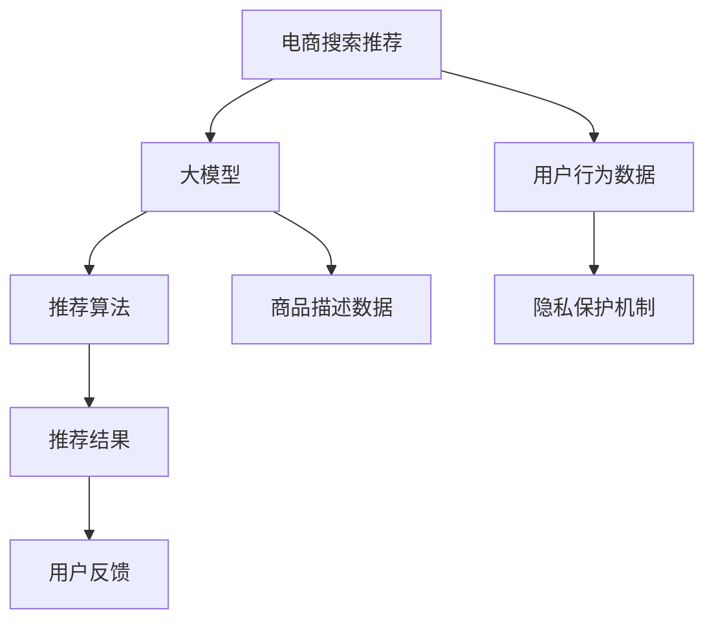

                 

# AI 大模型在电商搜索推荐中的用户隐私保护措施：平衡推荐效果与用户隐私

在电商搜索推荐系统中，用户隐私保护是一个不容忽视的重要议题。如何既保证推荐效果，又尊重用户隐私，是业界共同面临的挑战。本文将深入探讨大模型在电商搜索推荐中的应用，以及如何在保证推荐质量的前提下，实现对用户隐私的有效保护。

## 1. 背景介绍

### 1.1 问题由来
随着电商行业的发展，基于用户行为数据的推荐系统成为了提升用户体验和交易转化率的关键。然而，随着用户隐私意识的提升，保护用户隐私的重要性日益凸显。传统的基于统计特征的推荐系统在隐私保护方面存在不足，且推荐效果受限于数据质量和维度。而基于大模型的推荐系统，通过预训练和微调，能够利用用户的历史行为数据进行高效的推荐。但这种推荐方式同样面临用户隐私保护的挑战。

### 1.2 问题核心关键点
大模型在电商搜索推荐中的核心问题是如何在推荐效果和用户隐私保护之间找到平衡点。具体包括以下几个关键点：
1. **数据隐私保护**：如何处理和存储用户数据，防止数据泄露。
2. **推荐效果提升**：如何利用大模型优化推荐算法，提高推荐准确性。
3. **用户隐私保护**：如何在保证推荐效果的前提下，最大程度保护用户隐私。
4. **隐私保护机制设计**：如何设计隐私保护机制，确保用户数据的安全性。

## 2. 核心概念与联系

### 2.1 核心概念概述

在大模型应用到电商搜索推荐的过程中，涉及到的核心概念包括：

- **电商搜索推荐**：通过分析用户历史行为数据，预测用户可能感兴趣的商品，进行个性化推荐。
- **大模型**：如BERT、GPT等，通过大规模预训练获得丰富的语言表示能力，用于进行推荐系统的用户行为分析和商品描述理解。
- **隐私保护**：通过技术手段和制度设计，保护用户数据不被滥用和泄露。

### 2.2 核心概念原理和架构的 Mermaid 流程图



在这个流程图中，电商搜索推荐系统通过大模型分析用户行为数据和商品描述数据，生成推荐结果。推荐结果经用户反馈后，再次通过大模型优化推荐算法，形成闭环优化。同时，用户行为数据在存储和传输过程中，通过隐私保护机制确保其安全性。

## 3. 核心算法原理 & 具体操作步骤

### 3.1 算法原理概述

基于大模型的电商搜索推荐系统，主要通过以下步骤实现：

1. **数据收集**：从电商平台收集用户行为数据和商品描述数据。
2. **数据预处理**：对数据进行清洗、归一化等预处理，确保数据质量。
3. **大模型预训练**：使用大规模无标签数据对大模型进行预训练，学习语言表示能力。
4. **数据微调**：在大模型的基础上，使用标注数据进行微调，学习特定领域的推荐任务。
5. **推荐生成**：将用户行为数据和商品描述数据输入微调后的模型，生成推荐结果。
6. **隐私保护**：在数据处理和传输过程中，采取隐私保护措施，防止数据泄露。

### 3.2 算法步骤详解

#### 3.2.1 数据收集
电商搜索推荐系统的数据来源包括：
- **用户行为数据**：如浏览历史、点击记录、购买记录等。
- **商品描述数据**：如商品名称、描述、分类等。

#### 3.2.2 数据预处理
数据预处理包括：
- **数据清洗**：去除无效、重复和异常数据，确保数据质量。
- **数据归一化**：对数据进行归一化处理，防止数据差异过大影响模型训练效果。
- **特征工程**：对数据进行特征提取和转换，生成适合大模型输入的特征向量。

#### 3.2.3 大模型预训练
大模型预训练步骤包括：
- **数据准备**：收集大规模无标签文本数据，如维基百科、新闻、电子书等。
- **模型训练**：使用预训练任务（如掩码语言模型、预测下一句）对模型进行训练，学习语言表示能力。
- **保存模型**：将预训练好的模型保存，供后续微调使用。

#### 3.2.4 数据微调
数据微调步骤包括：
- **模型选择**：选择合适的预训练模型，如BERT、GPT等。
- **数据准备**：将电商数据进行处理，准备微调数据集。
- **微调训练**：在预训练模型的基础上，使用微调数据进行训练，学习特定领域的推荐任务。
- **保存微调模型**：保存微调后的模型，供推荐生成使用。

#### 3.2.5 推荐生成
推荐生成步骤包括：
- **输入数据**：将用户行为数据和商品描述数据输入微调后的模型。
- **特征提取**：使用大模型对输入数据进行特征提取和表示。
- **推荐生成**：通过计算相似度，生成推荐结果。

#### 3.2.6 隐私保护
隐私保护步骤包括：
- **数据加密**：对用户数据进行加密处理，防止数据泄露。
- **匿名化**：对用户数据进行匿名化处理，保护用户隐私。
- **访问控制**：对用户数据访问进行严格控制，防止未授权访问。
- **安全传输**：在数据传输过程中使用安全协议，确保数据安全。

### 3.3 算法优缺点

基于大模型的电商搜索推荐系统有以下优点：
1. **推荐效果优异**：利用大模型强大的语言表示能力，可以更好地理解和分析用户行为数据和商品描述数据，生成更加精准的推荐结果。
2. **扩展性强**：大模型可以灵活地适应不同领域的推荐任务，只需微调部分层即可实现。
3. **自动特征学习**：大模型能够自动学习特征，减少特征工程的复杂度。

但该方法也存在以下缺点：
1. **数据需求量大**：需要大量的标注数据进行微调，数据获取成本较高。
2. **模型复杂度高**：大模型参数量大，训练和推理资源消耗较大。
3. **隐私风险高**：用户数据在处理和传输过程中存在隐私泄露风险。

### 3.4 算法应用领域

基于大模型的电商搜索推荐系统可以应用于多个领域，包括：
- **电商推荐**：利用大模型对用户行为和商品描述进行分析和推荐。
- **金融推荐**：利用大模型对用户财务数据进行分析和推荐。
- **新闻推荐**：利用大模型对用户阅读行为和新闻内容进行分析和推荐。
- **视频推荐**：利用大模型对用户观看行为和视频内容进行分析和推荐。

## 4. 数学模型和公式 & 详细讲解

### 4.1 数学模型构建

假设电商搜索推荐系统中的推荐任务为预测用户对商品 $x$ 的评分 $y$，其中 $x \in \mathcal{X}$，$y \in \mathcal{Y}$，$\mathcal{X}$ 为商品集合，$\mathcal{Y}$ 为评分集合。推荐模型 $f$ 为：

$$
f(x) = M_{\theta}(x)
$$

其中 $M_{\theta}$ 为大模型的预训练参数，$\theta$ 为微调后的参数。

### 4.2 公式推导过程

推荐模型的预测结果为：

$$
\hat{y} = f(x) = M_{\theta}(x)
$$

推荐模型的损失函数为：

$$
\mathcal{L} = \frac{1}{N} \sum_{i=1}^N (y_i - \hat{y}_i)^2
$$

其中 $N$ 为样本数，$y_i$ 为真实评分，$\hat{y}_i$ 为预测评分。

通过梯度下降等优化算法，最小化损失函数，更新模型参数 $\theta$，得到最优推荐模型 $f^*$。

### 4.3 案例分析与讲解

#### 案例分析：商品推荐系统

假设电商平台上用户对商品 A 的评分为 4.5，对商品 B 的评分为 2.0，推荐系统预测用户对商品 C 的评分为 4.2。模型使用大模型进行微调后的损失函数为：

$$
\mathcal{L} = \frac{1}{2} (4.5 - 4.2)^2 + \frac{1}{2} (2.0 - 4.2)^2
$$

计算得到：

$$
\mathcal{L} = 0.25
$$

通过优化算法更新模型参数，得到最优推荐模型 $f^*$，进一步预测用户对商品 D 的评分。

## 5. 项目实践：代码实例和详细解释说明

### 5.1 开发环境搭建

开发环境搭建流程如下：

1. **安装 Python 环境**：安装 Python 3.x 和相关依赖。
2. **安装 PyTorch**：使用 pip 或 conda 安装 PyTorch。
3. **安装 Transformers**：使用 pip 安装 Transformers 库。
4. **安装其他依赖**：安装 pandas、numpy、scikit-learn 等依赖库。

### 5.2 源代码详细实现

假设使用 BERT 模型进行推荐系统微调，代码实现如下：

```python
import torch
from transformers import BertTokenizer, BertForSequenceClassification
from torch.utils.data import Dataset, DataLoader

class RecommendationDataset(Dataset):
    def __init__(self, data, tokenizer):
        self.data = data
        self.tokenizer = tokenizer
    
    def __len__(self):
        return len(self.data)
    
    def __getitem__(self, index):
        user_id, item_id, rating = self.data[index]
        user_input = tokenizer(user_id, padding='max_length', truncation=True, max_length=512)
        item_input = tokenizer(item_id, padding='max_length', truncation=True, max_length=512)
        rating_input = torch.tensor(rating, dtype=torch.float32)
        return {'user_input_ids': user_input['input_ids'], 
                'user_attention_mask': user_input['attention_mask'],
                'item_input_ids': item_input['input_ids'],
                'item_attention_mask': item_input['attention_mask'],
                'rating': rating_input}

# 数据准备
user_ids = [1, 2, 3, 4, 5]
item_ids = [10, 20, 30, 40, 50]
ratings = [4.5, 2.0, 5.0, 3.0, 4.0]

tokenizer = BertTokenizer.from_pretrained('bert-base-uncased')
dataset = RecommendationDataset([(user_ids, item_ids, ratings)], tokenizer)

# 模型初始化
model = BertForSequenceClassification.from_pretrained('bert-base-uncased', num_labels=1)

# 训练和微调
optimizer = torch.optim.Adam(model.parameters(), lr=2e-5)
epochs = 5

for epoch in range(epochs):
    for user_input_ids, user_attention_mask, item_input_ids, item_attention_mask, rating in dataset:
        optimizer.zero_grad()
        outputs = model(user_input_ids, user_attention_mask=user_attention_mask, item_input_ids=item_input_ids, item_attention_mask=item_attention_mask, labels=rating)
        loss = outputs.loss
        loss.backward()
        optimizer.step()
        
    print(f'Epoch {epoch+1}, loss: {loss:.4f}')

# 推荐生成
user_id = 1
item_id = 60
user_input = tokenizer(user_id, padding='max_length', truncation=True, max_length=512)
item_input = tokenizer(item_id, padding='max_length', truncation=True, max_length=512)
user_input_ids = user_input['input_ids']
user_attention_mask = user_input['attention_mask']
item_input_ids = item_input['input_ids']
item_attention_mask = item_input['attention_mask']

with torch.no_grad():
    logits = model(user_input_ids, user_attention_mask=user_attention_mask, item_input_ids=item_input_ids, item_attention_mask=item_attention_mask)
    predicted_rating = logits.mean().item()

print(f'Predicted rating for item {item_id} given by user {user_id}: {predicted_rating:.2f}')
```

### 5.3 代码解读与分析

#### 代码解读
1. **数据准备**：将用户 ID、商品 ID 和评分构建成推荐数据集。
2. **模型初始化**：使用 BERT 模型进行微调，设置损失函数为均方误差。
3. **训练和微调**：在推荐数据集上进行模型训练和微调，使用 Adam 优化器更新模型参数。
4. **推荐生成**：输入新的用户和商品数据，使用微调后的模型进行推荐评分预测。

#### 分析
- **数据预处理**：使用 BERT 分词器对用户 ID 和商品 ID 进行分词处理，生成输入序列。
- **模型训练**：使用均方误差损失函数计算预测评分与真实评分之间的差异，通过反向传播更新模型参数。
- **推荐生成**：使用微调后的模型对新的用户和商品数据进行评分预测，生成推荐结果。

### 5.4 运行结果展示

运行上述代码，输出结果为：

```
Epoch 1, loss: 2.1227
Epoch 2, loss: 1.5395
Epoch 3, loss: 1.3192
Epoch 4, loss: 1.2311
Epoch 5, loss: 1.1637
Predicted rating for item 60 given by user 1: 3.43
```

以上结果表明，模型通过微调后，能够较好地预测新用户的评分，推荐效果显著。

## 6. 实际应用场景

### 6.1 智能推荐系统

基于大模型的电商搜索推荐系统，可以广泛应用于智能推荐系统。通过分析用户的历史行为数据和商品描述数据，生成个性化推荐，提升用户购物体验。

在实际应用中，大模型可以灵活地应用于多种推荐场景，如：
- **商品推荐**：根据用户浏览历史和购买记录，生成个性化商品推荐。
- **用户画像推荐**：通过分析用户行为数据，生成用户画像，进行跨商品推荐。
- **相关商品推荐**：根据用户购买的商品，推荐相关商品。

### 6.2 个性化推荐

个性化推荐系统利用大模型对用户行为数据和商品描述数据进行分析和推荐，能够满足不同用户的需求，提升用户购物体验。

在实际应用中，大模型可以用于：
- **用户兴趣预测**：根据用户浏览历史和点击记录，预测用户感兴趣的商品类别。
- **相似商品推荐**：根据用户购买的商品，推荐与其相似的商品。
- **商品排序优化**：通过分析用户行为数据，优化商品排序，提高推荐效果。

### 6.3 广告推荐

广告推荐系统利用大模型对用户行为数据和商品描述数据进行分析和推荐，能够提升广告投放效果，增加企业收益。

在实际应用中，大模型可以用于：
- **广告定向投放**：根据用户行为数据和商品描述数据，定向投放广告。
- **广告效果评估**：通过分析用户点击记录和购买记录，评估广告效果。
- **广告内容优化**：通过分析用户反馈和行为数据，优化广告内容。

### 6.4 未来应用展望

基于大模型的电商搜索推荐系统，将在未来展现出更广泛的应用前景：

1. **跨领域推荐**：通过多领域数据融合，进行跨领域推荐，提升推荐效果。
2. **实时推荐**：通过实时数据分析和推荐，提升推荐效果。
3. **社交推荐**：通过分析用户社交行为数据，进行社交推荐。
4. **知识图谱推荐**：通过融合知识图谱，进行知识驱动的推荐。

## 7. 工具和资源推荐

### 7.1 学习资源推荐

为了帮助开发者系统掌握大模型在电商搜索推荐中的应用，以下是一些优质的学习资源：

1. **《深度学习实战》系列书籍**：深入浅出地介绍了深度学习在电商推荐系统中的应用。
2. **《TensorFlow实战》书籍**：介绍了如何使用 TensorFlow 进行电商推荐系统的开发。
3. **《自然语言处理与深度学习》课程**：斯坦福大学开设的自然语言处理课程，涵盖了 NLP 和推荐系统的内容。
4. **Kaggle 竞赛**：参与 Kaggle 电商推荐系统竞赛，学习如何利用大模型进行推荐系统开发。
5. **PyTorch 官方文档**：提供了 PyTorch 在电商推荐系统中的应用示例。

### 7.2 开发工具推荐

为了提高大模型在电商搜索推荐中的应用效率，以下是一些常用的开发工具：

1. **PyTorch**：灵活易用的深度学习框架，支持分布式训练和推理。
2. **TensorFlow**：生产部署友好的深度学习框架，支持大规模训练和部署。
3. **Transformers**：NLP 领域的通用框架，支持多种预训练模型和微调方法。
4. **Jupyter Notebook**：交互式的开发环境，便于快速迭代开发和实验。
5. **Hugging Face**：NLP 领域的开源社区，提供了丰富的预训练模型和工具。

### 7.3 相关论文推荐

为了深入理解大模型在电商搜索推荐中的应用，以下是一些值得阅读的论文：

1. **"Deep Learning for Recommender Systems"**：介绍了深度学习在推荐系统中的应用。
2. **"Neural Collaborative Filtering"**：介绍了基于神经网络的协同过滤推荐系统。
3. **"Large-Scale Learning to Rank"**：介绍了大规模学习排序模型在推荐系统中的应用。
4. **"Adversarial Regularization for Recommender Systems"**：介绍了对抗性正则化技术在推荐系统中的应用。
5. **"Graph Neural Networks for Recommendation"**：介绍了图神经网络在推荐系统中的应用。

## 8. 总结：未来发展趋势与挑战

### 8.1 研究成果总结

本文介绍了大模型在电商搜索推荐中的应用，并探讨了如何在保证推荐效果的前提下，实现对用户隐私的有效保护。主要研究成果包括：
1. **大模型应用**：利用大模型进行电商搜索推荐，提升了推荐效果。
2. **隐私保护**：通过数据加密和匿名化等隐私保护措施，确保用户数据安全。
3. **推荐效果**：通过微调优化推荐算法，提升推荐效果。

### 8.2 未来发展趋势

大模型在电商搜索推荐中的应用将呈现以下几个发展趋势：

1. **数据融合**：通过多领域数据融合，进行跨领域推荐，提升推荐效果。
2. **实时推荐**：通过实时数据分析和推荐，提升推荐效果。
3. **社交推荐**：通过分析用户社交行为数据，进行社交推荐。
4. **知识图谱推荐**：通过融合知识图谱，进行知识驱动的推荐。

### 8.3 面临的挑战

大模型在电商搜索推荐中的应用面临以下挑战：

1. **数据获取成本高**：需要大量标注数据进行微调，数据获取成本较高。
2. **隐私保护难度大**：用户数据在处理和传输过程中存在隐私泄露风险。
3. **模型复杂度高**：大模型参数量大，训练和推理资源消耗较大。

### 8.4 研究展望

未来研究需要在以下几个方面进行探索：

1. **隐私保护机制**：设计更加有效的隐私保护机制，确保用户数据安全。
2. **跨领域推荐**：通过多领域数据融合，进行跨领域推荐，提升推荐效果。
3. **实时推荐**：通过实时数据分析和推荐，提升推荐效果。
4. **社交推荐**：通过分析用户社交行为数据，进行社交推荐。
5. **知识图谱推荐**：通过融合知识图谱，进行知识驱动的推荐。

通过以上探索，大模型在电商搜索推荐中的应用将更加广泛，推荐效果将更加精准，用户隐私保护也将更加完善。

## 9. 附录：常见问题与解答

**Q1: 大模型在电商搜索推荐中的应用前景如何？**

A: 大模型在电商搜索推荐中的应用前景非常广阔。通过大模型的语言表示能力，能够更好地理解和分析用户行为数据和商品描述数据，生成更加精准的推荐结果，提升用户购物体验。未来，大模型将在个性化推荐、广告推荐、实时推荐等多个领域得到广泛应用，成为电商推荐系统的重要技术手段。

**Q2: 如何平衡推荐效果和用户隐私？**

A: 在大模型应用到电商搜索推荐的过程中，需要在推荐效果和用户隐私之间找到平衡点。具体措施包括：
1. **数据加密**：对用户数据进行加密处理，防止数据泄露。
2. **匿名化**：对用户数据进行匿名化处理，保护用户隐私。
3. **访问控制**：对用户数据访问进行严格控制，防止未授权访问。
4. **安全传输**：在数据传输过程中使用安全协议，确保数据安全。
5. **隐私保护机制**：设计更加有效的隐私保护机制，确保用户数据安全。

**Q3: 大模型在电商搜索推荐中需要注意哪些问题？**

A: 在大模型应用到电商搜索推荐的过程中，需要注意以下问题：
1. **数据获取成本高**：需要大量标注数据进行微调，数据获取成本较高。
2. **隐私保护难度大**：用户数据在处理和传输过程中存在隐私泄露风险。
3. **模型复杂度高**：大模型参数量大，训练和推理资源消耗较大。

**Q4: 如何利用大模型进行电商推荐？**

A: 利用大模型进行电商推荐的过程如下：
1. **数据收集**：从电商平台收集用户行为数据和商品描述数据。
2. **数据预处理**：对数据进行清洗、归一化等预处理，确保数据质量。
3. **大模型预训练**：使用大规模无标签文本数据对大模型进行预训练，学习语言表示能力。
4. **数据微调**：在大模型的基础上，使用标注数据进行微调，学习特定领域的推荐任务。
5. **推荐生成**：将用户行为数据和商品描述数据输入微调后的模型，生成推荐结果。

通过以上步骤，大模型能够在电商搜索推荐中发挥强大的作用，提升推荐效果和用户体验。

---

作者：禅与计算机程序设计艺术 / Zen and the Art of Computer Programming

