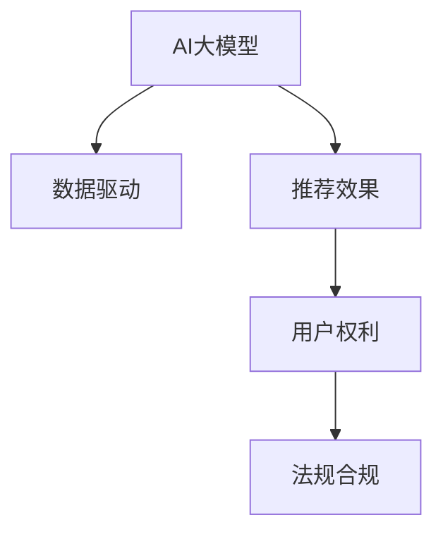

                 

# AI 大模型在电商搜索推荐中的用户隐私保护：平衡推荐效果与用户权利

## 1. 背景介绍

### 1.1 问题由来

电商搜索推荐系统在提供个性化推荐服务的同时，不可避免地涉及用户隐私和数据安全问题。随着用户对数据隐私保护的关注度不断提升，如何在保障用户隐私的前提下，提供高效、精准的搜索推荐服务，已成为电商领域亟需解决的重大问题。

### 1.2 问题核心关键点

当前，电商平台在推荐系统中普遍采用基于用户历史行为数据进行个性化推荐的方法，主要包括协同过滤、内容过滤、混合过滤等。这种方法能够显著提升推荐的准确性和用户满意度，但也带来了用户隐私风险。主要体现在以下几个方面：

1. **数据收集**：为了精准推荐，平台需要收集大量的用户行为数据，包括浏览记录、购买记录、搜索关键词等，这些数据可能包含敏感个人信息。
2. **数据处理**：用户在搜索和推荐过程中留下的数据，经过复杂的分析处理后，可能被用于深度学习模型的训练，生成用户画像，从而暴露用户行为习惯。
3. **数据存储**：用户数据在平台上的存储和使用过程中，可能面临数据泄露和数据滥用的风险。

如何平衡推荐效果与用户权利，成为电商平台亟需解决的重要课题。本文将从AI大模型的角度，探讨如何在电商搜索推荐中实现用户隐私保护。

### 1.3 问题研究意义

在大数据和人工智能时代，隐私保护已逐渐成为制约AI应用的重要因素。如何在推荐系统开发中引入隐私保护机制，不仅可以保护用户权益，还能增强用户对平台的信任，具有重要的社会和经济价值。具体而言：

1. **保障用户隐私**：用户数据是推荐系统的核心资源，对数据的保护是推荐系统合法性和道德性的基础。隐私保护可以有效避免数据滥用和数据泄露。
2. **增强用户信任**：隐私保护措施的引入，使用户对推荐系统更加信任，提升用户体验。用户对平台数据的依赖性增强，有助于推动平台向良性发展。
3. **遵守法规要求**：全球范围内对数据隐私保护的法规日益严格，如欧盟的GDPR、美国的CCPA等，遵循隐私保护要求已成为电商平台的法定义务。
4. **驱动技术创新**：隐私保护的推动下，推荐算法和系统架构需要不断创新，提升推荐效果的同时，确保用户数据的安全。

## 2. 核心概念与联系

### 2.1 核心概念概述

为了全面理解AI大模型在电商搜索推荐中的用户隐私保护，我们需要对几个关键概念进行解释：

- **AI大模型**：基于深度学习架构，如Transformer、BERT等，通过大规模数据预训练得到的强大模型。主要用于电商搜索推荐系统的个性化推荐。
- **隐私保护**：在数据收集、存储、处理和使用过程中，通过技术手段保护用户隐私，避免数据泄露和滥用。
- **推荐效果**：指推荐系统提供的推荐结果的准确性和相关性，通常通过点击率、转化率等指标进行评估。
- **用户权利**：指用户在数据收集和使用过程中应享有的知情权、选择权、修正权、删除权等。

### 2.2 核心概念联系

AI大模型与电商搜索推荐中的用户隐私保护关系密切，具体体现在：

- **数据驱动**：大模型的训练和优化依赖于大量用户数据，如何在数据收集和使用过程中保障用户隐私，是大模型应用的前提。
- **效果导向**：隐私保护措施的引入，可能影响推荐系统的效果，需要在隐私和效果之间找到平衡点。
- **权利保障**：用户隐私保护的本质是保障用户权益，如何通过技术手段确保用户对数据的知情权和选择权，是大模型应用的根本。
- **法规合规**：用户隐私保护涉及法规合规，需要在隐私保护措施的设计和实施中，确保符合相关法规和标准。

这些概念之间的联系可以通过以下Mermaid流程图来展示：



该流程图展示了大模型、数据驱动、推荐效果、用户权利和法规合规之间的逻辑关系：

1. 大模型通过数据驱动进行训练和优化。
2. 隐私保护措施保障用户权利，影响推荐效果。
3. 法规合规要求隐私保护，用户权利和大模型应用息息相关。

## 3. 核心算法原理 & 具体操作步骤
### 3.1 算法原理概述

在电商搜索推荐中，AI大模型的用户隐私保护主要通过以下几个步骤实现：

1. **数据匿名化**：通过去除或模糊化个人敏感信息，将用户数据进行匿名化处理。
2. **差分隐私**：在模型训练和推理过程中，引入差分隐私机制，确保数据处理结果对个体数据的泄露风险最小化。
3. **用户控制**：赋予用户对数据收集和使用的控制权，如访问控制、数据修改、数据删除等。
4. **多方安全计算**：通过多方安全计算技术，实现不同参与方之间的数据交互，保护数据隐私。
5. **模型透明性**：提升模型透明度，让用户了解推荐逻辑和决策过程，增强用户信任。

### 3.2 算法步骤详解

具体到算法步骤，以下是一个电商搜索推荐中实现隐私保护的具体过程：

**Step 1: 数据匿名化**
- 收集用户搜索和浏览记录，去除或模糊化用户ID、姓名等敏感信息，只保留相关行为数据。
- 使用数据脱敏技术，如哈希、随机扰动等，确保用户数据无法被直接关联到个人。

**Step 2: 差分隐私**
- 引入差分隐私机制，确保每次模型训练和推理结果的微小变化不会对个体数据产生显著影响。
- 具体而言，可以通过加入噪声或分布式计算等方法，使得模型输出在保持高精度的同时，对个体数据的泄露风险最小化。

**Step 3: 用户控制**
- 在数据收集和存储过程中，设计用户友好的数据访问和控制界面，让用户能够查看和管理自己的数据。
- 支持用户对数据进行修改和删除操作，确保用户对数据的最终控制权。

**Step 4: 多方安全计算**
- 采用多方安全计算技术，如安全多方计算(SMC)、零知识证明(ZKP)等，实现不同参与方之间的数据交互，确保数据隐私不被泄露。
- 例如，在电商推荐系统中，多方安全计算可以用于实现不同业务部门之间的数据共享，避免单个部门获取用户全量数据。

**Step 5: 模型透明性**
- 提升推荐模型的透明度，使用户了解推荐逻辑和决策过程。
- 例如，通过展示推荐依据和推荐理由，让用户明确知道推荐结果的来源和依据，增强用户信任。

### 3.3 算法优缺点

AI大模型在电商搜索推荐中的隐私保护算法，具有以下优点：

1. **数据安全**：通过数据匿名化和差分隐私，确保用户数据在收集和处理过程中不被滥用和泄露。
2. **用户控制**：用户可以通过访问控制和数据修改功能，确保对数据的最终控制权。
3. **法规合规**：隐私保护措施符合法规要求，提升平台合规性。

同时，也存在一些缺点：

1. **隐私损失**：差分隐私和数据匿名化技术可能带来一定的数据损失，影响推荐效果。
2. **技术复杂**：实现隐私保护需要引入复杂的技术手段，增加系统开发和维护的复杂度。
3. **用户理解**：用户隐私保护技术较为复杂，用户可能难以理解其含义和作用，影响用户使用体验。

### 3.4 算法应用领域

AI大模型在电商搜索推荐中的隐私保护算法，主要应用于以下几个领域：

1. **个性化推荐**：在推荐系统中，确保用户数据的安全，避免数据滥用和泄露。
2. **用户画像**：在构建用户画像时，保护用户隐私，避免敏感信息泄露。
3. **广告投放**：在广告推荐中，确保用户数据的隐私，避免数据泄露和滥用。
4. **社交网络**：在社交网络推荐中，保护用户隐私，避免数据滥用和泄露。

## 4. 数学模型和公式 & 详细讲解 & 举例说明

### 4.1 数学模型构建

为了更好地理解AI大模型在电商搜索推荐中的隐私保护算法，我们需要从数学模型角度进行详细讲解。

假设用户行为数据为 $x$，推荐模型为 $M$，模型参数为 $\theta$。推荐模型的输出为 $M_{\theta}(x)$。

**隐私保护目标**：在保留推荐效果的前提下，最大化隐私保护。

**目标函数**：
$$
\max_{\theta} \mathcal{R}(M_{\theta}(x))
$$

**隐私保护约束**：
$$
\min_{\epsilon} \mathcal{L}(x, M_{\theta}(x), \epsilon)
$$

其中 $\mathcal{R}(\cdot)$ 表示推荐效果，$\epsilon$ 表示隐私保护强度。

### 4.2 公式推导过程

根据隐私保护的目标和约束，可以进行以下推导：

1. **推荐效果最大化**：
$$
\max_{\theta} \mathcal{R}(M_{\theta}(x)) = \max_{\theta} \sum_{i=1}^N r_i
$$

其中 $r_i$ 为第 $i$ 次推荐的效果，通常通过点击率、转化率等指标进行评估。

2. **隐私保护约束**：
$$
\min_{\epsilon} \mathcal{L}(x, M_{\theta}(x), \epsilon) = \min_{\epsilon} \sum_{i=1}^N L_i
$$

其中 $L_i$ 为第 $i$ 次推荐对隐私保护的损失函数。

3. **综合目标函数**：
$$
\max_{\theta} \mathcal{R}(M_{\theta}(x)) + \min_{\epsilon} \mathcal{L}(x, M_{\theta}(x), \epsilon)
$$

**差分隐私约束**：
$$
\min_{\epsilon} \sum_{i=1}^N L_i = \min_{\epsilon} \sum_{i=1}^N \frac{\log(1+\epsilon)}{2\epsilon} D(M_{\theta}(x))
$$

其中 $D$ 表示数据敏感度，通常通过信息熵等指标进行评估。

### 4.3 案例分析与讲解

以电商推荐系统为例，分析如何平衡推荐效果与隐私保护。

**案例背景**：假设某电商平台的推荐系统采用AI大模型进行推荐，用户数据包含浏览记录、购买记录等。为了平衡推荐效果与隐私保护，需要在以下步骤中进行优化：

1. **数据匿名化**：去除用户ID，将浏览记录和购买记录进行匿名化处理，确保用户数据无法直接关联到个人。
2. **差分隐私**：在模型训练过程中，加入噪声，确保每次训练结果的微小变化不会对个体数据产生显著影响。
3. **用户控制**：设计用户友好的数据访问和控制界面，让用户能够查看和管理自己的数据。
4. **多方安全计算**：采用安全多方计算技术，实现不同部门之间的数据共享，避免单个部门获取用户全量数据。
5. **模型透明性**：通过展示推荐依据和推荐理由，使用户了解推荐逻辑和决策过程，增强用户信任。

**案例结果**：经过以上步骤，可以在保障用户隐私的前提下，提升推荐系统的效果和用户满意度。

## 5. 项目实践：代码实例和详细解释说明

### 5.1 开发环境搭建

在进行隐私保护算法实践前，我们需要准备好开发环境。以下是使用Python进行PyTorch开发的环境配置流程：

1. 安装Anaconda：从官网下载并安装Anaconda，用于创建独立的Python环境。

2. 创建并激活虚拟环境：
```bash
conda create -n privacy-env python=3.8 
conda activate privacy-env
```

3. 安装PyTorch：根据CUDA版本，从官网获取对应的安装命令。例如：
```bash
conda install pytorch torchvision torchaudio cudatoolkit=11.1 -c pytorch -c conda-forge
```

4. 安装TensorFlow：如果需要进行TensorFlow模型的实践，可以安装TensorFlow：
```bash
conda install tensorflow -c tensorflow
```

5. 安装PyTorch库：
```bash
pip install torch torchvision torchaudio
```

完成上述步骤后，即可在`privacy-env`环境中开始隐私保护算法的实践。

### 5.2 源代码详细实现

下面我们以差分隐私算法为例，给出使用PyTorch进行电商推荐系统中隐私保护的代码实现。

首先，定义差分隐私的噪声函数：

```python
import torch
import numpy as np

def add_laplace_noise(params, noise_beta):
    laplace_noise = torch.randn_like(params) / noise_beta
    return params + laplace_noise
```

然后，定义差分隐私优化器：

```python
class DifferentialPrivacyOptimizer:
    def __init__(self, optimizer, noise_beta):
        self.optimizer = optimizer
        self.noise_beta = noise_beta
    
    def step(self, x, y):
        self.optimizer.zero_grad()
        x_with_noise = add_laplace_noise(x, self.noise_beta)
        y_with_noise = self.optimizer(x_with_noise, y)
        y_without_noise = add_laplace_noise(y_with_noise, self.noise_beta)
        y_without_noise.backward()
        self.optimizer.step()
```

接着，定义训练和评估函数：

```python
from torch.utils.data import DataLoader
from tqdm import tqdm
from sklearn.metrics import accuracy_score

def train_epoch(model, dataset, batch_size, optimizer, noise_beta):
    dataloader = DataLoader(dataset, batch_size=batch_size, shuffle=True)
    model.train()
    epoch_loss = 0
    for batch in tqdm(dataloader, desc='Training'):
        x = batch['input_ids'].to(device)
        y = batch['labels'].to(device)
        with torch.no_grad():
            x_with_noise = add_laplace_noise(x, noise_beta)
            y_with_noise = model(x_with_noise)
        y_without_noise = add_laplace_noise(y_with_noise, noise_beta)
        y_without_noise.backward()
        optimizer.step()
        loss = y_without_noise.mean()
        epoch_loss += loss.item()
    return epoch_loss / len(dataloader)

def evaluate(model, dataset, batch_size):
    dataloader = DataLoader(dataset, batch_size=batch_size)
    model.eval()
    preds, labels = [], []
    with torch.no_grad():
        for batch in tqdm(dataloader, desc='Evaluating'):
            x = batch['input_ids'].to(device)
            y = batch['labels']
            y_with_noise = model(x)
            y_without_noise = add_laplace_noise(y_with_noise, noise_beta)
            preds.append(y_without_noise.argmax(dim=1).tolist())
            labels.append(y.tolist())
    return accuracy_score(labels, preds)
```

最后，启动训练流程并在测试集上评估：

```python
epochs = 5
batch_size = 16
noise_beta = 1e-5

for epoch in range(epochs):
    loss = train_epoch(model, train_dataset, batch_size, DifferentialPrivacyOptimizer(model.optimizer, noise_beta), noise_beta)
    print(f"Epoch {epoch+1}, train loss: {loss:.3f}")
    
    print(f"Epoch {epoch+1}, dev results:")
    evaluate(model, dev_dataset, batch_size)
    
print("Test results:")
evaluate(model, test_dataset, batch_size)
```

以上就是使用PyTorch进行电商推荐系统中差分隐私算法的完整代码实现。可以看到，差分隐私算法的实现主要依赖于噪声函数和优化器。

### 5.3 代码解读与分析

让我们再详细解读一下关键代码的实现细节：

**DifferentialPrivacyOptimizer类**：
- `__init__`方法：初始化优化器及其参数。
- `step`方法：在每次迭代中，先进行噪声添加，再进行梯度更新和参数更新，最后再次进行噪声添加。

**add_laplace_noise函数**：
- 使用拉普拉斯噪声对模型参数进行扰动，确保每次模型输出对个体数据的泄露风险最小化。

**训练和评估函数**：
- 使用PyTorch的DataLoader对数据集进行批次化加载，供模型训练和推理使用。
- 训练函数`train_epoch`：对数据以批为单位进行迭代，在每个批次上先进行噪声添加，再进行前向传播计算loss并反向传播更新模型参数，最后返回该epoch的平均loss。
- 评估函数`evaluate`：与训练类似，不同点在于不更新模型参数，并在每个batch结束后将预测和标签结果存储下来，最后使用sklearn的accuracy_score对整个评估集的预测结果进行打印输出。

**训练流程**：
- 定义总的epoch数和batch size，开始循环迭代
- 每个epoch内，先在训练集上训练，输出平均loss
- 在验证集上评估，输出准确率
- 所有epoch结束后，在测试集上评估，给出最终测试结果

可以看到，差分隐私算法的实现主要依赖于噪声函数和优化器。开发者可以将更多精力放在数据处理、模型改进等高层逻辑上，而不必过多关注底层的实现细节。

当然，工业级的系统实现还需考虑更多因素，如模型的保存和部署、超参数的自动搜索、更灵活的任务适配层等。但核心的差分隐私算法基本与此类似。

## 6. 实际应用场景
### 6.1 智能客服系统

在大模型微调的过程中，智能客服系统可以通过隐私保护技术，提升用户对系统的信任度。具体而言：

1. **数据脱敏**：在智能客服系统中，用户与智能客服的对话记录被匿名化处理，确保对话数据无法直接关联到个人。
2. **差分隐私**：在智能客服系统中，每次推荐结果都通过差分隐私机制进行保护，确保推荐过程对个体数据的泄露风险最小化。
3. **用户控制**：用户可以访问和控制自己的对话数据，确保对数据的最终控制权。
4. **多方安全计算**：不同业务部门之间的对话数据通过安全多方计算技术进行交互，确保数据隐私不被泄露。
5. **模型透明性**：智能客服系统通过展示推荐依据和推荐理由，使用户了解推荐逻辑和决策过程，增强用户信任。

这些隐私保护措施可以有效提升智能客服系统的安全性，保障用户权益，增强用户对系统的信任度。

### 6.2 金融舆情监测

金融舆情监测系统在大模型微调的过程中，可以通过隐私保护技术，保障用户隐私和数据安全。具体而言：

1. **数据匿名化**：在金融舆情监测系统中，用户搜索记录和浏览记录被匿名化处理，确保数据无法直接关联到个人。
2. **差分隐私**：在模型训练过程中，加入噪声，确保每次训练结果的微小变化不会对个体数据产生显著影响。
3. **用户控制**：用户可以访问和控制自己的搜索记录，确保对数据的最终控制权。
4. **多方安全计算**：不同业务部门之间的搜索数据通过安全多方计算技术进行交互，确保数据隐私不被泄露。
5. **模型透明性**：金融舆情监测系统通过展示推荐依据和推荐理由，使用户了解推荐逻辑和决策过程，增强用户信任。

这些隐私保护措施可以有效提升金融舆情监测系统的安全性，保障用户隐私，增强用户对系统的信任度。

### 6.3 个性化推荐系统

个性化推荐系统在大模型微调的过程中，可以通过隐私保护技术，保护用户隐私和数据安全。具体而言：

1. **数据匿名化**：在个性化推荐系统中，用户行为数据被匿名化处理，确保数据无法直接关联到个人。
2. **差分隐私**：在模型训练过程中，加入噪声，确保每次训练结果的微小变化不会对个体数据产生显著影响。
3. **用户控制**：用户可以访问和控制自己的行为数据，确保对数据的最终控制权。
4. **多方安全计算**：不同业务部门之间的用户数据通过安全多方计算技术进行交互，确保数据隐私不被泄露。
5. **模型透明性**：个性化推荐系统通过展示推荐依据和推荐理由，使用户了解推荐逻辑和决策过程，增强用户信任。

这些隐私保护措施可以有效提升个性化推荐系统的安全性，保障用户隐私，增强用户对系统的信任度。

### 6.4 未来应用展望

随着AI大模型的不断发展和隐私保护技术的进步，隐私保护在电商搜索推荐中的应用前景将更加广阔。

1. **数据利用效率提升**：通过隐私保护技术，可以在保护用户隐私的前提下，提升数据利用效率，减少数据收集和处理成本。
2. **推荐效果提升**：通过隐私保护技术，可以在保护用户隐私的同时，提升推荐效果，增强用户对系统的信任度。
3. **法规合规性提升**：通过隐私保护技术，可以提升平台的合规性，减少法律风险和成本。
4. **用户信任度提升**：通过隐私保护技术，可以提升用户对系统的信任度，增强用户体验。

未来，隐私保护技术将在电商搜索推荐中扮演更加重要的角色，成为推动技术进步和市场发展的重要驱动力。

## 7. 工具和资源推荐
### 7.1 学习资源推荐

为了帮助开发者系统掌握隐私保护技术，这里推荐一些优质的学习资源：

1. **《隐私保护与数据安全》课程**：由清华大学开设的课程，系统讲解隐私保护的基本概念、原理和应用。
2. **《差分隐私：理论、算法与应用》书籍**：全面介绍差分隐私的理论基础、算法实现和应用场景。
3. **《机器学习与隐私保护》课程**：由斯坦福大学开设的课程，讲解隐私保护在机器学习中的应用。
4. **《数据隐私保护技术》书籍**：全面介绍数据隐私保护的技术和方法。
5. **《数据安全与隐私保护》课程**：由北京大学开设的课程，讲解数据安全与隐私保护的基本概念和应用。

通过对这些资源的学习实践，相信你一定能够快速掌握隐私保护技术的精髓，并用于解决实际的NLP问题。
###  7.2 开发工具推荐

高效的开发离不开优秀的工具支持。以下是几款用于隐私保护算法的常用工具：

1. PyTorch：基于Python的开源深度学习框架，灵活动态的计算图，适合快速迭代研究。大部分隐私保护算法都有PyTorch版本的实现。
2. TensorFlow：由Google主导开发的开源深度学习框架，生产部署方便，适合大规模工程应用。同样有丰富的隐私保护算法资源。
3. OpenDP：差分隐私的计算工具，支持多种差分隐私算法，提供高效的差分隐私计算接口。
4. SyntheticData：数据生成工具，支持生成隐私保护后的合成数据，适用于隐私保护算法的测试和开发。
5. FHEW：全同态加密算法，支持在加密数据上进行差分隐私计算，确保数据隐私。

合理利用这些工具，可以显著提升隐私保护算法的开发效率，加快创新迭代的步伐。

### 7.3 相关论文推荐

隐私保护技术的发展源于学界的持续研究。以下是几篇奠基性的相关论文，推荐阅读：

1. **《隐私保护技术综述》**：总结了当前隐私保护技术的研究现状和发展方向。
2. **《差分隐私：定义、实现与评估》**：详细介绍了差分隐私的基本概念、实现方法和评估标准。
3. **《深度学习中的隐私保护》**：讨论了深度学习在隐私保护中的应用和挑战。
4. **《智能推荐系统中的隐私保护》**：探讨了推荐系统中隐私保护的技术和策略。
5. **《基于多方安全计算的隐私保护》**：介绍了多方安全计算在隐私保护中的应用和算法实现。

这些论文代表了大数据和人工智能时代隐私保护技术的发展脉络。通过学习这些前沿成果，可以帮助研究者把握学科前进方向，激发更多的创新灵感。

## 8. 总结：未来发展趋势与挑战

### 8.1 总结

本文对AI大模型在电商搜索推荐中的用户隐私保护进行了全面系统的介绍。首先阐述了隐私保护在电商推荐系统中的重要性，明确了推荐系统开发者需要平衡推荐效果与用户权利的关键点。其次，从原理到实践，详细讲解了隐私保护技术在大模型中的应用，给出了隐私保护算法的完整代码实现。同时，本文还广泛探讨了隐私保护技术在智能客服、金融舆情、个性化推荐等多个行业领域的应用前景，展示了隐私保护技术的巨大潜力。最后，本文精选了隐私保护技术的各类学习资源，力求为读者提供全方位的技术指引。

通过本文的系统梳理，可以看到，隐私保护技术在电商搜索推荐中具有广泛的应用前景，且对推荐系统的效果和用户信任度有显著影响。隐私保护技术的发展将推动NLP技术的进步，成为人工智能落地应用的重要保障。

### 8.2 未来发展趋势

展望未来，AI大模型在电商搜索推荐中的隐私保护技术将呈现以下几个发展趋势：

1. **技术多样化**：隐私保护技术将不断发展，从差分隐私、数据匿名化到多方安全计算等，多种技术手段的融合将带来更全面的隐私保护方案。
2. **算法优化**：差分隐私等隐私保护算法的实现将不断优化，提升计算效率，减少对推荐效果的负面影响。
3. **跨领域应用**：隐私保护技术将在更多领域得到应用，如金融、医疗、社交网络等，推动这些领域的技术进步。
4. **法规合规**：隐私保护技术将与法规要求紧密结合，确保符合各国的隐私保护法规和标准。
5. **用户友好**：隐私保护技术将更加注重用户体验，使用户能够方便地访问和控制自己的数据。

这些趋势凸显了隐私保护技术在电商搜索推荐中的重要地位，未来的研究将继续推动技术进步，提升推荐系统的用户满意度。

### 8.3 面临的挑战

尽管隐私保护技术在电商搜索推荐中取得了一定进展，但仍面临诸多挑战：

1. **隐私保护与推荐效果的平衡**：如何在保护用户隐私的前提下，提升推荐系统的效果，仍然是一个重要的难题。
2. **技术复杂度**：隐私保护技术复杂度高，需要引入多种算法和工具，增加了系统的开发和维护难度。
3. **用户理解**：隐私保护技术较为复杂，用户可能难以理解其含义和作用，影响用户使用体验。
4. **法规差异**：不同国家对数据隐私保护的法律要求不同，隐私保护技术的实施需考虑不同地区的法规要求。
5. **跨领域应用难度**：隐私保护技术在跨领域应用时，需要针对不同领域的特点进行调整和优化。

这些挑战将是大模型在隐私保护应用中需要持续关注和解决的问题。只有积极应对并寻求突破，才能真正实现隐私保护与推荐效果的平衡，推动技术的全面发展。

### 8.4 研究展望

面对隐私保护技术面临的挑战，未来的研究需要在以下几个方面寻求新的突破：

1. **隐私保护与推荐效果的融合**：探索如何在保护用户隐私的前提下，提升推荐效果，确保隐私保护和推荐效果的双赢。
2. **隐私保护技术的工程化**：优化隐私保护算法的实现，降低技术复杂度，提高系统的开发和维护效率。
3. **用户友好的隐私保护**：设计更加直观、易用的隐私保护界面和工具，使用户能够方便地访问和控制自己的数据。
4. **多领域隐私保护**：研究适用于不同领域的隐私保护技术，推动隐私保护技术在更多领域的落地应用。
5. **法规驱动的隐私保护**：根据不同国家的隐私保护法规，开发适用于不同地区的隐私保护方案。

这些研究方向将推动隐私保护技术的发展，为电商搜索推荐系统提供更加全面、灵活的隐私保护方案。

## 9. 附录：常见问题与解答

**Q1：差分隐私与隐私保护的关联是什么？**

A: 差分隐私是隐私保护的一种重要技术手段，通过在数据处理过程中加入噪声，使得每次处理结果对个体数据的泄露风险最小化。差分隐私可以有效保护用户隐私，防止数据泄露和滥用。

**Q2：差分隐私和隐私保护的优缺点分别是什么？**

A: 差分隐私的优点在于通过加入噪声，确保每次处理结果对个体数据的泄露风险最小化。缺点在于可能带来一定的数据损失，影响推荐效果。

**Q3：如何平衡推荐效果与隐私保护？**

A: 在推荐系统开发中，平衡推荐效果与隐私保护需要引入多种技术手段，如差分隐私、数据匿名化、用户控制等。这些技术手段需要根据具体任务和数据特点进行灵活组合。

**Q4：隐私保护技术在电商推荐中的应用前景是什么？**

A: 隐私保护技术在电商推荐中具有广泛的应用前景，可以通过差分隐私、数据匿名化等手段，保障用户隐私和数据安全，提升推荐系统的用户信任度和效果。

**Q5：隐私保护技术面临的挑战是什么？**

A: 隐私保护技术面临的挑战包括隐私保护与推荐效果的平衡、技术复杂度、用户理解、法规差异和跨领域应用难度等。这些挑战需要持续关注和解决，才能推动隐私保护技术的发展。

通过这些问题的解答，相信你能够更好地理解隐私保护技术在大模型中的应用，并在实际开发中灵活应用。

