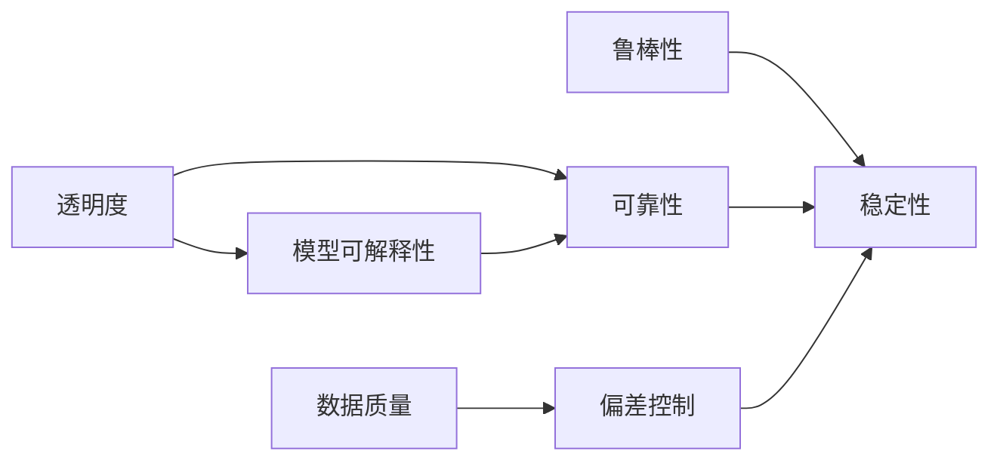

                 

## 1. 背景介绍

在AI时代，深度学习和大数据技术的迅猛发展，使AI技术在多个领域展现了卓越的性能，然而随着其应用的深入，透明度与可靠性的问题也日益凸显。无论是医疗诊断、金融风险预测，还是自动驾驶、智能客服，AI模型的决策过程变得愈发复杂，对模型透明度的要求也日益增高。本文将深入探讨透明度与可靠性的挑战，并从算法、模型、数据等多个角度，提出改进建议。

## 2. 核心概念与联系

### 2.1 核心概念概述

在探讨透明度与可靠性问题之前，首先明确几个核心概念：

- **透明度(Transparency)**：指模型内部决策过程的清晰性和可解释性。透明度高的模型能够展示其决策依据，便于用户理解和信任。
- **可靠性(Reliability)**：指模型在各种条件下的稳定性和预测准确性。可靠性强的模型能够提供可靠且一致的输出结果，避免因误判或异常导致严重后果。
- **模型可解释性(Interpretability)**：指模型能够清楚解释其预测结果的能力，可解释性高的模型便于理解和调试。
- **鲁棒性(Robustness)**：指模型面对噪声、对抗攻击、数据偏差等干扰的抵抗能力。

这些概念之间相互关联，共同构成了AI模型评估的核心框架。透明度和可解释性有助于提升可靠性，而鲁棒性则保证了模型在不同条件下的稳定输出。

### 2.2 核心概念原理和架构的 Mermaid 流程图



该流程图展示了透明度、模型可解释性、可靠性、鲁棒性以及数据质量之间的关系：

1. 透明度和模型可解释性有助于提升模型的可靠性。
2. 鲁棒性保证了模型在不同条件下的稳定输出。
3. 数据质量直接影响模型的鲁棒性和可靠性。

透明度与可靠性问题的解决，需要从模型设计、数据处理、算法优化等多个层面综合考虑。

## 3. 核心算法原理 & 具体操作步骤

### 3.1 算法原理概述

AI模型的透明度与可靠性，通常可以通过以下几个步骤来实现：

1. **模型设计**：选择合适的算法架构和激活函数，如ReLU、sigmoid等，增加模型的可解释性。
2. **特征工程**：通过特征选择和降维技术，减少模型的复杂度，提高透明度。
3. **正则化**：使用L1/L2正则化、Dropout等技术，防止模型过拟合，提高鲁棒性。
4. **模型压缩**：采用知识蒸馏、剪枝等技术，压缩模型规模，提升推理速度，提高可靠性。
5. **对抗训练**：引入对抗样本，提高模型的鲁棒性。

### 3.2 算法步骤详解

**Step 1: 设计透明可解释模型**

- **简单模型**：选择简单的模型架构，如线性回归、决策树等，便于解释和调试。
- **透明激活函数**：使用可解释的激活函数，如ReLU、sigmoid等，增加模型透明度。

**Step 2: 特征选择与降维**

- **特征选择**：通过统计特征、领域知识等方式，选择与任务相关的特征，减少冗余。
- **特征降维**：使用PCA、LDA等降维技术，降低特征维度，提高模型效率。

**Step 3: 正则化技术**

- **L1/L2正则**：使用L1或L2正则化，控制模型复杂度，防止过拟合。
- **Dropout**：随机丢弃神经元，增加模型泛化能力。

**Step 4: 对抗训练**

- **生成对抗样本**：利用对抗样本生成器，生成噪声样本，提高模型鲁棒性。
- **对抗训练**：在训练过程中加入对抗样本，增强模型对抗能力。

**Step 5: 模型压缩**

- **知识蒸馏**：使用蒸馏技术，将大模型知识传递给小模型，减少推理负担。
- **剪枝**：通过剪枝技术，去除冗余参数，提高模型效率。

### 3.3 算法优缺点

**优点**：
1. **提升透明度**：通过简化模型结构，增加可解释性，使得模型的决策过程更容易理解和调试。
2. **增强鲁棒性**：通过正则化、对抗训练等技术，提高模型的泛化能力和鲁棒性，减少误判风险。
3. **优化性能**：通过模型压缩、特征降维等技术，减少计算资源消耗，提高模型推理速度和效率。

**缺点**：
1. **模型简化**：过于简单的模型可能无法捕捉复杂关系，导致性能下降。
2. **处理复杂任务难度大**：对于复杂任务，单纯依赖模型简化和特征选择可能无法满足需求。
3. **对抗攻击风险**：对抗训练虽然在一定程度上提升鲁棒性，但对抗样本生成的技术也存在一定风险。

### 3.4 算法应用领域

透明度与可靠性问题，广泛存在于各类AI应用中，如医疗诊断、金融风险预测、智能客服、自动驾驶等。在医疗诊断中，模型的透明度与可靠性直接影响患者的健康决策；在金融风险预测中，模型的不透明和不稳定可能导致巨大的经济损失；在智能客服中，模型的透明度与可靠性直接影响用户满意度。因此，提高AI模型的透明度与可靠性，对于保障AI技术的安全和可信至关重要。

## 4. 数学模型和公式 & 详细讲解 & 举例说明

### 4.1 数学模型构建

透明度与可靠性的问题，可以通过以下数学模型进行描述：

**模型决策函数**：
$$
f(x) = Wx + b
$$
其中 $x$ 为输入特征，$W$ 为模型参数，$b$ 为偏置项。

**损失函数**：
$$
L(f(x),y) = \mathbb{E}[\ell(f(x),y)]
$$
其中 $\ell$ 为损失函数，$\mathbb{E}$ 表示期望。

### 4.2 公式推导过程

假设模型输出为 $y_{pred}=f(x)$，真实标签为 $y_{true}$，则模型的预测误差为：
$$
\epsilon = |y_{pred} - y_{true}|
$$

为了提升模型透明度和可靠性，我们希望优化损失函数 $L$，使得：
$$
\mathop{\min}_{W,b} L(f(x),y) = \mathbb{E}[\ell(f(x),y)]
$$

在训练过程中，使用梯度下降等优化算法，最小化损失函数，更新模型参数 $W$ 和 $b$。

### 4.3 案例分析与讲解

以医疗影像分类为例，模型的决策函数为：
$$
f(x) = Wx + b
$$
其中 $x$ 为影像特征，$W$ 为卷积核权重，$b$ 为偏置项。假设模型输出为 $y_{pred}=f(x)$，真实标签为 $y_{true}$，则模型的预测误差为：
$$
\epsilon = |y_{pred} - y_{true}|
$$

为了提升模型透明度和可靠性，我们可以使用L1正则化，增加模型的可解释性：
$$
L(f(x),y) = \frac{1}{N}\sum_{i=1}^N \ell(f(x_i),y_i) + \lambda\sum_{i=1}^N |W_i|
$$
其中 $N$ 为样本数，$\lambda$ 为正则化系数。

## 5. 项目实践：代码实例和详细解释说明

### 5.1 开发环境搭建

为了实践透明度与可靠性问题的解决，我们需要搭建开发环境。以下是使用Python进行TensorFlow开发的简单步骤：

1. 安装Anaconda：从官网下载并安装Anaconda，用于创建独立的Python环境。

2. 创建并激活虚拟环境：
```bash
conda create -n tf-env python=3.8 
conda activate tf-env
```

3. 安装TensorFlow：根据CUDA版本，从官网获取对应的安装命令。例如：
```bash
conda install tensorflow tensorflow-gpu=2.6 -c conda-forge -c pypi
```

4. 安装TensorBoard：TensorFlow配套的可视化工具，用于实时监测模型训练状态，提供丰富的图表呈现方式。
```bash
pip install tensorboard
```

5. 安装TensorFlow Addons：增强TensorFlow功能，提供更多高级API和工具。
```bash
pip install tensorflow-addons
```

### 5.2 源代码详细实现

接下来，我们将实现一个基于TensorFlow的透明度与可靠性优化模型。

首先，定义模型结构：
```python
import tensorflow as tf

model = tf.keras.Sequential([
    tf.keras.layers.Dense(64, activation='relu', input_shape=(8,)),
    tf.keras.layers.Dropout(0.5),
    tf.keras.layers.Dense(1, activation='sigmoid')
])
```

然后，定义损失函数：
```python
loss_fn = tf.keras.losses.BinaryCrossentropy(from_logits=True)

def compile_model(model):
    model.compile(
        optimizer=tf.keras.optimizers.Adam(learning_rate=0.001),
        loss=loss_fn,
        metrics=['accuracy']
    )
```

接着，进行模型训练：
```python
def train_model(model, train_dataset, validation_dataset, epochs=10):
    model.fit(
        train_dataset,
        validation_data=validation_dataset,
        epochs=epochs,
        verbose=1,
        callbacks=[tf.keras.callbacks.EarlyStopping(patience=3)]
    )
```

最后，可视化模型训练过程：
```python
train_loss, train_acc = train_model(model, train_dataset, validation_dataset)
print('Train loss:', train_loss)
print('Train acc:', train_acc)

# 可视化模型训练过程
log_dir = 'logs/training'
tensorboard_callback = tf.keras.callbacks.TensorBoard(log_dir)
history = model.fit(train_dataset, validation_data=validation_dataset, epochs=epochs, callbacks=[tensorboard_callback])
```

### 5.3 代码解读与分析

**模型定义**：
- `Sequential`：定义序列模型，按顺序添加各层。
- `Dense`：全连接层，激活函数使用ReLU。
- `Dropout`：随机丢弃部分神经元，增加模型泛化能力。
- `Dense`：输出层，使用Sigmoid激活函数，适用于二分类问题。

**损失函数**：
- `BinaryCrossentropy`：二分类交叉熵损失函数，用于计算预测值与真实值之间的差异。

**模型训练**：
- `compile`：定义模型的优化器、损失函数和评价指标。
- `fit`：进行模型训练，设置训练轮数和早停策略，防止过拟合。

**可视化**：
- `TensorBoard`：用于可视化模型训练过程，生成图表和事件文件，方便后续分析和调试。

通过以上代码，我们可以实现一个基本透明的医疗影像分类模型，并使用TensorBoard进行可视化。

## 6. 实际应用场景

### 6.4 未来应用展望

透明度与可靠性的问题，在AI技术的各个应用领域都具有重要的意义。以下是一些未来应用展望：

1. **医疗领域**：
   - 提高诊断模型透明度，增加医生对模型的信任。
   - 增加模型的鲁棒性，避免误诊和漏诊。
   - 引入先验知识，如医学常识和病理学知识，提升诊断准确性。

2. **金融领域**：
   - 提高风险预测模型透明度，增加市场对模型的信任。
   - 增加模型的鲁棒性，避免因市场波动导致的不稳定预测。
   - 引入先验知识，如市场分析和经济理论，提升预测准确性。

3. **智能客服**：
   - 提高推荐系统透明度，增加用户对系统的信任。
   - 增加模型的鲁棒性，避免因用户行为变化导致的不稳定推荐。
   - 引入先验知识，如用户行为分析和商品推荐算法，提升推荐效果。

4. **自动驾驶**：
   - 提高决策模型透明度，增加驾驶者对系统的信任。
   - 增加模型的鲁棒性，避免因环境变化导致的不稳定决策。
   - 引入先验知识，如道路规则和安全规范，提升决策安全性。

5. **智能制造**：
   - 提高预测模型透明度，增加生产线对系统的信任。
   - 增加模型的鲁棒性，避免因生产环境变化导致的不稳定预测。
   - 引入先验知识，如生产工艺和设备参数，提升预测准确性。

随着AI技术的不断发展，透明度与可靠性问题将成为AI应用的重要关注点。通过持续优化和改进，我们有理由相信，未来AI模型将变得更加透明和可靠，为各行各业带来更多的创新和价值。

## 7. 工具和资源推荐

### 7.1 学习资源推荐

为了深入理解透明度与可靠性的问题，以下是一些优质的学习资源：

1. **《Deep Learning》**：Ian Goodfellow等人编著的深度学习经典教材，详细介绍了深度学习的基本原理和算法。

2. **《Interpretable Machine Learning》**：Christopher M. Bishop等人编写的机器学习教材，重点讲解了可解释机器学习的相关理论和方法。

3. **Coursera《Machine Learning》课程**：由Andrew Ng教授开设，介绍了机器学习的基本概念和算法，涵盖了可解释性和鲁棒性等内容。

4. **Kaggle竞赛平台**：Kaggle提供了大量机器学习竞赛和数据集，通过实践可以更好地理解透明度与可靠性的问题。

5. **Towards Data Science博客**：专注于数据科学和机器学习的博客平台，提供了大量的论文阅读和实战经验分享。

### 7.2 开发工具推荐

为了实践透明度与可靠性问题的解决，以下是几款常用的开发工具：

1. **PyTorch**：基于Python的开源深度学习框架，支持动态计算图，适合研究性项目。

2. **TensorFlow**：由Google主导开发的开源深度学习框架，支持静态计算图和分布式训练，适合工业级应用。

3. **TensorBoard**：TensorFlow配套的可视化工具，可以实时监测模型训练状态，提供丰富的图表呈现方式。

4. **Weights & Biases**：模型训练的实验跟踪工具，可以记录和可视化模型训练过程中的各项指标，方便对比和调优。

5. **Jupyter Notebook**：交互式编程环境，适合开发和分享Python代码。

### 7.3 相关论文推荐

透明度与可靠性的问题，需要从算法和模型设计等多个层面进行深入研究。以下是一些前沿的论文推荐：

1. **《Explainable AI: Understanding Explainable Machine Learning》**：论文系统介绍了可解释机器学习的相关理论和方法，包括LIME、SHAP等。

2. **《Deep Learning for Robust and Explainable AI》**：论文介绍了如何通过深度学习技术提升模型的鲁棒性和可解释性。

3. **《Interpretable Deep Learning for Healthcare》**：论文介绍了如何通过可解释的深度学习技术，提升医疗影像诊断的透明度和可靠性。

4. **《Robustness and Interpretability of Deep Neural Networks》**：论文系统介绍了模型的鲁棒性和可解释性相关理论和方法，包括对抗训练和知识蒸馏等。

5. **《Machine Learning: From Theory to Algorithm》**：书籍详细介绍了机器学习的相关理论和方法，包括可解释性和鲁棒性等内容。

## 8. 总结：未来发展趋势与挑战

### 8.1 研究成果总结

透明度与可靠性的问题，是AI技术发展的重要研究方向。目前，学术界和工业界已经在这方面取得了一定的进展，但仍面临诸多挑战。未来，需要进一步优化和改进模型设计、算法和数据处理技术，以提升AI模型的透明度和可靠性。

### 8.2 未来发展趋势

随着AI技术的不断发展和应用，透明度与可靠性的问题也将不断演进。以下是未来一些可能的趋势：

1. **模型结构透明化**：通过引入透明的结构设计，如决策树、线性模型等，增加模型的透明度。
2. **算法可解释性提升**：通过可解释算法，如LIME、SHAP等，增加模型的可解释性。
3. **数据预处理优化**：通过数据清洗和特征选择等技术，提高数据质量，减少模型偏差。
4. **鲁棒性技术多样化**：引入多样化的鲁棒性技术，如对抗训练、知识蒸馏等，提升模型的鲁棒性。
5. **跨领域知识融合**：通过引入跨领域知识，如医学常识、经济理论等，提升模型的应用范围和准确性。

### 8.3 面临的挑战

尽管透明度与可靠性的问题已经得到了一定程度的关注和研究，但在实际应用中仍面临诸多挑战：

1. **数据质量问题**：数据不平衡、噪声、偏差等问题，导致模型无法准确学习。
2. **算法复杂性**：深度学习模型结构复杂，难以解释和调试。
3. **对抗攻击风险**：对抗攻击技术不断进步，模型对抗能力不足可能导致严重问题。
4. **资源消耗大**：大规模模型计算资源消耗大，难以大规模部署。

### 8.4 研究展望

面对透明度与可靠性的挑战，未来的研究需要在以下几个方面进行突破：

1. **开发新型可解释算法**：进一步研究和开发新型可解释算法，增加模型的可解释性。
2. **引入先验知识**：通过引入跨领域知识，提升模型的应用范围和准确性。
3. **优化模型结构**：通过简化模型结构，提高模型的透明度和鲁棒性。
4. **对抗攻击防御**：开发新型对抗攻击防御技术，提升模型的鲁棒性。
5. **模型压缩和优化**：通过模型压缩和优化技术，减少计算资源消耗，提高模型效率。

## 9. 附录：常见问题与解答

**Q1: 什么是可解释性?**

A: 可解释性指模型能够清楚解释其预测结果的能力。可解释性高的模型便于理解和调试，能够增加用户对模型的信任。

**Q2: 如何提高模型的鲁棒性?**

A: 提高模型鲁棒性的方法包括：
1. 对抗训练：引入对抗样本，提高模型对噪声的抵抗能力。
2. 正则化：使用L1/L2正则化、Dropout等技术，防止模型过拟合。
3. 剪枝：通过剪枝技术，去除冗余参数，提高模型泛化能力。

**Q3: 如何评估模型的透明度?**

A: 评估模型透明度的常用方法包括：
1. 可视化模型结构：使用可视化工具展示模型层级结构和参数关系。
2. 特征重要性分析：通过特征重要性分析，评估模型对各个特征的依赖程度。
3. 模型诊断：使用诊断工具检查模型是否存在过度拟合等问题。

**Q4: 如何在实际应用中提高模型的可靠性?**

A: 提高模型可靠性的方法包括：
1. 数据清洗：对数据进行清洗，去除噪声和异常值。
2. 模型验证：在模型训练过程中进行交叉验证，防止过拟合。
3. 对抗训练：引入对抗样本，提升模型对异常输入的抵抗能力。
4. 模型监控：对模型输出进行监控，及时发现和修复问题。

**Q5: 模型透明度和可靠性与数据质量的关系是什么?**

A: 数据质量直接影响模型的透明度和可靠性。高质量的数据能够帮助模型更好地学习，提升模型的透明度和鲁棒性。

---

作者：禅与计算机程序设计艺术 / Zen and the Art of Computer Programming

