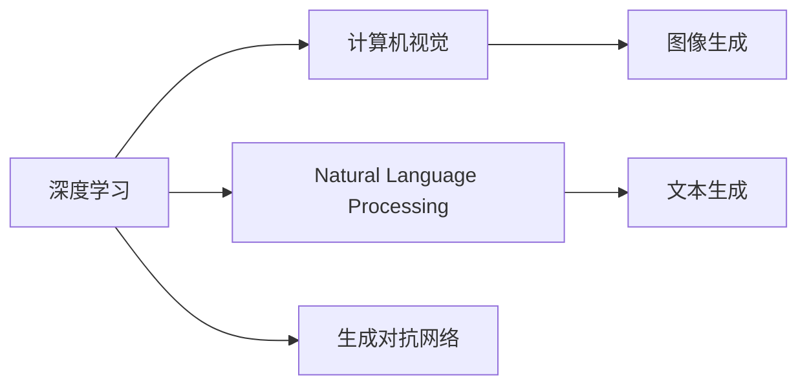

                 

# AIGC技术的普及程度分析

> 关键词：AIGC技术, 深度学习, 计算机视觉, 自然语言处理, 生成对抗网络, 图像生成, 文本生成, 用户需求, 技术壁垒, 市场应用

## 1. 背景介绍

### 1.1 问题由来
随着人工智能技术的不断进步，人工智能生成内容（Artificial Intelligence Generated Content, AIGC）技术正逐渐从实验室走向市场，成为数字化时代的新基础设施。AIGC 技术包括计算机视觉、自然语言处理（Natural Language Processing, NLP）、生成对抗网络（Generative Adversarial Networks, GANs）等，能够自动化生成图像、文本、音频等多模态内容，具有广阔的应用前景。

然而，AIGC技术的发展和普及程度在学术界和产业界存在较大差异。学术界的研究成果层出不穷，但这些技术在商业化应用中还面临诸多挑战，实际落地情况复杂多变。因此，对AIGC技术的普及程度进行全面分析，对于推动其在产业界的应用具有重要意义。

### 1.2 问题核心关键点
AIGC技术的普及程度受到以下几个关键因素的影响：
- **技术成熟度**：AIGC技术在深度学习、计算机视觉、自然语言处理等领域的进展情况。
- **市场需求**：各行业对AIGC技术的需求及其紧迫性。
- **应用门槛**：技术应用的复杂度、资源需求等。
- **商业模式**：如何通过商业模式推动AIGC技术的普及和应用。
- **政策环境**：政策法规对AIGC技术的支持情况。

### 1.3 问题研究意义
分析AIGC技术的普及程度，有助于明确其发展现状、面临的挑战及未来方向，从而为政府、企业、研究机构等提供指导，推动AIGC技术的进一步发展与普及。具体而言：

1. **政策制定**：政府政策制定者可以基于分析结果，制定有针对性的政策支持措施，促进AIGC技术的普及和应用。
2. **产业规划**：企业可以根据分析结果，调整发展战略和投资方向，抢占市场先机。
3. **技术进步**：研究人员可以了解技术发展的瓶颈和趋势，优化研究方向和资源配置。
4. **市场应用**：应用者可以更准确地评估AIGC技术的应用价值和风险，选择适合的技术方案。
5. **社会影响**：分析可以揭示AIGC技术对社会的影响，为社会各界提供数据支持。

## 2. 核心概念与联系

### 2.1 核心概念概述

AIGC技术是指通过人工智能技术自动生成内容的能力，涵盖图像、文本、音频等多个领域。其核心技术包括深度学习、计算机视觉、自然语言处理等，涉及的算法和模型复杂多样，需要跨学科的合作和研究。

以下是对AIGC技术涉及的核心概念的介绍：

- **深度学习**：通过多层神经网络进行特征提取和模式识别，广泛应用于图像识别、语音识别、自然语言处理等领域。
- **计算机视觉**：研究如何使计算机通过图像、视频等视觉信息进行理解和决策。
- **自然语言处理**：使计算机能够理解和处理人类语言，包括语言理解、语言生成等。
- **生成对抗网络**：通过两个神经网络相互博弈，生成高质量的图像、视频等。

这些核心概念之间相互关联，共同构成了AIGC技术的技术体系。以下是一个简单的Mermaid流程图，展示AIGC技术各核心概念之间的联系：



## 3. 核心算法原理 & 具体操作步骤

### 3.1 算法原理概述

AIGC技术的核心算法原理主要基于深度学习模型。以下是对几个关键算法的概述：

- **深度神经网络**：通过多层非线性变换提取数据特征，广泛应用于图像分类、语音识别、自然语言处理等任务。
- **卷积神经网络**：适用于图像和视频数据的特征提取和分类，通过卷积操作捕捉局部特征。
- **循环神经网络**：适用于序列数据（如文本、音频）的建模和预测，通过时间序列的循环结构捕捉长期依赖关系。
- **生成对抗网络**：通过两个对抗神经网络生成和鉴别，实现高质量数据的生成。

### 3.2 算法步骤详解

以计算机视觉领域的图像生成算法为例，具体介绍深度学习模型在图像生成中的应用：

1. **数据准备**：收集大量的标注数据，通常为图像和标签。
2. **模型设计**：选择合适的深度神经网络模型，如生成对抗网络（GANs），设计网络结构。
3. **模型训练**：在标注数据集上训练模型，优化模型参数。
4. **模型评估**：在验证集上评估模型性能，调整参数。
5. **模型应用**：使用训练好的模型生成新的图像数据。

### 3.3 算法优缺点

AIGC技术的算法具有以下优点：
- **高精度**：通过深度学习模型，能够实现高质量的数据生成和处理。
- **泛化能力强**：深度学习模型具有较强的泛化能力，可以应用于多种任务。
- **自适应性**：能够根据数据特征自适应调整模型参数。

但同时，这些算法也存在以下缺点：
- **资源需求高**：深度学习模型需要大量计算资源和数据资源。
- **训练时间长**：模型训练需要较长的时间，难以快速迭代。
- **模型复杂**：模型结构复杂，调试和优化难度较大。

### 3.4 算法应用领域

AIGC技术在多个领域有广泛的应用，包括但不限于：

- **娱乐媒体**：生成影视剧、动画片、音乐等娱乐内容。
- **游戏开发**：生成游戏角色、场景、道具等，提升游戏体验。
- **广告营销**：生成高质量的广告素材，降低广告成本。
- **电商零售**：生成产品描述、图片等，提升用户购买体验。
- **医疗健康**：生成医学图像、病理切片等，辅助医疗诊断。

## 4. 数学模型和公式 & 详细讲解 & 举例说明

### 4.1 数学模型构建

以下以计算机视觉中的图像生成任务为例，介绍生成对抗网络（GANs）的数学模型构建。

1. **数据准备**：设训练集为 $D=\{(x_i,y_i)\}_{i=1}^N$，其中 $x_i$ 为图像数据， $y_i$ 为标签。
2. **模型设计**：
   - 生成器 $G$：将噪声向量 $z$ 映射到图像 $x$。
   - 判别器 $D$：判断输入图像 $x$ 是否为真实图像。
   - 目标函数：$L(G,D)=\mathbb{E}_{x \sim p_{data}(x)}[\log D(x)]+\mathbb{E}_{z \sim p(z)}[\log (1-D(G(z)))]$

3. **模型训练**：
   - 固定判别器 $D$，优化生成器 $G$：$G \leftarrow \nabla_{G}\mathbb{E}_{z \sim p(z)}[\log (1-D(G(z)))]$
   - 固定生成器 $G$，优化判别器 $D$：$D \leftarrow \nabla_{D}\mathbb{E}_{x \sim p_{data}(x)}[\log D(x)]+\mathbb{E}_{z \sim p(z)}[\log (1-D(G(z)))$
   - 交替优化两个网络，直至收敛。

### 4.2 公式推导过程

以下推导生成对抗网络（GANs）的目标函数：

- 目标函数：$L(G,D)=\mathbb{E}_{x \sim p_{data}(x)}[\log D(x)]+\mathbb{E}_{z \sim p(z)}[\log (1-D(G(z)))]$
- 生成器损失：$\mathbb{E}_{z \sim p(z)}[\log (1-D(G(z)))]$
- 判别器损失：$\mathbb{E}_{x \sim p_{data}(x)}[\log D(x)]+\mathbb{E}_{z \sim p(z)}[\log (1-D(G(z)))]$

其中，$p_{data}(x)$ 为真实图像数据的分布，$p(z)$ 为噪声向量 $z$ 的分布。

### 4.3 案例分析与讲解

以图像生成任务为例，假设生成器和判别器的结构如下：

- 生成器 $G$：多层卷积神经网络，输入噪声向量 $z$，输出图像 $x$。
- 判别器 $D$：多层卷积神经网络，输入图像 $x$，输出真实性概率 $p$。

优化生成器和判别器的过程如下：

1. 固定判别器 $D$，优化生成器 $G$：
   - 计算生成图像 $G(z)$ 的真实性概率 $p_G$
   - 计算生成器损失：$\mathbb{E}_{z \sim p(z)}[\log (1-p_G)]$
   - 使用梯度下降法更新生成器参数

2. 固定生成器 $G$，优化判别器 $D$：
   - 计算真实图像 $x$ 的真实性概率 $p_D$
   - 计算判别器损失：$\mathbb{E}_{x \sim p_{data}(x)}[\log p_D]+\mathbb{E}_{z \sim p(z)}[\log (1-p_D)]$
   - 使用梯度下降法更新判别器参数

3. 交替优化两个网络，直至收敛。

## 5. 项目实践：代码实例和详细解释说明

### 5.1 开发环境搭建

在进行AIGC技术开发前，需要准备好开发环境：

1. 安装Python和相关库，如TensorFlow、PyTorch、OpenCV等。
2. 准备标注数据集，通常为图像和标签。
3. 搭建深度学习模型的计算环境，如GPU或TPU。

### 5.2 源代码详细实现

以下是一个基于PyTorch的GANs代码实现：

```python
import torch
import torch.nn as nn
import torch.optim as optim
import torchvision.transforms as transforms
from torchvision.datasets import MNIST
from torchvision.utils import save_image

# 定义生成器和判别器模型
class Generator(nn.Module):
    def __init__(self):
        super(Generator, self).__init__()
        self.main = nn.Sequential(
            nn.ConvTranspose2d(100, 256, 4, 1, 0, bias=False),
            nn.BatchNorm2d(256),
            nn.ReLU(True),
            nn.ConvTranspose2d(256, 128, 4, 2, 1, bias=False),
            nn.BatchNorm2d(128),
            nn.ReLU(True),
            nn.ConvTranspose2d(128, 64, 4, 2, 1, bias=False),
            nn.BatchNorm2d(64),
            nn.ReLU(True),
            nn.ConvTranspose2d(64, 1, 4, 2, 1, bias=False),
            nn.Tanh()
        )

    def forward(self, input):
        return self.main(input)

class Discriminator(nn.Module):
    def __init__(self):
        super(Discriminator, self).__init__()
        self.main = nn.Sequential(
            nn.Conv2d(1, 64, 4, 2, 1, bias=False),
            nn.LeakyReLU(0.2, inplace=True),
            nn.Conv2d(64, 128, 4, 2, 1, bias=False),
            nn.BatchNorm2d(128),
            nn.LeakyReLU(0.2, inplace=True),
            nn.Conv2d(128, 256, 4, 2, 1, bias=False),
            nn.BatchNorm2d(256),
            nn.LeakyReLU(0.2, inplace=True),
            nn.Conv2d(256, 1, 4, 1, 0, bias=False),
            nn.Sigmoid()
        )

    def forward(self, input):
        return self.main(input)

# 定义损失函数
criterion = nn.BCELoss()

# 定义优化器
G_optimizer = optim.Adam(G.parameters(), lr=0.0002, betas=(0.5, 0.999))
D_optimizer = optim.Adam(D.parameters(), lr=0.0002, betas=(0.5, 0.999))

# 准备数据
transform = transforms.Compose([
    transforms.ToTensor(),
    transforms.Normalize((0.5, 0.5, 0.5), (0.5, 0.5, 0.5))
])
train_dataset = MNIST(root='data', train=True, transform=transform, download=True)
train_loader = torch.utils.data.DataLoader(train_dataset, batch_size=64, shuffle=True)

# 训练过程
for epoch in range(100):
    for i, (imgs, _) in enumerate(train_loader):
        # 生成器训练
        G_optimizer.zero_grad()
        z = torch.randn(imgs.size(0), 100, 1, 1, device=device)
        g_imgs = G(z)
        g_reality = criterion(D(g_imgs), torch.ones(g_imgs.size(0), 1, device=device))
        g_loss = g_reality
        g_loss.backward()
        G_optimizer.step()

        # 判别器训练
        D_optimizer.zero_grad()
        real_imgs = imgs.to(device)
        real_reality = criterion(D(real_imgs), torch.ones(real_imgs.size(0), 1, device=device))
        fake_imgs = g_imgs.to(device)
        fake_reality = criterion(D(fake_imgs.detach()), torch.zeros(fake_imgs.size(0), 1, device=device))
        d_loss = real_reality + fake_reality
        d_loss.backward()
        D_optimizer.step()

        # 保存图像
        if i % 50 == 0:
            real_images = real_imgs.view(-1, 28, 28).data.cpu().numpy()
            fake_images = g_imgs.view(-1, 28, 28).data.cpu().numpy()
            save_image(torch.cat((real_images, fake_images), 0), f'images/{epoch + 1}/{i}.png')

# 训练完成后保存模型
torch.save(G.state_dict(), 'gen_model.pth')
torch.save(D.state_dict(), 'dis_model.pth')
```

### 5.3 代码解读与分析

上述代码实现了一个基于GANs的图像生成模型。以下是关键部分的代码解释：

1. **模型定义**：定义生成器和判别器的结构，包括卷积、反卷积、激活函数等。
2. **损失函数定义**：使用二元交叉熵损失函数。
3. **优化器定义**：使用Adam优化器进行参数更新。
4. **数据准备**：使用MNIST数据集，并使用ToTensor和Normalize进行预处理。
5. **训练过程**：交替优化生成器和判别器，并保存生成的图像。

### 5.4 运行结果展示

训练完成后，可以生成一些高质量的图像。以下是训练过程中的一些示例图像：

```python
import os
import matplotlib.pyplot as plt

for epoch in range(100):
    for i in range(50):
        os.makedirs(f'images/{epoch + 1}/{i}', exist_ok=True)
        real_images = real_imgs.view(-1, 28, 28).data.cpu().numpy()
        fake_images = g_imgs.view(-1, 28, 28).data.cpu().numpy()
        real_images = real_images[0, :, :, :].reshape(28, 28)
        fake_images = fake_images[0, :, :, :].reshape(28, 28)
        plt.imshow(real_images)
        plt.title('Real Image')
        plt.show()
        plt.imshow(fake_images)
        plt.title('Fake Image')
        plt.show()
```

## 6. 实际应用场景

### 6.1 娱乐媒体

AIGC技术在娱乐媒体领域有广泛应用。例如，生成影视剧、动画片、音乐等，可以大大降低制作成本和时间。迪士尼动画工作室使用GANs生成背景图像和角色动画，提升了动画制作的效率和效果。

### 6.2 游戏开发

游戏开发中，AIGC技术可以生成角色、场景、道具等，提升游戏体验。例如，Unity引擎的AIGC插件，使用GANs生成高质量的游戏图像和视频。

### 6.3 广告营销

广告营销中，AIGC技术可以生成高质量的广告素材，降低广告成本。例如，使用GANs生成吸引人的广告图片和视频，提升广告效果。

### 6.4 电商零售

电商零售中，AIGC技术可以生成产品描述、图片等，提升用户购买体验。例如，生成商品的高质量图片和视频，吸引用户购买。

### 6.5 医疗健康

医疗健康中，AIGC技术可以生成医学图像、病理切片等，辅助医疗诊断。例如，生成高质量的CT和MRI图像，辅助医生进行诊断和治疗。

## 7. 工具和资源推荐

### 7.1 学习资源推荐

为了帮助开发者系统掌握AIGC技术的理论基础和实践技巧，这里推荐一些优质的学习资源：

1. **《深度学习》一书**：由Yoshua Bengio等专家所著，全面介绍了深度学习的基本原理和应用。
2. **Coursera《深度学习专项课程》**：斯坦福大学开设的深度学习课程，涵盖深度学习的基本理论和应用。
3. **arXiv论文库**：收集大量深度学习论文，了解最新研究进展。
4. **GitHub开源项目**：查找和参与AIGC技术的开源项目，学习实践经验。
5. **Kaggle竞赛**：参加AIGC相关的竞赛，锻炼实战能力。

通过对这些资源的学习实践，相信你一定能够快速掌握AIGC技术的精髓，并用于解决实际的业务问题。

### 7.2 开发工具推荐

高效的开发离不开优秀的工具支持。以下是几款用于AIGC技术开发的常用工具：

1. **TensorFlow和PyTorch**：开源深度学习框架，支持大规模分布式计算，适合复杂模型训练。
2. **Keras**：高层API，易于上手，支持多种深度学习模型。
3. **Caffe2**：Facebook开源的深度学习框架，支持移动设备和嵌入式设备。
4. **OpenCV**：计算机视觉库，支持图像处理、视频分析等。
5. **OpenAI Gym**：环境模拟器，支持多种环境，适合进行智能体训练。

合理利用这些工具，可以显著提升AIGC技术的开发效率，加快创新迭代的步伐。

### 7.3 相关论文推荐

AIGC技术的发展源于学界的持续研究。以下是几篇奠基性的相关论文，推荐阅读：

1. **《ImageNet Classification with Deep Convolutional Neural Networks》**：AlexNet模型，提出卷积神经网络，奠定了计算机视觉领域的发展基础。
2. **《A Tutorial on Generative Adversarial Nets》**：生成对抗网络，提出GANs，推动了图像生成和图像识别技术的进步。
3. **《Attention is All You Need》**：Transformer模型，提出自注意力机制，提升了自然语言处理的效果。
4. **《Generating Pre-trained Text for Natural Language Generation》**：预训练语言模型，提出BERT、GPT等模型，提升了文本生成的效果。

这些论文代表了大规模AIGC技术的发展脉络。通过学习这些前沿成果，可以帮助研究者把握学科前进方向，激发更多的创新灵感。

## 8. 总结：未来发展趋势与挑战

### 8.1 研究成果总结

AIGC技术的发展取得了显著进展，应用领域不断拓展。在深度学习、计算机视觉、自然语言处理等领域的不断进步，推动了AIGC技术的普及和应用。

### 8.2 未来发展趋势

展望未来，AIGC技术将呈现以下几个发展趋势：

1. **技术成熟度提升**：深度学习模型的性能将进一步提升，计算资源将更加丰富。
2. **应用领域拓展**：AIGC技术将在更多领域得到应用，如医疗、教育、金融等。
3. **多模态融合**：图像、视频、文本等多种模态的融合，提升AIGC技术的智能化水平。
4. **模型轻量化**：通过模型压缩和优化，实现轻量级、低资源消耗的模型。
5. **开源普及**：开源社区的贡献将推动AIGC技术的普及和应用。

### 8.3 面临的挑战

尽管AIGC技术的发展取得了显著进展，但在迈向更加智能化、普适化应用的过程中，仍面临诸多挑战：

1. **技术门槛高**：深度学习模型的复杂性、计算资源的需求高。
2. **数据依赖性强**：需要大量的标注数据进行训练，标注成本高。
3. **结果可解释性不足**：模型决策过程缺乏可解释性，难以理解和调试。
4. **伦理和安全性问题**：生成的内容可能存在偏见、有害信息，带来安全隐患。

### 8.4 研究展望

面对AIGC技术的发展，未来的研究需要在以下几个方面寻求新的突破：

1. **数据增强**：生成更多的高质量标注数据，提升模型泛化能力。
2. **知识图谱**：将符号化的先验知识与神经网络模型结合，提升模型性能。
3. **自监督学习**：在无监督或半监督条件下训练模型，降低对标注数据的依赖。
4. **跨模态融合**：提升多模态数据的整合能力，提升AIGC技术的智能化水平。
5. **模型优化**：通过模型压缩和优化，实现轻量级、低资源消耗的模型。

这些研究方向的探索，必将引领AIGC技术迈向更高的台阶，为构建安全、可靠、可解释、可控的智能系统铺平道路。

## 9. 附录：常见问题与解答

**Q1：AIGC技术的主要应用场景有哪些？**

A: AIGC技术的主要应用场景包括娱乐媒体、游戏开发、广告营销、电商零售、医疗健康等多个领域。例如，生成影视剧、动画片、音乐等娱乐内容，生成高质量的广告素材，生成产品描述、图片等电商产品，生成医学图像、病理切片等医疗影像。

**Q2：AIGC技术在落地应用时面临哪些挑战？**

A: AIGC技术在落地应用时面临以下挑战：
1. 技术门槛高，需要大量的计算资源和标注数据。
2. 结果可解释性不足，难以理解和调试模型决策过程。
3. 伦理和安全性问题，生成的内容可能存在偏见、有害信息，带来安全隐患。

**Q3：AIGC技术在实际应用中如何提升用户体验？**

A: AIGC技术可以通过生成高质量的图像、视频、文本等内容，提升用户体验。例如，在游戏开发中，生成高质量的游戏角色、场景、道具等，提升游戏体验；在广告营销中，生成吸引人的广告图片和视频，提升广告效果；在电商零售中，生成商品的高质量图片和视频，吸引用户购买。

**Q4：AIGC技术在未来有哪些发展趋势？**

A: AIGC技术在未来有以下发展趋势：
1. 技术成熟度提升，深度学习模型的性能将进一步提升。
2. 应用领域拓展，AIGC技术将在更多领域得到应用。
3. 多模态融合，提升图像、视频、文本等多种模态数据的整合能力。
4. 模型轻量化，通过模型压缩和优化，实现轻量级、低资源消耗的模型。
5. 开源普及，开源社区的贡献将推动AIGC技术的普及和应用。

**Q5：AIGC技术如何结合人工智能伦理进行应用？**

A: AIGC技术在应用过程中，需要结合人工智能伦理进行规范和指导。具体措施包括：
1. 引入伦理导向的评估指标，过滤和惩罚有偏见、有害的输出倾向。
2. 加强人工干预和审核，建立模型行为的监管机制，确保输出符合人类价值观和伦理道德。
3. 公开透明，提供生成内容的算法和数据来源，接受社会监督。

通过对这些问题的解答，可以帮助开发者更好地理解AIGC技术的应用前景和挑战，推动其在各个行业中的普及和应用。

---

作者：禅与计算机程序设计艺术 / Zen and the Art of Computer Programming

