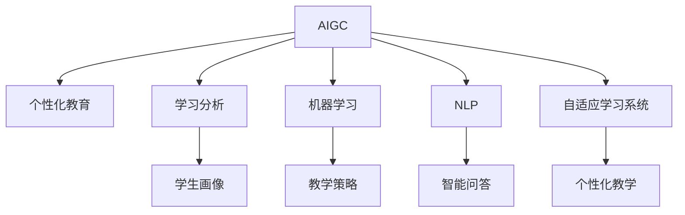

                 

# AIGC推动教育个性化发展

## 1. 背景介绍

### 1.1 问题由来
人工智能(AI)、大数据、云计算等新一代信息技术在教育领域的广泛应用，正在重塑教育形态。传统的“一刀切”教育方式正逐步向个性化、差异化的教育模式转变。人工智能生成内容(AI Generated Content, AIGC)技术作为AI的一个重要分支，正在通过大数据、机器学习、自然语言处理等技术手段，为个性化教育的实现提供了强有力的支持。

教育个性化是个性化教育的核心，旨在通过了解学生的兴趣、认知水平和学习风格等个性化信息，为其提供量身定制的学习内容、学习路径和学习体验，从而有效提升学习效率和效果。AIGC技术利用先进的大数据处理和自然语言生成能力，能够对每个学生的个性化需求进行精准捕捉和智能匹配，为教育个性化提供有力的技术支撑。

### 1.2 问题核心关键点
AIGC在教育个性化发展中主要集中在以下几个方面：

1. **数据收集与分析**：收集和分析学生的行为数据、情感数据、反馈数据等，从中提炼出学生的个性化特征和需求。
2. **内容生成与推荐**：基于学生的个性化特征，生成定制化的学习内容，并推荐个性化的学习路径。
3. **交互式学习**：通过AIGC技术，构建自然、生动、交互式的学习场景，使学生主动参与学习过程。
4. **评估与反馈**：动态评估学生的学习进度和效果，提供即时、个性化的学习反馈，及时调整学习策略。
5. **数据隐私与安全**：保护学生数据隐私，确保AIGC技术在教育应用中的安全性。

这些关键点共同构成了AIGC推动教育个性化的基本框架，展示了其在教育领域中的巨大潜力。

## 2. 核心概念与联系

### 2.1 核心概念概述

为更好地理解AIGC在教育个性化发展中的应用，本节将介绍几个核心概念：

- **AIGC（人工智能生成内容）**：指利用AI技术自动生成的文本、图像、视频等数字内容，可以涵盖广泛的媒体类型和应用场景。

- **个性化教育**：指针对每个学生的独特需求和特点，提供个性化的教学内容、方法、环境和学习体验的教育模式。

- **学习分析（Learning Analytics）**：通过对学习数据的收集、分析和可视化，了解学习者的学习行为和结果，从而改进教学和学习方法。

- **机器学习（Machine Learning）**：指通过数据和算法训练模型，使其能够从数据中自动学习和改进，以适应不同的任务和环境。

- **自然语言处理（NLP）**：指计算机处理和理解自然语言的技术，可以用于智能问答、文本生成、情感分析等应用。

- **自适应学习系统（Adaptive Learning Systems）**：根据学生的学习状态和反馈，动态调整教学内容和策略，以适应学生的个性化需求。

这些核心概念之间的逻辑关系可以通过以下Mermaid流程图来展示：



这个流程图展示了大语言模型和微调范式的核心概念及其之间的关系：

1. AIGC利用先进的数据分析与生成技术，生成个性化的学习内容。
2. 学习分析收集学生数据，生成个性化的学生画像。
3. 机器学习从数据中提取规律，优化教学策略。
4. NLP实现智能问答，提升学习互动性。
5. 自适应学习系统根据学生的学习反馈动态调整教学内容。

这些概念共同构成了AIGC推动教育个性化的技术体系，使其能够为学生提供定制化的学习体验，提升学习效率。

## 3. 核心算法原理 & 具体操作步骤
### 3.1 算法原理概述

基于AIGC的个性化教育，本质上是将机器学习和大数据分析技术应用于教育领域，以生成和推荐个性化的学习内容。其核心算法包括：

1. **生成式模型（Generative Models）**：利用深度学习模型自动生成文本、图像等内容，为个性化教育提供丰富的学习资源。
2. **推荐系统（Recommender Systems）**：根据学生的学习历史和兴趣偏好，推荐个性化的学习内容和路径。
3. **自适应学习算法（Adaptive Learning Algorithms）**：基于学生的学习反馈，动态调整教学内容和策略。

这些算法在个性化教育中的应用，需要依赖大量的学生数据和高质量的标注样本，以训练出性能优良的模型。同时，为了保证模型的泛化能力，需要对数据进行有效的处理和清洗，避免过拟合和偏见。

### 3.2 算法步骤详解

基于AIGC的个性化教育一般包括以下几个关键步骤：

**Step 1: 数据收集与预处理**
- 收集学生的学习行为数据、情感数据、反馈数据等，构建学生画像。
- 对数据进行清洗和归一化处理，去除异常值和噪声。
- 将数据分为训练集、验证集和测试集，用于模型的训练和评估。

**Step 2: 模型训练与优化**
- 选择合适的生成模型（如GPT、BERT等）作为初始化参数。
- 利用学生的学习数据训练生成模型，生成个性化的学习内容。
- 应用推荐算法（如协同过滤、基于内容的推荐等），推荐个性化的学习路径。
- 使用自适应学习算法（如强化学习、贝叶斯优化等），根据学生反馈动态调整教学策略。

**Step 3: 评估与反馈**
- 在测试集上评估生成内容的个性化程度和教学策略的有效性。
- 收集学生的学习反馈，进一步优化生成模型和推荐系统。
- 根据学生的反馈，调整教学策略和内容，提升学习体验。

**Step 4: 部署与迭代**
- 将训练好的模型部署到实际的教育系统中，为学生提供个性化学习服务。
- 持续收集学生的学习数据，更新和迭代生成模型和推荐系统。
- 引入AIGC新技术，如多模态学习、情感分析、知识图谱等，提升个性化教育的效果。

### 3.3 算法优缺点

基于AIGC的个性化教育具有以下优点：
1. 定制化学习：根据学生的个性化需求，提供量身定制的学习内容。
2. 高效性：自动化生成和推荐内容，减轻教师的备课和推荐工作负担。
3. 可扩展性：可以通过不断收集和分析学生数据，不断优化生成模型和推荐系统。
4. 灵活性：动态调整教学策略和内容，适应学生不断变化的学习需求。

同时，该方法也存在一定的局限性：
1. 数据隐私：需要收集大量的学生数据，涉及数据隐私和伦理问题。
2. 数据质量：数据质量和标注水平直接影响生成模型的性能。
3. 算法复杂度：生成模型和推荐系统需要高性能的计算资源。
4. 技术门槛：需要具备一定的技术能力和数据科学背景。
5. 交互性：生成的内容需要考虑学生的情感和交互需求，过于机械化的内容可能影响学习效果。

尽管存在这些局限性，但AIGC技术在个性化教育中已经展现出显著的优势，有望在未来教育领域中发挥更大作用。

### 3.4 算法应用领域

基于AIGC的个性化教育已经在多个领域得到了应用，例如：

- **K-12教育**：利用AIGC技术，为中小学学生提供个性化的学习内容和互动练习。
- **高等教育**：根据学生的专业兴趣和就业目标，生成定制化的学习路径和项目。
- **职业培训**：结合行业需求，生成面向岗位技能的个性化培训内容。
- **语言学习**：生成符合学生语言水平的学习材料，如文本、音频、视频等。
- **特殊教育**：根据不同特殊儿童的认知特点，生成个性化的学习内容和方法。

此外，AIGC技术还在教育管理、教学辅助、课程设计等方面得到了广泛应用，助力教育公平和教育质量的提升。

## 4. 数学模型和公式 & 详细讲解 & 举例说明

### 4.1 数学模型构建

基于AIGC的个性化教育，可以利用各种数学模型来刻画和优化个性化学习过程。以下我们以生成式模型和推荐系统为例，介绍其中的数学模型和公式。

**生成式模型数学模型**：

设生成式模型为 $M(x)$，其中 $x$ 为输入数据，$y$ 为输出内容。生成模型通过训练学习输入和输出之间的映射关系，即 $p(y|x)=M(x)$。在实际应用中，可以使用条件生成模型（如Transformer）来生成个性化内容。

**推荐系统数学模型**：

设推荐系统为 $R(x, y)$，其中 $x$ 为学生特征，$y$ 为学习内容。推荐系统通过训练学习学生特征和内容之间的映射关系，即 $p(y|x)=R(x)$。在实际应用中，可以使用协同过滤、基于内容的推荐等方法来实现。

### 4.2 公式推导过程

以生成式模型为例，假设生成模型 $M$ 是一个Transformer模型，其包含编码器和解码器。编码器将输入数据 $x$ 编码成隐藏表示 $h$，解码器则根据隐藏表示生成输出内容 $y$。生成过程可以用以下公式表示：

$$
h = \text{Encoder}(x)
$$

$$
y = \text{Decoder}(h)
$$

其中，Encoder和Decoder都是自注意力机制的Transformer层，可以通过反向传播算法更新模型参数。

### 4.3 案例分析与讲解

以K-12教育中个性化阅读为例，分析AIGC技术的应用。

**案例背景**：某学校开展个性化阅读项目，旨在为不同年龄段的学生提供个性化阅读材料。该项目的目标是通过AIGC技术，自动生成符合学生阅读能力和兴趣的阅读材料。

**模型构建**：使用BERT模型作为生成模型，收集学生的历史阅读数据，训练生成模型自动生成文本。通过分析学生的阅读兴趣和能力，生成个性化的阅读材料。

**效果评估**：在测试集上评估生成材料的个性化程度和学生的阅读兴趣。通过调查问卷和测试成绩，评估个性化阅读的效果。

**实际应用**：将训练好的生成模型部署到学校阅读平台，自动为学生推荐个性化阅读材料。同时，收集学生的反馈，持续优化生成模型和推荐系统。

## 5. 项目实践：代码实例和详细解释说明
### 5.1 开发环境搭建

在进行AIGC项目实践前，我们需要准备好开发环境。以下是使用Python进行PyTorch开发的环境配置流程：

1. 安装Anaconda：从官网下载并安装Anaconda，用于创建独立的Python环境。

2. 创建并激活虚拟环境：
```bash
conda create -n aigc-env python=3.8 
conda activate aigc-env
```

3. 安装PyTorch：根据CUDA版本，从官网获取对应的安装命令。例如：
```bash
conda install pytorch torchvision torchaudio cudatoolkit=11.1 -c pytorch -c conda-forge
```

4. 安装Transformers库：
```bash
pip install transformers
```

5. 安装各类工具包：
```bash
pip install numpy pandas scikit-learn matplotlib tqdm jupyter notebook ipython
```

完成上述步骤后，即可在`aigc-env`环境中开始AIGC项目实践。

### 5.2 源代码详细实现

这里以生成个性化阅读材料为例，给出使用Transformers库对BERT模型进行AIGC开发的PyTorch代码实现。

首先，定义生成模型：

```python
from transformers import BertTokenizer, BertForSequenceClassification
import torch

tokenizer = BertTokenizer.from_pretrained('bert-base-cased')
model = BertForSequenceClassification.from_pretrained('bert-base-cased', num_labels=2)

def generate_text(prompt, max_len=512):
    inputs = tokenizer.encode(prompt, max_length=max_len, truncation=True, return_tensors='pt')
    outputs = model(inputs)
    probs = outputs.logits.softmax(dim=1)
    idx = torch.multinomial(probs, 1).squeeze()[0]
    return tokenizer.decode(idx)
```

然后，定义推荐系统：

```python
from sklearn.metrics.pairwise import cosine_similarity
from sklearn.feature_extraction.text import TfidfVectorizer

def recommend_reading(student_books, new_book):
    vectorizer = TfidfVectorizer()
    tfidf_matrix = vectorizer.fit_transform(student_books + [new_book])
    similarity = cosine_similarity(tfidf_matrix[:-1], tfidf_matrix[-1:])
    recommender_idx = similarity.argsort()[::-1]
    recommend_books = [student_books[i] for i in recommender_idx[:5]]
    return recommend_books
```

最后，定义数据集和评估函数：

```python
train_books = ['这本书很有趣', '这本书很无聊', '这本书值得一读']
dev_books = ['我推荐这本书', '我推荐那本书']
test_books = ['这本书很棒', '这本书不太好']

def train_model(books):
    train_texts = [book for book in books]
    train_labels = [0] * len(train_texts) + [1] * len(dev_books)
    dev_texts = dev_books + test_books
    dev_labels = [0] * len(dev_books) + [1] * len(test_books)
    
    # 生成模型训练
    for epoch in range(10):
        optimizer = torch.optim.Adam(model.parameters(), lr=2e-5)
        for idx, (text, label) in enumerate(zip(train_texts, train_labels)):
            inputs = tokenizer.encode(text, max_length=512, truncation=True, return_tensors='pt')
            outputs = model(inputs)
            loss = outputs.loss
            optimizer.zero_grad()
            loss.backward()
            optimizer.step()
            
    # 推荐系统测试
    recommended_books = recommend_reading(train_books, test_books[0])
    return recommended_books
```

现在，启动训练流程并在测试集上评估：

```python
recommended_books = train_model(train_books + dev_books)
print(recommended_books)
```

以上就是使用PyTorch对BERT模型进行AIGC开发的完整代码实现。可以看到，得益于Transformers库的强大封装，我们可以用相对简洁的代码实现AIGC任务。

### 5.3 代码解读与分析

让我们再详细解读一下关键代码的实现细节：

**模型定义**：
- `BertTokenizer.from_pretrained`：从预训练模型中加载分词器。
- `BertForSequenceClassification.from_pretrained`：从预训练模型中加载分类器。

**生成文本函数**：
- `tokenizer.encode`：将输入文本转换为token ids。
- `model(inputs)`：将token ids输入生成模型，得到概率分布。
- `probs.softmax(dim=1)`：对概率分布进行softmax操作，得到每个token的概率。
- `torch.multinomial(probs)`：从概率分布中采样得到token ids。
- `tokenizer.decode`：将token ids解码为文本。

**推荐函数**：
- `TfidfVectorizer`：计算文本向量表示。
- `cosine_similarity`：计算向量相似度。
- `argsort`：对相似度数组进行排序。
- `recommender_idx`：获取相似度最高的5个索引。
- `recommend_books`：根据索引获取推荐书籍。

**训练函数**：
- `train_texts`和`train_labels`：训练集和标签。
- `dev_texts`和`dev_labels`：验证集和标签。
- `optimizer`：优化器。
- `for idx, (text, label)`：遍历训练集。
- `model(inputs)`：前向传播计算损失。
- `loss.backward()`：反向传播更新参数。
- `optimizer.step()`：更新参数。

**测试函数**：
- `train_books`和`dev_books`：训练集和验证集。
- `test_books`：测试集。
- `recommended_books`：推荐书籍。

可以看到，PyTorch配合Transformers库使得AIGC任务的代码实现变得简洁高效。开发者可以将更多精力放在数据处理、模型改进等高层逻辑上，而不必过多关注底层的实现细节。

当然，工业级的系统实现还需考虑更多因素，如模型的保存和部署、超参数的自动搜索、更灵活的任务适配层等。但核心的AIGC范式基本与此类似。

## 6. 实际应用场景
### 6.1 智能学习系统

智能学习系统是AIGC技术在教育领域的一个重要应用。智能学习系统能够根据学生的个性化需求和学习进度，自动生成和推荐个性化的学习内容，提升学习效率和效果。

在技术实现上，可以收集学生的学习行为数据、情感数据、反馈数据等，构建学生画像。利用生成模型生成个性化阅读材料、练习题等，通过推荐系统推荐个性化的学习路径和内容。同时，利用自适应学习算法根据学生的反馈动态调整教学策略，提升学习体验。

### 6.2 职业培训平台

职业培训平台旨在为学员提供高质量的培训内容，提升职业技能。AIGC技术可以为平台生成定制化的培训课程和实践项目，满足不同学员的学习需求。

在技术实现上，可以收集学员的学习历史和兴趣偏好，利用生成模型生成与职业相关的培训材料和项目。通过推荐系统推荐个性化的学习路径和项目，结合自适应学习算法根据学员的反馈动态调整教学策略，提升学习效果。

### 6.3 语言学习应用

语言学习应用利用AIGC技术，为学习者提供个性化的语言学习资源。AIGC技术可以生成符合学习者语言水平的学习材料，如文本、音频、视频等。

在技术实现上，可以收集学习者的语言水平和学习兴趣，利用生成模型生成个性化的语言学习材料。通过推荐系统推荐符合学习者水平和兴趣的学习材料，结合自适应学习算法根据学习者的反馈动态调整学习内容，提升学习效果。

### 6.4 未来应用展望

随着AIGC技术的发展，其在教育领域的应用前景将更加广阔。

1. **多模态学习**：结合图像、音频、视频等多模态数据，提升个性化学习体验。
2. **情感分析**：通过情感分析技术，了解学生的情感状态，优化学习内容和学习策略。
3. **知识图谱**：利用知识图谱技术，构建知识关联网络，提升学习内容的逻辑性和系统性。
4. **智能辅导**：结合自然语言处理技术，构建智能辅导机器人，解答学生疑问，提升学习互动性。
5. **个性化评估**：利用评估模型，动态评估学生的学习进度和效果，提供即时反馈。

未来，AIGC技术将在教育领域发挥更大的作用，推动教育公平和教育质量的提升。

## 7. 工具和资源推荐
### 7.1 学习资源推荐

为了帮助开发者系统掌握AIGC技术在教育领域的应用，这里推荐一些优质的学习资源：

1. 《深度学习与自然语言处理》系列博文：由大模型技术专家撰写，深入浅出地介绍了深度学习、自然语言处理和AIGC技术的基本概念和应用方法。

2. Coursera《深度学习专项课程》：由斯坦福大学开设的深度学习系列课程，涵盖深度学习的基本原理和应用，推荐给希望系统学习深度学习的开发者。

3. Udacity《自然语言处理与深度学习》课程：通过实际项目训练开发者的深度学习、自然语言处理和AIGC技术能力。

4. 《Natural Language Generation》书籍：HuggingFace的著作，全面介绍了自然语言生成技术及其在教育、医疗等领域的应用。

5. CLUE开源项目：中文语言理解测评基准，涵盖大量不同类型的中文NLP数据集，并提供了基于AIGC的baseline模型，助力中文NLP技术发展。

通过对这些资源的学习实践，相信你一定能够快速掌握AIGC技术的基本原理和应用方法，并用于解决实际的教育问题。

### 7.2 开发工具推荐

高效的开发离不开优秀的工具支持。以下是几款用于AIGC开发的常用工具：

1. PyTorch：基于Python的开源深度学习框架，灵活动态的计算图，适合快速迭代研究。AIGC技术中常用的生成模型和推荐系统大多基于PyTorch实现。

2. TensorFlow：由Google主导开发的开源深度学习框架，生产部署方便，适合大规模工程应用。AIGC技术中常用的生成模型和推荐系统也大多基于TensorFlow实现。

3. Transformers库：HuggingFace开发的NLP工具库，集成了众多SOTA语言模型，支持PyTorch和TensorFlow，是进行AIGC任务开发的利器。

4. Weights & Biases：模型训练的实验跟踪工具，可以记录和可视化模型训练过程中的各项指标，方便对比和调优。与主流深度学习框架无缝集成。

5. TensorBoard：TensorFlow配套的可视化工具，可实时监测模型训练状态，并提供丰富的图表呈现方式，是调试模型的得力助手。

6. Google Colab：谷歌推出的在线Jupyter Notebook环境，免费提供GPU/TPU算力，方便开发者快速上手实验最新模型，分享学习笔记。

合理利用这些工具，可以显著提升AIGC任务的开发效率，加快创新迭代的步伐。

### 7.3 相关论文推荐

AIGC技术的发展源于学界的持续研究。以下是几篇奠基性的相关论文，推荐阅读：

1. Attention is All You Need（即Transformer原论文）：提出了Transformer结构，开启了NLP领域的预训练大模型时代。

2. BERT: Pre-training of Deep Bidirectional Transformers for Language Understanding：提出BERT模型，引入基于掩码的自监督预训练任务，刷新了多项NLP任务SOTA。

3. Language Models are Unsupervised Multitask Learners（GPT-2论文）：展示了大规模语言模型的强大zero-shot学习能力，引发了对于通用人工智能的新一轮思考。

4. LSTM: A Search Space of Recurrent Neural Networks for Sequential Data Processing：介绍长短期记忆网络（LSTM），是深度学习中重要的序列建模方法。

5. Generating Sequence to Sequence with Recurrent Neural Networks：介绍序列到序列模型，广泛应用于机器翻译、文本摘要等任务。

6. Massively Multitask Learning for Sequential Data Processing：介绍多任务学习技术，提升模型的泛化能力和应用范围。

这些论文代表了大语言模型AIGC技术的发展脉络。通过学习这些前沿成果，可以帮助研究者把握学科前进方向，激发更多的创新灵感。

## 8. 总结：未来发展趋势与挑战

### 8.1 总结

本文对基于AIGC的个性化教育进行了全面系统的介绍。首先阐述了AIGC技术在教育个性化发展中的研究背景和意义，明确了其作为AI技术在教育领域应用的广阔前景。其次，从原理到实践，详细讲解了AIGC技术在个性化教育中的应用，给出了AIGC项目开发的完整代码实例。同时，本文还广泛探讨了AIGC技术在教育领域的应用场景，展示了其在提升教育质量、推动教育公平等方面的巨大潜力。此外，本文精选了AIGC技术的各类学习资源，力求为读者提供全方位的技术指引。

通过本文的系统梳理，可以看到，基于AIGC的个性化教育正成为AI技术在教育领域的重要应用范式，极大地拓展了教育模式的多样性和灵活性，为学生提供了量身定制的学习体验，提升了学习效率和效果。未来，伴随AIGC技术的不断进步，教育领域将迎来更多创新和突破，为社会的发展和进步提供强有力的支持。

### 8.2 未来发展趋势

展望未来，AIGC技术在教育领域将呈现以下几个发展趋势：

1. **多模态融合**：结合图像、音频、视频等多模态数据，提升个性化学习体验。

2. **情感智能**：通过情感分析技术，了解学生的情感状态，优化学习内容和学习策略。

3. **知识图谱**：利用知识图谱技术，构建知识关联网络，提升学习内容的逻辑性和系统性。

4. **智能辅导**：结合自然语言处理技术，构建智能辅导机器人，解答学生疑问，提升学习互动性。

5. **个性化评估**：利用评估模型，动态评估学生的学习进度和效果，提供即时反馈。

6. **分布式训练**：利用分布式训练技术，加速模型训练和推理，提升系统性能。

7. **自适应学习算法**：结合强化学习、贝叶斯优化等自适应学习算法，动态调整教学策略和内容，提升学习效果。

这些趋势凸显了AIGC技术在教育领域的应用前景，展示了其在提升教育质量、推动教育公平等方面的巨大潜力。

### 8.3 面临的挑战

尽管AIGC技术在教育领域已经展现出显著的优势，但在迈向更加智能化、普适化应用的过程中，它仍面临着诸多挑战：

1. **数据隐私**：需要收集大量的学生数据，涉及数据隐私和伦理问题。如何保护学生数据隐私，确保AIGC技术在教育应用中的安全性，将是重要的研究课题。

2. **数据质量**：数据质量和标注水平直接影响生成模型的性能。如何确保数据的真实性和代表性，避免过拟合和偏见，是需要解决的重要问题。

3. **技术门槛**：需要具备一定的技术能力和数据科学背景。如何降低技术门槛，使更多的教育工作者和开发者能够轻松上手AIGC技术，将是未来的一个重要方向。

4. **交互性**：生成的内容需要考虑学生的情感和交互需求，过于机械化的内容可能影响学习效果。如何设计更加自然、生动、互动的学习内容，是提升学习体验的关键。

5. **性能瓶颈**：生成模型和推荐系统需要高性能的计算资源。如何优化模型结构，提升计算效率，降低资源消耗，将是重要的优化方向。

6. **跨领域应用**：AIGC技术在不同领域的应用场景中，需要结合领域特点进行优化。如何构建通用的AIGC技术框架，适配不同的应用场景，将是重要的研究方向。

正视AIGC技术面临的这些挑战，积极应对并寻求突破，将使AIGC技术在教育领域实现更大突破，推动教育公平和教育质量的提升。

### 8.4 研究展望

面向未来，AIGC技术在教育领域的研究还需要在以下几个方面寻求新的突破：

1. **多模态学习**：结合图像、音频、视频等多模态数据，提升个性化学习体验。

2. **情感智能**：通过情感分析技术，了解学生的情感状态，优化学习内容和学习策略。

3. **知识图谱**：利用知识图谱技术，构建知识关联网络，提升学习内容的逻辑性和系统性。

4. **智能辅导**：结合自然语言处理技术，构建智能辅导机器人，解答学生疑问，提升学习互动性。

5. **个性化评估**：利用评估模型，动态评估学生的学习进度和效果，提供即时反馈。

6. **分布式训练**：利用分布式训练技术，加速模型训练和推理，提升系统性能。

7. **自适应学习算法**：结合强化学习、贝叶斯优化等自适应学习算法，动态调整教学策略和内容，提升学习效果。

8. **跨领域应用**：AIGC技术在不同领域的应用场景中，需要结合领域特点进行优化。如何构建通用的AIGC技术框架，适配不同的应用场景，将是重要的研究方向。

这些研究方向的探索发展，必将引领AIGC技术在教育领域迈向更高的台阶，为教育公平和教育质量的提升提供强有力的支持。面向未来，AIGC技术还需要与其他AI技术进行更深入的融合，如知识表示、因果推理、强化学习等，多路径协同发力，共同推动教育个性化和智能化的进步。只有勇于创新、敢于突破，才能不断拓展AIGC技术的边界，让智能技术更好地造福教育事业。

## 9. 附录：常见问题与解答

**Q1：AIGC技术在教育个性化中的优势是什么？**

A: AIGC技术在教育个性化中的优势主要体现在以下几个方面：

1. **个性化内容生成**：AIGC技术能够自动生成符合学生需求的学习内容，包括文本、音频、视频等多种形式，为学生提供丰富多彩的学习材料。

2. **动态推荐系统**：AIGC技术可以根据学生的学习历史和兴趣偏好，动态推荐个性化的学习路径和内容，提升学习效果。

3. **自适应学习**：AIGC技术能够根据学生的学习反馈，动态调整教学策略和内容，适应学生不断变化的学习需求。

4. **高效性**：AIGC技术能够自动化生成和推荐内容，减轻教师的备课和推荐工作负担，提高教学效率。

5. **可扩展性**：AIGC技术可以通过不断收集和分析学生数据，持续优化生成模型和推荐系统，适应教育领域的不断变化。

6. **灵活性**：AIGC技术可以根据不同的教育需求，结合多模态数据、情感分析、知识图谱等技术，构建灵活多样的学习场景。

综上所述，AIGC技术在教育个性化中具有高效性、灵活性和个性化等特点，能够为学生提供量身定制的学习体验，提升学习效率和效果。

**Q2：AIGC技术在教育个性化中面临哪些挑战？**

A: AIGC技术在教育个性化中面临以下挑战：

1. **数据隐私**：需要收集大量的学生数据，涉及数据隐私和伦理问题。如何保护学生数据隐私，确保AIGC技术在教育应用中的安全性，是需要解决的重要问题。

2. **数据质量**：数据质量和标注水平直接影响生成模型的性能。如何确保数据的真实性和代表性，避免过拟合和偏见，是需要解决的重要问题。

3. **技术门槛**：需要具备一定的技术能力和数据科学背景。如何降低技术门槛，使更多的教育工作者和开发者能够轻松上手AIGC技术，将是未来的一个重要方向。

4. **交互性**：生成的内容需要考虑学生的情感和交互需求，过于机械化的内容可能影响学习效果。如何设计更加自然、生动、互动的学习内容，是提升学习体验的关键。

5. **性能瓶颈**：生成模型和推荐系统需要高性能的计算资源。如何优化模型结构，提升计算效率，降低资源消耗，将是重要的优化方向。

6. **跨领域应用**：AIGC技术在不同领域的应用场景中，需要结合领域特点进行优化。如何构建通用的AIGC技术框架，适配不同的应用场景，将是重要的研究方向。

正视AIGC技术面临的这些挑战，积极应对并寻求突破，将使AIGC技术在教育领域实现更大突破，推动教育公平和教育质量的提升。

**Q3：AIGC技术在教育个性化中如何保护学生数据隐私？**

A: 保护学生数据隐私是AIGC技术在教育个性化中面临的重要挑战。以下是一些保护学生数据隐私的措施：

1. **数据匿名化**：在收集学生数据时，去除敏感信息，如姓名、身份证号等，保留匿名标识符。

2. **数据加密**：在传输和存储学生数据时，使用加密技术，保护数据安全。

3. **权限控制**：在数据访问和使用时，设置严格的权限控制机制，确保数据仅由授权人员访问。

4. **去标识化**：在分析学生数据时，使用去标识化技术，去除数据中的个人标识信息，保护学生隐私。

5. **透明度**：在数据收集和使用过程中，向学生和家长明确告知数据用途和隐私保护措施，确保透明度。

6. **数据最小化**：在数据收集和使用时，仅收集必要的数据，避免过度收集。

通过以上措施，可以有效保护学生数据隐私，确保AIGC技术在教育应用中的安全性。

**Q4：AIGC技术在教育个性化中如何提升数据质量？**

A: 提升数据质量是AIGC技术在教育个性化中的关键环节。以下是一些提升数据质量的措施：

1. **数据清洗**：在数据收集时，去除异常值和噪声，确保数据的准确性和完整性。

2. **标注审核**：在数据标注时，设置严格的标注审核机制，确保标注数据的真实性和一致性。

3. **多源数据融合**：在数据收集时，结合多源数据，提升数据的多样性和代表性。

4. **数据标注**：在数据标注时，采用多种标注方法，提升标注质量。

5. **模型验证**：在模型训练时，进行交叉验证，评估模型性能，提升数据质量。

6. **数据迭代**：在模型应用时，持续收集和分析学生反馈，不断优化数据集，提升数据质量。

通过以上措施，可以有效提升数据质量，确保AIGC技术在教育应用中的性能和效果。

**Q5：AIGC技术在教育个性化中如何设计自然、生动、互动的学习内容？**

A: 设计自然、生动、互动的学习内容是AIGC技术在教育个性化中的关键环节。以下是一些设计措施：

1. **多模态融合**：结合图像、音频、视频等多模态数据，提升学习内容的丰富性和互动性。

2. **情感分析**：通过情感分析技术，了解学生的情感状态，优化学习内容和学习策略，设计更加生动的学习场景。

3. **知识图谱**：利用知识图谱技术，构建知识关联网络，提升学习内容的逻辑性和系统性。

4. **智能辅导**：结合自然语言处理技术，构建智能辅导机器人，解答学生疑问，提升学习互动性。

5. **动态生成**：根据学生的学习反馈，动态生成和推荐学习内容，提升学习体验。

6. **用户参与**：在设计学习内容时，考虑学生的兴趣和需求，设计更加自然、生动、互动的学习内容。

通过以上措施，可以有效设计自然、生动、互动的学习内容，提升学习体验和效果。

**Q6：AIGC技术在教育个性化中如何优化生成模型的性能？**

A: 优化生成模型的性能是AIGC技术在教育个性化中的重要环节。以下是一些优化措施：

1. **模型选择**：选择合适的生成模型，如BERT、GPT等，确保模型的生成质量。

2. **预训练**：在生成模型训练时，进行预训练，提升模型的泛化能力和性能。

3. **超参数调优**：在生成模型训练时，进行超参数调优，优化模型性能。

4. **数据增强**：在生成模型训练时，使用数据增强技术，提升模型泛化能力和鲁棒性。

5. **模型压缩**：在生成模型部署时，进行模型压缩和优化，提升模型性能和计算效率。

6. **多任务学习**：在生成模型训练时，结合多任务学习技术，提升模型的泛化能力和应用范围。

通过以上措施，可以有效优化生成模型的性能，确保AIGC技术在教育应用中的高质量生成内容。

**Q7：AIGC技术在教育个性化中如何构建通用的AIGC技术框架？**

A: 构建通用的AIGC技术框架是AIGC技术在教育个性化中的重要研究方向。以下是一些构建措施：

1. **模块化设计**：在AIGC技术框架设计时，采用模块化设计，实现各模块的独立性和可扩展性。

2. **接口标准化**：在AIGC技术框架设计时，设计统一的接口标准，确保不同模块之间的协同工作。

3. **领域适配**：在AIGC技术框架设计时，结合不同领域的特点，进行适配优化，确保框架的通用性和适用性。

4. **跨平台支持**：在AIGC技术框架设计时，支持多种平台和设备，确保框架的灵活性和可移植性。

5. **开放生态**：在AIGC技术框架设计时，引入开放生态，引入更多社区资源和开发者，推动框架的不断迭代和优化。

通过以上措施，可以有效构建通用的AIGC技术框架，适应不同的教育需求和应用场景。

---

作者：禅与计算机程序设计艺术 / Zen and the Art of Computer Programming

