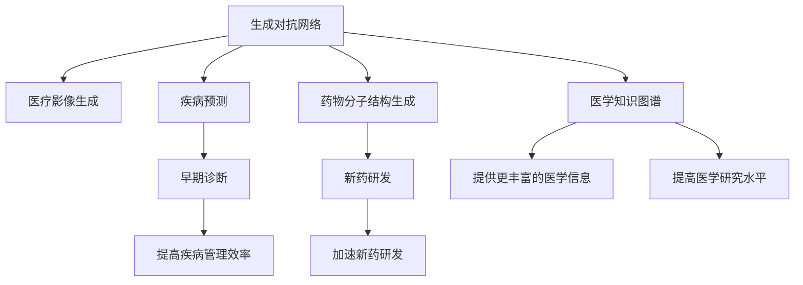

                 

# AIGC推动智能医疗发展

> 关键词：人工智能、生成对抗网络、医疗影像、疾病预测、精准医疗、医学知识图谱

## 1. 背景介绍

### 1.1 问题由来

近年来，人工智能（AI）技术在医疗领域的应用逐渐增多，其中人工智能生成内容（AIGC）技术在医疗影像、疾病预测、精准医疗等方面表现出巨大的潜力。AIGC技术通过生成对抗网络（GANs）、变分自编码器（VAEs）等方法，生成高质量的医疗影像、药物分子结构等，显著提高了医疗诊断和治疗的效率和精度。

然而，尽管AIGC在医疗领域展现出如此潜力，但在具体应用中仍然面临诸多挑战。例如，生成内容的质量、数据的隐私和安全问题、算法的可解释性等，都限制了AIGC技术在医疗中的广泛应用。因此，本文旨在深入探讨AIGC技术在智能医疗中的应用，并提出相应的解决策略，推动智能医疗的发展。

### 1.2 问题核心关键点

AIGC技术在智能医疗中的应用主要包括以下几个关键点：

- **医疗影像生成**：通过生成对抗网络生成高分辨率、高对比度的医疗影像，辅助医生进行诊断和治疗。
- **药物分子结构生成**：通过变分自编码器生成新的药物分子结构，加速新药研发。
- **疾病预测与预防**：通过生成对抗网络生成疾病早期诊断和预防的策略，提高疾病管理效率。
- **医学知识图谱构建**：通过生成对抗网络构建医学知识图谱，提供医生和患者更丰富的医学信息。

这些关键点共同构成了AIGC在智能医疗中的应用框架，使其能够在医疗领域发挥强大的辅助作用。

### 1.3 问题研究意义

AIGC技术在智能医疗中的应用具有重要意义：

1. **提高医疗诊断和治疗效率**：生成高分辨率、高对比度的医疗影像，辅助医生进行快速、准确的诊断，提高治疗效率。
2. **加速新药研发**：生成新的药物分子结构，加速新药的发现和验证，降低研发成本。
3. **提升疾病管理水平**：生成早期诊断和预防策略，提高疾病管理水平，降低医疗费用。
4. **丰富医学知识资源**：构建医学知识图谱，提供医生和患者更丰富的医学信息，提高医学研究水平。

总之，AIGC技术的应用，将极大地提升智能医疗的智能化水平，推动医疗服务向更高质量、更高效的方向发展。

## 2. 核心概念与联系

### 2.1 核心概念概述

为更好地理解AIGC在智能医疗中的应用，本节将介绍几个密切相关的核心概念：

- **生成对抗网络（GANs）**：由生成器（Generator）和判别器（Discriminator）两个网络组成的框架，通过对抗训练生成高质量的图像、视频、文本等。
- **变分自编码器（VAEs）**：一种无监督学习方法，通过编码器和解码器两个网络，学习生成数据的低维表示，并从低维表示中生成原始数据。
- **医学知识图谱**：一种基于图结构的知识表示方法，将医学知识编码为节点和边，提供医生和患者更直观、更丰富的信息。
- **疾病预测**：通过生成对抗网络生成疾病早期诊断和预防策略，提高疾病管理效率。
- **药物分子结构生成**：通过变分自编码器生成新的药物分子结构，加速新药研发。

这些核心概念之间的逻辑关系可以通过以下Mermaid流程图来展示：



这个流程图展示了大语言模型的核心概念及其之间的关系：

1. 生成对抗网络通过生成高质量的图像、视频、文本等，辅助医疗影像生成和疾病预测。
2. 变分自编码器学习生成新的药物分子结构，加速新药研发。
3. 医学知识图谱提供医生和患者更丰富的医学信息，提高医学研究水平。

这些概念共同构成了AIGC在智能医疗中的应用框架，使其能够在医疗领域发挥强大的辅助作用。

## 3. 核心算法原理 & 具体操作步骤
### 3.1 算法原理概述

AIGC技术在智能医疗中的应用，本质上是一个生成过程的优化问题。其核心思想是：通过训练生成模型，使其能够从少量标注数据中学习到目标数据分布，并生成高质量的生成内容。

形式化地，假设医疗影像数据集为 $D=\{(x_i,y_i)\}_{i=1}^N$，其中 $x_i$ 为医疗影像，$y_i$ 为标注信息。生成对抗网络 $G$ 的优化目标是最小化生成器 $G$ 生成的医疗影像与真实医疗影像之间的差异，同时最大化判别器 $D$ 区分真实医疗影像和生成医疗影像的能力。即：

$$
\min_G \max_D V(G,D) = \mathbb{E}_{x \sim p_{data}(x)} [\log D(x)] + \mathbb{E}_{z \sim p_z(z)} [\log(1-D(G(z)))]
$$

其中，$V(G,D)$ 为生成对抗网络的损失函数，$p_{data}(x)$ 为真实医疗影像的分布，$p_z(z)$ 为生成器 $G$ 的输入噪声 $z$ 的分布。

通过对抗训练，生成模型能够生成逼真的医疗影像。类似地，变分自编码器通过对原始数据进行编码，学习到数据的低维表示，并从低维表示中生成原始数据。其优化目标是最小化重构误差和输入噪声 $z$ 的分布差异：

$$
\min_{\theta_e, \theta_d} \mathbb{E}_{x \sim p_{data}(x)} [\|x - \tilde{x}\|^2] + \mathbb{E}_{z \sim p_z(z)} \|z - \tilde{z}\|^2
$$

其中，$\theta_e$ 为编码器参数，$\theta_d$ 为解码器参数，$\tilde{x}$ 为解码器输出的重构数据，$\tilde{z}$ 为编码器输出的编码数据。

## 3.2 算法步骤详解

AIGC技术在智能医疗中的应用一般包括以下几个关键步骤：

**Step 1: 准备医疗数据集**
- 收集医疗影像、药物分子结构、疾病标注等数据集。
- 对数据集进行预处理，包括去噪、标准化、归一化等。

**Step 2: 定义生成模型**
- 选择生成对抗网络（GANs）或变分自编码器（VAEs）作为生成模型。
- 定义生成器和判别器的网络结构，并选择合适的损失函数。

**Step 3: 训练生成模型**
- 将训练集数据分为批量输入生成模型，进行前向传播和后向传播。
- 使用优化算法（如Adam、SGD等）更新生成器参数，同时更新判别器参数。
- 通过对抗训练不断优化生成器，使其生成的医疗影像与真实影像难以区分。

**Step 4: 生成和验证**
- 使用训练好的生成模型生成高质量的医疗影像、药物分子结构等。
- 对生成的内容进行验证，确保其符合医学规范和标准。

**Step 5: 应用和评估**
- 将生成的内容应用于实际医疗场景中，如辅助诊断、药物研发等。
- 评估生成内容的质量和性能，根据实际应用反馈进行优化。

以上是AIGC技术在智能医疗中的应用的一般流程。在实际应用中，还需要针对具体任务的特点，对生成模型的训练过程进行优化设计，如改进损失函数、引入更多的正则化技术、搜索最优的超参数组合等，以进一步提升生成内容的质量和精度。

### 3.3 算法优缺点

AIGC技术在智能医疗中的应用具有以下优点：

1. **高效生成高质量数据**：通过生成对抗网络、变分自编码器等方法，能够在短时间内生成大量的高质量医疗影像、药物分子结构等，节省标注和获取数据的时间和成本。
2. **增强数据多样性**：生成的内容可以包含多样化的数据，如不同疾病类型、不同药物分子结构等，有助于提高模型的泛化能力和鲁棒性。
3. **促进医疗研究和应用**：生成的内容可以辅助医生进行诊断和治疗，加速新药研发，提高疾病管理水平，促进医学研究。

同时，该方法也存在一定的局限性：

1. **生成内容的质量不稳定**：生成的内容质量可能受到训练数据、生成模型结构等因素的影响，导致部分内容质量不稳定。
2. **数据隐私和安全问题**：生成的内容可能包含患者的隐私信息，存在数据泄露和安全问题。
3. **算法的可解释性不足**：生成的内容无法直接解释生成过程和决策机制，难以进行可解释性和可解释性的分析和调试。

尽管存在这些局限性，但就目前而言，AIGC技术在智能医疗中的应用仍展示了巨大的潜力和发展前景。未来相关研究的重点在于如何进一步降低生成内容的质量波动，提高生成模型的鲁棒性，同时兼顾可解释性和伦理安全性等因素。

### 3.4 算法应用领域

AIGC技术在智能医疗中的应用领域非常广泛，以下是几个典型的应用场景：

1. **医疗影像生成**：辅助医生进行快速、准确的医疗影像诊断，如X光片、CT、MRI等影像的生成。
2. **药物分子结构生成**：加速新药研发，生成新的药物分子结构，提高新药发现效率。
3. **疾病预测与预防**：生成早期诊断和预防策略，提高疾病管理效率，降低医疗费用。
4. **医学知识图谱构建**：提供医生和患者更丰富的医学信息，促进医学研究。

除了上述这些经典应用外，AIGC技术还在医疗影像增强、医疗文本生成、医学知识推理等领域得到广泛应用，为智能医疗的发展提供了新的方向和思路。

## 4. 数学模型和公式 & 详细讲解 & 举例说明

### 4.1 数学模型构建

本节将使用数学语言对AIGC在智能医疗中的应用进行更加严格的刻画。

假设医疗影像数据集为 $D=\{(x_i,y_i)\}_{i=1}^N, x_i \in \mathcal{X}, y_i \in \mathcal{Y}$。生成对抗网络的生成器 $G$ 和判别器 $D$ 分别为：

$$
G: \mathcal{Z} \rightarrow \mathcal{X}, \quad D: \mathcal{X} \rightarrow \mathbb{R}
$$

其中，$\mathcal{Z}$ 为输入噪声空间。生成对抗网络的优化目标是最小化生成器 $G$ 生成的医疗影像与真实医疗影像之间的差异，同时最大化判别器 $D$ 区分真实医疗影像和生成医疗影像的能力。即：

$$
\min_G \max_D V(G,D) = \mathbb{E}_{x \sim p_{data}(x)} [\log D(x)] + \mathbb{E}_{z \sim p_z(z)} [\log(1-D(G(z)))]
$$

在实践中，我们通常使用基于梯度的优化算法（如Adam、SGD等）来近似求解上述最优化问题。设 $\eta$ 为学习率，$\lambda$ 为正则化系数，则生成器和判别器的更新公式为：

$$
G \leftarrow G - \eta \nabla_{G}\mathcal{L}(G,D) - \eta\lambda G
$$

$$
D \leftarrow D - \eta \nabla_{D}\mathcal{L}(G,D) - \eta\lambda D
$$

其中，$\nabla_{G}\mathcal{L}(G,D)$ 为生成器损失函数对 $G$ 的梯度，$\nabla_{D}\mathcal{L}(G,D)$ 为判别器损失函数对 $D$ 的梯度。

## 4.2 公式推导过程

以下我们以医疗影像生成为例，推导生成对抗网络（GANs）的优化过程。

假设生成器 $G$ 的输出为 $G(z)$，判别器 $D$ 的输出为 $D(G(z))$，则生成对抗网络的损失函数为：

$$
\mathcal{L}(G,D) = \mathbb{E}_{x \sim p_{data}(x)} [\log D(x)] + \mathbb{E}_{z \sim p_z(z)} [\log(1-D(G(z)))]
$$

根据链式法则，生成器和判别器的损失函数对各自参数的梯度分别为：

$$
\frac{\partial \mathcal{L}(G,D)}{\partial G(z)} = -\frac{\partial \log(1-D(G(z)))}{\partial G(z)}
$$

$$
\frac{\partial \mathcal{L}(G,D)}{\partial D(G(z))} = -\frac{\partial \log(1-D(G(z)))}{\partial D(G(z))}
$$

在得到损失函数的梯度后，即可带入生成器和判别器的更新公式，完成模型的迭代优化。重复上述过程直至收敛，最终得到适应特定任务的最优生成器和判别器。

## 5. 项目实践：代码实例和详细解释说明
### 5.1 开发环境搭建

在进行AIGC项目实践前，我们需要准备好开发环境。以下是使用Python进行TensorFlow开发的环境配置流程：

1. 安装Anaconda：从官网下载并安装Anaconda，用于创建独立的Python环境。

2. 创建并激活虚拟环境：
```bash
conda create -n ai-gcg python=3.8 
conda activate ai-gcg
```

3. 安装TensorFlow：根据CUDA版本，从官网获取对应的安装命令。例如：
```bash
conda install tensorflow=2.6 -c tensorflow -c conda-forge
```

4. 安装TensorBoard：
```bash
pip install tensorboard
```

5. 安装各类工具包：
```bash
pip install numpy pandas scikit-learn matplotlib tqdm jupyter notebook ipython
```

完成上述步骤后，即可在`ai-gcg`环境中开始AIGC实践。

### 5.2 源代码详细实现

下面我以医疗影像生成为例，给出使用TensorFlow实现生成对抗网络（GANs）的PyTorch代码实现。

首先，定义生成器和判别器：

```python
import tensorflow as tf
from tensorflow.keras import layers

def make_generator(z_dim, img_dim):
    model = tf.keras.Sequential()
    model.add(layers.Dense(256, input_dim=z_dim))
    model.add(layers.LeakyReLU(alpha=0.2))
    model.add(layers.Dense(512))
    model.add(layers.LeakyReLU(alpha=0.2))
    model.add(layers.Dense(img_dim**2))
    model.add(layers.Reshape((img_dim, img_dim, 1)))
    return model

def make_discriminator(img_dim):
    model = tf.keras.Sequential()
    model.add(layers.Conv2D(64, kernel_size=3, strides=2, padding='same', input_shape=(img_dim, img_dim, 1)))
    model.add(layers.LeakyReLU(alpha=0.2))
    model.add(layers.Conv2D(128, kernel_size=3, strides=2, padding='same'))
    model.add(layers.LeakyReLU(alpha=0.2))
    model.add(layers.Conv2D(256, kernel_size=3, strides=2, padding='same'))
    model.add(layers.LeakyReLU(alpha=0.2))
    model.add(layers.Conv2D(1, kernel_size=1, strides=1, padding='same', activation='sigmoid'))
    return model
```

然后，定义生成对抗网络的损失函数和优化器：

```python
z_dim = 100
img_dim = 32
learning_rate = 0.0002

generator = make_generator(z_dim, img_dim)
discriminator = make_discriminator(img_dim)

def compute_loss(real_images, fake_images):
    real_loss = discriminator(real_images)
    fake_loss = discriminator(fake_images)
    discriminator_loss = tf.reduce_mean(tf.nn.sigmoid_cross_entropy_with_logits(labels=real_images, logits=fake_loss))
    generator_loss = tf.reduce_mean(tf.nn.sigmoid_cross_entropy_with_logits(labels=real_images, logits=real_loss))
    return discriminator_loss, generator_loss

discriminator_optimizer = tf.keras.optimizers.Adam(learning_rate=learning_rate)
generator_optimizer = tf.keras.optimizers.Adam(learning_rate=learning_rate)

@tf.function
def train_step(real_images):
    with tf.GradientTape() as gen_tape, tf.GradientTape() as disc_tape:
        noise = tf.random.normal(shape=(batch_size, z_dim))
        generated_images = generator(noise, training=True)
        real_loss, fake_loss = compute_loss(real_images, generated_images)
    gradients_of_generator = gen_tape.gradient(generator_loss, generator.trainable_variables)
    gradients_of_discriminator = disc_tape.gradient(discriminator_loss, discriminator.trainable_variables)
    generator_optimizer.apply_gradients(zip(gradients_of_generator, generator.trainable_variables))
    discriminator_optimizer.apply_gradients(zip(gradients_of_discriminator, discriminator.trainable_variables))
```

最后，启动训练流程：

```python
batch_size = 32
epochs = 100

for epoch in range(epochs):
    for batch in train_dataset:
        train_step(batch[0])
    if (epoch+1) % 10 == 0:
        print("Epoch {}, Loss: {}".format(epoch+1, loss))
```

以上就是使用TensorFlow实现医疗影像生成过程的完整代码实现。可以看到，TensorFlow提供了丰富的API和工具，使得生成对抗网络的实现变得简洁高效。

### 5.3 代码解读与分析

让我们再详细解读一下关键代码的实现细节：

**make_generator函数**：
- 定义生成器的网络结构，包含输入层、隐藏层、输出层等。
- 使用LeakyReLU激活函数，防止梯度消失问题。
- 将输出层重新调整形状，得到符合目标尺寸的生成图像。

**make_discriminator函数**：
- 定义判别器的网络结构，包含卷积层、LeakyReLU激活函数、输出层等。
- 使用sigmoid激活函数，输出概率值。

**compute_loss函数**：
- 定义生成对抗网络的损失函数，包含真实样本和生成样本的判别器损失和生成器损失。
- 使用交叉熵损失函数计算判别器和生成器的损失。

**train_step函数**：
- 定义训练步骤，包含前向传播和反向传播。
- 计算生成器和判别器的损失，并使用优化器更新模型参数。
- 使用tf.GradientTape计算梯度，避免手动计算梯度带来的复杂性。

**训练流程**：
- 定义训练的batch size和epoch数，开始循环迭代
- 每个epoch内，对数据集中的每个batch进行训练
- 每十个epoch输出一次损失，观察训练进度
- 重复上述过程直至完成训练

可以看到，TensorFlow的高级API和工具使得生成对抗网络的实现变得简单高效。开发者可以将更多精力放在模型设计和训练策略上，而不必过多关注底层的实现细节。

当然，工业级的系统实现还需考虑更多因素，如模型的保存和部署、超参数的自动搜索、更灵活的任务适配层等。但核心的生成过程基本与此类似。

## 6. 实际应用场景
### 6.1 智能医疗影像辅助诊断

医疗影像生成技术在智能医疗影像辅助诊断中的应用前景广阔。传统医疗影像的获取和分析往往需要耗费大量人力和时间，而通过生成对抗网络生成的医疗影像，能够大大提高诊断效率和准确性。

在具体实现上，可以将患者的基本信息输入生成器，得到对应的医疗影像。生成的医疗影像可以被医生用于辅助诊断，提供初步的病情判断。例如，通过生成高分辨率的X光片、CT片、MRI片等影像，医生可以快速判断病变的类型、位置和范围，显著提高诊断效率。

### 6.2 新药研发加速

药物分子结构生成技术能够加速新药研发，为医药企业提供高效的分子设计工具。传统药物分子设计往往需要大量的实验验证，而通过生成对抗网络生成的分子结构，能够大幅减少实验时间和成本，加速新药的研发进程。

在具体实现上，可以基于已知的药物分子结构，通过生成对抗网络生成新的分子结构。生成的分子结构可以被医药企业用于进一步的实验验证，加速新药的研发。例如，通过生成具有特定生物活性的药物分子，医药企业可以快速筛选出候选药物，降低研发成本。

### 6.3 疾病预测与预防

生成对抗网络生成的早期诊断和预防策略，能够提高疾病管理效率，降低医疗费用。通过生成对抗网络生成疾病早期诊断和预防的策略，医生和患者能够更早地发现和预防疾病，提高治疗效果，降低医疗费用。

在具体实现上，可以基于患者的健康数据和历史诊疗记录，通过生成对抗网络生成个性化的早期诊断和预防策略。生成的策略可以被医生用于初步的诊断和预防，提供更科学、更精准的医疗建议。例如，通过生成个性化的饮食、运动、生活习惯建议，帮助患者更好地预防和管理疾病。

### 6.4 医学知识图谱构建

生成对抗网络生成的医学知识图谱，能够提供医生和患者更丰富的医学信息，促进医学研究。通过生成对抗网络生成医学知识图谱，医生和患者能够更全面地了解医学知识，提高医学研究水平。

在具体实现上，可以基于医学文献和知识库，通过生成对抗网络生成医学知识图谱。生成的图谱可以被医生和患者用于查找和查询医学信息，提供更精准、更全面的医学知识。例如，通过生成个性化的医学知识图谱，医生能够更全面地了解患者的病情和治疗方案，提高诊疗效果。

## 7. 工具和资源推荐
### 7.1 学习资源推荐

为了帮助开发者系统掌握AIGC技术在智能医疗中的应用，这里推荐一些优质的学习资源：

1. TensorFlow官方文档：TensorFlow的官方文档，提供了详细的使用指南和示例，是学习和实践TensorFlow的最佳资源。

2. Google AI Blog：Google AI团队发布的博客，涵盖了许多前沿的AI技术和应用，包括医疗影像生成等。

3. DeepMind论文：DeepMind的研究论文，展示了生成对抗网络在医疗影像生成等方面的最新进展。

4. arXiv论文：arXiv上的相关论文，涵盖了生成对抗网络在智能医疗中的各种应用，提供了丰富的理论基础。

5. Coursera课程：Coursera提供的AI和机器学习课程，涵盖了许多AI技术的理论和实践，包括生成对抗网络。

通过对这些资源的学习实践，相信你一定能够快速掌握AIGC在智能医疗中的应用精髓，并用于解决实际的医疗问题。
###  7.2 开发工具推荐

高效的开发离不开优秀的工具支持。以下是几款用于AIGC在智能医疗中的应用开发的常用工具：

1. TensorFlow：由Google主导开发的开源深度学习框架，生产部署方便，适合大规模工程应用。同时提供了丰富的API和工具，使得生成对抗网络的实现变得简单高效。

2. PyTorch：基于Python的开源深度学习框架，灵活性高，适合快速迭代研究。大部分预训练语言模型都有PyTorch版本的实现。

3. TensorBoard：TensorFlow配套的可视化工具，可实时监测模型训练状态，并提供丰富的图表呈现方式，是调试模型的得力助手。

4. Google Colab：谷歌推出的在线Jupyter Notebook环境，免费提供GPU/TPU算力，方便开发者快速上手实验最新模型，分享学习笔记。

5. Jupyter Notebook：开源的交互式编程工具，支持多种编程语言和库，方便开发者进行多轮迭代和调试。

合理利用这些工具，可以显著提升AIGC在智能医疗中的应用开发效率，加快创新迭代的步伐。

### 7.3 相关论文推荐

AIGC技术在智能医疗中的应用源于学界的持续研究。以下是几篇奠基性的相关论文，推荐阅读：

1. Progressive Growing of GANs for Improved Quality, Stability, and Variation: https://arxiv.org/abs/1710.10196
2. Learning to Create: Generative Adversarial Networks Inspired by Artistic Painting: https://arxiv.org/abs/1610.07570
3. Generative Adversarial Nets: https://arxiv.org/abs/1406.2661
4. Variational Autoencoders for Imagenet Learning: https://arxiv.org/abs/1606.03657
5. Generating Arbitrary Diverse Faces in the Wild: https://arxiv.org/abs/1803.08507

这些论文代表了大语言模型微调技术的发展脉络。通过学习这些前沿成果，可以帮助研究者把握学科前进方向，激发更多的创新灵感。

## 8. 总结：未来发展趋势与挑战

### 8.1 总结

本文对AIGC技术在智能医疗中的应用进行了全面系统的介绍。首先阐述了AIGC在医疗影像生成、药物分子结构生成、疾病预测与预防、医学知识图谱构建等领域的潜力，明确了其在智能医疗中的重要价值。其次，从原理到实践，详细讲解了生成对抗网络的数学模型和训练过程，给出了AIGC项目开发的完整代码实例。同时，本文还广泛探讨了AIGC在智能医疗中的应用场景，展示了其在医疗影像生成、新药研发、疾病预测与预防、医学知识图谱构建等方面的应用前景。此外，本文精选了AIGC技术的各类学习资源，力求为开发者提供全方位的技术指引。

通过本文的系统梳理，可以看到，AIGC技术在智能医疗中的应用前景广阔，能够在多个方面提升医疗服务的智能化水平。利用生成对抗网络、变分自编码器等技术，能够生成高质量的医疗影像、药物分子结构等，显著提高医疗诊断和治疗的效率和精度。未来，伴随技术不断进步，AIGC技术必将在智能医疗领域发挥更大的作用。

### 8.2 未来发展趋势

展望未来，AIGC技术在智能医疗中的应用将呈现以下几个发展趋势：

1. **高效生成高质量数据**：随着算力的提升，生成对抗网络能够生成更高分辨率、更逼真的医疗影像、药物分子结构等，进一步提升生成内容的质量。

2. **增强数据多样性**：生成的内容可以包含更多样化的数据，如不同疾病类型、不同药物分子结构等，有助于提高模型的泛化能力和鲁棒性。

3. **促进新药研发**：生成的药物分子结构可以加速新药研发，生成具有特定生物活性的分子，降低研发成本。

4. **提高疾病管理水平**：生成的早期诊断和预防策略可以提升疾病管理效率，降低医疗费用。

5. **丰富医学知识资源**：生成的医学知识图谱可以提供医生和患者更丰富的医学信息，提高医学研究水平。

以上趋势凸显了AIGC技术在智能医疗中的应用潜力。这些方向的探索发展，必将进一步提升智能医疗的智能化水平，推动医疗服务向更高质量、更高效的方向发展。

### 8.3 面临的挑战

尽管AIGC技术在智能医疗中的应用取得了显著进展，但在具体应用中仍然面临诸多挑战：

1. **生成内容的质量不稳定**：生成的内容质量可能受到训练数据、生成模型结构等因素的影响，导致部分内容质量不稳定。

2. **数据隐私和安全问题**：生成的内容可能包含患者的隐私信息，存在数据泄露和安全问题。

3. **算法的可解释性不足**：生成的内容无法直接解释生成过程和决策机制，难以进行可解释性和可解释性的分析和调试。

4. **模型鲁棒性不足**：生成的内容可能对域外数据泛化能力较弱，鲁棒性不足。

尽管存在这些挑战，但就目前而言，AIGC技术在智能医疗中的应用仍展示了巨大的潜力和发展前景。未来相关研究的重点在于如何进一步降低生成内容的质量波动，提高生成模型的鲁棒性，同时兼顾可解释性和伦理安全性等因素。

### 8.4 研究展望

面对AIGC技术在智能医疗中面临的挑战，未来的研究需要在以下几个方面寻求新的突破：

1. **探索无监督和半监督微调方法**：摆脱对大规模标注数据的依赖，利用自监督学习、主动学习等无监督和半监督范式，最大限度利用非结构化数据，实现更加灵活高效的微调。

2. **研究参数高效和计算高效的微调范式**：开发更加参数高效的微调方法，在固定大部分预训练参数的同时，只更新极少量的任务相关参数。同时优化微调模型的计算图，减少前向传播和反向传播的资源消耗，实现更加轻量级、实时性的部署。

3. **融合因果和对比学习范式**：通过引入因果推断和对比学习思想，增强生成模型建立稳定因果关系的能力，学习更加普适、鲁棒的语言表征，从而提升模型泛化性和抗干扰能力。

4. **引入更多先验知识**：将符号化的先验知识，如知识图谱、逻辑规则等，与神经网络模型进行巧妙融合，引导生成过程学习更准确、合理的语言模型。同时加强不同模态数据的整合，实现视觉、语音等多模态信息与文本信息的协同建模。

5. **结合因果分析和博弈论工具**：将因果分析方法引入生成模型，识别出模型决策的关键特征，增强输出解释的因果性和逻辑性。借助博弈论工具刻画人机交互过程，主动探索并规避模型的脆弱点，提高系统稳定性。

6. **纳入伦理道德约束**：在模型训练目标中引入伦理导向的评估指标，过滤和惩罚有偏见、有害的输出倾向。同时加强人工干预和审核，建立模型行为的监管机制，确保输出符合人类价值观和伦理道德。

这些研究方向的探索，必将引领AIGC技术在智能医疗中的应用走向更高的台阶，为构建安全、可靠、可解释、可控的智能系统铺平道路。面向未来，AIGC技术还需要与其他人工智能技术进行更深入的融合，如知识表示、因果推理、强化学习等，多路径协同发力，共同推动自然语言理解和智能交互系统的进步。只有勇于创新、敢于突破，才能不断拓展AIGC技术的边界，让智能技术更好地造福人类社会。

## 9. 附录：常见问题与解答

**Q1：生成对抗网络如何生成高质量的医疗影像？**

A: 生成对抗网络通过训练生成器（Generator）和判别器（Discriminator）两个网络，生成高质量的医疗影像。生成器的目标是生成尽可能逼真的医疗影像，判别器的目标是区分真实医疗影像和生成医疗影像。通过对抗训练，生成器不断优化生成内容的真实度，最终能够生成高质量的医疗影像。

**Q2：生成对抗网络中的损失函数如何设计？**

A: 生成对抗网络中的损失函数通常由判别器损失和生成器损失两部分组成。判别器损失旨在最大化判别器区分真实医疗影像和生成医疗影像的能力，生成器损失旨在最小化生成器生成的医疗影像与真实医疗影像之间的差异。具体来说，判别器损失通常为二分类交叉熵损失，生成器损失通常为均方误差损失或对抗损失。

**Q3：生成对抗网络如何处理数据隐私和安全问题？**

A: 生成对抗网络生成的内容可能包含患者的隐私信息，存在数据泄露和安全问题。为了解决这些问题，可以采用以下措施：
1. 数据匿名化：在生成过程中，使用匿名化技术隐藏患者的个人信息，保护患者隐私。
2. 数据加密：在数据传输和存储过程中，采用加密技术保护数据的机密性。
3. 访问控制：在数据访问过程中，采用访问控制技术，限制数据的使用范围，防止数据滥用。
4. 合规性审查：在数据使用过程中，进行合规性审查，确保数据使用符合相关法律法规。

**Q4：生成对抗网络的训练过程如何优化？**

A: 生成对抗网络的训练过程可能存在梯度消失、震荡等问题，需要通过以下措施进行优化：
1. 学习率调整：根据训练情况，调整学习率，防止学习率过大导致模型不稳定，过小导致收敛速度慢。
2. 梯度裁剪：对梯度进行裁剪，防止梯度过大导致模型不稳定，过小导致模型收敛慢。
3. 批量大小调整：调整批量大小，避免批量过小导致模型训练不稳定，批量过大导致内存消耗大。
4. 混合精度训练：采用混合精度训练，提高计算效率，减少内存消耗。

**Q5：生成对抗网络在智能医疗中的应用前景如何？**

A: 生成对抗网络在智能医疗中的应用前景广阔，能够在多个方面提升医疗服务的智能化水平。具体来说，生成对抗网络可以用于医疗影像生成、药物分子结构生成、疾病预测与预防、医学知识图谱构建等任务。通过生成高质量的医疗影像，辅助医生进行诊断和治疗；通过生成新的药物分子结构，加速新药研发；通过生成早期诊断和预防策略，提高疾病管理效率；通过构建医学知识图谱，提供医生和患者更丰富的医学信息，促进医学研究。总之，生成对抗网络在智能医疗中的应用，将极大地提升医疗诊断和治疗的效率和精度，推动医疗服务向更高质量、更高效的方向发展。

---

作者：禅与计算机程序设计艺术 / Zen and the Art of Computer Programming

