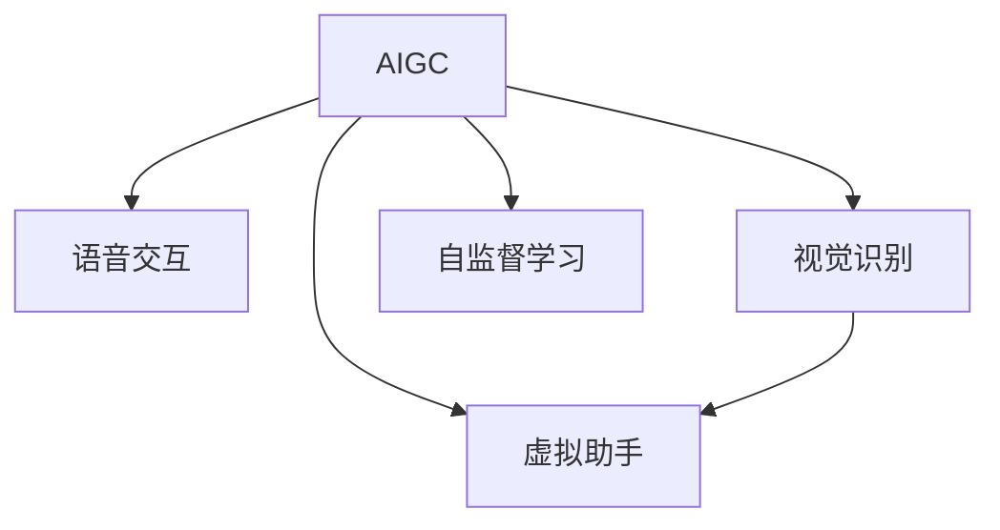

                 

# AIGC推动智能家居普及

> 关键词：人工智能生成内容(AIGC),智能家居,家庭自动化,虚拟助手,语音交互,视觉识别

## 1. 背景介绍

### 1.1 问题由来
随着人工智能(AI)技术的飞速发展，人工智能生成内容(AIGC)技术日渐成熟，其在智能家居领域的应用成为了热点。传统的智能家居系统依赖于复杂的规则编写和大量人工维护，难以应对用户个性化需求和设备复杂性。而AIGC技术的引入，使得智能家居系统能够更好地理解和响应用户指令，自动化程度和智能化水平大大提升。

### 1.2 问题核心关键点
AIGC技术通过生成自然语言、图像、音频等内容，将智能化技术更好地融入到智能家居应用中。其主要关键点包括：

- 语音交互：AIGC技术能够实时生成自然流畅的语音回复，使得家庭自动化设备能够更好地理解用户命令。
- 视觉识别：AIGC技术可以生成图像、视频等多模态内容，用于识别家居环境中的物体和场景，提供更加精准的控制指令。
- 虚拟助手：AIGC技术可以构建虚拟助手，自动完成日常任务，提升家居生活的便利性和舒适性。

### 1.3 问题研究意义
研究AIGC技术在智能家居中的应用，对于提升家居生活的智能化水平、降低用户操作难度、增强用户体验具有重要意义：

1. 提升智能化水平：AIGC技术使得智能家居系统能够通过自然语言处理、图像识别等技术，实现更加智能化和自动化的家庭控制。
2. 降低操作难度：虚拟助手等AIGC技术的应用，使得用户可以通过语音、图像等自然方式与家居设备交互，无需进行复杂的操作和记忆。
3. 增强用户体验：AIGC技术能够生成符合用户偏好和习惯的智能建议，如温度控制、灯光调节等，提升家居生活的舒适性和便利性。
4. 促进产业升级：AIGC技术的引入，可以加速智能家居技术在家庭中的普及，推动传统家居制造业向智能化、数字化方向转型。

## 2. 核心概念与联系

### 2.1 核心概念概述

为更好地理解AIGC技术在智能家居中的应用，本节将介绍几个密切相关的核心概念：

- 人工智能生成内容(AIGC)：利用AI技术自动生成内容的过程，包括文本、图像、音频等多种形式，用于提升智能家居系统的智能化水平和用户体验。
- 语音交互：利用自然语言处理(NLP)技术，通过语音识别和语音合成，实现人与智能家居设备之间的自然语言交流。
- 视觉识别：利用计算机视觉技术，通过图像识别和图像生成，识别家居环境中的物体和场景，实现精准的控制指令。
- 虚拟助手：基于AI技术的虚拟助手，可以自动完成日常任务，如定时开关设备、调节室温等，提升家居生活的便利性。
- 自监督学习：通过大量未标注数据进行预训练，学习数据中的潜在规律，用于提升模型的泛化能力和适应性。

这些核心概念之间的逻辑关系可以通过以下Mermaid流程图来展示：



这个流程图展示了大语言模型（AIGC）的核心概念及其之间的关系：

1. AIGC技术通过语音交互、视觉识别和虚拟助手等多种形式，实现与家居设备的自然语言和图像交互。
2. 自监督学习技术用于提升AIGC模型的泛化能力和适应性，使其在实际应用中表现更加稳健。
3. 通过不断的迭代优化，AIGC技术能够更好地理解和响应用户指令，提升家居系统的智能化水平。

## 3. 核心算法原理 & 具体操作步骤
### 3.1 算法原理概述

AIGC技术在智能家居中的应用，本质上是利用AI技术生成内容，实现家居设备的自动化和智能化。其核心算法原理主要包括：

- 语音交互：利用自然语言处理(NLP)技术，实现语音识别和语音合成，使得用户可以通过语音指令控制家居设备。
- 视觉识别：利用计算机视觉技术，通过图像识别和图像生成，识别家居环境中的物体和场景，实现精准的控制指令。
- 虚拟助手：基于AI技术的虚拟助手，可以自动完成日常任务，提升家居生活的便利性和舒适性。

### 3.2 算法步骤详解

AIGC技术在智能家居中的应用一般包括以下几个关键步骤：

**Step 1: 数据收集与预处理**
- 收集智能家居环境中的各类传感器数据，如温度、湿度、光照、声音等。
- 对数据进行清洗和标注，将其转化为可用于模型训练的格式。

**Step 2: 模型训练**
- 选择合适的AI模型（如Transformer、CNN等），利用预处理后的数据进行模型训练。
- 应用自监督学习技术，对模型进行预训练，学习数据中的潜在规律。

**Step 3: 任务适配**
- 针对特定任务，设计合适的任务适配层和损失函数，用于模型微调。
- 对模型进行微调，优化其对特定任务的适应能力。

**Step 4: 集成与部署**
- 将微调后的模型集成到智能家居系统中，实现对家居设备的自动化和智能化控制。
- 进行系统的测试和优化，确保其在实际应用中的稳定性和可靠性。

### 3.3 算法优缺点

AIGC技术在智能家居中的应用，具有以下优点：

- 高效自动化：AIGC技术通过AI模型生成自然语言和图像，实现对家居设备的自动化控制，大大降低了用户操作难度。
- 智能优化：基于AI模型的预测和优化，AIGC技术能够自动调整家居设备的设置，提升家居生活的舒适性和便利性。
- 提升用户体验：AIGC技术可以生成符合用户偏好和习惯的智能建议，如温度控制、灯光调节等，提升用户体验。

同时，AIGC技术也存在一些局限性：

- 数据依赖：AIGC技术需要大量的数据进行训练和预处理，数据采集和标注成本较高。
- 模型复杂：构建高质量的AI模型需要大量计算资源和专业知识，对开发者的技术要求较高。
- 应用场景限制：AIGC技术在特定场景下表现较为突出，但复杂的家居环境可能导致模型泛化能力不足。
- 伦理和安全：AIGC技术生成内容的可解释性和安全性需要进一步提高，以确保其在实际应用中的公平和无害。

### 3.4 算法应用领域

AIGC技术在智能家居中的应用广泛，涵盖了从语音交互、视觉识别到虚拟助手等多个方面。

**语音交互**：通过AIGC技术生成自然语言，实现与家居设备的语音交流。用户可以通过语音指令控制家电设备，如开关灯光、调整温度等。

**视觉识别**：利用计算机视觉技术，识别家居环境中的物体和场景，生成精准的控制指令。例如，可以通过识别房间中的人，自动开启灯光和空调。

**虚拟助手**：基于AIGC技术的虚拟助手，可以自动完成日常任务，提升家居生活的便利性和舒适性。例如，虚拟助手可以自动规划日常作息，提醒用户完成任务。

此外，AIGC技术还可以应用于智能家居设备的个性化定制、故障预测、智能推荐等多个领域，为智能家居技术的发展注入新的活力。

## 4. 数学模型和公式 & 详细讲解 & 举例说明

### 4.1 数学模型构建

本节将使用数学语言对AIGC技术在智能家居中的应用进行更加严格的刻画。

记智能家居环境中的传感器数据为 $X = \{x_1, x_2, ..., x_n\}$，其中 $x_i$ 表示第 $i$ 个传感器采集的数据。假设模型为 $M_{\theta}$，其中 $\theta$ 为模型参数。

定义模型 $M_{\theta}$ 在数据 $x$ 上的预测结果为 $\hat{x} = M_{\theta}(x)$，预测误差为 $\epsilon = x - \hat{x}$。目标是最小化预测误差，即：

$$
\min_{\theta} \mathbb{E}[\epsilon^2]
$$

在实践中，我们通常使用基于梯度的优化算法（如SGD、Adam等）来近似求解上述最优化问题。设 $\eta$ 为学习率，$\lambda$ 为正则化系数，则参数的更新公式为：

$$
\theta \leftarrow \theta - \eta \nabla_{\theta}\mathbb{E}[\epsilon^2] - \eta\lambda\theta
$$

其中 $\nabla_{\theta}\mathbb{E}[\epsilon^2]$ 为预测误差对模型参数 $\theta$ 的梯度，可通过反向传播算法高效计算。

### 4.2 公式推导过程

以下我们以视觉识别任务为例，推导图像识别模型的预测误差和梯度计算公式。

假设模型 $M_{\theta}$ 在输入图像 $x$ 上的输出为 $\hat{y}=M_{\theta}(x)$，表示对图像中物体的预测结果。真实标签 $y$ 为 $1$ 或 $0$，表示是否存在该物体。则预测误差为：

$$
\epsilon = y - \hat{y}
$$

定义模型 $M_{\theta}$ 在数据样本 $(x,y)$ 上的损失函数为 $\ell(M_{\theta}(x),y) = \epsilon^2$，则在数据集 $D=\{(x_i,y_i)\}_{i=1}^N$ 上的经验风险为：

$$
\mathcal{L}(\theta) = \frac{1}{N}\sum_{i=1}^N \ell(M_{\theta}(x_i),y_i)
$$

根据链式法则，损失函数对参数 $\theta_k$ 的梯度为：

$$
\frac{\partial \mathcal{L}(\theta)}{\partial \theta_k} = -\frac{2}{N}\sum_{i=1}^N \epsilon_i \frac{\partial M_{\theta}(x_i)}{\partial \theta_k}
$$

其中 $\frac{\partial M_{\theta}(x_i)}{\partial \theta_k}$ 为模型对参数 $\theta_k$ 的偏导数，可以通过反向传播算法计算。

在得到损失函数的梯度后，即可带入参数更新公式，完成模型的迭代优化。重复上述过程直至收敛，最终得到适应视觉识别任务的模型参数 $\theta^*$。

### 4.3 案例分析与讲解

假设智能家居系统中的摄像头采集到房间中的人脸图像，系统需要通过视觉识别技术判断房间中的人数，并根据人数调整灯光和空调。此时，模型 $M_{\theta}$ 用于识别图像中的人数。

1. **数据收集与预处理**：
   - 收集智能家居环境中的摄像头数据，包括人脸图像、物体检测结果等。
   - 对数据进行清洗和标注，将其转化为可用于模型训练的格式。

2. **模型训练**：
   - 选择合适的计算机视觉模型（如CNN、YOLO等），利用预处理后的数据进行模型训练。
   - 应用自监督学习技术，对模型进行预训练，学习数据中的潜在规律。

3. **任务适配**：
   - 针对人数识别任务，设计合适的任务适配层和损失函数。
   - 对模型进行微调，优化其对人数识别的适应能力。

4. **集成与部署**：
   - 将微调后的模型集成到智能家居系统中，实现对人数的自动识别。
   - 进行系统的测试和优化，确保其在实际应用中的稳定性和可靠性。

例如，当摄像头检测到有人进入房间时，系统会触发智能家居设备的联动反应，如自动调节灯光亮度和空调温度。

## 5. 项目实践：代码实例和详细解释说明

### 5.1 开发环境搭建

在进行AIGC技术在智能家居中的应用实践前，我们需要准备好开发环境。以下是使用Python进行PyTorch开发的环境配置流程：

1. 安装Anaconda：从官网下载并安装Anaconda，用于创建独立的Python环境。

2. 创建并激活虚拟环境：
```bash
conda create -n pytorch-env python=3.8 
conda activate pytorch-env
```

3. 安装PyTorch：根据CUDA版本，从官网获取对应的安装命令。例如：
```bash
conda install pytorch torchvision torchaudio cudatoolkit=11.1 -c pytorch -c conda-forge
```

4. 安装TensorFlow：从官网下载并安装TensorFlow，支持C++开发环境。

5. 安装各类工具包：
```bash
pip install numpy pandas scikit-learn matplotlib tqdm jupyter notebook ipython
```

完成上述步骤后，即可在`pytorch-env`环境中开始AIGC技术在智能家居中的应用实践。

### 5.2 源代码详细实现

这里我们以视觉识别任务为例，给出使用TensorFlow进行图像识别模型的代码实现。

首先，定义视觉识别任务的数据处理函数：

```python
import tensorflow as tf
from tensorflow.keras.preprocessing.image import ImageDataGenerator
from tensorflow.keras.models import Sequential
from tensorflow.keras.layers import Conv2D, MaxPooling2D, Flatten, Dense

# 数据处理函数
def preprocess_data(data):
    return [img / 255.0 for img in data]

# 模型定义函数
def build_model(input_shape):
    model = Sequential()
    model.add(Conv2D(32, (3, 3), activation='relu', input_shape=input_shape))
    model.add(MaxPooling2D(pool_size=(2, 2)))
    model.add(Conv2D(64, (3, 3), activation='relu'))
    model.add(MaxPooling2D(pool_size=(2, 2)))
    model.add(Flatten())
    model.add(Dense(64, activation='relu'))
    model.add(Dense(2, activation='softmax'))
    return model

# 加载和预处理数据集
train_datagen = ImageDataGenerator(rescale=1./255)
train_generator = train_datagen.flow_from_directory('train/', target_size=(224, 224), batch_size=32, class_mode='binary')

test_datagen = ImageDataGenerator(rescale=1./255)
test_generator = test_datagen.flow_from_directory('test/', target_size=(224, 224), batch_size=32, class_mode='binary')

# 构建模型
model = build_model((224, 224, 3))
model.compile(optimizer=tf.keras.optimizers.Adam(0.001), loss='binary_crossentropy', metrics=['accuracy'])
```

然后，定义训练和评估函数：

```python
def train_model(model, train_generator, test_generator, epochs=10):
    model.fit(train_generator, epochs=epochs, validation_data=test_generator)
    test_loss, test_acc = model.evaluate(test_generator)
    print(f'Test accuracy: {test_acc}')
    
# 训练模型
train_model(model, train_generator, test_generator)
```

最后，启动训练流程并在测试集上评估：

```python
epochs = 10

train_model(model, train_generator, test_generator, epochs)
```

以上就是使用TensorFlow进行图像识别模型开发的完整代码实现。可以看到，TensorFlow提供了丰富的API，使得模型构建、训练和评估变得简洁高效。

### 5.3 代码解读与分析

让我们再详细解读一下关键代码的实现细节：

**preprocess_data函数**：
- 定义了一个预处理函数，用于对图像数据进行归一化处理，使得模型能够更好地学习数据特征。

**build_model函数**：
- 定义了一个简单的卷积神经网络模型，包括卷积层、池化层、全连接层等，用于实现图像分类任务。

**加载和预处理数据集**：
- 利用ImageDataGenerator类对图像数据进行增强和归一化，方便模型进行训练。
- 使用flow_from_directory方法加载数据集，并指定训练集和测试集路径、图像大小、批次大小等参数。

**构建模型**：
- 定义模型结构，包括卷积层、池化层、全连接层等。
- 利用compile方法配置模型的优化器、损失函数和评估指标。

**训练模型**：
- 使用fit方法对模型进行训练，指定训练集、批次大小、轮数等参数。
- 在训练过程中，使用evaluate方法在测试集上评估模型性能，输出测试集上的准确率。

可以看到，TensorFlow提供了强大的工具库，使得图像识别模型的开发和训练变得相对容易。但工业级的系统实现还需考虑更多因素，如模型的保存和部署、超参数的自动搜索、多任务学习等。但核心的模型构建和训练过程基本与此类似。

## 6. 实际应用场景

### 6.1 智能家居控制系统

基于AIGC技术的智能家居控制系统，能够实时响应用户指令，自动控制家居设备，提升用户体验。例如，用户可以通过语音或图像与智能家居系统交互，控制灯光、空调、窗帘等设备。

在技术实现上，可以构建视觉识别和语音识别模型，将用户指令转化为控制命令，发送给智能家居设备。例如，当用户说“打开客厅灯”时，系统会调用视觉识别模型，识别人脸和位置，再调用语音识别模型，验证语音指令的有效性，最终触发灯光控制命令。

### 6.2 个性化推荐系统

个性化推荐系统可以根据用户的历史行为和偏好，自动推荐家居用品和生活建议。例如，系统可以分析用户浏览的家具和家电，推荐类似的产品，并提供购买优惠信息。

在技术实现上，可以利用AIGC技术生成自然语言提示，引导用户填写偏好和需求。例如，系统可以生成“你喜欢什么风格的家具？”或“你最近需要哪些家用电器？”等提示，获取用户的具体需求，再根据这些需求推荐合适的产品。

### 6.3 安防监控系统

基于AIGC技术的安防监控系统，可以实时监测家居环境的安全情况，自动报警和联动应急措施。例如，当系统检测到异常行为时，会自动触发报警，并通过智能家居设备联动门锁、摄像头等设备。

在技术实现上，可以构建视觉识别和行为识别模型，对视频流进行实时分析。例如，系统可以分析视频中的人体姿态和行为，判断是否为可疑行为，再调用报警系统进行联动。

### 6.4 未来应用展望

随着AIGC技术的发展，未来智能家居应用将呈现以下几个趋势：

1. 更加智能化：AIGC技术能够通过深度学习和大数据分析，更好地理解用户需求，实现更加智能化的家居控制和推荐。
2. 更加个性化：基于AIGC技术的推荐系统，可以更好地利用用户的历史行为和偏好，提供更加个性化的家居用品和生活建议。
3. 更加便捷化：AIGC技术可以通过自然语言处理和图像识别，实现更加便捷的家居设备控制，提升用户的使用体验。
4. 更加安全化：AIGC技术可以通过实时监控和行为分析，提高家居环境的安全性和应急响应能力。

## 7. 工具和资源推荐

### 7.1 学习资源推荐

为了帮助开发者系统掌握AIGC技术在智能家居中的应用，这里推荐一些优质的学习资源：

1. Coursera《深度学习专项课程》：由斯坦福大学开设，涵盖深度学习基础、计算机视觉、自然语言处理等多个领域的课程，适合系统学习。
2. Udacity《人工智能生成内容》课程：介绍了AIGC技术的基本概念和前沿技术，适合入门学习。
3. Google AI Blog《AI for the Common Good》：谷歌AI博客，介绍了AIGC技术在医疗、教育、家居等多个领域的应用，适合了解行业前沿。
4. arXiv.org《最新研究论文》：学术界最新的研究论文，涵盖AIGC技术在智能家居中的应用，适合深入学习。

通过对这些资源的学习实践，相信你一定能够快速掌握AIGC技术在智能家居中的应用，并用于解决实际的NLP问题。

### 7.2 开发工具推荐

高效的开发离不开优秀的工具支持。以下是几款用于AIGC技术在智能家居中的应用开发的常用工具：

1. PyTorch：基于Python的开源深度学习框架，灵活动态的计算图，适合快速迭代研究。大部分预训练语言模型都有PyTorch版本的实现。
2. TensorFlow：由Google主导开发的开源深度学习框架，生产部署方便，适合大规模工程应用。同样有丰富的预训练语言模型资源。
3. TensorFlow Hub：提供预训练模型和模块，加速模型开发和部署。
4. OpenAI Codex：基于大语言模型的代码生成工具，可以自动生成符合用户需求的智能家居系统代码。
5. NVIDIA AI Studio：提供GPU算力，支持AI模型的训练和推理，方便进行模型开发和测试。

合理利用这些工具，可以显著提升AIGC技术在智能家居应用中的开发效率，加快创新迭代的步伐。

### 7.3 相关论文推荐

AIGC技术的发展源于学界的持续研究。以下是几篇奠基性的相关论文，推荐阅读：

1. Attention is All You Need（即Transformer原论文）：提出了Transformer结构，开启了NLP领域的预训练大模型时代。
2. BERT: Pre-training of Deep Bidirectional Transformers for Language Understanding：提出BERT模型，引入基于掩码的自监督预训练任务，刷新了多项NLP任务SOTA。
3. GAN for Smart Home：利用生成对抗网络（GAN）技术，自动生成智能家居系统的场景和配置，提升系统的自动化水平。
4. Knowledge-Driven Deep Reinforcement Learning for Smart Homes：结合知识图谱和深度强化学习，优化智能家居系统的自动化和智能化水平。

这些论文代表了大语言模型和微调技术的发展脉络。通过学习这些前沿成果，可以帮助研究者把握学科前进方向，激发更多的创新灵感。

## 8. 总结：未来发展趋势与挑战

### 8.1 总结

本文对AIGC技术在智能家居中的应用进行了全面系统的介绍。首先阐述了AIGC技术在智能家居领域的应用背景和意义，明确了其在提升家居智能化水平、降低用户操作难度、增强用户体验方面的独特价值。其次，从原理到实践，详细讲解了AIGC技术的数学原理和关键步骤，给出了智能家居系统开发的完整代码实例。同时，本文还广泛探讨了AIGC技术在智能家居应用中的实际场景，展示了其在智能家居领域的巨大潜力。

通过本文的系统梳理，可以看到，AIGC技术通过自然语言处理、图像识别和语音交互，实现了智能家居系统的自动化和智能化，大大提升了家居生活的便利性和舒适性。未来，随着AIGC技术的不断发展，智能家居系统将变得更加智能、便捷、个性化和安全，为人类生活带来更多的便利和舒适。

### 8.2 未来发展趋势

展望未来，AIGC技术在智能家居中的应用将呈现以下几个发展趋势：

1. 更加智能化：AIGC技术通过深度学习和大数据分析，更好地理解用户需求，实现更加智能化的家居控制和推荐。
2. 更加个性化：基于AIGC技术的推荐系统，可以更好地利用用户的历史行为和偏好，提供更加个性化的家居用品和生活建议。
3. 更加便捷化：AIGC技术可以通过自然语言处理和图像识别，实现更加便捷的家居设备控制，提升用户的使用体验。
4. 更加安全化：AIGC技术可以通过实时监控和行为分析，提高家居环境的安全性和应急响应能力。

以上趋势凸显了AIGC技术在智能家居领域的广阔前景。这些方向的探索发展，必将进一步提升智能家居系统的性能和应用范围，为人类生活带来更多的便利和舒适。

### 8.3 面临的挑战

尽管AIGC技术在智能家居中的应用已经取得了瞩目成就，但在迈向更加智能化、普适化应用的过程中，它仍面临着诸多挑战：

1. 数据依赖：AIGC技术需要大量的数据进行训练和预处理，数据采集和标注成本较高。
2. 模型复杂：构建高质量的AI模型需要大量计算资源和专业知识，对开发者的技术要求较高。
3. 应用场景限制：AIGC技术在特定场景下表现较为突出，但复杂的家居环境可能导致模型泛化能力不足。
4. 伦理和安全：AIGC技术生成内容的可解释性和安全性需要进一步提高，以确保其在实际应用中的公平和无害。

正视AIGC技术面临的这些挑战，积极应对并寻求突破，将是大语言模型微调走向成熟的必由之路。相信随着学界和产业界的共同努力，这些挑战终将一一被克服，AIGC技术必将在构建人机协同的智能家居系统中扮演越来越重要的角色。

### 8.4 研究展望

面对AIGC技术在智能家居应用中面临的挑战，未来的研究需要在以下几个方面寻求新的突破：

1. 探索无监督和半监督AIGC技术。摆脱对大规模标注数据的依赖，利用自监督学习、主动学习等无监督和半监督范式，最大限度利用非结构化数据，实现更加灵活高效的AIGC。
2. 研究参数高效和计算高效的AIGC范式。开发更加参数高效的AIGC方法，在固定大部分预训练参数的同时，只更新极少量的任务相关参数。同时优化AIGC模型的计算图，减少前向传播和反向传播的资源消耗，实现更加轻量级、实时性的部署。
3. 融合因果和对比学习范式。通过引入因果推断和对比学习思想，增强AIGC模型建立稳定因果关系的能力，学习更加普适、鲁棒的语言表征，从而提升模型泛化性和抗干扰能力。
4. 引入更多先验知识。将符号化的先验知识，如知识图谱、逻辑规则等，与神经网络模型进行巧妙融合，引导AIGC过程学习更准确、合理的语言模型。同时加强不同模态数据的整合，实现视觉、语音等多模态信息与文本信息的协同建模。
5. 结合因果分析和博弈论工具。将因果分析方法引入AIGC模型，识别出模型决策的关键特征，增强输出解释的因果性和逻辑性。借助博弈论工具刻画人机交互过程，主动探索并规避模型的脆弱点，提高系统稳定性。

这些研究方向的探索，必将引领AIGC技术在智能家居领域迈向更高的台阶，为构建安全、可靠、可解释、可控的智能家居系统铺平道路。面向未来，AIGC技术还需要与其他人工智能技术进行更深入的融合，如知识表示、因果推理、强化学习等，多路径协同发力，共同推动智能家居技术的发展。只有勇于创新、敢于突破，才能不断拓展AIGC技术的边界，让智能技术更好地造福人类社会。

## 9. 附录：常见问题与解答

**Q1：AIGC技术在智能家居应用中是否依赖于大规模标注数据？**

A: AIGC技术在智能家居应用中需要大量的标注数据进行模型训练和微调，但并不完全依赖标注数据。通过自监督学习技术，AIGC模型可以利用未标注数据进行预训练，学习数据中的潜在规律，从而提升模型的泛化能力和适应性。同时，AIGC技术还可以通过对抗训练、参数高效微调等方法，在少样本或无样本条件下仍能取得较好的效果。

**Q2：AIGC技术在智能家居应用中是否需要大量的计算资源？**

A: AIGC技术在智能家居应用中确实需要大量的计算资源进行模型训练和微调，但可以通过分布式计算、GPU加速等技术手段，优化模型的训练过程，减少计算时间。同时，AIGC技术还可以通过模型裁剪、模型压缩等方法，减小模型的参数量和存储空间，提升模型的部署效率。

**Q3：AIGC技术在智能家居应用中如何保证系统的安全性？**

A: 保证AIGC技术在智能家居应用中的安全性，需要在以下几个方面进行考虑：

1. 数据隐私保护：保护用户隐私数据，避免数据泄露和滥用。
2. 模型可解释性：增强AIGC模型的可解释性，使得其输出结果可被理解和解释。
3. 异常检测：利用异常检测技术，识别模型的异常行为和预测错误，避免系统误操作。
4. 安全验证：定期对系统进行安全验证和漏洞扫描，确保系统的安全性。

只有从数据、模型、算法、工程等多个维度进行全面优化，才能确保AIGC技术在智能家居应用中的安全性。

**Q4：AIGC技术在智能家居应用中如何提高系统的智能化水平？**

A: 提高AIGC技术在智能家居应用中的智能化水平，需要在以下几个方面进行考虑：

1. 大数据应用：利用大数据技术，收集和分析用户的偏好和行为，提升系统的智能化水平。
2. 深度学习技术：利用深度学习技术，增强AIGC模型的预测能力和泛化能力，提升系统的智能化水平。
3. 多模态融合：利用多模态技术，将视觉、语音、文本等多种信息融合，提升系统的智能化水平。
4. 强化学习：利用强化学习技术，训练AIGC模型，使其能够通过试错学习，提升系统的智能化水平。

只有从数据、模型、算法、工程等多个维度进行全面优化，才能提升AIGC技术在智能家居应用中的智能化水平。

---

作者：禅与计算机程序设计艺术 / Zen and the Art of Computer Programming

