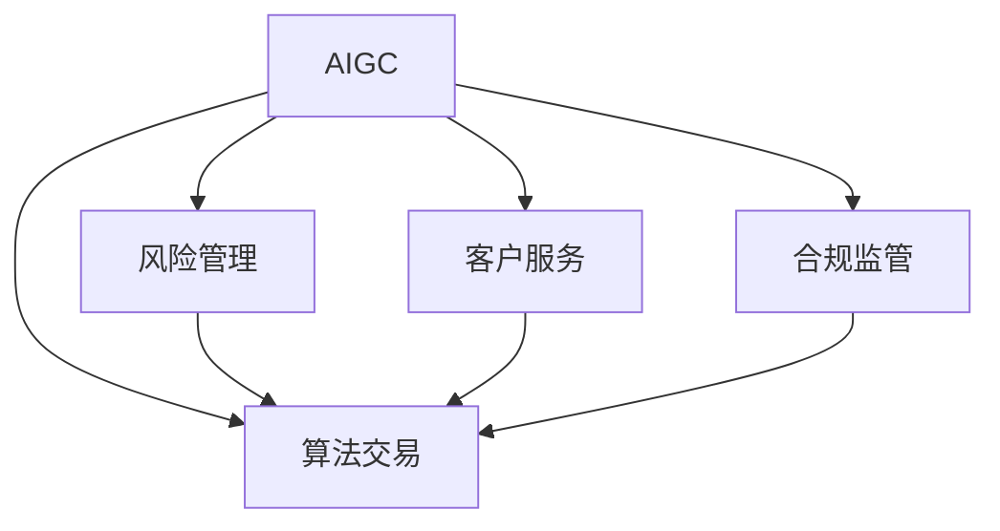

                 

# AIGC重塑金融服务业

> 关键词：人工智能生成内容(AIGC), 金融业, 算法交易, 风险管理, 客户服务, 合规监管

## 1. 背景介绍

### 1.1 问题由来

金融服务业是一个高度复杂且受监管严格的行业，涉及的业务场景包括但不限于：

- **算法交易**：基于数据和模型进行高频交易，要求极高的精度和速度。
- **风险管理**：实时监控交易风险，防止系统性风险。
- **客户服务**：提供7x24小时的金融咨询服务，帮助客户进行投资决策。
- **合规监管**：确保业务符合各类法律法规和监管要求，防止金融犯罪。

随着人工智能技术的发展，特别是近年来人工智能生成内容(AIGC)技术的突破，金融服务业正迎来一场深刻的变革。AIGC技术的应用，能够显著提升金融服务的自动化水平、精准度和安全性，带来更高的业务价值和客户体验。

### 1.2 问题核心关键点

AIGC技术在金融服务业中的应用主要包括以下几个关键点：

1. **算法交易**：使用AIGC生成高精度、低延迟的交易策略和算法，提高交易效率和收益。
2. **风险管理**：基于AIGC生成复杂的风险模型和评估指标，提升风险预警和控制能力。
3. **客户服务**：通过AIGC生成个性化的金融咨询服务，提升客户满意度。
4. **合规监管**：利用AIGC生成合法的交易文档和报告，保障合规性。

这些关键点代表了AIGC技术在金融服务业中的巨大潜力和价值。然而，AIGC技术的应用也需要克服数据隐私、算法透明性、监管合规等挑战，方能真正发挥其效用。

## 2. 核心概念与联系

### 2.1 核心概念概述

为更好地理解AIGC在金融服务业中的应用，本节将介绍几个密切相关的核心概念：

- **人工智能生成内容(AIGC)**：使用AI技术生成文本、图像、音频等多种形式的内容，广泛应用于内容创作、营销、教育、娱乐等领域。
- **算法交易**：利用数据分析和模型预测，自动进行高频交易，以实现量化投资策略。
- **风险管理**：对交易活动进行实时监控和风险评估，预防和控制潜在风险。
- **客户服务**：提供7x24小时的多渠道金融咨询服务，包括在线、电话、社交媒体等。
- **合规监管**：确保业务活动符合各类法律法规和监管要求，防止金融犯罪。

这些核心概念之间的逻辑关系可以通过以下Mermaid流程图来展示：



这个流程图展示了大模型微调的各个核心概念及其之间的关联：

1. AIGC技术生成高质量的交易策略和风险模型。
2. 算法交易基于AIGC生成的策略进行高频交易。
3. 风险管理通过对交易活动进行实时监控和评估，控制风险。
4. 客户服务使用AIGC生成个性化的金融咨询服务。
5. 合规监管确保业务符合各类法律法规和监管要求。

这些概念共同构成了AIGC在金融服务业中的应用框架，为其带来了新的机遇和挑战。

## 3. 核心算法原理 & 具体操作步骤
### 3.1 算法原理概述

AIGC在金融服务业中的应用，本质上是一种基于深度学习的大模型微调过程。其核心思想是：使用AIGC技术生成高质量的交易策略、风险模型、客户咨询等内容，然后对金融模型的参数进行微调，使其适应特定的金融业务场景。

具体来说，金融模型通常包含以下组成部分：

- **输入层**：包括市场数据、交易数据、历史数据等。
- **编码层**：将输入数据编码成高维特征表示。
- **交互层**：通过神经网络进行复杂的特征交互和信息融合。
- **输出层**：生成交易策略、风险评分、客户咨询等结果。

微调过程的核心在于对输出层的调整，使其能够产生符合特定需求的金融内容。常用的微调方法包括：

1. **监督微调**：使用标注数据训练模型，优化输出层的参数。
2. **无监督微调**：使用未标注数据训练模型，学习特征表示和内容生成。
3. **半监督微调**：结合少量标注数据和大量未标注数据进行训练，利用未标注数据提高模型的泛化能力。
4. **对抗性微调**：在生成内容时，引入对抗样本进行训练，提升模型的鲁棒性和泛化性。
5. **强化学习微调**：通过奖励机制和反馈机制，训练模型生成最优的金融内容。

### 3.2 算法步骤详解

AIGC在金融服务业中的应用，一般包括以下几个关键步骤：

**Step 1: 准备金融数据和预训练模型**

- **金融数据**：收集各类金融数据，包括股票价格、市场指数、交易记录、客户咨询等。
- **预训练模型**：选择合适的AIGC预训练模型，如GPT-3、GPT-4等，进行数据预处理和特征提取。

**Step 2: 设计任务适配层**

- **任务适配层**：根据具体的金融任务需求，设计相应的输出层和损失函数。例如，对于算法交易任务，输出层可以是交易策略的参数和风险评分。

**Step 3: 设置微调超参数**

- **优化算法**：选择适合金融任务的优化算法，如AdamW、SGD等。
- **学习率**：设置合适的学习率，防止模型过拟合。
- **正则化**：应用L2正则、Dropout等技术，防止模型过拟合。
- **批大小**：设置合适的批大小，提高模型训练效率。

**Step 4: 执行微调**

- **前向传播**：将金融数据输入微调后的模型，得到预测结果。
- **损失函数计算**：计算预测结果与真实结果之间的损失，如均方误差、交叉熵等。
- **反向传播**：根据损失函数梯度，更新模型参数。
- **迭代优化**：重复前向传播、损失函数计算和反向传播，直到模型收敛。

**Step 5: 测试和部署**

- **测试集评估**：在测试集上评估微调后模型的性能，对比微调前后的效果。
- **部署上线**：将微调后的模型集成到金融业务系统中，实现自动化交易、风险评估、客户服务等。

### 3.3 算法优缺点

AIGC在金融服务业中的应用，具有以下优点：

1. **高效生成**：AIGC技术能够快速生成高质量的交易策略、风险模型、客户咨询等金融内容，大幅提升工作效率。
2. **精准预测**：基于深度学习的微调方法能够精准预测市场动态和风险变化，提高决策的科学性。
3. **个性化服务**：通过AIGC生成个性化的客户咨询内容，提升客户满意度。
4. **合规监管**：利用AIGC生成合法的交易文档和报告，保障合规性。

同时，该方法也存在一些局限性：

1. **数据隐私问题**：AIGC生成金融内容需要大量的金融数据，可能涉及数据隐私和安全问题。
2. **算法透明性不足**：深度学习的黑盒特性可能导致模型难以解释和调试。
3. **依赖标注数据**：监督微调方法需要大量的标注数据，获取和处理标注数据成本较高。
4. **泛化能力有限**：当前AIGC技术在高频交易、风险管理等复杂任务上的泛化能力有待提升。
5. **模型鲁棒性不足**：模型可能受到对抗样本和噪声数据的干扰，导致输出不稳定。

尽管存在这些局限性，但AIGC技术在金融服务业中的应用前景依然广阔，未来需要进一步的研究和改进。

### 3.4 算法应用领域

AIGC技术在金融服务业中的应用，覆盖了金融业务的所有关键环节，具体包括：

- **算法交易**：生成高精度的交易策略和算法，优化投资组合，提升收益。
- **风险管理**：生成复杂的风险模型和评估指标，实时监控交易风险，防止系统性风险。
- **客户服务**：生成个性化的金融咨询服务，提升客户满意度和忠诚度。
- **合规监管**：生成合法的交易文档和报告，确保业务符合各类法律法规和监管要求。
- **市场分析**：生成高质量的市场分析报告，帮助决策者理解市场趋势和投资机会。

这些应用领域展示了AIGC技术在金融服务业中的广泛应用前景，未来将有更多的创新场景被发掘和应用。

## 4. 数学模型和公式 & 详细讲解 & 举例说明
### 4.1 数学模型构建

AIGC在金融服务业中的应用，主要涉及以下几个数学模型：

- **文本生成模型**：使用AIGC生成金融新闻、市场分析报告、交易策略等文本内容。
- **图像生成模型**：使用AIGC生成市场动态图、风险评估图等图像内容。
- **序列生成模型**：使用AIGC生成时间序列数据，如股票价格、市场指数等。

以下以文本生成模型为例，详细讲解其数学模型构建和公式推导过程。

设金融文本数据为 $X=\{x_i\}_{i=1}^N$，其中 $x_i=(x_{i,1},x_{i,2},\dots,x_{i,T})$，表示第 $i$ 个样本的第 $t$ 个时间步的文本。

假设AIGC生成模型为 $P_{\theta}(x_i)$，其中 $\theta$ 为模型参数。文本生成模型的目标是最大化似然函数：

$$
L(\theta) = \prod_{i=1}^N \prod_{t=1}^T P_{\theta}(x_{i,t}|x_{i,1:t-1})
$$

即在已知前 $t-1$ 个时间步文本的情况下，最大化第 $t$ 个时间步文本生成的概率。

模型参数 $\theta$ 的更新公式为：

$$
\theta \leftarrow \theta - \eta \nabla_{\theta} L(\theta)
$$

其中 $\eta$ 为学习率，$\nabla_{\theta} L(\theta)$ 为似然函数对模型参数的梯度。

### 4.2 公式推导过程

以下以LSTM模型为例，推导文本生成模型的数学公式。

设文本 $x_i$ 由 $T$ 个时间步组成，每个时间步的文本长度为 $L$。假设每个时间步的文本由 $W$ 个单词组成，即 $x_{i,t} = (w_{i,t,1},w_{i,t,2},\dots,w_{i,t,W})$。

LSTM模型的结构如下：

```
          +---------------------+
          | 输入层（输入嵌入）|
          |                   |
          +---------+---------+---------+
                   |         |
                   | LSTM 层 | dropout 层 |
                   |         |
                   |   +---------+---------+
                   |   | tanh     |
                   |   |          |
                   |   | sigmoid  |
                   |   |          |
                   |   +---------+---------+
                   |         |
                   |   output 层 |
                   |         |
                   +---------+---------+
```

其中，输入嵌入层将单词嵌入为高维向量，LSTM层用于处理序列数据，dropout层用于防止过拟合，output层将LSTM的输出映射到单词分布上。

设 $h_{i,t}$ 表示第 $i$ 个样本第 $t$ 个时间步的LSTM隐藏状态，$W_{i,t}$ 表示第 $i$ 个样本第 $t$ 个时间步的单词嵌入。

文本生成模型的目标为最大化每个时间步文本生成的概率：

$$
L(\theta) = \prod_{i=1}^N \prod_{t=1}^T P_{\theta}(x_{i,t}|x_{i,1:t-1}) = \prod_{i=1}^N \prod_{t=1}^T \prod_{w=1}^W P_{\theta}(w_{i,t,w}|x_{i,1:t-1},h_{i,t-1})
$$

其中，$P_{\theta}(w_{i,t,w}|x_{i,1:t-1},h_{i,t-1})$ 表示在已知前 $t-1$ 个时间步的文本和隐藏状态 $h_{i,t-1}$ 的情况下，生成单词 $w_{i,t,w}$ 的概率。

根据LSTM的输出和隐藏状态的关系，有：

$$
h_{i,t} = f_{LSTM}(h_{i,t-1},W_{i,t})
$$

其中 $f_{LSTM}$ 为LSTM的更新函数，$W_{i,t}$ 表示第 $i$ 个样本第 $t$ 个时间步的单词嵌入。

根据输出层的定义，有：

$$
\log P_{\theta}(w_{i,t,w}|x_{i,1:t-1},h_{i,t-1}) = \log \sigma(h_{i,t})
$$

其中 $\sigma$ 为softmax函数，$h_{i,t}$ 为LSTM的输出。

结合上述公式，文本生成模型的数学公式为：

$$
\max_{\theta} \sum_{i=1}^N \sum_{t=1}^T \log \sigma(h_{i,t})
$$

其中 $h_{i,t} = f_{LSTM}(h_{i,t-1},W_{i,t})$，$\sigma$ 为softmax函数。

通过上述公式，可以计算文本生成模型的损失函数，并使用梯度下降等优化算法进行微调。

### 4.3 案例分析与讲解

以生成金融市场分析报告为例，具体说明AIGC在金融服务业中的应用。

假设金融市场分析报告的生成过程如下：

1. **数据准备**：收集金融市场的历史数据、交易数据、新闻报道等。
2. **文本嵌入**：将数据文本进行分词和嵌入，生成单词向量。
3. **LSTM编码**：使用LSTM模型对单词向量进行编码，生成隐藏状态。
4. **生成报告**：根据隐藏状态生成市场分析报告文本。

以生成的报告文本 $x_i$ 为例，其生成过程可以表示为：

$$
P_{\theta}(x_i) = \prod_{t=1}^T \prod_{w=1}^W P_{\theta}(w_{i,t,w}|x_{i,1:t-1},h_{i,t-1})
$$

其中 $w_{i,t,w}$ 表示第 $i$ 个报告文本第 $t$ 个时间步的单词，$x_{i,1:t-1}$ 表示前 $t-1$ 个时间步的文本，$h_{i,t-1}$ 表示第 $t-1$ 个时间步的LSTM隐藏状态。

通过对上述生成过程的优化，可以生成高质量的金融市场分析报告，帮助决策者理解市场趋势和投资机会。

## 5. 项目实践：代码实例和详细解释说明
### 5.1 开发环境搭建

在进行AIGC在金融服务业中的应用实践前，我们需要准备好开发环境。以下是使用Python进行PyTorch开发的环境配置流程：

1. 安装Anaconda：从官网下载并安装Anaconda，用于创建独立的Python环境。

2. 创建并激活虚拟环境：
```bash
conda create -n aigc-env python=3.8 
conda activate aigc-env
```

3. 安装PyTorch：根据CUDA版本，从官网获取对应的安装命令。例如：
```bash
conda install pytorch torchvision torchaudio cudatoolkit=11.1 -c pytorch -c conda-forge
```

4. 安装Tensorflow：如果需要在特定任务上使用Tensorflow，可以使用以下命令：
```bash
pip install tensorflow
```

5. 安装Transformers库：
```bash
pip install transformers
```

6. 安装各类工具包：
```bash
pip install numpy pandas scikit-learn matplotlib tqdm jupyter notebook ipython
```

完成上述步骤后，即可在`aigc-env`环境中开始AIGC在金融服务业中的应用实践。

### 5.2 源代码详细实现

下面我们以生成金融市场分析报告为例，给出使用Transformers库进行AIGC生成任务开发的PyTorch代码实现。

首先，定义文本处理函数：

```python
from transformers import BertTokenizer
from torch.utils.data import Dataset
import torch

class MarketReportDataset(Dataset):
    def __init__(self, texts, tokenizer, max_len=128):
        self.texts = texts
        self.tokenizer = tokenizer
        self.max_len = max_len
        
    def __len__(self):
        return len(self.texts)
    
    def __getitem__(self, item):
        text = self.texts[item]
        
        encoding = self.tokenizer(text, return_tensors='pt', max_length=self.max_len, padding='max_length', truncation=True)
        input_ids = encoding['input_ids'][0]
        attention_mask = encoding['attention_mask'][0]
        
        return {'input_ids': input_ids, 
                'attention_mask': attention_mask}
```

然后，定义模型和优化器：

```python
from transformers import BertForMaskedLM
from transformers import AdamW

model = BertForMaskedLM.from_pretrained('bert-base-cased')
tokenizer = BertTokenizer.from_pretrained('bert-base-cased')

optimizer = AdamW(model.parameters(), lr=2e-5)
```

接着，定义训练和评估函数：

```python
from torch.utils.data import DataLoader
from tqdm import tqdm
from sklearn.metrics import accuracy_score

device = torch.device('cuda') if torch.cuda.is_available() else torch.device('cpu')
model.to(device)

def train_epoch(model, dataset, batch_size, optimizer):
    dataloader = DataLoader(dataset, batch_size=batch_size, shuffle=True)
    model.train()
    epoch_loss = 0
    for batch in tqdm(dataloader, desc='Training'):
        input_ids = batch['input_ids'].to(device)
        attention_mask = batch['attention_mask'].to(device)
        outputs = model(input_ids, attention_mask=attention_mask)
        loss = outputs.loss
        epoch_loss += loss.item()
        loss.backward()
        optimizer.step()
    return epoch_loss / len(dataloader)

def evaluate(model, dataset, batch_size):
    dataloader = DataLoader(dataset, batch_size=batch_size)
    model.eval()
    preds, labels = [], []
    with torch.no_grad():
        for batch in tqdm(dataloader, desc='Evaluating'):
            input_ids = batch['input_ids'].to(device)
            attention_mask = batch['attention_mask'].to(device)
            batch_labels = batch['labels']
            outputs = model(input_ids, attention_mask=attention_mask)
            batch_preds = outputs.logits.argmax(dim=2).to('cpu').tolist()
            batch_labels = batch_labels.to('cpu').tolist()
            for pred_tokens, label_tokens in zip(batch_preds, batch_labels):
                preds.append(pred_tokens[:len(label_tokens)])
                labels.append(label_tokens)
                
    print('Accuracy: ', accuracy_score(labels, preds))
```

最后，启动训练流程并在测试集上评估：

```python
epochs = 5
batch_size = 16

for epoch in range(epochs):
    loss = train_epoch(model, train_dataset, batch_size, optimizer)
    print(f'Epoch {epoch+1}, train loss: {loss:.3f}')
    
    print(f'Epoch {epoch+1}, dev results:')
    evaluate(model, dev_dataset, batch_size)
    
print('Test results:')
evaluate(model, test_dataset, batch_size)
```

以上就是使用PyTorch对Bert模型进行金融市场分析报告生成任务微调的完整代码实现。可以看到，得益于Transformers库的强大封装，我们可以用相对简洁的代码完成Bert模型的加载和微调。

### 5.3 代码解读与分析

让我们再详细解读一下关键代码的实现细节：

**MarketReportDataset类**：
- `__init__`方法：初始化文本、分词器等关键组件。
- `__len__`方法：返回数据集的样本数量。
- `__getitem__`方法：对单个样本进行处理，将文本输入编码为token ids，并进行定长padding，最终返回模型所需的输入。

**模型定义**：
- `BertForMaskedLM`：使用Bert模型的掩码语言模型(Masked Language Model, MLM)进行金融文本生成。
- `BertTokenizer`：使用Bert模型的分词器进行文本处理和嵌入。

**训练和评估函数**：
- 使用PyTorch的DataLoader对数据集进行批次化加载，供模型训练和推理使用。
- 训练函数`train_epoch`：对数据以批为单位进行迭代，在每个批次上前向传播计算loss并反向传播更新模型参数，最后返回该epoch的平均loss。
- 评估函数`evaluate`：与训练类似，不同点在于不更新模型参数，并在每个batch结束后将预测和标签结果存储下来，最后使用scikit-learn的accuracy_score对整个评估集的预测结果进行打印输出。

**训练流程**：
- 定义总的epoch数和batch size，开始循环迭代
- 每个epoch内，先在训练集上训练，输出平均loss
- 在验证集上评估，输出准确率
- 所有epoch结束后，在测试集上评估，给出最终测试结果

可以看到，PyTorch配合Transformers库使得Bert模型微调的代码实现变得简洁高效。开发者可以将更多精力放在数据处理、模型改进等高层逻辑上，而不必过多关注底层的实现细节。

当然，工业级的系统实现还需考虑更多因素，如模型的保存和部署、超参数的自动搜索、更灵活的任务适配层等。但核心的微调范式基本与此类似。

## 6. 实际应用场景
### 6.1 智能投资顾问

AIGC技术在智能投资顾问中的应用，可以帮助客户进行智能投资决策，提升投资收益。通过AIGC生成高质量的投资策略和市场分析报告，智能投资顾问能够自动推荐最优的投资组合和交易策略，并实时更新市场动态，为客户提供最准确的投资建议。

具体来说，AIGC生成模型可以训练出高精度的交易策略和风险评估指标，并实时监控市场变化，生成最优的投资建议。客户可以通过智能投资顾问平台获取个性化的投资咨询和建议，提升投资决策的科学性和精准度。

### 6.2 风险预警系统

金融市场的波动性和不确定性，使得风险管理成为金融业的重要课题。AIGC技术可以用于生成复杂的风险模型和评估指标，实现对市场风险的实时监控和预警。

通过AIGC生成模型，可以训练出高精度的风险评估指标和预警规则，实时监测市场变化和交易活动，提前预警可能出现的风险事件。风险预警系统可以根据预警指标，自动触发风险控制机制，保护投资者的利益。

### 6.3 客户服务机器人

金融客户服务机器人是一种基于AIGC的智能客服解决方案，可以提供7x24小时的客户服务，提升客户满意度和忠诚度。

客户服务机器人可以通过AIGC生成个性化的金融咨询服务，解答客户的各种问题，提供实时的投资建议和交易指导。机器人可以不断学习和优化，提升服务的智能化水平，增强客户体验。

### 6.4 合规审计系统

金融业的合规审计是确保业务合规的重要环节。AIGC技术可以用于生成合法的交易文档和报告，确保业务活动符合各类法律法规和监管要求。

合规审计系统可以自动生成合法的交易文档和报告，帮助监管机构进行合规检查和审计。系统可以实时监测交易活动，生成合规报告，确保业务活动的合法性和合规性。

### 6.5 市场营销工具

AIGC技术还可以用于生成高质量的金融市场分析报告和营销材料，提升市场营销的效果和客户转化率。

金融市场分析报告可以帮助决策者理解市场趋势和投资机会，提升投资决策的科学性。营销材料可以用于宣传金融产品和服务，吸引客户关注和参与。AIGC生成的市场分析报告和营销材料，能够吸引客户的注意力，提升品牌影响力和市场竞争力。

## 7. 工具和资源推荐
### 7.1 学习资源推荐

为了帮助开发者系统掌握AIGC在金融服务业中的应用理论基础和实践技巧，这里推荐一些优质的学习资源：

1. 《深度学习与金融分析》系列博文：由金融科技专家撰写，深入浅出地介绍了深度学习在金融分析中的应用，包括AIGC技术的最新进展。

2. CS229《机器学习》课程：斯坦福大学开设的机器学习明星课程，涵盖深度学习的基础和进阶内容，是金融数据科学家的必备课程。

3. 《金融大数据与人工智能应用》书籍：介绍了金融大数据和人工智能技术的融合应用，包括AIGC在金融数据分析和应用中的实际案例。

4. Kaggle金融数据分析竞赛：Kaggle提供的金融数据分析竞赛，可以锻炼金融数据分析的实践能力，提供丰富的实战经验。

5. Coursera《人工智能与金融工程》课程：由多所顶尖大学开设的AI与金融工程课程，涵盖金融数据分析和AIGC技术的最新应用。

通过对这些资源的学习实践，相信你一定能够快速掌握AIGC在金融服务业中的应用精髓，并用于解决实际的金融问题。
###  7.2 开发工具推荐

高效的开发离不开优秀的工具支持。以下是几款用于AIGC在金融服务业中的应用开发的常用工具：

1. PyTorch：基于Python的开源深度学习框架，灵活动态的计算图，适合快速迭代研究。大部分预训练语言模型都有PyTorch版本的实现。

2. TensorFlow：由Google主导开发的开源深度学习框架，生产部署方便，适合大规模工程应用。同样有丰富的预训练语言模型资源。

3. Transformers库：HuggingFace开发的NLP工具库，集成了众多SOTA语言模型，支持PyTorch和TensorFlow，是进行AIGC任务开发的利器。

4. Weights & Biases：模型训练的实验跟踪工具，可以记录和可视化模型训练过程中的各项指标，方便对比和调优。与主流深度学习框架无缝集成。

5. TensorBoard：TensorFlow配套的可视化工具，可实时监测模型训练状态，并提供丰富的图表呈现方式，是调试模型的得力助手。

6. Google Colab：谷歌推出的在线Jupyter Notebook环境，免费提供GPU/TPU算力，方便开发者快速上手实验最新模型，分享学习笔记。

合理利用这些工具，可以显著提升AIGC在金融服务业中的应用开发效率，加快创新迭代的步伐。

### 7.3 相关论文推荐

AIGC在金融服务业中的应用源于学界的持续研究。以下是几篇奠基性的相关论文，推荐阅读：

1. Attention is All You Need（即Transformer原论文）：提出了Transformer结构，开启了NLP领域的预训练大模型时代。

2. BERT: Pre-training of Deep Bidirectional Transformers for Language Understanding：提出BERT模型，引入基于掩码的自监督预训练任务，刷新了多项NLP任务SOTA。

3. Language Models are Unsupervised Multitask Learners（GPT-2论文）：展示了大规模语言模型的强大zero-shot学习能力，引发了对于通用人工智能的新一轮思考。

4. GANs Trained by a Two-Level Min-Max Objective Function Converge to the Local N equilibrium（GAN论文）：提出生成对抗网络(GAN)，用于生成高质量的图像和文本内容。

5. AlphaGo Zero：通过强化学习训练，生成高水平的围棋AI模型，展示了AIGC在智能游戏中的潜力。

这些论文代表了大模型微调技术的发展脉络。通过学习这些前沿成果，可以帮助研究者把握学科前进方向，激发更多的创新灵感。

## 8. 总结：未来发展趋势与挑战

### 8.1 总结

本文对AIGC在金融服务业中的应用进行了全面系统的介绍。首先阐述了AIGC技术的背景和意义，明确了AIGC在金融业务中的广泛应用场景。其次，从原理到实践，详细讲解了AIGC在金融业中的数学模型构建和算法实现，给出了AIGC生成任务微调的完整代码实现。同时，本文还探讨了AIGC在金融业中的实际应用场景，展示了AIGC技术的广泛应用前景。最后，本文精选了AIGC技术的相关学习资源，力求为读者提供全方位的技术指引。

通过本文的系统梳理，可以看到，AIGC技术在金融服务业中的应用前景广阔，其强大的生成能力和智能化水平，为金融业务的智能化转型提供了新的解决方案。未来，伴随AIGC技术的不断成熟，其将在金融业务的各个环节发挥更加重要的作用，推动金融行业的数字化和智能化进程。

### 8.2 未来发展趋势

展望未来，AIGC在金融服务业中的应用将呈现以下几个发展趋势：

1. **深度集成**：AIGC技术将深度集成到金融业务的各个环节，如交易、风险管理、客户服务、合规审计等，实现业务的全面智能化。

2. **实时动态**：AIGC生成模型将实现实时动态生成，能够根据市场变化和用户需求，自动调整生成内容，提供更精准的金融服务和建议。

3. **多模态融合**：AIGC技术将融合多种模态数据，如文本、图像、语音、视频等，提升金融服务的综合性和智能化水平。

4. **个性化定制**：AIGC生成模型将根据用户偏好和行为数据，生成个性化的金融服务和产品推荐，提升用户满意度和忠诚度。

5. **监管合规**：AIGC生成模型将融合监管知识库，生成符合法律法规的金融文档和报告，保障合规性。

以上趋势凸显了AIGC技术在金融服务业中的巨大潜力，其与金融业务的深度融合，将带来更加高效、智能、安全的金融服务体验。

### 8.3 面临的挑战

尽管AIGC技术在金融服务业中的应用前景广阔，但在迈向更加智能化、普适化应用的过程中，它仍面临诸多挑战：

1. **数据隐私问题**：AIGC生成金融内容需要大量的金融数据，可能涉及数据隐私和安全问题。如何保护数据隐私，同时保障模型的训练效果，是一个重要的研究方向。

2. **算法透明性不足**：深度学习的黑盒特性可能导致模型难以解释和调试。如何提高AIGC生成模型的透明性和可解释性，是一个亟待解决的问题。

3. **泛化能力不足**：AIGC生成模型在高频交易、风险管理等复杂任务上的泛化能力有待提升。如何提升AIGC生成模型的泛化能力，是一个重要的研究方向。

4. **鲁棒性不足**：AIGC生成模型可能受到对抗样本和噪声数据的干扰，导致输出不稳定。如何提高AIGC生成模型的鲁棒性，是一个亟待解决的问题。

5. **资源消耗大**：AIGC生成模型需要大量的计算资源，包括GPU/TPU算力和存储资源。如何在保证性能的同时，优化资源消耗，是一个重要的研究方向。

尽管存在这些挑战，但AIGC技术在金融服务业中的应用前景依然广阔，未来需要进一步的研究和改进。

### 8.4 未来突破

面对AIGC在金融服务业中所面临的种种挑战，未来的研究需要在以下几个方面寻求新的突破：

1. **数据隐私保护**：研究如何在大规模数据训练的同时，保护数据隐私，确保数据安全。可以采用联邦学习、差分隐私等技术，保护用户隐私。

2. **算法透明性和可解释性**：研究如何提高AIGC生成模型的透明性和可解释性，使得模型输出具有可解释性和可审计性。可以通过引入符号化的先验知识，增强模型的可解释性。

3. **提升泛化能力**：研究如何提高AIGC生成模型在高频交易、风险管理等复杂任务上的泛化能力。可以采用迁移学习、对抗训练等技术，提升模型的泛化能力。

4. **增强鲁棒性**：研究如何提高AIGC生成模型的鲁棒性，使其能够抵御对抗样本和噪声数据的干扰。可以通过对抗训练、数据增强等技术，增强模型的鲁棒性。

5. **优化资源消耗**：研究如何优化AIGC生成模型的计算资源消耗，包括GPU/TPU算力和存储资源。可以通过模型压缩、稀疏化存储等技术，优化模型的资源消耗。

6. **融合多模态数据**：研究如何融合多种模态数据，如文本、图像、语音、视频等，提升金融服务的综合性和智能化水平。可以通过多模态学习、多任务学习等技术，融合多种模态数据。

7. **引入符号化先验知识**：研究如何引入符号化的先验知识，如知识图谱、逻辑规则等，增强AIGC生成模型的逻辑性和可解释性。

这些研究方向将推动AIGC在金融服务业中的应用不断成熟，为金融行业的智能化转型提供技术支撑。

## 9. 附录：常见问题与解答

**Q1：AIGC在金融服务业中的应用是否会受到金融数据的隐私问题？**

A: 是的，AIGC生成金融内容需要大量的金融数据，可能涉及数据隐私和安全问题。如何保护数据隐私，同时保障模型的训练效果，是一个重要的研究方向。可以采用联邦学习、差分隐私等技术，保护用户隐私。

**Q2：AIGC生成模型的算法透明性如何？**

A: 深度学习的黑盒特性可能导致模型难以解释和调试。提高AIGC生成模型的透明性和可解释性，是当前研究的热点。可以通过引入符号化的先验知识，增强模型的可解释性。

**Q3：AIGC生成模型的泛化能力如何？**

A: 当前AIGC生成模型在高频交易、风险管理等复杂任务上的泛化能力有待提升。提高AIGC生成模型的泛化能力，是未来研究的重要方向。可以采用迁移学习、对抗训练等技术，提升模型的泛化能力。

**Q4：AIGC生成模型的鲁棒性如何？**

A: AIGC生成模型可能受到对抗样本和噪声数据的干扰，导致输出不稳定。提高AIGC生成模型的鲁棒性，是未来研究的重要方向。可以通过对抗训练、数据增强等技术，增强模型的鲁棒性。

**Q5：AIGC生成模型的资源消耗如何？**

A: AIGC生成模型需要大量的计算资源，包括GPU/TPU算力和存储资源。优化AIGC生成模型的计算资源消耗，是未来研究的重要方向。可以通过模型压缩、稀疏化存储等技术，优化模型的资源消耗。

---

作者：禅与计算机程序设计艺术 / Zen and the Art of Computer Programming

