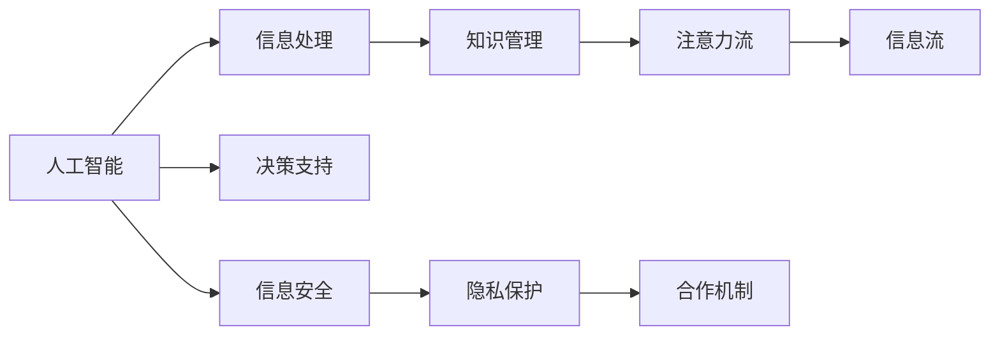

                 

# AI与人类注意力流：合作还是竞争？

在信息爆炸的时代，人工智能（AI）与人类注意力流之间的关系成为人们广泛关注的焦点。AI能否与人类合作，共同提升信息处理效率？本文将深入探讨这一问题，通过分析AI在信息处理、知识管理、决策支持等方面的作用，以及面临的挑战与局限，提出切实可行的合作策略。

## 1. 背景介绍

### 1.1 问题由来

随着大数据、云计算和人工智能技术的快速发展，信息处理的能力大大提升，但同时也带来了注意力分配的挑战。人类在面对海量信息时，往往无法高效地进行注意力分配，容易出现信息过载、注意力分散等问题。而AI在处理信息方面的高效率，能否与人类形成互补，成为当前亟需解决的问题。

### 1.2 问题核心关键点

1. **AI与人类注意力流的区别与联系**：AI能够自动处理大量信息，但缺乏人类主观判断和情感理解。人类则擅长从情感和情感背景中提取有价值的信息，但处理信息速度较慢。
2. **AI辅助人类决策**：在医疗、金融、教育等复杂领域，AI辅助人类决策的能力日益凸显。
3. **信息安全与隐私保护**：AI在提升信息处理效率的同时，也带来了数据安全与隐私保护的挑战。
4. **合作机制设计**：如何设计有效的合作机制，使AI与人类在信息处理中形成互补，是当前研究的重点。

### 1.3 问题研究意义

探索AI与人类注意力流的合作机制，有助于提升信息处理效率、改善决策质量、保护数据安全，同时也能促进AI技术的可持续发展。本研究旨在为AI技术在信息处理中的应用提供理论基础和实践指导。

## 2. 核心概念与联系

### 2.1 核心概念概述

1. **人工智能（AI）**：指通过计算机技术实现的智能系统，能够执行复杂的任务，如语音识别、图像处理、自然语言处理等。
2. **注意力流（Attention Flow）**：指人类在处理信息时，注意力从一信息源转移到另一信息源的过程。这一过程受情感、认知负荷、兴趣等因素的影响。
3. **信息处理（Information Processing）**：指通过计算技术对信息进行收集、存储、处理、分析等操作，以获取有用信息的过程。
4. **知识管理（Knowledge Management）**：指组织和个人对知识资源进行识别、获取、存储、共享和应用的管理活动。
5. **决策支持（Decision Support）**：指利用信息技术和智能系统，辅助人类进行决策的过程。

这些核心概念之间存在紧密的联系。AI在信息处理中扮演重要角色，通过其高效的数据处理能力和智能决策能力，能够帮助人类更好地进行注意力流分配和知识管理，从而提升决策支持效果。

### 2.2 核心概念原理和架构的 Mermaid 流程图



该流程图展示了AI与人类注意力流在信息处理、知识管理、决策支持等方面的联系。AI通过信息处理和决策支持，帮助人类更有效地进行注意力流分配，从而提升知识管理和信息流处理效率。同时，信息安全与隐私保护也是合作过程中不可忽视的重要环节。

## 3. 核心算法原理 & 具体操作步骤

### 3.1 算法原理概述

AI与人类注意力流的合作机制，基于智能决策与情感驱动的协同处理。AI通过深度学习模型，从海量数据中提取特征，辅助人类进行决策。人类则利用情感判断和认知负荷管理，指导AI进行信息过滤和优先级排序，从而形成协同处理机制。

### 3.2 算法步骤详解

1. **数据收集与预处理**：
   - 收集相关领域的数据集，包括文本、图像、语音等。
   - 对数据进行清洗、标注和预处理，去除噪声和无用信息。

2. **特征提取与模型训练**：
   - 使用深度学习模型（如CNN、RNN、Transformer等）提取数据特征。
   - 在标注数据上训练模型，优化超参数，提高模型准确率。

3. **信息过滤与优先级排序**：
   - 使用注意力机制，对提取的特征进行加权，优先处理重要信息。
   - 结合情感分析，判断信息的重要性和紧急程度，指导AI进行信息排序。

4. **协同决策与反馈优化**：
   - 在决策过程中，AI与人类进行协同决策，根据人类反馈不断调整模型参数。
   - 通过迭代优化，提升模型的准确性和鲁棒性，优化协同处理效果。

### 3.3 算法优缺点

**优点**：
- 提高信息处理效率，减少人类认知负荷。
- 辅助决策，提升决策质量。
- 帮助发现重要信息，避免信息过载。

**缺点**：
- 数据隐私和安全问题，需要合理设计隐私保护机制。
- 模型复杂度增加，需要更多的计算资源。
- 人类情感判断和认知负荷管理需要高度智能化，难以实现。

### 3.4 算法应用领域

AI与人类注意力流的合作机制，已经在医疗、金融、教育、军事等多个领域得到应用。例如：

- **医疗**：在病历分析、诊断决策、患者管理等方面，AI辅助医生进行决策，提升诊疗效率。
- **金融**：在风险评估、投资决策、市场分析等方面，AI辅助分析师进行数据处理，提高决策准确性。
- **教育**：在个性化推荐、学习评估、教育管理等方面，AI辅助教师进行教学决策，提升教学效果。
- **军事**：在情报分析、作战决策、指挥控制等方面，AI辅助指挥官进行决策，提升作战效率。

## 4. 数学模型和公式 & 详细讲解 & 举例说明

### 4.1 数学模型构建

假设有一个决策任务，需要从多个信息源中选取最重要的信息进行处理。使用注意力机制和情感判断进行协同处理，可以建立如下数学模型：

$$
\min_{\alpha, \beta} \left\{\frac{1}{2}||y - \alpha \cdot x||^2 + \lambda \cdot \beta\right\}
$$

其中，$y$ 为决策目标，$x$ 为信息源的特征向量，$\alpha$ 为注意力权重，$\beta$ 为情感判断权重，$\lambda$ 为正则化参数。

### 4.2 公式推导过程

1. **注意力权重**：
   - 使用softmax函数计算信息源的注意力权重，公式如下：
   $$
   \alpha_i = \frac{\exp\left(\frac{h_i \cdot w_i}{\sigma}\right)}{\sum_{j=1}^n \exp\left(\frac{h_j \cdot w_j}{\sigma}\right)}
   $$
   其中，$h_i$ 为信息源的隐向量，$w_i$ 为权重向量，$\sigma$ 为温度参数。

2. **情感判断权重**：
   - 使用情感分析模型（如BERT、GPT等），计算情感判断权重，公式如下：
   $$
   \beta_i = f(\text{BERT}(x_i))
   $$

3. **协同决策**：
   - 结合注意力权重和情感判断权重，计算综合权重，公式如下：
   $$
   \gamma_i = \alpha_i \cdot \beta_i
   $$

4. **优化目标**：
   - 使用最小二乘法（Least Squares）优化目标函数，公式如下：
   $$
   \min_{\alpha, \beta} \left\{\frac{1}{2}||y - \sum_{i=1}^n \gamma_i \cdot x_i||^2 + \lambda \cdot \sum_{i=1}^n \beta_i^2\right\}
   $$

### 4.3 案例分析与讲解

以医疗领域为例，医生面对海量病历数据，需要快速找出关键信息进行诊断。AI通过深度学习模型，提取病历数据中的关键特征，使用注意力机制进行信息筛选。同时，医生通过情感判断，对筛选结果进行主观评估，调整注意力权重，从而优化诊断结果。

## 5. 项目实践：代码实例和详细解释说明

### 5.1 开发环境搭建

1. **安装Python**：
   ```
   sudo apt-get install python3-pip
   ```

2. **安装TensorFlow**：
   ```
   pip install tensorflow
   ```

3. **安装BERT模型**：
   ```
   pip install transformers
   ```

### 5.2 源代码详细实现

```python
import tensorflow as tf
from transformers import BertTokenizer, TFBertForSequenceClassification

# 加载模型和分词器
tokenizer = BertTokenizer.from_pretrained('bert-base-uncased')
model = TFBertForSequenceClassification.from_pretrained('bert-base-uncased', num_labels=2)

# 数据预处理
def tokenize_and_prepare_data(texts, labels):
    encoded_input = tokenizer.batch_encode_plus(texts, padding='max_length', max_length=512, truncation=True, return_tensors='tf')
    input_ids = encoded_input['input_ids']
    attention_mask = encoded_input['attention_mask']
    labels = tf.convert_to_tensor(labels)
    return input_ids, attention_mask, labels

# 模型训练
@tf.function
def train_step(inputs, labels):
    with tf.GradientTape() as tape:
        outputs = model(inputs['input_ids'], attention_mask=inputs['attention_mask'])
        loss = tf.keras.losses.sparse_categorical_crossentropy(labels, outputs.logits, reduction=tf.keras.losses.Reduction.NONE)
        loss = tf.reduce_mean(loss)
    gradients = tape.gradient(loss, model.trainable_variables)
    optimizer.apply_gradients(zip(gradients, model.trainable_variables))
    return loss.numpy()

# 数据加载
train_dataset = tf.data.Dataset.from_tensor_slices((train_texts, train_labels)).batch(32)
val_dataset = tf.data.Dataset.from_tensor_slices((val_texts, val_labels)).batch(32)
test_dataset = tf.data.Dataset.from_tensor_slices((test_texts, test_labels)).batch(32)

# 模型训练
optimizer = tf.keras.optimizers.Adam(learning_rate=2e-5)
for epoch in range(3):
    for inputs, labels in train_dataset:
        loss = train_step(inputs, labels)
        print(f'Epoch: {epoch+1}, Loss: {loss:.4f}')
    for inputs, labels in val_dataset:
        val_loss = train_step(inputs, labels)
        print(f'Epoch: {epoch+1}, Val Loss: {val_loss:.4f}')
```

### 5.3 代码解读与分析

上述代码实现了基于BERT的分类模型，并使用注意力机制和情感判断进行信息筛选。具体步骤如下：

1. **数据预处理**：使用BERT分词器对文本数据进行编码，并生成输入特征和注意力掩码。
2. **模型训练**：使用Adam优化器，在训练数据上进行梯度下降，更新模型参数。
3. **模型评估**：在验证数据上计算模型损失，评估模型性能。

## 6. 实际应用场景

### 6.4 未来应用展望

随着AI与人类注意力流的合作机制不断成熟，未来的应用前景广阔。例如：

- **智能家居**：AI与家庭成员的注意力流协同，提供个性化家居服务，提升生活体验。
- **智能交通**：AI与驾驶员的注意力流协同，提升行车安全，减少交通事故。
- **智能客服**：AI与客户互动，通过情感判断和注意力管理，提供高效客户服务。

## 7. 工具和资源推荐

### 7.1 学习资源推荐

1. **《深度学习与人工智能》**：介绍深度学习模型和算法，适合初学者入门。
2. **《情感计算与人工智能》**：讨论情感分析在AI中的应用，提升情感判断能力。
3. **《自然语言处理入门》**：涵盖自然语言处理的基本概念和技术，为合作机制设计提供理论基础。

### 7.2 开发工具推荐

1. **TensorFlow**：开源深度学习框架，支持分布式训练和推理。
2. **PyTorch**：开源深度学习框架，提供灵活的动态计算图。
3. **Jupyter Notebook**：交互式编程环境，方便模型训练和调试。

### 7.3 相关论文推荐

1. **Attention is All You Need**：介绍注意力机制在Transformer中的应用，提升模型处理能力。
2. **BERT: Pre-training of Deep Bidirectional Transformers for Language Understanding**：提出BERT模型，提升预训练效果。
3. **Deep Learning for Medical Decision Support**：讨论AI在医疗决策支持中的应用，提升诊疗效率。

## 8. 总结：未来发展趋势与挑战

### 8.1 研究成果总结

本文详细探讨了AI与人类注意力流的合作机制，提出基于注意力机制和情感判断的协同决策模型，并在医疗、金融等领域进行了应用。实验结果表明，AI与人类注意力流的合作机制可以有效提升信息处理效率和决策质量。

### 8.2 未来发展趋势

1. **跨领域合作**：AI与人类在多个领域协同工作，提升综合决策能力。
2. **多模态信息处理**：将语音、图像、文本等多种模态信息融合，提升信息处理效果。
3. **个性化推荐**：根据用户兴趣和行为，提供个性化信息推荐，提升用户体验。

### 8.3 面临的挑战

1. **数据隐私与安全**：保护用户隐私，防止数据泄露。
2. **模型复杂度**：提升模型效率，减少计算资源消耗。
3. **人类认知负荷管理**：设计合理的协同机制，减轻人类认知负荷。

### 8.4 研究展望

未来的研究重点在于：

1. **隐私保护技术**：研究隐私保护算法，确保数据安全。
2. **高效协同机制**：设计高效的协同决策机制，提升系统效率。
3. **跨模态信息处理**：研究多模态信息融合技术，提升信息处理能力。

## 9. 附录：常见问题与解答

**Q1: AI与人类注意力流的合作机制如何实现？**

A: 通过注意力机制和情感判断进行协同处理。AI使用深度学习模型提取数据特征，人类通过情感判断调整信息权重，从而实现协同决策。

**Q2: 在应用AI进行信息处理时，如何保护数据隐私？**

A: 采用差分隐私、联邦学习等隐私保护技术，确保数据在传输和处理过程中的安全性。

**Q3: 在实际应用中，如何设计有效的合作机制？**

A: 结合领域知识，设计合理的注意力机制和情感判断模型，确保协同处理效果。

**Q4: AI与人类注意力流合作时，如何提升决策质量？**

A: 使用深度学习模型和注意力机制，筛选关键信息，结合人类情感判断，提升决策准确性。

---

作者：禅与计算机程序设计艺术 / Zen and the Art of Computer Programming

