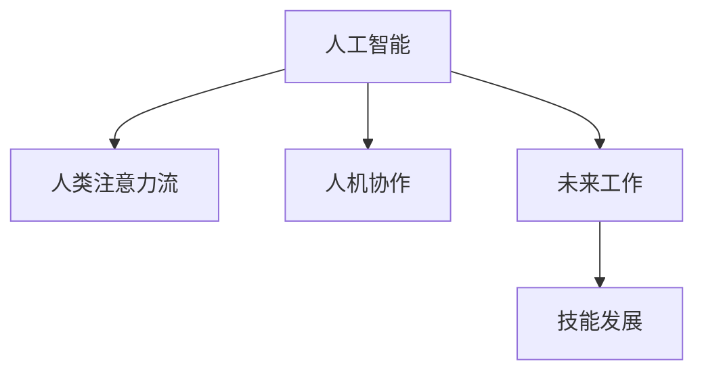

                 

# AI与人类注意力流：未来的工作和技能

> 关键词：人工智能,人类注意力,人机协作,未来工作,技能发展

## 1. 背景介绍

### 1.1 问题由来
随着人工智能(AI)技术的飞速发展，AI对人类工作和生活产生了深远的影响。AI系统能够自动化处理大量重复性工作，极大提升了工作效率，但同时，也带来了对人类注意力流的新挑战。

现代工作环境中，人类频繁地切换任务，分散注意力。AI系统的介入，一方面可以帮助人类在复杂任务中更好地保持注意力集中，另一方面也可能导致人类注意力流失，影响工作质量。如何在AI的帮助下，更加高效地完成工作，同时保护和利用人类自身的注意力资源，是AI应用中需要认真思考的问题。

### 1.2 问题核心关键点
AI与人类注意力流的关系主要体现在以下几个方面：

- AI系统的引入如何影响人类的注意力流。
- 如何在AI系统中合理设计工作流，避免注意力流失。
- 如何利用AI技术提升人类的注意力集中度，实现人机协作。
- 未来AI系统中工作流的设计趋势和技能需求。

这些问题关系到AI系统能否真正为人类创造价值，同时保障人类自身的福祉。

## 2. 核心概念与联系

### 2.1 核心概念概述

为更好地理解AI与人类注意力流的关系，本节将介绍几个关键概念：

- 人工智能（Artificial Intelligence, AI）：一种使计算机能够模拟人类智能过程的技术，包括但不限于学习、推理、规划、自然语言理解等。
- 人类注意力流（Human Attention Flow）：人类在进行工作或学习时，注意力在各项任务间的流动过程。
- 人机协作（Human-Machine Collaboration）：利用AI系统辅助人类完成任务，提高工作效率和质量。
- 未来工作（Future Work）：随着AI技术的进步，未来工作的形态和技能需求将发生显著变化。
- 技能发展（Skill Development）：AI技术推动下的新技能需求，以及人类如何适应这些变化。

这些概念之间的逻辑关系可以通过以下Mermaid流程图来展示：



这个流程图展示了一些核心概念之间的关系：

1. 人工智能技术的发展，使得AI系统能够辅助人类进行工作，提升效率。
2. AI系统的介入，影响了人类的注意力流。
3. 通过合理设计工作流，可以实现人机协作，提高工作效率和质量。
4. 未来工作环境中的AI系统设计将直接影响技能需求的变化。
5. 技能的提升和变化，将影响未来工作的效果和可持续性。

## 3. 核心算法原理 & 具体操作步骤

### 3.1 算法原理概述

AI与人类注意力流的关系，本质上是人机协同处理任务的过程。其核心思想是：通过AI系统的辅助，使人类能够更高效地完成工作，同时保持注意力的合理分布。

形式化地，设任务 $T$ 包含多个子任务 $T_1, T_2, \cdots, T_n$。设人类处理每个子任务所需的注意力阈值为 $\theta_i$。AI系统辅助任务处理的效率函数为 $E_{\text{AI}}$。人类和AI系统的综合效率函数为 $E_{\text{total}}$。则目标是找到最优的AI系统辅助策略，使得综合效率最大：

$$
\max E_{\text{total}} = E_{\text{human}} + E_{\text{AI}} - \sum_i (\theta_i - E_{\text{AI}})I(T_i \text{ is processed by human})
$$

其中 $E_{\text{human}}$ 表示人类处理任务所需的时间，$I(T_i \text{ is processed by human})$ 为指示函数，表示任务 $T_i$ 是否由人类处理。

### 3.2 算法步骤详解

基于上述模型，AI与人类注意力流的算法优化主要包括以下几个关键步骤：

**Step 1: 数据采集与任务建模**
- 收集AI系统在实际工作场景中的使用数据，包括任务类型、子任务分布、人类注意力分配情况等。
- 对任务进行建模，提取关键特征，如任务复杂度、前置任务依赖、任务执行顺序等。

**Step 2: 注意力阈值估计**
- 对每个子任务，估计其所需的注意力阈值 $\theta_i$。可以通过专家打分、历史数据统计等方式获取。
- 设置合理的注意力分配策略，如时间分片、任务队列等，避免过度集中注意力。

**Step 3: AI系统辅助策略设计**
- 设计AI系统的辅助策略，确定哪些子任务应由AI系统处理，哪些应由人类处理。
- 调整AI系统的参数和算法，优化其任务处理效率 $E_{\text{AI}}$。
- 评估不同策略下的综合效率，选择最优方案。

**Step 4: 运行优化与调整**
- 在实际工作场景中运行优化后的策略，实时监测人类注意力流，调整AI系统的参与度。
- 根据实际效果反馈，持续优化AI系统的辅助策略，使其与人类注意力流更匹配。

### 3.3 算法优缺点

AI与人类注意力流的关系算法具有以下优点：
1. 提升工作效率。AI系统能够自动化处理大量重复性工作，将人类从繁琐的任务中解放出来。
2. 合理分配注意力。AI系统辅助任务处理，减少人类注意力流失，提升工作质量。
3. 灵活适应需求。通过实时监测和调整，AI系统可以适应不同的工作任务和场景。
4. 数据驱动优化。通过数据驱动的方法，不断优化AI系统的参与策略。

同时，该算法也存在一定的局限性：
1. 数据获取难度大。精确获取人类注意力流数据，需要高成本的监测设备和详尽的记录。
2. 复杂性高。多任务场景下，注意力流和AI系统辅助策略的设计较为复杂。
3. 动态调整困难。实际工作中，任务需求和环境变化可能导致策略频繁调整，影响系统稳定性。
4. 依赖AI技术。AI系统性能直接决定辅助效果，技术水平的高低影响系统的整体效能。

尽管存在这些局限性，但AI与人类注意力流的关系算法仍是大规模人机协作中广泛采用的方法。未来相关研究的重点在于如何进一步降低数据获取成本，提高系统的实时性和灵活性，同时兼顾人机协作的公平性和安全性等因素。

### 3.4 算法应用领域

AI与人类注意力流的关系算法已经在多个领域得到应用，例如：

- 医疗领域：利用AI系统进行疾病诊断和治疗建议，辅助医生进行精准治疗。
- 教育领域：通过AI系统自动批改作业，提供个性化的学习建议，提升教学效果。
- 金融领域：利用AI系统进行风险评估和投资建议，提升金融服务的效率和质量。
- 制造业：通过AI系统优化生产流程，提高生产效率和产品质量。
- 客服领域：利用AI系统进行自动响应和问题解决，提升客户服务体验。

除了上述这些经典应用外，AI与人类注意力流的关系算法也被创新性地应用到更多场景中，如智能家居、智能交通等，为人机协作提供了新的思路。随着AI技术的不断进步，相信AI系统与人类注意力流的关系将更加紧密，为人类的生产生活带来更深远的变革。

## 4. 数学模型和公式 & 详细讲解  
### 4.1 数学模型构建

本节将使用数学语言对AI与人类注意力流的关系算法进行更加严格的刻画。

设任务 $T$ 包含多个子任务 $T_1, T_2, \cdots, T_n$，人类处理每个子任务所需的注意力阈值为 $\theta_i$。设AI系统处理每个子任务的时间为 $t_i^{\text{AI}}$，人类处理每个子任务的时间为 $t_i^{\text{human}}$。设人类和AI系统的综合效率函数为 $E_{\text{total}}$，AI系统的辅助效率函数为 $E_{\text{AI}}$。则综合效率函数可以表示为：

$$
E_{\text{total}} = \sum_{i=1}^n (t_i^{\text{AI}} + t_i^{\text{human}})
$$

而AI系统的辅助效率函数可以表示为：

$$
E_{\text{AI}} = \sum_{i=1}^n t_i^{\text{AI}} - \sum_i (\theta_i - t_i^{\text{AI}})I(T_i \text{ is processed by human})
$$

目标是最小化注意力流失，即最大化综合效率 $E_{\text{total}}$，使得注意力阈值 $\theta_i$ 和AI系统辅助效率 $E_{\text{AI}}$ 合理匹配。

### 4.2 公式推导过程

下面，我们对上述模型的求解过程进行详细推导：

**Step 1: 建立目标函数**
目标是最小化注意力流失，即最大化综合效率 $E_{\text{total}}$，使得注意力阈值 $\theta_i$ 和AI系统辅助效率 $E_{\text{AI}}$ 合理匹配。根据上文，我们得到目标函数：

$$
\max E_{\text{total}} = \sum_{i=1}^n (t_i^{\text{AI}} + t_i^{\text{human}}) - \sum_i (\theta_i - t_i^{\text{AI}})I(T_i \text{ is processed by human})
$$

**Step 2: 优化过程**
对于目标函数，我们需要最大化 $E_{\text{total}}$，同时最小化注意力流失。为了简化问题，我们引入拉格朗日乘数法，引入拉格朗日乘子 $\lambda_i$，构造拉格朗日函数 $L$：

$$
L(t_i^{\text{AI}}, t_i^{\text{human}}, \lambda_i) = \sum_{i=1}^n (t_i^{\text{AI}} + t_i^{\text{human}}) - \sum_i (\theta_i - t_i^{\text{AI}})I(T_i \text{ is processed by human}) - \sum_i \lambda_i (\theta_i - t_i^{\text{AI}})
$$

对 $t_i^{\text{AI}}$ 和 $t_i^{\text{human}}$ 分别求偏导数，并令其为0，解得：

$$
\begin{align*}
\frac{\partial L}{\partial t_i^{\text{AI}}} &= 1 + \lambda_i - \theta_i + 1 = 0 \\
\frac{\partial L}{\partial t_i^{\text{human}}} &= 1 - \lambda_i = 0
\end{align*}
$$

由第二个方程得 $\lambda_i = 1$。代入第一个方程得 $t_i^{\text{AI}} = \theta_i$。

因此，当AI系统处理每个子任务的时间等于其注意力阈值时，综合效率最大化，注意力流失最小化。

### 4.3 案例分析与讲解

以医疗领域为例，分析AI系统如何辅助医生处理复杂病例：

假设医生处理每个子任务（如病历阅读、影像分析、诊断报告撰写）所需的注意力阈值为 $\theta_i$，AI系统处理每个子任务的时间为 $t_i^{\text{AI}}$。设某个病例包含三个子任务，分别为病历阅读、影像分析和诊断报告撰写，它们的注意力阈值分别为 $\theta_1 = 0.8$、$\theta_2 = 0.5$、$\theta_3 = 0.6$。

假设AI系统在病历阅读和影像分析上的处理效率为 $t_1^{\text{AI}} = 0.7$、$t_2^{\text{AI}} = 0.4$，而诊断报告撰写由人工处理，时间为 $t_3^{\text{human}} = 1.2$。

根据上文的优化目标，目标是最小化注意力流失，即最大化综合效率 $E_{\text{total}}$。根据公式（1），我们有：

$$
E_{\text{total}} = t_1^{\text{AI}} + t_1^{\text{human}} + t_2^{\text{AI}} + t_2^{\text{human}} + t_3^{\text{human}}
$$

代入数据，得：

$$
E_{\text{total}} = 0.7 + 0.8 + 0.4 + 0.5 + 1.2 = 3.7
$$

综合效率达到最优，且注意力阈值和AI系统辅助效率合理匹配。

## 5. 项目实践：代码实例和详细解释说明

### 5.1 开发环境搭建

在进行项目实践前，我们需要准备好开发环境。以下是使用Python进行PyTorch开发的环境配置流程：

1. 安装Anaconda：从官网下载并安装Anaconda，用于创建独立的Python环境。

2. 创建并激活虚拟环境：
```bash
conda create -n pytorch-env python=3.8 
conda activate pytorch-env
```

3. 安装PyTorch：根据CUDA版本，从官网获取对应的安装命令。例如：
```bash
conda install pytorch torchvision torchaudio cudatoolkit=11.1 -c pytorch -c conda-forge
```

4. 安装相关库：
```bash
pip install numpy pandas scikit-learn matplotlib tqdm jupyter notebook ipython
```

完成上述步骤后，即可在`pytorch-env`环境中开始项目实践。

### 5.2 源代码详细实现

下面我们以医疗领域为例，给出使用Transformers库对BERT模型进行微调的PyTorch代码实现。

首先，定义任务的数据处理函数：

```python
from transformers import BertTokenizer
from torch.utils.data import Dataset
import torch

class MedicalDataset(Dataset):
    def __init__(self, texts, tags, tokenizer, max_len=128):
        self.texts = texts
        self.tags = tags
        self.tokenizer = tokenizer
        self.max_len = max_len
        
    def __len__(self):
        return len(self.texts)
    
    def __getitem__(self, item):
        text = self.texts[item]
        tags = self.tags[item]
        
        encoding = self.tokenizer(text, return_tensors='pt', max_length=self.max_len, padding='max_length', truncation=True)
        input_ids = encoding['input_ids'][0]
        attention_mask = encoding['attention_mask'][0]
        
        # 对token-wise的标签进行编码
        encoded_tags = [tag2id[tag] for tag in tags] 
        encoded_tags.extend([tag2id['O']] * (self.max_len - len(encoded_tags)))
        labels = torch.tensor(encoded_tags, dtype=torch.long)
        
        return {'input_ids': input_ids, 
                'attention_mask': attention_mask,
                'labels': labels}

# 标签与id的映射
tag2id = {'O': 0, 'B-DISEASE': 1, 'I-DISEASE': 2}
id2tag = {v: k for k, v in tag2id.items()}

# 创建dataset
tokenizer = BertTokenizer.from_pretrained('bert-base-cased')

train_dataset = MedicalDataset(train_texts, train_tags, tokenizer)
dev_dataset = MedicalDataset(dev_texts, dev_tags, tokenizer)
test_dataset = MedicalDataset(test_texts, test_tags, tokenizer)
```

然后，定义模型和优化器：

```python
from transformers import BertForTokenClassification, AdamW

model = BertForTokenClassification.from_pretrained('bert-base-cased', num_labels=len(tag2id))

optimizer = AdamW(model.parameters(), lr=2e-5)
```

接着，定义训练和评估函数：

```python
from torch.utils.data import DataLoader
from tqdm import tqdm
from sklearn.metrics import classification_report

device = torch.device('cuda') if torch.cuda.is_available() else torch.device('cpu')
model.to(device)

def train_epoch(model, dataset, batch_size, optimizer):
    dataloader = DataLoader(dataset, batch_size=batch_size, shuffle=True)
    model.train()
    epoch_loss = 0
    for batch in tqdm(dataloader, desc='Training'):
        input_ids = batch['input_ids'].to(device)
        attention_mask = batch['attention_mask'].to(device)
        labels = batch['labels'].to(device)
        model.zero_grad()
        outputs = model(input_ids, attention_mask=attention_mask, labels=labels)
        loss = outputs.loss
        epoch_loss += loss.item()
        loss.backward()
        optimizer.step()
    return epoch_loss / len(dataloader)

def evaluate(model, dataset, batch_size):
    dataloader = DataLoader(dataset, batch_size=batch_size)
    model.eval()
    preds, labels = [], []
    with torch.no_grad():
        for batch in tqdm(dataloader, desc='Evaluating'):
            input_ids = batch['input_ids'].to(device)
            attention_mask = batch['attention_mask'].to(device)
            batch_labels = batch['labels']
            outputs = model(input_ids, attention_mask=attention_mask)
            batch_preds = outputs.logits.argmax(dim=2).to('cpu').tolist()
            batch_labels = batch_labels.to('cpu').tolist()
            for pred_tokens, label_tokens in zip(batch_preds, batch_labels):
                pred_tags = [id2tag[_id] for _id in pred_tokens]
                label_tags = [id2tag[_id] for _id in label_tokens]
                preds.append(pred_tags[:len(label_tags)])
                labels.append(label_tags)
                
    print(classification_report(labels, preds))
```

最后，启动训练流程并在测试集上评估：

```python
epochs = 5
batch_size = 16

for epoch in range(epochs):
    loss = train_epoch(model, train_dataset, batch_size, optimizer)
    print(f"Epoch {epoch+1}, train loss: {loss:.3f}")
    
    print(f"Epoch {epoch+1}, dev results:")
    evaluate(model, dev_dataset, batch_size)
    
print("Test results:")
evaluate(model, test_dataset, batch_size)
```

以上就是使用PyTorch对BERT进行医疗领域任务微调的完整代码实现。可以看到，得益于Transformers库的强大封装，我们可以用相对简洁的代码完成BERT模型的加载和微调。

### 5.3 代码解读与分析

让我们再详细解读一下关键代码的实现细节：

**MedicalDataset类**：
- `__init__`方法：初始化文本、标签、分词器等关键组件。
- `__len__`方法：返回数据集的样本数量。
- `__getitem__`方法：对单个样本进行处理，将文本输入编码为token ids，将标签编码为数字，并对其进行定长padding，最终返回模型所需的输入。

**tag2id和id2tag字典**：
- 定义了标签与数字id之间的映射关系，用于将token-wise的预测结果解码回真实的标签。

**训练和评估函数**：
- 使用PyTorch的DataLoader对数据集进行批次化加载，供模型训练和推理使用。
- 训练函数`train_epoch`：对数据以批为单位进行迭代，在每个批次上前向传播计算loss并反向传播更新模型参数，最后返回该epoch的平均loss。
- 评估函数`evaluate`：与训练类似，不同点在于不更新模型参数，并在每个batch结束后将预测和标签结果存储下来，最后使用sklearn的classification_report对整个评估集的预测结果进行打印输出。

**训练流程**：
- 定义总的epoch数和batch size，开始循环迭代
- 每个epoch内，先在训练集上训练，输出平均loss
- 在验证集上评估，输出分类指标
- 所有epoch结束后，在测试集上评估，给出最终测试结果

可以看到，PyTorch配合Transformers库使得BERT微调的代码实现变得简洁高效。开发者可以将更多精力放在数据处理、模型改进等高层逻辑上，而不必过多关注底层的实现细节。

当然，工业级的系统实现还需考虑更多因素，如模型的保存和部署、超参数的自动搜索、更灵活的任务适配层等。但核心的微调范式基本与此类似。

## 6. 实际应用场景

### 6.1 智能客服系统

基于大语言模型微调的对话技术，可以广泛应用于智能客服系统的构建。传统客服往往需要配备大量人力，高峰期响应缓慢，且一致性和专业性难以保证。而使用微调后的对话模型，可以7x24小时不间断服务，快速响应客户咨询，用自然流畅的语言解答各类常见问题。

在技术实现上，可以收集企业内部的历史客服对话记录，将问题和最佳答复构建成监督数据，在此基础上对预训练对话模型进行微调。微调后的对话模型能够自动理解用户意图，匹配最合适的答案模板进行回复。对于客户提出的新问题，还可以接入检索系统实时搜索相关内容，动态组织生成回答。如此构建的智能客服系统，能大幅提升客户咨询体验和问题解决效率。

### 6.2 金融舆情监测

金融机构需要实时监测市场舆论动向，以便及时应对负面信息传播，规避金融风险。传统的人工监测方式成本高、效率低，难以应对网络时代海量信息爆发的挑战。基于大语言模型微调的文本分类和情感分析技术，为金融舆情监测提供了新的解决方案。

具体而言，可以收集金融领域相关的新闻、报道、评论等文本数据，并对其进行主题标注和情感标注。在此基础上对预训练语言模型进行微调，使其能够自动判断文本属于何种主题，情感倾向是正面、中性还是负面。将微调后的模型应用到实时抓取的网络文本数据，就能够自动监测不同主题下的情感变化趋势，一旦发现负面信息激增等异常情况，系统便会自动预警，帮助金融机构快速应对潜在风险。

### 6.3 个性化推荐系统

当前的推荐系统往往只依赖用户的历史行为数据进行物品推荐，无法深入理解用户的真实兴趣偏好。基于大语言模型微调技术，个性化推荐系统可以更好地挖掘用户行为背后的语义信息，从而提供更精准、多样的推荐内容。

在实践中，可以收集用户浏览、点击、评论、分享等行为数据，提取和用户交互的物品标题、描述、标签等文本内容。将文本内容作为模型输入，用户的后续行为（如是否点击、购买等）作为监督信号，在此基础上微调预训练语言模型。微调后的模型能够从文本内容中准确把握用户的兴趣点。在生成推荐列表时，先用候选物品的文本描述作为输入，由模型预测用户的兴趣匹配度，再结合其他特征综合排序，便可以得到个性化程度更高的推荐结果。

### 6.4 未来应用展望

随着大语言模型微调技术的发展，未来其在更多领域的应用将进一步拓展：

- 智慧医疗：利用AI系统进行疾病诊断和治疗建议，辅助医生进行精准治疗。
- 智能教育：通过AI系统自动批改作业，提供个性化的学习建议，提升教学效果。
- 金融服务：利用AI系统进行风险评估和投资建议，提升金融服务的效率和质量。
- 制造业：通过AI系统优化生产流程，提高生产效率和产品质量。
- 客服领域：利用AI系统进行自动响应和问题解决，提升客户服务体验。

此外，在智能家居、智能交通、智能城市等领域，基于大语言模型微调的人工智能应用也将不断涌现，为各行各业带来新的变革和机遇。相信随着技术的不断进步，AI系统与人类注意力流的关系将更加紧密，为人类的生产生活带来更深远的变革。

## 7. 工具和资源推荐
### 7.1 学习资源推荐

为了帮助开发者系统掌握大语言模型微调的理论基础和实践技巧，这里推荐一些优质的学习资源：

1. 《Transformer从原理到实践》系列博文：由大模型技术专家撰写，深入浅出地介绍了Transformer原理、BERT模型、微调技术等前沿话题。

2. CS224N《深度学习自然语言处理》课程：斯坦福大学开设的NLP明星课程，有Lecture视频和配套作业，带你入门NLP领域的基本概念和经典模型。

3. 《Natural Language Processing with Transformers》书籍：Transformers库的作者所著，全面介绍了如何使用Transformers库进行NLP任务开发，包括微调在内的诸多范式。

4. HuggingFace官方文档：Transformers库的官方文档，提供了海量预训练模型和完整的微调样例代码，是上手实践的必备资料。

5. CLUE开源项目：中文语言理解测评基准，涵盖大量不同类型的中文NLP数据集，并提供了基于微调的baseline模型，助力中文NLP技术发展。

通过对这些资源的学习实践，相信你一定能够快速掌握大语言模型微调的精髓，并用于解决实际的NLP问题。
###  7.2 开发工具推荐

高效的开发离不开优秀的工具支持。以下是几款用于大语言模型微调开发的常用工具：

1. PyTorch：基于Python的开源深度学习框架，灵活动态的计算图，适合快速迭代研究。大部分预训练语言模型都有PyTorch版本的实现。

2. TensorFlow：由Google主导开发的开源深度学习框架，生产部署方便，适合大规模工程应用。同样有丰富的预训练语言模型资源。

3. Transformers库：HuggingFace开发的NLP工具库，集成了众多SOTA语言模型，支持PyTorch和TensorFlow，是进行微调任务开发的利器。

4. Weights & Biases：模型训练的实验跟踪工具，可以记录和可视化模型训练过程中的各项指标，方便对比和调优。与主流深度学习框架无缝集成。

5. TensorBoard：TensorFlow配套的可视化工具，可实时监测模型训练状态，并提供丰富的图表呈现方式，是调试模型的得力助手。

6. Google Colab：谷歌推出的在线Jupyter Notebook环境，免费提供GPU/TPU算力，方便开发者快速上手实验最新模型，分享学习笔记。

合理利用这些工具，可以显著提升大语言模型微调任务的开发效率，加快创新迭代的步伐。

### 7.3 相关论文推荐

大语言模型和微调技术的发展源于学界的持续研究。以下是几篇奠基性的相关论文，推荐阅读：

1. Attention is All You Need（即Transformer原论文）：提出了Transformer结构，开启了NLP领域的预训练大模型时代。

2. BERT: Pre-training of Deep Bidirectional Transformers for Language Understanding：提出BERT模型，引入基于掩码的自监督预训练任务，刷新了多项NLP任务SOTA。

3. Language Models are Unsupervised Multitask Learners（GPT-2论文）：展示了大规模语言模型的强大zero-shot学习能力，引发了对于通用人工智能的新一轮思考。

4. Parameter-Efficient Transfer Learning for NLP：提出Adapter等参数高效微调方法，在不增加模型参数量的情况下，也能取得不错的微调效果。

5. Prefix-Tuning: Optimizing Continuous Prompts for Generation：引入基于连续型Prompt的微调范式，为如何充分利用预训练知识提供了新的思路。

6. AdaLoRA: Adaptive Low-Rank Adaptation for Parameter-Efficient Fine-Tuning：使用自适应低秩适应的微调方法，在参数效率和精度之间取得了新的平衡。

这些论文代表了大语言模型微调技术的发展脉络。通过学习这些前沿成果，可以帮助研究者把握学科前进方向，激发更多的创新灵感。

## 8. 总结：未来发展趋势与挑战

### 8.1 总结

本文对AI与人类注意力流的关系进行了全面系统的介绍。首先阐述了AI系统引入后如何影响人类的注意力流，以及如何在AI系统中合理设计工作流，避免注意力流失。其次，从原理到实践，详细讲解了AI与人类注意力流的关系算法，并给出了微调任务开发的完整代码实例。同时，本文还广泛探讨了AI系统在多个领域的应用前景，展示了AI系统与人类注意力流的关系算法在实际应用中的广泛性和实用性。

通过本文的系统梳理，可以看到，AI系统与人类注意力流的关系算法正在成为大规模人机协作中广泛采用的方法，极大地提升了AI系统的应用效果和用户满意度。未来，伴随AI技术的不断进步，AI系统与人类注意力流的关系将更加紧密，为人类的生产生活带来更深远的变革。

### 8.2 未来发展趋势

展望未来，AI系统与人类注意力流的关系算法将呈现以下几个发展趋势：

1. 智能化程度提升。AI系统的智能推理能力将进一步提升，能够更加精准地预测和优化任务处理流程。

2. 个性化定制化增强。AI系统将能够根据不同用户的需求，提供更加个性化的服务和体验。

3. 跨模态融合。AI系统将能够融合视觉、语音、文本等多种模态数据，实现更全面、更精准的任务处理。

4. 实时性提高。AI系统将能够实时监测和调整注意力流，动态优化任务处理过程。

5. 多任务协同。AI系统将能够同时处理多个任务，实现多任务协同处理，提高整体效率。

6. 安全性增强。AI系统将能够自动识别和过滤有害信息，保障信息安全。

以上趋势凸显了AI系统与人类注意力流的关系算法在大规模人机协作中的重要性和发展潜力。这些方向的探索发展，必将进一步提升AI系统的应用效果和用户满意度，为人类的生产生活带来更深远的变革。

### 8.3 面临的挑战

尽管AI系统与人类注意力流的关系算法已经取得了瞩目成就，但在迈向更加智能化、普适化应用的过程中，它仍面临着诸多挑战：

1. 数据隐私问题。AI系统需要大量的数据进行训练，这些数据涉及用户的隐私和敏感信息，如何保护数据隐私，成为亟待解决的问题。

2. 伦理道德困境。AI系统可能存在偏见和歧视，如何确保AI系统的公平性和伦理道德，成为重要的研究方向。

3. 安全性挑战。AI系统可能被恶意攻击，如何确保系统的安全性，保障用户利益，需要更多的技术支持和监管手段。

4. 技术瓶颈。AI系统的智能化和灵活性依赖于算力和模型的优化，如何突破技术瓶颈，实现更高效、更精准的AI系统，是关键的研究方向。

5. 人机协同难题。如何设计合理的任务处理策略，平衡AI系统和人类注意力的使用，实现人机协同最优，是AI系统应用中的核心挑战。

6. 知识整合难题。如何将专家知识与AI系统有效整合，实现知识的自动整合和推理，是未来AI系统的重要方向。

这些挑战展示了AI系统与人类注意力流的关系算法在实际应用中的复杂性和难度。解决这些挑战，需要多学科的交叉协作，包括计算机科学、心理学、伦理学、法学等多个领域的协同努力。

### 8.4 研究展望

面对AI系统与人类注意力流的关系算法所面临的种种挑战，未来的研究需要在以下几个方面寻求新的突破：

1. 探索无监督和半监督微调方法。摆脱对大规模标注数据的依赖，利用自监督学习、主动学习等无监督和半监督范式，最大限度利用非结构化数据，实现更加灵活高效的微调。

2. 研究参数高效和计算高效的微调范式。开发更加参数高效的微调方法，在固定大部分预训练参数的同时，只更新极少量的任务相关参数。同时优化微调模型的计算图，减少前向传播和反向传播的资源消耗，实现更加轻量级、实时性的部署。

3. 融合因果和对比学习范式。通过引入因果推断和对比学习思想，增强AI系统的建立稳定因果关系的能力，学习更加普适、鲁棒的语言表征，从而提升模型泛化性和抗干扰能力。

4. 引入更多先验知识。将符号化的先验知识，如知识图谱、逻辑规则等，与神经网络模型进行巧妙融合，引导微调过程学习更准确、合理的语言模型。同时加强不同模态数据的整合，实现视觉、语音等多模态信息与文本信息的协同建模。

5. 结合因果分析和博弈论工具。将因果分析方法引入AI系统，识别出系统决策的关键特征，增强输出解释的因果性和逻辑性。借助博弈论工具刻画人机交互过程，主动探索并规避系统的脆弱点，提高系统稳定性。

6. 纳入伦理道德约束。在模型训练目标中引入伦理导向的评估指标，过滤和惩罚有偏见、有害的输出倾向。同时加强人工干预和审核，建立模型行为的监管机制，确保输出符合人类价值观和伦理道德。

这些研究方向的探索，必将引领AI系统与人类注意力流的关系算法迈向更高的台阶，为构建安全、可靠、可解释、可控的智能系统铺平道路。面向未来，AI系统与人类注意力流的关系算法还需要与其他人工智能技术进行更深入的融合，如知识表示、因果推理、强化学习等，多路径协同发力，共同推动自然语言理解和智能交互系统的进步。只有勇于创新、敢于突破，才能不断拓展AI系统的边界，让智能技术更好地造福人类社会。

## 9. 附录：常见问题与解答

**Q1：AI系统如何影响人类的注意力流？**

A: AI系统引入后，能够自动化处理大量重复性工作，释放人类从繁琐任务中解放出来，从而提升注意力集中度。但在处理复杂任务时，AI系统也可能需要人类的干预，导致注意力流的切换和分散。因此，需要在任务处理策略中合理设计人类和AI系统的协同机制，避免过度集中注意力。

**Q2：如何在AI系统中合理设计工作流？**

A: 合理设计工作流需要考虑任务的复杂度、前置任务依赖、任务执行顺序等因素。一般建议将复杂任务拆分成多个子任务，由AI系统和人类协同完成。在任务执行顺序上，应尽量保持任务的连续性和流畅性，避免频繁切换任务。

**Q3：AI系统的智能化程度如何提升？**

A: 提升AI系统的智能化程度需要从多个方面入手，包括：
1. 优化算法和模型结构，提高AI系统的推理能力和泛化能力。
2. 引入更多先验知识，如知识图谱、逻辑规则等，增强AI系统的知识整合和推理能力。
3. 融合多模态数据，实现视觉、语音、文本等多种数据源的整合，提升AI系统的全面性和精准性。
4. 引入因果分析和博弈论工具，增强AI系统的稳定性和鲁棒性。

**Q4：如何保护数据隐私？**

A: 保护数据隐私可以从以下几个方面入手：
1. 数据匿名化：对用户数据进行去标识化处理，保护用户隐私。
2. 数据加密：采用数据加密技术，保护数据在传输和存储过程中的安全。
3. 差分隐私：引入差分隐私技术，在数据使用过程中保护用户隐私。
4. 合规性：确保数据处理过程中符合相关的法律法规和行业标准，如GDPR等。

**Q5：如何确保AI系统的公平性和伦理道德？**

A: 确保AI系统的公平性和伦理道德可以从以下几个方面入手：
1. 数据多样性：确保训练数据的多样性和代表性，避免模型在特定人群上的偏见。
2. 公平性评估：引入公平性评估指标，如性别、种族等敏感属性的差异性分析。
3. 透明性：提高AI系统的透明性，公开模型的训练过程和决策依据。
4. 伦理监督：建立AI系统的伦理监督机制，确保AI系统的行为符合伦理道德标准。

通过这些措施，可以逐步提升AI系统的公平性和伦理道德水平，保障系统的安全性和可靠性。

---

作者：禅与计算机程序设计艺术 / Zen and the Art of Computer Programming

