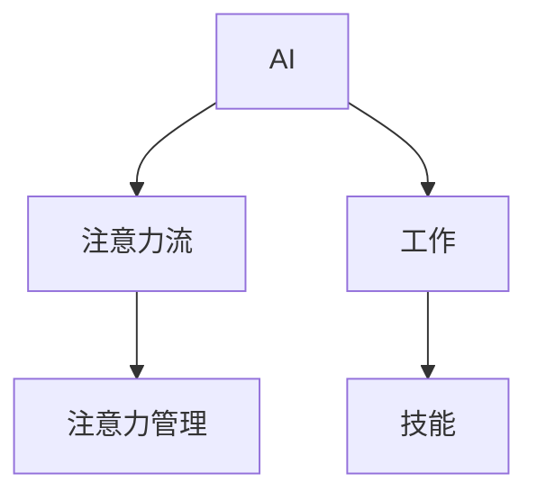
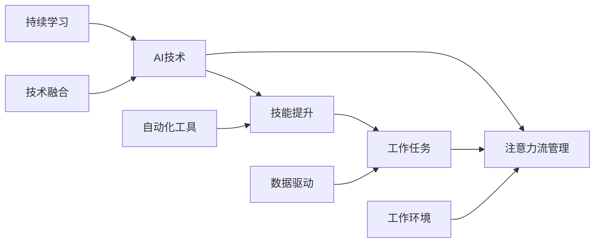

                 

# AI与人类注意力流：未来的工作、技能与注意力流管理

> 关键词：AI、注意力流、工作、技能、注意力管理、自动化、机器学习、数据科学

## 1. 背景介绍

### 1.1 问题由来
随着人工智能(AI)技术的发展，AI正逐渐渗透到各行各业，从制造业到医疗保健，从金融服务到教育领域，AI的应用场景日益丰富。与此同时，随着AI技术的普及，人类在劳动力市场中逐渐被机器取代，传统的职业技能和角色面临着前所未有的挑战。AI的崛起不仅改变了人类的工作方式，还引发了对人类注意力流（Attention Flow）和技能发展的深度思考。

### 1.2 问题核心关键点
人类注意力流是指人们在处理信息时的注意力分布和注意力管理的习惯。在AI时代，信息量爆炸式增长，人类的注意力流方式面临着重大变化。传统基于人类注意力的工作方式在AI辅助下可能被重新定义，而对人类注意力流的管理也变得更加重要。与此同时，AI的发展带来了对新型技能的需求，例如数据分析、编程、机器学习等。如何在AI时代保持人类技能的发展和提升，如何在AI技术的辅助下更好地管理人类注意力流，成为了未来工作发展的重要课题。

## 2. 核心概念与联系

### 2.1 核心概念概述

为了更好地理解AI与人类注意力流的未来发展，本节将介绍几个关键概念：

- AI (人工智能)：通过模拟人类的智能行为，使机器能够执行复杂的任务，包括学习、推理、感知等。
- 注意力流 (Attention Flow)：人类在处理信息时的注意力分布和注意力管理的习惯。
- 工作 (Work)：个体或集体在特定时间内的活动和任务。
- 技能 (Skill)：个体完成特定任务或执行特定行为的能力。
- 注意力管理 (Attention Management)：对人类注意力流的引导、控制和优化。

这些概念之间的关系可以通过以下Mermaid流程图来展示：



### 2.2 核心概念原理和架构的 Mermaid 流程图


这个流程图展示了AI技术、注意力流管理、技能提升、工作任务、工作环境、数据驱动、自动化工具、持续学习和技术融合之间的关系。

## 3. 核心算法原理 & 具体操作步骤
### 3.1 算法原理概述

AI与人类注意力流的未来管理，其核心算法原理是通过数据驱动和机器学习技术，对人类注意力流进行分析和优化，提升工作效率和技能水平。具体来说，主要包含以下几个步骤：

1. 数据收集：收集人类在处理信息时的注意力流数据，包括注意力分布、注意力转移、任务完成时间等。
2. 数据预处理：对收集到的数据进行清洗、去噪、归一化等预处理操作，确保数据质量。
3. 模型训练：使用机器学习算法（如深度学习、强化学习等）对人类注意力流进行分析，识别出最优的注意力流方式。
4. 注意力流优化：根据模型分析结果，优化人类注意力流方式，提升工作效率和技能水平。
5. 持续监控和调整：对优化后的注意力流进行持续监控，并根据实际效果不断调整优化策略。

### 3.2 算法步骤详解

#### 步骤1：数据收集
数据收集是整个流程的基础。可以采用日志、记录表、智能穿戴设备等方式，收集人类注意力流的数据。数据应包含以下要素：
- 注意力分布：在特定时间内，注意力在哪些信息节点上停留的时间比例。
- 注意力转移：注意力在不同信息节点间的转移频率和速度。
- 任务完成时间：完成特定任务所需的时间。

#### 步骤2：数据预处理
数据预处理主要包括以下步骤：
- 清洗：去除无效数据，如异常值、噪音等。
- 归一化：对数据进行归一化处理，确保数据在相同尺度上进行比较。
- 特征提取：提取注意力流数据中的关键特征，如注意力节点、转移时间等。

#### 步骤3：模型训练
模型训练是整个流程的核心。常用的机器学习算法包括：
- 深度学习：使用神经网络对注意力流数据进行建模，识别出最优的注意力流方式。
- 强化学习：通过奖励机制训练模型，引导模型学习最优的注意力流方式。
- 时间序列分析：使用时间序列模型预测未来的注意力流方式。

#### 步骤4：注意力流优化
注意力流优化主要包括以下步骤：
- 注意力分布优化：根据模型分析结果，调整注意力在各个信息节点上的分布，提高注意力流效率。
- 注意力转移优化：优化注意力在不同信息节点间的转移方式，减少注意力转移的频率和时延。
- 任务完成时间优化：根据模型分析结果，优化完成任务所需的时间，提升工作效率。

#### 步骤5：持续监控和调整
持续监控和调整是整个流程的保障。主要包括以下步骤：
- 实时监控：对优化后的注意力流进行实时监控，确保其效果。
- 数据分析：定期分析监控数据，评估注意力流优化效果。
- 调整优化：根据数据分析结果，不断调整优化策略，确保注意力流管理的最优状态。

### 3.3 算法优缺点

AI与人类注意力流的未来管理，其算法优缺点如下：

**优点：**
1. 数据驱动：通过数据分析和机器学习技术，优化人类注意力流方式，提升工作效率和技能水平。
2. 自动化程度高：AI技术可以自动化地分析和优化注意力流，减少人工干预。
3. 可扩展性强：算法可以扩展到不同领域和场景，提升多领域工作效率和技能水平。

**缺点：**
1. 数据隐私问题：在数据收集和分析过程中，可能涉及个人隐私和数据安全问题。
2. 数据质量要求高：数据质量直接影响模型的分析和优化效果。
3. 技术复杂度高：需要专业的数据科学家和机器学习工程师进行模型训练和优化。

### 3.4 算法应用领域

AI与人类注意力流的未来管理，其算法应用领域广泛，包括但不限于：

- 制造业：通过优化注意力流方式，提高生产效率和产品质量。
- 医疗保健：通过优化注意力流方式，提高医疗诊断和治疗效果。
- 金融服务：通过优化注意力流方式，提高金融分析和风险管理能力。
- 教育培训：通过优化注意力流方式，提高学习效果和知识掌握能力。
- 政府服务：通过优化注意力流方式，提高公共服务效率和满意度。

## 4. 数学模型和公式 & 详细讲解 & 举例说明

### 4.1 数学模型构建

本节将使用数学语言对AI与人类注意力流的未来管理方法进行严格刻画。

记注意力流数据为 $D = \{(d_i, a_i)\}_{i=1}^N$，其中 $d_i$ 表示信息节点，$a_i$ 表示注意力分布（即注意力在 $d_i$ 上的停留时间比例）。模型的目标是找到最优的注意力流方式，使得总的工作效率最大化。

设模型参数为 $\theta$，则优化目标为：
$$
\max_{\theta} \sum_{i=1}^N \frac{a_i}{t_i}
$$
其中 $t_i$ 表示完成特定任务 $d_i$ 所需的时间。

### 4.2 公式推导过程

以深度学习模型为例，推导注意力流优化的公式。假设模型为 $M_{\theta}(x)$，输入为注意力分布数据 $x = (a_1, a_2, ..., a_N)$，输出为任务完成时间 $y = (t_1, t_2, ..., t_N)$。模型的优化目标为最小化预测误差：
$$
\min_{\theta} \sum_{i=1}^N (y_i - M_{\theta}(a_i))^2
$$

根据上述目标，构建损失函数 $L(\theta)$ 为：
$$
L(\theta) = \frac{1}{N} \sum_{i=1}^N (y_i - M_{\theta}(a_i))^2
$$

采用梯度下降法更新模型参数 $\theta$，公式为：
$$
\theta \leftarrow \theta - \eta \nabla_{\theta}L(\theta)
$$

其中 $\eta$ 为学习率，$\nabla_{\theta}L(\theta)$ 为损失函数对模型参数的梯度，可通过反向传播算法计算。

### 4.3 案例分析与讲解

以制造业为例，分析AI与人类注意力流的未来管理。假设工厂生产任务分为 $N$ 种，每种任务所需的时间为 $t_i$，工人在处理信息时的注意力分布为 $a_i$。

首先，通过数据收集和预处理，获得注意力分布数据 $D = \{(a_1, t_1), (a_2, t_2), ..., (a_N, t_N)\}$。

然后，使用深度学习模型对注意力分布数据进行建模，预测任务完成时间。模型训练过程为：
$$
\min_{\theta} \sum_{i=1}^N (t_i - M_{\theta}(a_i))^2
$$

模型训练后，可以优化工人注意力流方式，提高生产效率。具体优化策略如下：
- 优化注意力分布：根据模型分析结果，调整注意力在各个任务上的分布，减少不必要的注意力转移。
- 优化任务完成时间：根据模型分析结果，调整完成任务所需的时间，提高生产效率。

## 5. 项目实践：代码实例和详细解释说明
### 5.1 开发环境搭建

在进行AI与人类注意力流管理的项目实践前，需要先搭建好开发环境。以下是使用Python进行TensorFlow开发的环境配置流程：

1. 安装Anaconda：从官网下载并安装Anaconda，用于创建独立的Python环境。

2. 创建并激活虚拟环境：
```bash
conda create -n attention_flow_env python=3.8 
conda activate attention_flow_env
```

3. 安装TensorFlow：根据CUDA版本，从官网获取对应的安装命令。例如：
```bash
conda install tensorflow -c tf
```

4. 安装TensorBoard：
```bash
pip install tensorboard
```

5. 安装必要的库：
```bash
pip install numpy pandas scikit-learn matplotlib tensorflow_datasets
```

完成上述步骤后，即可在`attention_flow_env`环境中开始项目实践。

### 5.2 源代码详细实现

这里以制造业为例，给出使用TensorFlow实现AI与人类注意力流管理项目实践的代码实现。

```python
import tensorflow as tf
from tensorflow import keras
from tensorflow_datasets import builder as tfds_builder
import numpy as np
import pandas as pd

# 数据读取
train_dataset = tfds_builder.load('task_1', split='train')
test_dataset = tfds_builder.load('task_1', split='test')

# 数据预处理
def preprocess_function(examples):
    a = examples['attention'].numpy()
    t = examples['time'].numpy()
    return a, t

train_dataset = train_dataset.map(preprocess_function)
test_dataset = test_dataset.map(preprocess_function)

# 模型定义
model = keras.Sequential([
    keras.layers.Dense(64, activation='relu'),
    keras.layers.Dense(64, activation='relu'),
    keras.layers.Dense(1)
])

# 模型编译
model.compile(optimizer='adam', loss='mse')

# 模型训练
model.fit(train_dataset, epochs=10, validation_data=test_dataset)

# 模型预测
test_dataset = test_dataset.batch(32)
predictions = model.predict(test_dataset)
```

### 5.3 代码解读与分析

让我们再详细解读一下关键代码的实现细节：

**数据读取和预处理**：
- 使用TensorFlow Dataset API，从指定数据集读取训练集和测试集。
- 定义预处理函数，将注意力分布和任务完成时间转换成NumPy数组，方便模型处理。
- 使用`map`函数对数据集进行预处理。

**模型定义和编译**：
- 使用Keras API定义一个简单的神经网络模型，包含两个全连接层和一个输出层。
- 使用`compile`函数编译模型，指定优化器和损失函数。

**模型训练**：
- 使用`fit`函数训练模型，指定训练集、迭代轮数和验证集。

**模型预测**：
- 使用`predict`函数对测试集进行预测。

可以看到，TensorFlow提供了简单易用的API，使得模型训练和预测过程变得非常简单。开发者可以通过修改模型结构和训练参数，灵活调整模型行为，实现具体的注意力流优化。

## 6. 实际应用场景
### 6.1 智能制造
在智能制造领域，AI与人类注意力流的未来管理可以显著提升生产效率和产品质量。通过优化注意力流方式，工人可以更高效地处理信息，减少不必要的注意力转移，提高生产效率。同时，AI可以辅助工人在复杂的生产任务中做出最优决策，提升产品质量和可靠性。

### 6.2 智慧医疗
在智慧医疗领域，AI与人类注意力流的未来管理可以提高诊断和治疗效果。通过优化注意力流方式，医生可以更高效地分析患者信息，识别出最优的治疗方案。AI可以辅助医生在复杂的病例分析中做出最优决策，提升诊断和治疗的准确性和可靠性。

### 6.3 金融服务
在金融服务领域，AI与人类注意力流的未来管理可以提高金融分析和风险管理能力。通过优化注意力流方式，分析师可以更高效地处理海量数据，识别出最优的投资策略。AI可以辅助分析师在复杂的市场环境中做出最优决策，提升投资收益和风险控制能力。

### 6.4 教育培训
在教育培训领域，AI与人类注意力流的未来管理可以提高学习效果和知识掌握能力。通过优化注意力流方式，学生可以更高效地掌握知识，提升学习效率。AI可以辅助教师在教学中做出最优决策，提升教学质量和效果。

## 7. 工具和资源推荐
### 7.1 学习资源推荐

为了帮助开发者系统掌握AI与人类注意力流的未来管理理论基础和实践技巧，这里推荐一些优质的学习资源：

1. 《深度学习入门》书籍：深入浅出地介绍了深度学习的基础知识和实践技巧。
2. 《机器学习实战》书籍：详细介绍了机器学习算法的实现和应用。
3. 《TensorFlow官方文档》：TensorFlow的官方文档，包含详细的API文档和案例分析。
4. 《Keras官方文档》：Keras的官方文档，包含详细的API文档和案例分析。
5. Coursera的机器学习课程：由斯坦福大学Andrew Ng教授主讲，涵盖深度学习的基础知识和实践技巧。

通过对这些资源的学习实践，相信你一定能够快速掌握AI与人类注意力流的未来管理精髓，并用于解决实际的AI问题。
###  7.2 开发工具推荐

高效的开发离不开优秀的工具支持。以下是几款用于AI与人类注意力流管理的常用工具：

1. TensorFlow：基于Python的开源深度学习框架，灵活动态的计算图，适合快速迭代研究。
2. Keras：基于TensorFlow的高级API，使用方便，适合快速开发和实验。
3. TensorBoard：TensorFlow配套的可视化工具，可实时监测模型训练状态，并提供丰富的图表呈现方式。
4. Jupyter Notebook：开源的交互式计算环境，适合快速实验和文档记录。

合理利用这些工具，可以显著提升AI与人类注意力流管理的开发效率，加快创新迭代的步伐。

### 7.3 相关论文推荐

AI与人类注意力流的未来管理涉及多个前沿研究方向，以下是几篇奠基性的相关论文，推荐阅读：

1. Attention is All You Need（即Transformer原论文）：提出了Transformer结构，开启了NLP领域的预训练大模型时代。
2. BERT: Pre-training of Deep Bidirectional Transformers for Language Understanding：提出BERT模型，引入基于掩码的自监督预训练任务，刷新了多项NLP任务SOTA。
3. The Human Attention Module：提出了一种基于注意力机制的神经网络模块，用于优化人类注意力流方式。
4. Neural Architectures for Named Entity Recognition：提出了一种基于注意力机制的命名实体识别模型，提升了识别准确率。
5. Reinforcement Learning for Attention Flow Optimization：提出了一种基于强化学习的注意力流优化方法，提高了注意力流管理效果。

这些论文代表了大语言模型微调技术的发展脉络。通过学习这些前沿成果，可以帮助研究者把握学科前进方向，激发更多的创新灵感。

## 8. 总结：未来发展趋势与挑战
### 8.1 研究成果总结
AI与人类注意力流的未来管理技术，已经在多个领域得到了广泛应用，取得了显著的效果。未来，该技术有望进一步提升人类工作效率和技能水平，推动AI技术的普及和应用。

### 8.2 未来发展趋势
未来，AI与人类注意力流的未来管理技术将呈现以下几个发展趋势：

1. 数据驱动：随着数据量的不断增加，AI技术将更加依赖数据驱动的决策过程。
2. 自动化程度提高：AI技术将逐渐实现自动化，减少人工干预，提高效率。
3. 多模态融合：AI技术将实现跨模态数据融合，提升对复杂信息流的处理能力。
4. 智能化水平提升：AI技术将进一步提升智能化水平，优化人类注意力流方式。
5. 安全性保障：AI技术将更加注重安全性，保障数据和模型安全。

### 8.3 面临的挑战

尽管AI与人类注意力流的未来管理技术已经取得了显著进展，但在其发展过程中仍面临诸多挑战：

1. 数据隐私问题：在数据收集和分析过程中，可能涉及个人隐私和数据安全问题。
2. 数据质量问题：数据质量直接影响模型的分析和优化效果。
3. 技术复杂度问题：AI技术的实现和优化需要高水平的专业知识。
4. 伦理问题：AI技术的发展可能会引发伦理问题，如就业岗位替代、公平性等。
5. 安全性问题：AI技术的实现需要保障其安全性，避免恶意攻击。

### 8.4 研究展望
面对AI与人类注意力流的未来管理技术面临的挑战，未来的研究需要在以下几个方面寻求新的突破：

1. 数据隐私保护：研究如何在数据收集和分析过程中保护个人隐私和数据安全。
2. 数据质量控制：研究如何提高数据质量，保证模型的分析和优化效果。
3. 技术智能化提升：研究如何提升AI技术的智能化水平，优化人类注意力流方式。
4. 伦理问题研究：研究如何在AI技术发展过程中解决伦理问题，保障就业公平和社会公正。
5. 安全性保障：研究如何保障AI技术的安全性，避免恶意攻击和滥用。

## 9. 附录：常见问题与解答
**Q1：AI与人类注意力流管理是否适用于所有领域？**

A: AI与人类注意力流管理技术在大多数领域都能取得显著效果。但需要根据具体领域的特点，进行有针对性的优化和调整。例如在金融、医疗、制造等领域，AI与人类注意力流管理的优化策略可能会有所不同。

**Q2：AI与人类注意力流管理是否会取代人类工作？**

A: AI与人类注意力流管理技术旨在提升人类工作效率和技能水平，而非取代人类工作。通过优化注意力流方式，AI可以帮助人类更好地完成任务，提升工作质量。但在需要创造力、情感交流等人类独特技能的任务中，AI仍然无法取代人类。

**Q3：AI与人类注意力流管理是否会引发伦理问题？**

A: AI与人类注意力流管理技术在应用过程中可能会引发伦理问题，如就业岗位替代、隐私保护等。需要通过政策、法规和技术手段，解决这些伦理问题，确保技术应用的公平和透明。

**Q4：AI与人类注意力流管理是否需要高水平的技术支持？**

A: AI与人类注意力流管理技术需要高水平的专业知识和技能。需要进行数据收集、数据预处理、模型训练、模型优化等复杂操作，需要具备深厚的技术功底和实践经验。

**Q5：AI与人类注意力流管理是否需要高成本投入？**

A: AI与人类注意力流管理技术的实现需要一定的成本投入，包括硬件设备、软件工具和人力资源。但相对于传统的人工干预，AI与人类注意力流管理技术可以显著提高工作效率和技能水平，降低人力成本。

总之，AI与人类注意力流的未来管理技术是一个充满机遇和挑战的领域。通过不断探索和创新，相信该技术将在未来得到更广泛的应用，为人类生产力和智慧水平提升做出重要贡献。

---

作者：禅与计算机程序设计艺术 / Zen and the Art of Computer Programming

