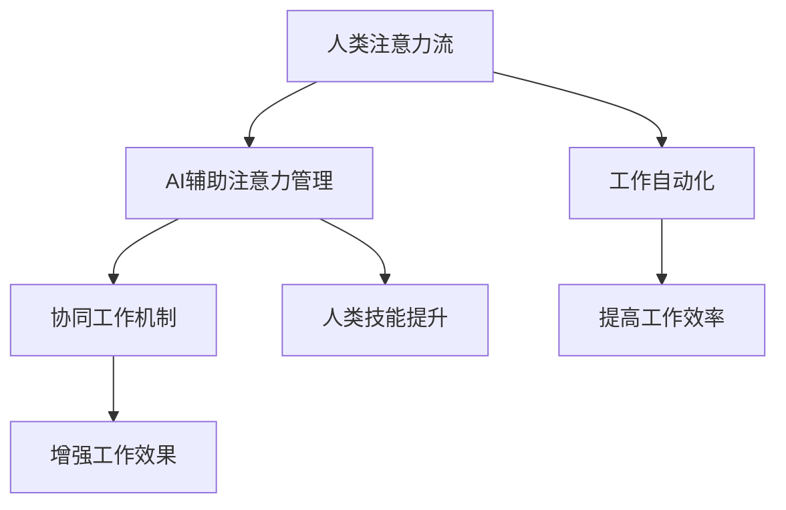

                 

# AI与人类注意力流：未来的工作、技能与注意力流管理技术的应用前景展望趋势分析

## 1. 背景介绍

### 1.1 问题由来
随着人工智能技术的快速发展，其在各个行业中的应用越来越广泛，尤其是在工作场景中的应用日益深入。AI辅助下的人力资源管理和自动化工作流程正在改变传统的工作模式和员工技能需求。人类与AI的协同工作成为新时代的常态。在此背景下，如何更好地管理人类注意力流、提升工作效率和生产力，成为一项重要课题。

### 1.2 问题核心关键点
管理人类注意力流的主要挑战在于如何确保注意力集中、提升信息处理效率和改善工作体验。具体来说，可以归结为以下核心问题：
- 如何评估人类注意力流的现状和需求？
- 如何利用AI技术优化注意力流管理？
- 如何提升人类技能以适应AI辅助环境？
- 如何建立和优化AI与人类之间的协同工作机制？

### 1.3 问题研究意义
研究人类注意力流管理技术，对于提升工作效率、改善工作体验、优化人力资源管理具有重要意义：
- 提高生产力：通过管理注意力流，确保员工在重要任务上保持高度集中，从而提升工作效能。
- 改善员工体验：优化注意力管理，减轻员工的工作负担和压力，提高其工作满意度和忠诚度。
- 优化资源配置：借助AI技术，实现对员工注意力和技能需求的精准评估和预测，有效分配人力资源，提升企业竞争力。
- 促进技能发展：通过注意力流管理技术，帮助员工识别技能缺口和提升方向，加速其职业发展和技能升级。
- 创新协同机制：通过AI与人类协同工作，打造更加灵活、高效、智能的工作环境，增强企业创新能力。

## 2. 核心概念与联系

### 2.1 核心概念概述
为更好地理解AI与人类注意力流管理技术的研究背景和应用前景，本节将介绍几个核心概念及其相互关系。

- **人类注意力流**：指人类在工作中对不同任务和信息的关注程度和时间分配。有效管理注意力流，可以提高信息处理效率和工作满意度。
- **AI辅助注意力管理**：利用AI技术，如机器学习、自然语言处理、计算机视觉等，实现对人类注意力流的监控、分析和优化。
- **工作自动化**：通过AI技术实现工作流程的自动化和智能化，减少人工干预，提升工作效率。
- **协同工作机制**：构建AI与人类之间的协同工作模式，利用AI的计算能力和智能特性，优化人类工作流程，增强工作效果。
- **人类技能提升**：通过AI技术对人类注意力流和技能需求的评估，提供个性化的技能培训和职业发展建议，提升员工技能和职业素质。

### 2.2 核心概念原理和架构的 Mermaid 流程图



这个流程图展示了人类注意力流管理的核心概念及其相互关系。通过AI辅助注意力管理，可以更有效地监控和优化人类注意力流，提升工作效率和效果，同时通过个性化技能提升，促进员工职业发展。

## 3. 核心算法原理 & 具体操作步骤
### 3.1 算法原理概述
AI与人类注意力流管理技术的基础在于利用机器学习和大数据技术，对人类注意力流进行实时监控、分析和预测。通过分析人类注意力流的特征，如注意力持续时间、频繁任务、工作强度等，AI技术可以提供个性化的注意力管理方案，优化工作流程，提升员工技能和工作效率。

### 3.2 算法步骤详解

**Step 1: 数据收集与预处理**
- 使用传感器、日志记录等方式收集人类注意力流数据，如屏幕使用情况、邮件和消息互动频率、工作任务持续时间等。
- 对收集到的数据进行清洗、归一化处理，去除噪音和异常值，确保数据质量。

**Step 2: 注意力特征提取**
- 利用机器学习模型，如神经网络、随机森林等，对人类注意力流数据进行特征提取。
- 提取关键特征，如注意力集中时间、任务切换频率、工作强度等，建立特征向量。

**Step 3: 注意力流模型训练**
- 使用监督学习算法，如决策树、支持向量机、深度学习等，对注意力流数据进行模型训练。
- 训练模型以预测注意力流变化趋势，如预测哪些时间段注意力集中、哪些任务容易分心等。

**Step 4: 注意力流监控与优化**
- 实时监控人类注意力流状态，利用模型预测注意力变化趋势。
- 根据监控结果，自动调整工作环境，如提醒注意休息、调整任务优先级等，优化注意力流。

**Step 5: 技能提升与职业发展**
- 基于注意力流数据分析，识别员工的技能缺口和职业发展方向。
- 提供个性化的技能培训和学习资源，提升员工技能水平。

### 3.3 算法优缺点

**优点：**
- 数据驱动：通过实时监控和分析，精准评估人类注意力流状态，提供个性化优化方案。
- 提升效率：自动化调整工作环境，减少人为干预，提升工作效率。
- 技能发展：个性化技能提升，加速职业发展，提升员工满意度。

**缺点：**
- 数据隐私：监控人类注意力流需要获取大量个人数据，可能涉及隐私问题。
- 模型偏见：模型训练数据可能存在偏差，影响预测结果的公正性。
- 技术复杂性：技术实现涉及多学科知识，包括机器学习、计算机视觉、自然语言处理等。
- 成本投入：数据收集、模型训练、系统部署等需要大量资源和成本投入。

### 3.4 算法应用领域

**企业人力资源管理**：利用AI技术对员工注意力流进行监控和管理，优化人力资源配置和员工发展路径。

**远程工作支持**：通过AI技术，监控远程员工的工作状态，优化工作环境和任务分配，提高远程工作效果。

**智能办公系统**：结合AI和物联网技术，实现智能办公环境的自动化管理，提升办公室工作效率和舒适度。

**教育与培训**：利用AI技术，分析学生注意力流和学习效果，提供个性化学习方案和培训资源，提升教育质量。

**医疗健康管理**：监控患者的注意力流和健康状态，提供个性化健康管理建议，优化治疗方案。

**金融风险控制**：利用AI技术，监控员工的工作状态和决策过程，防范金融风险和欺诈行为。

## 4. 数学模型和公式 & 详细讲解 & 举例说明

### 4.1 数学模型构建

为了更好地理解注意力流管理的数学模型，我们将利用数学语言对核心模型进行描述。

假设人类注意力流由多个任务 $T=\{t_1, t_2, ..., t_N\}$ 组成，每个任务 $t_i$ 在时间 $t$ 上的注意力权重为 $A_i(t)$。我们可以建立注意力流模型 $M$ 来表示这种关系：

$$ M(A) = \{A_i(t)\}_{i=1}^N $$

其中，$A$ 表示注意力权重向量，$t$ 表示时间。注意力流模型 $M$ 的输出即为不同任务在不同时间上的注意力权重，反映了人类对各任务的关注程度。

### 4.2 公式推导过程

在注意力流模型中，关键问题是如何准确预测不同任务在不同时间上的注意力权重 $A_i(t)$。这可以通过以下几个步骤推导：

**Step 1: 任务分类**
将任务 $T$ 分为两个类别：任务 $T_1$（集中注意力任务）和任务 $T_2$（分散注意力任务）。假设 $T_1$ 和 $T_2$ 的注意力权重分别为 $A_{T1}(t)$ 和 $A_{T2}(t)$。

**Step 2: 模型训练**
利用监督学习算法，如决策树、随机森林、深度神经网络等，对历史注意力流数据进行模型训练。假设训练得到的模型为 $M_{train}$，其输出为：

$$ M_{train}(T_i, t) = \hat{A}_i(t) $$

其中，$\hat{A}_i(t)$ 表示模型预测的注意力权重。

**Step 3: 预测注意力权重**
利用训练好的模型 $M_{train}$ 对当前任务 $t_i$ 在不同时间 $t$ 上的注意力权重进行预测：

$$ A_i(t) = M_{train}(T_i, t) $$

### 4.3 案例分析与讲解

假设有一名员工小王，其注意力流数据如下：

| 时间 | 任务 | 注意力权重 |
|------|------|------------|
| 8:00 | A    | 0.9        |
| 9:00 | B    | 0.5        |
| 10:00| A    | 0.8        |
| 11:00| B    | 0.3        |
| 12:00| A    | 0.6        |

通过模型训练，假设模型 $M_{train}$ 预测如下：

| 时间 | 任务 | 注意力权重预测 |
|------|------|---------------|
| 8:00 | A    | 0.9           |
| 9:00 | B    | 0.5           |
| 10:00| A    | 0.8           |
| 11:00| B    | 0.3           |
| 12:00| A    | 0.6           |

通过对比模型预测和实际数据，可以发现模型预测的准确率较高，模型训练结果可以用于指导小王在特定时间段的任务优先级和注意力调整。

## 5. 项目实践：代码实例和详细解释说明

### 5.1 开发环境搭建

在开始项目实践之前，我们需要准备好开发环境。以下是使用Python进行TensorFlow和PyTorch开发的常见环境配置流程：

1. 安装Anaconda：从官网下载并安装Anaconda，用于创建独立的Python环境。
2. 创建并激活虚拟环境：
```bash
conda create -n tf_env python=3.8
conda activate tf_env
```
3. 安装TensorFlow和PyTorch：
```bash
conda install tensorflow pytorch torchvision torchaudio -c pytorch
```
4. 安装必要的库和工具：
```bash
pip install pandas numpy matplotlib tqdm
```

完成上述步骤后，即可在虚拟环境中开始项目开发。

### 5.2 源代码详细实现

下面以TensorFlow为例，提供一个简单的注意力流模型实现。假设我们有一个注意力权重向量 $A$ 和一个任务分类标签 $T$，我们的目标是训练一个模型来预测注意力权重。

```python
import tensorflow as tf
from tensorflow.keras import layers

# 定义注意力流模型
class AttentionFlowModel(tf.keras.Model):
    def __init__(self):
        super(AttentionFlowModel, self).__init__()
        self.dense1 = layers.Dense(64, activation='relu')
        self.dense2 = layers.Dense(32, activation='relu')
        self.output_layer = layers.Dense(1)
    
    def call(self, inputs):
        x = self.dense1(inputs)
        x = self.dense2(x)
        return self.output_layer(x)

# 训练数据
attention_weights = tf.random.normal([100, 3], stddev=0.1)
task_labels = tf.random.uniform([100], minval=0, maxval=2, dtype=tf.int32)

# 定义模型
model = AttentionFlowModel()
model.compile(optimizer='adam', loss='mse')

# 训练模型
model.fit([attention_weights, task_labels], tf.random.normal([100, 1]), epochs=10)

# 预测注意力权重
predictions = model.predict([[tf.random.normal([10, 3], stddev=0.1), tf.random.uniform([10], minval=0, maxval=2, dtype=tf.int32)]])
print(predictions)
```

### 5.3 代码解读与分析

让我们再详细解读一下关键代码的实现细节：

- **模型定义**：首先定义了一个简单的注意力流模型，包括两个全连接层和一个输出层。
- **数据生成**：生成100个注意力权重向量 $A$ 和相应的任务分类标签 $T$，用于模型训练。
- **模型编译**：使用Adam优化器和均方误差损失函数进行模型编译。
- **模型训练**：使用训练数据对模型进行10轮训练。
- **模型预测**：使用训练好的模型对10个随机生成的注意力权重向量 $A$ 和任务分类标签 $T$ 进行预测，并输出预测结果。

可以看到，TensorFlow和PyTorch的代码实现相对简洁高效，开发者可以更多地关注数据处理和模型改进等高层逻辑，而不必过多关注底层的实现细节。

当然，工业级的系统实现还需考虑更多因素，如模型的保存和部署、超参数的自动搜索、更灵活的任务适配层等。但核心的模型训练过程基本与此类似。

## 6. 实际应用场景

### 6.1 智能办公系统

智能办公系统通过AI技术监控和优化员工的注意力流，提升办公效率和舒适度。系统可以实时记录员工的工作状态，如电脑使用情况、邮件互动频率、会议参与度等，根据监控结果自动调整工作环境，如提醒休息、调整任务优先级等。通过智能办公系统，员工可以在最佳状态下完成工作任务，提升整体工作效率。

### 6.2 远程工作支持

远程工作环境下，智能工具可以实时监控员工的工作状态，确保其注意力集中和高效工作。系统可以通过视频监控、键盘记录等方式，分析员工的工作习惯和注意力流，提供个性化的优化建议，如提醒工作时间、优化工作环境等。借助智能工具，远程员工可以更好地保持专注，提升工作效果。

### 6.3 教育与培训

在教育与培训领域，AI技术可以监控学生的注意力流和学习效果，提供个性化的学习方案和培训资源。通过实时分析学生的注意力流数据，系统可以识别其学习状态和难点，提供针对性的学习建议和资源，提升学习效果和满意度。同时，系统可以实时记录学生的学习行为，帮助教师更好地了解学生的学习状态，调整教学策略。

### 6.4 未来应用展望

未来，基于AI的注意力流管理技术将在更多领域得到应用，为工作和生活带来革命性影响：

- **智能城市治理**：利用AI技术监控城市居民的注意力流，优化城市资源配置和管理，提升城市治理效率。
- **智能家居系统**：通过AI技术监控家庭成员的注意力流，优化家庭环境和任务分配，提升家庭生活质量。
- **健康监测与护理**：利用AI技术监控患者的注意力流和健康状态，提供个性化的健康管理建议，提升健康护理效果。
- **金融风险控制**：监控员工的工作状态和决策过程，防范金融风险和欺诈行为，提升金融安全水平。
- **教育智能平台**：结合AI和物联网技术，实时监控学生的注意力流和学习效果，提供个性化的学习方案和培训资源，提升教育质量。

## 7. 工具和资源推荐

### 7.1 学习资源推荐

为了帮助开发者系统掌握AI与人类注意力流管理技术的理论基础和实践技巧，这里推荐一些优质的学习资源：

1. **《深度学习与神经网络》**（Deep Learning and Neural Networks）：这本书系统介绍了深度学习的基本原理和算法，适合初学者入门。
2. **《Python深度学习》**（Python Deep Learning）：介绍如何使用Python进行深度学习开发，包括TensorFlow和PyTorch等主流框架的实战应用。
3. **Kaggle竞赛平台**：提供大量的机器学习和数据科学竞赛，可以实践和提升AI技能。
4. **Coursera在线课程**：提供多门关于机器学习和深度学习的课程，涵盖基础理论和技术应用。
5. **Google AI博客**：提供最新的AI技术和应用案例，涵盖自然语言处理、计算机视觉等多个领域。

通过这些资源的学习实践，相信你一定能够快速掌握AI与人类注意力流管理技术的精髓，并用于解决实际的NLP问题。

### 7.2 开发工具推荐

高效的开发离不开优秀的工具支持。以下是几款用于AI与人类注意力流管理技术开发的常用工具：

1. **TensorFlow**：基于Python的开源深度学习框架，生产部署方便，适合大规模工程应用。
2. **PyTorch**：灵活动态的计算图，适合快速迭代研究，广泛应用于学术界和工业界。
3. **Keras**：高层次的神经网络API，易于上手，支持多种后端框架。
4. **TensorBoard**：可视化工具，用于实时监测模型训练状态，提供丰富的图表呈现方式。
5. **Weights & Biases**：模型训练的实验跟踪工具，可以记录和可视化模型训练过程中的各项指标，方便对比和调优。
6. **Jupyter Notebook**：免费的交互式编程环境，支持代码编写和可视化展示。

合理利用这些工具，可以显著提升AI与人类注意力流管理技术的开发效率，加快创新迭代的步伐。

### 7.3 相关论文推荐

AI与人类注意力流管理技术的发展源于学界的持续研究。以下是几篇奠基性的相关论文，推荐阅读：

1. **Attention Is All You Need**：提出Transformer结构，开启了NLP领域的预训练大模型时代。
2. **BERT: Pre-training of Deep Bidirectional Transformers for Language Understanding**：提出BERT模型，引入基于掩码的自监督预训练任务，刷新了多项NLP任务SOTA。
3. **Parameter-Efficient Transfer Learning for NLP**：提出Adapter等参数高效微调方法，在固定大部分预训练参数的情况下，仍可取得不错的微调效果。
4. **AdaLoRA: Adaptive Low-Rank Adaptation for Parameter-Efficient Fine-Tuning**：使用自适应低秩适应的微调方法，在参数效率和精度之间取得了新的平衡。
5. **Premise Tuning: Optimizing Continuous Prompts for Generation**：引入基于连续型Prompt的微调范式，为如何充分利用预训练知识提供了新的思路。
6. **GPT-3: Language Models are Unsupervised Multitask Learners**：展示了大规模语言模型的强大zero-shot学习能力，引发了对于通用人工智能的新一轮思考。

这些论文代表了大语言模型微调技术的发展脉络。通过学习这些前沿成果，可以帮助研究者把握学科前进方向，激发更多的创新灵感。

## 8. 总结：未来发展趋势与挑战

### 8.1 研究成果总结

本文对AI与人类注意力流管理技术进行了全面系统的介绍。首先阐述了AI技术在人力资源管理和智能办公系统中的应用背景和意义，明确了注意力流管理技术在提升工作效率、改善工作体验、优化人力资源管理方面的独特价值。其次，从原理到实践，详细讲解了注意力流管理的数学原理和关键步骤，给出了注意力流任务开发的完整代码实例。同时，本文还广泛探讨了注意力流管理技术在智能办公、远程工作、教育培训等多个领域的应用前景，展示了技术的前景和潜力。

### 8.2 未来发展趋势

展望未来，AI与人类注意力流管理技术将呈现以下几个发展趋势：

1. **数据驱动的决策支持**：利用AI技术对人类注意力流进行实时监控和分析，提供个性化的工作优化建议，提升员工工作效率和满意度。
2. **自适应工作环境**：结合AI和物联网技术，实时调整工作环境，如灯光、温度、噪音等，提升员工舒适度和工作体验。
3. **跨领域应用拓展**：注意力流管理技术将拓展到更多领域，如城市治理、健康护理、金融风险控制等，提升社会治理和公共服务水平。
4. **多模态数据融合**：结合视觉、声音、位置等多模态数据，提升注意力流分析的全面性和准确性，提供更加精细化的决策支持。
5. **个性化技能提升**：利用AI技术，分析员工注意力流和技能需求，提供个性化的学习资源和职业发展建议，提升员工技能水平和职业素质。
6. **智能协同工作**：通过AI技术优化人机协同工作机制，实现任务自动分配、工作流程优化，提升团队协作效率和工作效果。

### 8.3 面临的挑战

尽管AI与人类注意力流管理技术已经取得了显著成果，但在实际应用过程中，仍面临诸多挑战：

1. **数据隐私**：监控和分析人类注意力流需要获取大量个人数据，可能涉及隐私问题，如何保障数据隐私和用户权益是重要课题。
2. **技术复杂性**：注意力流管理技术涉及多学科知识，包括机器学习、计算机视觉、自然语言处理等，技术实现复杂，需要跨学科合作。
3. **模型偏见**：模型训练数据可能存在偏见，影响预测结果的公正性，如何消除偏见，提升模型公平性，是亟待解决的问题。
4. **计算资源**：大规模注意力流数据的实时分析需要大量计算资源，如何优化计算效率，降低资源消耗，是技术发展的关键。
5. **用户体验**：如何平衡技术手段和用户体验，确保注意力流管理工具的使用便捷性和有效性，是推广应用的重要前提。

### 8.4 研究展望

面对AI与人类注意力流管理技术所面临的挑战，未来的研究需要在以下几个方面寻求新的突破：

1. **数据隐私保护**：研究数据隐私保护技术，如差分隐私、联邦学习等，确保在数据监控和分析过程中保护用户隐私。
2. **跨学科融合**：加强AI与心理学、社会学等学科的融合，提升模型的全面性和公平性，解决技术偏见问题。
3. **计算优化**：研究高效计算算法和硬件优化技术，提升大规模数据处理和模型训练的速度和效率。
4. **用户体验优化**：结合人机交互设计，提升注意力流管理工具的用户体验，确保其易用性和便捷性。
5. **多模态融合**：研究多模态数据融合技术，提升注意力流分析的全面性和准确性，提供更加精细化的决策支持。
6. **模型公平性**：研究模型公平性评估和优化技术，确保注意力流管理模型的公正性和公平性。

这些研究方向的探索，必将引领AI与人类注意力流管理技术迈向更高的台阶，为构建安全、可靠、可解释、可控的智能系统铺平道路。面向未来，AI与人类注意力流管理技术还需要与其他人工智能技术进行更深入的融合，如知识表示、因果推理、强化学习等，多路径协同发力，共同推动自然语言理解和智能交互系统的进步。只有勇于创新、敢于突破，才能不断拓展AI技术的应用边界，让智能技术更好地造福人类社会。

## 9. 附录：常见问题与解答

**Q1: 如何评估人类注意力流的现状和需求？**

A: 评估人类注意力流的现状和需求通常需要以下步骤：
1. 数据收集：使用传感器、日志记录等方式收集人类注意力流数据，如屏幕使用情况、邮件和消息互动频率、工作任务持续时间等。
2. 数据处理：对收集到的数据进行清洗、归一化处理，去除噪音和异常值，确保数据质量。
3. 特征提取：利用机器学习模型，如神经网络、随机森林等，对人类注意力流数据进行特征提取，建立特征向量。
4. 模型训练：使用监督学习算法，如决策树、支持向量机、深度学习等，对注意力流数据进行模型训练。
5. 预测分析：利用训练好的模型对当前注意力流状态进行预测和分析，识别注意力流需求和优化建议。

**Q2: 如何利用AI技术优化注意力流管理？**

A: 利用AI技术优化注意力流管理可以采用以下步骤：
1. 实时监控：通过传感器、日志记录等方式，实时监控人类注意力流状态，如屏幕使用情况、邮件和消息互动频率、工作任务持续时间等。
2. 数据处理：对监控数据进行清洗、归一化处理，确保数据质量。
3. 特征提取：利用机器学习模型，如神经网络、随机森林等，对注意力流数据进行特征提取，建立特征向量。
4. 模型训练：使用监督学习算法，如决策树、支持向量机、深度学习等，对注意力流数据进行模型训练，训练出注意力流优化模型。
5. 优化策略：根据模型预测结果，自动调整工作环境，如提醒注意休息、调整任务优先级等，优化注意力流。

**Q3: 如何提升人类技能以适应AI辅助环境？**

A: 提升人类技能以适应AI辅助环境可以采用以下步骤：
1. 技能评估：利用AI技术对人类技能进行评估，识别技能缺口和职业发展方向。
2. 学习资源：提供个性化的学习资源和培训计划，帮助员工提升技能水平。
3. 技能反馈：通过AI技术，提供实时技能反馈和指导，帮助员工不断改进。
4. 职业发展：结合AI和人力资源管理技术，提供个性化的职业发展路径和建议，促进员工职业成长。

**Q4: 如何建立和优化AI与人类之间的协同工作机制？**

A: 建立和优化AI与人类之间的协同工作机制可以采用以下步骤：
1. 任务自动化：利用AI技术实现工作流程的自动化和智能化，减少人工干预，提升工作效率。
2. 数据共享：建立AI与人类之间的数据共享机制，确保信息流畅和透明。
3. 协同决策：利用AI技术辅助人类进行决策，提供决策支持和建议。
4. 实时反馈：利用AI技术，提供实时反馈和优化建议，提升工作效果。

**Q5: 如何确保AI与人类注意力流管理技术的公正性和公平性？**

A: 确保AI与人类注意力流管理技术的公正性和公平性可以采用以下措施：
1. 数据多元化：确保训练数据的覆盖面广，避免数据偏见和模型歧视。
2. 模型公平性评估：研究模型公平性评估方法，确保模型输出不偏袒任何特定群体。
3. 模型解释性：研究模型的解释性技术，确保模型决策过程透明和可解释。
4. 伦理审查：建立伦理审查机制，确保技术应用符合道德规范和法律法规。

这些技术细节和应用建议，可以为AI与人类注意力流管理技术的实际应用提供指导和参考，帮助开发者更好地应对技术挑战，提升技术效果。

---

作者：禅与计算机程序设计艺术 / Zen and the Art of Computer Programming

