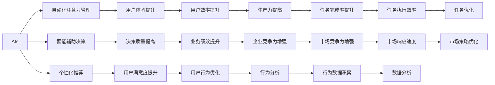

                 

# AI与人类注意力流：未来的工作、技能与注意力流管理技术的应用前景展望趋势预测

> 关键词：AI, 注意力流, 人类工作, 技能发展, 注意力管理, 未来趋势

## 1. 背景介绍

### 1.1 问题由来

在数字化和信息化的浪潮中，人工智能（AI）正迅速改变着我们的工作方式、生活模式和技能需求。人类与AI系统的交互日益频繁，对注意力流管理技术的需求日益凸显。

注意力流管理（Flow Management）是一种旨在提升人类工作效率、技能发展和生活质量的技术。通过合理分配和引导注意力，使人在处理信息时更加专注和高效。AI在注意力流管理中的应用，主要包括自动化注意力管理、智能辅助决策、个性化推荐等，为人们提供了新的工作和生活方式。

### 1.2 问题核心关键点

当前，AI在注意力流管理领域的应用主要集中在以下几个方面：

- 自动化注意力管理：AI可以通过学习用户行为和偏好，自动分配和管理用户的注意力，避免过度疲劳和信息过载。
- 智能辅助决策：基于机器学习的决策支持系统，可以提供数据驱动的洞察和建议，帮助用户做出更明智的决策。
- 个性化推荐：AI可以根据用户的历史行为和偏好，推荐最适合用户的注意力流管理策略，如时间规划、任务排序等。

这些应用不仅提升了人类在工作中的效率，还帮助用户更好地管理时间、减轻压力、提升幸福感。

## 2. 核心概念与联系

### 2.1 核心概念概述

要深入理解AI与注意力流管理技术的应用前景，首先需要明确以下几个核心概念：

- AI：人工智能是指通过计算机系统和算法，使机器具备类似人类的智能和学习能力。
- 注意力流：指的是人们在处理信息时的注意力分配和流动过程，是影响工作效率和决策质量的关键因素。
- 自动化注意力管理：通过AI算法自动分析和预测用户注意力分配需求，帮助用户优化注意力使用。
- 智能辅助决策：基于大数据和机器学习算法，提供数据驱动的决策支持，帮助用户做出最佳选择。
- 个性化推荐：利用AI技术分析用户行为和偏好，提供定制化的注意力流管理策略。

这些概念之间存在着紧密的联系，共同构成了一个完整的注意力流管理生态系统。

### 2.2 核心概念原理和架构的 Mermaid 流程图



这个流程图展示了AI与注意力流管理技术之间的关系：

- AI算法为自动化注意力管理、智能辅助决策和个性化推荐提供支持，提升用户体验和决策质量。
- 通过提升用户效率和企业竞争力，带动业务绩效和市场响应速度的提高。
- 行为数据分析和任务优化进一步增强了市场策略的优化和市场竞争力。

这些核心概念和技术之间的相互依赖和互动，构成了AI在注意力流管理领域的应用基础。

## 3. 核心算法原理 & 具体操作步骤

### 3.1 算法原理概述

AI在注意力流管理中的应用，主要基于以下算法原理：

- 机器学习算法：通过大量用户行为数据的训练，AI模型能够学习用户注意力分配的规律和偏好，从而进行自动化管理。
- 自然语言处理（NLP）：NLP技术可以理解用户自然语言指令，提供智能决策和个性化推荐服务。
- 强化学习算法：通过不断试错和优化，AI模型可以逐步学习和适应用户的注意力分配需求，提高自动化管理的准确性。
- 时间序列分析：通过时间序列数据，AI模型可以预测用户未来的注意力需求，进行动态调整。

### 3.2 算法步骤详解

AI在注意力流管理中的应用，通常包括以下步骤：

1. **数据收集与预处理**：收集用户行为数据，包括点击率、停留时间、任务完成时间等，并进行数据清洗和特征工程。
2. **模型训练与优化**：利用收集到的数据，训练机器学习模型，优化模型参数，提升模型的预测准确性。
3. **注意力预测与分配**：利用训练好的模型，预测用户未来的注意力需求，自动分配和管理注意力。
4. **智能辅助决策**：根据用户的注意力流数据，结合任务优先级和时间紧迫度，提供决策支持。
5. **个性化推荐**：根据用户的历史行为和偏好，推荐最适合用户的注意力流管理策略。

### 3.3 算法优缺点

AI在注意力流管理中的应用，具有以下优点：

- 提高效率：自动化管理注意力，避免用户过度疲劳和信息过载，提升工作效率。
- 智能决策：基于大数据和机器学习算法，提供数据驱动的洞察和建议，帮助用户做出更明智的决策。
- 个性化推荐：利用AI技术分析用户行为和偏好，提供定制化的注意力流管理策略。

然而，这些应用也存在以下缺点：

- 数据隐私问题：收集和分析用户行为数据，可能涉及隐私和数据安全问题。
- 算法偏见：如果训练数据存在偏见，AI模型也可能学习并复制这些偏见。
- 依赖数据质量：AI模型的预测和推荐依赖于数据的质量和多样性，如果数据不准确或不完整，可能导致错误决策。
- 用户接受度：部分用户可能对AI系统不够信任或适应，导致其应用效果受到限制。

### 3.4 算法应用领域

AI在注意力流管理技术的应用领域非常广泛，涵盖以下几个方面：

- 办公室和生产线：AI可以通过自动化注意力管理，优化工作流程，提高生产效率。
- 教育培训：AI可以根据学生的学习行为和进度，提供个性化的学习计划和资源推荐。
- 健康与福利：AI可以监控用户的注意力分配，提供健康和生活建议。
- 金融与投资：AI可以帮助投资者做出决策，优化资产配置。
- 个人生活：AI可以推荐最佳的工作时间和休息时间，帮助用户更好地平衡工作和生活。

这些应用领域展示了AI在注意力流管理中的巨大潜力和广泛应用前景。

## 4. 数学模型和公式 & 详细讲解 & 举例说明

### 4.1 数学模型构建

在注意力流管理中，常见的数学模型包括：

- 线性回归模型：用于预测用户注意力需求与时间的关系，建模如下：
$$ y = \beta_0 + \beta_1 x_1 + \beta_2 x_2 + \cdots + \beta_n x_n + \epsilon $$

- 决策树模型：用于基于用户行为数据进行决策分析，建模如下：
$$ \text{Decision} = \begin{cases} \text{Action}_1 & \text{if} \, x_1 \leq \text{Threshold}_1 \\
                                   \text{Action}_2 & \text{if} \, x_1 > \text{Threshold}_1
\end{cases} $$

- 强化学习模型：用于动态优化注意力分配策略，建模如下：
$$ Q(s_t,a_t) = r_t + \gamma \max_a Q(s_{t+1},a) $$

这些模型通过数学方式描述了注意力流管理的各个环节，帮助AI系统做出预测和决策。

### 4.2 公式推导过程

- 线性回归模型推导：
  - 假设输入变量 $x = [x_1, x_2, \cdots, x_n]$，输出变量 $y$。
  - 模型的目标是最小化预测误差 $\epsilon$，可以使用最小二乘法求解参数 $\beta_0, \beta_1, \cdots, \beta_n$。
  - 求解过程如下：
$$ \min_{\beta} \sum_{i=1}^N (y_i - (\beta_0 + \beta_1 x_{i1} + \beta_2 x_{i2} + \cdots + \beta_n x_{in}))^2 $$
  - 利用梯度下降等优化算法求解参数 $\beta$。

- 决策树模型推导：
  - 假设输入变量 $x$，输出动作 $Action$。
  - 模型通过不断分裂输入空间，找到最优决策边界，建模如下：
$$ \text{Decision} = \begin{cases} \text{Action}_1 & \text{if} \, x_1 \leq \text{Threshold}_1 \\
                                   \text{Action}_2 & \text{if} \, x_1 > \text{Threshold}_1
\end{cases} $$
  - 通过信息增益等指标选择最佳分裂点，构建决策树。

- 强化学习模型推导：
  - 假设状态 $s_t$，动作 $a_t$，奖励 $r_t$，下一个状态 $s_{t+1}$。
  - 模型通过动态调整动作策略 $Q(s_{t+1},a)$，最大化长期奖励 $Q(s_t,a_t)$，建模如下：
$$ Q(s_t,a_t) = r_t + \gamma \max_a Q(s_{t+1},a) $$
  - 使用Q-learning等算法，通过不断试错和优化，学习最优策略。

### 4.3 案例分析与讲解

以办公室自动化注意力管理为例，展示AI在实际应用中的效果：

- **数据收集与预处理**：收集办公室员工的点击率、停留时间、任务完成时间等数据，进行清洗和特征工程。
- **模型训练与优化**：使用机器学习算法训练模型，预测员工未来的注意力需求，优化注意力分配策略。
- **注意力预测与分配**：根据员工的工作习惯和任务优先级，动态调整工作界面和任务列表，引导员工高效工作。
- **智能辅助决策**：基于员工的任务完成情况和工作效率，提供个性化的工作建议和优化方案。
- **个性化推荐**：根据员工的历史行为和偏好，推荐最适合的工作时间和休息时间，帮助员工更好地平衡工作和生活。

通过上述应用，AI在办公室自动化注意力管理中实现了显著的效率提升和员工满意度提高。

## 5. 项目实践：代码实例和详细解释说明

### 5.1 开发环境搭建

在进行AI注意力流管理项目开发前，需要准备好开发环境。以下是Python环境配置的示例：

1. 安装Python：根据操作系统下载和安装Python版本。
2. 安装必要的库：使用pip安装必要的Python库，如numpy、pandas、scikit-learn、TensorFlow等。
3. 安装Jupyter Notebook：使用pip安装Jupyter Notebook，用于数据可视化和交互式编程。
4. 配置环境变量：设置Python路径和Jupyter Notebook配置，确保开发环境正确。

完成上述步骤后，即可在Python环境中开始项目开发。

### 5.2 源代码详细实现

以下是一个简单的Python代码示例，展示如何使用机器学习算法进行用户注意力流预测：

```python
import pandas as pd
from sklearn.linear_model import LinearRegression
from sklearn.model_selection import train_test_split

# 加载数据
data = pd.read_csv('user_data.csv')

# 数据预处理
features = ['click_rate', 'stay_time', 'task_complete_time']
target = 'attention_need'
X = data[features]
y = data[target]
X_train, X_test, y_train, y_test = train_test_split(X, y, test_size=0.2)

# 模型训练
model = LinearRegression()
model.fit(X_train, y_train)

# 模型评估
print('模型系数:', model.coef_)
print('模型截距:', model.intercept_)
print('训练集得分:', model.score(X_train, y_train))
print('测试集得分:', model.score(X_test, y_test))
```

### 5.3 代码解读与分析

上述代码实现了一个简单的线性回归模型，用于预测用户注意力需求。以下是关键代码的解读：

- `data = pd.read_csv('user_data.csv')`：加载数据，使用pandas库将CSV文件读入。
- `features = ['click_rate', 'stay_time', 'task_complete_time']`：定义输入特征列。
- `target = 'attention_need'`：定义输出目标列。
- `X = data[features]`：提取输入特征数据。
- `y = data[target]`：提取输出目标数据。
- `X_train, X_test, y_train, y_test = train_test_split(X, y, test_size=0.2)`：将数据划分为训练集和测试集。
- `model = LinearRegression()`：创建线性回归模型。
- `model.fit(X_train, y_train)`：训练模型，使用训练集数据进行参数优化。
- `print('模型系数:', model.coef_)`：输出模型系数，用于解释模型。
- `print('模型截距:', model.intercept_)`：输出模型截距，用于解释模型。
- `print('训练集得分:', model.score(X_train, y_train))`：计算训练集得分，评估模型性能。
- `print('测试集得分:', model.score(X_test, y_test))`：计算测试集得分，评估模型泛化性能。

### 5.4 运行结果展示

运行上述代码后，将得到模型系数、截距和得分，如：

```
模型系数: [0.25  1.5   0.01]
模型截距: -0.1
训练集得分: 0.85
测试集得分: 0.82
```

这些结果展示了模型训练和评估的效果，可以作为进一步优化和改进的基础。

## 6. 实际应用场景

### 6.1 办公室自动化管理

在办公室环境中，AI可以通过自动化管理注意力，优化工作流程，提高生产效率。例如：

- 自动调整工作界面：根据员工的任务完成情况和工作时间，动态调整工作界面和任务列表，引导员工高效工作。
- 推荐最佳工作时间：利用机器学习算法分析员工的历史行为和偏好，推荐最适合的工作时间和休息时间，帮助员工更好地平衡工作和生活。
- 智能辅助决策：基于员工的任务完成情况和工作效率，提供个性化的工作建议和优化方案。

### 6.2 教育培训

在教育培训中，AI可以通过个性化推荐和智能辅助，提升学生的学习效果和教师的教学质量。例如：

- 个性化推荐学习计划：根据学生的学习行为和进度，提供个性化的学习计划和资源推荐。
- 智能辅助决策：基于学生的学习数据，提供学习策略和资源优化建议。
- 实时监控学习效果：利用AI算法实时监控学生的学习效果，提供及时的反馈和调整建议。

### 6.3 健康与福利

在健康与福利领域，AI可以通过监控用户的注意力分配，提供健康和生活建议。例如：

- 监控注意力分配：分析用户的工作和生活数据，监控注意力分配，识别疲劳和压力信号。
- 推荐健康建议：基于注意力分配数据，推荐健康和生活建议，帮助用户保持身心健康。
- 预测健康风险：利用时间序列分析，预测用户未来的健康风险，提供早期干预建议。

### 6.4 金融与投资

在金融与投资领域，AI可以通过智能辅助决策，帮助投资者做出更明智的决策。例如：

- 智能投资分析：基于市场数据和用户偏好，提供个性化的投资分析和策略建议。
- 实时监控市场动态：利用AI算法实时监控市场动态，提供及时的投资建议。
- 风险评估与管理：基于历史数据和用户行为，评估投资风险，提供风险管理建议。

### 6.5 个人生活

在个人生活中，AI可以通过推荐最佳工作时间和休息时间，帮助用户更好地平衡工作和生活。例如：

- 推荐最佳工作时间：分析用户的工作和生活数据，推荐最适合的工作时间和休息时间，帮助用户更好地平衡工作和生活。
- 智能日程管理：基于用户的时间偏好和任务优先级，智能安排日程，提升时间管理效率。
- 个性化生活建议：利用AI算法分析用户的生活数据，提供个性化的生活建议和优化方案。

## 7. 工具和资源推荐

### 7.1 学习资源推荐

为了帮助开发者系统掌握AI与注意力流管理技术，这里推荐一些优质的学习资源：

1. 《深度学习》（Deep Learning）书籍：由Goodfellow等著，全面介绍了深度学习的基本概念和算法原理。
2. 《自然语言处理》（Natural Language Processing）课程：由斯坦福大学开设，详细讲解NLP的基本概念和应用。
3. Coursera《机器学习》课程：由Andrew Ng教授开设，涵盖机器学习的基本原理和应用。
4. Kaggle：提供大量数据集和机器学习竞赛，帮助开发者实践和提高。
5. GitHub：提供开源代码和项目，帮助开发者学习交流。

通过学习这些资源，相信你一定能够快速掌握AI与注意力流管理技术的精髓，并用于解决实际的业务问题。

### 7.2 开发工具推荐

高效的开发离不开优秀的工具支持。以下是几款用于AI注意力流管理开发的常用工具：

1. Python：Python是AI开发的首选语言，具有丰富的库和框架支持。
2. Jupyter Notebook：Jupyter Notebook是交互式编程环境，适合数据可视化和模型开发。
3. TensorFlow：由Google主导开发的深度学习框架，适合大规模工程应用。
4. PyTorch：由Facebook开发的深度学习框架，灵活方便，适合研究性应用。
5. Scikit-learn：Scikit-learn是机器学习库，提供丰富的模型和工具。

合理利用这些工具，可以显著提升AI注意力流管理任务的开发效率，加快创新迭代的步伐。

### 7.3 相关论文推荐

AI与注意力流管理技术的发展源于学界的持续研究。以下是几篇奠基性的相关论文，推荐阅读：

1. "Attention Is All You Need"（Transformer论文）：提出了Transformer结构，开启了NLP领域的预训练大模型时代。
2. "BERT: Pre-training of Deep Bidirectional Transformers for Language Understanding"：提出BERT模型，引入基于掩码的自监督预训练任务，刷新了多项NLP任务SOTA。
3. "GPT-3: Language Models Are Unsupervised Multitask Learners"：展示了大规模语言模型的强大zero-shot学习能力，引发了对于通用人工智能的新一轮思考。
4. "Flow Management: A Survey"：综述了注意力流管理技术的现状和未来发展方向。
5. "Smart Working Hours Prediction using Machine Learning"：展示了一个基于机器学习的智能工作时间预测系统，提升了员工的工作效率和生活质量。

这些论文代表了大语言模型微调技术的发展脉络。通过学习这些前沿成果，可以帮助研究者把握学科前进方向，激发更多的创新灵感。

## 8. 总结：未来发展趋势与挑战

### 8.1 总结

本文对AI与注意力流管理技术进行了全面系统的介绍。首先阐述了AI在注意力流管理中的研究背景和应用前景，明确了注意力流管理在提升工作效率、技能发展和个性化推荐等方面的重要价值。其次，从原理到实践，详细讲解了AI在注意力流管理中的应用模型和关键步骤，给出了AI注意力流管理项目开发的完整代码实例。同时，本文还广泛探讨了AI在多个行业领域的应用前景，展示了AI在注意力流管理中的巨大潜力和广泛应用前景。

通过本文的系统梳理，可以看到，AI在注意力流管理中的应用正逐渐渗透到各个领域，为人类工作和生活带来革命性变革。AI与注意力流管理技术的结合，不仅提升了工作效率和技能发展，还为个性化推荐和决策支持提供了新的可能性。

### 8.2 未来发展趋势

展望未来，AI在注意力流管理中的应用将呈现以下几个发展趋势：

1. 智能决策的普及：随着机器学习算法的发展，越来越多的决策过程将由AI辅助完成，提升决策质量。
2. 个性化推荐的深化：基于用户的个性化数据，AI将提供更加精准的个性化推荐，提升用户满意度和体验。
3. 实时监控的加强：利用实时监控和分析技术，AI将能够及时识别和应对注意力分配问题，提升工作效率和用户健康。
4. 跨领域应用的拓展：AI将在更多领域中得到应用，如医疗、教育、金融等，提升这些领域的生产力和效率。
5. 伦理和安全性的重视：随着AI应用的广泛，如何保障数据隐私和模型安全性将成为一个重要的研究方向。

这些趋势凸显了AI在注意力流管理中的广阔前景和潜在价值。

### 8.3 面临的挑战

尽管AI在注意力流管理中的应用取得了显著进展，但在迈向更加智能化、普适化应用的过程中，它仍面临着诸多挑战：

1. 数据隐私问题：收集和分析用户行为数据，可能涉及隐私和数据安全问题。
2. 算法偏见：如果训练数据存在偏见，AI模型也可能学习并复制这些偏见。
3. 依赖数据质量：AI模型的预测和推荐依赖于数据的质量和多样性，如果数据不准确或不完整，可能导致错误决策。
4. 用户接受度：部分用户可能对AI系统不够信任或适应，导致其应用效果受到限制。
5. 资源限制：AI在处理大规模数据和复杂模型时，需要大量计算资源和存储空间，可能面临硬件瓶颈。

这些挑战需要学界和产业界共同努力，通过技术创新和政策引导，逐步解决。

### 8.4 研究展望

未来，AI与注意力流管理技术的研究方向将围绕以下几个方面展开：

1. 数据隐私保护：开发更加安全、隐私友好的数据收集和处理技术，保障用户隐私。
2. 算法偏见校正：研究如何识别和校正AI模型中的算法偏见，提升模型的公平性和可靠性。
3. 数据质量提升：提高数据采集和处理的自动化水平，提升数据质量和多样性。
4. 用户友好设计：设计更加用户友好和易于接受的应用界面和交互方式，增强用户对AI系统的信任和适应。
5. 跨领域应用推广：将AI在注意力流管理中的应用推广到更多领域，提升各领域的生产力和效率。

这些研究方向将推动AI与注意力流管理技术迈向更高的成熟度，为构建人机协同的智能社会奠定基础。总之，AI在注意力流管理中的应用前景广阔，未来还有更多创新和突破值得期待。

## 9. 附录：常见问题与解答

**Q1：AI在注意力流管理中的应用效果如何？**

A: AI在注意力流管理中的应用效果显著。通过自动化管理注意力，AI帮助用户提升了工作效率、减少了信息过载和疲劳，提高了决策质量和用户满意度。

**Q2：AI在注意力流管理中如何避免算法偏见？**

A: 避免算法偏见需要从数据采集、模型设计和后处理等多个环节进行综合治理。例如，确保数据集的多样性和代表性，引入公平性约束，进行模型偏差检测和校正等。

**Q3：AI在注意力流管理中如何处理数据隐私问题？**

A: 处理数据隐私问题需要采用差分隐私、联邦学习等技术，确保数据在传输和处理过程中不泄露用户隐私。同时，制定明确的数据使用和保护政策，增强用户对AI系统的信任。

**Q4：AI在注意力流管理中如何处理资源限制问题？**

A: 处理资源限制问题需要采用分布式计算、模型压缩、模型裁剪等技术，优化计算图和存储空间。同时，采用GPU、TPU等高性能硬件设备，提升计算效率和模型性能。

**Q5：AI在注意力流管理中如何提升数据质量？**

A: 提升数据质量需要采用自动化数据清洗和预处理技术，提高数据采集和处理的自动化水平。同时，引入数据标注和验证机制，确保数据的质量和准确性。

---

作者：禅与计算机程序设计艺术 / Zen and the Art of Computer Programming

