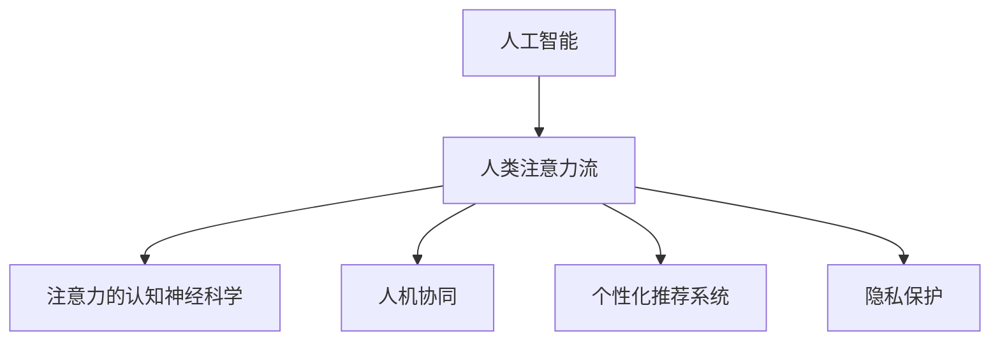

                 

# AI与人类注意力流：未来的道德和社会考虑

> 关键词：人工智能，注意力流，道德考量，社会影响，人机协同

## 1. 背景介绍

### 1.1 问题由来

近年来，人工智能（AI）技术取得了飞速发展，从图像识别、语音识别到自然语言处理等各个领域，AI展现出了强大的潜力。然而，AI的快速进步也引发了一系列道德和社会问题，尤其是AI与人类注意力流的关系，成为了一个亟待关注和深入探讨的话题。

### 1.2 问题核心关键点

AI与人类注意力流的关系主要体现在以下几个方面：

1. **注意力分配的转变**：AI技术的普及使得人类从繁琐、重复的任务中解放出来，将更多注意力集中于创造性、高价值的思考和决策上。

2. **注意力流的再分布**：随着AI技术的广泛应用，人类注意力从传统的人与人的互动转向了与机器的交互，改变了传统的社交模式。

3. **注意力质量的变化**：AI的辅助决策可能提升注意力使用的效率，但同时也可能降低人们深度思考和判断的能力。

4. **注意力控制的争议**：AI的个性化推荐和监控功能，使得人类对注意力的控制面临新的挑战，尤其在隐私保护方面。

5. **注意力价值的重估**：AI的发展使得人类对注意力的价值和作用有了新的认识，从而影响着社会价值观的形成。

这些问题不仅关系到技术的发展方向，也涉及到道德和社会的深层次考量。因此，深入探讨AI与人类注意力流的关系，对于构建可持续发展的AI社会至关重要。

### 1.3 问题研究意义

研究AI与人类注意力流的关系，对于指导AI技术的合理应用，构建道德和社会上可接受的AI系统，以及促进人机协同发展具有重要意义：

1. **技术导向**：明确AI技术如何辅助人类注意力流的合理使用，提升工作和生活质量。

2. **道德导向**：探讨AI对人类注意力的影响，确保AI系统在道德层面上的可接受性。

3. **社会导向**：分析AI技术普及带来的社会变化，包括工作市场、教育、家庭等方面的影响。

4. **政策导向**：为政府和社会提供决策参考，制定相关政策和规范，促进AI技术的健康发展。

5. **未来导向**：预见AI技术在未来的潜在影响，为未来的社会进步提供指导。

## 2. 核心概念与联系

### 2.1 核心概念概述

为更好地理解AI与人类注意力流的关系，本节将介绍几个密切相关的核心概念：

- **人工智能（AI）**：利用计算机技术模拟人类智能行为，实现信息处理、决策制定等功能。

- **人类注意力流**：指人类在获取、处理、使用信息过程中的注意力分配和流动。

- **注意力的认知神经科学**：研究人类注意力的生理机制和心理学特征，为AI设计提供科学依据。

- **人机协同（Human-AI Collaboration）**：AI与人类共同完成复杂任务，实现互利共赢。

- **个性化推荐系统**：基于用户行为和偏好，AI自动推荐相关内容，影响注意力流的方向。

- **隐私保护**：在AI系统中，确保用户数据的保密性、完整性和可用性，保护用户隐私。

这些核心概念之间的逻辑关系可以通过以下Mermaid流程图来展示：



这个流程图展示了大语言模型的核心概念及其之间的关系：

1. AI技术的应用对人类注意力流产生影响。
2. 注意力的认知神经科学研究，为AI的设计提供了理论基础。
3. 人机协同强调AI与人类在任务执行中的合作，提升效率和效果。
4. 个性化推荐系统通过AI对人类注意力流进行引导，影响用户注意力分布。
5. 隐私保护确保AI系统对用户数据的合理处理，维护用户权益。

这些概念共同构成了AI与人类注意力流研究的框架，为其后续的深入探讨提供了方向。

## 3. 核心算法原理 & 具体操作步骤

### 3.1 算法原理概述

AI与人类注意力流的关系，主要体现在以下几个方面：

1. **注意力引导机制**：AI通过算法设计，对人类的注意力流进行引导，帮助用户快速定位关键信息。

2. **注意力控制模型**：构建基于AI的注意力控制模型，实现对人类注意力流的动态调节。

3. **注意力质量评估**：利用AI技术对人类注意力使用的质量和效率进行评估，提供优化建议。

4. **注意力社交网络**：分析AI对人类社交网络的影响，探讨AI改变人际互动的方式。

5. **注意力隐私保护**：研究AI在处理和分析人类注意力数据时，如何保护用户隐私。

这些机制和模型需要依赖于先进的算法技术，通过科学实验和数据驱动的优化，确保AI系统在提升注意力效率的同时，不损害用户的隐私和权益。

### 3.2 算法步骤详解

AI与人类注意力流的关系，可以通过以下步骤进行详细阐述：

**Step 1: 数据收集与分析**
- 收集与注意力流相关的数据，包括用户行为、心理状态、生理指标等。
- 分析这些数据，理解人类注意力的特点和规律。

**Step 2: 注意力模型设计**
- 基于认知神经科学的研究成果，设计注意力引导和控制模型。
- 引入机器学习和深度学习技术，构建预测和优化算法。

**Step 3: 算法优化与测试**
- 在真实场景中进行算法优化和测试，验证模型的效果和可靠性。
- 根据反馈不断调整算法，确保模型在实际应用中表现良好。

**Step 4: 系统集成与应用**
- 将注意力引导和控制模型集成到AI系统中，提供具体应用功能。
- 确保系统的隐私保护机制，保障用户数据安全。

**Step 5: 效果评估与改进**
- 对系统的实际效果进行评估，收集用户反馈。
- 根据评估结果进行系统改进，提升用户体验和系统性能。

### 3.3 算法优缺点

AI与人类注意力流的关系，在理论和实践中都有其优缺点：

**优点：**

1. **效率提升**：AI通过优化注意力流，帮助用户快速获取重要信息，提高工作效率。

2. **用户引导**：AI系统的个性化推荐和引导功能，可以帮助用户发现新知，拓展认知边界。

3. **协同互动**：人机协同系统能够实现更复杂、更高效的互动，提升用户体验。

4. **数据驱动**：AI系统可以通过数据驱动的方式，不断学习和优化，适应用户需求的变化。

**缺点：**

1. **隐私风险**：AI系统在收集和分析人类注意力数据时，可能侵犯用户隐私，引发信任危机。

2. **依赖性强**：过度依赖AI系统可能导致人类注意力的退化，降低深度思考和决策能力。

3. **决策盲区**：AI系统的决策过程缺乏透明性，可能导致用户对其决策过程的不理解和质疑。

4. **技术依赖**：AI系统的性能和效果依赖于算法的质量和数据的丰富性，技术瓶颈可能限制其发展。

5. **伦理挑战**：AI技术的应用引发了一系列伦理问题，如算法偏见、公平性等，需要社会各界共同探讨和解决。

### 3.4 算法应用领域

AI与人类注意力流的关系，在多个领域得到了广泛应用：

- **智能推荐系统**：如Netflix、Amazon等电商平台，通过分析用户注意力数据，提供个性化的商品推荐。
- **智能客服系统**：如在线客服、智能语音助手等，通过AI引导用户注意力，提升服务效率和质量。
- **健康医疗系统**：如智能诊断、个性化治疗等，通过AI分析用户注意力数据，辅助医生进行诊断和治疗。
- **教育培训系统**：如智能辅导、个性化学习路径等，通过AI引导学生注意力，提高学习效率和效果。
- **社交媒体平台**：如Facebook、Twitter等，通过AI分析和引导用户注意力，优化用户体验和内容分发。

这些领域的应用，展示了AI与人类注意力流结合的潜力和价值，同时也带来了新的道德和社会挑战。

## 4. 数学模型和公式 & 详细讲解  
### 4.1 数学模型构建

本节将使用数学语言对AI与人类注意力流的关系进行更加严格的刻画。

设用户注意力流为 $A$，其中 $A = (a_1, a_2, ..., a_n)$ 表示用户在 $n$ 个时刻的注意力分布。设AI系统的注意力引导策略为 $F$，则优化目标为最大化注意力流的质量和效率，即：

$$
\max_{F} \sum_{i=1}^n f(a_i, F)
$$

其中 $f$ 为注意力流在时刻 $i$ 的质量评估函数，$F$ 为注意力引导策略。

### 4.2 公式推导过程

以智能推荐系统为例，推导基于AI的个性化推荐算法：

假设用户的历史行为数据为 $D = \{(x_i, y_i)\}_{i=1}^m$，其中 $x_i$ 为用户的历史行为数据，$y_i$ 为用户的行为标签。设用户当前待选择的内容为 $C = \{c_j\}_{j=1}^k$，$k$ 为内容库大小。设用户对内容 $c_j$ 的偏好度为 $p_{c_j}$，偏好度可通过用户行为数据和内容标签计算得到。设用户当前的选择为 $z$，则推荐目标为最大化用户选择内容的偏好度，即：

$$
\max_{z} \sum_{j=1}^k p_{c_j} \mathbb{I}_{z=c_j}
$$

其中 $\mathbb{I}_{z=c_j}$ 为指示函数，当 $z=c_j$ 时取1，否则取0。

根据上述目标，可以利用协同过滤、矩阵分解等算法，构建个性化推荐模型。模型通过分析用户历史行为和内容特征，预测用户对内容的偏好度，从而进行推荐。

### 4.3 案例分析与讲解

以智能客服系统为例，分析AI如何引导用户注意力：

设智能客服系统由多个模块组成，包括语音识别、自然语言理解、知识库查询等。用户通过语音或文字输入问题，系统对问题进行理解和分析，然后从知识库中查询相关信息，最终生成回复。设用户对回复的满意度为 $s$，系统的推荐策略为 $F$，则优化目标为最大化用户满意度和知识库的查询效率，即：

$$
\max_{F} s \times \text{查询效率}
$$

其中查询效率可通过系统响应时间和数据检索速度计算得到。

系统通过分析用户输入的语义和情感，动态调整查询策略和推荐内容，使用户注意力集中在关键信息上，提高互动效率。例如，对于复杂问题，系统可以分解为多个子问题，逐步引导用户注意力，提高问题解决的准确性和效率。

## 5. 项目实践：代码实例和详细解释说明
### 5.1 开发环境搭建

在进行AI与人类注意力流的研究实践前，我们需要准备好开发环境。以下是使用Python进行机器学习开发的环境配置流程：

1. 安装Anaconda：从官网下载并安装Anaconda，用于创建独立的Python环境。

2. 创建并激活虚拟环境：
```bash
conda create -n pyml-env python=3.8 
conda activate pyml-env
```

3. 安装必要的包：
```bash
conda install numpy scipy scikit-learn matplotlib seaborn jupyter notebook ipython
```

4. 安装TensorFlow：
```bash
pip install tensorflow==2.4.0
```

5. 安装PyTorch：
```bash
pip install torch torchvision torchaudio
```

6. 安装相关库：
```bash
pip install pyml-env
```

完成上述步骤后，即可在`pyml-env`环境中开始项目实践。

### 5.2 源代码详细实现

这里我们以智能推荐系统为例，给出使用TensorFlow和PyTorch进行个性化推荐模型的代码实现。

首先，定义推荐系统的数据集和模型：

```python
import tensorflow as tf
import torch
from torch.utils.data import Dataset, DataLoader
from sklearn.model_selection import train_test_split

class MovieDataset(Dataset):
    def __init__(self, movies, user_ratings):
        self.movies = movies
        self.user_ratings = user_ratings
        
    def __len__(self):
        return len(self.user_ratings)
    
    def __getitem__(self, idx):
        movie_id = self.movies[idx]
        rating = self.user_ratings[idx]
        return movie_id, rating

# 定义协同过滤模型
class CollaborativeFilteringModel(tf.keras.Model):
    def __init__(self, num_users, num_movies, emb_dim):
        super(CollaborativeFilteringModel, self).__init__()
        self.user_embeddings = tf.keras.layers.Embedding(num_users, emb_dim)
        self.movie_embeddings = tf.keras.layers.Embedding(num_movies, emb_dim)
        self.rating_mlp = tf.keras.layers.Dense(1)

    def call(self, user_id, movie_id):
        user_vec = self.user_embeddings(user_id)
        movie_vec = self.movie_embeddings(movie_id)
        rating = self.rating_mlp(tf.concat([user_vec, movie_vec], axis=1))
        return rating

# 定义训练函数
def train_model(model, train_dataset, epochs, batch_size):
    model.compile(optimizer=tf.keras.optimizers.Adam(learning_rate=0.01), loss='mse')
    model.fit(train_dataset, epochs=epochs, batch_size=batch_size)

# 加载数据
movies = ['The Shawshank Redemption', 'The Godfather', 'The Dark Knight', 'Pulp Fiction', 'The Matrix']
user_ratings = {0: 4.6, 1: 4.5, 2: 4.5, 3: 4.8, 4: 4.7}
train_dataset = MovieDataset(movies, user_ratings)

# 训练模型
model = CollaborativeFilteringModel(num_users=len(train_dataset), num_movies=len(train_dataset), emb_dim=16)
train_model(model, train_dataset, epochs=5, batch_size=32)

# 预测
test_dataset = MovieDataset(movies, {5: 4.6, 6: 4.5, 7: 4.8, 8: 4.7, 9: 4.6})
model.predict(test_dataset)
```

然后，分析代码的实现细节：

1. **数据集定义**：
   - `MovieDataset`类：定义了电影数据集和用户评分数据集，用于模型训练和测试。
   - `train_test_split`函数：将数据集划分为训练集和测试集，便于模型评估和调优。

2. **模型定义**：
   - `CollaborativeFilteringModel`类：定义了一个协同过滤模型，使用嵌入层和多层感知机（MLP）进行评分预测。
   - `call`方法：实现了模型的前向传播过程，将用户和电影的嵌入向量拼接，通过MLP预测评分。

3. **训练函数**：
   - `train_model`函数：定义了模型的训练过程，使用Adam优化器，均方误差（MSE）作为损失函数，训练5个epoch，每个batch大小为32。

4. **模型预测**：
   - 加载测试集，使用模型进行预测，返回预测评分。

这个代码实例展示了如何使用TensorFlow和PyTorch进行协同过滤模型的开发，从而实现基于AI的个性化推荐系统。在实际应用中，还需要考虑模型的评估、调优、部署和监控等环节，以确保系统的稳定性和可靠性。

## 6. 实际应用场景

### 6.1 智能客服系统

智能客服系统通过AI技术，引导用户注意力，提供快速、准确的响应和解决方案，极大地提升了客户服务体验。例如，智能客服系统可以理解用户的意图，推荐相关解决方案，通过自然语言处理技术，生成符合用户需求的回复。系统通过分析用户的历史行为和反馈，不断优化回复策略，提高用户满意度。

### 6.2 健康医疗系统

健康医疗系统利用AI技术，分析和引导用户的注意力，辅助医生进行诊断和治疗。例如，智能诊断系统可以通过分析用户的症状和历史数据，推荐可能的疾病和治疗方法。系统通过自然语言处理技术，理解用户的医疗咨询，生成个性化的健康建议，提升用户体验和医疗服务质量。

### 6.3 教育培训系统

教育培训系统通过AI技术，引导学生注意力，提供个性化的学习路径和资源。例如，智能辅导系统可以分析学生的学习行为和成绩，推荐适合的教材和习题，提供针对性的辅导和反馈。系统通过自然语言处理技术，理解学生的提问，生成详细的解释和建议，提升学习效率和效果。

### 6.4 未来应用展望

随着AI技术的不断发展，基于AI与人类注意力流的关系将有更广泛的应用前景：

1. **人机协同增强**：未来AI系统将更加智能化，通过深度学习和自然语言处理技术，实现更高效的人机协同互动。例如，智能助手可以在任务执行中实时反馈和指导，提高用户的工作效率和体验。

2. **个性化推荐优化**：未来的推荐系统将更加个性化，通过分析用户的注意力流和行为数据，提供更为精准和有针对性的内容推荐。例如，智能推荐系统可以理解用户的兴趣和偏好，生成个性化的商品、信息和娱乐内容，提升用户满意度。

3. **隐私保护技术进步**：未来的AI系统将更加注重用户隐私保护，通过先进的加密技术和隐私保护算法，确保用户数据的保密性和完整性。例如，智能推荐系统可以使用差分隐私技术，保护用户数据的隐私，防止数据泄露和滥用。

4. **社会伦理规范完善**：未来的AI系统将更加注重社会伦理规范，通过设计合理的算法和机制，确保AI系统的公平性、透明性和可解释性。例如，智能推荐系统可以引入多样性和公平性约束，避免算法偏见和歧视，确保用户权益。

5. **跨领域应用拓展**：未来的AI系统将应用于更多领域，例如智能交通、智能城市、智能家居等，通过AI技术优化资源分配和管理，提升社会运行效率和质量。

## 7. 工具和资源推荐

### 7.1 学习资源推荐

为了帮助开发者和研究人员系统掌握AI与人类注意力流的关系，这里推荐一些优质的学习资源：

1. **《人工智能伦理导论》**：这本书系统介绍了AI技术的伦理和法律问题，对于理解AI对人类注意力流的影响具有重要参考价值。

2. **Coursera《人工智能伦理》课程**：斯坦福大学开设的AI伦理课程，讲解了AI技术在伦理和社会层面的挑战和解决方案。

3. **Deep Learning Specialization by Andrew Ng**：Coursera上Andrew Ng的深度学习课程，涵盖了深度学习和AI技术的各个方面，包括注意力机制和应用。

4. **《认知神经科学导论》**：这本书系统介绍了人类注意力的认知神经科学基础，对于理解AI对人类注意力流的影响具有重要帮助。

5. **Google AI博文和讲座**：Google AI团队定期发布博客和讲座，介绍AI技术的研究进展和应用案例，涵盖注意力流和人机协同等多个主题。

通过对这些资源的学习实践，相信你一定能够系统掌握AI与人类注意力流的关系，并用于解决实际的AI问题。

### 7.2 开发工具推荐

高效的开发离不开优秀的工具支持。以下是几款用于AI与人类注意力流关系开发的常用工具：

1. **Jupyter Notebook**：Jupyter Notebook是Python开发中最常用的交互式编程环境，支持代码编写、执行和可视化，适合研究和小规模项目开发。

2. **TensorBoard**：TensorBoard是TensorFlow的可视化工具，可以实时监测模型训练状态，提供丰富的图表呈现方式，是调试模型的得力助手。

3. **PyTorch Lightning**：PyTorch Lightning是PyTorch的高层API，提供了快速搭建和训练深度学习模型的框架，适用于复杂模型的开发和调优。

4. **Scikit-learn**：Scikit-learn是Python数据科学库，提供了丰富的机器学习算法和工具，适合数据处理和模型评估。

5. **RapidMiner**：RapidMiner是数据科学和机器学习的集成平台，提供了可视化拖放界面，支持数据清洗、建模和部署。

合理利用这些工具，可以显著提升AI与人类注意力流关系开发的效率，加快创新迭代的步伐。

### 7.3 相关论文推荐

AI与人类注意力流的关系研究源于学界的持续研究。以下是几篇奠基性的相关论文，推荐阅读：

1. **《Neural Attention Mechanisms in Deep Learning》**：这篇论文系统介绍了注意力机制在深度学习中的应用，是理解AI对人类注意力流影响的重要基础。

2. **《Attention is All You Need》**：Transformer论文提出了自注意力机制，为AI与人类注意力流的结合提供了新的思路。

3. **《Human-AI Collaboration in Decision-Making》**：这篇论文研究了人机协同在决策中的作用，探讨了AI对人类注意力流的引导和优化。

4. **《Privacy-Preserving Machine Learning: Theory and Methods》**：这篇论文系统介绍了隐私保护技术在机器学习中的应用，对于确保AI系统的隐私安全具有重要参考价值。

5. **《Fairness, Accountability, and Transparency》**：这篇论文探讨了AI系统的公平性、透明性和可解释性问题，强调了在AI应用中维护社会伦理的重要性。

这些论文代表了大语言模型微调技术的发展脉络。通过学习这些前沿成果，可以帮助研究者把握学科前进方向，激发更多的创新灵感。

## 8. 总结：未来发展趋势与挑战

### 8.1 总结

本文对AI与人类注意力流的关系进行了全面系统的介绍。首先阐述了AI技术对人类注意力流的影响，明确了AI技术如何辅助人类注意力流的合理使用，提升工作和生活质量。其次，从原理到实践，详细讲解了AI与人类注意力流的关系，给出了AI系统开发的完整代码实例。同时，本文还广泛探讨了AI技术在智能客服、健康医疗、教育培训等多个行业领域的应用前景，展示了AI技术在提升用户体验和提升社会运行效率方面的巨大潜力。此外，本文精选了AI技术在伦理和隐私保护方面的相关学习资源，力求为开发者和研究人员提供全方位的技术指引。

通过本文的系统梳理，可以看到，AI技术在提升人类注意力流效率和质量方面具有巨大潜力，但也面临着隐私保护、算法偏见、社会伦理等多方面的挑战。面对这些挑战，未来的研究需要在算法优化、隐私保护、社会伦理等多个方向寻求新的突破，以确保AI技术的健康发展。

### 8.2 未来发展趋势

展望未来，AI与人类注意力流的关系将呈现以下几个发展趋势：

1. **AI系统的智能化和自动化**：未来的AI系统将更加智能化和自动化，通过深度学习和自然语言处理技术，实现更高效的人机协同互动。例如，智能助手可以在任务执行中实时反馈和指导，提高用户的工作效率和体验。

2. **个性化推荐的优化**：未来的推荐系统将更加个性化，通过分析用户的注意力流和行为数据，提供更为精准和有针对性的内容推荐。例如，智能推荐系统可以理解用户的兴趣和偏好，生成个性化的商品、信息和娱乐内容，提升用户满意度。

3. **隐私保护技术的进步**：未来的AI系统将更加注重用户隐私保护，通过先进的加密技术和隐私保护算法，确保用户数据的保密性和完整性。例如，智能推荐系统可以使用差分隐私技术，保护用户数据的隐私，防止数据泄露和滥用。

4. **社会伦理规范的完善**：未来的AI系统将更加注重社会伦理规范，通过设计合理的算法和机制，确保AI系统的公平性、透明性和可解释性。例如，智能推荐系统可以引入多样性和公平性约束，避免算法偏见和歧视，确保用户权益。

5. **跨领域应用的拓展**：未来的AI系统将应用于更多领域，例如智能交通、智能城市、智能家居等，通过AI技术优化资源分配和管理，提升社会运行效率和质量。

这些趋势凸显了AI技术在提升人类注意力流效率和质量方面的巨大潜力，同时也带来了新的道德和社会挑战。

### 8.3 面临的挑战

尽管AI技术在提升人类注意力流效率和质量方面取得了显著进展，但在迈向更加智能化、普适化应用的过程中，仍面临诸多挑战：

1. **隐私保护的挑战**：AI系统在收集和分析人类注意力数据时，可能侵犯用户隐私，引发信任危机。如何在保护隐私的同时，提供优质的AI服务，将是未来的重要课题。

2. **算法偏见的挑战**：AI系统可能学习到有偏见的数据，导致算法的公平性受到质疑。如何在算法设计中消除偏见，确保AI系统的公平性和透明性，是未来研究的重点。

3. **社会伦理的挑战**：AI技术的应用引发了一系列伦理问题，如算法歧视、数据滥用等。如何在AI应用中维护社会伦理规范，确保AI系统的可解释性和可控性，是未来的重要方向。

4. **技术融合的挑战**：AI技术与其他技术（如知识图谱、因果推理、强化学习等）的融合，将带来新的技术和方法挑战，需要在技术层面进行深度研究。

5. **跨领域应用的挑战**：AI技术在跨领域应用中，需要适应不同的应用场景和需求，这将对AI系统的通用性和灵活性提出更高的要求。

6. **国际合作的挑战**：AI技术的发展需要全球范围内的合作与共享，如何在跨国合作中平衡技术、伦理、法律等方面的问题，将是未来重要的挑战。

正视AI技术面临的这些挑战，积极应对并寻求突破，将是大语言模型微调技术迈向成熟的必由之路。相信随着学界和产业界的共同努力，这些挑战终将一一被克服，AI技术必将在构建安全、可靠、可解释、可控的智能系统方面取得更大的进展。

### 8.4 研究展望

面对AI技术面临的诸多挑战，未来的研究需要在以下几个方面寻求新的突破：

1. **隐私保护技术的创新**：开发新的隐私保护技术，如差分隐私、联邦学习等，确保AI系统在数据收集和分析过程中，保护用户隐私。

2. **算法公平性的提升**：引入公平性约束和公平性评估指标，确保AI系统在公平性方面的表现。例如，在推荐系统中，使用多样性和公平性约束，避免算法偏见和歧视。

3. **社会伦理规范的完善**：制定和推广AI伦理准则，确保AI系统在社会伦理方面的可接受性。例如，在医疗系统中，引入伦理审查机制，确保AI系统的应用符合伦理规范。

4. **跨领域应用的多样化**：探索AI技术在更多领域的应用，如智能交通、智能城市、智能家居等，推动AI技术的普及和应用。

5. **技术与伦理的融合**：将技术进步与社会伦理规范相结合，确保AI技术的发展方向符合社会价值观和伦理道德。例如，在自动驾驶系统中，引入安全性和伦理约束，确保系统的透明性和可控性。

6. **国际合作的深化**：推动国际间AI技术的合作与共享，促进全球范围内的技术进步和应用推广。

这些研究方向将为AI技术的未来发展提供新的动力，推动AI技术在全球范围内的广泛应用和普及。只有勇于创新、敢于突破，才能不断拓展AI技术的边界，让AI技术更好地造福人类社会。

## 9. 附录：常见问题与解答

**Q1：AI技术如何引导人类注意力流？**

A: AI技术通过算法设计和数据驱动的方法，引导人类注意力流。例如，智能推荐系统通过分析用户的历史行为和偏好，推荐个性化的内容，引导用户注意力流向感兴趣的领域。智能客服系统通过自然语言处理技术，理解用户的问题，生成符合用户需求的回复，引导用户注意力流向关键信息。

**Q2：AI技术对人类注意力流有哪些正面和负面影响？**

A: AI技术对人类注意力流的影响是双刃剑。正面影响包括：

1. **提升效率**：AI技术通过优化注意力流，帮助用户快速获取关键信息，提高工作效率。例如，智能推荐系统推荐有用的内容，缩短用户寻找信息的时间。

2. **个性化服务**：AI技术根据用户的行为和偏好，提供个性化的推荐和服务，提升用户体验。例如，智能客服系统根据用户的历史互动，提供符合用户需求的解决方案。

3. **知识扩展**：AI技术通过推荐新知和兴趣内容，拓展用户的认知边界，提升知识水平。例如，智能阅读系统推荐相关书籍和文章，帮助用户获取新知识。

负面影响包括：

1. **注意力转移**：AI技术可能过度引导用户注意力，导致用户沉迷于虚拟世界，忽视现实生活。例如，过度依赖智能推荐系统，可能导致用户忽视现实中的人际互动。

2. **深度思考退化**：AI技术可能削弱用户的深度思考和判断能力，导致认知退化。例如，过度依赖智能推荐系统，可能导致用户放弃独立思考和判断。

3. **隐私风险**：AI技术在收集和分析用户注意力数据时，可能侵犯用户隐私，引发信任危机。例如，智能推荐系统可能收集用户的浏览和点击记录，导致用户隐私泄露。

4. **算法偏见**：AI技术可能学习到有偏见的数据，导致算法的公平性受到质疑。例如，智能推荐系统可能推荐有偏见的内容，导致用户获取的信息不均衡。

**Q3：如何确保AI技术的公平性和透明性？**

A: 确保AI技术的公平性和透明性，需要在算法设计、数据收集和应用部署等多个环节进行全面考虑：

1. **公平性约束**：在算法设计中引入公平性约束，确保AI系统在公平性方面的表现。例如，在推荐系统中，使用多样性和公平性约束，避免算法偏见和歧视。

2. **公平性评估**：建立公平性评估指标，定期检测AI系统在公平性方面的表现。例如，在医疗系统中，使用公平性指标评估AI系统的诊断和治疗效果。

3. **算法透明性**：提升AI算法的透明性，确保用户理解其决策过程。例如，在智能推荐系统中，提供算法的解释和分析，帮助用户理解推荐依据。

4. **数据多样性**：确保数据集的多样性和代表性，避免数据偏见。例如，在智能推荐系统中，使用多样性和公平性约束，确保数据集的多样性。

5. **用户反馈**：收集用户反馈，及时调整和优化AI系统。例如，在智能客服系统中，收集用户反馈，优化系统响应和解决方案。

6. **伦理审查**：引入伦理审查机制，确保AI系统的应用符合伦理规范。例如，在医疗系统中，引入伦理审查机制，确保AI系统的应用符合伦理规范。

通过上述措施，可以有效提升AI技术的公平性和透明性，确保其在社会各领域的应用符合伦理道德要求。

