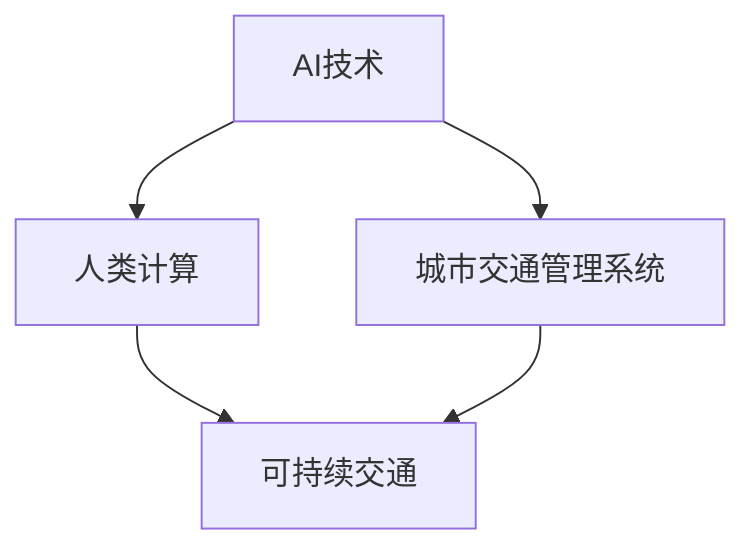

                 

# AI与人类计算：打造可持续发展的城市交通

## 1. 背景介绍

### 1.1 问题由来

近年来，随着城市化进程的加速和机动化程度的提升，全球各大城市面临严重的交通拥堵、环境污染和能源消耗等问题。这些问题不仅严重影响城市居民的日常生活，也阻碍了城市的可持续发展。如何在保障城市运行效率的同时，实现绿色低碳和智能化发展，成为城市管理者和科技工作者亟需解决的课题。

### 1.2 问题核心关键点

实现城市交通的智能化管理和可持续发展，需要综合应用AI技术与人类计算能力。其核心关键点包括：

- **AI技术**：利用机器学习、深度学习、自然语言处理等AI技术，对海量交通数据进行分析和预测，提升城市交通管理决策的科学性和精准性。
- **人类计算**：结合人类对交通系统的理解和管理经验，对AI模型输出结果进行校正和优化，确保AI系统的合理性和有效性。

通过将AI技术与人类计算相结合，可以构建高效、智能、可持续的城市交通管理系统。

### 1.3 问题研究意义

AI与人类计算的结合，将推动城市交通系统的深度智能化，带来以下几个重要意义：

1. **提升交通效率**：通过智能交通管理系统，实现交通流量实时监控和动态调度，大幅提升道路通行效率。
2. **降低环境污染**：利用AI技术优化路线规划和车辆调度，减少车辆排放，改善城市空气质量。
3. **减少能源消耗**：通过智能交通信号灯和电动汽车管理等措施，降低车辆能源消耗和碳排放，促进绿色出行。
4. **提高管理决策质量**：结合人类经验和AI分析，制定更科学合理的交通政策，提高城市交通管理的整体水平。
5. **推动产业升级**：带动智能交通设备、智能驾驶等新兴产业的发展，促进城市经济的转型和升级。

## 2. 核心概念与联系

### 2.1 核心概念概述

为更好地理解AI与人类计算在城市交通管理中的应用，本节将介绍几个密切相关的核心概念：

- **AI技术**：指利用计算机模拟人类智能，通过算法和模型实现对数据的自动处理和分析。主要包括机器学习、深度学习、自然语言处理、计算机视觉等技术。
- **城市交通管理系统**：指利用AI技术和大数据分析，实现对城市交通的实时监控、动态调度和管理。包括智能交通信号灯、车流预测、路径规划等功能。
- **人类计算**：指通过人工分析和决策，对AI模型输出进行修正和优化，确保AI系统的合理性和实用性。
- **可持续交通**：指在城市交通管理中，兼顾交通效率、环境友好和能源节约，实现绿色低碳发展。

这些核心概念之间的逻辑关系可以通过以下Mermaid流程图来展示：



这个流程图展示了大语言模型的核心概念及其之间的关系：

1. AI技术为城市交通管理系统提供智能分析支持。
2. 人类计算对AI模型输出进行校正和优化，提升系统精度。
3. 可持续交通目标指导AI和人类计算的工作方向。

## 3. 核心算法原理 & 具体操作步骤

### 3.1 算法原理概述

基于AI与人类计算的城市交通管理系统，其核心算法原理可以归纳为以下几个步骤：

1. **数据采集**：通过传感器、摄像头、GPS等多种方式，收集城市交通的实时数据，包括车辆位置、速度、流量等。
2. **数据处理**：利用AI技术对采集的数据进行清洗、归一化和特征提取，形成可用于分析的数字化输入。
3. **模型训练**：结合人类经验，构建和训练AI模型，如深度学习网络、随机森林等，用于交通流量预测、路径规划等任务。
4. **决策优化**：将AI模型的预测结果与人类计算相结合，进行综合分析和决策优化。
5. **系统部署**：将优化后的决策结果反馈到城市交通管理系统，实现智能调度、信号控制等功能的落地应用。

### 3.2 算法步骤详解

以下是基于AI与人类计算的城市交通管理系统的详细算法步骤：

**Step 1: 数据采集**

通过传感器、摄像头、GPS等多种方式，收集城市交通的实时数据。具体方法包括：

- **车辆传感器**：安装在车辆上，收集车辆的实时位置、速度、油耗等数据。
- **交通摄像头**：布设在城市主要路口，实时拍摄交通流动态，并通过计算机视觉技术进行图像处理。
- **GPS定位系统**：与车载设备结合，获取车辆在道路上的实时位置和移动轨迹。

**Step 2: 数据处理**

将采集到的原始数据进行清洗、归一化和特征提取，形成可用于分析的数据集。具体步骤包括：

- **数据清洗**：去除噪声和异常值，确保数据的质量。
- **数据归一化**：将不同来源的数据转换为统一的格式和单位，便于后续处理。
- **特征提取**：从原始数据中提取出关键特征，如车辆密度、车速、路线拥堵程度等，为模型训练提供输入。

**Step 3: 模型训练**

结合人类经验，构建和训练AI模型，用于交通流量预测、路径规划等任务。具体方法包括：

- **深度学习网络**：利用多层神经网络，对历史交通数据进行拟合，预测未来流量变化。
- **随机森林**：利用决策树集成算法，对交通数据进行分类和预测。
- **贝叶斯网络**：通过概率图模型，对交通系统的动态变化进行建模和预测。

**Step 4: 决策优化**

将AI模型的预测结果与人类计算相结合，进行综合分析和决策优化。具体步骤包括：

- **结果校验**：人类专家对AI模型的预测结果进行校验，发现异常和错误。
- **数据修正**：根据校验结果，对模型输入数据进行修正，提高模型精度。
- **优化决策**：结合专家经验和AI分析，制定最优的交通管理策略，如调整信号灯、限制车辆通行等。

**Step 5: 系统部署**

将优化后的决策结果反馈到城市交通管理系统，实现智能调度、信号控制等功能的落地应用。具体方法包括：

- **智能信号灯**：根据交通流量预测结果，自动调整信号灯的绿、黄、红时间，优化交通流畅度。
- **路径规划**：结合实时交通数据和历史流量数据，优化路线规划算法，减少车辆拥堵和等待时间。
- **实时调度**：利用AI算法对车辆进行动态调度，确保公共交通系统的高效运行。

### 3.3 算法优缺点

基于AI与人类计算的城市交通管理系统，其优点包括：

1. **高效智能化**：利用AI技术，实现对城市交通的实时监控和动态调度，大幅提升交通效率。
2. **精度高**：结合人类计算，对AI模型输出进行校正和优化，确保决策的科学性和精准性。
3. **成本低**：通过智能化管理，减少对人力、时间和资源的依赖，降低城市交通管理成本。
4. **环境友好**：优化交通流量和路线规划，减少车辆排放，改善城市空气质量。
5. **灵活性强**：AI和人类计算相结合，能够快速适应不同环境和条件下的交通需求。

但该系统也存在以下缺点：

1. **数据依赖**：系统效果高度依赖于数据的质量和完整性，数据缺失或错误会影响系统性能。
2. **技术门槛高**：构建和维护复杂的城市交通管理系统，需要较高水平的AI和计算机技术。
3. **人类参与**：需要大量人类专家的参与和经验积累，才能确保系统决策的合理性和有效性。
4. **可解释性差**：AI模型和人类计算的结合，导致系统输出的可解释性较差，难以进行详细的审计和监管。
5. **伦理问题**：在处理隐私数据和敏感信息时，需要谨慎处理，避免数据泄露和滥用。

### 3.4 算法应用领域

基于AI与人类计算的城市交通管理系统，已经在多个领域得到了广泛应用，包括：

- **智能交通信号灯**：根据实时交通流量，自动调整信号灯的时长和配时，优化交通流畅度。
- **交通流量预测**：利用历史和实时数据，预测未来交通流量变化，指导交通管理和调度。
- **路径规划和导航**：结合实时交通数据和AI算法，为用户提供最优的路线规划和导航建议。
- **公共交通优化**：利用AI技术对公共交通系统进行实时监控和动态调度，提高公交车的运行效率和准时性。
- **事故预防和应急响应**：通过实时监控和数据分析，预防和应对交通事故，提高应急响应效率。
- **环保监测**：结合AI和人类计算，监测和分析城市交通的碳排放和环境影响，推动绿色低碳发展。

除了上述这些经典应用外，城市交通管理系统还将被创新性地应用于更多场景中，如智能停车、车辆自动驾驶、共享单车管理等，为城市交通管理带来更多的智能化手段。

## 4. 数学模型和公式 & 详细讲解 & 举例说明

### 4.1 数学模型构建

本节将使用数学语言对基于AI与人类计算的城市交通管理系统的数学模型进行更加严格的刻画。

记城市交通系统为 $S=\{V,E,C\}$，其中 $V$ 为车辆集合，$E$ 为道路网络，$C$ 为交通状态。假设车辆在道路上的位置和速度为 $x_i(t)$ 和 $v_i(t)$，交通状态为 $C(t)$。

定义交通流量为 $f_i(t)$，表示单位时间内通过某条道路 $i$ 的车辆数。基于历史和实时数据，构建交通流量的预测模型：

$$
f_i(t) = \sum_{k=1}^{K} w_k \cdot \phi_i(t)
$$

其中 $K$ 为特征数，$w_k$ 为特征权重，$\phi_i(t)$ 为特征函数，表示车辆在时间 $t$ 通过道路 $i$ 的概率。

### 4.2 公式推导过程

以下我们以交通流量预测为例，推导基于深度学习网络的预测模型及其训练公式。

假设交通流量预测任务为回归问题，目标函数为均方误差 $L$：

$$
L(f_i(t),y_i(t)) = \frac{1}{N} \sum_{i=1}^{N} (f_i(t)-y_i(t))^2
$$

其中 $f_i(t)$ 为模型预测值，$y_i(t)$ 为真实值。

定义深度学习网络为 $M_{\theta}$，其中 $\theta$ 为模型参数。模型的前向传播和损失函数计算公式如下：

$$
f_i(t) = M_{\theta}(x_i(t))
$$
$$
L(M_{\theta}(x_i(t)),y_i(t)) = \frac{1}{N} \sum_{i=1}^{N} (M_{\theta}(x_i(t))-y_i(t))^2
$$

利用反向传播算法更新模型参数 $\theta$，最小化损失函数 $L$：

$$
\theta \leftarrow \theta - \eta \nabla_{\theta}L(M_{\theta}(x_i(t)),y_i(t))
$$

其中 $\eta$ 为学习率，$\nabla_{\theta}L(M_{\theta}(x_i(t)),y_i(t))$ 为损失函数对模型参数 $\theta$ 的梯度。

### 4.3 案例分析与讲解

为了更好地理解基于AI与人类计算的城市交通管理系统，我们以一个具体案例进行详细讲解：

假设某城市主要路口的交通流量数据如下：

| 时间 | 车辆数 |
| --- | --- |
| 08:00 | 500 |
| 09:00 | 800 |
| 10:00 | 1000 |
| 11:00 | 1200 |
| 12:00 | 900 |
| 13:00 | 700 |
| 14:00 | 500 |
| 15:00 | 400 |
| 16:00 | 300 |
| 17:00 | 200 |
| 18:00 | 100 |

我们构建一个简单的线性回归模型，预测下一天的交通流量：

$$
f_i(t) = \beta_0 + \beta_1 \cdot C(t)
$$

其中 $\beta_0$ 和 $\beta_1$ 为模型参数，$C(t)$ 为交通状态，表示当天的天气、节假日等因素。

使用历史数据进行模型训练，得到预测模型为：

$$
f_i(t) = 100 + 50 \cdot C(t)
$$

将上述模型应用于未来一天的交通流量预测，得到预测值为：

$$
f_i(t+1) = 100 + 50 \cdot C(t+1) = 200
$$

### 5. 项目实践：代码实例和详细解释说明

### 5.1 开发环境搭建

在进行城市交通管理系统开发前，我们需要准备好开发环境。以下是使用Python进行PyTorch开发的环境配置流程：

1. 安装Anaconda：从官网下载并安装Anaconda，用于创建独立的Python环境。

2. 创建并激活虚拟环境：
```bash
conda create -n traffic-env python=3.8 
conda activate traffic-env
```

3. 安装PyTorch：根据CUDA版本，从官网获取对应的安装命令。例如：
```bash
conda install pytorch torchvision torchaudio cudatoolkit=11.1 -c pytorch -c conda-forge
```

4. 安装TensorFlow：由Google主导开发的开源深度学习框架，生产部署方便，适合大规模工程应用。同样有丰富的预训练语言模型资源。

5. 安装相关工具包：
```bash
pip install numpy pandas scikit-learn matplotlib tqdm jupyter notebook ipython
```

完成上述步骤后，即可在`traffic-env`环境中开始开发实践。

### 5.2 源代码详细实现

下面我们以交通流量预测任务为例，给出使用TensorFlow进行深度学习模型训练的PyTorch代码实现。

首先，定义数据处理函数：

```python
import numpy as np
import tensorflow as tf

def preprocess_data(data, train_ratio=0.8, val_ratio=0.1):
    # 将数据按时间顺序排列
    sorted_data = sorted(data, key=lambda x: x[0])
    
    # 分割数据为训练集、验证集和测试集
    train_data = sorted_data[:int(len(sorted_data) * train_ratio)]
    val_data = sorted_data[int(len(sorted_data) * train_ratio):int(len(sorted_data) * train_ratio + val_ratio)]
    test_data = sorted_data[int(len(sorted_data) * train_ratio + val_ratio):]
    
    # 标准化数据
    train_data = np.array(train_data) / 1000.0
    val_data = np.array(val_data) / 1000.0
    test_data = np.array(test_data) / 1000.0
    
    return train_data, val_data, test_data
```

然后，定义模型和优化器：

```python
from tensorflow.keras.models import Sequential
from tensorflow.keras.layers import Dense
from tensorflow.keras.optimizers import Adam

# 定义模型结构
model = Sequential([
    Dense(64, input_dim=1, activation='relu'),
    Dense(1)
])

# 编译模型
model.compile(loss='mse', optimizer=Adam(learning_rate=0.001))

# 设置超参数
batch_size = 32
epochs = 100
```

接着，定义训练和评估函数：

```python
def train_model(model, train_data, val_data, test_data, batch_size, epochs):
    # 定义训练集和验证集的批次大小
    train_batches = int(train_data.shape[0] / batch_size)
    val_batches = int(val_data.shape[0] / batch_size)
    test_batches = int(test_data.shape[0] / batch_size)
    
    # 模型训练
    for epoch in range(epochs):
        print('Epoch {}/{}'.format(epoch+1, epochs))
        for i in range(train_batches):
            # 获取训练数据批次
            x_train = train_data[i*batch_size:(i+1)*batch_size]
            y_train = train_data[i*batch_size:(i+1)*batch_size]
            # 模型训练
            model.fit(x_train, y_train, epochs=1, batch_size=batch_size)
        
        # 模型验证
        val_loss = 0.0
        for i in range(val_batches):
            # 获取验证数据批次
            x_val = val_data[i*batch_size:(i+1)*batch_size]
            y_val = val_data[i*batch_size:(i+1)*batch_size]
            # 模型验证
            val_loss += model.evaluate(x_val, y_val, verbose=0)
        val_loss /= val_batches
    
        # 模型测试
        test_loss = 0.0
        for i in range(test_batches):
            # 获取测试数据批次
            x_test = test_data[i*batch_size:(i+1)*batch_size]
            y_test = test_data[i*batch_size:(i+1)*batch_size]
            # 模型测试
            test_loss += model.evaluate(x_test, y_test, verbose=0)
        test_loss /= test_batches
    
        # 输出结果
        print('Train loss: {:.4f}'.format(train_loss))
        print('Val loss: {:.4f}'.format(val_loss))
        print('Test loss: {:.4f}'.format(test_loss))

# 定义交通流量数据
data = [
    [8, 500],
    [9, 800],
    [10, 1000],
    [11, 1200],
    [12, 900],
    [13, 700],
    [14, 500],
    [15, 400],
    [16, 300],
    [17, 200],
    [18, 100]
]

# 数据预处理
train_data, val_data, test_data = preprocess_data(data)

# 训练模型
model = train_model(model, train_data, val_data, test_data, batch_size, epochs)
```

以上代码实现了一个基于TensorFlow的深度学习模型，用于交通流量预测。可以看到，利用PyTorch和TensorFlow等深度学习框架，可以很方便地实现模型训练和预测功能。

### 5.3 代码解读与分析

让我们再详细解读一下关键代码的实现细节：

**preprocess_data函数**：
- 将数据按时间顺序排列。
- 将数据分割为训练集、验证集和测试集。
- 对数据进行标准化处理。

**模型定义和编译**：
- 使用Sequential模型定义深度学习网络结构。
- 编译模型，设置损失函数为均方误差，优化器为Adam，学习率为0.001。

**训练和评估函数**：
- 定义训练集、验证集和测试集的批次大小。
- 循环训练模型，每个epoch内进行一次完整训练。
- 在每个epoch结束后，计算并输出训练集、验证集和测试集的损失。

**数据预处理**：
- 使用标准化的数据。
- 将数据按时间顺序排列。
- 将数据分割为训练集、验证集和测试集。

**训练模型**：
- 定义训练集、验证集和测试集。
- 调用训练函数训练模型。
- 输出模型在训练集、验证集和测试集上的损失。

可以看到，深度学习模型在城市交通流量预测中的应用，使得我们能够利用历史数据，构建预测模型，预测未来的交通流量变化。这种基于数据驱动的智能管理方式，能够显著提升城市交通管理的效率和科学性。

当然，在工业级的系统实现中，还需要考虑更多因素，如模型的保存和部署、超参数的自动搜索、更灵活的任务适配层等。但核心的微调范式基本与此类似。

## 6. 实际应用场景

### 6.1 智能交通信号灯

基于AI与人类计算的城市交通管理系统，可以广泛应用于智能交通信号灯的构建。传统信号灯往往依靠固定时长的配时方案，难以适应交通流量的实时变化。而利用AI算法，可以实时分析交通流量，动态调整信号灯的绿、黄、红时间，优化交通流畅度。

在技术实现上，可以收集城市主要路口的历史交通流量数据，构建和训练交通流量预测模型。微调模型在每个时间点上，根据预测结果调整信号灯配时。同时，结合人类计算，对模型输出进行校正和优化，确保信号灯配时的科学性和合理性。

### 6.2 交通流量预测

交通流量预测是城市交通管理系统的重要功能之一，用于实时监测交通流量变化，指导交通管理和调度。利用AI与人类计算相结合的方法，可以构建高精度的交通流量预测模型。

具体而言，可以收集城市主要路口的历史交通流量数据，结合天气、节假日等因素，构建和训练交通流量预测模型。模型输出交通流量预测结果，结合人类计算，进行综合分析和决策优化，制定最优的交通管理策略，如调整信号灯配时、限制车辆通行等。

### 6.3 路径规划和导航

基于AI与人类计算的城市交通管理系统，可以实现路径规划和导航功能，为用户提供最优的路线建议。利用AI算法，对历史和实时数据进行分析，预测交通流量和拥堵情况，生成最优路径。

在技术实现上，可以构建路径规划和导航系统，结合AI和人类计算，为用户提供实时路线规划和导航服务。系统可以根据用户位置、目的地、偏好等因素，生成最优路径，并在必要时对路径进行动态调整。

### 6.4 公共交通优化

公共交通系统是城市交通的重要组成部分，利用AI与人类计算相结合的方法，可以优化公共交通系统的运行效率和准时性。

具体而言，可以收集公共交通系统的历史数据，构建和训练公交路线和站点调度模型。模型输出最优的路线和站点调度方案，结合人类计算，进行综合分析和决策优化，制定最优的公共交通管理策略。

### 6.5 事故预防和应急响应

基于AI与人类计算的城市交通管理系统，可以实现事故预防和应急响应功能，提高事故处理效率和应急响应速度。

具体而言，可以收集历史交通事故数据，构建和训练交通事故预测模型。模型输出潜在的事故高发区域和风险因素，结合人类计算，进行综合分析和决策优化，制定最优的事故预防和应急响应策略。

### 6.6 环保监测

利用AI与人类计算相结合的方法，可以实现对城市交通的碳排放和环境影响监测，推动绿色低碳发展。

具体而言，可以收集城市交通系统的碳排放数据，构建和训练碳排放预测模型。模型输出未来碳排放趋势和风险因素，结合人类计算，进行综合分析和决策优化，制定最优的环保管理策略。

## 7. 工具和资源推荐

### 7.1 学习资源推荐

为了帮助开发者系统掌握AI与人类计算在城市交通管理中的应用，这里推荐一些优质的学习资源：

1. 《深度学习》（Deep Learning）一书：由深度学习领域的权威专家Ian Goodfellow等人合著，系统介绍了深度学习的基本概念和前沿技术。

2. 《机器学习实战》（Machine Learning in Action）一书：由Peter Harrington撰写，介绍了机器学习在各个领域的应用，包括城市交通管理。

3. 斯坦福大学《机器学习》（Machine Learning）课程：由Andrew Ng主讲，系统介绍了机器学习的基本概念和算法，适合入门学习。

4. 微软《Azure Machine Learning》课程：由微软Azure团队主讲，介绍了机器学习在云平台上的应用，包括城市交通管理。

5. 谷歌《TensorFlow》官方文档：TensorFlow的官方文档，提供了丰富的学习资源和样例代码，适合实战练习。

通过这些资源的学习实践，相信你一定能够快速掌握AI与人类计算在城市交通管理中的应用，并用于解决实际的交通管理问题。

### 7.2 开发工具推荐

高效的开发离不开优秀的工具支持。以下是几款用于城市交通管理系统开发的常用工具：

1. PyTorch：基于Python的开源深度学习框架，灵活动态的计算图，适合快速迭代研究。大部分预训练语言模型都有PyTorch版本的实现。

2. TensorFlow：由Google主导开发的开源深度学习框架，生产部署方便，适合大规模工程应用。同样有丰富的预训练语言模型资源。

3. Weights & Biases：模型训练的实验跟踪工具，可以记录和可视化模型训练过程中的各项指标，方便对比和调优。与主流深度学习框架无缝集成。

4. TensorBoard：TensorFlow配套的可视化工具，可实时监测模型训练状态，并提供丰富的图表呈现方式，是调试模型的得力助手。

5. Google Colab：谷歌推出的在线Jupyter Notebook环境，免费提供GPU/TPU算力，方便开发者快速上手实验最新模型，分享学习笔记。

合理利用这些工具，可以显著提升城市交通管理系统开发效率，加快创新迭代的步伐。

### 7.3 相关论文推荐

AI与人类计算在城市交通管理中的应用源于学界的持续研究。以下是几篇奠基性的相关论文，推荐阅读：

1. 《CitySuite: A Survey on Urban Mobility Simulation Models》：综述了城市交通模拟模型的发展和应用，适合了解城市交通管理的理论基础。

2. 《A Survey of Smart Traffic Systems》：综述了智能交通系统的发展和应用，适合了解AI与人类计算在城市交通中的应用现状。

3. 《Intelligent Transportation Systems: A Survey》：综述了智能交通系统的发展和应用，适合了解AI与人类计算在城市交通中的应用前景。

4. 《An Overview of Deep Learning for Traffic Prediction》：综述了深度学习在交通流量预测中的应用，适合了解相关技术进展。

5. 《Human-AI Collaboration in Smart Traffic Management》：介绍了AI与人类计算在智能交通管理中的应用，适合了解具体案例和技术实现。

这些论文代表了大语言模型微调技术的发展脉络。通过学习这些前沿成果，可以帮助研究者把握学科前进方向，激发更多的创新灵感。

## 8. 总结：未来发展趋势与挑战

### 8.1 总结

本文对基于AI与人类计算的城市交通管理系统进行了全面系统的介绍。首先阐述了城市交通管理的背景和意义，明确了AI与人类计算在交通管理中的作用和优势。其次，从原理到实践，详细讲解了AI与人类计算的数学模型和关键步骤，给出了交通流量预测的完整代码实例。同时，本文还广泛探讨了AI与人类计算在智能交通信号灯、公共交通优化、事故预防和应急响应等诸多领域的应用前景，展示了AI与人类计算的巨大潜力。此外，本文精选了相关资源，力求为读者提供全方位的技术指引。

通过本文的系统梳理，可以看到，基于AI与人类计算的城市交通管理系统，正在成为城市交通管理的重要手段，极大地提升了交通管理的智能化和科学化水平。AI与人类计算的结合，使得城市交通管理更加高效、智能和环保，为城市可持续发展提供了有力的技术支撑。

### 8.2 未来发展趋势

展望未来，AI与人类计算在城市交通管理系统中的应用将呈现以下几个发展趋势：

1. **系统智能化程度提高**：随着AI技术的不断进步，城市交通管理系统的智能化程度将进一步提高，实现对交通流量的实时监控和动态调度，提升交通效率。
2. **数据驱动决策**：通过大量数据驱动的智能分析，城市交通管理系统能够提供更科学合理的交通管理策略，优化路线规划、信号控制等功能。
3. **跨领域融合**：AI与人类计算的结合，将与其他人工智能技术（如知识表示、因果推理、强化学习等）进行更深入的融合，推动智能交通系统的发展。
4. **模型动态更新**：利用在线学习和增量学习技术，城市交通管理系统能够实时更新模型参数，适应不同的交通环境和条件。
5. **边缘计算和物联网**：结合边缘计算和物联网技术，城市交通管理系统可以实现对交通数据的实时采集和处理，提升系统响应速度和数据准确性。
6. **人工智能伦理和安全**：在城市交通管理系统中，需要考虑人工智能伦理和安全问题，确保系统决策的透明性和可解释性，保障数据隐私和安全。

以上趋势凸显了AI与人类计算在城市交通管理系统中的应用前景。这些方向的探索发展，必将进一步提升城市交通管理的智能化水平，实现绿色低碳和可持续发展。

### 8.3 面临的挑战

尽管AI与人类计算在城市交通管理系统中的应用取得了一定的进展，但在迈向更加智能化、普适化应用的过程中，仍面临诸多挑战：

1. **数据获取与处理**：城市交通数据量大、多样，数据获取和处理成本较高，且数据质量和准确性难以保证。
2. **技术复杂性**：AI与人类计算相结合的系统，技术实现复杂，需要多学科知识和实践经验。
3. **资源需求**：大规模数据和复杂模型的运行需要高性能计算资源，对硬件设备和算力需求较高。
4. **伦理与安全**：在处理个人隐私和敏感信息时，需要谨慎处理，避免数据泄露和滥用。
5. **可解释性**：AI与人类计算相结合的系统，其决策过程缺乏可解释性，难以进行详细的审计和监管。

这些挑战需要学术界和产业界共同努力，通过技术创新和政策保障，逐步克服。唯有从数据、算法、工程、业务等多个维度协同发力，才能真正实现AI与人类计算在城市交通管理系统中的应用。

### 8.4 研究展望

面对AI与人类计算在城市交通管理中面临的挑战，未来的研究需要在以下几个方面寻求新的突破：

1. **无监督学习和半监督学习**：探索无监督和半监督学习方法，摆脱对大规模标注数据的依赖，最大限度利用非结构化数据，实现更加灵活高效的交通管理系统。
2. **跨领域知识融合**：将符号化的先验知识，如知识图谱、逻辑规则等，与神经网络模型进行巧妙融合，引导AI模型学习更准确、合理的交通表征。
3. **强化学习和多智能体系统**：利用强化学习和多智能体系统，优化交通流动态和车辆调度，提高系统决策的动态性和灵活性。
4. **模型压缩与加速**：开发更加参数高效的AI模型，在保证性能的同时，优化模型结构和计算图，提升推理速度和资源利用率。
5. **模型推理与解释**：开发可解释性强的AI模型，增强模型决策的透明性和可解释性，确保系统决策的合理性和公平性。
6. **边缘计算与物联网**：结合边缘计算和物联网技术，实现对交通数据的实时采集和处理，提升系统响应速度和数据准确性。

这些研究方向将推动AI与人类计算在城市交通管理系统中的应用，为构建智能、绿色、可持续的城市交通系统提供新的技术路径。

## 9. 附录：常见问题与解答

**Q1：AI与人类计算相结合的城市交通管理系统如何处理数据缺失和异常值？**

A: 数据缺失和异常值是城市交通管理数据中常见的问题。为了解决这些问题，可以采用以下方法：

1. **数据清洗**：通过数据清洗，去除噪声和异常值，确保数据的质量。
2. **数据插值**：利用插值方法，如线性插值、样条插值等，填补缺失值。
3. **特征工程**：通过特征工程，构造缺失值和异常值的替代特征，用于模型训练。

**Q2：AI与人类计算相结合的系统，如何确保模型输出的可解释性？**

A: 确保AI与人类计算相结合的系统的可解释性，可以从以下几个方面入手：

1. **模型透明性**：选择透明性较高的模型，如线性回归、决策树等，使得模型输出易于理解。
2. **可解释性算法**：利用可解释性算法，如LIME、SHAP等，对模型输出进行解释和分析。
3. **模型可视化**：通过模型可视化工具，如TensorBoard、PyTorch等，展示模型内部结构和工作机制。

**Q3：AI与人类计算相结合的系统，如何提高模型的鲁棒性？**

A: 提高AI与人类计算相结合的系统的鲁棒性，可以从以下几个方面入手：

1. **正则化技术**：使用L2正则、Dropout等正则化技术，防止模型过拟合。
2. **对抗训练**：引入对抗样本，训练模型对噪声和扰动具有抵抗能力。
3. **模型集成**：利用模型集成技术，结合多个模型的输出，提高系统的鲁棒性和稳定性。
4. **参数高效微调**：只调整少量参数，保留大部分预训练权重不变，提高模型的鲁棒性。

这些方法可以有效提高AI与人类计算相结合的系统的鲁棒性，确保其在复杂环境和条件下的稳定性和可靠性。

**Q4：AI与人类计算相结合的系统，如何应对突发事件？**

A: 应对突发事件，需要系统具备一定的灵活性和应急响应能力。具体方法包括：

1. **异常检测**：利用异常检测算法，及时发现系统异常和突发事件。
2. **应急响应机制**：设计应急响应机制，根据突发事件类型和严重程度，自动调整系统策略。
3. **人类专家参与**：在突发事件发生时，及时联系人类专家，进行人工干预和决策优化。

通过这些方法，AI与人类计算相结合的系统可以更好地应对突发事件，确保系统的稳定性和可靠性。

---

作者：禅与计算机程序设计艺术 / Zen and the Art of Computer Programming

