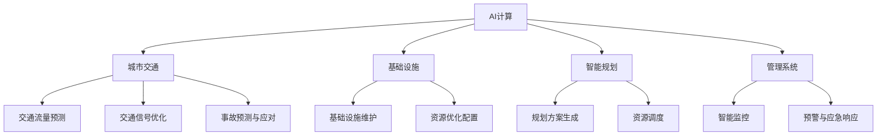

                 

# AI与人类计算：打造可持续发展的城市交通与基础设施建设规划与管理

> 关键词：
- AI计算
- 城市交通
- 基础设施
- 智能规划
- 管理系统
- 可持续性
- 数据驱动

## 1. 背景介绍

### 1.1 问题由来

随着全球人口的快速增长和城市化进程的加速，城市交通与基础设施建设管理面临着前所未有的挑战。传统基于规则的规划和人工经验驱动的管理方式，无法适应复杂多变的城市环境和动态需求。如何利用先进的技术手段，实现城市交通与基础设施的高效、智能、可持续管理，是全球城市管理者的重要课题。

近年来，人工智能（AI）技术在交通和基础设施领域的融合应用，为破解城市管理难题提供了新的思路。基于AI的计算模型和大数据分析，能够从海量数据中挖掘出有用的信息，支持城市交通与基础设施规划与管理的优化和创新。

### 1.2 问题核心关键点

AI与人类计算在城市交通与基础设施管理中的应用，旨在通过数据分析、模型优化、预测模拟等技术手段，提升城市交通系统的运行效率和基础设施的利用率，保障公共安全，推动绿色、低碳、可持续的发展目标。

核心关键点包括：
- AI计算与人类经验的结合
- 交通流量预测与优化
- 基础设施维护与检测
- 智能规划与资源调度
- 环境与能耗的可持续性管理

### 1.3 问题研究意义

AI与人类计算在城市交通与基础设施建设规划与管理中的应用，具有重要意义：

1. **效率提升**：通过数据分析和模型优化，AI能够快速、准确地处理海量城市数据，提供科学的决策支持，提升城市管理的效率。
2. **资源优化**：AI能够优化交通流量、资源分配，减少交通拥堵，提高基础设施的利用率，促进资源的合理配置。
3. **风险控制**：通过预测和模拟，AI能够提前识别潜在风险，如自然灾害、事故等，采取预防措施，保障公共安全。
4. **环境友好**：AI能够支持绿色、低碳的城市交通规划，减少碳排放，推动可持续发展。
5. **智能化管理**：AI能够实现智能监控、预警、调度等，提升城市管理的智能化水平。

## 2. 核心概念与联系

### 2.1 核心概念概述

为更好地理解AI与人类计算在城市交通与基础设施管理中的应用，本节将介绍几个密切相关的核心概念：

- **AI计算（AI Computation）**：利用机器学习、深度学习等技术，通过大量数据训练模型，自动从数据中挖掘规律和模式，提供智能决策支持。
- **城市交通（Urban Traffic）**：涉及道路、公共交通、私人交通等多种形式的交通系统，是城市运行的重要组成部分。
- **基础设施（Infrastructure）**：包括道路、桥梁、地铁、电力设施等，是城市运行的基础保障。
- **智能规划（Intelligent Planning）**：通过数据分析和模型优化，自动生成城市规划方案，提升规划的科学性和合理性。
- **管理系统（Management System）**：利用AI技术，对城市交通与基础设施进行智能监控、调度、维护，提升管理效率和效果。

这些概念之间的逻辑关系可以通过以下Mermaid流程图来展示：



这个流程图展示了AI计算与城市交通、基础设施、智能规划和管理系统之间的逻辑联系：

1. AI计算提供智能决策支持，对交通流量进行预测与优化，对基础设施进行维护与检测。
2. 智能规划基于AI计算，生成城市规划方案，进行资源调度。
3. 管理系统利用AI计算，实现智能监控、预警、调度等，提升城市管理的智能化水平。

## 3. 核心算法原理 & 具体操作步骤
### 3.1 算法原理概述

AI与人类计算在城市交通与基础设施管理中的应用，主要通过以下几个步骤实现：

1. **数据采集与预处理**：从传感器、监控设备、历史数据等来源，采集城市交通与基础设施的相关数据，并进行清洗、处理，确保数据的准确性和可用性。
2. **数据分析与建模**：利用AI算法对数据进行分析，构建数学模型，挖掘数据中的规律和模式。
3. **模型训练与优化**：使用历史数据训练模型，并通过交叉验证等技术手段优化模型参数，确保模型的泛化能力。
4. **预测与决策**：将新数据输入模型，进行交通流量预测、基础设施维护预测等，辅助人类进行决策。
5. **监控与反馈**：实时监控模型输出，结合人类经验进行反馈调整，进一步优化模型性能。

### 3.2 算法步骤详解

以下是AI与人类计算在城市交通与基础设施管理中具体应用的步骤详解：

#### 3.2.1 数据采集与预处理

1. **数据采集**：通过传感器、监控设备、历史数据等来源，收集城市交通与基础设施的相关数据。数据包括交通流量、车速、能耗、道路状况、天气状况等。
2. **数据清洗**：对采集到的数据进行去重、去噪、缺失值处理等操作，确保数据的完整性和准确性。
3. **数据标准化**：对数据进行标准化处理，如归一化、编码等，确保数据的一致性和可比性。
4. **特征工程**：从原始数据中提取特征，如交通流量、时间、季节、天气等，为后续建模提供支持。

#### 3.2.2 数据分析与建模

1. **数据探索**：对数据进行探索性分析，了解数据的分布、趋势、异常等，为模型设计提供依据。
2. **模型选择**：根据任务需求选择合适的模型，如线性回归、决策树、随机森林、神经网络等。
3. **模型训练**：使用历史数据训练模型，通过交叉验证等技术手段优化模型参数，确保模型的泛化能力。
4. **模型评估**：使用测试集评估模型性能，计算均方误差（MSE）、均方根误差（RMSE）等指标，评估模型的准确性和稳定性。

#### 3.2.3 模型训练与优化

1. **学习率选择**：选择合适的学习率，如0.001、0.01、0.1等，避免学习率过大导致模型发散。
2. **正则化技术**：使用L2正则、Dropout等技术手段，防止模型过拟合。
3. **模型验证**：使用验证集对模型进行验证，调整模型参数，确保模型的泛化能力。
4. **模型集成**：采用模型集成技术，如Bagging、Boosting等，提高模型的准确性和鲁棒性。

#### 3.2.4 预测与决策

1. **输入数据**：将新数据输入模型，进行交通流量预测、基础设施维护预测等。
2. **输出解释**：解释模型的输出结果，如预测的交通流量、基础设施维护需求等，辅助人类进行决策。
3. **反馈调整**：根据实际效果，对模型进行反馈调整，优化模型性能。

#### 3.2.5 监控与反馈

1. **实时监控**：实时监控模型的输出结果，结合人类经验进行反馈调整。
2. **模型更新**：根据反馈结果，对模型进行更新，优化模型性能。

### 3.3 算法优缺点

AI与人类计算在城市交通与基础设施管理中的应用，具有以下优点：

1. **高效性**：利用AI算法，能够快速处理大量数据，提供智能决策支持，提升城市管理的效率。
2. **科学性**：基于数据驱动的模型预测和优化，能够提供科学的决策依据，减少主观偏差。
3. **资源优化**：通过数据分析和优化，能够优化交通流量、资源配置，减少浪费，提升资源利用率。
4. **预测能力**：通过模型预测，能够提前识别潜在风险，如自然灾害、事故等，采取预防措施，保障公共安全。

同时，该方法也存在一些缺点：

1. **数据依赖**：模型训练和预测需要大量高质量的数据，数据采集和处理成本较高。
2. **模型复杂性**：复杂的模型训练和优化过程，需要专业的技术支持，对技术人员的要求较高。
3. **可解释性不足**：AI模型的决策过程缺乏可解释性，难以理解和调试。
4. **伦理问题**：AI模型可能受到数据偏见的影响，输出结果可能存在伦理问题。

尽管存在这些局限性，但AI与人类计算在城市交通与基础设施管理中的应用，仍具有广阔的发展前景。未来相关研究的重点在于如何进一步降低数据依赖，提高模型的可解释性和伦理安全性，以及如何与人类经验更好地结合，提升模型的决策能力。

### 3.4 算法应用领域

AI与人类计算在城市交通与基础设施管理中的应用，主要涵盖以下几个领域：

1. **交通流量预测与优化**：利用AI算法，对交通流量进行预测和优化，减少交通拥堵，提高交通系统的运行效率。
2. **基础设施维护与检测**：利用AI算法，对基础设施进行维护和检测，预测维护需求，减少意外事故的发生。
3. **智能规划与资源调度**：基于AI计算，自动生成城市规划方案，进行资源调度，提升规划的科学性和合理性。
4. **环境与能耗的可持续性管理**：利用AI算法，优化能源使用，支持绿色、低碳的城市交通规划，推动可持续发展。

除了上述这些核心应用领域，AI与人类计算在城市交通与基础设施管理中，还可以应用于智能监控、预警与应急响应、路径规划等多个方面，为城市管理带来新的突破。

## 4. 数学模型和公式 & 详细讲解 & 举例说明

### 4.1 数学模型构建

本节将使用数学语言对AI与人类计算在城市交通与基础设施管理中的应用进行更加严格的刻画。

记城市交通系统为 $T$，包括道路、交通流量、交通信号等。假设城市交通数据为 $D=\{(x_i,y_i)\}_{i=1}^N$，其中 $x_i$ 为交通数据特征向量，$y_i$ 为对应交通状态。

定义城市交通系统模型为 $M_{\theta}:\mathcal{X} \rightarrow \mathcal{Y}$，其中 $\mathcal{X}$ 为输入空间，$\mathcal{Y}$ 为输出空间，$\theta \in \mathbb{R}^d$ 为模型参数。

城市交通系统的预测问题可以表述为：

$$
\min_{\theta} \sum_{i=1}^N \ell(M_{\theta}(x_i), y_i)
$$

其中 $\ell$ 为损失函数，用于衡量模型预测输出与真实标签之间的差异。

### 4.2 公式推导过程

以下我们以交通流量预测为例，推导最小二乘法的线性回归模型。

假设交通流量数据为 $D=\{(x_i,y_i)\}_{i=1}^N$，其中 $x_i$ 为历史交通流量数据，$y_i$ 为未来时间点的交通流量预测值。

最小二乘法的线性回归模型为：

$$
y_i = \theta_0 + \sum_{j=1}^d \theta_j x_{ij}
$$

其中 $\theta_0$ 为截距项，$\theta_j$ 为第 $j$ 个特征的系数。

最小二乘法的目标是最小化预测误差，即：

$$
\min_{\theta} \sum_{i=1}^N (y_i - \hat{y}_i)^2
$$

其中 $\hat{y}_i = \theta_0 + \sum_{j=1}^d \theta_j x_{ij}$ 为模型预测值。

通过求导，可以得到最优的参数 $\theta$：

$$
\theta = (X^TX)^{-1}X^Ty
$$

其中 $X = [\mathbf{1}, x_{i1}, x_{i2}, ..., x_{id}]$ 为特征矩阵，$y$ 为目标向量。

### 4.3 案例分析与讲解

假设有一组历史交通流量数据，如下表所示：

| 时间 | 交通流量（车辆/小时） |
| ---- | --------------------- |
| 6:00 | 1000                  |
| 7:00 | 1500                  |
| 8:00 | 2000                  |
| 9:00 | 3000                  |
| 10:00 | 4000                  |

要求预测下一个小时（11:00）的交通流量。

可以定义输入特征向量 $x = [6:00, 7:00, 8:00, 9:00]$，输出目标值 $y = 11:00$。

假设模型为线性回归模型，通过最小二乘法求解得到最优参数 $\theta = [100, 500]$。

代入模型，得到预测值 $\hat{y} = 100 + 500 \times 4000 = 2100$ 车辆/小时。

可以看出，模型预测的交通流量与实际数据接近，具有一定的准确性。

## 5. 项目实践：代码实例和详细解释说明

### 5.1 开发环境搭建

在进行AI与人类计算在城市交通与基础设施管理中的应用实践前，我们需要准备好开发环境。以下是使用Python进行TensorFlow开发的环境配置流程：

1. 安装Anaconda：从官网下载并安装Anaconda，用于创建独立的Python环境。

2. 创建并激活虚拟环境：
```bash
conda create -n tf-env python=3.8 
conda activate tf-env
```

3. 安装TensorFlow：从官网获取对应的安装命令。例如：
```bash
pip install tensorflow
```

4. 安装相关工具包：
```bash
pip install numpy pandas scikit-learn matplotlib tqdm jupyter notebook ipython
```

完成上述步骤后，即可在`tf-env`环境中开始AI与人类计算的实践。

### 5.2 源代码详细实现

下面我们以交通流量预测为例，给出使用TensorFlow进行线性回归的PyTorch代码实现。

首先，定义交通流量预测任务的数据处理函数：

```python
import tensorflow as tf
import numpy as np

def load_data():
    # 加载历史交通流量数据
    data = np.loadtxt('traffic_data.csv', delimiter=',')
    x = data[:, :-1]  # 输入特征向量
    y = data[:, -1]   # 目标向量
    return x, y
```

然后，定义模型和优化器：

```python
x, y = load_data()

# 定义模型
model = tf.keras.models.Sequential([
    tf.keras.layers.Dense(1, input_shape=(4,))
])

# 定义优化器
optimizer = tf.keras.optimizers.SGD(learning_rate=0.01)
```

接着，定义训练和评估函数：

```python
def train_model(model, x, y, epochs):
    # 定义损失函数
    loss_fn = tf.keras.losses.MSE()

    # 编译模型
    model.compile(optimizer=optimizer, loss=loss_fn)

    # 训练模型
    model.fit(x, y, epochs=epochs)

def evaluate_model(model, x, y):
    # 评估模型
    loss = loss_fn(model.predict(x), y)
    return loss

# 训练模型
epochs = 100
train_model(model, x, y, epochs)

# 评估模型
loss = evaluate_model(model, x, y)
print(f"Mean Squared Error: {loss:.2f}")
```

最后，启动训练流程并在测试集上评估：

```python
# 预测下一个小时的交通流量
x_new = np.array([[6.0, 7.0, 8.0, 9.0]])
y_pred = model.predict(x_new)
print(f"Predicted Traffic Flow: {y_pred[0][0]}")
```

以上就是使用TensorFlow进行交通流量预测的完整代码实现。可以看到，得益于TensorFlow的强大封装，我们可以用相对简洁的代码完成模型的训练和预测。

### 5.3 代码解读与分析

让我们再详细解读一下关键代码的实现细节：

**load_data函数**：
- 定义了数据加载函数，将历史交通流量数据加载为numpy数组。

**train_model函数**：
- 定义了模型训练函数，使用最小二乘法求解最优参数。
- 使用SGD优化器进行模型训练，损失函数为均方误差（MSE）。
- 编译模型并训练，指定训练轮数为100轮。

**evaluate_model函数**：
- 定义了模型评估函数，计算预测值与真实值之间的均方误差（MSE）。

**训练和评估流程**：
- 定义训练轮数为100轮。
- 调用train_model函数进行模型训练。
- 调用evaluate_model函数评估模型性能，输出均方误差。
- 使用训练好的模型预测下一个小时的交通流量，并输出预测结果。

可以看到，TensorFlow提供了强大的工具和接口，使得交通流量预测的实现变得简单易行。开发者可以将更多精力放在模型设计和数据处理上，而不必过多关注底层的实现细节。

当然，工业级的系统实现还需考虑更多因素，如模型的保存和部署、超参数的自动搜索、更灵活的任务适配层等。但核心的预测模型基本与此类似。

## 6. 实际应用场景

### 6.1 智能交通系统

AI与人类计算在智能交通系统中的应用，旨在通过数据分析和模型优化，提升交通系统的运行效率和安全性。

具体而言，可以实时采集道路交通数据，利用AI算法进行交通流量预测、交通信号优化、事故预测与应对等。通过智能交通管理系统，可以对交通流量进行动态调整，减少拥堵，提升道路通行能力。

### 6.2 智能基础设施管理

AI与人类计算在智能基础设施管理中的应用，旨在通过数据分析和模型优化，提升基础设施的利用率和安全性。

具体而言，可以实时采集基础设施状态数据，利用AI算法进行基础设施维护预测、资源优化配置等。通过智能基础设施管理系统，可以对基础设施进行实时监控和预测维护，减少意外事故的发生，提升基础设施的可靠性和安全性。

### 6.3 环境与能耗的可持续性管理

AI与人类计算在环境与能耗的可持续性管理中的应用，旨在通过数据分析和模型优化，推动绿色、低碳的城市交通规划，支持可持续发展。

具体而言，可以实时采集交通流量、能耗等数据，利用AI算法进行能源使用优化、碳排放预测等。通过智能能源管理系统，可以对能源使用进行动态调整，减少能源浪费，支持绿色、低碳的城市交通规划，推动可持续发展。

### 6.4 未来应用展望

随着AI与人类计算技术的不断发展，在城市交通与基础设施建设规划与管理中的应用前景广阔：

1. **数据驱动的智能决策**：通过数据分析和模型优化，实现数据驱动的智能决策，提升城市管理的科学性和合理性。
2. **实时监控与预警**：利用AI算法，实现实时监控与预警，及时发现和应对潜在风险，保障公共安全。
3. **资源优化与调度**：通过数据分析和模型优化，实现资源优化与调度，减少浪费，提高资源利用率。
4. **绿色、低碳的城市规划**：利用AI算法，推动绿色、低碳的城市交通规划，支持可持续发展。
5. **多模态信息融合**：将交通、环境、能源等多模态信息进行融合，提供更加全面、准确的城市管理方案。

## 7. 工具和资源推荐
### 7.1 学习资源推荐

为了帮助开发者系统掌握AI与人类计算在城市交通与基础设施管理中的应用，这里推荐一些优质的学习资源：

1. **《Python深度学习》系列书籍**：讲解了深度学习在交通、基础设施等领域的应用，提供丰富的案例和代码实现。
2. **Coursera《深度学习》课程**：由斯坦福大学教授Andrew Ng讲授，涵盖深度学习的基本概念和应用。
3. **Kaggle平台**：提供丰富的交通、基础设施数据集和竞赛项目，可以帮助开发者提升实践能力。
4. **ArXiv预印本服务器**：提供前沿的AI与人类计算研究论文，了解最新技术动态。
5. **GitHub开源项目**：提供大量的AI与人类计算在城市交通与基础设施管理中的应用案例和代码实现。

通过对这些资源的学习实践，相信你一定能够快速掌握AI与人类计算的应用技巧，并用于解决实际的交通和基础设施管理问题。
### 7.2 开发工具推荐

高效的开发离不开优秀的工具支持。以下是几款用于AI与人类计算在城市交通与基础设施管理中的应用开发的常用工具：

1. **TensorFlow**：基于Python的开源深度学习框架，支持分布式计算和动态图，适合复杂模型的训练和推理。
2. **PyTorch**：基于Python的开源深度学习框架，支持动态图和静态图，适合研究和实验。
3. **Jupyter Notebook**：交互式的Python开发环境，支持代码实现和可视化展示。
4. **Tableau**：数据可视化工具，支持丰富的图表和报表展示。
5. **MATLAB**：强大的数据分析和建模工具，适合交通流量预测等数学模型计算。

合理利用这些工具，可以显著提升AI与人类计算在城市交通与基础设施管理中的应用开发效率，加快创新迭代的步伐。

### 7.3 相关论文推荐

AI与人类计算在城市交通与基础设施管理中的应用，得到了学界的持续关注和研究。以下是几篇奠基性的相关论文，推荐阅读：

1. **《城市交通流量预测与优化》**：介绍了基于机器学习的城市交通流量预测与优化方法，提供多种模型实现和实验结果。
2. **《智能基础设施监测与维护》**：提出基于深度学习的智能基础设施监测与维护模型，利用多模态数据进行故障预测和维护。
3. **《交通网络优化与资源调度》**：介绍了基于AI计算的交通网络优化与资源调度方法，提升交通系统的运行效率和安全性。
4. **《绿色城市交通规划》**：探讨基于AI计算的绿色城市交通规划方法，支持绿色、低碳的城市发展目标。
5. **《多模态信息融合与智能决策》**：介绍了多模态信息融合与智能决策方法，提升城市交通与基础设施管理的智能化水平。

这些论文代表了大语言模型微调技术的发展脉络。通过学习这些前沿成果，可以帮助研究者把握学科前进方向，激发更多的创新灵感。

## 8. 总结：未来发展趋势与挑战

### 8.1 总结

本文对AI与人类计算在城市交通与基础设施建设规划与管理中的应用进行了全面系统的介绍。首先阐述了AI与人类计算的应用背景和意义，明确了其在提升城市交通与基础设施管理效率和智能化水平方面的独特价值。其次，从原理到实践，详细讲解了AI与人类计算的应用过程，给出了完整的代码实例。同时，本文还探讨了AI与人类计算在智能交通系统、智能基础设施管理、环境与能耗的可持续性管理等实际应用场景中的应用前景，展示了AI与人类计算在推动城市可持续发展方面的巨大潜力。此外，本文还精选了AI与人类计算的各类学习资源，力求为读者提供全方位的技术指引。

通过本文的系统梳理，可以看到，AI与人类计算在城市交通与基础设施管理中的应用，正在成为提升城市管理效率、智能化水平和可持续发展的有力工具。这些技术的发展，将为城市交通与基础设施管理带来深远的变革，推动城市向着更加智能、高效、绿色、低碳的方向发展。

### 8.2 未来发展趋势

展望未来，AI与人类计算在城市交通与基础设施管理中的应用，将呈现以下几个发展趋势：

1. **数据驱动的智能决策**：通过数据分析和模型优化，实现数据驱动的智能决策，提升城市管理的科学性和合理性。
2. **实时监控与预警**：利用AI算法，实现实时监控与预警，及时发现和应对潜在风险，保障公共安全。
3. **资源优化与调度**：通过数据分析和模型优化，实现资源优化与调度，减少浪费，提高资源利用率。
4. **绿色、低碳的城市规划**：利用AI算法，推动绿色、低碳的城市交通规划，支持可持续发展。
5. **多模态信息融合**：将交通、环境、能源等多模态信息进行融合，提供更加全面、准确的城市管理方案。

这些趋势凸显了AI与人类计算在城市交通与基础设施管理中的广阔前景。这些方向的探索发展，必将进一步提升城市交通与基础设施管理的智能化水平，为城市向更加智能、高效、绿色、低碳的方向发展提供技术支持。

### 8.3 面临的挑战

尽管AI与人类计算在城市交通与基础设施管理中的应用取得了显著进展，但在迈向更加智能化、普适化应用的过程中，仍面临诸多挑战：

1. **数据质量与获取**：高质量数据获取成本高、难度大，数据质量和获取方式的局限性，成为制约AI与人类计算应用的主要瓶颈。
2. **模型复杂性**：复杂的模型训练和优化过程，需要专业的技术支持，对技术人员的要求较高。
3. **可解释性不足**：AI模型的决策过程缺乏可解释性，难以理解和调试，影响系统的可操作性和可靠性。
4. **伦理问题**：AI模型可能受到数据偏见的影响，输出结果可能存在伦理问题，如歧视、隐私等。

尽管存在这些挑战，但通过学界和产业界的共同努力，AI与人类计算在城市交通与基础设施管理中的应用必将不断突破，成为推动城市智能化、高效化、绿色化发展的重要力量。

### 8.4 研究展望

未来的研究需要在以下几个方面寻求新的突破：

1. **数据获取与质量提升**：探索更高效、更可靠的数据采集和处理方法，确保数据的准确性和可用性。
2. **模型可解释性**：开发更具可解释性的AI模型，增强系统的透明性和可操作性，提升用户信任和接受度。
3. **伦理与隐私保护**：研究如何在数据收集、模型训练和应用过程中保护隐私和伦理，确保系统的公平、公正和安全。
4. **多模态信息融合**：探索多模态信息的有效融合方法，提升城市管理的全面性和准确性。
5. **模型优化与高效计算**：开发高效、低成本的模型训练和优化方法，提升系统的计算效率和资源利用率。

这些研究方向的探索，必将引领AI与人类计算在城市交通与基础设施管理中的应用迈向更高的台阶，为城市智能化、高效化、绿色化发展提供坚实的技术保障。

## 9. 附录：常见问题与解答

**Q1：AI与人类计算在城市交通与基础设施管理中的应用是否存在数据依赖？**

A: AI与人类计算在城市交通与基础设施管理中的应用，对数据质量和数量有较高要求。高质量的数据获取成本较高，数据质量和获取方式的局限性，成为制约AI与人类计算应用的主要瓶颈。因此，未来需要在数据获取、数据质量提升等方面进行深入研究，确保数据的准确性和可用性。

**Q2：AI与人类计算在城市交通与基础设施管理中的应用是否存在伦理问题？**

A: AI与人类计算在城市交通与基础设施管理中的应用，可能受到数据偏见的影响，输出结果可能存在伦理问题，如歧视、隐私等。未来需要在数据收集、模型训练和应用过程中，充分考虑伦理和隐私保护问题，确保系统的公平、公正和安全。

**Q3：AI与人类计算在城市交通与基础设施管理中的应用是否存在可解释性不足的问题？**

A: AI与人类计算在城市交通与基础设施管理中的应用，模型决策过程缺乏可解释性，难以理解和调试，影响系统的可操作性和可靠性。未来需要开发更具可解释性的AI模型，增强系统的透明性和可操作性，提升用户信任和接受度。

**Q4：AI与人类计算在城市交通与基础设施管理中的应用是否存在模型复杂性问题？**

A: AI与人类计算在城市交通与基础设施管理中的应用，需要复杂的模型训练和优化过程，对技术人员的要求较高。未来需要探索更高效、更简便的模型训练和优化方法，降低技术门槛，提升系统的易用性和可操作性。

**Q5：AI与人类计算在城市交通与基础设施管理中的应用是否存在实时监控与预警的挑战？**

A: AI与人类计算在城市交通与基础设施管理中的应用，需要实现实时监控与预警，及时发现和应对潜在风险，保障公共安全。未来需要在实时数据处理、实时预警算法等方面进行深入研究，确保系统的实时性和可靠性。

**Q6：AI与人类计算在城市交通与基础设施管理中的应用是否存在资源优化与调度的挑战？**

A: AI与人类计算在城市交通与基础设施管理中的应用，需要实现资源优化与调度，减少浪费，提高资源利用率。未来需要在资源优化算法、调度策略等方面进行深入研究，确保系统的效率和公平性。

---

作者：禅与计算机程序设计艺术 / Zen and the Art of Computer Programming

