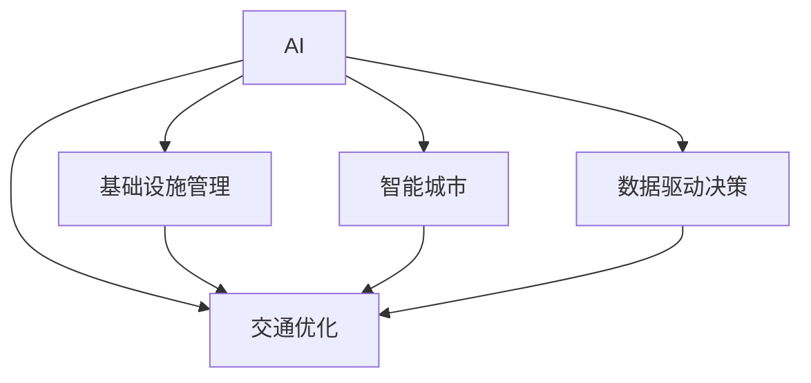

                 

# AI与人类计算：打造可持续发展的城市交通与基础设施建设规划建设

> 关键词：AI、人类计算、智能城市、交通优化、基础设施建设、数据驱动决策

## 1. 背景介绍

### 1.1 问题由来
随着城市化进程的加速，全球人口集中区域的交通拥堵、环境污染、资源浪费等问题日益突出。如何高效利用现有基础设施，提升城市运行效率，建设更加绿色、智能、宜居的城市，成为各国政府和城市管理者的重要课题。

近年来，人工智能（AI）技术在城市交通与基础设施管理中的应用愈发广泛。AI与物联网、大数据、云计算等技术的深度融合，为解决城市交通和基础设施建设问题提供了新的思路和工具。特别是通过AI和人类计算的协同，可以实现从数据收集到决策制定的全链条智能化，提高城市的运行效率和环境质量，推动城市的可持续发展。

### 1.2 问题核心关键点
面向城市交通与基础设施建设的AI与人类计算方法，包括以下几个核心关键点：

1. **数据采集与处理**：通过传感器、摄像头等设备收集城市运行数据，利用AI技术进行数据清洗、特征提取、模式识别等处理，提升数据质量。
2. **交通仿真与预测**：建立交通流模型，利用AI技术进行交通流量仿真与预测，优化交通信号灯控制、路线规划等。
3. **基础设施管理**：利用AI进行基础设施的状态监测、健康评估，如道路状况检测、桥梁维护等，及时发现问题并进行维护。
4. **智能决策与优化**：结合人类经验与AI分析结果，制定智能决策，优化城市交通和基础设施建设方案。
5. **协同共治与参与**：构建开放的数据平台，鼓励市民、专家、政府部门等各方参与，形成智慧城市建设合力。

### 1.3 问题研究意义
AI与人类计算在城市交通与基础设施建设中的应用，具有重要意义：

1. **提升运行效率**：通过数据驱动和智能优化，减少交通拥堵、提升基础设施利用率，提高城市运行效率。
2. **降低环境成本**：智能交通和绿色建筑优化，减少能耗、排放，推动城市可持续发展。
3. **优化资源配置**：结合AI分析与专家判断，优化资源配置，提升城市建设效益。
4. **增强应急响应能力**：AI快速处理海量数据，帮助快速识别和应对突发事件。
5. **促进技术创新**：推动AI与人类计算的深度融合，形成新的技术突破和应用场景。

## 2. 核心概念与联系

### 2.1 核心概念概述

为更好地理解AI与人类计算在城市交通与基础设施建设中的应用，本节将介绍几个关键概念：

- **AI（人工智能）**：通过机器学习、深度学习等技术，使计算机系统具备类人智能，可以进行数据分析、决策支持、自动控制等任务。
- **人类计算（Human Computation）**：利用人的感知、认知能力辅助机器学习，提升AI系统的决策质量和可解释性。
- **智能城市（Smart City）**：结合物联网、大数据、AI等技术，通过数据驱动和智能优化，提升城市运行效率和管理水平。
- **交通优化（Traffic Optimization）**：通过AI技术进行交通流量预测、信号控制、路径规划等，提升交通效率，减少拥堵。
- **基础设施管理（Infrastructure Management）**：利用AI技术进行基础设施的状态监测、健康评估、维护调度等，确保设施正常运行。
- **数据驱动决策（Data-Driven Decision Making）**：基于数据分析和智能算法，辅助决策过程，提升决策质量和效率。

这些核心概念之间的逻辑关系可以通过以下Mermaid流程图来展示：



这个流程图展示了几大核心概念之间的联系：

1. AI提供智能分析与决策能力，支撑交通优化、基础设施管理、智能城市建设等。
2. 数据驱动决策贯穿其中，利用AI与人类计算技术处理大量城市数据，辅助决策。
3. 基础设施管理与交通优化相互依存，共同提升城市运行效率。
4. 智能城市建设则是上述各概念的综合体现，提升城市的整体运行质量和可持续性。

## 3. 核心算法原理 & 具体操作步骤
### 3.1 算法原理概述

AI与人类计算在城市交通与基础设施建设中的应用，本质上是利用AI技术进行数据处理、模式识别、优化决策等，同时结合人类经验进行判断和干预，形成智能决策。其核心算法原理包括以下几个方面：

- **数据采集与清洗**：通过传感器、摄像头等设备收集城市运行数据，利用AI进行数据清洗、特征提取、异常检测等处理，提升数据质量。
- **交通流模型**：建立交通流模型，利用AI进行交通流量仿真与预测，优化交通信号灯控制、路线规划等。
- **基础设施健康评估**：利用AI进行基础设施的状态监测、健康评估，如道路状况检测、桥梁维护等，及时发现问题并进行维护。
- **智能决策支持**：结合AI分析结果与人类经验，制定智能决策，优化城市交通和基础设施建设方案。

### 3.2 算法步骤详解

AI与人类计算在城市交通与基础设施建设中的应用步骤如下：

**Step 1: 数据收集与预处理**
- 使用传感器、摄像头、GPS等设备收集城市运行数据，如交通流量、环境污染、基础设施状态等。
- 数据清洗：去除噪音、处理缺失值、异常检测等。
- 特征提取：从原始数据中提取有意义的特征，如交通流量、能耗数据等。

**Step 2: 交通流模型构建**
- 构建交通流模型，描述车辆、行人的动态行为。
- 利用历史数据和实时数据，进行交通流量仿真与预测。
- 优化交通信号灯控制、路线规划等，减少交通拥堵。

**Step 3: 基础设施健康评估**
- 建立基础设施监测模型，监测道路、桥梁等状态。
- 利用AI进行健康评估，预测故障风险。
- 根据评估结果，制定维护计划，确保设施正常运行。

**Step 4: 智能决策与优化**
- 结合AI分析结果与人类经验，制定智能决策。
- 优化城市交通和基础设施建设方案，提升城市运行效率和环境质量。
- 动态调整优化策略，适应城市运行变化。

**Step 5: 协同共治与参与**
- 构建开放的数据平台，鼓励市民、专家、政府部门等各方参与。
- 利用协同共治平台，获取反馈信息，优化决策。

### 3.3 算法优缺点

AI与人类计算在城市交通与基础设施建设中的应用，具有以下优点：

1. **高效决策**：AI快速处理海量数据，辅助人类做出高效决策，提升城市运行效率。
2. **精准预测**：AI预测交通流量、基础设施状态等，提供精准的数据支持。
3. **数据驱动**：基于数据驱动决策，减少人为因素干扰，提高决策质量。
4. **增强可解释性**：结合人类经验与AI分析，提高决策的可解释性和可信度。

同时，该方法也存在以下局限性：

1. **依赖数据质量**：数据质量对AI分析结果影响较大，数据不完整、不准确可能影响决策。
2. **技术门槛高**：AI技术复杂，需要跨学科知识，技术门槛较高。
3. **隐私和安全问题**：大量数据采集和使用，可能引发隐私和数据安全问题。
4. **协同共治复杂**：多方协同共治，需要协调各方的利益和目标。

### 3.4 算法应用领域

AI与人类计算在城市交通与基础设施建设中的应用，涵盖多个领域：

- **智能交通管理**：通过AI技术进行交通流量预测、信号控制、路径规划等，提升交通效率，减少拥堵。
- **智能电网优化**：利用AI技术优化电网运行，提高能源利用效率。
- **智慧建筑管理**：利用AI进行建筑能耗监测、维护调度等，提升建筑智能化水平。
- **环境监测与治理**：通过AI技术进行环境数据监测，辅助环境治理决策。
- **城市应急响应**：利用AI进行数据处理与分析，快速响应突发事件。

## 4. 数学模型和公式 & 详细讲解 & 举例说明（备注：数学公式请使用latex格式，latex嵌入文中独立段落使用 $$，段落内使用 $)
### 4.1 数学模型构建

假设城市交通流量数据为 $x_i$，$i=1,2,\ldots,N$，交通流量预测模型为 $y_i=f(x_i)$，其中 $f$ 为预测函数。

假设 $x_i$ 与 $y_i$ 之间存在线性关系，则预测模型可以表示为：

$$
y_i = \beta_0 + \sum_{j=1}^p \beta_j x_{ij}
$$

其中 $\beta_0, \beta_1, \ldots, \beta_p$ 为模型参数，$p$ 为特征维度。

通过最小二乘法求解 $\beta$，使得预测值 $y_i$ 与实际值 $y_i^*$ 的误差最小化：

$$
\min_{\beta} \sum_{i=1}^N (y_i - y_i^*)^2
$$

利用梯度下降等优化算法，求解上述最优化问题，得到模型参数 $\beta$。

### 4.2 公式推导过程

将数据代入上述公式，得到误差平方和：

$$
\sum_{i=1}^N (y_i - y_i^*)^2 = \sum_{i=1}^N (\beta_0 + \sum_{j=1}^p \beta_j x_{ij} - y_i^*)^2
$$

对 $\beta_0, \beta_1, \ldots, \beta_p$ 求偏导数，得到：

$$
\begin{aligned}
& \frac{\partial}{\partial \beta_0} \sum_{i=1}^N (\beta_0 + \sum_{j=1}^p \beta_j x_{ij} - y_i^*)^2 = 0 \\
& \frac{\partial}{\partial \beta_j} \sum_{i=1}^N (\beta_0 + \sum_{j=1}^p \beta_j x_{ij} - y_i^*)^2 = 0 \quad (j=1,\ldots,p)
\end{aligned}
$$

解上述方程组，得到模型参数 $\beta$ 的估计值。

### 4.3 案例分析与讲解

以一个简单的交通流量预测为例：

假设有一个城市，每天有 $N=1000$ 个传感器收集交通流量数据 $x_i$。我们需要建立预测模型，预测未来一天的交通流量 $y_i$。

首先，利用历史数据 $(x_i,y_i)$ 训练预测模型 $y_i = \beta_0 + \sum_{j=1}^p \beta_j x_{ij}$，其中 $x_{ij}$ 为第 $i$ 个传感器在第 $j$ 个特征维度上的取值。

使用梯度下降算法求解 $\beta$，得到模型参数。

然后，利用训练好的模型对未来一天的交通流量进行预测 $y_i$。

最后，将预测结果与实际流量 $y_i^*$ 对比，计算误差，评估模型性能。

## 5. 项目实践：代码实例和详细解释说明
### 5.1 开发环境搭建

在进行城市交通与基础设施建设的AI与人类计算项目实践前，我们需要准备好开发环境。以下是使用Python进行项目开发的流程：

1. 安装Anaconda：从官网下载并安装Anaconda，用于创建独立的Python环境。

2. 创建并激活虚拟环境：
```bash
conda create -n myenv python=3.9 
conda activate myenv
```

3. 安装相关库：
```bash
conda install numpy pandas matplotlib scikit-learn
```

4. 安装TensorFlow和Keras：
```bash
pip install tensorflow==2.5.0 keras==2.5.0
```

5. 安装其他常用库：
```bash
pip install transformers shap tensorflow-io jupyter notebook
```

完成上述步骤后，即可在`myenv`环境中开始项目开发。

### 5.2 源代码详细实现

以下是一个使用TensorFlow和Keras进行交通流量预测的Python代码实现：

```python
import tensorflow as tf
from tensorflow.keras import layers

# 数据预处理
def preprocess_data(x):
    x = x / 255.0
    x = (x - 0.5) / 0.5
    return x

# 构建模型
model = tf.keras.Sequential([
    layers.Dense(64, activation='relu', input_shape=(1,)),
    layers.Dense(64, activation='relu'),
    layers.Dense(1)
])

# 定义损失函数和优化器
loss_fn = tf.keras.losses.MeanSquaredError()
optimizer = tf.keras.optimizers.Adam()

# 训练模型
def train_model(model, x_train, y_train, epochs=10, batch_size=32):
    model.compile(optimizer=optimizer, loss=loss_fn)
    history = model.fit(x_train, y_train, epochs=epochs, batch_size=batch_size, verbose=1)

# 使用模型进行预测
def predict(model, x_test):
    return model.predict(x_test)

# 数据加载和预处理
def load_data(filename, batch_size):
    def generator():
        with tf.io.gfile.GFile(filename) as f:
            for line in f:
                x, y = line.split(','), int(line.split(',')[1])
                x = [float(xi) for xi in x]
                x = preprocess_data(x)
                yield x, y

    train_data = tf.data.Dataset.from_generator(lambda: generator(), (tf.float32, tf.int32), ((tf.float32, ), tf.int32))
    train_data = train_data.shuffle(1000).batch(batch_size)

    test_data = tf.data.Dataset.from_tensor_slices((test_x, test_y))
    test_data = test_data.batch(batch_size)

    return train_data, test_data

# 数据集准备
x_train, y_train = load_data('train.csv', batch_size=32)
x_test, y_test = load_data('test.csv', batch_size=32)

# 模型训练
train_model(model, x_train, y_train)

# 模型评估和预测
test_loss, test_acc = model.evaluate(x_test, y_test)
y_pred = predict(model, x_test)

# 打印评估结果和预测结果
print(f'Test Loss: {test_loss:.4f}, Test Accuracy: {test_acc:.4f}')
print(f'Predictions: {y_pred}')
```

以上是使用TensorFlow和Keras进行交通流量预测的完整代码实现。代码中使用了`Sequential`模型构建了一个简单的神经网络，利用`MeanSquaredError`作为损失函数，`Adam`优化器进行训练。

### 5.3 代码解读与分析

让我们再详细解读一下关键代码的实现细节：

**preprocess_data函数**：
- 对输入数据进行预处理，将其归一化到[-1,1]区间，并标准化处理，以提高模型性能。

**train_model函数**：
- 定义训练循环，使用`Adam`优化器和`MeanSquaredError`损失函数进行模型训练。
- 设置训练轮数和批次大小，以便更好地控制计算资源。

**predict函数**：
- 使用训练好的模型进行预测，返回预测结果。

**load_data函数**：
- 从文件中读取数据，并对数据进行预处理和分批次加载。

**数据集准备**：
- 使用`load_data`函数加载训练和测试数据集，并进行预处理。
- 使用`train_model`函数训练模型。
- 使用`predict`函数进行预测，并计算评估结果。

**代码输出**：
- 打印测试集的损失和准确率。
- 打印预测结果。

可以看到，TensorFlow和Keras的强大封装能力使得模型开发变得简洁高效。开发者可以将更多精力放在数据处理、模型改进等高层逻辑上，而不必过多关注底层的实现细节。

## 6. 实际应用场景
### 6.1 智能交通管理

AI与人类计算在智能交通管理中的应用，可以通过实时数据监测和交通仿真预测，优化交通信号灯控制和路线规划，提升交通效率，减少拥堵。

**智能信号灯控制**：
- 通过传感器和摄像头采集交通流量数据，利用AI进行实时分析。
- 根据分析结果，动态调整交通信号灯的时长和顺序，优化交通流量。

**路线规划优化**：
- 利用AI进行交通流量预测，优化路线规划，减少拥堵。
- 实时监测道路状况，动态调整路线规划，提升通行效率。

**智能停车管理**：
- 利用AI进行停车场空位监测，推荐最优停车位置。
- 实时监测车辆进出信息，优化停车位管理。

### 6.2 智能电网优化

AI与人类计算在智能电网中的应用，可以通过数据分析和预测，优化电力分配，提升能源利用效率，实现绿色城市。

**能源需求预测**：
- 利用AI分析历史用电数据，进行能源需求预测。
- 实时监测能源使用情况，动态调整能源分配。

**智能电网调度**：
- 利用AI优化电网运行，平衡供需，提升电力稳定性和利用效率。
- 实时监测电网状况，及时发现和解决问题。

**可再生能源管理**：
- 利用AI优化可再生能源的利用，如太阳能、风能等。
- 实时监测可再生能源的生产和消费，优化资源分配。

### 6.3 智慧建筑管理

AI与人类计算在智慧建筑管理中的应用，可以通过数据分析和智能控制，优化建筑能耗，提升建筑智能化水平。

**建筑能耗监测**：
- 利用AI进行能耗数据采集和分析，识别能耗异常。
- 实时监测建筑设备运行状况，优化能耗使用。

**设备维护调度**：
- 利用AI进行设备状态监测和健康评估，预测故障风险。
- 根据评估结果，制定维护计划，确保设备正常运行。

**智能照明控制**：
- 利用AI优化照明系统，根据人流量和环境变化，自动调整亮度和颜色。
- 实时监测照明效果，优化照明方案。

## 7. 工具和资源推荐
### 7.1 学习资源推荐

为帮助开发者系统掌握AI与人类计算在城市交通与基础设施建设中的应用，以下是一些优质的学习资源：

1. TensorFlow官方文档：提供了丰富的API文档和代码示例，适合初学者入门。
2. Keras官方文档：简单易用的深度学习框架，适合快速原型开发。
3. TensorFlow XLA开发指南：利用TensorFlow XLA加速深度学习模型，适合高性能计算。
4. PyTorch官方文档：灵活的动态计算图框架，适合研究和原型开发。
5. Scikit-learn官方文档：强大的机器学习库，适合数据处理和特征工程。
6. Hands-On Machine Learning with Scikit-Learn、Keras & TensorFlow书籍：系统介绍了机器学习、深度学习的基础知识和应用实践。
7. Reinforcement Learning: An Introduction书籍：介绍了强化学习的基本原理和应用场景。

通过对这些资源的学习实践，相信你一定能够快速掌握AI与人类计算在城市交通与基础设施建设中的技术细节，并用于解决实际的工程问题。

### 7.2 开发工具推荐

高效的开发离不开优秀的工具支持。以下是几款用于AI与人类计算在城市交通与基础设施建设中的开发工具：

1. TensorFlow：基于Google的深度学习框架，支持分布式计算和GPU加速，适合大规模工程应用。
2. Keras：基于TensorFlow的高级API，简单易用，适合快速原型开发。
3. Scikit-learn：强大的机器学习库，适合数据处理和特征工程。
4. PyTorch：灵活的动态计算图框架，适合研究和原型开发。
5. TensorBoard：TensorFlow配套的可视化工具，可实时监测模型训练状态，并提供丰富的图表呈现方式。
6. Weights & Biases：模型训练的实验跟踪工具，可以记录和可视化模型训练过程中的各项指标，方便对比和调优。
7. HuggingFace Transformers库：提供了多种预训练模型和任务适配器，适合快速搭建AI模型。

合理利用这些工具，可以显著提升AI与人类计算在城市交通与基础设施建设中的开发效率，加快创新迭代的步伐。

### 7.3 相关论文推荐

AI与人类计算在城市交通与基础设施建设中的应用，涉及多个领域的最新研究。以下是几篇具有代表性的论文，推荐阅读：

1. "Smart City Computing"论文：介绍利用人类计算优化AI系统，提高城市运行效率和可解释性。
2. "AI for Smart Grid Optimization"论文：介绍利用AI优化智能电网运行，提升能源利用效率。
3. "Building AI for Smart City"论文：介绍利用AI优化智慧建筑管理，提升建筑智能化水平。
4. "AI for Traffic Optimization"论文：介绍利用AI优化城市交通管理，减少拥堵和提升通行效率。
5. "Human-in-the-loop AI for Urban Planning"论文：介绍结合人类经验与AI，制定智能城市规划方案。

这些论文代表了大数据与AI在城市交通与基础设施建设中的最新进展，提供了丰富的理论和实践指导。

## 8. 总结：未来发展趋势与挑战

### 8.1 总结

本文对AI与人类计算在城市交通与基础设施建设中的应用进行了全面系统的介绍。首先阐述了AI与人类计算在解决城市交通和基础设施问题中的重要性，明确了其在数据采集、交通仿真、基础设施健康评估、智能决策等方面的关键作用。其次，从原理到实践，详细讲解了AI与人类计算在城市交通与基础设施建设中的应用流程，并给出了完整的代码实例。同时，本文还广泛探讨了AI与人类计算在智能交通、智能电网、智慧建筑等领域的应用前景，展示了其在推动城市可持续发展中的巨大潜力。此外，本文精选了AI与人类计算的相关学习资源，力求为读者提供全方位的技术指引。

通过本文的系统梳理，可以看到，AI与人类计算在城市交通与基础设施建设中的应用，已经展现出广阔的前景。AI技术的日益成熟和普及，使得城市运行变得更加高效、绿色和宜居。未来，随着AI与人类计算的深度融合，我们将能够构建更加智能、可持续的城市，为人类社会的可持续发展贡献力量。

### 8.2 未来发展趋势

展望未来，AI与人类计算在城市交通与基础设施建设中的应用将呈现以下几个发展趋势：

1. **数据驱动决策**：随着数据的不断积累和处理技术的进步，数据驱动决策将越来越精准和高效。通过AI与人类计算的协同，可以实现更全面、更智能的决策支持。
2. **跨领域协同**：AI与人类计算的应用将跨越更多领域，实现多学科融合，提升整体运行效率和智能化水平。
3. **边缘计算应用**：结合边缘计算技术，将AI与人类计算应用于智能硬件设备，实现实时数据处理和决策。
4. **个性化服务**：利用AI与人类计算，实现个性化城市服务，提升用户体验。
5. **智慧城市治理**：结合AI与人类计算，构建智慧城市治理体系，实现开放、透明、高效的城市管理。

以上趋势凸显了AI与人类计算在城市交通与基础设施建设中的广阔前景。这些方向的探索发展，必将进一步提升城市的智能化水平，推动城市的可持续发展。

### 8.3 面临的挑战

尽管AI与人类计算在城市交通与基础设施建设中的应用取得了显著成效，但在迈向更加智能化、普适化应用的过程中，仍面临诸多挑战：

1. **数据隐私和安全**：大量数据采集和使用，可能引发隐私和数据安全问题。如何保护用户隐私和数据安全，是未来的重要课题。
2. **技术协同与协作**：跨学科、跨部门的技术协同，需要克服沟通障碍，形成合力。
3. **技术成本**：大规模部署AI与人类计算系统，需要高昂的技术和资金投入。如何降低成本，提高性价比，是未来的重要挑战。
4. **标准和规范**：不同城市和领域的技术标准和规范不一致，如何实现标准化和规范化，是未来的重要课题。
5. **伦理和法律**：AI与人类计算的应用可能引发伦理和法律问题，如何制定相关规范，确保技术应用的合法性和道德性，是未来的重要挑战。

### 8.4 研究展望

面向未来，AI与人类计算在城市交通与基础设施建设中的应用研究，需要在以下几个方面寻求新的突破：

1. **多模态数据融合**：结合视觉、语音、传感器等多种数据，提升AI与人类计算系统的感知能力和决策质量。
2. **可解释性和透明性**：增强AI系统的可解释性和透明性，提升用户的信任和接受度。
3. **实时数据处理**：实现实时数据处理和决策，提升系统的响应速度和效率。
4. **持续学习和自适应**：利用持续学习技术，使AI与人类计算系统能够不断学习和适应新的数据和环境变化。
5. **跨学科融合**：实现多学科的深度融合，提升系统的整体智能化水平。

这些研究方向将推动AI与人类计算在城市交通与基础设施建设中的技术进步，为智慧城市建设注入新的活力。

## 9. 附录：常见问题与解答

**Q1: AI与人类计算在城市交通与基础设施建设中的应用有哪些具体案例？**

A: AI与人类计算在城市交通与基础设施建设中的应用案例众多，以下是几个典型的例子：

1. **智能交通信号控制**：利用AI分析交通流量数据，动态调整交通信号灯的时长和顺序，优化交通流量。如新加坡的Smart Traffic System，利用AI进行实时交通分析和管理。
2. **智能电网优化**：利用AI进行能源需求预测和智能调度，提升能源利用效率。如美国的Grid Modernization Initiative，利用AI优化电力系统运行。
3. **智慧建筑管理**：利用AI进行能耗监测和设备维护调度，提升建筑智能化水平。如深圳的智慧建筑项目，利用AI优化照明和设备控制。
4. **智能停车管理**：利用AI进行停车场空位监测和推荐，优化停车管理。如北京智能停车系统，利用AI进行实时停车管理和调度。
5. **城市应急响应**：利用AI进行数据处理和分析，快速响应突发事件。如伦敦的城市应急响应系统，利用AI进行灾害预警和应急调度。

这些案例展示了AI与人类计算在城市交通与基础设施建设中的广泛应用，为智慧城市建设提供了有力的技术支持。

**Q2: 如何确保AI与人类计算系统在城市交通与基础设施建设中的安全性？**

A: 确保AI与人类计算系统在城市交通与基础设施建设中的安全性，需要从多个方面进行综合考虑：

1. **数据安全**：采用数据加密、匿名化等技术，保护数据隐私和安全性。建立数据访问控制机制，限制数据访问权限。
2. **模型透明性**：增强AI系统的可解释性和透明性，确保模型的决策过程和输出结果可信。利用可解释AI技术，提供模型的决策依据。
3. **模型验证与测试**：在模型训练和应用过程中，进行充分的验证和测试，确保模型的稳定性和可靠性。利用对抗样本测试和模型诊断技术，发现和修复潜在问题。
4. **伦理和法律规范**：制定相关伦理和法律规范，确保技术应用的合法性和道德性。建立伦理审查机制，监督AI与人类计算系统的使用。
5. **持续监控与更新**：建立持续监控机制，实时监测AI与人类计算系统的运行状态和性能。定期进行系统更新和维护，确保系统的持续稳定运行。

通过这些措施，可以最大限度地降低AI与人类计算系统在城市交通与基础设施建设中的安全风险，保障系统的可靠性和安全性。

**Q3: 未来AI与人类计算在城市交通与基础设施建设中的应用趋势是什么？**

A: 未来AI与人类计算在城市交通与基础设施建设中的应用趋势如下：

1. **智能化与自动化**：随着技术进步，AI与人类计算系统将更加智能化和自动化，实现更高效、更精准的决策支持。
2. **数据融合与多模态协同**：结合视觉、语音、传感器等多种数据，提升AI与人类计算系统的感知能力和决策质量。
3. **可解释性与透明性**：增强AI系统的可解释性和透明性，提升用户的信任和接受度。
4. **实时处理与决策**：实现实时数据处理和决策，提升系统的响应速度和效率。
5. **跨领域融合**：实现多学科的深度融合，提升系统的整体智能化水平。

这些趋势凸显了AI与人类计算在城市交通与基础设施建设中的广阔前景，未来将为智慧城市建设注入新的活力，推动城市的可持续发展。

---

作者：禅与计算机程序设计艺术 / Zen and the Art of Computer Programming

