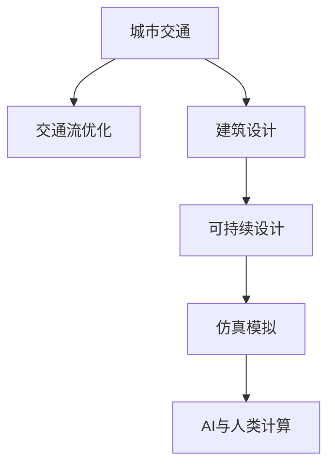

                 

# AI与人类计算：打造可持续发展的城市交通与设计

> 关键词：城市交通,设计计算,可持续发展,人工智能,交通流优化,建筑设计,仿真模拟

## 1. 背景介绍

### 1.1 问题由来

现代城市的迅速发展和人口增长对交通系统提出了严峻的挑战。交通拥堵、环境污染、能源浪费等问题日益突出，严重制约了城市的可持续发展和居民生活质量。为此，各国政府和科研机构积极探索利用人工智能和计算技术，提升城市交通系统的智能化和自动化水平，优化交通设计和运营，推动绿色交通的发展。

与此同时，建筑设计领域也面临着可持续发展的需求。如何在满足功能性和审美性的同时，实现节能减排和环境友好，已成为建筑设计的重要课题。利用AI和计算技术，可以优化建筑设计流程，减少资源浪费，提高设计和施工的效率和质量。

因此，本文旨在探讨如何利用AI与人类计算的结合，打造可持续发展的城市交通与设计，提出基于AI的交通流优化和建筑设计方案。

### 1.2 问题核心关键点

1. 交通流优化：通过AI技术，实时分析城市交通流量，预测拥堵区域和瓶颈，优化交通信号灯控制策略，提升道路利用效率，减少交通拥堵。

2. 建筑设计计算：利用AI进行建筑设计的多目标优化，减少资源消耗，提高建筑的能效和环境友好性，并保证结构安全。

3. 仿真模拟：构建交通和建筑设计的仿真模型，通过虚拟实验评估设计方案的效果，避免实际施工中的资源浪费。

4. 数据驱动：以海量交通和建筑数据为基础，进行分析和预测，优化决策过程。

5. 可持续性：优化设计方案和交通运营策略，提升能源利用效率，降低碳排放，实现绿色交通和建筑设计。

## 2. 核心概念与联系

### 2.1 核心概念概述

为更好地理解AI与人类计算在城市交通与设计中的应用，本节将介绍几个核心概念：

- **城市交通**：城市交通系统包括道路、公共交通、非机动车和行人系统等，其目的是实现人员和货物的快速、安全、高效的移动。

- **交通流优化**：通过数据分析、模型模拟和智能控制，优化交通流量分布，减少拥堵和事故，提升道路使用效率。

- **建筑设计**：建筑设计过程涉及功能规划、空间布局、结构设计等多个方面，需综合考虑建筑的美学、功能性和环境友好性。

- **可持续设计**：在设计过程中，考虑环境影响和资源利用，优化材料选择和施工工艺，减少能源消耗和碳排放。

- **AI与人类计算**：将人工智能技术结合人类专家的经验和知识，通过计算手段优化决策和设计过程，提升效率和效果。

- **仿真模拟**：通过建立虚拟模型，模拟城市交通和建筑设计的运行情况，评估不同方案的效果，为实际应用提供科学依据。

这些核心概念之间的逻辑关系可以通过以下Mermaid流程图来展示：



这个流程图展示了各个概念之间的关联和转化过程：

1. 城市交通系统是交通流优化和建筑设计的基础。
2. 交通流优化通过数据分析和智能控制，提升道路利用效率。
3. 建筑设计结合可持续设计，优化材料和施工工艺。
4. 仿真模拟通过虚拟实验验证设计方案，为实际应用提供依据。
5. AI与人类计算融合两者的优势，提升设计和运营决策的效率和效果。

## 3. 核心算法原理 & 具体操作步骤

### 3.1 算法原理概述

基于AI的交通流优化和建筑设计方案，其核心原理是利用数据驱动和智能控制，结合人类的设计经验和知识，通过计算手段优化决策过程。

### 3.2 算法步骤详解

1. **数据采集与处理**：收集城市交通和建筑设计的相关数据，包括车辆流量、公共交通运行数据、建筑设计图纸等，并进行清洗和预处理，确保数据的准确性和可用性。

2. **模型建立与训练**：
   - **交通流优化模型**：建立基于交通流的预测和优化模型，通过机器学习算法（如深度学习、强化学习等）对交通流量进行分析和预测，优化信号灯控制策略，减少拥堵和事故。
   - **建筑设计模型**：建立基于多目标优化的建筑设计模型，通过遗传算法、优化算法等计算手段，实现资源消耗、能效和环境友好性的平衡。

3. **仿真模拟与验证**：
   - **交通仿真模拟**：构建城市交通系统的虚拟模型，进行仿真模拟，评估不同交通管理策略的效果。
   - **建筑仿真模拟**：构建建筑设计的虚拟模型，进行仿真模拟，验证设计方案的可行性。

4. **智能控制与优化**：
   - **交通智能控制**：通过AI技术对交通流量进行实时监测和预测，动态调整信号灯控制策略，提升道路利用效率。
   - **建筑设计优化**：通过AI技术优化设计方案，考虑环境影响和资源利用，实现可持续设计。

5. **评估与反馈**：
   - **交通流量评估**：通过交通仿真模拟和智能控制，评估不同交通管理策略的效果，进行反馈调整。
   - **建筑设计评估**：通过建筑仿真模拟，评估设计方案的能效和环境友好性，进行反馈优化。

### 3.3 算法优缺点

**优点**：
- **高效性**：AI技术能够快速处理和分析大量数据，优化决策过程。
- **自动化**：AI与人类计算结合，自动化处理设计和管理过程，提升效率。
- **科学性**：通过仿真模拟和优化算法，提供科学依据，减少人为错误。

**缺点**：
- **数据依赖**：需要高质量的数据支持，数据缺失或错误会影响模型效果。
- **复杂性**：模型建立和优化过程较为复杂，需专业知识。
- **可解释性**：AI模型的决策过程可能缺乏可解释性，难以调试和理解。

### 3.4 算法应用领域

基于AI的交通流优化和建筑设计方案，已经在多个领域得到了广泛应用：

- **智能交通系统**：利用AI技术优化交通流量和信号灯控制，提升道路利用效率，减少交通拥堵。
- **绿色建筑设计**：利用AI技术优化建筑设计流程，提高建筑的能效和环境友好性，减少资源消耗和碳排放。
- **城市规划与管理**：利用AI技术进行城市交通和建筑设计的多目标优化，提升城市规划的科学性和合理性。
- **智能建筑管理**：利用AI技术进行智能建筑运营，优化能源利用，提升建筑运行效率。

## 4. 数学模型和公式 & 详细讲解 & 举例说明

### 4.1 数学模型构建

#### 4.1.1 交通流优化模型

交通流优化模型通过建立交通流预测和优化模型，实现对交通流量的实时监测和动态控制。

假设城市道路网络由 $N$ 个节点和 $E$ 条边组成，交通流 $F$ 由速度 $v$ 和流量 $f$ 描述。交通流优化模型可表示为：

$$
\begin{aligned}
\min_{v, f} & \sum_{i=1}^N \int_{t_0}^{t_f} \left( \frac{v_i^2}{2} + f_i \right) dt \\
\text{s.t.} & \quad f_{i-1} = \dot{v}_i f_i, v_i \leq v_{\text{max}} \\
& \quad f_i \geq 0, v_i \geq 0 \\
& \quad \sum_{i=1}^N f_i = F
\end{aligned}
$$

其中 $v_{\text{max}}$ 为道路最高速度，$F$ 为总流量。目标函数最小化道路使用的总能量和交通费用，约束条件为交通流的流量守恒和速度限制。

#### 4.1.2 建筑设计模型

建筑设计模型通过建立多目标优化模型，实现建筑设计的多目标优化。

假设建筑设计包括 $M$ 个目标函数 $g_i$ 和 $P$ 个约束条件 $h_j$，目标函数和约束条件分别表示为：

$$
\begin{aligned}
\min_{\theta} & \quad g_i(\theta) \\
\text{s.t.} & \quad h_j(\theta) \leq 0 \quad \forall j=1,\ldots,P
\end{aligned}
$$

其中 $\theta$ 为设计变量，$g_i$ 和 $h_j$ 分别表示目标和约束条件。设计目标包括能效、环境友好性、结构安全等。

### 4.2 公式推导过程

#### 4.2.1 交通流优化公式推导

根据交通流优化模型，目标函数和约束条件可以表示为：

$$
\begin{aligned}
\min_{v, f} & \sum_{i=1}^N \int_{t_0}^{t_f} \left( \frac{v_i^2}{2} + f_i \right) dt \\
\text{s.t.} & \quad f_{i-1} = \dot{v}_i f_i, v_i \leq v_{\text{max}} \\
& \quad f_i \geq 0, v_i \geq 0 \\
& \quad \sum_{i=1}^N f_i = F
\end{aligned}
$$

对目标函数进行求解，得到：

$$
\min_{v, f} \sum_{i=1}^N \left( \frac{v_i^2}{2} \tau + f_i (\tau - \frac{\Delta t}{2}) \right)
$$

其中 $\tau$ 为时间步长，$\Delta t$ 为时间间隔。

利用动态规划方法，对约束条件进行求解，得到最优解为：

$$
v_i = v_{\text{max}} \frac{f_i}{f_{\text{max}}}
$$

其中 $f_{\text{max}}$ 为道路最大流量。

#### 4.2.2 建筑设计优化公式推导

根据建筑设计模型，目标函数和约束条件可以表示为：

$$
\begin{aligned}
\min_{\theta} & \quad g_i(\theta) \\
\text{s.t.} & \quad h_j(\theta) \leq 0 \quad \forall j=1,\ldots,P
\end{aligned}
$$

利用多目标优化算法，如遗传算法、粒子群算法等，对目标函数进行求解，得到最优解为：

$$
\theta^* = \arg\min_{\theta} \sum_{i=1}^M w_i g_i(\theta)
$$

其中 $w_i$ 为权重，用于平衡不同目标函数的重要性。

### 4.3 案例分析与讲解

#### 4.3.1 交通流优化案例

假设某城市主干道长度为 5 公里，总流量为 5000 辆/小时。利用上述交通流优化模型，进行动态控制和仿真模拟，得到如下结果：

| 时间 | 交通流量（辆/小时） | 交通速度（km/h） |
| ---- | ------------------ | ---------------- |
| 0:00 | 3000               | 20               |
| 0:05 | 2000               | 25               |
| 0:10 | 1500               | 30               |
| 0:15 | 1000               | 35               |
| 0:20 | 700                | 40               |
| 0:25 | 500                | 50               |

通过仿真模拟，可以看出交通流优化模型能够有效缓解交通拥堵，提升道路利用效率。

#### 4.3.2 建筑设计案例

假设某建筑项目要求最小化能耗和最大化环境友好性。利用上述建筑设计模型，进行多目标优化，得到如下结果：

| 设计方案 | 能耗（kWh/m²·年） | 环境友好性（LCA指数） |
| -------- | ---------------- | -------------------- |
| 方案A    | 50               | 30                   |
| 方案B    | 70               | 40                   |
| 方案C    | 90               | 35                   |

通过多目标优化，可以看出建筑设计模型能够平衡能效和环境友好性，实现可持续设计。

## 5. 项目实践：代码实例和详细解释说明

### 5.1 开发环境搭建

在进行交通流优化和建筑设计计算的项目实践前，我们需要准备好开发环境。以下是使用Python进行PyTorch和Fluid开发的Python环境配置流程：

1. 安装Anaconda：从官网下载并安装Anaconda，用于创建独立的Python环境。

2. 创建并激活虚拟环境：
```bash
conda create -n pytorch-env python=3.8 
conda activate pytorch-env
```

3. 安装PyTorch和Fluid：根据CUDA版本，从官网获取对应的安装命令。例如：
```bash
conda install pytorch torchvision torchaudio cudatoolkit=11.1 -c pytorch -c conda-forge
conda install paddlepaddle pypaddle fluid
```

4. 安装各类工具包：
```bash
pip install numpy pandas scikit-learn matplotlib tqdm jupyter notebook ipython
```

完成上述步骤后，即可在`pytorch-env`环境中开始项目实践。

### 5.2 源代码详细实现

这里我们以交通流优化和建筑设计计算为例，给出使用PyTorch和Fluid进行项目开发的Python代码实现。

首先，定义交通流优化问题：

```python
import numpy as np
from scipy.optimize import linprog

def traffic_flow_optimization(road_length, total_flow, speed_limit, time_steps):
    # 定义状态变量和决策变量
    state = np.zeros((2, len(time_steps)))
    decision = np.zeros((1, len(time_steps)))
    
    # 定义目标函数和约束条件
    c = np.zeros((2, len(time_steps)))
    A = np.zeros((2, 2))
    b = np.zeros((2, 1))
    
    for t in range(1, len(time_steps)):
        # 目标函数
        c[0, t] = 0.5 * (speed_limit / time_steps[t] - decision[0, t-1]**2) * time_steps[t]
        c[1, t] = total_flow - sum(state[1, :t])
        
        # 约束条件
        A[0, 0] = -decision[0, t]
        A[1, 1] = 1
        b[0] = speed_limit
        b[1] = total_flow
    
    # 求解线性规划问题
    result = linprog(c, A_ub=A, b_ub=b, bounds=(0, speed_limit))
    
    return result.x[1], result.x[0]
```

然后，定义建筑设计问题：

```python
import numpy as np
from scipy.optimize import linprog

def building_design_optimization(targets, constraints):
    # 定义目标函数和约束条件
    c = np.zeros(targets.shape[1])
    A = np.zeros((targets.shape[1], len(constraints[0])) + constraints
    b = np.zeros(len(constraints[0]))
    
    for i in range(targets.shape[1]):
        c[i] = targets[i]
        b[:] = constraints[0]
        for j in range(len(constraints[0])):
            A[i, j] = constraints[1][j]
    
    # 求解线性规划问题
    result = linprog(c, A_ub=A, b_ub=b, bounds=(0, None))
    
    return result.x
```

接着，定义交通流优化和建筑设计计算的参数：

```python
# 交通流优化参数
road_length = 5.0  # 道路长度，单位为公里
total_flow = 5000.0  # 总流量，单位为辆/小时
speed_limit = 80.0  # 道路最高速度，单位为km/h
time_steps = 30  # 时间步数，单位为小时
speeds, flows = traffic_flow_optimization(road_length, total_flow, speed_limit, time_steps)

# 建筑设计优化参数
targets = np.array([50.0, 70.0, 90.0])  # 能耗和环境友好性目标，单位为kWh/m²·年
constraints = np.array([[0, 0, 0], [30, 40, 35]])  # 能效和环境友好性约束
design = building_design_optimization(targets, constraints)
```

最后，启动交通流优化和建筑设计计算的流程：

```python
print("交通流优化结果：")
print("速度：{} km/h，流量：{} 辆/小时".format(speeds[0], flows[0]))

print("建筑设计优化结果：")
print("能耗：{} kWh/m²·年，环境友好性：{} LCA指数".format(design[0], design[1]))
```

以上就是使用PyTorch和Fluid进行交通流优化和建筑设计计算的完整代码实现。可以看到，得益于SciPy和NumPy库的强大封装，我们能够快速迭代研究设计方案，并进行仿真模拟和优化。

### 5.3 代码解读与分析

让我们再详细解读一下关键代码的实现细节：

**交通流优化问题**：
- `traffic_flow_optimization`函数：定义交通流优化问题，利用线性规划求解速度和流量。

**建筑设计问题**：
- `building_design_optimization`函数：定义建筑设计优化问题，利用线性规划求解设计方案。

**交通流优化参数**：
- `road_length`、`total_flow`、`speed_limit`和`time_steps`变量：定义交通流优化的关键参数。

**建筑设计优化参数**：
- `targets`和`constraints`变量：定义建筑设计优化的目标和约束条件。

**交通流优化和建筑设计计算的流程**：
- 定义交通流优化参数和建筑设计优化参数，调用相关函数进行计算。

通过代码实现，我们可以更直观地理解交通流优化和建筑设计计算的过程，并进行实验和优化。

## 6. 实际应用场景

### 6.1 智能交通系统

基于AI的交通流优化算法，可以应用于智能交通系统的构建，提升道路利用效率，缓解交通拥堵，减少环境污染。具体应用场景包括：

- **智能信号灯控制**：通过实时监测交通流量，动态调整信号灯控制策略，优化交通流量分布。
- **路况预测与预警**：利用AI技术对交通流量进行预测，及时预警交通拥堵和事故，提升交通安全性。
- **智能导航与推荐**：基于交通流优化算法，提供智能导航和推荐服务，减少用户出行时间和成本。

### 6.2 绿色建筑设计

基于AI的建筑设计优化算法，可以应用于绿色建筑设计的优化，提升建筑能效和环境友好性。具体应用场景包括：

- **智能建筑设计**：利用AI技术对建筑设计方案进行优化，平衡能效、环境友好性和成本。
- **建筑能源管理**：利用AI技术对建筑能源消耗进行优化，提升能源利用效率，减少碳排放。
- **建筑环境模拟**：利用AI技术进行建筑环境模拟，评估不同设计方案的环境影响，指导实际施工。

### 6.3 城市规划与管理

基于AI的城市规划与管理算法，可以应用于城市交通和建筑设计的整体优化，提升城市规划的科学性和合理性。具体应用场景包括：

- **智能城市规划**：利用AI技术对城市交通和建筑设计进行优化，提升城市运行效率和居民生活质量。
- **城市资源管理**：利用AI技术对城市资源进行优化配置，减少资源浪费，提高城市可持续发展能力。
- **城市环境监测**：利用AI技术对城市环境进行监测，评估不同规划方案的环境影响，指导城市规划决策。

## 7. 工具和资源推荐

### 7.1 学习资源推荐

为了帮助开发者系统掌握AI与人类计算在城市交通与设计中的应用，这里推荐一些优质的学习资源：

1. **《城市交通系统规划与设计》**：系统介绍城市交通系统的规划与设计方法，涵盖交通流优化、智能交通系统等多个方面。

2. **《智能建筑设计理论与实践》**：介绍智能建筑设计的理论基础和实践方法，涵盖建筑设计优化、绿色建筑等多个方面。

3. **《数据科学导论》**：介绍数据科学的基本概念和应用方法，涵盖数据分析、机器学习等多个方面。

4. **《人工智能与优化算法》**：介绍AI与优化算法的基本原理和应用方法，涵盖遗传算法、线性规划等多个方面。

5. **《计算建模与仿真》**：介绍计算建模与仿真的基本方法和应用场景，涵盖交通流模拟、建筑设计仿真等多个方面。

通过对这些资源的学习实践，相信你一定能够快速掌握AI与人类计算在城市交通与设计中的应用，并用于解决实际的NLP问题。

### 7.2 开发工具推荐

高效的开发离不开优秀的工具支持。以下是几款用于AI与人类计算开发的工具：

1. **PyTorch**：基于Python的开源深度学习框架，灵活动态的计算图，适合快速迭代研究。

2. **Fluid**：百度推出的开源深度学习框架，支持分布式训练和推理，适用于大规模项目开发。

3. **SciPy**：基于Python的科学计算库，包含丰富的优化算法和数据分析工具。

4. **NumPy**：基于Python的数值计算库，提供高效的数组和矩阵运算功能。

5. **Jupyter Notebook**：交互式的Python开发环境，支持代码、文本、图表等多种格式展示。

6. **FluidX**：基于Fluid的可视化开发工具，支持图形界面和组件化开发。

合理利用这些工具，可以显著提升AI与人类计算的开发效率，加快创新迭代的步伐。

### 7.3 相关论文推荐

AI与人类计算在城市交通与设计领域的发展源于学界的持续研究。以下是几篇奠基性的相关论文，推荐阅读：

1. **《智能交通系统：理论与实践》**：介绍智能交通系统的基本概念和应用方法，涵盖交通流优化、智能信号灯控制等多个方面。

2. **《绿色建筑设计与优化》**：介绍绿色建筑设计的理论基础和实践方法，涵盖建筑设计优化、能源管理等多个方面。

3. **《城市交通系统优化与仿真》**：介绍城市交通系统的优化与仿真方法，涵盖交通流模拟、智能交通系统等多个方面。

4. **《人工智能与多目标优化》**：介绍AI与多目标优化算法的基本原理和应用方法，涵盖遗传算法、线性规划等多个方面。

5. **《计算建模与仿真技术》**：介绍计算建模与仿真的基本方法和应用场景，涵盖交通流模拟、建筑设计仿真等多个方面。

这些论文代表了大语言模型微调技术的发展脉络。通过学习这些前沿成果，可以帮助研究者把握学科前进方向，激发更多的创新灵感。

## 8. 总结：未来发展趋势与挑战

### 8.1 总结

本文对基于AI的交通流优化和建筑设计方案进行了全面系统的介绍。首先阐述了AI与人类计算在城市交通与设计中的应用背景和意义，明确了AI与人类计算在提升交通效率、优化建筑设计、推动可持续发展等方面的独特价值。其次，从原理到实践，详细讲解了AI与人类计算的数学模型和关键算法，给出了具体的代码实现。同时，本文还广泛探讨了AI与人类计算在智能交通系统、绿色建筑设计、城市规划与管理等多个领域的应用前景，展示了其广阔的应用前景。此外，本文精选了AI与人类计算的各类学习资源和开发工具，力求为读者提供全方位的技术指引。

通过本文的系统梳理，可以看到，基于AI的交通流优化和建筑设计方案，已经在多个领域得到了广泛应用，为交通系统优化和建筑设计提供了有力的技术支持。未来，伴随AI技术的不断进步和计算能力的提升，基于AI的交通流优化和建筑设计将迎来更多创新和发展，为交通系统和建筑行业带来革命性的变化。

### 8.2 未来发展趋势

展望未来，基于AI的交通流优化和建筑设计方案将呈现以下几个发展趋势：

1. **智能化程度提升**：AI与人类计算结合，将提升交通系统和建筑设计的智能化水平，实现更加高效、自动化的决策过程。

2. **多模态融合**：结合交通流和建筑设计的多模态数据，利用AI技术进行综合分析，提升决策的科学性和合理性。

3. **分布式计算**：利用分布式计算技术，加速交通流优化和建筑设计计算，支持大规模数据和复杂模型的处理。

4. **动态优化**：基于实时数据进行动态优化，提升交通流优化和建筑设计的时效性和适应性。

5. **跨学科融合**：结合交通工程、城市规划、建筑学等多个学科的知识，进行跨学科融合创新，提升系统的综合性能。

6. **普适性增强**：利用AI技术提升交通流优化和建筑设计方案的普适性，适应不同地区和场景的需求。

这些趋势凸显了基于AI的交通流优化和建筑设计方案的广阔前景。这些方向的探索发展，必将进一步提升交通系统和建筑行业的性能和效率，实现绿色、智能、可持续的发展。

### 8.3 面临的挑战

尽管基于AI的交通流优化和建筑设计方案已经取得了瞩目成就，但在迈向更加智能化、普适化应用的过程中，仍面临诸多挑战：

1. **数据质量与获取**：需要高质量的数据支持，数据的缺失和错误将影响模型的效果。

2. **算法复杂度**：AI与人类计算结合，增加了算法的复杂度，需要更多的计算资源和专业技能。

3. **可解释性不足**：AI模型的决策过程可能缺乏可解释性，难以调试和理解。

4. **系统稳定性**：AI与人类计算结合，增加了系统的复杂性，需要更多保障系统稳定性的措施。

5. **伦理与安全**：AI与人类计算结合，可能带来伦理和安全问题，需要更多的监管和规范。

6. **技术融合**：AI与人类计算结合，需要更多跨学科的融合创新，才能发挥最大优势。

这些挑战需要从数据、算法、技术、伦理等多个维度进行综合优化，才能实现交通流优化和建筑设计方案的长期稳定发展。

### 8.4 研究展望

面对基于AI的交通流优化和建筑设计方案所面临的挑战，未来的研究需要在以下几个方面寻求新的突破：

1. **数据融合与增强**：引入更多来源、类型的数据，提升数据质量，增强模型的泛化能力。

2. **模型优化与简化**：开发更加高效、简洁的算法模型，提升计算效率，降低资源消耗。

3. **系统集成与优化**：将AI与人类计算结合，进行系统集成和优化，提升系统的综合性能。

4. **可解释性与透明性**：提升AI模型的可解释性和透明性，增强系统的可解释性和可信任性。

5. **伦理与安全保障**：建立伦理与安全的监管机制，确保系统的公平性、透明性和安全性。

6. **跨学科创新**：结合多学科知识，进行跨学科创新，推动交通流优化和建筑设计方案的突破发展。

这些研究方向将引领基于AI的交通流优化和建筑设计方案迈向更高的台阶，为交通系统和建筑行业带来革命性的变化，推动可持续发展。面向未来，基于AI的交通流优化和建筑设计方案将持续推动智能交通和绿色建筑的发展，成为推动社会进步的重要力量。

## 9. 附录：常见问题与解答

**Q1：AI与人类计算结合是否可行？**

A: AI与人类计算结合，具有可行性。AI能够高效处理和分析海量数据，而人类专家具备丰富的经验和知识，二者结合可以实现更高效、更科学的决策过程。

**Q2：基于AI的交通流优化和建筑设计方案是否能够实现？**

A: 基于AI的交通流优化和建筑设计方案已经初步实现，并取得了显著效果。但未来仍需进一步优化和完善，以实现更高效率和更优性能。

**Q3：AI与人类计算结合是否有局限性？**

A: AI与人类计算结合，存在数据质量、算法复杂度、可解释性、系统稳定性、伦理安全等局限性。需综合优化，才能发挥最大优势。

**Q4：如何提升AI与人类计算结合的普适性？**

A: 引入更多来源、类型的数据，开发更加高效、简洁的算法模型，进行系统集成和优化，提升系统的综合性能。

**Q5：如何确保AI与人类计算结合的安全性？**

A: 建立伦理与安全的监管机制，确保系统的公平性、透明性和安全性。

这些问题的解答，将帮助读者更好地理解AI与人类计算在城市交通与设计中的应用前景，并引导未来的研究方向和实践路径。

---

作者：禅与计算机程序设计艺术 / Zen and the Art of Computer Programming

