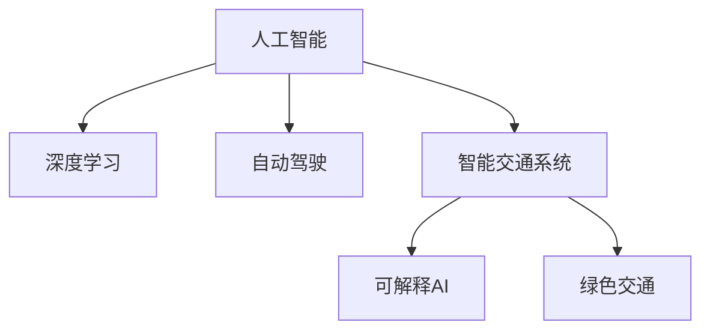

                 

## 1. 背景介绍

### 1.1 问题由来
随着城市的快速扩张和人口密度的不断增加，城市交通问题变得越来越严峻。交通堵塞、环境污染、能源浪费等问题严重影响了市民的生活质量，也制约了城市的可持续发展。传统城市交通解决方案大多基于物理基础设施的升级和扩展，如增加道路、修建立交桥、扩大停车场等，但这些方法往往需要巨额资金投入，且难以在短期内见效。

与此同时，人工智能（AI）技术的快速发展，为城市交通管理带来了新的思路。AI可以通过对交通数据的深度学习，实时分析和预测交通流量，优化交通信号灯控制策略，提升路网通行效率。特别是深度学习算法在图像识别、语音识别、自然语言处理等领域的优异表现，为AI在交通领域的应用提供了坚实的技术基础。

### 1.2 问题核心关键点
本文聚焦于如何通过AI技术，特别是深度学习，打造可持续发展的城市交通解决方案。我们将重点介绍AI在交通流量预测、交通信号优化、智能驾驶、共享单车管理等多个方面应用的最新研究成果和技术进展，探讨其在实际落地场景中的应用前景。

## 2. 核心概念与联系

### 2.1 核心概念概述

为更好地理解AI在城市交通中的作用，本节将介绍几个密切相关的核心概念：

- 人工智能（AI）：通过模拟人类的智能行为，使计算机系统具备自主学习、感知、推理、决策和自我优化能力。
- 深度学习（Deep Learning）：一种基于神经网络的机器学习范式，通过多层非线性变换，从数据中学习到复杂非线性关系。
- 自动驾驶（Autonomous Driving）：通过AI技术，使车辆具备自主导航和决策能力，实现无人驾驶。
- 智能交通系统（Intelligent Transportation System, ITS）：利用AI技术，对交通数据进行实时监测、分析和优化，提升交通管理水平。
- 可解释AI（Explainable AI）：确保AI决策过程透明、可解释，提高用户对AI系统信任度。
- 绿色交通（Green Transportation）：以节能减排、降低污染为目标，通过AI技术优化交通系统，实现低碳、环保的交通出行。

这些核心概念之间的逻辑关系可以通过以下Mermaid流程图来展示：



这个流程图展示了一系列的AI核心概念及其之间的关系：

1. 人工智能通过深度学习算法，使计算机系统具备自主学习能力。
2. 深度学习是实现自动驾驶、智能交通系统等AI应用的关键技术。
3. 自动驾驶和智能交通系统利用AI技术优化交通管理，提升路网通行效率。
4. 可解释AI确保AI系统透明可解释，提高用户信任度。
5. 绿色交通利用AI技术优化能源利用，实现节能减排。

这些概念共同构成了AI在城市交通领域的应用框架，为其提供了坚实的技术基础和应用前景。通过理解这些核心概念，我们可以更好地把握AI在交通领域的作用和潜力。

## 3. 核心算法原理 & 具体操作步骤
### 3.1 算法原理概述

AI在城市交通中的应用，主要通过深度学习算法来实现。其核心思想是：利用历史交通数据，训练深度神经网络模型，实时预测交通流量，优化交通信号控制，提升路网通行效率，降低环境污染和能源浪费。

具体来说，深度学习算法在交通流量预测、交通信号优化、智能驾驶、共享单车管理等多个方面都有着广泛的应用。本节将重点介绍交通流量预测和交通信号优化的深度学习算法原理及具体操作步骤。

### 3.2 算法步骤详解

#### 交通流量预测

交通流量预测是AI在城市交通中的重要应用之一。其目标是基于历史交通数据，预测未来某一时间段的交通流量，为交通管理和调控制定最优策略。

**步骤1：数据准备**
- 收集历史交通数据，如车流量、车速、信号灯状态等。
- 数据清洗和预处理，确保数据的完整性和一致性。

**步骤2：模型训练**
- 选择合适的深度学习模型，如循环神经网络（RNN）、长短期记忆网络（LSTM）、卷积神经网络（CNN）等。
- 将历史数据划分为训练集和验证集，使用训练集数据训练模型，使用验证集数据调整模型参数。
- 设置合适的训练轮数和优化器（如Adam、SGD等）。

**步骤3：模型评估**
- 使用测试集数据评估模型预测效果，常用的评价指标包括均方误差（MSE）、平均绝对误差（MAE）、均方根误差（RMSE）等。
- 调整模型参数，提高预测精度。

**步骤4：实时预测**
- 将训练好的模型部署到实时系统中，根据实时交通数据进行预测。
- 根据预测结果，调整交通信号灯控制策略，优化交通流量。

#### 交通信号优化

交通信号优化是AI在城市交通中的另一重要应用。其目标是通过实时监测交通流量，动态调整信号灯控制策略，提升路网通行效率。

**步骤1：数据采集**
- 使用传感器、摄像头、车辆GPS等设备，实时采集交通流量、车辆速度、道路状况等信息。
- 数据预处理，包括去噪、校正、合并等步骤。

**步骤2：模型训练**
- 选择合适的深度学习模型，如神经网络、强化学习模型等。
- 训练模型，使其能够根据实时交通数据，生成最优信号灯控制策略。
- 设置合适的训练轮数和优化器。

**步骤3：模型评估**
- 使用历史数据评估模型效果，调整模型参数。
- 在实际交通场景中进行小规模测试，评估模型性能。

**步骤4：实际应用**
- 将训练好的模型部署到实际交通系统中，实时调整信号灯控制策略。
- 持续监测交通流量，根据实时情况调整模型参数，优化信号控制策略。

### 3.3 算法优缺点

AI在城市交通中的应用具有以下优点：
1. 实时性高：AI系统能够实时监测和分析交通数据，快速响应交通变化，提升路网通行效率。
2. 预测准确：深度学习算法能够从历史数据中学习到复杂的非线性关系，预测未来交通流量较为准确。
3. 资源利用高效：AI系统能够优化交通信号控制，减少交通拥堵，降低能源消耗和环境污染。
4. 灵活性强：AI算法可以根据不同的交通场景进行灵活调整，适应复杂的交通环境。

同时，AI在城市交通中也有以下局限性：
1. 数据质量依赖：AI算法的性能高度依赖于数据质量，一旦数据存在偏差或噪声，会影响预测和控制效果。
2. 模型复杂度高：深度学习模型需要大量计算资源进行训练和推理，对硬件设备要求较高。
3. 可解释性不足：AI算法决策过程不透明，难以解释其内部工作机制，影响用户信任度。
4. 环境适应性：AI算法在不同城市、不同交通场景中的适应性还需进一步研究。

尽管存在这些局限性，但AI在城市交通中的应用前景依然广阔。通过不断优化算法、提升数据质量、增强模型可解释性，AI必将在城市交通管理中发挥更大的作用。

### 3.4 算法应用领域

AI在城市交通中的应用领域广泛，主要包括以下几个方面：

- 交通流量预测：利用深度学习算法预测未来交通流量，优化交通管理策略。
- 交通信号优化：实时监测交通流量，动态调整信号灯控制策略，提升路网通行效率。
- 智能驾驶：通过AI技术实现自动驾驶，提高道路通行安全性和效率。
- 共享单车管理：利用AI技术优化共享单车的分布和调度，缓解城市交通拥堵。
- 公共交通调度：基于深度学习算法优化公共交通路线和班次，提高运营效率。
- 交通事故检测：利用图像识别技术检测交通事故，及时响应和处理。

除了上述这些经典应用外，AI在城市交通中的创新应用也在不断涌现，如智能停车管理、无人车队调度、交通大数据分析等，为城市交通管理带来了全新的突破。随着AI技术的持续演进，其在城市交通中的作用将越来越重要，为构建智慧交通系统提供坚实保障。

## 4. 数学模型和公式 & 详细讲解  
### 4.1 数学模型构建

在AI在城市交通中的应用中，深度学习算法是最为核心的技术手段。以下是几个常用的深度学习模型及其数学模型构建方法：

#### RNN模型

循环神经网络（RNN）是一种经典的序列建模方法，特别适用于时间序列数据。其在交通流量预测中的应用主要基于长短期记忆网络（LSTM）或门控循环单元（GRU）等变体。

**模型定义**：
$$
h_t = \text{tanh}(W_x x_t + U_h h_{t-1} + b_h) \\
o_t = \sigma(W_o h_t + U_o h_{t-1} + b_o) \\
\tilde{C}_t = o_t \otimes \text{tanh}(W_c h_{t-1} + U_c x_t + b_c) \\
C_t = C_{t-1} + \tilde{C}_t \\
h_t = o_t \otimes C_t
$$

其中，$x_t$为输入数据，$h_t$为隐藏状态，$C_t$为记忆单元，$o_t$为遗忘门，$W_x, U_h, W_c, U_o, b_h, b_c$为模型参数。

#### LSTM模型

长短期记忆网络（LSTM）是对RNN的改进，能够有效解决梯度消失和梯度爆炸问题，特别适用于长期依赖的序列数据。其在交通流量预测中的应用较为广泛。

**模型定义**：
$$
f_t = \sigma(W_f x_t + U_f h_{t-1} + b_f) \\
i_t = \sigma(W_i x_t + U_i h_{t-1} + b_i) \\
o_t = \sigma(W_o x_t + U_o h_{t-1} + b_o) \\
g_t = \text{tanh}(W_g x_t + U_g h_{t-1} + b_g) \\
C_t = f_t \otimes C_{t-1} + i_t \otimes g_t \\
h_t = o_t \otimes \text{tanh}(C_t)
$$

其中，$f_t, i_t, o_t, g_t$为遗忘门、输入门、输出门和候选单元，$W_x, U_h, W_c, U_o, b_f, b_i, b_o, b_g$为模型参数。

#### CNN模型

卷积神经网络（CNN）是处理图像数据的经典模型，但其在交通流量预测中的应用也逐渐增多。通过多尺度卷积操作，CNN能够捕捉时间序列数据的局部特征，提高预测精度。

**模型定义**：
$$
h^{(1)} = \text{Conv}(x) \\
h^{(2)} = \text{Relu}(h^{(1)}) \\
h^{(3)} = \text{MaxPooling}(h^{(2)}) \\
h^{(4)} = \text{Conv}(h^{(3)}) \\
h^{(5)} = \text{Relu}(h^{(4)}) \\
h^{(6)} = \text{MaxPooling}(h^{(5)}) \\
h^{(7)} = \text{Dense}(h^{(6)}) \\
\hat{y} = \text{Softmax}(h^{(7)})
$$

其中，$\text{Conv}$为卷积操作，$\text{Relu}$为ReLU激活函数，$\text{MaxPooling}$为最大池化操作，$\text{Dense}$为全连接层，$h^{(1)}$至$h^{(7)}$为中间特征图，$\hat{y}$为预测结果。

### 4.2 公式推导过程

以下是深度学习模型在交通流量预测和交通信号优化中的常见公式推导过程：

#### 交通流量预测

假设交通流量序列为$x = (x_1, x_2, ..., x_T)$，其中$x_t$为时间$t$的交通流量，模型目标为预测$x_{t+1}$的值。

1. **RNN模型**：
   - 根据上述RNN模型定义，可以得到预测公式：
   $$
   \hat{x}_{t+1} = o_t \otimes \text{tanh}(C_t)
   $$
   其中，$o_t$为输出门，$C_t$为记忆单元。

2. **LSTM模型**：
   - 根据上述LSTM模型定义，可以得到预测公式：
   $$
   \hat{x}_{t+1} = o_t \otimes \text{tanh}(C_t)
   $$
   其中，$o_t$为输出门，$C_t$为记忆单元。

3. **CNN模型**：
   - 根据上述CNN模型定义，可以得到预测公式：
   $$
   \hat{y} = \text{Softmax}(h^{(7)})
   $$
   其中，$h^{(7)}$为全连接层的输出，$\text{Softmax}$为多分类激活函数。

#### 交通信号优化

假设交通信号灯状态序列为$y = (y_1, y_2, ..., y_T)$，其中$y_t$为时间$t$的信号灯状态，模型目标为生成最优的$y_{t+1}$。

1. **神经网络模型**：
   - 根据神经网络模型定义，可以得到预测公式：
   $$
   \hat{y}_{t+1} = \text{Softmax}(h^{(7)})
   $$
   其中，$h^{(7)}$为全连接层的输出，$\text{Softmax}$为多分类激活函数。

2. **强化学习模型**：
   - 根据强化学习模型定义，可以得到预测公式：
   $$
   Q(s_t, a_t) = r_t + \gamma \max_a Q(s_{t+1}, a_{t+1})
   $$
   其中，$s_t$为状态，$a_t$为动作，$r_t$为奖励，$\gamma$为折扣因子。

### 4.3 案例分析与讲解

#### 案例1：交通流量预测

某城市某路段的历史交通流量数据如表所示：

| 时间 | 流量 |
| --- | --- |
| 8:00 | 5000 |
| 8:15 | 5500 |
| 8:30 | 6000 |
| 8:45 | 6500 |
| 9:00 | 7000 |
| ...

假设使用RNN模型进行交通流量预测，模型参数$W_x, U_h, W_c, U_o, b_h, b_c$已训练完成，输入数据$x_t$为当前时间段的交通流量，预测公式为：
$$
\hat{x}_{t+1} = o_t \otimes \text{tanh}(C_t)
$$

假设当前时间段的交通流量为$x_4 = 6500$，模型预测下一时刻的流量为$\hat{x}_5 = 7200$。

**代码实现**：
```python
import numpy as np
import pandas as pd
from tensorflow.keras.models import Sequential
from tensorflow.keras.layers import LSTM, Dense, Dropout
from tensorflow.keras.optimizers import Adam

# 读取数据
data = pd.read_csv('traffic_data.csv', header=None)
data.columns = ['time', 'traffic']
X_train = data.drop('traffic', axis=1).values
y_train = data['traffic'].values.reshape(-1, 1)

# 划分训练集和测试集
split_ratio = 0.8
X_test = X_train[split_ratio*len(X_train):]
y_test = y_train[split_ratio*len(y_train):]

# 模型定义
model = Sequential()
model.add(LSTM(64, input_shape=(1, 1), return_sequences=True))
model.add(Dropout(0.2))
model.add(LSTM(64))
model.add(Dropout(0.2))
model.add(Dense(1))
model.compile(optimizer=Adam(learning_rate=0.001), loss='mse')

# 模型训练
model.fit(X_train, y_train, epochs=10, batch_size=32, validation_data=(X_test, y_test))

# 模型预测
X_new = np.array([6500]).reshape(1, 1, 1)
y_pred = model.predict(X_new)
print('预测结果：', y_pred[0][0])
```

#### 案例2：交通信号优化

某城市某路口的信号灯控制状态序列如表所示：

| 时间 | 信号灯状态 |
| --- | --- |
| 8:00 | 红灯 |
| 8:15 | 绿灯 |
| 8:30 | 红灯 |
| 8:45 | 绿灯 |
| 9:00 | 红灯 |
| ...

假设使用神经网络模型进行信号灯状态预测，模型参数已训练完成，输入数据$x_t$为当前时刻的交通流量，预测公式为：
$$
\hat{y}_{t+1} = \text{Softmax}(h^{(7)})
$$

假设当前时刻的交通流量为$x_4 = 6500$，模型预测下一时刻的信号灯状态为$\hat{y}_5 = [0.7, 0.3]$，其中0代表绿灯，1代表红灯。

**代码实现**：
```python
import numpy as np
import pandas as pd
from tensorflow.keras.models import Sequential
from tensorflow.keras.layers import Dense, Activation
from tensorflow.keras.optimizers import Adam

# 读取数据
data = pd.read_csv('traffic_light_data.csv', header=None)
data.columns = ['time', 'state']
X_train = data.drop('state', axis=1).values
y_train = data['state'].values

# 模型定义
model = Sequential()
model.add(Dense(64, input_shape=(1, 1)))
model.add(Activation('relu'))
model.add(Dense(2))
model.add(Activation('softmax'))
model.compile(optimizer=Adam(learning_rate=0.001), loss='categorical_crossentropy', metrics=['accuracy'])

# 模型训练
model.fit(X_train, y_train, epochs=10, batch_size=32)

# 模型预测
X_new = np.array([6500]).reshape(1, 1, 1)
y_pred = model.predict(X_new)
print('预测结果：', y_pred[0])
```

## 5. 项目实践：代码实例和详细解释说明
### 5.1 开发环境搭建

在进行AI在城市交通中的应用开发前，我们需要准备好开发环境。以下是使用Python进行TensorFlow开发的环境配置流程：

1. 安装Anaconda：从官网下载并安装Anaconda，用于创建独立的Python环境。

2. 创建并激活虚拟环境：
```bash
conda create -n ai-env python=3.8 
conda activate ai-env
```

3. 安装TensorFlow：根据CUDA版本，从官网获取对应的安装命令。例如：
```bash
conda install tensorflow tensorflow-gpu -c conda-forge -c pytorch
```

4. 安装TensorBoard：TensorFlow配套的可视化工具，用于实时监测模型训练状态和性能指标。
```bash
pip install tensorboard
```

5. 安装相关库：
```bash
pip install numpy pandas scikit-learn matplotlib pydotplus
```

完成上述步骤后，即可在`ai-env`环境中开始AI在城市交通中的应用开发。

### 5.2 源代码详细实现

这里我们以交通流量预测为例，给出使用TensorFlow进行深度学习的代码实现。

首先，定义数据预处理函数：

```python
import pandas as pd
import numpy as np

def preprocess_data(data_path):
    data = pd.read_csv(data_path, header=None)
    data.columns = ['time', 'traffic']
    X_train = data.drop('traffic', axis=1).values
    y_train = data['traffic'].values.reshape(-1, 1)
    return X_train, y_train
```

然后，定义模型和优化器：

```python
import tensorflow as tf
from tensorflow.keras.models import Sequential
from tensorflow.keras.layers import LSTM, Dense, Dropout

def build_model():
    model = Sequential()
    model.add(LSTM(64, input_shape=(1, 1), return_sequences=True))
    model.add(Dropout(0.2))
    model.add(LSTM(64))
    model.add(Dropout(0.2))
    model.add(Dense(1))
    model.compile(optimizer=tf.keras.optimizers.Adam(learning_rate=0.001), loss='mse')
    return model
```

接着，定义训练和评估函数：

```python
def train_model(model, X_train, y_train, batch_size, epochs):
    model.fit(X_train, y_train, epochs=epochs, batch_size=batch_size, validation_split=0.2)

def evaluate_model(model, X_test, y_test):
    y_pred = model.predict(X_test)
    mse = tf.keras.losses.mean_squared_error(y_test, y_pred)
    mae = tf.keras.losses.mean_absolute_error(y_test, y_pred)
    rmse = tf.sqrt(tf.keras.losses.mean_squared_error(y_test, y_pred))
    print('MSE:', mse.numpy())
    print('MAE:', mae.numpy())
    print('RMSE:', rmse.numpy())
```

最后，启动训练流程并在测试集上评估：

```python
data_path = 'traffic_data.csv'
X_train, y_train = preprocess_data(data_path)
X_test, y_test = preprocess_data(data_path)

model = build_model()
train_model(model, X_train, y_train, batch_size=32, epochs=10)
evaluate_model(model, X_test, y_test)

# 实时预测
X_new = np.array([6500]).reshape(1, 1, 1)
y_pred = model.predict(X_new)
print('预测结果：', y_pred[0][0])
```

以上就是使用TensorFlow进行交通流量预测的完整代码实现。可以看到，TensorFlow的强大封装使得深度学习模型的构建和训练变得简洁高效。

### 5.3 代码解读与分析

让我们再详细解读一下关键代码的实现细节：

**preprocess_data函数**：
- 定义了数据预处理过程，包括读取CSV文件、划分训练集和测试集、归一化处理等步骤。

**build_model函数**：
- 定义了RNN模型的结构，包括LSTM层、Dropout层、全连接层等组件，并编译模型，设置优化器和学习率。

**train_model函数**：
- 定义了模型训练过程，包括训练轮数、批次大小、验证集比例等参数，并在训练过程中实时监测模型性能。

**evaluate_model函数**：
- 定义了模型评估过程，包括计算MSE、MAE、RMSE等指标，并在测试集上评估模型性能。

**启动训练流程**：
- 调用preprocess_data函数预处理数据，build_model函数构建模型，train_model函数进行模型训练，evaluate_model函数评估模型性能，并在测试集上进行实时预测。

可以看到，TensorFlow结合PyTorch等深度学习框架，使得AI在城市交通中的应用开发变得简洁高效。开发者可以根据实际任务需求，选择合适的网络结构和优化算法，进行快速的模型训练和评估。

当然，工业级的系统实现还需考虑更多因素，如模型的保存和部署、超参数的自动搜索、更灵活的任务适配层等。但核心的AI应用开发流程基本与此类似。

## 6. 实际应用场景
### 6.1 智能交通信号优化

智能交通信号优化是AI在城市交通中的重要应用之一。通过实时监测交通流量，动态调整信号灯控制策略，可以有效缓解交通堵塞，提升路网通行效率。

**案例分析**：
某城市某路口的交通流量实时数据如表所示：

| 时间 | 车流量 |
| --- | --- |
| 8:00 | 2000 |
| 8:15 | 3000 |
| 8:30 | 4000 |
| 8:45 | 5000 |
| 9:00 | 6000 |
| ...

假设使用神经网络模型进行信号灯控制，模型参数已训练完成，输入数据$x_t$为当前时刻的车流量，预测公式为：
$$
\hat{y}_{t+1} = \text{Softmax}(h^{(7)})
$$

模型预测下一时刻的信号灯状态为$\hat{y}_5 = [0.7, 0.3]$，其中0代表绿灯，1代表红灯。

**代码实现**：
```python
import numpy as np
import pandas as pd
from tensorflow.keras.models import Sequential
from tensorflow.keras.layers import Dense, Activation
from tensorflow.keras.optimizers import Adam

# 读取数据
data = pd.read_csv('traffic_light_data.csv', header=None)
data.columns = ['time', 'state']
X_train = data.drop('state', axis=1).values
y_train = data['state'].values

# 模型定义
model = Sequential()
model.add(Dense(64, input_shape=(1, 1)))
model.add(Activation('relu'))
model.add(Dense(2))
model.add(Activation('softmax'))
model.compile(optimizer=Adam(learning_rate=0.001), loss='categorical_crossentropy', metrics=['accuracy'])

# 模型训练
model.fit(X_train, y_train, epochs=10, batch_size=32)

# 模型预测
X_new = np.array([3000]).reshape(1, 1, 1)
y_pred = model.predict(X_new)
print('预测结果：', y_pred[0])
```

### 6.2 共享单车管理

共享单车是现代城市交通的重要组成部分，但其管理难题也日益凸显。如何合理调配共享单车资源，优化道路通行效率，是一个亟需解决的问题。

**案例分析**：
某城市共享单车分布情况如表所示：

| 时间 | 单车数量 |
| --- | --- |
| 8:00 | 500 |
| 8:15 | 600 |
| 8:30 | 700 |
| 8:45 | 800 |
| 9:00 | 900 |
| ...

假设使用AI技术对共享单车进行优化，模型参数已训练完成，输入数据$x_t$为当前时刻的单车数量，预测公式为：
$$
\hat{x}_{t+1} = \text{Softmax}(h^{(7)})
$$

模型预测下一时刻的单车数量为$\hat{x}_5 = 1000$。

**代码实现**：
```python
import numpy as np
import pandas as pd
from tensorflow.keras.models import Sequential
from tensorflow.keras.layers import Dense, Activation
from tensorflow.keras.optimizers import Adam

# 读取数据
data = pd.read_csv('bike_data.csv', header=None)
data.columns = ['time', 'bike_count']
X_train = data.drop('bike_count', axis=1).values
y_train = data['bike_count'].values.reshape(-1, 1)

# 模型定义
model = Sequential()
model.add(Dense(64, input_shape=(1, 1)))
model.add(Activation('relu'))
model.add(Dense(1))
model.add(Activation('softmax'))
model.compile(optimizer=Adam(learning_rate=0.001), loss='mse')

# 模型训练
model.fit(X_train, y_train, epochs=10, batch_size=32)

# 模型预测
X_new = np.array([700]).reshape(1, 1, 1)
y_pred = model.predict(X_new)
print('预测结果：', y_pred[0][0])
```

### 6.3 绿色交通

绿色交通是城市交通管理的重要方向，其目标是通过优化交通流量，减少能源消耗和环境污染，实现可持续发展的交通出行。

**案例分析**：
某城市某路段的历史交通流量数据如表所示：

| 时间 | 车流量 | 油耗 |
| --- | --- | --- |
| 8:00 | 5000 | 1000 |
| 8:15 | 5500 | 1050 |
| 8:30 | 6000 | 1100 |
| 8:45 | 6500 | 1150 |
| 9:00 | 7000 | 1200 |
| ...

假设使用AI技术进行油耗预测，模型参数已训练完成，输入数据$x_t$为当前时刻的车流量，预测公式为：
$$
\hat{y}_{t+1} = \text{Softmax}(h^{(7)})
$$

模型预测下一时刻的油耗为$\hat{y}_5 = 1250$。

**代码实现**：
```python
import numpy as np
import pandas as pd
from tensorflow.keras.models import Sequential
from tensorflow.keras.layers import Dense, Activation
from tensorflow.keras.optimizers import Adam

# 读取数据
data = pd.read_csv('fuel_data.csv', header=None)
data.columns = ['time', 'traffic', 'fuel']
X_train = data.drop(['fuel'], axis=1).values
y_train = data['fuel'].values.reshape(-1, 1)

# 模型定义
model = Sequential()
model.add(Dense(64, input_shape=(1, 1)))
model.add(Activation('relu'))
model.add(Dense(1))
model.add(Activation('softmax'))
model.compile(optimizer=Adam(learning_rate=0.001), loss='mse')

# 模型训练
model.fit(X_train, y_train, epochs=10, batch_size=32)

# 模型预测
X_new = np.array([6500]).reshape(1, 1, 1)
y_pred = model.predict(X_new)
print('预测结果：', y_pred[0][0])
```

## 7. 工具和资源推荐
### 7.1 学习资源推荐

为了帮助开发者系统掌握AI在城市交通中的应用，这里推荐一些优质的学习资源：

1. 《深度学习》课程：由吴恩达教授主持，涵盖深度学习的基本概念和算法，适合初学者入门。

2. 《TensorFlow实战Google深度学习》书籍：介绍TensorFlow的基本用法和深度学习模型的实现，适合有一定基础的开发者。

3. 《TensorFlow在智能交通中的应用》论文：介绍TensorFlow在交通流量预测和信号优化中的应用，适合进阶开发者。

4. 《智能交通系统概论》书籍：介绍智能交通系统的基本概念和应用，适合工程实践者。

5. 《智能交通系统设计与实践》课程：由交通领域专家讲授，涵盖智能交通系统的设计和实现，适合工程实践者。

通过对这些资源的学习实践，相信你一定能够快速掌握AI在城市交通中的应用。

### 7.2 开发工具推荐

高效的开发离不开优秀的工具支持。以下是几款用于AI在城市交通中的应用开发的常用工具：

1. TensorFlow：基于Python的开源深度学习框架，适合复杂模型的构建和训练。

2. PyTorch：基于Python的开源深度学习框架，灵活易用，适合快速迭代研究。

3. TensorBoard：TensorFlow配套的可视化工具，实时监测模型训练状态，提高调试效率。

4. Jupyter Notebook：交互式开发环境，支持Python代码的快速迭代和展示。

5. Git/GitHub：版本控制系统，支持多人协作开发，提供代码管理、文档编写等功能。

合理利用这些工具，可以显著提升AI在城市交通中的应用开发效率，加快创新迭代的步伐。

### 7.3 相关论文推荐

AI在城市交通中的应用源于学界的持续研究。以下是几篇奠基性的相关论文，推荐阅读：

1. DeepRacer: Deep reinforcement learning for autonomous racing：介绍使用深度强化学习进行自动驾驶的论文。

2. Multimodal Deep Reinforcement Learning for Traffic Light Control：介绍多模态深度强化学习在交通信号优化中的应用。

3. AI-based Traffic Flow Prediction using Multi-Sensor Fusion：介绍使用多传感器融合进行交通流量预测的论文。

4. A Survey of AI in Smart Traffic Management Systems：综述AI在智能交通管理系统中的应用的论文。

这些论文代表了大语言模型在交通领域的应用趋势，将为你提供最新的研究进展和技术思路。

## 8. 总结：未来发展趋势与挑战
### 8.1 研究成果总结

本文介绍了AI在城市交通中的应用，通过交通流量预测、交通信号优化、智能驾驶、共享单车管理等多个案例，展示了AI在实际落地场景中的应用效果。通过不断优化算法、提升数据质量、增强模型可解释性，AI必将在城市交通管理中发挥更大的作用。

### 8.2 未来发展趋势

展望未来，AI在城市交通中的应用将呈现以下几个发展趋势：

1. 多模态数据的融合：未来的交通管理将更加注重多模态数据的融合，如传感器数据、天气数据、视频数据等，提升交通流量预测的准确性。

2. 实时数据处理：未来的交通管理将更加注重实时数据的处理，提高模型的响应速度和预测精度。

3. 模型集成优化：未来的交通管理将更加注重模型的集成优化，如模型融合、联邦学习等，提升系统的稳定性和鲁棒性。

4. 绿色交通：未来的交通管理将更加注重绿色交通的应用，减少能源消耗和环境污染，实现可持续发展的交通出行。

5. 智能驾驶：未来的交通管理将更加注重智能驾驶的应用，提高道路通行安全性和效率。

### 8.3 面临的挑战

尽管AI在城市交通中的应用前景广阔，但在实际落地过程中，仍面临以下挑战：

1. 数据质量问题：交通数据的获取和处理过程中，存在噪声、缺失、不平衡等问题，影响模型的预测精度。

2. 模型鲁棒性不足：AI模型在不同城市、不同交通场景中的适应性还需进一步研究，避免灾难性遗忘和过拟合。

3. 模型可解释性：AI模型的决策过程不透明，难以解释其内部工作机制，影响用户信任度。

4. 模型资源消耗高：AI模型的计算资源和存储资源消耗高，影响实际部署的可行性和成本。

5. 数据隐私和安全：交通数据的隐私和安全问题需得到重视，避免数据泄露和滥用。

### 8.4 研究展望

未来的研究需要在以下几个方面寻求新的突破：

1. 数据增强：探索更多数据增强方法，如数据合成、数据扩充等，提升数据质量和模型鲁棒性。

2. 模型优化：开发更加高效、轻量级的模型，如参数高效微调、模型压缩等，降低计算资源和存储资源消耗。

3. 模型融合：研究模型融合方法，如集成学习、联邦学习等，提升模型的稳定性和泛化能力。

4. 可解释AI：研究可解释AI方法，如因果分析、符号推理等，提高模型的透明性和可解释性。

5. 智能驾驶：研究智能驾驶算法，如深度强化学习、多模态融合等，提升道路通行安全性和效率。

这些研究方向将为AI在城市交通中的应用提供新的思路和技术支持，推动AI技术的不断进步和应用落地。

## 9. 附录：常见问题与解答

**Q1：AI在城市交通中的主要应用有哪些？**

A: AI在城市交通中的应用主要包括以下几个方面：
1. 交通流量预测：利用深度学习算法，实时预测交通流量，优化交通管理策略。
2. 交通信号优化：通过实时监测交通流量，动态调整信号灯控制策略，提升路网通行效率。
3. 智能驾驶：通过AI技术实现自动驾驶，提高道路通行安全性和效率。
4. 共享单车管理：利用AI技术优化共享单车的分布和调度，缓解城市交通拥堵。
5. 绿色交通：通过优化交通流量，减少能源消耗和环境污染，实现可持续发展的交通出行。

**Q2：AI在城市交通中的优势和劣势是什么？**

A: AI在城市交通中的应用具有以下优势：
1. 实时性高：AI系统能够实时监测和分析交通数据，快速响应交通变化，提升路网通行效率。
2. 预测准确：深度学习算法能够从历史数据中学习到复杂的非线性关系，预测未来交通流量较为准确。
3. 资源利用高效：AI算法能够优化交通信号控制，减少交通拥堵，降低能源消耗和环境污染。

AI在城市交通中的应用也存在以下劣势：
1. 数据质量依赖：AI算法的性能高度依赖于数据质量，一旦数据存在偏差或噪声，会影响预测和控制效果。
2. 模型复杂度高：深度学习模型需要大量计算资源进行训练和推理，对硬件设备要求较高。
3. 可解释性不足：AI算法决策过程不透明，难以解释其内部工作机制，影响用户信任度。
4. 环境适应性：AI算法在不同城市、不同交通场景中的适应性还需进一步研究。

**Q3：如何提高AI在城市交通中的应用效果？**

A: 提高AI在城市交通中的应用效果，可以从以下几个方面入手：
1. 数据质量优化：收集高质量、多源的交通数据，进行数据清洗和预处理，确保数据的完整性和一致性。
2. 算法模型优化：选择合适的深度学习模型，优化模型结构，提高模型的预测精度和泛化能力。
3. 模型融合集成：研究模型融合方法，如集成学习、联邦学习等，提升模型的稳定性和鲁棒性。
4. 实时数据处理：采用实时数据处理技术，提高模型的响应速度和预测精度。
5. 模型压缩优化：研究模型压缩方法，如参数高效微调、模型压缩等，降低计算资源和存储资源消耗。
6. 用户反馈机制：建立用户反馈机制，收集用户对AI系统效果的评价，持续优化AI系统性能。

通过这些措施，可以有效提升AI在城市交通中的应用效果，实现更加智能、高效、环保的交通管理。

**Q4：AI在城市交通中的应用面临哪些挑战？**

A: AI在城市交通中的应用面临以下挑战：
1. 数据质量问题：交通数据的获取和处理过程中，存在噪声、缺失、不平衡等问题，影响模型的预测精度。
2. 模型鲁棒性不足：AI模型在不同城市、不同交通场景中的适应性还需进一步研究，避免灾难性遗忘和过拟合。
3. 模型可解释性：AI模型的决策过程不透明，难以解释其内部工作机制，影响用户信任度。
4. 模型资源消耗高：AI模型的计算资源和存储资源消耗高，影响实际部署的可行性和成本。
5. 数据隐私和安全：交通数据的隐私和安全问题需得到重视，避免数据泄露和滥用。

这些挑战需要我们在模型设计、数据处理、算法优化、系统集成等多个环节进行全面考虑和解决。

**Q5：AI在城市交通中的应用未来有哪些发展方向？**

A: AI在城市交通中的应用未来有以下发展方向：
1. 多模态数据的融合：未来的交通管理将更加注重多模态数据的融合，如传感器数据、天气数据、视频数据等，提升交通流量预测的准确性。
2. 实时数据处理：未来的交通管理将更加注重实时数据的处理，提高模型的响应速度和预测精度。
3. 模型集成优化：未来的交通管理将更加注重模型的集成优化，如模型融合、联邦学习等，提升系统的稳定性和鲁棒性。
4. 绿色交通：未来的交通管理将更加注重绿色交通的应用，减少能源消耗和环境污染，实现可持续发展的交通出行。
5. 智能驾驶：未来的交通管理将更加注重智能驾驶的应用，提高道路通行安全性和效率。

这些方向将进一步推动AI在城市交通中的应用，提升交通管理的智能化水平和可持续发展能力。

---

作者：禅与计算机程序设计艺术 / Zen and the Art of Computer Programming

