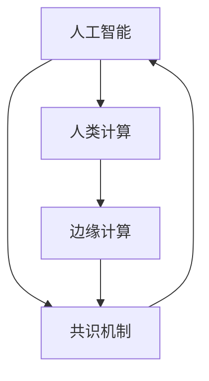

                 

# AI与人类计算：打造可持续的创新

## 1. 背景介绍

### 1.1 问题由来
随着人工智能(AI)技术的飞速发展，AI在诸多领域展现了强大的潜力和应用前景。AI不仅能大幅提升人类计算效率，还能深入探索人类计算能力的边界，推动经济社会的发展。然而，当前AI的发展也面临着计算资源稀缺、能耗过高、隐私安全等问题。

### 1.2 问题核心关键点
人类计算能力的关键在于数据和算法，但计算资源往往成为了制约因素。如何突破计算资源瓶颈，构建可持续发展的AI创新体系，成为了当前AI领域的一大热点和挑战。

## 2. 核心概念与联系

### 2.1 核心概念概述

- **人工智能(AI)**：一种通过模拟人类智能行为，使机器能够进行学习、推理、决策等复杂任务的技术。
- **人类计算(Human Computation)**：利用人类的智力和创造力，辅助或替代机器进行复杂计算的技术。
- **可持续创新(Sustainable Innovation)**：以长远发展为目标，在AI设计、应用中注重环境友好、资源节约、社会责任的技术创新。
- **边缘计算(Edge Computing)**：将数据和计算任务分布到靠近数据源的网络边缘设备上，提高响应速度和资源利用率。
- **共识机制(Consensus Mechanism)**：通过算法机制，确保网络中多个节点达成一致意见，维持网络安全和稳定。

这些核心概念通过如下Mermaid流程图展现它们之间的联系：



此流程图说明了AI、人类计算、边缘计算和共识机制四者之间的相互依赖和促进关系。

## 3. 核心算法原理 & 具体操作步骤
### 3.1 算法原理概述

人类计算与AI结合，旨在利用人类智慧辅助AI的计算和决策过程，从而在提高计算效率的同时，也能更好地处理复杂问题。AI与人类计算的结合，需要依赖以下几个关键原理：

- **分布式计算**：将计算任务分布到多个计算节点，提高并行计算能力，降低单个节点的计算负担。
- **机器学习**：通过数据驱动的方式，使机器能够自动学习优化计算策略。
- **人机交互**：通过交互界面，将人类计算与AI计算无缝衔接，实现协同计算。
- **认知计算**：模仿人类思维模式，通过推理、直觉等方式进行问题求解。

这些原理相互结合，形成了AI与人类计算结合的基础。

### 3.2 算法步骤详解

基于上述原理，AI与人类计算结合的具体步骤如下：

1. **数据准备**：收集、整理相关数据，准备进行AI与人类计算的结合。
2. **模型选择与设计**：选择合适的AI模型和人类计算算法，并根据任务需求进行定制设计。
3. **计算任务分配**：将计算任务合理分配给AI和人类，确定各自的角色和职责。
4. **交互界面设计**：设计直观、易用的交互界面，方便人类参与计算和监督AI计算过程。
5. **协同计算**：AI和人类协同进行计算，形成有效的计算合力。
6. **结果评估与优化**：对计算结果进行评估，根据评估结果进行模型和算法优化。

### 3.3 算法优缺点

AI与人类计算结合的优势在于：

- **高效性**：AI负责处理大量数据和复杂计算，人类负责处理关键判断和决策，大幅提高计算效率。
- **灵活性**：人类计算能够灵活应对各种未知和突发情况，AI可以处理数据中的模式和规律。
- **安全性**：人类计算在关键节点上起到监督和检查的作用，AI则负责数据处理和计算。

缺点在于：

- **成本高**：需要同时兼顾AI和人类计算，增加了整体成本。
- **复杂性**：交互界面和协同计算过程复杂，需要专业知识。
- **依赖性**：人类计算的效果依赖于人类智慧，可能存在主观偏差。

### 3.4 算法应用领域

AI与人类计算结合的应用领域广泛，涵盖了医疗、金融、教育、制造等多个领域。

- **医疗领域**：利用AI进行图像分析、诊断，人类进行病历审核、治疗决策。
- **金融领域**：利用AI进行风险预测、投资策略，人类进行业务审批、市场分析。
- **教育领域**：利用AI进行个性化学习推荐、作业批改，人类进行教学指导、心理辅导。
- **制造领域**：利用AI进行生产调度、质量控制，人类进行设计优化、质量检查。

## 4. 数学模型和公式 & 详细讲解

### 4.1 数学模型构建

人类计算与AI结合的数学模型通常包括：

- **分布式计算模型**：通过划分计算任务，合理分配到各个计算节点，提高并行计算效率。
- **协同计算模型**：描述AI和人类计算之间的交互过程，确保计算结果的准确性和可靠性。

### 4.2 公式推导过程

以一个简单的分布式计算模型为例，假设计算任务 $T$ 被划分为 $N$ 个子任务，分别分配到 $M$ 个计算节点上执行。节点计算时间 $t_i$ 和计算节点效率 $\epsilon_i$，则节点 $i$ 完成子任务的时间为 $t_i = \frac{T_i}{\epsilon_i}$，其中 $T_i$ 为子任务规模。节点完成所有任务所需的时间 $T_{total}$ 为：

$$
T_{total} = \sum_{i=1}^M \frac{T_i}{\epsilon_i}
$$

### 4.3 案例分析与讲解

假设有一个需要处理大量数据和复杂计算的任务，如基因组数据分析。将任务 $T$ 分为 $N=1000$ 个子任务，分配到 $M=10$ 个计算节点上。节点计算效率 $\epsilon_i$ 均匀分布在 $[0,1]$ 区间内，每个节点计算时间 $t_i$ 的期望值为：

$$
E(t_i) = \frac{T}{\epsilon_i}
$$

则平均计算时间为：

$$
E(T_{total}) = \frac{N}{M}E(t_i) = \frac{1000}{10}\frac{T}{\epsilon_i} = 100\frac{T}{\epsilon_i}
$$

可以看出，通过分布式计算，计算效率可以显著提升。

## 5. 项目实践：代码实例和详细解释说明
### 5.1 开发环境搭建

要搭建一个AI与人类计算结合的计算环境，需要进行以下步骤：

1. 安装Python和相关库，如TensorFlow、PyTorch等。
2. 安装Kubernetes等容器化平台，实现分布式计算。
3. 配置计算节点，确保网络通信畅通。
4. 设计交互界面，如Web应用，实现人类计算与AI计算的协同。

### 5.2 源代码详细实现

以基因组数据分析为例，假设使用TensorFlow实现AI计算，Flask实现人类计算交互界面。AI计算的代码示例如下：

```python
import tensorflow as tf

def model_train(data):
    # 定义模型和训练流程
    model = tf.keras.Sequential([tf.keras.layers.Dense(64, activation='relu'),
                                 tf.keras.layers.Dense(10, activation='softmax')])
    model.compile(optimizer='adam', loss='categorical_crossentropy', metrics=['accuracy'])
    model.fit(data, labels, epochs=10)
    return model

# 训练模型
model = model_train(data)
```

人类计算的代码示例如下：

```python
from flask import Flask, request

app = Flask(__name__)

@app.route('/predict', methods=['POST'])
def predict():
    data = request.json
    # 调用训练好的模型进行预测
    result = model.predict(data)
    return result

if __name__ == '__main__':
    app.run(host='0.0.0.0', port=5000)
```

### 5.3 代码解读与分析

上述代码示例中，TensorFlow用于实现AI模型的训练和预测，Flask用于实现人类计算的交互界面。AI模型训练完成后，通过Flask应用接收前端请求，进行预测。人类计算部分通过前端界面，将数据传入后台应用，获取AI计算结果。

### 5.4 运行结果展示

运行上述代码后，可以在浏览器中访问 `http://localhost:5000/predict`，通过post请求发送数据，获取AI模型的预测结果。交互界面可以根据实际需求进行设计，实现更灵活的交互方式。

## 6. 实际应用场景
### 6.1 医疗领域

在医疗领域，AI与人类计算结合可以大大提升医疗服务的质量和效率。通过AI进行图像分析、疾病诊断，人类进行病历审核、治疗决策。例如，AI可以自动分析医学影像，识别病变区域，人类进行进一步确认和诊断。这种方式不仅提高了诊断的准确性和速度，还能减轻医生工作负担，提升患者满意度。

### 6.2 金融领域

金融领域是AI与人类计算结合的重要应用场景。AI可以进行风险预测、投资策略，人类进行业务审批、市场分析。例如，AI可以分析历史交易数据，预测市场趋势，人类进行投资决策和风险控制。这种结合方式能够充分利用AI的计算能力和人类的专业判断，提升金融决策的科学性和精准性。

### 6.3 教育领域

教育领域同样需要AI与人类计算的结合。AI可以进行个性化学习推荐、作业批改，人类进行教学指导、心理辅导。例如，AI可以根据学生的学习情况，推荐适合的课程和资料，人类进行教学指导和心理辅导，确保学生的全面发展。这种结合方式能够提升教育质量，促进教育公平。

### 6.4 制造领域

在制造领域，AI与人类计算结合可以实现高效的生产调度、质量控制。例如，AI可以对生产设备进行监控，预测设备故障，人类进行设备维护和质量检查。这种结合方式能够提升生产效率和产品质量，降低生产成本。

## 7. 工具和资源推荐
### 7.1 学习资源推荐

要掌握AI与人类计算结合的技术，需要以下学习资源：

- **TensorFlow官方文档**：提供详细的TensorFlow使用手册和示例代码，适合初学者和进阶者。
- **Kubernetes官方文档**：提供Kubernetes容器化平台的使用手册和最佳实践，适合云原生开发。
- **Flask官方文档**：提供Flask框架的使用手册和示例代码，适合Web应用开发。
- **GitHub**：查找开源项目，学习其他开发者的实现思路和技术栈。
- **Coursera**：提供AI和人类计算相关的在线课程，适合系统学习。

### 7.2 开发工具推荐

- **TensorFlow**：用于AI计算，支持分布式计算和模型训练。
- **Kubernetes**：用于容器化部署和管理，支持高可用性和弹性扩展。
- **Flask**：用于Web应用开发，提供简单易用的交互界面。
- **Jupyter Notebook**：用于数据分析和模型调试，支持交互式计算和文档记录。
- **Git**：用于版本控制和代码协作，支持分布式版本管理。

### 7.3 相关论文推荐

要了解AI与人类计算结合的最新研究，可以参考以下论文：

- **Distributed Machine Learning: Algorithms, Tools, and Applications**：介绍分布式机器学习算法的原理和应用。
- **Human-in-the-Loop Machine Learning**：研究人类在机器学习中的角色和交互过程。
- **Edge Computing: A Computational Paradigm for Smart IoT**：介绍边缘计算的原理和应用。
- **Blockchain Consensus Protocols**：研究区块链中的共识机制和算法。

## 8. 总结：未来发展趋势与挑战
### 8.1 研究成果总结

AI与人类计算结合已经成为当今AI领域的一个重要方向。通过结合人类的智慧和机器的计算能力，可以大幅提升计算效率和问题解决能力。当前的成果已经涵盖了多个领域，如医疗、金融、教育、制造等。

### 8.2 未来发展趋势

未来AI与人类计算结合的发展趋势包括：

- **全栈自动化**：AI与人类计算的结合将更加深入，自动化程度不断提高。
- **云原生化**：AI计算将更多地依赖云平台，实现高效资源管理和弹性扩展。
- **边缘计算普及**：边缘计算将成为AI与人类计算结合的重要计算节点。
- **跨领域融合**：AI与人类计算结合将与其他技术（如物联网、区块链）融合，拓展应用场景。
- **可持续创新**：结合人类智慧和机器计算能力，打造更加环保、高效的计算体系。

### 8.3 面临的挑战

AI与人类计算结合的发展也面临一些挑战：

- **计算资源瓶颈**：大规模数据处理和复杂计算仍需依赖高性能计算资源。
- **数据隐私和安全**：AI与人类计算结合中涉及大量数据，隐私和安全问题不容忽视。
- **协同计算复杂性**：AI与人类计算的结合需要复杂的数据流和控制流设计。
- **技术融合难度**：AI与人类计算结合涉及多学科知识，技术融合难度较大。

### 8.4 研究展望

未来的研究可以关注以下方向：

- **多模态计算**：结合图像、声音、文本等多种数据源，进行更加全面、准确的计算。
- **智能合约**：结合区块链技术和AI计算，实现更加智能、高效的合约执行。
- **认知计算**：模仿人类思维模式，进行更加智能的决策和推理。
- **绿色计算**：结合可再生能源和AI计算，实现更加环保的计算体系。

通过不断探索和创新，AI与人类计算结合将具备更加广泛的应用场景，为人类计算能力的发展开辟新的道路。

## 9. 附录：常见问题与解答

**Q1：如何实现AI与人类计算的结合？**

A: 实现AI与人类计算的结合，需要进行以下步骤：

1. 收集和整理相关数据。
2. 选择合适的AI模型和人类计算算法，进行定制设计。
3. 将计算任务合理分配到AI和人类，确定各自的角色和职责。
4. 设计直观、易用的交互界面，方便人类参与计算和监督AI计算过程。
5. 协同计算，AI和人类共同进行计算，形成有效的计算合力。
6. 对计算结果进行评估，根据评估结果进行模型和算法优化。

**Q2：AI与人类计算结合的主要优势是什么？**

A: AI与人类计算结合的主要优势包括：

- **高效性**：AI负责处理大量数据和复杂计算，人类负责处理关键判断和决策，大幅提高计算效率。
- **灵活性**：人类计算能够灵活应对各种未知和突发情况，AI可以处理数据中的模式和规律。
- **安全性**：人类计算在关键节点上起到监督和检查的作用，AI则负责数据处理和计算。

**Q3：AI与人类计算结合面临的主要挑战是什么？**

A: AI与人类计算结合面临的主要挑战包括：

- **计算资源瓶颈**：大规模数据处理和复杂计算仍需依赖高性能计算资源。
- **数据隐私和安全**：AI与人类计算结合中涉及大量数据，隐私和安全问题不容忽视。
- **协同计算复杂性**：AI与人类计算的结合需要复杂的数据流和控制流设计。
- **技术融合难度**：AI与人类计算结合涉及多学科知识，技术融合难度较大。

**Q4：AI与人类计算结合在实际应用中有哪些成功案例？**

A: AI与人类计算结合在实际应用中已经取得了一些成功案例，包括：

- **医疗领域**：AI进行医学影像分析，人类进行病历审核和诊断决策。
- **金融领域**：AI进行风险预测和投资策略，人类进行业务审批和市场分析。
- **教育领域**：AI进行个性化学习推荐和作业批改，人类进行教学指导和心理辅导。
- **制造领域**：AI进行生产调度和质量控制，人类进行设备维护和质量检查。

通过这些案例可以看出，AI与人类计算结合已经显示出强大的潜力和应用前景。

---

作者：禅与计算机程序设计艺术 / Zen and the Art of Computer Programming

