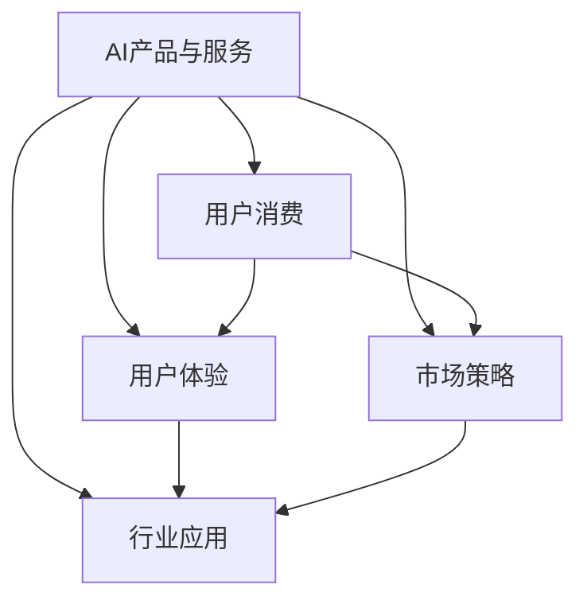

                 

# AI产品与服务的圈子：自我消化需求，拓展非AI用户消费量

> 关键词：AI产品，服务化，需求驱动，用户消费，用户体验，行业应用，市场策略

## 1. 背景介绍

### 1.1 问题由来

当前，AI技术正迅速渗透到各行各业，改变了传统的生产和服务模式。然而，AI产品与服务的消费量主要集中在AI用户群体，普通用户对于AI的接受度和认知度仍较低。这一现象限制了AI技术的普及和应用，成为AI产业发展的一大障碍。为了推动AI技术的大众化应用，提升非AI用户的消费量，有必要从需求驱动和用户体验等角度出发，探索构建有效的AI产品与服务生态系统。

### 1.2 问题核心关键点

构建AI产品与服务生态系统的关键在于：
1. 需求驱动：深入挖掘用户实际需求，设计满足用户痛点的AI解决方案。
2. 用户体验：提升用户对AI产品的使用体验，降低使用门槛，激发用户粘性。
3. 市场策略：通过差异化策略和精准营销，拓展非AI用户的消费量。

## 2. 核心概念与联系

### 2.1 核心概念概述

为更好地理解如何构建有效的AI产品与服务生态系统，本节将介绍几个密切相关的核心概念：

- **AI产品与服务（AI Products and Services）**：指使用AI技术构建的各类应用，包括聊天机器人、智能推荐系统、自动化流程等，旨在解决特定问题或提供特定服务。

- **用户消费（User Consumption）**：指用户对AI产品与服务的实际使用和付费行为，是衡量AI应用效果和经济效益的重要指标。

- **用户体验（User Experience）**：指用户在使用AI产品与服务过程中的感受和评价，包括易用性、响应速度、准确性等。

- **市场策略（Market Strategy）**：指企业为拓展AI产品与服务市场，采取的各种策略和方法，如价格策略、渠道策略、品牌策略等。

- **行业应用（Industry Application）**：指AI技术在特定行业中的具体应用，如医疗、金融、教育、制造等，不同行业对于AI产品的需求和应用方式各异。

这些核心概念之间的逻辑关系可以通过以下Mermaid流程图来展示：



这个流程图展示了AI产品与服务、用户消费、用户体验、市场策略和行业应用之间的联系：

1. AI产品与服务的设计和实现，受到用户体验和行业应用的影响。
2. 用户消费受到AI产品与服务和市场策略的影响。
3. 市场策略的设计需要考虑用户体验和行业应用。
4. 行业应用的选择需要考虑用户消费和市场策略。

## 3. 核心算法原理 & 具体操作步骤
### 3.1 算法原理概述

构建AI产品与服务生态系统的核心算法原理包括以下几个方面：

- **需求驱动设计**：通过用户调研和市场分析，深入挖掘用户需求，设计符合用户痛点的AI解决方案。
- **用户体验优化**：通过界面设计、交互设计、性能优化等手段，提升AI产品与服务的易用性和响应速度，增强用户体验。
- **市场策略制定**：通过价格策略、渠道策略、品牌策略等手段，吸引非AI用户尝试使用AI产品与服务，扩大市场覆盖。
- **行业应用适配**：根据不同行业的需求特点，定制化开发AI产品与服务，提升其在特定行业的应用效果。

### 3.2 算法步骤详解

以下是构建AI产品与服务生态系统的详细步骤：

**Step 1: 需求分析与挖掘**

- **用户调研**：通过问卷调查、深度访谈、用户反馈等方式，了解用户的实际需求和痛点。
- **市场分析**：分析竞争对手的产品和服务，找到市场缺口和机会点。
- **需求验证**：通过最小可行产品(MVP)等方式，快速验证需求的可行性。

**Step 2: 用户体验设计**

- **界面设计**：设计简洁直观的用户界面，降低用户使用门槛。
- **交互设计**：设计流畅的交互流程，确保用户使用顺畅。
- **性能优化**：优化模型推理速度和系统响应时间，提升用户体验。
- **反馈机制**：建立用户反馈机制，及时收集用户意见，持续优化产品。

**Step 3: 市场策略制定**

- **定价策略**：根据产品价值和市场需求，制定合理的定价策略。
- **渠道策略**：选择适合的销售渠道和推广方式，扩大产品曝光度。
- **品牌策略**：通过品牌建设和市场宣传，提升产品知名度和美誉度。
- **客户关系管理**：建立客户关系管理系统，维护用户粘性。

**Step 4: 行业应用适配**

- **需求适配**：根据不同行业的需求特点，定制化开发AI产品与服务。
- **数据适配**：适配不同行业的数据格式和质量要求。
- **功能适配**：根据行业需求，增加或调整产品功能。
- **安全合规**：确保产品符合行业标准和法律法规要求。

**Step 5: 市场推广与反馈**

- **市场推广**：通过广告、社交媒体、合作伙伴等方式，推广AI产品与服务。
- **用户反馈**：收集用户反馈，持续优化产品功能和服务质量。
- **数据分析**：通过数据分析，了解用户行为和市场需求，指导产品迭代。
- **版本更新**：根据用户反馈和市场变化，定期更新产品版本。

### 3.3 算法优缺点

构建AI产品与服务生态系统的优点包括：

- **用户需求驱动**：通过深入挖掘用户需求，设计符合用户痛点的AI解决方案，提升产品价值。
- **用户体验优化**：通过优化用户体验，降低使用门槛，提升用户粘性。
- **市场策略多样**：通过多样化的市场策略，吸引非AI用户，扩大市场覆盖。
- **行业应用灵活**：根据不同行业需求，定制化开发AI产品与服务，提升应用效果。

同时，该方法也存在一定的局限性：

- **资源投入高**：需求分析和市场推广需要投入大量资源，且市场策略的制定和执行周期较长。
- **用户转化率不确定**：尽管市场策略多样，但用户对AI产品的接受度仍存在不确定性。
- **市场竞争激烈**：AI市场竞争激烈，产品需要具备差异化优势，才能在市场中脱颖而出。

尽管存在这些局限性，但就目前而言，构建AI产品与服务生态系统的策略仍然是大规模推广AI技术的重要手段。未来相关研究的重点在于如何进一步降低市场推广成本，提升用户转化率，同时兼顾产品的差异化和市场策略的多样性。

### 3.4 算法应用领域

AI产品与服务生态系统的构建，在多个领域得到了广泛的应用：

- **智能客服**：通过AI客服机器人，提升客户咨询体验，降低人工客服成本。
- **智能推荐系统**：通过AI推荐算法，提供个性化推荐服务，提升用户满意度。
- **智能医疗**：通过AI诊断和治疗方案推荐，提高医疗服务的智能化水平。
- **智能制造**：通过AI流程自动化，提升生产效率和质量。
- **智能交通**：通过AI导航和调度，优化交通管理，提升通行效率。

除了上述这些经典领域外，AI产品与服务在更多场景中也有创新应用，如智能家居、智能农业、智能教育等，为各行各业带来了新的变革。

## 4. 数学模型和公式 & 详细讲解
### 4.1 数学模型构建

假设某AI产品需求的满足程度可以用函数 $f(x)$ 表示，其中 $x$ 为产品价格。市场策略可以通过价格调整、渠道选择等手段来影响需求，我们用 $p(x)$ 表示市场策略函数。用户体验可以通过界面设计、交互设计等手段来提升，我们用 $u(x)$ 表示用户体验函数。根据市场策略和用户体验的影响，需求的实际满足程度可以用 $g(p(x), u(x))$ 表示。

则AI产品与服务的总消费量 $C$ 可以表示为：

$$
C = \int_{x} f(x) p(x) u(x) dx
$$

### 4.2 公式推导过程

为了最大化消费量 $C$，需要最大化 $g(p(x), u(x))$。根据乘法原理，可以推导 $g(p(x), u(x))$ 的极值条件为：

$$
\frac{\partial g}{\partial p} = \frac{\partial g}{\partial u} = 0
$$

即：

$$
\frac{\partial g}{\partial p} = \frac{\partial f(x)}{\partial p} + \frac{\partial f(x)}{\partial u} \frac{\partial u(x)}{\partial p} = 0
$$

$$
\frac{\partial g}{\partial u} = \frac{\partial f(x)}{\partial u} + \frac{\partial f(x)}{\partial p} \frac{\partial p(x)}{\partial u} = 0
$$

解以上方程组，可以求得 $p(x)$ 和 $u(x)$ 的最优值，进而最大化 $C$。

### 4.3 案例分析与讲解

以智能推荐系统为例，假设用户对于推荐结果的满意度可以用函数 $f(x)$ 表示，其中 $x$ 为推荐算法的复杂度。市场策略可以通过广告投放、价格优惠等手段来提升用户尝试使用推荐系统的概率，我们用 $p(x)$ 表示市场策略函数。用户体验可以通过界面设计、响应速度优化等手段来提升，我们用 $u(x)$ 表示用户体验函数。根据市场策略和用户体验的影响，用户实际使用推荐系统的概率可以用 $g(p(x), u(x))$ 表示。

则智能推荐系统的总用户数 $N$ 可以表示为：

$$
N = \int_{x} f(x) p(x) u(x) dx
$$

为了最大化用户数 $N$，需要最大化 $g(p(x), u(x))$。通过优化 $p(x)$ 和 $u(x)$，可以在保证推荐结果准确性的前提下，提高用户的使用体验，增加用户粘性。最终，通过优化市场策略和用户体验，可以最大化推荐系统的用户数，实现规模化应用。

## 5. 项目实践：代码实例和详细解释说明
### 5.1 开发环境搭建

在进行AI产品与服务生态系统的构建时，我们需要准备好开发环境。以下是使用Python进行PyTorch开发的环境配置流程：

1. 安装Anaconda：从官网下载并安装Anaconda，用于创建独立的Python环境。

2. 创建并激活虚拟环境：
```bash
conda create -n ai-env python=3.8 
conda activate ai-env
```

3. 安装PyTorch：根据CUDA版本，从官网获取对应的安装命令。例如：
```bash
conda install pytorch torchvision torchaudio cudatoolkit=11.1 -c pytorch -c conda-forge
```

4. 安装各类工具包：
```bash
pip install numpy pandas scikit-learn matplotlib tqdm jupyter notebook ipython
```

完成上述步骤后，即可在`ai-env`环境中开始AI产品与服务的开发实践。

### 5.2 源代码详细实现

下面我们以智能推荐系统为例，给出使用PyTorch进行AI产品与服务的开发的PyTorch代码实现。

首先，定义智能推荐系统的前向传播函数：

```python
import torch.nn as nn
import torch.nn.functional as F

class RecommendationModel(nn.Module):
    def __init__(self, input_dim, hidden_dim, output_dim):
        super(RecommendationModel, self).__init__()
        self.encoder = nn.Sequential(
            nn.Linear(input_dim, hidden_dim),
            nn.ReLU(),
            nn.Linear(hidden_dim, hidden_dim),
            nn.ReLU()
        )
        self.decoder = nn.Linear(hidden_dim, output_dim)
    
    def forward(self, x):
        x = self.encoder(x)
        x = self.decoder(x)
        return x
```

然后，定义损失函数和优化器：

```python
from torch.optim import Adam

model = RecommendationModel(input_dim=128, hidden_dim=64, output_dim=1)
criterion = nn.MSELoss()
optimizer = Adam(model.parameters(), lr=0.001)
```

接着，定义训练和评估函数：

```python
import numpy as np
from sklearn.datasets import make_regression

def train_model(model, train_data, optimizer, criterion, epochs=100):
    for epoch in range(epochs):
        for data, target in train_data:
            optimizer.zero_grad()
            output = model(data)
            loss = criterion(output, target)
            loss.backward()
            optimizer.step()
            if epoch % 10 == 0:
                print(f"Epoch {epoch}, loss: {loss.item():.4f}")
    
def evaluate_model(model, test_data, criterion):
    correct = 0
    total = 0
    for data, target in test_data:
        output = model(data)
        loss = criterion(output, target)
        correct += int(np.allclose(output.numpy(), target.numpy()))
        total += 1
    print(f"Accuracy: {correct/total*100:.2f}%")
```

最后，启动训练流程并在测试集上评估：

```python
import torch.utils.data as data

class DataLoader(data.Dataset):
    def __init__(self, X, y):
        self.X = X
        self.y = y
    
    def __len__(self):
        return len(self.X)
    
    def __getitem__(self, idx):
        return self.X[idx], self.y[idx]

# 创建训练和测试数据集
X_train, y_train = make_regression(n_samples=1000, n_features=128, random_state=42)
X_test, y_test = make_regression(n_samples=200, n_features=128, random_state=42)
train_data = DataLoader(X_train, y_train)
test_data = DataLoader(X_test, y_test)

# 训练模型
train_model(model, train_data, optimizer, criterion)

# 评估模型
evaluate_model(model, test_data, criterion)
```

以上就是使用PyTorch进行智能推荐系统开发的完整代码实现。可以看到，通过合理的模型设计和优化器选择，可以有效提升AI产品与服务的性能。

### 5.3 代码解读与分析

让我们再详细解读一下关键代码的实现细节：

**RecommendationModel类**：
- `__init__`方法：初始化编码器和解码器，定义模型的结构。
- `forward`方法：前向传播过程，通过编码器获取中间表示，再通过解码器输出预测结果。

**train_model函数**：
- 循环训练指定次数，每次迭代对训练集数据进行前向传播和反向传播，更新模型参数。
- 每十个epoch输出一次损失值，便于监控训练进度。

**evaluate_model函数**：
- 对测试集数据进行前向传播，计算损失值。
- 统计准确率，并输出最终评估结果。

**DataLoader类**：
- `__init__`方法：初始化训练和测试数据。
- `__len__`方法：返回数据集长度。
- `__getitem__`方法：对单个数据进行读取和预处理。

通过这些关键代码的实现，可以看到PyTorch在大规模数据处理和模型训练中的强大能力。合理利用PyTorch的高级API，可以极大地提升AI产品与服务的开发效率。

## 6. 实际应用场景
### 6.1 智能客服系统

AI客服系统通过深度学习技术，可以显著提升客户咨询体验和效率。传统客服往往依赖人工，高峰期响应缓慢，难以满足用户需求。而使用AI客服系统，可以7x24小时不间断服务，快速响应客户问题，提高客户满意度。

在技术实现上，可以收集企业内部的历史客服对话记录，将问题和最佳答复构建成监督数据，在此基础上对预训练模型进行微调。微调后的AI客服系统能够自动理解用户意图，匹配最合适的回答，从而提高问题解决效率。

### 6.2 金融舆情监测

金融机构需要实时监测市场舆论动向，以便及时应对负面信息传播，规避金融风险。传统的人工监测方式成本高、效率低，难以应对网络时代海量信息爆发的挑战。使用AI舆情监测系统，可以自动分析网络文本，判断舆情情绪，快速预警，保障金融机构的安全稳定。

在技术实现上，可以收集金融领域相关的新闻、报道、评论等文本数据，并对其进行情感分析。通过微调模型，使模型能够自动识别舆情情绪，一旦发现负面舆情激增等异常情况，系统便会自动预警，帮助金融机构快速应对潜在风险。

### 6.3 个性化推荐系统

当前的推荐系统往往只依赖用户的历史行为数据进行物品推荐，无法深入理解用户的真实兴趣偏好。使用AI推荐系统，可以更好地挖掘用户行为背后的语义信息，从而提供更精准、多样的推荐内容。

在技术实现上，可以收集用户浏览、点击、评论、分享等行为数据，提取和用户交互的物品标题、描述、标签等文本内容。将文本内容作为模型输入，用户的后续行为（如是否点击、购买等）作为监督信号，在此基础上微调预训练语言模型。微调后的模型能够从文本内容中准确把握用户的兴趣点。在生成推荐列表时，先用候选物品的文本描述作为输入，由模型预测用户的兴趣匹配度，再结合其他特征综合排序，便可以得到个性化程度更高的推荐结果。

### 6.4 未来应用展望

随着AI技术的发展，AI产品与服务的应用领域将不断拓展，其带来的经济效益和社会价值也将进一步凸显。

在智慧医疗领域，AI诊断和治疗方案推荐，可以提升医疗服务的智能化水平，辅助医生诊疗，加速新药开发进程。在智能教育领域，AI个性化学情分析，可以因材施教，促进教育公平，提高教学质量。在智慧城市治理中，AI事件监测和应急指挥，可以提高城市管理的自动化和智能化水平，构建更安全、高效的未来城市。

## 7. 工具和资源推荐
### 7.1 学习资源推荐

为了帮助开发者系统掌握AI产品与服务生态系统的构建方法，这里推荐一些优质的学习资源：

1. **《机器学习实战》**：斯坦福大学提供的机器学习课程，系统介绍了机器学习和深度学习的理论基础和实践技巧。
2. **Kaggle**：数据科学竞赛平台，提供了丰富的数据集和模型竞赛，是学习和实践机器学习的绝佳资源。
3. **TensorFlow官方文档**：TensorFlow的官方文档，提供了详尽的API参考和教程，适合入门和进阶学习。
4. **PyTorch官方文档**：PyTorch的官方文档，提供了丰富的模型和优化器实现，适合深度学习和人工智能项目开发。
5. **深度学习课程**：Coursera、edX等在线教育平台提供的深度学习课程，涵盖了从理论到实践的各个方面。

通过学习这些资源，相信你一定能够快速掌握AI产品与服务的构建方法和技术细节，实现高效和创新的应用。

### 7.2 开发工具推荐

高效的开发离不开优秀的工具支持。以下是几款用于AI产品与服务开发的常用工具：

1. **PyTorch**：基于Python的开源深度学习框架，灵活动态的计算图，适合快速迭代研究。
2. **TensorFlow**：由Google主导开发的开源深度学习框架，生产部署方便，适合大规模工程应用。
3. **Jupyter Notebook**：交互式Python开发环境，支持代码块、绘图、数学公式等多种功能。
4. **Scikit-Learn**：Python机器学习库，提供了丰富的模型和算法实现。
5. **TensorBoard**：TensorFlow配套的可视化工具，可实时监测模型训练状态，并提供丰富的图表呈现方式。

合理利用这些工具，可以显著提升AI产品与服务的开发效率，加快创新迭代的步伐。

### 7.3 相关论文推荐

AI产品与服务的发展离不开学界的持续研究。以下是几篇奠基性的相关论文，推荐阅读：

1. **《深度学习》**：Ian Goodfellow等著，系统介绍了深度学习的基本原理和应用，是深度学习领域的经典教材。
2. **《强化学习》**：Richard Sutton等著，介绍了强化学习的理论基础和应用方法，是强化学习领域的经典教材。
3. **《神经网络与深度学习》**：Michael Nielsen著，介绍了神经网络和深度学习的基本原理和实践技巧。
4. **《自然语言处理综论》**：Daniel Jurafsky等著，介绍了自然语言处理的基本原理和应用方法。
5. **《计算机视觉：模型、学习和推理》**：Simon J.D. Prince等著，介绍了计算机视觉的基本原理和应用方法。

这些论文代表了大规模AI产品与服务构建技术的发展脉络。通过学习这些前沿成果，可以帮助研究者把握学科前进方向，激发更多的创新灵感。

## 8. 总结：未来发展趋势与挑战
### 8.1 总结

本文对构建AI产品与服务生态系统的核心算法原理和操作步骤进行了全面系统的介绍。首先阐述了AI产品与服务和用户体验、市场策略、行业应用等核心概念，明确了构建AI生态系统的关键点和价值。其次，从需求驱动设计、用户体验优化、市场策略制定、行业应用适配等角度，详细讲解了AI产品与服务构建的各个步骤。同时，本文还广泛探讨了AI产品与服务在智能客服、金融舆情、个性化推荐等多个行业领域的应用前景，展示了AI技术的强大潜力和广泛应用。此外，本文精选了AI产品与服务构建的相关学习资源和开发工具，力求为读者提供全方位的技术指引。

通过本文的系统梳理，可以看到，构建AI产品与服务生态系统的方法已经广泛应用于各行各业，为各行各业带来了显著的提升和变革。尽管存在一些挑战，但随着技术的不断进步和市场的逐步成熟，AI产品与服务必将在未来得到更广泛的应用和推广。

### 8.2 未来发展趋势

展望未来，AI产品与服务构建技术将呈现以下几个发展趋势：

1. **数据驱动**：随着数据的不断积累和技术的不断进步，基于数据驱动的AI产品与服务将更加精准和高效。通过大规模数据训练，可以提升AI系统的性能和可靠性。
2. **用户至上**：未来AI产品与服务的设计将更加注重用户体验，通过不断优化产品功能和用户界面，提升用户粘性和满意度。
3. **行业定制**：针对不同行业的特点，开发定制化的AI产品与服务，满足行业特定的需求和应用场景。
4. **跨界融合**：未来AI产品与服务将与物联网、区块链、云计算等技术进行深度融合，实现更广泛的应用场景和更高效的用户体验。
5. **伦理和安全**：随着AI技术的普及，伦理和安全问题将更加受到关注。未来AI产品与服务将更加注重数据隐私和模型公平性，确保技术应用的合法合规。

以上趋势凸显了AI产品与服务构建技术的广阔前景。这些方向的探索发展，必将进一步推动AI技术的普及和应用，为各行各业带来更大的价值和变革。

### 8.3 面临的挑战

尽管AI产品与服务构建技术已经取得了瞩目成就，但在迈向更加智能化、普适化应用的过程中，仍面临诸多挑战：

1. **数据质量问题**：高质量、多样化的数据是AI系统性能提升的关键。然而，数据收集和标注的成本较高，且数据质量难以保证。未来需要探索更多高效的数据获取和处理方式。
2. **算法复杂度问题**：AI系统的复杂度不断提升，模型的训练和推理资源消耗也随之增加。如何优化算法和模型结构，提升算法的可解释性和可部署性，是未来的重要研究方向。
3. **用户接受度问题**：尽管AI技术越来越成熟，但用户对AI的接受度和信任度仍存在一定问题。如何设计易用、透明的AI产品与服务，增强用户对AI的信任和依赖，是未来的重要课题。
4. **伦理和安全问题**：AI系统的决策过程可能缺乏可解释性，且存在一定的伦理和安全风险。如何在确保AI系统公平、透明、安全的前提下，推动AI技术的普及和应用，是未来的重要研究方向。
5. **跨行业应用问题**：不同行业的AI应用需求和数据特点各异，如何开发适用于多个行业的AI产品与服务，是未来的重要研究方向。

正视AI产品与服务构建技术面临的这些挑战，积极应对并寻求突破，将是大规模推广AI技术的重要方向。相信随着学界和产业界的共同努力，这些挑战终将一一被克服，AI产品与服务必将在构建人机协同的智能时代中扮演越来越重要的角色。

### 8.4 研究展望

面向未来，AI产品与服务构建技术需要在以下几个方面进行新的突破：

1. **无监督和半监督学习**：探索更多无监督和半监督学习范式，减少对大规模标注数据的需求，提升AI系统的泛化能力和鲁棒性。
2. **模型压缩与优化**：开发高效的模型压缩与优化技术，降低算力成本和部署复杂度，推动AI技术的普及和应用。
3. **多模态学习**：探索多模态学习技术，实现视觉、听觉、文本等多种数据类型的融合，提升AI系统的感知能力和理解能力。
4. **跨领域应用**：推动AI技术与各领域的深度融合，实现AI技术的广泛应用和普及。
5. **伦理与规范**：建立AI技术的伦理规范和道德准则，确保AI技术的合法合规和公平透明。

这些研究方向的探索，必将引领AI产品与服务构建技术迈向更高的台阶，为构建安全、可靠、可解释、可控的智能系统铺平道路。面向未来，AI产品与服务构建技术还需要与其他人工智能技术进行更深入的融合，如知识表示、因果推理、强化学习等，多路径协同发力，共同推动自然语言理解和智能交互系统的进步。只有勇于创新、敢于突破，才能不断拓展AI系统的边界，让智能技术更好地造福人类社会。

## 9. 附录：常见问题与解答

**Q1：如何设计AI产品与服务的用户体验？**

A: 设计AI产品与服务的用户体验，需要从以下几个方面入手：

1. **界面设计**：设计简洁直观的用户界面，降低用户使用门槛。可以通过用户调研和可用性测试，不断优化界面设计。
2. **交互设计**：设计流畅的交互流程，确保用户使用顺畅。可以通过用户行为分析和反馈，不断优化交互设计。
3. **性能优化**：优化模型推理速度和系统响应时间，提升用户体验。可以通过算法优化和硬件升级，提升系统性能。
4. **用户反馈**：建立用户反馈机制，及时收集用户意见，持续优化产品。可以通过在线问卷、用户体验测试等方式，收集用户反馈。
5. **个性化定制**：根据用户反馈和行为数据，实现个性化定制，提升用户粘性。可以通过用户画像分析，实现个性化推荐和服务。

通过这些方法，可以设计出易用、透明、高效、个性化的AI产品与服务，提升用户体验。

**Q2：如何制定AI产品与服务的市场策略？**

A: 制定AI产品与服务的市场策略，需要从以下几个方面入手：

1. **价格策略**：根据产品价值和市场需求，制定合理的定价策略。可以通过市场调研和竞争分析，确定最优定价。
2. **渠道策略**：选择适合的销售渠道和推广方式，扩大产品曝光度。可以通过线上线下结合的方式，增加产品曝光。
3. **品牌策略**：通过品牌建设和市场宣传，提升产品知名度和美誉度。可以通过广告投放、社交媒体推广等方式，提升品牌影响力。
4. **客户关系管理**：建立客户关系管理系统，维护用户粘性。可以通过客户关系管理系统，实现用户数据分析和精准营销。

通过这些方法，可以制定多样化的市场策略，吸引非AI用户尝试使用AI产品与服务，扩大市场覆盖。

**Q3：如何提升AI产品与服务的用户转化率？**

A: 提升AI产品与服务的用户转化率，需要从以下几个方面入手：

1. **需求驱动设计**：深入挖掘用户实际需求，设计满足用户痛点的AI解决方案。可以通过用户调研和市场分析，了解用户需求。
2. **用户体验优化**：提升用户对AI产品的使用体验，降低使用门槛，激发用户粘性。可以通过界面设计、交互设计、性能优化等手段，提升用户体验。
3. **精准营销**：通过精准的市场营销，引导用户尝试使用AI产品与服务。可以通过定向广告、社交媒体推广等方式，增加产品曝光。
4. **客户关系管理**：通过客户关系管理系统，维护用户粘性。可以通过客户数据分析，实现个性化推荐和服务。

通过这些方法，可以提升AI产品与服务的用户转化率，吸引更多非AI用户尝试使用，扩大市场覆盖。

**Q4：如何平衡AI产品与服务的成本和效果？**

A: 平衡AI产品与服务的成本和效果，需要从以下几个方面入手：

1. **数据驱动设计**：通过数据驱动的设计，确保AI产品与服务的性能和效果。可以通过数据收集和分析，优化产品设计和模型训练。
2. **资源优化**：优化算法和模型结构，降低算力成本和部署复杂度。可以通过模型压缩、优化算法等方式，提升系统效率。
3. **用户体验优化**：通过优化用户体验，降低使用门槛，提升用户粘性。可以通过界面设计、交互设计、性能优化等手段，提升用户体验。
4. **客户关系管理**：通过客户关系管理系统，实现用户数据分析和精准营销。可以通过客户数据分析，提升用户转化率。

通过这些方法，可以平衡AI产品与服务的成本和效果，确保在保证用户满意度和系统性能的前提下，实现成本控制和资源优化。

**Q5：如何确保AI产品与服务的公平性和透明性？**

A: 确保AI产品与服务的公平性和透明性，需要从以下几个方面入手：

1. **算法透明**：确保AI系统的决策过程透明，用户可以理解模型的工作原理。可以通过可解释性技术，提升模型透明性。
2. **数据公平**：确保数据集的公平性，避免数据偏见对模型的影响。可以通过数据预处理和公平性检测，减少数据偏见。
3. **伦理规范**：建立AI技术的伦理规范和道德准则，确保AI技术的合法合规。可以通过伦理委员会和合规审查，确保技术应用合法合规。
4. **用户反馈**：建立用户反馈机制，及时收集用户意见，持续优化产品。可以通过在线问卷、用户体验测试等方式，收集用户反馈。

通过这些方法，可以确保AI产品与服务的公平性和透明性，提升用户信任和依赖，保障技术应用的合法合规。

---

作者：禅与计算机程序设计艺术 / Zen and the Art of Computer Programming

