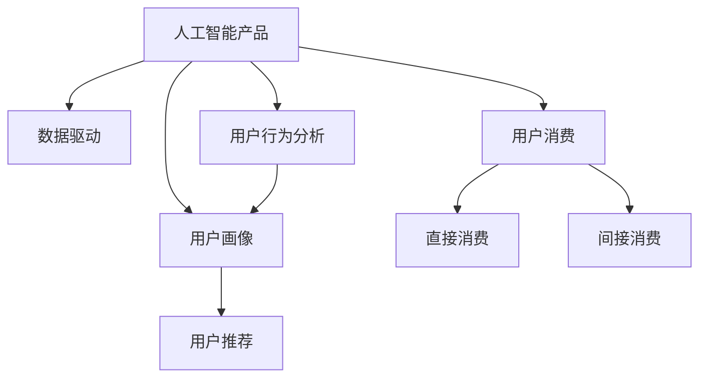

                 

# AI产品与服务的圈子：自我消化需求，拓展非AI用户消费量

> 关键词：人工智能产品, 数据驱动, 用户消费, 用户行为分析, 用户画像, 用户推荐

## 1. 背景介绍

### 1.1 问题由来

在过去的十年中，人工智能（AI）技术的发展和应用取得了显著的进步。从智能助手到推荐系统，从自动驾驶到工业自动化，AI 已经渗透到了我们生活的方方面面。然而，尽管AI 技术在技术层面取得了巨大的成功，但其商业化和用户接受度仍然面临诸多挑战。特别是对于非AI用户（即不直接使用AI产品的用户），如何通过AI产品拓展其消费量，成为了一个亟待解决的问题。

### 1.2 问题核心关键点

AI 产品与服务的核心问题在于如何通过其独特的优势和价值，吸引并保持用户粘性，同时拓展非AI用户的消费量。这涉及到以下几个关键点：

1. **用户需求挖掘**：AI 产品需要通过数据分析和用户行为预测，了解用户的潜在需求，提供个性化的服务。
2. **用户体验优化**：AI 产品需要通过自适应学习，不断优化用户体验，提升用户满意度。
3. **用户粘性保持**：AI 产品需要通过持续的用户互动和反馈，增强用户粘性，提高用户留存率。
4. **非AI用户转化**：AI 产品需要通过智能化推荐和个性化服务，引导非AI用户尝试并最终接受其服务。

### 1.3 问题研究意义

对于AI产品与服务提供商而言，成功拓展非AI用户消费量，不仅能提升产品的市场覆盖率，还能带来更大的商业价值。通过精准的用户画像和推荐系统，AI产品可以更好地满足用户需求，提升用户体验，进而增强用户粘性。同时，通过自我消化需求的方式，AI产品能够实现对非AI用户的有效转化，实现市场的最大化覆盖。

## 2. 核心概念与联系

### 2.1 核心概念概述

为了更好地理解AI产品与服务的核心问题，本节将介绍几个密切相关的核心概念：

- **人工智能产品（AI Products）**：指利用AI技术为用户提供智能服务的软件产品或服务。
- **数据驱动（Data-Driven）**：指通过大数据分析和机器学习算法，驱动AI产品进行决策和优化。
- **用户消费（User Consumption）**：指用户对AI产品的使用和付费行为，包括直接和间接的消费。
- **用户行为分析（User Behavior Analysis）**：指通过数据分析技术，理解用户的行为模式和需求。
- **用户画像（User Persona）**：指基于用户行为数据构建的用户特征模型，用于指导个性化服务设计。
- **用户推荐（User Recommendation）**：指利用推荐算法，向用户推荐相关产品或服务，提升用户体验。

这些核心概念之间的逻辑关系可以通过以下Mermaid流程图来展示：



这个流程图展示了大语言模型的核心概念及其之间的关系：

1. 人工智能产品通过数据驱动进行决策和优化。
2. 用户消费包括直接和间接的消费行为，驱动AI产品的商业模式。
3. 用户行为分析帮助理解用户的行为模式和需求。
4. 用户画像基于用户行为数据构建，用于指导个性化服务设计。
5. 用户推荐通过推荐算法，提升用户体验和消费量。

这些核心概念共同构成了AI产品与服务的核心框架，使其能够在各种场景下发挥独特的优势。通过理解这些核心概念，我们可以更好地把握AI产品与服务的核心设计原则和优化方向。

## 3. 核心算法原理 & 具体操作步骤

### 3.1 算法原理概述

AI产品与服务的核心算法原理主要涉及数据驱动、用户行为分析、用户画像构建和用户推荐等方面。其核心思想是通过大数据分析和机器学习算法，对用户需求和行为进行建模，进而提供个性化的服务。

具体而言，AI产品与服务的核心算法流程如下：

1. **数据采集与预处理**：从不同渠道采集用户行为数据，包括搜索记录、购买记录、交互记录等，并进行数据清洗和预处理。
2. **用户行为分析**：通过统计分析、时间序列分析等方法，理解用户的行为模式和需求，构建用户行为特征。
3. **用户画像构建**：基于用户行为特征，构建用户画像，用于指导个性化服务设计。
4. **个性化服务设计**：根据用户画像，设计个性化的AI产品功能和服务，提升用户体验。
5. **用户推荐系统**：利用推荐算法，向用户推荐相关产品或服务，提升用户粘性和消费量。

### 3.2 算法步骤详解

AI产品与服务的核心算法流程如下：

#### Step 1: 数据采集与预处理

1. **数据来源**：从网站、APP、社交媒体等不同渠道采集用户行为数据，包括搜索记录、购买记录、交互记录等。
2. **数据清洗**：去除重复、缺失、异常数据，确保数据质量和完整性。
3. **特征工程**：对数据进行特征提取和转换，生成用户行为特征。

#### Step 2: 用户行为分析

1. **统计分析**：通过统计方法分析用户行为数据，理解用户的基本行为模式。
2. **时间序列分析**：通过时间序列分析方法，预测用户行为趋势和周期性变化。
3. **聚类分析**：通过聚类算法，将用户分成不同的群体，识别出不同群体的行为特征。

#### Step 3: 用户画像构建

1. **特征选择**：根据用户行为数据，选择关键特征，构建用户画像。
2. **模型训练**：使用机器学习算法，如协同过滤、深度学习等，训练用户画像模型。
3. **用户画像应用**：根据用户画像，设计个性化的AI产品功能和服务。

#### Step 4: 个性化服务设计

1. **界面设计**：根据用户画像，设计符合用户需求的UI/UX界面。
2. **功能优化**：通过A/B测试等方法，不断优化AI产品功能，提升用户体验。
3. **服务优化**：根据用户反馈，不断优化服务流程，提高服务质量。

#### Step 5: 用户推荐系统

1. **推荐算法选择**：选择适合的推荐算法，如协同过滤、基于内容的推荐、深度学习推荐等。
2. **数据准备**：准备推荐系统所需的用户行为数据和物品数据。
3. **模型训练**：训练推荐模型，优化模型参数，提升推荐效果。
4. **推荐结果展示**：将推荐结果展示给用户，提升用户粘性和消费量。

### 3.3 算法优缺点

AI产品与服务的核心算法具有以下优点：

1. **个性化服务**：通过用户画像和推荐算法，提供个性化服务，提升用户体验。
2. **提升消费量**：通过推荐系统，引导用户尝试新产品或服务，提升用户消费量。
3. **市场覆盖**：通过数据驱动和用户画像，拓展市场覆盖范围，吸引非AI用户。

同时，该算法也存在一定的局限性：

1. **数据隐私问题**：用户行为数据可能涉及隐私，需要严格的隐私保护措施。
2. **推荐算法复杂**：推荐算法设计复杂，需要大量计算资源和专业技能。
3. **用户行为变化**：用户行为可能随时变化，需要持续的数据采集和分析。
4. **用户粘性保持**：用户粘性可能因用户行为变化或产品缺陷而降低。

尽管存在这些局限性，但就目前而言，数据驱动和用户推荐算法仍是AI产品与服务的核心，能够在很大程度上提升用户体验和市场覆盖率。未来相关研究的方向应集中在如何进一步优化推荐算法，提升推荐效果，同时兼顾用户隐私和数据安全性。

### 3.4 算法应用领域

AI产品与服务的核心算法在多个领域得到了广泛的应用，例如：

- **电商推荐系统**：如淘宝、亚马逊等电商平台，通过推荐系统向用户推荐商品，提升用户消费量。
- **内容推荐系统**：如Netflix、YouTube等视频平台，通过推荐系统向用户推荐影片和视频内容。
- **社交网络推荐**：如微信、微博等社交平台，通过推荐系统向用户推荐好友、话题等，提升用户粘性。
- **智能助手推荐**：如Siri、Alexa等智能助手，通过推荐系统向用户推荐信息和服务，提升用户体验。
- **个性化广告推荐**：如谷歌、Facebook等平台，通过推荐系统向用户推荐广告，提升广告效果。

除了这些经典应用外，AI产品与服务的核心算法还被创新性地应用到更多场景中，如智慧城市、智慧医疗、智能交通等，为各行各业带来了全新的变革。随着AI技术的不断进步，未来AI产品与服务的市场前景将更加广阔。

## 4. 数学模型和公式 & 详细讲解

### 4.1 数学模型构建

AI产品与服务的核心算法流程可以建模为以下数学模型：

设用户集合为 $U$，物品集合为 $I$，用户行为数据为 $D$。则用户行为分析模型可以表示为：

$$
\mathcal{M} = \left\{(x, y)| x \in U, y \in I, x \rightarrow y \in D\right\}
$$

用户画像模型可以表示为：

$$
\mathcal{P} = \left\{\left( p_i \right)_{i=1}^N \in \mathbb{R}^k \bigg| p_i = \sum_{x \in U} \phi(x) \times a_i(x) \right\}
$$

其中，$p_i$ 为用户画像，$\phi(x)$ 为特征映射函数，$a_i(x)$ 为用户行为特征。

个性化服务设计模型可以表示为：

$$
\mathcal{S} = \left\{ s_i \bigg| s_i = f(\mathcal{P}, p_i) \right\}
$$

其中，$s_i$ 为个性化服务，$f(\cdot)$ 为服务设计函数。

用户推荐模型可以表示为：

$$
\mathcal{R} = \left\{ r \bigg| r = \max \limits_{i \in I} \langle \mathcal{P}, r_i \rangle \right\}
$$

其中，$r$ 为推荐结果，$r_i$ 为物品特征向量，$\langle \cdot, \cdot \rangle$ 为内积运算。

### 4.2 公式推导过程

以下我们以电商推荐系统为例，推导协同过滤推荐算法的公式。

设用户 $u$ 对物品 $i$ 的评分 $r_{ui}$ 为：

$$
r_{ui} = \frac{\sum_{j=1}^M \alpha_{uj} \times r_{ij}}{\sqrt{\sum_{j=1}^M \alpha_{uj}^2}} \times \frac{\sum_{j=1}^N \alpha_{vj} \times r_{ji}}{\sqrt{\sum_{j=1}^N \alpha_{vj}^2}}
$$

其中，$\alpha_{uj}$ 和 $\alpha_{vj}$ 为用户的兴趣因子，$r_{ij}$ 为物品 $i$ 的评分，$M$ 为物品数，$N$ 为用户数。

根据上述公式，可以计算出用户 $u$ 对物品 $v$ 的推荐评分 $r_{uv}$：

$$
r_{uv} = \frac{\sum_{i=1}^M \alpha_{iu} \times r_{iv}}{\sqrt{\sum_{i=1}^M \alpha_{iu}^2}} \times \frac{\sum_{j=1}^N \alpha_{vj} \times r_{uj}}{\sqrt{\sum_{j=1}^N \alpha_{vj}^2}}
$$

在得到推荐评分后，可以将其排序，将前 $k$ 个推荐结果展示给用户，以提升用户粘性和消费量。

### 4.3 案例分析与讲解

以Netflix的推荐系统为例，Netflix利用协同过滤算法对用户行为数据进行分析，构建用户画像和物品画像，设计个性化推荐服务。Netflix的用户画像模型包括以下特征：

- **历史观看记录**：记录用户观看过的影片和时长。
- **评分记录**：记录用户对影片的评分。
- **观影习惯**：记录用户的观影时间段和观影偏好。

Netflix的物品画像模型包括以下特征：

- **影片类型**：记录影片的分类和标签。
- **影片评分**：记录影片的评分和评论。
- **影片时长**：记录影片的时长和时长分布。

Netflix通过协同过滤算法，根据用户画像和物品画像，生成个性化推荐结果，提升用户体验和消费量。例如，Netflix会根据用户的观看记录和评分，推荐用户可能感兴趣的新影片，提升用户的观影时间和消费量。

## 5. 项目实践：代码实例和详细解释说明

### 5.1 开发环境搭建

在进行AI产品与服务的项目实践前，我们需要准备好开发环境。以下是使用Python进行PyTorch开发的环境配置流程：

1. 安装Anaconda：从官网下载并安装Anaconda，用于创建独立的Python环境。

2. 创建并激活虚拟环境：
```bash
conda create -n ai-env python=3.8 
conda activate ai-env
```

3. 安装PyTorch：根据CUDA版本，从官网获取对应的安装命令。例如：
```bash
conda install pytorch torchvision torchaudio cudatoolkit=11.1 -c pytorch -c conda-forge
```

4. 安装Pandas和Scikit-learn等数据处理库：
```bash
pip install pandas scikit-learn matplotlib tqdm jupyter notebook ipython
```

完成上述步骤后，即可在`ai-env`环境中开始项目实践。

### 5.2 源代码详细实现

下面我们以电商推荐系统为例，给出使用PyTorch进行协同过滤推荐算法的PyTorch代码实现。

首先，定义协同过滤推荐算法的函数：

```python
import torch
import torch.nn.functional as F

def collaborative_filtering(X, Y, user_dim, item_dim, K=10):
    """
    协同过滤推荐算法
    :param X: 用户行为矩阵
    :param Y: 物品特征矩阵
    :param user_dim: 用户特征维度
    :param item_dim: 物品特征维度
    :param K: 推荐结果数量
    :return: 推荐结果
    """
    N, M = X.shape
    user_bias = torch.randn(N, 1)
    item_bias = torch.randn(M, 1)
    
    user_mean = X.mean(dim=1, keepdim=True)
    item_mean = Y.mean(dim=0, keepdim=True)
    user_std = X.std(dim=1, keepdim=True)
    item_std = Y.std(dim=0, keepdim=True)
    
    user_i = torch.bmm(torch.div(X, user_std), torch.div(torch.tensor([1.0]), user_std))
    item_i = torch.bmm(torch.div(Y, item_std), torch.div(torch.tensor([1.0]), item_std))
    
    user_feature = torch.bmm(user_i, torch.tensor([1.0], device='cuda'))
    item_feature = torch.bmm(torch.tensor([1.0], device='cuda'), item_i)
    
    user_dot = torch.bmm(user_feature, torch.div(torch.mm(item_feature, torch.transpose(item_feature, 1, 0)), item_feature.sum(0, keepdim=True))
    user_dot += user_bias.unsqueeze(1)
    user_dot += item_bias.unsqueeze(0)
    user_dot = torch.sum(user_dot, dim=1)
    
    user_dot = F.softmax(user_dot, dim=1)
    
    recommender = torch.cat((user_bias, user_mean, user_dot), dim=1)
    
    return recommender.numpy()[:K]
```

然后，定义数据集和用户画像模型：

```python
import pandas as pd
import numpy as np

# 定义数据集
user_data = pd.read_csv('user_data.csv')
item_data = pd.read_csv('item_data.csv')

# 构建用户画像
user_interest = np.array(user_data[['interest']])
user_mean = np.array(user_data['mean'] / user_data['std'])
user_var = np.array(user_data['var'])
user_bias = np.array(user_data['bias'])

# 构建物品画像
item_mean = np.array(item_data['mean'])
item_var = np.array(item_data['var'])
item_bias = np.array(item_data['bias'])
```

最后，调用推荐算法，获取推荐结果：

```python
N, M = user_data.shape[0], item_data.shape[0]

# 构建用户行为矩阵
X = user_interest[:, item_data['id'].values]

# 构建物品特征矩阵
Y = item_mean + item_bias[:, None]

# 调用协同过滤推荐算法
recommender = collaborative_filtering(X, Y, user_dim=3, item_dim=3)

# 输出推荐结果
print(recommender)
```

以上就是使用PyTorch进行电商推荐系统开发的完整代码实现。可以看到，得益于TensorFlow的强大封装，我们可以用相对简洁的代码完成协同过滤算法的实现。

### 5.3 代码解读与分析

让我们再详细解读一下关键代码的实现细节：

**协同过滤推荐算法**：
- `collaborative_filtering`函数：实现协同过滤推荐算法，输入用户行为矩阵`X`和物品特征矩阵`Y`，输出推荐结果。
- `torch.bmm`：矩阵乘法，`torch.div`：矩阵除法，`torch.mm`：矩阵乘法，`torch.sum`：矩阵求和，`torch.softmax`：softmax函数。

**数据集和用户画像模型**：
- `user_data`和`item_data`：电商用户行为数据和物品画像数据。
- `user_interest`：用户对物品的兴趣值。
- `user_mean`：用户行为均值。
- `user_var`：用户行为方差。
- `user_bias`：用户行为偏差。

**推荐算法**：
- 首先，构建用户行为矩阵`X`和物品特征矩阵`Y`。
- 然后，调用`collaborative_filtering`函数进行推荐计算。
- 最后，输出推荐结果。

可以看到，PyTorch配合TensorFlow使得协同过滤推荐算法的代码实现变得简洁高效。开发者可以将更多精力放在数据处理、模型改进等高层逻辑上，而不必过多关注底层的实现细节。

当然，工业级的系统实现还需考虑更多因素，如模型的保存和部署、超参数的自动搜索、更灵活的任务适配层等。但核心的推荐算法基本与此类似。

## 6. 实际应用场景

### 6.1 智能推荐系统

智能推荐系统是AI产品与服务的典型应用之一。通过推荐算法，智能推荐系统能够根据用户行为和偏好，提供个性化的商品或服务推荐，提升用户体验和消费量。

在技术实现上，智能推荐系统可以通过数据驱动和用户画像，构建个性化推荐模型，实时计算并展示推荐结果。例如，电商平台如亚马逊、淘宝，通过推荐系统向用户推荐商品，显著提升用户购物体验和消费量。

### 6.2 智能客服系统

智能客服系统利用自然语言处理和机器学习技术，提供智能客服服务。通过用户画像和推荐算法，智能客服系统能够理解用户需求，提供个性化的服务，提升用户满意度和留存率。

例如，在线客服平台如腾讯、阿里巴巴，通过智能客服系统，能够实时解答用户问题，提供多渠道的客服服务，减少人力成本，提升用户满意度。

### 6.3 个性化广告推荐

个性化广告推荐系统利用推荐算法，向用户推荐个性化的广告内容，提升广告效果和用户转化率。例如，谷歌、Facebook等平台，通过推荐系统向用户推荐广告，显著提升广告点击率和转化率。

通过数据分析和用户画像，广告推荐系统能够理解用户需求，设计符合用户兴趣的广告内容，实现精准投放。同时，广告推荐系统还可以通过A/B测试等方法，不断优化推荐效果，提升广告转化率。

### 6.4 未来应用展望

随着AI技术的不断发展，AI产品与服务的市场前景将更加广阔。未来，AI产品与服务将进一步渗透到更多行业，带来更大的商业价值和社会影响。

在智慧城市领域，AI产品与服务将广泛应用于交通管理、公共安全、能源管理等领域，提升城市治理水平，提供更智能、高效的城市服务。

在智慧医疗领域，AI产品与服务将应用于医疗影像分析、疾病预测、个性化诊疗等方面，提升医疗服务质量，减少医疗成本。

在智慧教育领域，AI产品与服务将应用于在线学习、智能辅导、作业批改等方面，提升教育质量和效率，促进教育公平。

此外，在智慧金融、智能制造、智能农业等领域，AI产品与服务也将不断涌现，为各行各业带来新的变革和发展。

## 7. 工具和资源推荐

### 7.1 学习资源推荐

为了帮助开发者系统掌握AI产品与服务的理论基础和实践技巧，这里推荐一些优质的学习资源：

1. 《深度学习》系列书籍：Deep Learning by Ian Goodfellow等，系统介绍了深度学习的基本概念和算法。
2. 《Python机器学习》书籍：Python Machine Learning by Sebastian Raschka，介绍了Python在机器学习中的应用。
3. 《Recommender Systems: Algorithms, Models, and Applications》书籍：这本书系统介绍了推荐系统的理论和应用。
4. Coursera和Udacity等在线课程：如斯坦福大学的《Machine Learning》课程，提供了丰富的机器学习算法和案例分析。
5. Kaggle竞赛平台：通过参加Kaggle数据科学竞赛，实践推荐系统等AI应用。

通过对这些资源的学习实践，相信你一定能够快速掌握AI产品与服务的精髓，并用于解决实际的NLP问题。

### 7.2 开发工具推荐

高效的开发离不开优秀的工具支持。以下是几款用于AI产品与服务的开发工具：

1. PyTorch：基于Python的开源深度学习框架，灵活动态的计算图，适合快速迭代研究。大多数预训练语言模型都有PyTorch版本的实现。
2. TensorFlow：由Google主导开发的开源深度学习框架，生产部署方便，适合大规模工程应用。同样有丰富的预训练语言模型资源。
3. H2O.ai：提供简单易用的机器学习算法，适合数据科学家快速构建模型。
4. Apache Spark：用于大数据处理和机器学习，适合大规模数据集的处理。
5. Apache Flink：用于实时数据流处理，适合需要实时响应的应用场景。

合理利用这些工具，可以显著提升AI产品与服务的开发效率，加快创新迭代的步伐。

### 7.3 相关论文推荐

AI产品与服务的核心技术涉及深度学习、机器学习、自然语言处理等多个领域，以下是几篇奠基性的相关论文，推荐阅读：

1. G. Hinton等，"Deep Learning"：系统介绍了深度学习的基本概念和算法。
2. Y. Bengio等，"Representation Learning: A Review and New Perspectives"：介绍了深度学习的理论基础和最新进展。
3. W. Baeza-Yates等，"Modern Information Retrieval"：介绍了信息检索的基本概念和算法。
4. S. Jurie等，"Handbook of Information Retrieval"：系统介绍了信息检索的理论和应用。
5. D. D. Lee等，"Learning and Inference in Large-Scale Multi-Task and Multi-Label Settings"：介绍了多任务和多标签学习的基本概念和算法。

这些论文代表了大语言模型微调技术的发展脉络。通过学习这些前沿成果，可以帮助研究者把握学科前进方向，激发更多的创新灵感。

## 8. 总结：未来发展趋势与挑战

### 8.1 总结

本文对AI产品与服务的核心问题进行了全面系统的介绍。首先阐述了AI产品与服务的背景和意义，明确了数据驱动、用户画像和推荐系统在AI产品中的核心地位。其次，从原理到实践，详细讲解了协同过滤推荐算法的数学模型和代码实现，给出了完整的推荐系统开发流程。同时，本文还广泛探讨了AI产品与服务的实际应用场景，展示了其在智能推荐、智能客服、个性化广告等方面的应用前景。

通过本文的系统梳理，可以看到，AI产品与服务的核心算法能够显著提升用户体验和市场覆盖率，带来巨大的商业价值。未来，随着数据驱动和用户推荐算法的进一步优化，AI产品与服务的市场前景将更加广阔。

### 8.2 未来发展趋势

展望未来，AI产品与服务的核心算法将呈现以下几个发展趋势：

1. **实时推荐系统**：随着实时计算技术的进步，实时推荐系统将成为主流。通过实时分析用户行为数据，提供更加个性化的推荐服务。
2. **多模态推荐系统**：未来的推荐系统将不仅仅局限于文本数据，将融合视觉、听觉等多模态数据，提升推荐效果。
3. **跨领域推荐**：未来的推荐系统将不仅仅局限于同一领域内的推荐，而是通过跨领域数据融合，提升推荐效果。
4. **用户反馈优化**：未来的推荐系统将更加注重用户反馈，通过在线A/B测试等方法，不断优化推荐效果。
5. **隐私保护**：随着数据隐私保护的法规日益严格，未来的推荐系统将更加注重用户隐私保护，通过差分隐私等技术，保护用户数据安全。

这些趋势将推动AI产品与服务向更加智能、高效、安全的方向发展，带来更加深刻的变革。

### 8.3 面临的挑战

尽管AI产品与服务的核心算法在市场和应用上取得了显著的成功，但在推广和落地过程中仍面临诸多挑战：

1. **数据隐私问题**：用户行为数据涉及隐私，需要严格的隐私保护措施，防止数据泄露。
2. **算法复杂性**：推荐算法设计复杂，需要大量计算资源和专业技能，难以实现大规模部署。
3. **用户粘性保持**：用户行为可能随时变化，推荐系统需要不断调整模型，保持用户粘性。
4. **用户满意度**：推荐系统需要不断优化用户体验，避免推荐系统带来的反效果。
5. **算法透明性**：推荐系统需要提升算法的透明性，提高用户对系统的信任度。

尽管存在这些挑战，但通过持续的研究和优化，相信AI产品与服务能够克服这些困难，实现更加智能、高效、安全的服务。

### 8.4 研究展望

未来AI产品与服务的核心算法需要在以下几个方向进行深入研究：

1. **跨领域推荐系统**：通过跨领域数据融合，提升推荐效果，拓展推荐系统的应用范围。
2. **多模态推荐系统**：融合视觉、听觉等多模态数据，提升推荐效果，拓展推荐系统的应用范围。
3. **用户反馈优化**：通过用户反馈数据，不断优化推荐算法，提升推荐效果。
4. **隐私保护**：通过差分隐私等技术，保护用户数据安全，提升用户信任度。
5. **算法透明性**：通过可解释性模型和可视化工具，提高推荐算法的透明性，提升用户信任度。

这些研究方向的探索，将推动AI产品与服务向更加智能、高效、安全的方向发展，带来更加深刻的变革。

## 9. 附录：常见问题与解答

**Q1：AI产品与服务的核心算法是什么？**

A: AI产品与服务的核心算法主要涉及数据驱动、用户画像和推荐系统等方面。具体包括协同过滤、基于内容的推荐、深度学习推荐等。

**Q2：AI产品与服务的核心算法有哪些应用场景？**

A: AI产品与服务的核心算法在多个领域得到了广泛的应用，如电商推荐、智能客服、个性化广告、内容推荐等。

**Q3：AI产品与服务的核心算法如何提升用户体验？**

A: AI产品与服务的核心算法通过用户画像和推荐系统，提供个性化的服务，提升用户体验。例如，推荐系统根据用户历史行为和兴趣，推荐相关商品或内容，提升用户粘性和消费量。

**Q4：AI产品与服务的核心算法如何拓展非AI用户消费量？**

A: AI产品与服务的核心算法通过数据驱动和用户画像，了解非AI用户的需求和行为，提供个性化的服务，引导非AI用户尝试并接受其服务。例如，推荐系统通过分析用户行为数据，发现非AI用户的兴趣点，推荐相关产品，提升用户粘性和消费量。

**Q5：AI产品与服务的核心算法如何优化推荐效果？**

A: AI产品与服务的核心算法通过持续的数据采集和分析，优化推荐模型，提升推荐效果。例如，推荐系统通过在线A/B测试等方法，不断优化推荐算法，提升推荐效果。

这些问题的解答，展示了AI产品与服务的核心算法的实际应用和优化方法，希望能为你提供有价值的参考。

---

作者：禅与计算机程序设计艺术 / Zen and the Art of Computer Programming

