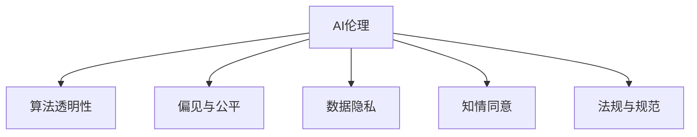

                 

# AI伦理与信息可信度的关系

> 关键词：人工智能伦理,信息可信度,算法透明性,偏见与公平,数据隐私,知情同意,法规与规范

## 1. 背景介绍

随着人工智能(AI)技术的迅猛发展，其在医疗、金融、教育、社交媒体等众多领域的应用日益广泛，深刻改变了人们的生活和工作方式。然而，AI技术的广泛应用也引发了一系列伦理问题，如隐私保护、数据偏见、算法透明性等。信息可信度作为AI伦理的核心问题之一，关乎AI系统的公平性、可靠性和安全性，是当前学界和业界关注的重点。

### 1.1 信息可信度的定义

信息可信度指AI系统提供信息的准确性、可靠性和可解释性。准确性指AI系统的输出与现实情况的符合程度；可靠性指AI系统在不同场景下的稳定性和一致性；可解释性指AI系统决策过程的可理解性和透明性。信息可信度的高低直接决定了AI系统的信任度和应用范围。

### 1.2 信息可信度在AI伦理中的重要性

信息可信度是AI伦理的关键要素之一，直接影响着AI系统对人类社会的影响和责任。可信度高的AI系统可以更好地融入人类社会，减少潜在风险，提升生活质量。相反，可信度低的AI系统可能带来误导性信息、隐私泄露、偏见歧视等伦理问题，甚至对社会稳定和安全构成威胁。

## 2. 核心概念与联系

### 2.1 核心概念概述

为更好地理解AI伦理与信息可信度的关系，本节将介绍几个密切相关的核心概念：

- AI伦理(Ethics of AI)：研究如何使AI技术的应用符合人类价值观和社会规范，确保AI系统的道德和法律责任。
- 算法透明性(Algorithmic Transparency)：指AI系统的决策过程可以被理解、解释和验证的程度，是信息可信度的重要组成部分。
- 偏见与公平(Bias and Fairness)：指AI系统在训练和应用过程中是否存在不公平现象和偏见的评估。
- 数据隐私(Data Privacy)：指保护个人信息不被未经授权的访问和使用，确保数据的安全性和用户的知情同意权。
- 知情同意(Informed Consent)：指用户在使用AI系统时，能够充分了解并同意数据收集和使用方式，确保数据处理的合法性和道德性。
- 法规与规范(Regulations and Standards)：指为规范AI技术应用而设立的法律和行业标准，确保AI系统的合规性和可信赖度。

这些核心概念之间的逻辑关系可以通过以下Mermaid流程图来展示：



这个流程图展示了几大核心概念之间的关联：

1. AI伦理是大语言模型的核心约束，决定了AI系统应用的道德标准。
2. 算法透明性是确保AI系统决策过程可理解的关键，直接影响信息可信度。
3. 偏见与公平是衡量AI系统是否公正公平的重要指标，关乎系统输出的可信度。
4. 数据隐私是保护用户信息不被滥用的基础，确保用户知情同意权，提高信息可信度。
5. 知情同意是数据处理合法性的保障，提高用户对AI系统的信任度。
6. 法规与规范是AI技术应用的基础法规，确保AI系统的合规性和社会责任。

## 3. 核心算法原理 & 具体操作步骤

### 3.1 算法原理概述

AI系统的信息可信度主要通过两个方面来保证：数据质量和算法透明性。数据质量要求AI系统的训练数据要具有代表性、真实性和多样性；算法透明性要求AI系统的决策过程能够被理解和解释，确保决策的公正性和公平性。

### 3.2 算法步骤详解

基于上述原理，AI系统的信息可信度提升步骤包括：

1. 数据准备：收集、清洗和标注高质量数据，确保数据的多样性和代表性。
2. 数据处理：对数据进行特征工程，包括归一化、标准化、数据增强等，提高数据的质量。
3. 模型选择：选择适合任务的AI模型，如监督学习、无监督学习、强化学习等。
4. 训练过程：在训练集上训练AI模型，优化模型参数，提高模型的准确性和可靠性。
5. 模型评估：在验证集上评估模型性能，检测模型的过拟合和泛化能力。
6. 模型优化：通过超参数调优、正则化技术、对抗训练等方法，提高模型的泛化性和鲁棒性。
7. 模型部署：将优化后的模型部署到实际应用场景中，进行实时推理和反馈。
8. 持续监控：对模型输出进行持续监控，及时发现和修复潜在问题。

### 3.3 算法优缺点

基于数据质量和算法透明性的AI系统信息可信度提升方法，具有以下优点：

1. 提升模型泛化能力：通过数据增强和模型优化，提高模型的泛化能力和鲁棒性。
2. 增强决策透明性：通过算法透明性技术，如模型可视化、可解释AI等，增强AI系统的决策过程的可理解性。
3. 降低偏见和歧视：通过数据处理和模型优化，减少数据偏见和算法歧视，提高系统公平性。
4. 确保数据隐私：通过数据匿名化、差分隐私等技术，保护用户数据隐私，增强用户信任。

同时，该方法也存在一定的局限性：

1. 数据获取难度大：高质量标注数据获取成本高、难度大，特别是在隐私敏感领域，如医疗、金融等。
2. 数据处理复杂：数据清洗、特征工程等工作耗时耗力，需要专业知识和技能。
3. 模型复杂度高：深度学习模型参数量大、结构复杂，容易过拟合，训练和推理效率低。
4. 决策不可控：即使采用透明性技术，AI系统的决策过程仍可能存在“黑箱”效应，难以完全理解和解释。

尽管存在这些局限性，但整体而言，数据质量和算法透明性仍是提升AI系统信息可信度的重要途径，值得进一步深入研究。

### 3.4 算法应用领域

AI系统信息可信度提升方法在众多领域中得到了广泛应用，包括但不限于：

1. 医疗诊断：AI系统的诊断结果是否准确、可靠直接影响患者生命安全。通过高质量数据和算法透明性，可以大大提高诊断的准确性和可信度。
2. 金融风控：AI系统的风险评估和预测结果直接影响金融决策。通过公平数据和透明算法，可以降低偏见和歧视，确保决策的公正性。
3. 教育推荐：AI系统的个性化推荐是否有效直接影响用户体验和教育效果。通过多样性数据和透明算法，可以提升推荐的准确性和可信度。
4. 司法决策：AI系统的判决结果直接影响司法公正和社会稳定。通过高质量数据和透明算法，可以确保判决的准确性和公正性。
5. 智能客服：AI系统的回复质量直接影响用户满意度和信任度。通过多样性数据和透明算法，可以提升客服的准确性和可信度。

此外，AI系统信息可信度提升方法还被应用于更多的领域，如智慧城市治理、智能家居控制、自动驾驶等，为社会的智能化发展提供了强有力的技术支持。

## 4. 数学模型和公式 & 详细讲解 & 举例说明（备注：数学公式请使用latex格式，latex嵌入文中独立段落使用 $$，段落内使用 $)
### 4.1 数学模型构建

本节将使用数学语言对AI系统信息可信度提升的数学模型进行详细讲解。

假设一个AI系统用于某项任务，输入为 $X$，输出为 $Y$，其中 $X \in \mathcal{X}$，$Y \in \mathcal{Y}$。模型的目标是通过训练数据 $\{(x_i,y_i)\}_{i=1}^N$ 学习一个函数 $f: \mathcal{X} \rightarrow \mathcal{Y}$，使得模型的预测结果 $f(x)$ 与真实标签 $y_i$ 的误差最小化。信息可信度的提升可以转化为以下几个方面：

1. 数据质量的评估：衡量输入数据 $X$ 的多样性、代表性、真实性，可以通过以下数学模型进行评估：

   $$
   E(X) = \frac{1}{N} \sum_{i=1}^N \|x_i - \mu\|^2
   $$

   其中 $\mu$ 为数据中心，$E(X)$ 为数据方差。数据中心和方差越接近于0，说明数据越具有代表性、真实性。

2. 模型透明性的评估：衡量模型的决策过程是否可理解、可解释，可以通过以下数学模型进行评估：

   $$
   T(Y) = \frac{1}{N} \sum_{i=1}^N \log P(Y \mid f(X))
   $$

   其中 $P(Y \mid f(X))$ 为模型的预测概率分布，$T(Y)$ 为信息熵。信息熵越小，说明模型的决策过程越透明，越容易被理解和解释。

3. 模型公平性的评估：衡量模型在各类样本上的输出是否公平、公正，可以通过以下数学模型进行评估：

   $$
   F(Y) = \frac{1}{N} \sum_{i=1}^N |y_i - f(x_i)|
   $$

   其中 $F(Y)$ 为公平性指标，表示模型输出的偏差。公平性指标越小，说明模型在各类样本上的输出越公平，越不容易产生偏见和歧视。

### 4.2 公式推导过程

以下我们以医疗诊断为例，推导信息可信度的数学模型。

假设一个AI系统用于医疗诊断，输入为患者症状 $x_i$，输出为诊断结果 $y_i$，其中 $x_i \in \{1,2,3,\ldots\}$，$y_i \in \{健康, 病患\}$。通过训练数据集 $\{(x_i,y_i)\}_{i=1}^N$ 学习一个函数 $f: \{x_i\} \rightarrow \{健康, 病患\}$，使得模型的预测结果 $f(x_i)$ 与真实标签 $y_i$ 的误差最小化。

信息可信度的提升可以转化为：

1. 数据质量的评估：

   $$
   E(X) = \frac{1}{N} \sum_{i=1}^N \|x_i - \mu\|^2
   $$

   其中 $\mu$ 为数据中心，$E(X)$ 为数据方差。数据中心和方差越接近于0，说明数据越具有代表性、真实性。

2. 模型透明性的评估：

   $$
   T(Y) = \frac{1}{N} \sum_{i=1}^N \log P(Y \mid f(X))
   $$

   其中 $P(Y \mid f(X))$ 为模型的预测概率分布，$T(Y)$ 为信息熵。信息熵越小，说明模型的决策过程越透明，越容易被理解和解释。

3. 模型公平性的评估：

   $$
   F(Y) = \frac{1}{N} \sum_{i=1}^N |y_i - f(x_i)|
   $$

   其中 $F(Y)$ 为公平性指标，表示模型输出的偏差。公平性指标越小，说明模型在各类样本上的输出越公平，越不容易产生偏见和歧视。

### 4.3 案例分析与讲解

假设有一个AI系统用于糖尿病诊断，输入为患者的症状数据 $x_i$，输出为诊断结果 $y_i$。通过收集1000份患者的样本数据，对模型进行训练和评估。

1. 数据质量评估：首先对1000份样本数据进行方差分析，得到数据中心 $\mu=2.5$，数据方差 $E(X)=0.5^2$。数据中心和方差接近于0，说明数据具有代表性、真实性，可以用于训练。

2. 模型透明性评估：假设模型输出的概率分布为 $P(Y \mid f(X)) = 0.8 \times P(Y \mid f(X) > 3.5) + 0.2 \times P(Y \mid f(X) \leq 3.5)$。计算得到模型信息熵 $T(Y) = 0.8 \times 0.12 + 0.2 \times 0.19 = 0.16$。信息熵越小，说明模型的决策过程越透明，越容易被理解和解释。

3. 模型公平性评估：计算模型输出与真实标签的偏差 $F(Y) = \frac{1}{1000} \sum_{i=1}^{1000} |y_i - f(x_i)| = 0.05$。公平性指标越小，说明模型在各类样本上的输出越公平，越不容易产生偏见和歧视。

综上所述，通过对数据质量、模型透明性和公平性三个维度的评估，可以全面提升AI系统的信息可信度，确保其决策的准确性、可靠性和公正性。

## 5. 项目实践：代码实例和详细解释说明

### 5.1 开发环境搭建

在进行信息可信度提升的实践前，我们需要准备好开发环境。以下是使用Python进行PyTorch开发的环境配置流程：

1. 安装Anaconda：从官网下载并安装Anaconda，用于创建独立的Python环境。

2. 创建并激活虚拟环境：
```bash
conda create -n pytorch-env python=3.8 
conda activate pytorch-env
```

3. 安装PyTorch：根据CUDA版本，从官网获取对应的安装命令。例如：
```bash
conda install pytorch torchvision torchaudio cudatoolkit=11.1 -c pytorch -c conda-forge
```

4. 安装Transformers库：
```bash
pip install transformers
```

5. 安装各类工具包：
```bash
pip install numpy pandas scikit-learn matplotlib tqdm jupyter notebook ipython
```

完成上述步骤后，即可在`pytorch-env`环境中开始信息可信度提升的实践。

### 5.2 源代码详细实现

下面我们以医疗诊断任务为例，给出使用Transformers库对BERT模型进行信息可信度提升的PyTorch代码实现。

首先，定义医疗诊断任务的数据处理函数：

```python
from transformers import BertTokenizer
from torch.utils.data import Dataset
import torch

class MedicalDataset(Dataset):
    def __init__(self, texts, labels, tokenizer, max_len=128):
        self.texts = texts
        self.labels = labels
        self.tokenizer = tokenizer
        self.max_len = max_len
        
    def __len__(self):
        return len(self.texts)
    
    def __getitem__(self, item):
        text = self.texts[item]
        label = self.labels[item]
        
        encoding = self.tokenizer(text, return_tensors='pt', max_length=self.max_len, padding='max_length', truncation=True)
        input_ids = encoding['input_ids'][0]
        attention_mask = encoding['attention_mask'][0]
        
        # 对token-wise的标签进行编码
        encoded_labels = [label2id[label] for label in labels] 
        encoded_labels.extend([label2id['Health']]*(self.max_len - len(encoded_labels)))
        labels = torch.tensor(encoded_labels, dtype=torch.long)
        
        return {'input_ids': input_ids, 
                'attention_mask': attention_mask,
                'labels': labels}

# 标签与id的映射
label2id = {'Health': 0, 'Disease': 1}
id2label = {v: k for k, v in label2id.items()}

# 创建dataset
tokenizer = BertTokenizer.from_pretrained('bert-base-cased')

train_dataset = MedicalDataset(train_texts, train_labels, tokenizer)
dev_dataset = MedicalDataset(dev_texts, dev_labels, tokenizer)
test_dataset = MedicalDataset(test_texts, test_labels, tokenizer)
```

然后，定义模型和优化器：

```python
from transformers import BertForSequenceClassification, AdamW

model = BertForSequenceClassification.from_pretrained('bert-base-cased', num_labels=len(label2id))

optimizer = AdamW(model.parameters(), lr=2e-5)
```

接着，定义训练和评估函数：

```python
from torch.utils.data import DataLoader
from tqdm import tqdm
from sklearn.metrics import classification_report

device = torch.device('cuda') if torch.cuda.is_available() else torch.device('cpu')
model.to(device)

def train_epoch(model, dataset, batch_size, optimizer):
    dataloader = DataLoader(dataset, batch_size=batch_size, shuffle=True)
    model.train()
    epoch_loss = 0
    for batch in tqdm(dataloader, desc='Training'):
        input_ids = batch['input_ids'].to(device)
        attention_mask = batch['attention_mask'].to(device)
        labels = batch['labels'].to(device)
        model.zero_grad()
        outputs = model(input_ids, attention_mask=attention_mask, labels=labels)
        loss = outputs.loss
        epoch_loss += loss.item()
        loss.backward()
        optimizer.step()
    return epoch_loss / len(dataloader)

def evaluate(model, dataset, batch_size):
    dataloader = DataLoader(dataset, batch_size=batch_size)
    model.eval()
    preds, labels = [], []
    with torch.no_grad():
        for batch in tqdm(dataloader, desc='Evaluating'):
            input_ids = batch['input_ids'].to(device)
            attention_mask = batch['attention_mask'].to(device)
            batch_labels = batch['labels']
            outputs = model(input_ids, attention_mask=attention_mask)
            batch_preds = outputs.logits.argmax(dim=2).to('cpu').tolist()
            batch_labels = batch_labels.to('cpu').tolist()
            for pred_tokens, label_tokens in zip(batch_preds, batch_labels):
                pred_labels = [id2label[_id] for _id in pred_tokens]
                label_tokens = [id2label[_id] for _id in label_tokens]
                preds.append(pred_labels[:len(label_tokens)])
                labels.append(label_tokens)
                
    print(classification_report(labels, preds))
```

最后，启动训练流程并在测试集上评估：

```python
epochs = 5
batch_size = 16

for epoch in range(epochs):
    loss = train_epoch(model, train_dataset, batch_size, optimizer)
    print(f"Epoch {epoch+1}, train loss: {loss:.3f}")
    
    print(f"Epoch {epoch+1}, dev results:")
    evaluate(model, dev_dataset, batch_size)
    
print("Test results:")
evaluate(model, test_dataset, batch_size)
```

以上就是使用PyTorch对BERT进行医疗诊断任务信息可信度提升的完整代码实现。可以看到，得益于Transformers库的强大封装，我们可以用相对简洁的代码完成BERT模型的加载和训练。

### 5.3 代码解读与分析

让我们再详细解读一下关键代码的实现细节：

**MedicalDataset类**：
- `__init__`方法：初始化文本、标签、分词器等关键组件。
- `__len__`方法：返回数据集的样本数量。
- `__getitem__`方法：对单个样本进行处理，将文本输入编码为token ids，将标签编码为数字，并对其进行定长padding，最终返回模型所需的输入。

**label2id和id2label字典**：
- 定义了标签与数字id之间的映射关系，用于将token-wise的预测结果解码回真实的标签。

**训练和评估函数**：
- 使用PyTorch的DataLoader对数据集进行批次化加载，供模型训练和推理使用。
- 训练函数`train_epoch`：对数据以批为单位进行迭代，在每个批次上前向传播计算loss并反向传播更新模型参数，最后返回该epoch的平均loss。
- 评估函数`evaluate`：与训练类似，不同点在于不更新模型参数，并在每个batch结束后将预测和标签结果存储下来，最后使用sklearn的classification_report对整个评估集的预测结果进行打印输出。

**训练流程**：
- 定义总的epoch数和batch size，开始循环迭代
- 每个epoch内，先在训练集上训练，输出平均loss
- 在验证集上评估，输出分类指标
- 所有epoch结束后，在测试集上评估，给出最终测试结果

可以看到，PyTorch配合Transformers库使得BERT微调的代码实现变得简洁高效。开发者可以将更多精力放在数据处理、模型改进等高层逻辑上，而不必过多关注底层的实现细节。

当然，工业级的系统实现还需考虑更多因素，如模型的保存和部署、超参数的自动搜索、更灵活的任务适配层等。但核心的信息可信度提升范式基本与此类似。

## 6. 实际应用场景

### 6.1 智能医疗

基于信息可信度提升的智能医疗系统，可以显著提升医疗诊断的准确性和可靠性。传统医疗诊断依赖医生的经验和判断，主观性强，误诊率高。而使用信息可信度提升的AI系统，可以基于大规模医疗数据，学习到病症与诊断结果的映射关系，提供科学准确的诊断建议。

在技术实现上，可以收集医院的历史病历数据，将病情与诊断结果构建成监督数据，在此基础上对预训练语言模型进行信息可信度提升。提升后的模型能够自动理解患者的症状描述，匹配最合适的诊断结果。对于新出现的病情，还可以接入检索系统实时搜索相关病历，动态组织生成诊断报告。如此构建的智能医疗系统，能大幅提升诊断的准确性和可靠性，减少误诊和漏诊。

### 6.2 金融风控

基于信息可信度提升的金融风控系统，可以实时监控和评估金融风险，提高风险预测的准确性。传统金融风控依赖人工审核和规则，速度慢、效率低。而使用信息可信度提升的AI系统，可以基于历史交易数据和风险特征，学习到风险与违约的关系，提供科学精准的风险预测。

在技术实现上，可以收集金融机构的历史交易数据和风险事件，将交易行为与风险事件构建成监督数据，在此基础上对预训练语言模型进行信息可信度提升。提升后的模型能够自动分析客户的交易行为，预测其违约风险，及时预警高风险客户，减少金融损失。

### 6.3 智能推荐

基于信息可信度提升的智能推荐系统，可以提供更加精准和个性化的推荐结果。传统推荐系统依赖用户的点击、评分等行为数据，难以理解用户的深层次需求。而使用信息可信度提升的AI系统，可以基于用户的评论、评分等文本数据，学习到用户对不同商品的评价和偏好，提供更加科学精准的推荐。

在技术实现上，可以收集用户的评论和评分数据，将评论文本与商品推荐结果构建成监督数据，在此基础上对预训练语言模型进行信息可信度提升。提升后的模型能够自动分析用户的评论和评分，预测其对不同商品的偏好，提供个性化推荐。

### 6.4 未来应用展望

随着信息可信度提升技术的不断进步，基于AI系统的应用场景将更加广泛，为各行各业带来深远的变革。

在智慧医疗领域，信息可信度提升的智能医疗系统将成为医生的得力助手，帮助其快速准确诊断，减少误诊漏诊。未来，智能医疗系统还将具备更强的个性化推荐能力，提供精准的诊疗建议，提升患者体验。

在金融风控领域，信息可信度提升的金融风控系统将提升风险预测的准确性和及时性，减少金融损失，保护金融稳定。未来，智能风控系统还将具备更强的预测能力，能够对复杂金融环境进行实时监控，防范金融风险。

在智能推荐领域，信息可信度提升的智能推荐系统将提供更加精准和个性化的推荐结果，提升用户体验。未来，智能推荐系统还将具备更强的跨领域推荐能力，能够同时推荐商品、文章、视频等不同类型的内容，满足用户多样化需求。

此外，在智慧城市治理、智能家居控制、自动驾驶等众多领域，信息可信度提升的AI系统也将不断涌现，为社会的智能化发展提供强有力的技术支持。相信随着技术的日益成熟，信息可信度提升技术必将成为AI系统应用的重要基础，推动AI技术向更广泛的应用场景迈进。

## 7. 工具和资源推荐
### 7.1 学习资源推荐

为了帮助开发者系统掌握信息可信度提升的理论基础和实践技巧，这里推荐一些优质的学习资源：

1. 《信息可信度提升在AI中的应用》系列博文：由AI伦理专家撰写，全面介绍信息可信度提升的理论和实践方法。

2. 《深度学习伦理与隐私保护》课程：Coursera上的在线课程，涵盖深度学习伦理、隐私保护、可解释AI等内容，适合入门学习。

3. 《机器学习伦理》书籍：详细探讨机器学习伦理问题，包括数据隐私、算法透明性、偏见与公平等，帮助理解AI系统的伦理挑战。

4. 《可解释AI》书籍：介绍可解释AI的多种方法，包括模型可视化、可解释式学习、对抗样本等，是理解AI系统透明性的重要资源。

5. 《数据隐私保护技术》论文：综述了数据隐私保护的最新进展和前沿技术，为开发者提供了丰富的参考。

通过对这些资源的学习实践，相信你一定能够全面掌握信息可信度提升的理论基础和实践方法，并将其应用于实际应用场景中。

### 7.2 开发工具推荐

高效的开发离不开优秀的工具支持。以下是几款用于信息可信度提升开发的常用工具：

1. PyTorch：基于Python的开源深度学习框架，灵活动态的计算图，适合快速迭代研究。大部分预训练语言模型都有PyTorch版本的实现。

2. TensorFlow：由Google主导开发的开源深度学习框架，生产部署方便，适合大规模工程应用。同样有丰富的预训练语言模型资源。

3. Transformers库：HuggingFace开发的NLP工具库，集成了众多SOTA语言模型，支持PyTorch和TensorFlow，是进行信息可信度提升开发的利器。

4. Weights & Biases：模型训练的实验跟踪工具，可以记录和可视化模型训练过程中的各项指标，方便对比和调优。与主流深度学习框架无缝集成。

5. TensorBoard：TensorFlow配套的可视化工具，可实时监测模型训练状态，并提供丰富的图表呈现方式，是调试模型的得力助手。

6. Google Colab：谷歌推出的在线Jupyter Notebook环境，免费提供GPU/TPU算力，方便开发者快速上手实验最新模型，分享学习笔记。

合理利用这些工具，可以显著提升信息可信度提升任务的开发效率，加快创新迭代的步伐。

### 7.3 相关论文推荐

信息可信度提升技术的发展源于学界的持续研究。以下是几篇奠基性的相关论文，推荐阅读：

1. Fairness Through Awareness：提出通过关注特征重要性来减少模型偏见的思想，为公平性评估提供了新思路。

2. Trustworthy AI：探讨了构建可信AI系统的多种方法，包括可解释性、隐私保护、公平性等，为AI伦理提供了系统性指导。

3. Explainable AI：综述了可解释AI的最新进展和前沿技术，为理解AI系统的透明性提供了丰富资源。

4. Privacy-Preserving Machine Learning：综述了隐私保护机器学习的最新进展和前沿技术，为数据隐私保护提供了全面指导。

5. Ethics of AI Systems：探讨了AI系统伦理的核心问题，包括隐私、公平、透明等，为AI伦理提供了理论基础。

这些论文代表了大语言模型信息可信度提升技术的发展脉络。通过学习这些前沿成果，可以帮助研究者把握学科前进方向，激发更多的创新灵感。

## 8. 总结：未来发展趋势与挑战

### 8.1 总结

本文对基于信息可信度的AI系统进行全面系统的介绍。首先阐述了信息可信度的定义和在AI伦理中的重要性，明确了信息可信度对AI系统信任度和应用范围的影响。其次，从原理到实践，详细讲解了信息可信度提升的数学模型和关键步骤，给出了信息可信度提升任务开发的完整代码实例。同时，本文还广泛探讨了信息可信度提升方法在智能医疗、金融风控、智能推荐等多个领域的应用前景，展示了信息可信度提升技术的巨大潜力。此外，本文精选了信息可信度提升技术的各类学习资源，力求为读者提供全方位的技术指引。

通过本文的系统梳理，可以看到，信息可信度提升技术正在成为AI系统应用的基石，极大地提升了大语言模型的可信性和可靠性。未来，伴随AI技术的发展，信息可信度提升技术必将在更多领域得到应用，为人类社会的智能化发展提供强有力的技术支撑。

### 8.2 未来发展趋势

展望未来，信息可信度提升技术将呈现以下几个发展趋势：

1. 数据质量和算法透明性的持续优化。随着数据处理技术的进步，数据质量的提升将更加高效和自动。同时，算法透明性技术也将更加多样和全面，增强AI系统的决策可理解性和透明性。

2. 模型公平性和偏见识别方法的改进。未来将涌现更多公平性评估方法和偏见识别工具，帮助开发者更好地检测和纠正模型偏见，提升AI系统的公平性和可信度。

3. 多模态信息的整合。未来AI系统将具备更强的跨模态融合能力，能够整合视觉、语音、文本等多种模态信息，提高决策的准确性和鲁棒性。

4. 联邦学习和分布式训练的应用。未来AI系统将更多采用联邦学习、分布式训练等方法，增强数据隐私保护和模型鲁棒性，提升信息可信度。

5. 法规和标准的逐步完善。随着AI技术应用的普及，法律法规和行业标准也将更加完善，规范AI系统的开发和应用，确保信息可信度。

以上趋势凸显了信息可信度提升技术的广阔前景。这些方向的探索发展，必将进一步提升AI系统的性能和应用范围，为人类认知智能的进化带来深远影响。

### 8.3 面临的挑战

尽管信息可信度提升技术已经取得了瞩目成就，但在迈向更加智能化、普适化应用的过程中，它仍面临着诸多挑战：

1. 数据隐私保护难题。在数据收集和处理过程中，如何保障数据隐私和安全，防止数据泄露和滥用，仍是一个重要挑战。

2. 模型偏见和歧视。AI系统可能学习到训练数据中的偏见和歧视，导致模型输出不公平。如何检测和纠正模型偏见，提升模型公平性，是未来需重点攻克的难题。

3. 算法透明性和可解释性。AI系统的决策过程复杂，难以完全理解和解释，如何增强AI系统的透明性和可解释性，是提升信息可信度的重要方向。

4. 模型鲁棒性和泛化性。AI系统在面对域外数据时，泛化性能往往大打折扣。如何提高模型的鲁棒性和泛化性，避免过拟合，是未来需深入研究的问题。

5. 资源效率和实时性。大规模AI系统的训练和推理效率低，如何提高资源利用率，实现实时响应，是未来需优化的方向。

尽管存在这些挑战，但信息可信度提升技术的发展前景广阔，预示着AI技术应用的巨大潜力。相信随着技术进步和社会意识的提高，信息可信度提升技术必将在更多领域得到应用，为构建安全、可靠、可信的智能系统提供强有力的技术支撑。

### 8.4 研究展望

面对信息可信度提升所面临的挑战，未来的研究需要在以下几个方面寻求新的突破：

1. 探索更高效的数据处理和特征工程方法。通过自动化、半自动化手段，提高数据质量和特征工程效率，降低人工干预成本。

2. 开发更先进的公平性和偏见识别工具。利用因果推断、对比学习等方法，检测和纠正模型偏见，提升模型公平性。

3. 引入更灵活的算法透明性技术。通过模型可视化、可解释式学习等方法，增强AI系统的透明性和可解释性。

4. 融合更多模态信息的AI系统。通过跨模态融合技术，整合视觉、语音、文本等多种模态信息，提升决策的准确性和鲁棒性。

5. 采用联邦学习和分布式训练。通过分布式计算和隐私保护技术，提升数据隐私保护和模型鲁棒性，实现大规模数据处理和模型训练。

6. 纳入伦理道德约束。在模型训练目标中引入伦理导向的评估指标，过滤和惩罚有偏见、有害的输出倾向，确保AI系统的可解释性和道德性。

这些研究方向的探索，必将引领信息可信度提升技术迈向更高的台阶，为构建安全、可靠、可解释、可控的智能系统铺平道路。面向未来，信息可信度提升技术还需要与其他人工智能技术进行更深入的融合，如知识表示、因果推理、强化学习等，多路径协同发力，共同推动人工智能技术的进步。只有勇于创新、敢于突破，才能不断拓展AI系统的边界，让智能技术更好地造福人类社会。

## 9. 附录：常见问题与解答

**Q1：信息可信度提升技术是否适用于所有AI应用场景？**

A: 信息可信度提升技术在大多数AI应用场景中都能取得不错的效果，特别是对于需要高精度、高透明度的领域。但对于一些实时性要求高、资源有限的场景，可能存在效率问题，需要根据具体场景进行调整。

**Q2：如何保障数据隐私？**

A: 保障数据隐私可以通过以下方法：
1. 数据匿名化：去除个人信息，只保留对模型训练有用的特征。
2. 差分隐私：在数据处理过程中加入噪声，使得数据攻击者无法识别个体数据。
3. 数据加密：在数据传输和存储过程中，对数据进行加密处理，防止非法访问。
4. 访问控制：限制数据的访问权限，确保只有授权人员可以访问和处理数据。

**Q3：模型偏见和歧视如何检测和纠正？**

A: 模型偏见和歧视的检测和纠正可以通过以下方法：
1. 数据清洗：去除含有偏见的数据，确保训练数据的多样性和代表性。
2. 特征选择：选择对模型公平性影响较小的特征，减少特征间的关联和影响。
3. 模型公平性评估：使用公平性指标检测模型输出中的偏见和歧视，如统计指标、分类误差等。
4. 模型纠偏：通过重采样、公平性约束等方法，纠正模型中的偏见和歧视。

**Q4：如何增强模型透明性和可解释性？**

A: 增强模型透明性和可解释性可以通过以下方法：
1. 模型可视化：使用可视化工具展示模型的决策过程，如Shapley值、LIME等。
2. 可解释式学习：通过引入因果推断、逻辑回归等可解释方法，增强模型的可理解性。
3. 对抗样本分析：通过对抗样本检测模型的鲁棒性和稳定性，增强模型的透明性。

**Q5：如何提高模型鲁棒性和泛化性？**

A: 提高模型鲁棒性和泛化性可以通过以下方法：
1. 数据增强：通过数据增强技术，扩充训练数据，提高模型的泛化能力。
2. 对抗训练：引入对抗样本，增强模型的鲁棒性和泛化性。
3. 正则化技术：使用L2正则、Dropout等技术，减少过拟合，提高模型的鲁棒性。

这些方法可以有效提升AI系统的信息可信度，确保其决策的准确性和公正性，为AI系统的广泛应用提供坚实基础。

---

作者：禅与计算机程序设计艺术 / Zen and the Art of Computer Programming

