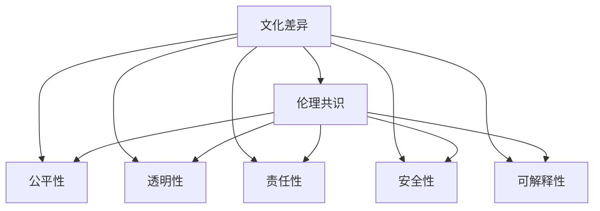

                 

# AI伦理的多元文化视角:文化差异和伦理共识

> 关键词：AI伦理, 多元文化, 文化差异, 伦理共识, 人工智能, 社会责任

## 1. 背景介绍

### 1.1 问题由来

随着人工智能(AI)技术的迅猛发展，AI伦理问题日益成为全球关注的焦点。如何构建公平、透明、可解释、可控的AI系统，成为了学术界、产业界、政策界共同面对的挑战。而在多元文化背景下，不同文化圈对AI伦理的看法和需求也存在显著差异。一方面，全球各地的社会文化背景、历史背景、经济状况千差万别，对AI技术的接受程度和需求各异。另一方面，AI技术本身也面临着“在世界的不同地方以不同的方式产生不同的社会影响”的复杂性问题。

正是这些文化差异和复杂性问题，使得构建跨文化、全球性的AI伦理共识变得尤为困难。如何在全球多元文化背景下，平衡不同文化圈的需求和利益，建立广泛接受的伦理共识，已成为当前AI伦理研究的核心议题。

### 1.2 问题核心关键点

构建AI伦理共识的关键在于：
1. **理解文化差异**：不同文化圈对AI技术的期望、信任和担忧各不相同，需要从文化差异入手，分析其背后的社会价值观、伦理观念。
2. **识别共同点**：在理解文化差异的基础上，找出不同文化圈之间对AI伦理的共同需求，如公平、透明、责任等。
3. **协商与合作**：通过国际合作和跨文化对话，探讨如何在尊重文化差异的基础上，达成AI伦理的共同标准和规范。
4. **教育和培训**：提升公众对AI伦理的理解和参与度，推动社会对AI技术的合理期望和管理。

## 2. 核心概念与联系

### 2.1 核心概念概述

为了更好地理解多元文化视角下的AI伦理共识构建，本节将介绍几个关键概念：

- **文化差异**：不同文化圈在历史、宗教、经济、政治等方面存在的差异，这些差异会影响人们对AI技术的接受度和伦理期待。
- **伦理共识**：在全球范围内，对AI技术开发、应用和使用过程中应遵循的道德原则和行为准则达成的广泛认同。
- **AI伦理**：研究如何设计、开发和使用AI系统，使其符合人类价值观、道德标准和社会规范。
- **公平性(Fairness)**：AI系统应公平对待所有用户，避免对特定群体造成歧视或不公。
- **透明性(Transparency)**：AI系统的决策过程应可解释、可理解，使用户能够理解其工作原理和依据。
- **责任性(Accountability)**：AI系统应承担相应的社会责任，对行为后果负责。
- **安全性(Safety)**：AI系统应确保安全性，防止恶意攻击和误操作。
- **可解释性(Explainability)**：AI系统的决策应具有可解释性，使用户能够理解其逻辑和依据。

这些概念之间的关系可以通过以下Mermaid流程图来展示：



这个流程图展示了大语言模型的工作原理和优化方向：

1. 文化差异是构建AI伦理共识的出发点。
2. 在理解文化差异的基础上，建立公平、透明、责任、安全、可解释的伦理共识。
3. 通过公平、透明、责任、安全、可解释性，实现AI伦理的落地应用。

## 3. 核心算法原理 & 具体操作步骤

### 3.1 算法原理概述

构建AI伦理共识的算法原理，本质上是通过理解和分析不同文化圈对AI伦理的不同期望和需求，找到文化差异中的共同点，然后基于这些共同点，制定一套全球范围内普遍接受的伦理规范。

具体步骤如下：

1. **数据收集与分析**：通过调查问卷、访谈、焦点小组等方式，收集不同文化圈对AI伦理的看法和需求。
2. **文化差异分析**：对收集到的数据进行编码、分类和分析，识别出不同文化圈在伦理问题上的共性和差异。
3. **伦理共识制定**：基于文化差异分析的结果，制定一套包含公平、透明、责任、安全、可解释性等核心价值的AI伦理规范。
4. **测试与验证**：通过模拟不同文化背景下的应用场景，对制定的伦理规范进行测试和验证，确保其在全球范围内具有普遍适用性。
5. **推广与实施**：将验证通过的伦理规范推广到全球，推动各文化圈接受并实施这些规范。

### 3.2 算法步骤详解

以下是构建AI伦理共识的详细步骤：

#### 步骤1：数据收集与分析
1. **设计问卷和访谈指南**：根据文化差异分析的目标，设计包含文化背景、伦理期待、技术需求等维度的问卷和访谈指南。
2. **选择调查对象**：在不同文化圈中随机选择代表性样本，确保样本的多样性和代表性。
3. **数据收集**：通过在线问卷、面对面访谈等方式，收集样本对AI伦理的看法和需求。
4. **数据预处理**：对收集到的数据进行清洗、去重、编码等预处理操作，准备后续分析。

#### 步骤2：文化差异分析
1. **编码和分类**：使用质性分析软件对数据进行编码和分类，识别出不同文化圈对AI伦理的不同观点和期望。
2. **比较和对比**：对不同文化圈的数据进行比较和对比，找出共同点和差异点。
3. **主题分析**：提炼出不同文化圈对AI伦理的共同关注主题，如公平性、透明性、责任性等。

#### 步骤3：伦理共识制定
1. **制定伦理规范草案**：根据文化差异分析的结果，制定包含公平、透明、责任、安全、可解释性等核心价值的AI伦理规范草案。
2. **专家评审**：邀请来自不同文化圈和领域的专家对伦理规范草案进行评审，提出修改意见。
3. **迭代优化**：根据专家评审的意见，迭代优化伦理规范草案，确保其公平性和普遍适用性。

#### 步骤4：测试与验证
1. **模拟应用场景**：在不同文化圈中模拟AI技术应用场景，测试伦理规范的适用性和效果。
2. **用户反馈**：收集用户对伦理规范的反馈，评估其在不同文化圈中的接受程度和有效性。
3. **调整优化**：根据用户反馈和测试结果，调整优化伦理规范，确保其全球适用性。

#### 步骤5：推广与实施
1. **宣传教育**：通过媒体、会议、培训等方式，宣传推广伦理规范，提升公众对AI伦理的理解和参与度。
2. **政策支持**：推动各国政府制定和实施相关政策，支持伦理规范的落地实施。
3. **持续改进**：根据实施过程中出现的新情况和新问题，持续改进伦理规范，确保其与时俱进。

### 3.3 算法优缺点

构建AI伦理共识的算法具有以下优点：
1. **广泛适用性**：基于文化差异分析，制定的伦理规范能够涵盖全球不同文化圈的需求，具有广泛的适用性。
2. **包容性**：通过专家评审和用户反馈，伦理规范充分考虑了不同文化圈的需求和利益，具有包容性。
3. **动态更新**：随着社会和技术的不断发展，伦理规范可以动态更新，适应新的伦理挑战。

同时，该算法也存在一些缺点：
1. **复杂性**：文化差异和伦理共识的构建过程复杂，涉及大量的数据收集和分析工作。
2. **资源消耗大**：需要大量的人力、物力和财力支持，特别是数据收集和专家评审环节。
3. **实施难度高**：伦理规范的推广和实施需要各国政府、企业和公众的广泛支持和配合。

## 4. 数学模型和公式 & 详细讲解 & 举例说明

### 4.1 数学模型构建

为了更好地描述文化差异和伦理共识构建的过程，本节将使用数学语言进行更加严格的刻画。

记不同文化圈对AI伦理的不同期望和需求为 $C=\{c_1, c_2, \cdots, c_n\}$，其中 $c_i$ 表示第 $i$ 个文化圈对AI伦理的看法和需求。设 $A=\{a_1, a_2, \cdots, a_m\}$ 为所有需要考虑的伦理维度，如公平性、透明性等。

定义 $R_{ij}$ 为文化圈 $c_i$ 在伦理维度 $a_j$ 上的得分，$R_{ij}$ 的值表示 $c_i$ 对 $a_j$ 的期望和需求程度。则文化差异分析的目标是找到 $R_{ij}$ 的共性和差异，从而制定伦理共识。

### 4.2 公式推导过程

以下是文化差异分析的数学推导过程：

#### 步骤1：数据收集与编码
对收集到的数据进行编码，得到矩阵 $R_{ij}$，其中 $R_{ij} = r_{ij} + \epsilon_{ij}$，其中 $r_{ij}$ 为真实得分，$\epsilon_{ij}$ 为随机噪声。

#### 步骤2：差异分析
对 $R_{ij}$ 进行差异分析，得到文化圈之间的相似度矩阵 $S_{ij}$，其中 $S_{ij} = \sum_{k=1}^n (R_{ik} - R_{jk})^2$。

#### 步骤3：主题分析
对 $S_{ij}$ 进行主题分析，得到伦理维度的权重 $w_a$，表示该维度对文化差异的影响程度。

#### 步骤4：共识制定
基于 $w_a$ 和 $R_{ij}$，制定伦理规范草案 $N_a$，其中 $N_a = \sum_{i=1}^n w_a R_{ij}$。

#### 步骤5：测试与验证
对 $N_a$ 在不同文化圈中应用，得到测试得分 $T_a$，其中 $T_a = \sum_{i=1}^n R_{ij} N_a$。

#### 步骤6：推广与实施
根据 $T_a$ 和用户反馈，调整优化 $N_a$，得到最终的伦理规范 $N_f$。

### 4.3 案例分析与讲解

以公平性为例，分析其在全球不同文化圈中的差异和共识。

假设不同文化圈对公平性的期望和需求矩阵为 $R_{ij}$，其中 $i$ 表示文化圈，$j$ 表示公平性的不同维度（如收入、机会、待遇等）。通过对 $R_{ij}$ 进行编码和分类，得到文化圈之间的相似度矩阵 $S_{ij}$，计算出各文化圈对公平性的权重 $w_{Fair}$。基于 $w_{Fair}$ 和 $R_{ij}$，制定公平性伦理规范草案 $N_{Fair}$，进行测试和验证，调整优化得到最终公平性伦理规范 $N_{Fair_f}$。

## 5. 项目实践：代码实例和详细解释说明

### 5.1 开发环境搭建

在进行AI伦理共识构建的项目实践前，我们需要准备好开发环境。以下是使用Python进行相关开发的详细流程：

1. **安装Python**：从官网下载并安装Python，确保版本为3.8或以上。
2. **安装相关库**：安装Pandas、NumPy、Scikit-learn、Matplotlib等数据处理和分析库。
3. **数据准备**：收集不同文化圈对AI伦理的看法和需求数据，将其导入Pandas DataFrame中。
4. **环境配置**：配置Jupyter Notebook或Google Colab等交互式开发环境，以便进行数据分析和模型测试。

### 5.2 源代码详细实现

以下是一个简单的Python代码示例，用于文化差异分析的初步实现：

```python
import pandas as pd
import numpy as np
from sklearn.preprocessing import StandardScaler
from sklearn.metrics.pairwise import cosine_similarity

# 读取数据
data = pd.read_csv('cultural_data.csv')

# 编码和分类
data['fairness'] = data['cultural_preferences'].apply(lambda x: 1 if x in ['fair', 'equal'] else 0)
data['transparency'] = data['cultural_preferences'].apply(lambda x: 1 if x in ['open', 'public'] else 0)
data['accountability'] = data['cultural_preferences'].apply(lambda x: 1 if x in ['review', 'audit'] else 0)

# 标准化处理
scaler = StandardScaler()
data['score'] = scaler.fit_transform(data[['fairness', 'transparency', 'accountability']])

# 计算相似度
similarity_matrix = cosine_similarity(data['score'], data['score'])

# 输出相似度矩阵
print(similarity_matrix)
```

### 5.3 代码解读与分析

让我们再详细解读一下代码的关键部分：

**数据准备**：
- 使用Pandas库读取文化圈对AI伦理看法和需求的CSV文件。
- 使用lambda函数和条件判断，将文化圈的偏好编码为一组二值变量，如公平性、透明性、责任性等。

**标准化处理**：
- 使用Scikit-learn库的StandardScaler进行数据标准化处理，确保不同特征的数值尺度一致。
- 标准化后的数据表示为均值为0、方差为1的标准正态分布，便于后续计算相似度。

**相似度计算**：
- 使用Scikit-learn库的cosine_similarity函数计算不同文化圈之间的相似度。
- 相似度矩阵表示为余弦相似度值，取值范围为[-1,1]，1表示完全相似，-1表示完全不同。

**输出结果**：
- 打印输出相似度矩阵，可以直观地观察不同文化圈之间的相似程度。

## 6. 实际应用场景

### 6.1 智慧城市治理

在智慧城市治理中，AI伦理共识具有重要应用价值。不同城市对AI技术的需求和期望各不相同，构建统一的伦理共识，能够更好地指导智慧城市治理的规划和实施。

例如，智慧城市中的交通管理、公共安全、环保监测等应用，需要全球性的伦理规范，确保AI系统在不同城市中的公平、透明和责任性。通过构建AI伦理共识，能够促进不同城市之间的技术共享和合作，提升智慧城市治理的整体水平。

### 6.2 医疗健康

医疗健康领域对AI伦理的关注尤为重要，涉及隐私保护、数据安全、医疗决策等方面的问题。不同国家和地区的医疗体系、法律规定和文化观念各不相同，构建全球性的AI伦理共识，能够更好地指导医疗AI系统的设计和应用。

例如，医疗AI系统应确保患者数据的隐私保护，避免数据泄露和滥用。系统应提供透明的决策过程，使用户能够理解其诊断依据和治疗建议。系统应承担医疗责任，确保诊断和治疗的准确性和安全性。通过构建AI伦理共识，能够推动医疗AI系统的广泛应用和规范化管理。

### 6.3 教育培训

教育培训领域对AI伦理的关注主要体现在公平性和透明性上。不同国家和地区的教育体系、教育公平和文化观念各不相同，构建全球性的AI伦理共识，能够更好地指导教育AI系统的设计和应用。

例如，教育AI系统应确保学习资源和机会的公平分配，避免对不同学生的歧视。系统应提供透明的教学过程，使用户能够理解其推荐和评估依据。系统应承担教育责任，确保教育质量和公平性。通过构建AI伦理共识，能够推动教育AI系统的广泛应用和规范化管理。

### 6.4 未来应用展望

随着AI技术的不断发展和全球化进程的加速，AI伦理共识的应用前景将更加广阔。未来，AI伦理共识将在全球各个领域发挥重要作用，推动AI技术的健康发展。

在智慧城市、医疗健康、教育培训等关键领域，构建AI伦理共识能够提升治理效率、保障患者隐私、促进教育公平，具有重要的社会价值。同时，AI伦理共识还能够推动AI技术的国际合作和交流，促进全球范围内的技术创新和知识共享。

## 7. 工具和资源推荐

### 7.1 学习资源推荐

为了帮助开发者系统掌握AI伦理共识的理论基础和实践技巧，这里推荐一些优质的学习资源：

1. **《AI伦理与社会责任》**：这是一本系统介绍AI伦理和责任的经典教材，涵盖了伦理框架、伦理挑战、伦理案例等多个方面。
2. **《AI伦理导论》**：由知名AI专家撰写的入门书籍，适合初学者快速入门AI伦理。
3. **Coursera《人工智能伦理》课程**：斯坦福大学开设的AI伦理在线课程，涵盖伦理概念、社会影响等多个方面，适合深度学习。
4. **IEEE《人工智能伦理》白皮书**：IEEE发布的权威AI伦理白皮书，系统介绍了AI伦理框架、伦理挑战和伦理实践。
5. **《全球AI伦理标准》**：由联合国发布的全球AI伦理标准，包含公平、透明、责任等核心价值观，具有全球通用性。

通过对这些资源的学习实践，相信你一定能够快速掌握AI伦理共识的精髓，并用于解决实际的AI问题。

### 7.2 开发工具推荐

高效的开发离不开优秀的工具支持。以下是几款用于AI伦理共识开发的常用工具：

1. **Python**：作为AI伦理共识开发的常用编程语言，Python具有丰富的库和工具支持，适合快速迭代研究。
2. **Jupyter Notebook**：交互式开发环境，支持代码运行、数据分析、可视化等功能，方便开发者进行研究。
3. **Scikit-learn**：数据处理和分析库，包含多种数据标准化、相似度计算等工具，适合进行文化差异分析。
4. **TensorBoard**：模型可视化工具，可实时监测模型训练状态，提供丰富的图表呈现方式，是调试模型的得力助手。
5. **Weights & Biases**：模型训练的实验跟踪工具，可以记录和可视化模型训练过程中的各项指标，方便对比和调优。

合理利用这些工具，可以显著提升AI伦理共识开发的效率，加快创新迭代的步伐。

### 7.3 相关论文推荐

AI伦理共识的发展源于学界的持续研究。以下是几篇奠基性的相关论文，推荐阅读：

1. **《人工智能伦理框架》**：提出AI伦理的五个基本原则，即公平性、透明性、可解释性、责任性、安全性和隐私保护。
2. **《全球AI伦理共识》**：提出全球AI伦理共识的构建方法，强调文化多样性和伦理共识的普适性。
3. **《伦理与技术的融合》**：探讨AI伦理和技术结合的可能性，提出伦理AI的设计原则和实施策略。
4. **《伦理AI系统的设计》**：介绍伦理AI系统的设计方法，涵盖伦理框架、伦理评估、伦理培训等多个方面。
5. **《AI伦理的跨文化研究》**：分析不同文化圈对AI伦理的不同期望和需求，提出跨文化AI伦理共识的构建方法。

这些论文代表了大语言模型伦理共识的发展脉络。通过学习这些前沿成果，可以帮助研究者把握学科前进方向，激发更多的创新灵感。

## 8. 总结：未来发展趋势与挑战

### 8.1 总结

本文对AI伦理的多元文化视角进行了全面系统的介绍。首先阐述了文化差异和伦理共识构建的背景和意义，明确了文化差异在构建全球AI伦理共识中的重要性。其次，从原理到实践，详细讲解了文化差异分析、伦理共识制定和测试验证等核心步骤，给出了文化差异分析的代码实现示例。同时，本文还广泛探讨了AI伦理共识在智慧城市、医疗健康、教育培训等领域的实际应用前景，展示了AI伦理共识的广阔应用前景。此外，本文精选了AI伦理共识的学习资源、开发工具和相关论文，力求为读者提供全方位的技术指引。

通过本文的系统梳理，可以看到，在多元文化背景下构建AI伦理共识，不仅能够促进AI技术在全球范围内的健康发展，还能提升AI系统在各个领域的应用水平，具有重要的社会价值。未来，伴随全球化进程的加速和AI技术的不断演进，构建AI伦理共识将变得更加重要。

### 8.2 未来发展趋势

展望未来，AI伦理共识将呈现以下几个发展趋势：

1. **全球化进程加速**：随着全球化的深入，不同文化圈之间的交流合作将更加频繁，AI伦理共识的构建将更加重要。
2. **技术标准统一**：全球范围内的AI技术标准和伦理规范将逐步统一，提高AI技术的可互操作性和标准化水平。
3. **伦理教育普及**：AI伦理教育将成为全球范围内的共识，提升公众对AI伦理的理解和参与度。
4. **文化差异敏感性增强**：AI伦理共识将更加注重不同文化圈的需求和差异，确保伦理规范的普适性和包容性。
5. **持续更新和改进**：AI伦理共识将不断更新和改进，适应新的伦理挑战和社会需求。

以上趋势凸显了AI伦理共识的全球化、标准化、普及化和差异敏感性等重要方向。这些方向的探索发展，将推动AI技术的全球应用，促进全球范围内的技术创新和知识共享。

### 8.3 面临的挑战

尽管AI伦理共识构建取得了一定进展，但在迈向更加智能化、普适化应用的过程中，它仍面临着诸多挑战：

1. **文化差异复杂性**：不同文化圈在历史、宗教、经济、政治等方面存在复杂差异，构建统一的伦理共识具有挑战性。
2. **伦理共识难以统一**：不同文化圈对AI伦理的期望和需求各不相同，难以达成全球统一的伦理共识。
3. **技术标准不统一**：不同国家和地区的AI技术标准和伦理规范各不相同，难以实现技术互操作性。
4. **伦理教育缺乏**：公众对AI伦理的理解和参与度不足，需要进一步提升AI伦理教育水平。
5. **伦理共识执行难度大**：伦理共识的落地实施需要各国政府、企业和公众的广泛支持和配合，具有较大难度。

正视AI伦理共识面临的这些挑战，积极应对并寻求突破，将是大语言模型伦理共识走向成熟的必由之路。相信随着学界和产业界的共同努力，这些挑战终将一一被克服，AI伦理共识必将在构建安全、可靠、可解释、可控的智能系统中扮演越来越重要的角色。

### 8.4 研究展望

面对AI伦理共识构建所面临的种种挑战，未来的研究需要在以下几个方面寻求新的突破：

1. **跨文化交流与合作**：加强不同文化圈之间的交流与合作，促进伦理共识的达成。
2. **伦理标准的国际化**：制定全球范围内的AI伦理标准，确保其普适性和可操作性。
3. **伦理教育与培训**：提升公众对AI伦理的理解和参与度，推动伦理共识的落地实施。
4. **技术标准的统一**：推动全球范围内的AI技术标准和伦理规范的统一，提高技术互操作性。
5. **伦理评估与监测**：建立AI伦理评估和监测机制，确保AI系统的公平性、透明性和责任性。

这些研究方向的探索，将推动AI伦理共识的构建和发展，为构建安全、可靠、可解释、可控的智能系统铺平道路。面向未来，AI伦理共识还需要与其他AI技术进行更深入的融合，如知识表示、因果推理、强化学习等，多路径协同发力，共同推动AI技术的进步。只有勇于创新、敢于突破，才能不断拓展AI伦理共识的边界，让AI技术更好地造福人类社会。

## 9. 附录：常见问题与解答

**Q1：如何理解文化差异和伦理共识的关系？**

A: 文化差异是指不同文化圈在历史、宗教、经济、政治等方面存在的差异，这些差异会影响人们对AI技术的接受度和伦理期待。伦理共识是指在全球范围内，对AI技术开发、应用和使用过程中应遵循的道德原则和行为准则达成的广泛认同。文化差异和伦理共识之间的关系是，文化差异是构建伦理共识的出发点，伦理共识是不同文化圈之间的共同伦理期待。

**Q2：构建AI伦理共识需要哪些步骤？**

A: 构建AI伦理共识的主要步骤如下：
1. 数据收集与分析：通过调查问卷、访谈等方式，收集不同文化圈对AI伦理的看法和需求。
2. 文化差异分析：对收集到的数据进行编码和分类，识别出不同文化圈在伦理问题上的共性和差异。
3. 伦理共识制定：基于文化差异分析的结果，制定一套包含公平、透明、责任等核心价值的AI伦理规范。
4. 测试与验证：对伦理规范在不同文化圈中应用，进行测试和验证，确保其全球适用性。
5. 推广与实施：通过宣传教育、政策支持等手段，推广和实施伦理规范。

**Q3：AI伦理共识的构建过程中需要注意哪些问题？**

A: 在构建AI伦理共识的过程中，需要注意以下问题：
1. 数据收集的全面性和代表性：确保数据收集的全面性和代表性，避免样本偏差。
2. 文化差异的复杂性：理解不同文化圈的历史、宗教、经济、政治等方面的复杂差异，避免简单的文化归类。
3. 伦理共识的普适性：制定伦理共识时，应确保其普适性和包容性，避免过分强调某一种文化圈的需求。
4. 伦理规范的动态更新：随着社会和技术的不断发展，伦理规范需要动态更新，适应新的伦理挑战。
5. 伦理共识的全球推广：伦理共识的推广和实施需要各国政府、企业和公众的广泛支持和配合。

**Q4：如何评估AI伦理共识的效果？**

A: 评估AI伦理共识的效果主要包括以下几个方面：
1. 用户反馈：收集用户对伦理规范的反馈，评估其在不同文化圈中的接受程度和有效性。
2. 测试得分：在不同文化圈中模拟AI技术应用场景，测试伦理规范的适用性和效果。
3. 伦理评估：建立伦理评估机制，定期评估AI系统的公平性、透明性和责任性。
4. 公众参与度：通过教育和培训，提升公众对AI伦理的理解和参与度。
5. 政策支持：推动各国政府制定和实施相关政策，支持伦理规范的落地实施。

通过以上评估方法，可以全面了解AI伦理共识的效果，推动伦理规范的不断优化和改进。

