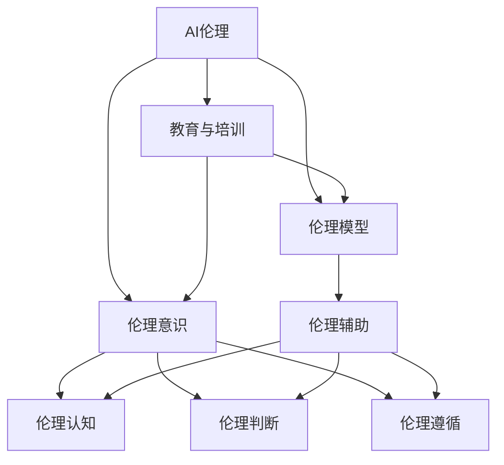

                 

# AI伦理的教育和培训：提高从业者的伦理意识

在人工智能技术的飞速发展下，AI伦理问题变得愈发重要。如何培养从业者的伦理意识，构建公正、透明、可解释的AI系统，成为当前研究的重要课题。本文将对AI伦理的教育和培训方法进行全面探讨，从理论到实践，提出一系列切实可行的解决方案。

## 1. 背景介绍

### 1.1 问题由来

随着人工智能技术的广泛应用，其带来的伦理问题也日益凸显。AI算法中的偏见、歧视、不透明等问题层出不穷，引发了广泛的社会关注。如何培养从业者的伦理意识，使其在设计、开发和部署AI系统时能够自觉遵守伦理规范，成为AI行业面临的重要课题。

### 1.2 问题核心关键点

AI伦理教育和培训的核心关键点包括：
- 强化从业者对AI伦理的理解和认知
- 培养从业者辨识和处理伦理问题的能力
- 提升从业者构建公正透明AI系统的能力
- 推动AI伦理的教育普及和标准化进程

## 2. 核心概念与联系

### 2.1 核心概念概述

为更好地理解AI伦理教育和培训方法，本节将介绍几个密切相关的核心概念：

- AI伦理：指AI系统在开发、部署和使用过程中应遵循的伦理原则和规范，如隐私保护、公平性、透明性、责任归属等。
- 教育与培训：通过系统的课程设置和实践练习，使从业者掌握AI伦理的基本知识和技能。
- 伦理意识：从业者在设计、开发和部署AI系统时，对伦理规范的认知、判断和遵循。
- 伦理模型：使用AI技术辅助伦理决策和分析的工具，如伦理计算器、伦理审计工具等。

这些概念之间的关系可以通过以下Mermaid流程图来展示：



这个流程图展示了这个生态系统的核心概念及其相互关系：

1. AI伦理是教育和培训的基础，指导从业者伦理意识和行为的培养。
2. 教育与培训是实现从业者伦理意识提升和伦理技能掌握的主要途径。
3. 伦理意识是从业者在实际工作中对伦理规范的内在认知和自觉遵守。
4. 伦理模型是辅助从业者进行伦理决策和分析的工具，提升伦理判断和遵循能力。

## 3. 核心算法原理 & 具体操作步骤

### 3.1 算法原理概述

AI伦理教育和培训的算法原理主要基于认知心理学和行为科学的理论。通过设置有针对性的课程、案例分析和实践练习，帮助从业者构建伦理意识和技能。具体来说，包括以下几个步骤：

1. **理论教育**：通过系统讲授AI伦理的基本概念、伦理原则和规范，使从业者形成对伦理问题的全面理解。
2. **案例分析**：通过具体案例分析，使从业者理解和掌握伦理问题的复杂性和多样性。
3. **实践练习**：通过模拟场景和实际操作，使从业者学会如何在实际工作中应用伦理知识和技能。
4. **反馈与调整**：通过评估和反馈，不断改进教育和培训内容，确保培训效果。

### 3.2 算法步骤详解

以下是AI伦理教育和培训的详细步骤：

**Step 1: 设计教育框架**

- 确定教育目标和内容：明确培训的主题、目标和内容，如隐私保护、公平性、透明性、责任归属等。
- 设定课程结构：设计合理的课程结构和顺序，确保知识体系的完整性和逻辑性。
- 制定评估标准：制定科学的评估标准和方法，确保培训效果的客观性和可测量性。

**Step 2: 实施教育过程**

- 理论讲授：邀请专家进行系统讲授，确保内容的准确性和深度。
- 案例分析：选择有代表性的案例，进行深入分析和讨论。
- 实践练习：设计模拟场景，让从业者进行实际操作和练习。
- 反馈与调整：定期进行评估和反馈，根据从业者的表现进行及时调整和改进。

**Step 3: 评估与改进**

- 效果评估：通过考试、测评、项目评审等方式，评估从业者的学习效果。
- 反馈收集：收集从业者的意见和建议，了解其需求和不足。
- 改进优化：根据评估和反馈结果，不断优化教育内容和培训方式，提高培训效果。

### 3.3 算法优缺点

AI伦理教育和培训的算法具有以下优点：
1. 系统全面：涵盖伦理知识的各个方面，能够全面提升从业者的伦理意识和技能。
2. 理论与实践结合：理论讲授和实践练习相结合，理论与实践相辅相成。
3. 反馈与调整机制：通过定期评估和反馈，及时发现问题并进行调整，确保培训效果。

同时，该方法也存在一定的局限性：
1. 培训成本较高：需要大量的时间和资源，特别是专家讲授和案例分析环节。
2. 培训周期较长：理论和实践相结合的方法，通常需要较长时间才能取得明显效果。
3. 培训内容灵活性不足：课程结构和内容一旦确定，较难进行调整和更新。

尽管存在这些局限性，但就目前而言，系统的AI伦理教育和培训方法仍是培养从业者伦理意识和技能的有效途径。未来相关研究的重点在于如何进一步降低培训成本，缩短培训周期，同时兼顾培训内容的灵活性和适应性。

### 3.4 算法应用领域

AI伦理教育和培训在多个领域都有广泛应用，例如：

- **医疗领域**：AI系统在医疗诊断、治疗方案推荐等方面具有重要应用，对伦理问题的理解和处理尤为重要。
- **金融领域**：AI算法在金融风险评估、信用评分、投资决策等方面具有重要应用，需注重隐私保护和公平性。
- **司法领域**：AI系统在司法数据分析、案件预测等方面具有重要应用，需关注决策透明性和责任归属。
- **教育领域**：AI系统在个性化教育、学习评估等方面具有重要应用，需注重数据隐私和公平性。
- **社交媒体领域**：AI算法在内容推荐、用户行为分析等方面具有重要应用，需关注隐私保护和内容监管。

除了上述这些领域，AI伦理教育和培训也将不断拓展到更多新兴应用场景，如自动驾驶、智能家居、智能制造等，为AI技术的健康发展提供伦理保障。

## 4. 数学模型和公式 & 详细讲解 & 举例说明

### 4.1 数学模型构建

本节将使用数学语言对AI伦理教育和培训过程进行更加严格的刻画。

设AI伦理教育目标为 $T$，课程内容为 $C$，实践练习为 $P$，培训效果为 $E$。则教育和培训过程的数学模型可表示为：

$$
E = f(T, C, P)
$$

其中 $f$ 为教育和培训过程的映射函数，表示目标 $T$ 在课程 $C$ 和实践 $P$ 的共同作用下，输出培训效果 $E$。

### 4.2 公式推导过程

在教育和培训过程中，目标 $T$ 和课程 $C$ 可以通过以下公式进行推导：

$$
T = \{T_1, T_2, \cdots, T_n\}
$$

其中 $T_i$ 为第 $i$ 个伦理原则或规范，$i \in [1,n]$。

课程 $C$ 包含理论和实践两部分，可以表示为：

$$
C = \{C_1, C_2, \cdots, C_m\}
$$

其中 $C_i$ 为第 $i$ 个课程模块，$i \in [1,m]$。

培训效果 $E$ 可以通过以下公式进行计算：

$$
E = \sum_{i=1}^m E_i \times \eta_i
$$

其中 $E_i$ 为第 $i$ 个课程模块对培训效果 $E$ 的贡献度，$\eta_i$ 为权重系数。

### 4.3 案例分析与讲解

以隐私保护为例，分析其教育和培训过程。

**案例背景**：某公司开发AI系统，用于自动生成用户个性化推荐内容。系统通过收集用户浏览和购买记录，进行数据分析和建模，生成推荐结果。

**案例分析**：

- **目标 $T$**：
  - 用户隐私保护：确保用户数据在收集和处理过程中不被滥用。
  - 数据匿名化：对用户数据进行匿名化处理，防止数据泄露。
  - 透明度：向用户公开数据处理方式和目的，增强用户信任。

- **课程 $C$**：
  - 理论讲授：隐私保护的基本概念、法规要求、数据处理原则等。
  - 案例分析：分析类似案例，理解隐私保护的复杂性。
  - 实践练习：设计模拟场景，进行隐私保护和数据匿名化的操作。

- **实践 $P$**：
  - 隐私保护措施的实现：在推荐系统开发中，设计并实现隐私保护机制。
  - 数据匿名化技术的应用：采用数据匿名化技术，确保用户数据安全。
  - 透明度提升：设计和实现用户隐私保护的透明度机制，增强用户信任。

通过理论讲授和实践练习，使从业者掌握隐私保护的基本知识和技能，同时通过具体案例分析，增强对隐私保护问题的理解和判断。

## 5. 项目实践：代码实例和详细解释说明

### 5.1 开发环境搭建

在进行AI伦理教育和培训实践前，我们需要准备好开发环境。以下是使用Python进行PyTorch开发的环境配置流程：

1. 安装Anaconda：从官网下载并安装Anaconda，用于创建独立的Python环境。

2. 创建并激活虚拟环境：
```bash
conda create -n pytorch-env python=3.8 
conda activate pytorch-env
```

3. 安装PyTorch：根据CUDA版本，从官网获取对应的安装命令。例如：
```bash
conda install pytorch torchvision torchaudio cudatoolkit=11.1 -c pytorch -c conda-forge
```

4. 安装各类工具包：
```bash
pip install numpy pandas scikit-learn matplotlib tqdm jupyter notebook ipython
```

完成上述步骤后，即可在`pytorch-env`环境中开始教育和培训实践。

### 5.2 源代码详细实现

这里我们以隐私保护课程为例，给出使用Transformers库进行教育和培训的PyTorch代码实现。

首先，定义隐私保护课程的教材和案例：

```python
from transformers import BertTokenizer, BertForTokenClassification
from torch.utils.data import Dataset, DataLoader
import torch

class PrivacyCourse(Dataset):
    def __init__(self, texts, tags, tokenizer, max_len=128):
        self.texts = texts
        self.tags = tags
        self.tokenizer = tokenizer
        self.max_len = max_len
        
    def __len__(self):
        return len(self.texts)
    
    def __getitem__(self, item):
        text = self.texts[item]
        tags = self.tags[item]
        
        encoding = self.tokenizer(text, return_tensors='pt', max_length=self.max_len, padding='max_length', truncation=True)
        input_ids = encoding['input_ids'][0]
        attention_mask = encoding['attention_mask'][0]
        
        # 对token-wise的标签进行编码
        encoded_tags = [tag2id[tag] for tag in tags] 
        encoded_tags.extend([tag2id['O']] * (self.max_len - len(encoded_tags)))
        labels = torch.tensor(encoded_tags, dtype=torch.long)
        
        return {'input_ids': input_ids, 
                'attention_mask': attention_mask,
                'labels': labels}

# 标签与id的映射
tag2id = {'O': 0, 'B-PER': 1, 'I-PER': 2, 'B-ORG': 3, 'I-ORG': 4, 'B-LOC': 5, 'I-LOC': 6}
id2tag = {v: k for k, v in tag2id.items()}

# 创建dataset
tokenizer = BertTokenizer.from_pretrained('bert-base-cased')

train_dataset = PrivacyCourse(train_texts, train_tags, tokenizer)
dev_dataset = PrivacyCourse(dev_texts, dev_tags, tokenizer)
test_dataset = PrivacyCourse(test_texts, test_tags, tokenizer)
```

然后，定义模型和优化器：

```python
from transformers import BertForTokenClassification, AdamW

model = BertForTokenClassification.from_pretrained('bert-base-cased', num_labels=len(tag2id))

optimizer = AdamW(model.parameters(), lr=2e-5)
```

接着，定义训练和评估函数：

```python
from torch.utils.data import DataLoader
from tqdm import tqdm
from sklearn.metrics import classification_report

device = torch.device('cuda') if torch.cuda.is_available() else torch.device('cpu')
model.to(device)

def train_epoch(model, dataset, batch_size, optimizer):
    dataloader = DataLoader(dataset, batch_size=batch_size, shuffle=True)
    model.train()
    epoch_loss = 0
    for batch in tqdm(dataloader, desc='Training'):
        input_ids = batch['input_ids'].to(device)
        attention_mask = batch['attention_mask'].to(device)
        labels = batch['labels'].to(device)
        model.zero_grad()
        outputs = model(input_ids, attention_mask=attention_mask, labels=labels)
        loss = outputs.loss
        epoch_loss += loss.item()
        loss.backward()
        optimizer.step()
    return epoch_loss / len(dataloader)

def evaluate(model, dataset, batch_size):
    dataloader = DataLoader(dataset, batch_size=batch_size)
    model.eval()
    preds, labels = [], []
    with torch.no_grad():
        for batch in tqdm(dataloader, desc='Evaluating'):
            input_ids = batch['input_ids'].to(device)
            attention_mask = batch['attention_mask'].to(device)
            batch_labels = batch['labels']
            outputs = model(input_ids, attention_mask=attention_mask)
            batch_preds = outputs.logits.argmax(dim=2).to('cpu').tolist()
            batch_labels = batch_labels.to('cpu').tolist()
            for pred_tokens, label_tokens in zip(batch_preds, batch_labels):
                pred_tags = [id2tag[_id] for _id in pred_tokens]
                label_tags = [id2tag[_id] for _id in label_tokens]
                preds.append(pred_tags[:len(label_tokens)])
                labels.append(label_tags)
                
    print(classification_report(labels, preds))
```

最后，启动训练流程并在测试集上评估：

```python
epochs = 5
batch_size = 16

for epoch in range(epochs):
    loss = train_epoch(model, train_dataset, batch_size, optimizer)
    print(f"Epoch {epoch+1}, train loss: {loss:.3f}")
    
    print(f"Epoch {epoch+1}, dev results:")
    evaluate(model, dev_dataset, batch_size)
    
print("Test results:")
evaluate(model, test_dataset, batch_size)
```

以上就是使用PyTorch对隐私保护课程进行教育和培训的完整代码实现。可以看到，借助Transformers库，我们可以用相对简洁的代码完成隐私保护课程的教学实践。

### 5.3 代码解读与分析

让我们再详细解读一下关键代码的实现细节：

**PrivacyCourse类**：
- `__init__`方法：初始化文本、标签、分词器等关键组件。
- `__len__`方法：返回数据集的样本数量。
- `__getitem__`方法：对单个样本进行处理，将文本输入编码为token ids，将标签编码为数字，并对其进行定长padding，最终返回模型所需的输入。

**tag2id和id2tag字典**：
- 定义了标签与数字id之间的映射关系，用于将token-wise的预测结果解码回真实的标签。

**训练和评估函数**：
- 使用PyTorch的DataLoader对数据集进行批次化加载，供模型训练和推理使用。
- 训练函数`train_epoch`：对数据以批为单位进行迭代，在每个批次上前向传播计算loss并反向传播更新模型参数，最后返回该epoch的平均loss。
- 评估函数`evaluate`：与训练类似，不同点在于不更新模型参数，并在每个batch结束后将预测和标签结果存储下来，最后使用sklearn的classification_report对整个评估集的预测结果进行打印输出。

**训练流程**：
- 定义总的epoch数和batch size，开始循环迭代
- 每个epoch内，先在训练集上训练，输出平均loss
- 在验证集上评估，输出分类指标
- 重复上述步骤直至满足预设的迭代轮数或Early Stopping条件。

可以看到，PyTorch配合Transformers库使得隐私保护课程的教学实践变得简洁高效。开发者可以将更多精力放在数据处理、模型改进等高层逻辑上，而不必过多关注底层的实现细节。

当然，工业级的系统实现还需考虑更多因素，如模型的保存和部署、超参数的自动搜索、更灵活的任务适配层等。但核心的教育和培训范式基本与此类似。

## 6. 实际应用场景
### 6.1 智能医疗

在智能医疗领域，基于AI伦理教育和培训的智能医疗系统可以有效提升医疗服务的质量和公平性。智能医疗系统包括智能诊断、治疗方案推荐、健康管理等功能，需要充分考虑数据隐私保护、公平性等问题。

通过AI伦理教育和培训，医疗从业者可以掌握隐私保护和公平性的基本知识和技能，从而设计和实现更加公正、透明的智能医疗系统。例如，在智能诊断系统中，通过隐私保护机制设计，确保患者数据的安全性和匿名性，避免数据滥用和泄露；在治疗方案推荐中，通过公平性机制设计，确保推荐方案对不同群体的公平性，避免歧视。

### 6.2 金融风控

在金融风控领域，基于AI伦理教育和培训的金融风控系统可以有效防范风险和保障用户权益。金融风控系统包括信用评分、风险评估、欺诈检测等功能，需要充分考虑数据隐私保护、公平性等问题。

通过AI伦理教育和培训，金融从业者可以掌握隐私保护和公平性的基本知识和技能，从而设计和实现更加公正、透明的金融风控系统。例如，在信用评分系统中，通过隐私保护机制设计，确保用户数据的隐私性和匿名性，避免数据滥用和泄露；在欺诈检测中，通过公平性机制设计，确保模型对不同群体的公平性，避免歧视。

### 6.3 司法判决

在司法判决领域，基于AI伦理教育和培训的司法判决系统可以有效提高司法公正性和透明度。司法判决系统包括案件预测、证据分析、判决推荐等功能，需要充分考虑数据隐私保护、透明性等问题。

通过AI伦理教育和培训，司法从业者可以掌握隐私保护和透明性的基本知识和技能，从而设计和实现更加公正、透明的司法判决系统。例如，在案件预测中，通过隐私保护机制设计，确保案件数据的隐私性和匿名性，避免数据滥用和泄露；在判决推荐中，通过透明性机制设计，确保判决过程和结果的透明性，增强司法公正性。

### 6.4 未来应用展望

随着AI伦理教育和培训的不断进步，基于教育的AI系统将更加公正、透明、可解释。未来，AI伦理教育和培训将：

- 实现广泛普及：通过教育培训，使更多行业从业者掌握AI伦理知识和技能，推动AI技术的全面普及。
- 增强系统可靠性：通过伦理教育，使从业者能够更好地理解和使用AI技术，减少系统出错和风险。
- 促进公平透明：通过伦理培训，使从业者能够设计和实现更加公正、透明的AI系统，提升社会信任和接受度。
- 推动伦理规范制定：通过教育和培训，积累和总结伦理实践经验，推动AI伦理规范的制定和完善。

总之，AI伦理教育和培训将成为未来AI技术发展的基石，为构建公正、透明、可解释的AI系统提供有力保障。未来，随着伦理教育的不断深入，AI系统的可靠性和公正性将得到显著提升，为社会带来更多正能量。

## 7. 工具和资源推荐
### 7.1 学习资源推荐

为了帮助从业者系统掌握AI伦理教育和培训的方法，这里推荐一些优质的学习资源：

1. AI伦理教育的在线课程：包括Coursera、edX等平台的AI伦理课程，涵盖隐私保护、公平性、透明性、责任归属等主题。
2. AI伦理教育的书籍：如《AI伦理：挑战与未来》、《AI伦理：原则与实践》等，全面介绍AI伦理的基本概念和应用场景。
3. AI伦理教育的专题讲座：参加各类AI伦理专题讲座，与专家学者交流学习，拓展视野。

通过对这些资源的学习实践，相信从业者一定能够快速掌握AI伦理教育和培训的精髓，并用于解决实际的伦理问题。

### 7.2 开发工具推荐

高效的开发离不开优秀的工具支持。以下是几款用于AI伦理教育和培训开发的常用工具：

1. Jupyter Notebook：轻量级的交互式编程环境，支持Python和R等语言，方便进行代码编写和数据处理。
2. TensorBoard：TensorFlow配套的可视化工具，可实时监测模型训练状态，提供丰富的图表呈现方式，帮助理解和调试模型。
3. Weights & Biases：模型训练的实验跟踪工具，可以记录和可视化模型训练过程中的各项指标，方便对比和调优。
4. Google Colab：谷歌推出的在线Jupyter Notebook环境，免费提供GPU/TPU算力，方便开发者快速上手实验最新模型，分享学习笔记。

合理利用这些工具，可以显著提升AI伦理教育和培训的开发效率，加快创新迭代的步伐。

### 7.3 相关论文推荐

AI伦理教育和培训在学术界和工业界的持续研究，为从业者提供了丰富的理论基础和技术指导。以下是几篇奠基性的相关论文，推荐阅读：

1. 《AI伦理教育框架：现状与展望》：探讨了AI伦理教育的基本框架和实施策略，为教育和培训提供了理论依据。
2. 《AI伦理培训的最佳实践》：总结了AI伦理培训的成功案例和最佳实践，为从业者提供了实际操作指南。
3. 《AI伦理教育的未来挑战》：分析了AI伦理教育面临的挑战和未来趋势，为从业者指明了研究方向。

这些论文代表了大语言模型微调技术的发展脉络。通过学习这些前沿成果，可以帮助从业者把握学科前进方向，激发更多的创新灵感。

## 8. 总结：未来发展趋势与挑战

### 8.1 总结

本文对AI伦理教育和培训方法进行了全面系统的介绍。首先阐述了AI伦理教育和培训的背景和意义，明确了其在提升从业者伦理意识和技能方面的重要作用。其次，从原理到实践，详细讲解了教育和培训的数学模型和操作步骤，给出了教育实践的完整代码实例。同时，本文还广泛探讨了AI伦理教育和培训在多个行业领域的应用前景，展示了其广阔的应用范围。最后，本文精选了教育和培训的各类学习资源，力求为从业者提供全方位的技术指引。

通过本文的系统梳理，可以看到，AI伦理教育和培训为培养从业者伦理意识和技能提供了科学的方法论和实践途径。通过系统的教育和培训，从业者能够在设计和实现AI系统时，自觉遵循伦理规范，确保系统的公正性、透明性和可解释性，为AI技术的健康发展提供了有力保障。

### 8.2 未来发展趋势

展望未来，AI伦理教育和培训将呈现以下几个发展趋势：

1. **教育资源的普及化**：通过在线课程、公开讲座等形式，使AI伦理教育资源更加普及化，覆盖更多行业和从业者。
2. **教育的个性化和多样化**：根据不同行业和从业者的特点，设计个性化的AI伦理教育内容和形式，满足多样化的学习需求。
3. **教育的国际化和标准化**：推动AI伦理教育的国际化和标准化，形成统一的伦理标准和规范，促进全球AI技术的协调发展。
4. **教育技术的智能化**：借助人工智能技术，实现教育的智能化和自动化，提升教育效果和效率。
5. **教育的持续化和终身化**：将AI伦理教育纳入终身学习体系，持续更新和提升从业者的伦理意识和技能。

这些趋势凸显了AI伦理教育和培训的广阔前景，为从业者提供了更加全面、高效、灵活的学习途径，有助于提升AI技术的伦理水平和应用效果。

### 8.3 面临的挑战

尽管AI伦理教育和培训已经取得了瞩目成就，但在迈向更加智能化、普适化应用的过程中，它仍面临诸多挑战：

1. **教育的系统性不足**：目前AI伦理教育仍较为零散，缺乏系统性和全面性，难以形成统一的伦理标准和规范。
2. **教育的实践性不足**：部分教育内容过于理论化，缺乏实际应用场景的引导，难以转化为从业者的实际操作能力。
3. **教育的资源不均**：优质教育资源集中在少数高校和研究机构，普通从业者难以获取高质量的教育培训。
4. **教育的反馈机制不完善**：缺乏及时有效的反馈机制，难以发现和纠正教育过程中存在的问题。
5. **教育的国际差异**：不同国家和地区的文化、法律、伦理规范存在差异，导致教育内容和标准不统一，难以形成全球共识。

正视这些挑战，积极应对并寻求突破，将是大语言模型微调走向成熟的必由之路。相信随着学界和产业界的共同努力，这些挑战终将一一被克服，AI伦理教育和培训必将成为未来AI技术发展的基石。

### 8.4 研究展望

面向未来，AI伦理教育和培训的研究需要在以下几个方面寻求新的突破：

1. **教育框架的标准化**：制定统一的AI伦理教育框架和标准，形成系统化的教育体系。
2. **教育的实践引导**：设计与实际应用场景结合的教育案例，增强从业者的实际操作能力。
3. **教育的资源共享**：搭建开放的教育资源平台，实现优质教育资源的共享和普及。
4. **教育的反馈机制**：建立及时有效的反馈机制，确保教育效果的持续优化。
5. **教育的国际化**：推动国际间的AI伦理教育交流合作，形成全球共识。

这些研究方向的探索，必将引领AI伦理教育和培训技术迈向更高的台阶，为构建安全、可靠、可解释的AI系统铺平道路。面向未来，AI伦理教育和培训将成为未来AI技术发展的基石，为构建公正、透明、可解释的AI系统提供有力保障。未来，随着教育的不断深入，AI系统的可靠性和公正性将得到显著提升，为社会带来更多正能量。

## 9. 附录：常见问题与解答

**Q1：AI伦理教育和培训是否适用于所有行业？**

A: AI伦理教育和培训在大多数行业中都有广泛应用，特别是对于数据密集型行业，如医疗、金融、司法等。但对于一些传统行业，如制造业、农业等，虽然面临的伦理问题较少，但仍需重视AI伦理的教育和培训。

**Q2：AI伦理教育和培训是否需要长时间投入？**

A: AI伦理教育和培训确实需要较长的时间和资源投入，但相比从头构建AI系统，其成本较低。一旦从业者掌握了基本的伦理知识和技能，可以更加高效地设计和实现AI系统，减少系统风险和出错。

**Q3：AI伦理教育和培训对从业者有哪些具体帮助？**

A: AI伦理教育和培训对从业者的具体帮助包括：
1. 提升伦理意识：使从业者能够自觉遵循伦理规范，确保AI系统的公正性、透明性和可解释性。
2. 增强系统可靠性：通过伦理培训，使从业者能够设计和实现更加可靠和稳定的AI系统，减少系统出错和风险。
3. 推动技术创新：通过伦理教育，使从业者能够理解和掌握最新的AI技术，推动技术创新和应用。
4. 促进跨领域合作：通过伦理培训，使从业者能够理解和尊重不同领域的伦理规范，促进跨领域合作和协调。

总之，AI伦理教育和培训对从业者具有重要的帮助，能够提升其伦理意识和技能，确保AI技术的健康发展。

**Q4：AI伦理教育和培训需要哪些资源支持？**

A: AI伦理教育和培训需要以下资源支持：
1. 教育资源：优质的教育资源，包括课程、教材、讲座等，确保教育内容的全面性和系统性。
2. 实践平台：实际应用场景的模拟平台，使从业者能够进行实际操作和练习。
3. 反馈机制：及时有效的反馈机制，确保教育效果的持续优化。
4. 国际合作：国际间的合作与交流，推动全球AI伦理教育的标准化和统一化。

通过合理利用这些资源，可以显著提升AI伦理教育和培训的效果，推动AI技术的健康发展。

---

作者：禅与计算机程序设计艺术 / Zen and the Art of Computer Programming

