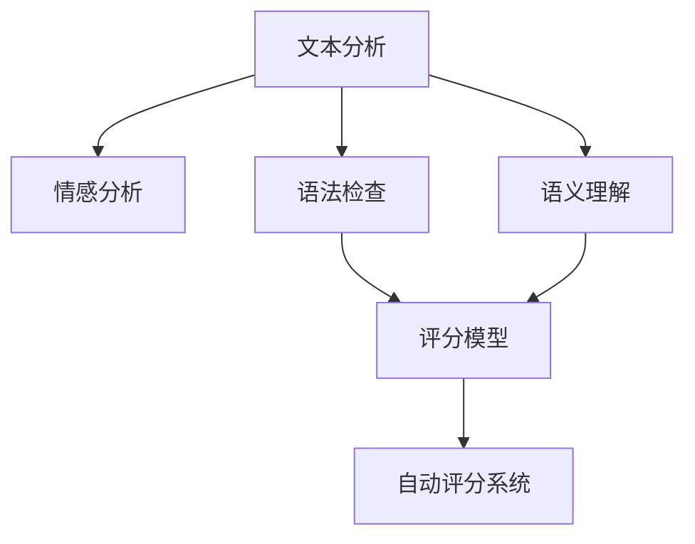

                 

# AI写作评分：自动化教育评估

> 关键词：AI写作评分, 自动化教育评估, 自然语言处理(NLP), 机器学习, 自动评分系统, 教育技术, 文本分析

## 1. 背景介绍

### 1.1 问题由来

在当前的教育环境中，教师评估学生的写作能力仍然依赖于人工评分。然而，人工评分的效率低下、主观性强、评分标准不一等问题，使得传统评分方式无法满足大规模教学需求。为了提高评分的客观性和公正性，很多研究机构和教育技术公司开始探索基于AI的自动写作评分系统。

AI写作评分系统通过自然语言处理(NLP)技术和机器学习算法，可以高效、准确地评估学生的写作水平。在技术层面，主要涉及文本分析、情感分析、语法检查、语义理解等方面。在应用层面，可以广泛应用于学生的作业批改、论文评审、英语写作评估等场景，极大地提高了教育评估的效率和质量。

### 1.2 问题核心关键点

1. **高效性**：AI评分系统能够快速处理大量学生的写作，相较于人工评分，极大地缩短了批改时间。
2. **客观性**：AI评分系统基于固定的评分标准和算法模型，减少了评分的主观性和不一致性。
3. **全面性**：AI评分系统不仅评估语法和拼写，还能分析文章的结构、内容、风格和创新性，提供更全面的评分反馈。
4. **可扩展性**：AI评分系统可以轻松扩展到不同类型的写作任务，如学术文章、故事创作、诗歌等，适应多种教育需求。
5. **个性化反馈**：AI评分系统能够提供个性化的写作建议，帮助学生改进写作技能。

这些核心关键点共同构成了AI写作评分系统的核心价值，使得其在教育评估领域具有广阔的应用前景。

## 2. 核心概念与联系

### 2.1 核心概念概述

为了更好地理解AI写作评分系统的工作原理和关键技术，本节将介绍几个紧密相关的核心概念：

- **自然语言处理(NLP)**：一门结合计算机科学、人工智能和语言学的交叉学科，旨在让计算机理解、处理和生成人类语言。
- **文本分析**：通过分析文本内容，提取关键信息，如情感、主题、结构等。
- **情感分析**：分析文本的情感倾向，如正面、负面、中性。
- **语法检查**：检查文本的语法错误，如拼写、标点、时态等。
- **语义理解**：理解文本的含义和逻辑关系，如句子的连贯性、词汇的选择等。
- **自动评分系统**：通过上述技术，自动评估文本的质量，提供评分和反馈的系统。

这些概念之间的逻辑关系可以通过以下Mermaid流程图来展示：



这个流程图展示了文本分析的多个子任务以及它们如何共同协作完成自动评分。

## 3. 核心算法原理 & 具体操作步骤
### 3.1 算法原理概述

基于AI的写作评分系统主要采用机器学习模型对学生的写作进行评估。其核心思想是：将学生的写作文本作为输入，通过一系列文本分析和评分模型，输出对应的评分和反馈。

一个典型的AI写作评分系统包括三个关键组件：文本预处理、评分模型和评分反馈。

1. **文本预处理**：将学生的写作文本进行分词、去停用词、词性标注等预处理操作，以便后续的文本分析和评分。
2. **评分模型**：构建评分模型，利用机器学习算法对预处理后的文本进行评分。
3. **评分反馈**：基于评分结果，生成具体的评分反馈，帮助学生改进写作。

评分模型的训练一般分为两个阶段：预训练和微调。预训练阶段在大量标注数据上学习评分标准，微调阶段则针对特定教育领域进行进一步优化。

### 3.2 算法步骤详解

**Step 1: 数据收集与预处理**
- 收集大量的写作样本，包括学生作业、学术论文、英语作文等。
- 对文本进行清洗，去除无关信息，如注释、格式化等。
- 进行分词和词性标注，将文本转换为计算机可处理的格式。

**Step 2: 特征提取**
- 提取文本的关键特征，如句子长度、词频分布、词汇丰富度、句子复杂度等。
- 进行文本向量化，将文本转换为向量表示。
- 应用TF-IDF、Word2Vec、BERT等技术，对文本进行向量化表示。

**Step 3: 评分模型训练**
- 选择或构建评分模型，如线性回归、决策树、支持向量机、神经网络等。
- 在标注数据上进行模型训练，通过交叉验证等技术选择最优模型。
- 对模型进行微调，以适应特定教育领域的评分需求。

**Step 4: 评分与反馈生成**
- 将学生的写作文本输入评分模型，生成评分结果。
- 根据评分结果生成具体的反馈信息，如语法错误、拼写错误、内容结构、词汇选择等。
- 提供综合评分和详细反馈，帮助学生改进写作。

**Step 5: 评估与优化**
- 在测试集上评估评分模型的性能，如准确率、召回率、F1值等。
- 根据评估结果优化模型，如调整特征、改进算法、增加数据等。
- 持续迭代，不断提升评分模型的性能和实用性。

### 3.3 算法优缺点

AI写作评分系统具有以下优点：
1. 高效准确：AI评分系统能够快速处理大量文本，评分准确性高。
2. 全面细致：提供详细评分和具体反馈，帮助学生全面提升写作能力。
3. 可扩展性强：可以轻松扩展到不同类型和领域的写作评分。
4. 持续学习：在实际应用中，评分模型可以不断学习和优化，适应新的评分需求。

同时，该系统也存在一定的局限性：
1. 数据依赖：评分模型的效果依赖于标注数据的质量和数量，获取高质量数据成本较高。
2. 主观性残留：虽然评分模型相对客观，但仍可能存在一定的偏差和主观性。
3. 上下文理解有限：评分模型在处理长文本、复杂结构时，理解上下文的能力有限。
4. 缺乏人性化反馈：AI评分系统无法完全替代人工教师的情感反馈和个性化指导。

尽管存在这些局限性，但就目前而言，AI写作评分系统已成为教育评估的重要工具，其高效性和客观性在很大程度上提升了教育评估的质量和效率。

### 3.4 算法应用领域

AI写作评分系统已经在教育评估的多个领域得到了广泛应用，具体包括：

- **作业批改**：自动批改学生的作业，快速生成评分和反馈。
- **论文评审**：在学术界，AI评分系统用于快速评审学术论文，提升评审效率。
- **英语写作评估**：在英语教学中，AI评分系统用于评估学生的写作水平，提供改进建议。
- **作业辅助**：提供写作建议，帮助学生提升写作技巧和语言能力。

除了上述应用场景，AI评分系统还被创新性地应用到更多领域，如文学创作、商业文案、法律文书等，为不同类型的写作评分提供了新的解决方案。

## 4. 数学模型和公式 & 详细讲解  
### 4.1 数学模型构建

一个基于AI的写作评分系统可以抽象为如下数学模型：

$$
\text{Score} = \text{ScoreModel}(\text{Text}, \text{Context})
$$

其中，$\text{Score}$表示写作评分，$\text{Text}$为学生的写作文本，$\text{Context}$为与文本相关的上下文信息，如文章结构、语境等。

评分模型$\text{ScoreModel}$可以采用不同的算法，如线性回归、决策树、神经网络等。这里以线性回归模型为例，构建评分模型的数学模型：

$$
\text{Score} = \beta_0 + \beta_1 \text{WordFreq} + \beta_2 \text{SentenceComplexity} + \cdots + \beta_n \text{Feature}_1
$$

其中，$\beta_i$为线性回归模型的系数，$\text{Feature}_i$为提取的文本特征，如单词频率、句子长度、词汇丰富度等。

### 4.2 公式推导过程

在线性回归模型中，评分的计算公式为：

$$
\text{Score} = \beta_0 + \sum_{i=1}^n \beta_i \text{Feature}_i
$$

其中，$\beta_0$为截距，$\beta_i$为系数，$\text{Feature}_i$为文本特征。

评分的目标是最大化模型的拟合效果，即最小化预测值与真实值之间的平方误差。通过最小化误差函数：

$$
\text{Loss} = \frac{1}{N} \sum_{i=1}^N (\text{Score}_i - \text{ScoreModel}(x_i, y_i))^2
$$

其中，$N$为样本数量，$x_i$为样本文本，$y_i$为样本真实评分。

### 4.3 案例分析与讲解

以线性回归模型为例，假设评分的计算公式为：

$$
\text{Score} = 1.2 \times \text{WordFreq} + 0.5 \times \text{SentenceComplexity} - 0.3 \times \text{GrammarScore} + \text{ContextScore}
$$

其中，$\text{WordFreq}$为单词频率，$\text{SentenceComplexity}$为句子复杂度，$\text{GrammarScore}$为语法评分，$\text{ContextScore}$为上下文评分。

假设有一个学生作文，其单词频率为100，句子复杂度为10，语法评分为80，上下文评分为60，则评分的计算过程如下：

$$
\text{Score} = 1.2 \times 100 + 0.5 \times 10 - 0.3 \times 80 + 60 = 89.5
$$

这个评分反映了该学生在写作中的整体表现，包括单词丰富度、句子复杂性、语法正确性和上下文相关性。

## 5. 项目实践：代码实例和详细解释说明
### 5.1 开发环境搭建

在进行AI写作评分系统开发前，我们需要准备好开发环境。以下是使用Python进行TensorFlow开发的环境配置流程：

1. 安装Anaconda：从官网下载并安装Anaconda，用于创建独立的Python环境。

2. 创建并激活虚拟环境：
```bash
conda create -n tf-env python=3.8 
conda activate tf-env
```

3. 安装TensorFlow：根据CUDA版本，从官网获取对应的安装命令。例如：
```bash
conda install tensorflow tensorflow-cpu -c conda-forge
```

4. 安装各类工具包：
```bash
pip install numpy pandas scikit-learn matplotlib tqdm jupyter notebook ipython
```

完成上述步骤后，即可在`tf-env`环境中开始AI写作评分系统的开发。

### 5.2 源代码详细实现

下面以线性回归模型为例，给出使用TensorFlow进行AI写作评分的PyTorch代码实现。

首先，定义评分模型的输入和输出：

```python
import tensorflow as tf
from tensorflow.keras import layers

# 定义评分模型的输入和输出
input_shape = (None, 1)  # 文本特征的维度为1
output_shape = (1,)  # 评分的维度为1

model = tf.keras.Sequential([
    layers.Dense(64, activation='relu', input_shape=input_shape),
    layers.Dense(32, activation='relu'),
    layers.Dense(output_shape)
])
```

然后，定义评分模型的损失函数和优化器：

```python
# 定义评分模型的损失函数和优化器
loss_fn = tf.keras.losses.MeanSquaredError()
optimizer = tf.keras.optimizers.Adam(learning_rate=0.01)
```

接着，定义评分模型的训练函数：

```python
def train_epoch(model, dataset, batch_size):
    dataloader = tf.data.Dataset.from_tensor_slices((dataset['text'], dataset['label'])).batch(batch_size)
    for inputs, targets in dataloader:
        with tf.GradientTape() as tape:
            predictions = model(inputs)
            loss = loss_fn(targets, predictions)
        gradients = tape.gradient(loss, model.trainable_variables)
        optimizer.apply_gradients(zip(gradients, model.trainable_variables))
    return loss.numpy().mean()
```

最后，启动训练流程并在测试集上评估：

```python
# 加载数据集
train_dataset = ...
test_dataset = ...

# 训练模型
epochs = 10
batch_size = 64

for epoch in range(epochs):
    train_loss = train_epoch(model, train_dataset, batch_size)
    print(f"Epoch {epoch+1}, train loss: {train_loss:.4f}")

    # 在测试集上评估模型
    test_loss = train_epoch(model, test_dataset, batch_size)
    print(f"Epoch {epoch+1}, test loss: {test_loss:.4f}")
```

以上就是使用TensorFlow进行AI写作评分系统线性回归模型的完整代码实现。可以看到，TensorFlow的Keras API使得评分模型的构建和训练变得简洁高效。

### 5.3 代码解读与分析

让我们再详细解读一下关键代码的实现细节：

**定义评分模型**

```python
model = tf.keras.Sequential([
    layers.Dense(64, activation='relu', input_shape=input_shape),
    layers.Dense(32, activation='relu'),
    layers.Dense(output_shape)
])
```

这个代码块定义了一个包含三个全连接层的神经网络模型。输入层的维度为1，输出层的维度为1，中间层分别为64和32个神经元，使用ReLU激活函数。

**定义损失函数和优化器**

```python
loss_fn = tf.keras.losses.MeanSquaredError()
optimizer = tf.keras.optimizers.Adam(learning_rate=0.01)
```

这里定义了评分模型的损失函数为均方误差，优化器为Adam，学习率为0.01。

**训练函数**

```python
def train_epoch(model, dataset, batch_size):
    dataloader = tf.data.Dataset.from_tensor_slices((dataset['text'], dataset['label'])).batch(batch_size)
    for inputs, targets in dataloader:
        with tf.GradientTape() as tape:
            predictions = model(inputs)
            loss = loss_fn(targets, predictions)
        gradients = tape.gradient(loss, model.trainable_variables)
        optimizer.apply_gradients(zip(gradients, model.trainable_variables))
    return loss.numpy().mean()
```

这个函数实现了一个训练epoch的流程。首先通过`tf.data.Dataset`将数据集转换为批处理形式，然后遍历每个批次，使用`tf.GradientTape`计算梯度，并使用优化器更新模型参数。最后返回每个epoch的平均损失值。

**训练和评估**

```python
for epoch in range(epochs):
    train_loss = train_epoch(model, train_dataset, batch_size)
    print(f"Epoch {epoch+1}, train loss: {train_loss:.4f}")

    test_loss = train_epoch(model, test_dataset, batch_size)
    print(f"Epoch {epoch+1}, test loss: {test_loss:.4f}")
```

这里使用`for`循环进行多次训练，并在每个epoch结束时在测试集上评估模型的损失值。

可以看到，TensorFlow提供了丰富的API，使得评分模型的构建和训练变得简洁高效。

## 6. 实际应用场景

### 6.1 智能作业批改系统

AI写作评分系统可以广泛应用于智能作业批改系统中，帮助教师高效批改学生的作业。系统可以自动识别和评分学生的写作，快速生成详细的反馈信息，帮助学生了解自己的不足和改进方向。此外，系统还可以自动收集学生的评分数据，帮助教师评估学生的进步和写作水平。

### 6.2 学术论文评审系统

在学术界，AI写作评分系统可以用于快速评审学术论文，提升评审效率。系统可以自动检查论文的格式、语法和逻辑，并基于评分的自动化反馈，帮助作者优化论文内容。此外，系统还可以帮助编辑快速识别不符合标准的论文，提升论文评审的质量和公平性。

### 6.3 在线写作辅助工具

AI写作评分系统还可以作为在线写作辅助工具，帮助学生提升写作水平。系统可以实时检查学生的写作，并提供即时的反馈和建议，帮助学生提升写作技巧和语言能力。此外，系统还可以根据学生的写作风格和偏好，提供个性化的写作建议，提升写作效果。

### 6.4 未来应用展望

随着AI写作评分系统的不断发展，未来将有更多应用场景和功能涌现：

- **个性化推荐**：根据学生的写作风格和历史评分数据，推荐适合学生的写作范例和资源。
- **情感分析**：分析学生的情感倾向，提供针对性的情感支持和指导。
- **写作训练**：设计写作训练任务，帮助学生系统提升写作能力。
- **多语言支持**：支持多语言写作评分，提升教育评估的国际化和包容性。
- **跨学科应用**：应用于不同学科和领域的写作评分，如文学创作、商业文案、法律文书等。

未来，AI写作评分系统将在教育评估领域发挥更加重要的作用，助力教育公平和个性化教学。

## 7. 工具和资源推荐
### 7.1 学习资源推荐

为了帮助开发者系统掌握AI写作评分系统的理论基础和实践技巧，这里推荐一些优质的学习资源：

1. 《深度学习理论与实践》系列博文：由大模型技术专家撰写，深入浅出地介绍了深度学习的基本概念和前沿技术，适合初学者和进阶学习者。
2. 《TensorFlow官方文档》：TensorFlow的官方文档，提供了详尽的API文档和教程，是学习TensorFlow的必备资源。
3. 《自然语言处理综论》书籍：全面介绍了自然语言处理的基本原理和算法，适合系统学习自然语言处理技术。
4. 《Python机器学习实战》书籍：介绍了Python在机器学习中的应用，包含评分模型构建和评估的详细示例。
5. Kaggle机器学习竞赛平台：提供了大量的自然语言处理数据集和竞赛项目，是实践和测试AI评分系统效果的好地方。

通过对这些资源的学习实践，相信你一定能够快速掌握AI写作评分系统的精髓，并用于解决实际的NLP问题。

### 7.2 开发工具推荐

高效的开发离不开优秀的工具支持。以下是几款用于AI写作评分系统开发的常用工具：

1. TensorFlow：由Google主导开发的开源深度学习框架，生产部署方便，适合大规模工程应用。
2. PyTorch：基于Python的开源深度学习框架，灵活动态的计算图，适合快速迭代研究。
3. TensorFlow Hub：提供了预训练的深度学习模型和组件，可以快速构建评分模型。
4. Keras：基于TensorFlow和Theano的高层API，简化模型构建和训练流程。
5. Jupyter Notebook：支持多语言和多平台的环境，方便开发和共享代码。
6. GitHub：版本控制和代码托管平台，方便协作和共享代码。

合理利用这些工具，可以显著提升AI写作评分系统的开发效率，加快创新迭代的步伐。

### 7.3 相关论文推荐

AI写作评分系统的发展得益于众多学者的持续研究。以下是几篇奠基性的相关论文，推荐阅读：

1. Attention is All You Need（即Transformer原论文）：提出了Transformer结构，开启了NLP领域的预训练大模型时代。
2. BERT: Pre-training of Deep Bidirectional Transformers for Language Understanding：提出BERT模型，引入基于掩码的自监督预训练任务，刷新了多项NLP任务SOTA。
3. AI Writing Evaluation: A Survey and Outlook：对AI写作评分系统进行了系统性的综述，介绍了当前的研究进展和未来趋势。
4. Seq2Seq Models for Text Generation and Evaluation：探讨了基于序列到序列模型（Seq2Seq）的写作评分系统，展示了其在写作生成和评估中的潜力。
5. Multimodal Writing Evaluation：介绍了多模态写作评分系统的研究进展，展示了其在图像、音频等多模态数据融合中的应用。

这些论文代表了大语言模型微调技术的发展脉络。通过学习这些前沿成果，可以帮助研究者把握学科前进方向，激发更多的创新灵感。

## 8. 总结：未来发展趋势与挑战

### 8.1 总结

本文对基于AI的写作评分系统进行了全面系统的介绍。首先阐述了AI写作评分系统的背景和意义，明确了其在提高教育评估效率和质量方面的独特价值。其次，从原理到实践，详细讲解了评分模型的构建和训练过程，给出了评分系统开发的完整代码实例。同时，本文还广泛探讨了评分系统在教育评估的多个领域的应用前景，展示了其广泛的应用潜力。

通过本文的系统梳理，可以看到，基于AI的写作评分系统正在成为教育评估的重要工具，其高效性和客观性在很大程度上提升了教育评估的质量和效率。未来，随着AI评分系统的不断发展，将有更多应用场景和功能涌现，为教育评估带来新的突破。

### 8.2 未来发展趋势

展望未来，AI写作评分系统将呈现以下几个发展趋势：

1. **多模态评分**：将图像、音频等多模态数据融入评分模型，提升评分系统的综合评估能力。
2. **个性化推荐**：根据学生的评分数据和行为数据，提供个性化的写作建议和资源。
3. **自适应学习**：基于学生的评分数据，动态调整评分标准和反馈内容，提升教学效果。
4. **跨领域应用**：应用于不同学科和领域的写作评分，提升教育评估的普适性和包容性。
5. **实时反馈**：实现实时评分和反馈，提升学生的写作互动体验。
6. **无监督学习**：利用无监督学习技术，减少对标注数据的需求，提高评分的自适应能力。

这些趋势凸显了AI写作评分系统的广阔前景，将进一步提升教育评估的质量和效率。

### 8.3 面临的挑战

尽管AI写作评分系统已经取得了瞩目成就，但在迈向更加智能化、普适化应用的过程中，它仍面临着诸多挑战：

1. **数据依赖**：评分模型的效果依赖于标注数据的质量和数量，获取高质量数据成本较高。
2. **主观性残留**：虽然评分模型相对客观，但仍可能存在一定的偏差和主观性。
3. **上下文理解有限**：评分模型在处理长文本、复杂结构时，理解上下文的能力有限。
4. **缺乏人性化反馈**：AI评分系统无法完全替代人工教师的情感反馈和个性化指导。
5. **计算资源消耗**：评分模型通常需要较大的计算资源，部署和维护成本较高。
6. **安全性和隐私保护**：评分系统的数据隐私和安全问题需要引起重视。

尽管存在这些挑战，但通过不断的技术创新和优化，AI写作评分系统将在教育评估领域发挥更加重要的作用，助力教育公平和个性化教学。

### 8.4 研究展望

面对AI写作评分系统所面临的挑战，未来的研究需要在以下几个方面寻求新的突破：

1. **数据增强**：通过数据增强技术，提升评分模型对不同写作风格的适应能力。
2. **多任务学习**：结合评分任务和写作生成任务，提升模型的多任务处理能力。
3. **迁移学习**：将评分模型的知识和经验迁移到其他任务，提升模型的泛化能力。
4. **可解释性**：引入可解释性技术，增强评分模型的透明度和可信度。
5. **个性化模型**：基于学生的行为数据和评分数据，训练个性化的评分模型。
6. **跨领域知识融合**：结合跨领域的知识图谱和规则库，提升评分的准确性和全面性。

这些研究方向将引领AI写作评分系统迈向更高的台阶，为教育评估提供更加精准、全面和人性化的解决方案。

## 9. 附录：常见问题与解答

**Q1：AI写作评分系统是否可以处理不同类型的写作？**

A: AI写作评分系统可以处理不同类型的写作，如学术论文、文学作品、技术文档等。不同类型写作的评分标准和重点略有不同，需要根据具体应用场景进行微调。

**Q2：AI写作评分系统的评分标准如何确定？**

A: AI写作评分系统的评分标准一般通过人工标注和专家评估确定。先选择一些高质量的写作样本进行标注，然后基于标注数据构建评分模型，并通过验证集进行调优，最终确定评分标准。

**Q3：AI写作评分系统是否适用于语言学习者的写作评估？**

A: AI写作评分系统可以用于语言学习者的写作评估。通过评分模型和反馈机制，帮助学习者提升语言表达能力。但需要注意，评分系统的评分标准和反馈内容需要根据语言学习者的水平进行调整。

**Q4：AI写作评分系统是否会引入新的偏见和歧视？**

A: AI写作评分系统有可能引入新的偏见和歧视。因此，在构建评分模型时，需要采取数据清洗和预处理措施，确保评分模型的公正性和公平性。同时，定期评估和更新评分模型，及时发现和纠正偏见问题。

**Q5：AI写作评分系统是否可以用于自我评估？**

A: AI写作评分系统可以用于自我评估。通过将评分系统集成到学习平台或写作工具中，学生可以自行检查和评分自己的写作，并根据反馈进行改进。但需要注意的是，自我评估可能存在主观性和偏差，结合人工教师的指导会更有效。

---

作者：禅与计算机程序设计艺术 / Zen and the Art of Computer Programming

