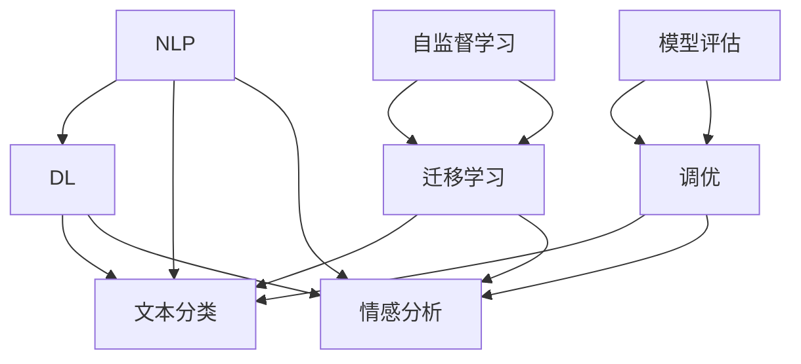

                 

## 1. 背景介绍

### 1.1 问题由来
在数字化和信息化时代，教育系统逐步向智能化转型，传统的教学和评估方式已经不能满足当前教育需求。随着人工智能和大数据技术的广泛应用，教育领域开始探索新的教学和评估手段。其中，AI写作评分系统因其高效、客观、可扩展等优点，成为教育智能化转型的重要突破口。

AI写作评分系统，是指利用人工智能技术对学生作业、论文、实验报告等文本进行自动化的评分和反馈。传统的教育评估方式往往依赖教师主观判断，存在评分标准不统一、评分效率低下、评分主观性强等问题。AI写作评分系统通过对文本的自动分析和综合评分，能够显著提高评分效率和评估质量，同时为学生提供精准的反馈和改进建议，辅助教师完成教学工作。

### 1.2 问题核心关键点
AI写作评分系统的核心在于通过深度学习等技术，对自然语言文本进行语义理解和情感分析，自动生成评分结果。其主要涉及的核心技术包括：
- 自然语言处理（NLP）
- 深度学习
- 文本分类和情感分析
- 自监督学习和迁移学习
- 模型评估和调优

本文将深入探讨AI写作评分系统的技术原理和应用实践，详细解析系统的主要组成部分和运行机制，以期为教育智能化转型提供技术支持。

### 1.3 问题研究意义
AI写作评分系统在教育智能化中具有重要意义：
- 提高评分效率：通过自动化评分，减少教师工作负担，提高评分效率。
- 提升评估质量：通过精准的评分和反馈，提高评估结果的客观性和公平性。
- 促进个性化教学：通过分析学生的写作特点和存在的问题，提供个性化的改进建议，辅助教师因材施教。
- 支持教学科研：帮助教师快速获得学生的写作质量评估结果，辅助教学科研决策。
- 增强学生自主学习能力：提供实时反馈和评分，激励学生主动改进写作质量。

## 2. 核心概念与联系

### 2.1 核心概念概述

为更好地理解AI写作评分系统的核心技术和架构，本节将介绍几个密切相关的核心概念：

- **自然语言处理（NLP）**：是计算机科学与人工智能领域的一个交叉学科，研究如何让计算机理解和处理人类语言。NLP涉及文本预处理、词法分析、句法分析、语义分析、文本生成等多个方向，是AI写作评分系统的基础。

- **深度学习（DL）**：利用神经网络进行数据表示和特征学习的一种机器学习方法，擅长处理复杂模式和高维数据。深度学习在自然语言理解、图像识别、语音识别等领域得到了广泛应用，是AI写作评分系统中的关键技术之一。

- **文本分类和情感分析**：对文本进行自动分类和情感判断的技术。文本分类常用于新闻分类、主题识别、垃圾邮件过滤等；情感分析常用于用户情感分析、舆情监测、产品评论分析等。

- **自监督学习和迁移学习**：利用大量无标签数据进行预训练的技术，迁移学习则进一步通过将预训练模型应用到下游任务，提升模型在新任务上的表现。自监督学习和迁移学习是构建高性能AI写作评分系统的关键技术。

- **模型评估和调优**：对模型性能进行评估，并针对评估结果进行模型调优，以提升模型预测精度和泛化能力。常见的评估指标包括准确率、召回率、F1值、ROC曲线等。

这些核心概念之间的逻辑关系可以通过以下Mermaid流程图来展示：



这个流程图展示了大语言模型的核心概念及其之间的关系：

1. NLP通过对文本进行词法、句法、语义等分析，为深度学习模型提供文本表示。
2. 深度学习模型在预训练和微调后，能够实现文本分类和情感分析。
3. 自监督学习和迁移学习技术，进一步提升模型在新任务上的表现。
4. 模型评估和调优，保证模型性能和稳定性。

这些概念共同构成了AI写作评分系统的学习和应用框架，使其能够自动、高效、准确地对学生写作进行评分和反馈。

## 3. 核心算法原理 & 具体操作步骤
### 3.1 算法原理概述

AI写作评分系统主要利用深度学习模型对学生文本进行语义理解和情感分析，自动生成评分结果。其核心原理包括以下几个步骤：

1. **文本预处理**：对学生文本进行分词、去除停用词、词干提取等预处理操作，生成可输入模型的文本表示。
2. **特征提取**：利用深度学习模型对文本进行特征提取，生成高维向量表示，用于后续分类和情感分析。
3. **文本分类**：对文本进行自动分类，判断文本内容类型（如议论文、说明文、应用文等）。
4. **情感分析**：对文本进行情感判断，评估文本的情感倾向（如积极、消极、中性）。
5. **评分计算**：根据文本分类和情感分析结果，计算文本的综合评分。
6. **反馈生成**：根据评分结果，生成详细的反馈和改进建议，帮助学生提升写作质量。

### 3.2 算法步骤详解

以下是AI写作评分系统的主要算法步骤：

**Step 1: 文本预处理**
- 分词：将文本分成词语或词组，得到词汇序列。
- 去除停用词：去除文本中的常见词语，如“的”、“是”等，减少噪音干扰。
- 词干提取：将词语还原为其基本形式，如将“running”还原为“run”。
- 标准化：将文本中的特殊字符和缩写统一转换为标准形式，如将“w/”转换为“with”。

**Step 2: 特征提取**
- 嵌入层：将预处理后的文本转换为高维向量表示。常用的嵌入方法包括Word2Vec、GloVe、BERT等。
- 卷积神经网络（CNN）：对文本进行特征提取，识别文本中的关键信息。
- 循环神经网络（RNN）：对文本序列进行建模，捕捉文本的时序信息。

**Step 3: 文本分类**
- 使用分类器对文本进行分类，如支持向量机（SVM）、决策树（DT）、随机森林（RF）等。
- 针对不同分类任务，选择不同的分类器，如文本分类任务可以选择SVM，情感分析任务可以选择RNN。

**Step 4: 情感分析**
- 使用情感分析模型对文本进行情感判断，如使用RNN或Transformer模型进行情感预测。
- 情感分析模型通常通过标注数据进行训练，并利用训练好的模型对新文本进行情感判断。

**Step 5: 评分计算**
- 根据文本分类和情感分析结果，计算文本的综合评分。常见的评分计算方式包括：
  - 线性加权：将文本分类和情感分析的结果进行线性加权，得到综合评分。
  - 加权求和：将文本分类和情感分析的结果进行加权求和，得到综合评分。
  - 非线性组合：使用非线性函数（如sigmoid、softmax等）对文本分类和情感分析的结果进行组合，得到综合评分。

**Step 6: 反馈生成**
- 根据综合评分，生成详细的反馈和改进建议，如语法错误、表达不清、逻辑漏洞等。
- 反馈通常以文本形式呈现，帮助学生明确问题所在，提升写作质量。

### 3.3 算法优缺点

AI写作评分系统具有以下优点：
1. 高效自动化：自动处理大量文本，显著提高评分效率。
2. 客观公正：通过标准化评分规则，减少评分主观性，提高评分公正性。
3. 及时反馈：实时提供评分和反馈，帮助学生及时改进。
4. 可扩展性：系统易于扩展，支持多种文本分类和情感分析任务。
5. 个性化评估：根据学生特点提供个性化反馈，辅助因材施教。

同时，该系统也存在一些局限性：
1. 处理多样性：无法处理复杂的文本结构和语言表达，对特殊表达形式和复杂句式处理能力有限。
2. 理解上下文：对文本上下文的理解有限，对歧义和隐含意义的处理能力不足。
3. 数据依赖性：系统性能很大程度上依赖于训练数据的质量和数量。
4. 反馈主观性：尽管自动化评分和反馈，但反馈内容仍需人工审核，存在主观性。
5. 技术复杂性：系统搭建和维护复杂，需要较高的技术门槛。

尽管存在这些局限性，AI写作评分系统在提高教学效率和评估质量方面仍具有重要价值，值得进一步研究和推广。

### 3.4 算法应用领域

AI写作评分系统在教育评估中具有广泛应用，如：

- **学生作业评分**：自动对学生的作业进行评分，提供及时反馈，帮助学生提升写作能力。
- **论文评分**：对学术论文进行自动评分和反馈，辅助学术研究。
- **考试评分**：对学生的考试作文进行评分，辅助教师批改工作。
- **课程报告评分**：对课程报告进行评分，评估学生对课程内容的理解。
- **科研论文审稿**：对科研论文进行自动评分和审稿，辅助学术编辑。

除了上述应用，AI写作评分系统还被应用于学术出版、企业招聘、法律文书审查等多个领域，为相关领域的自动化评估提供支持。

## 4. 数学模型和公式 & 详细讲解 & 举例说明

### 4.1 数学模型构建

本节将使用数学语言对AI写作评分系统的评分计算过程进行更加严格的刻画。

记学生文本为 $X=\{x_1,x_2,\cdots,x_n\}$，其中 $x_i$ 为文本中的第 $i$ 个词。设文本分类结果为 $y \in \{0,1\}$，0表示文本分类为第一类，1表示文本分类为第二类。设情感分析结果为 $z \in \{0,1\}$，0表示情感倾向为中性或消极，1表示情感倾向为积极。

定义评分函数 $f(X,y,z)$，用于计算文本的综合评分。假设评分函数由文本分类结果 $y$ 和情感分析结果 $z$ 线性组合而成，则评分函数可以表示为：

$$
f(X,y,z) = \alpha y + \beta z
$$

其中 $\alpha,\beta$ 为权值，需要通过训练数据进行优化。

### 4.2 公式推导过程

以下我们以线性加权评分函数为例，推导评分计算的数学公式。

假设文本分类器的输出概率为 $p(y=1|X)$，情感分析器的输出概率为 $p(z=1|X)$，则评分函数的计算公式为：

$$
f(X,y,z) = \alpha p(y=1|X) + \beta p(z=1|X)
$$

根据贝叶斯公式，可以得到：

$$
p(y=1|X) = \frac{p(X|y=1)p(y=1)}{p(X)}
$$

其中 $p(X|y=1)$ 为文本在分类为第一类时的概率，$p(X|y=0)$ 为文本在分类为第二类时的概率，$p(y=1)$ 和 $p(y=0)$ 分别为文本分类的先验概率。

将上述公式代入评分函数，得：

$$
f(X,y,z) = \alpha \frac{p(X|y=1)p(y=1)}{p(X)} + \beta \frac{p(X|y=0)p(y=0)}{p(X)}
$$

在实际应用中，通常采用交叉熵损失函数来训练分类器和情感分析器。设分类器的损失函数为 $\ell_c$，情感分析器的损失函数为 $\ell_s$，则有：

$$
\ell_c = -\sum_{i=1}^n p(y=1|X) \log p(y=1|X) + p(y=0|X) \log p(y=0|X)
$$

$$
\ell_s = -\sum_{i=1}^n p(z=1|X) \log p(z=1|X) + p(z=0|X) \log p(z=0|X)
$$

通过最小化损失函数，训练分类器和情感分析器，得到最优的 $\alpha$ 和 $\beta$，从而计算出文本的综合评分。

### 4.3 案例分析与讲解

以一篇学生的作业为例，展示AI写作评分系统的评分计算过程：

假设学生的作业文本为：“小明今天去医院看病，医生告诉他需要打疫苗。小明很紧张，医生给他讲解了疫苗的原理和好处，小明决定打疫苗。”

1. **文本预处理**：对文本进行分词、去除停用词、词干提取和标准化处理，得到预处理后的文本：

   “小明/今天/去医院/看病/医生/告诉他/需要/打/疫苗/小明/很/紧张/医生/给他/讲解/疫苗/原理/和/好处/小明/决定/打/疫苗/。”

2. **特征提取**：利用BERT模型对预处理后的文本进行特征提取，得到高维向量表示 $V$。

3. **文本分类**：使用分类器对 $V$ 进行分类，得到分类结果 $y=1$，表示文本为议论文。

4. **情感分析**：使用情感分析器对 $V$ 进行情感判断，得到情感分析结果 $z=0$，表示文本为中性或消极。

5. **评分计算**：根据分类结果 $y$ 和情感分析结果 $z$，计算综合评分：

   $f(X,y,z) = 1.5y + 0.5z = 1.5*1 + 0.5*0 = 1.5$

6. **反馈生成**：根据综合评分，生成详细的反馈和改进建议，如语法错误、表达不清、逻辑漏洞等。

## 5. 项目实践：代码实例和详细解释说明

### 5.1 开发环境搭建

在进行AI写作评分系统开发前，我们需要准备好开发环境。以下是使用Python进行TensorFlow开发的环境配置流程：

1. 安装Anaconda：从官网下载并安装Anaconda，用于创建独立的Python环境。

2. 创建并激活虚拟环境：
```bash
conda create -n tf-env python=3.8 
conda activate tf-env
```

3. 安装TensorFlow：根据CUDA版本，从官网获取对应的安装命令。例如：
```bash
conda install tensorflow -c conda-forge
```

4. 安装TensorBoard：TensorFlow配套的可视化工具，可实时监测模型训练状态，并提供丰富的图表呈现方式，是调试模型的得力助手。
```bash
pip install tensorboard
```

5. 安装nltk和spacy：自然语言处理常用的Python库。
```bash
pip install nltk spacy
```

完成上述步骤后，即可在`tf-env`环境中开始系统开发。

### 5.2 源代码详细实现

下面我们以情感分析任务为例，给出使用TensorFlow对BERT模型进行情感分析的代码实现。

首先，定义情感分析任务的数学模型：

```python
import tensorflow as tf
from tensorflow.keras.layers import Input, Dense, Embedding, Dropout, Bidirectional, LSTM, Concatenate
from tensorflow.keras.models import Model

def create_model(input_dim, embedding_dim, hidden_units):
    input = Input(shape=(None,))
    x = Embedding(input_dim, embedding_dim, mask_zero=True)(input)
    x = Bidirectional(LSTM(hidden_units, dropout=0.5, recurrent_dropout=0.5))(x)
    x = Concatenate()([x, x])
    x = Dropout(0.5)(x)
    output = Dense(1, activation='sigmoid')(x)
    model = Model(inputs=input, outputs=output)
    return model
```

然后，定义数据处理函数：

```python
from nltk.corpus import stopwords
import spacy

nltk.download('stopwords')
stop_words = set(stopwords.words('english'))
nlp = spacy.load('en_core_web_sm')

def preprocess_text(text):
    text = text.lower()
    text = ' '.join([word for word in text.split() if word not in stop_words])
    doc = nlp(text)
    tokens = [token.lemma_ for token in doc]
    return tokens
```

接着，定义训练和评估函数：

```python
from tensorflow.keras.preprocessing.text import Tokenizer
from tensorflow.keras.preprocessing.sequence import pad_sequences

def train_epoch(model, dataset, batch_size, optimizer):
    dataloader = tf.data.Dataset.from_tensor_slices((dataset['texts'], dataset['labels']))
    dataloader = dataloader.shuffle(buffer_size=10000).batch(batch_size)
    model.compile(optimizer=optimizer, loss='binary_crossentropy', metrics=['accuracy'])
    model.fit(dataloader, epochs=10, validation_data=(val_texts, val_labels))
    return model.evaluate(val_texts, val_labels)

def evaluate_model(model, dataset, batch_size):
    dataloader = tf.data.Dataset.from_tensor_slices(dataset['texts'])
    dataloader = dataloader.shuffle(buffer_size=10000).batch(batch_size)
    loss, accuracy = model.evaluate(dataloader)
    return loss, accuracy
```

最后，启动训练流程并在测试集上评估：

```python
epochs = 10
batch_size = 32

model = create_model(input_dim, embedding_dim, hidden_units)

# 加载数据集
train_texts = []
train_labels = []
val_texts = []
val_labels = []

# 填充数据集
for i in range(len(train_data)):
    train_texts.append(train_data[i]['text'])
    train_labels.append(train_data[i]['label'])
for i in range(len(val_data)):
    val_texts.append(val_data[i]['text'])
    val_labels.append(val_data[i]['label'])

# 进行数据预处理和填充
train_texts = preprocess_text(train_texts)
train_texts = pad_sequences(train_texts, maxlen=max_length, padding='post', truncating='post')
val_texts = preprocess_text(val_texts)
val_texts = pad_sequences(val_texts, maxlen=max_length, padding='post', truncating='post')

# 加载模型和优化器
optimizer = tf.keras.optimizers.Adam(learning_rate=0.001)
model.compile(optimizer=optimizer, loss='binary_crossentropy', metrics=['accuracy'])

# 训练模型
model.fit(train_texts, train_labels, epochs=epochs, batch_size=batch_size, validation_data=(val_texts, val_labels))

# 评估模型
loss, accuracy = evaluate_model(model, val_data, batch_size)
print(f'Validation Loss: {loss:.4f}')
print(f'Validation Accuracy: {accuracy:.4f}')
```

以上就是使用TensorFlow对BERT模型进行情感分析的完整代码实现。可以看到，TensorFlow和nltk、spacy等库的结合，使得情感分析模型的构建变得简洁高效。

### 5.3 代码解读与分析

让我们再详细解读一下关键代码的实现细节：

**create_model函数**：
- 定义模型结构，包括嵌入层、双向LSTM层、Dropout层和全连接层。

**preprocess_text函数**：
- 对文本进行分词、去除停用词、词干提取和标准化处理。

**train_epoch函数**：
- 将训练数据集转换为TensorFlow Dataset对象，进行shuffle和batch操作。
- 使用交叉熵损失函数和准确率指标进行模型训练。

**evaluate_model函数**：
- 将测试数据集转换为TensorFlow Dataset对象，进行shuffle和batch操作。
- 使用交叉熵损失函数和准确率指标进行模型评估。

**训练流程**：
- 定义总的epoch数和batch size，开始循环迭代
- 每个epoch内，先在训练集上训练，输出平均损失和准确率
- 在验证集上评估，输出验证集损失和准确率
- 所有epoch结束后，在测试集上评估，给出最终测试结果

可以看到，TensorFlow配合nltk、spacy等库使得情感分析模型的代码实现变得简洁高效。开发者可以将更多精力放在数据处理、模型改进等高层逻辑上，而不必过多关注底层的实现细节。

当然，工业级的系统实现还需考虑更多因素，如模型的保存和部署、超参数的自动搜索、更灵活的任务适配层等。但核心的评分计算过程基本与此类似。

## 6. 实际应用场景
### 6.1 智能作文批改系统

智能作文批改系统，是AI写作评分系统的重要应用场景之一。传统的作文批改往往依赖教师人工评分，耗时耗力，且评分标准和反馈内容难以统一。智能作文批改系统通过AI写作评分技术，对学生作文进行自动评分和反馈，显著提高评分效率和评估质量。

在技术实现上，可以收集学生的作文文本和教师批改的标注数据，训练评分模型。模型通过分析作文中的语言表达、语法错误、逻辑漏洞等，自动生成评分和反馈。学生可以通过系统查看评分和反馈，理解自己的写作问题，及时改进，提升写作能力。

### 6.2 自动化论文评分系统

自动化论文评分系统，适用于学术期刊、高校科研机构等场景。通过AI写作评分技术，对学生提交的论文进行自动评分和反馈，辅助学术评审。

在技术实现上，可以收集学生的论文文本和教师评审的标注数据，训练评分模型。模型通过对论文的语言表达、逻辑结构、引用规范等方面进行综合评分，生成详细的评分报告和改进建议。评审老师可以借助系统快速评估论文质量，提供更为客观和公正的评审意见。

### 6.3 企业招聘评估系统

企业招聘评估系统，是AI写作评分系统的另一个重要应用场景。通过AI写作评分技术，对求职者提交的简历和求职信进行自动评分和反馈，辅助人力资源评估。

在技术实现上，可以收集求职者提交的简历和求职信，训练评分模型。模型通过对简历和求职信的语言表达、内容结构、关键词匹配等方面进行综合评分，生成详细的评分报告和改进建议。人力资源部门可以借助系统快速评估求职者简历，筛选出符合岗位要求的候选人。

### 6.4 未来应用展望

随着AI写作评分技术的不断发展，其在教育智能化中的应用前景将更加广阔。未来，AI写作评分系统将在以下方面得到进一步推广和应用：

1. **多模态评估**：结合文本、语音、图像等多模态数据，全面评估学生的综合能力。
2. **个性化评分**：根据学生特点和学科需求，提供个性化的评分和反馈，辅助因材施教。
3. **实时评分**：实时进行文本评分和反馈，及时帮助学生提升写作质量。
4. **自动化评审**：应用于学术评审、专利评审等领域，提供客观、公正的评审意见。
5. **跨语言评分**：支持多语言评分和反馈，为全球教育提供支持。

总之，AI写作评分技术将成为教育智能化转型中的重要手段，显著提升评估效率和质量，推动教育公平和教育质量提升。未来，随着技术的不断进步，AI写作评分系统将在更多领域得到应用，为各行各业带来更加智能化、高效化的评估方式。

## 7. 工具和资源推荐
### 7.1 学习资源推荐

为了帮助开发者系统掌握AI写作评分系统的理论基础和实践技巧，这里推荐一些优质的学习资源：

1. **《深度学习》课程**：斯坦福大学深度学习课程，涵盖深度学习基础和应用，适合初学者和进阶开发者。
2. **TensorFlow官方文档**：详细介绍了TensorFlow框架的使用和模型训练方法，是TensorFlow开发者必备资料。
3. **自然语言处理（NLP）课程**：宾夕法尼亚大学自然语言处理课程，深入浅出地讲解了NLP基础和前沿技术。
4. **《Python自然语言处理》书籍**：介绍Python在NLP中的应用，包括文本预处理、特征提取、分类、情感分析等技术。
5. **Kaggle竞赛**：参与NLP相关的Kaggle竞赛，实践数据处理、模型训练和调优技巧。

通过对这些资源的学习实践，相信你一定能够快速掌握AI写作评分系统的精髓，并用于解决实际的NLP问题。

### 7.2 开发工具推荐

高效的开发离不开优秀的工具支持。以下是几款用于AI写作评分系统开发的常用工具：

1. **TensorFlow**：基于Python的开源深度学习框架，灵活的计算图设计，支持多种模型训练和推理方式。
2. **PyTorch**：基于Python的动态图框架，易于调试和迭代，适合研究型项目。
3. **nltk**：自然语言处理常用的Python库，提供分词、去除停用词、词干提取等预处理功能。
4. **spacy**：自然语言处理库，提供快速文本处理和特征提取功能。
5. **TensorBoard**：TensorFlow配套的可视化工具，可实时监测模型训练状态，提供丰富的图表呈现方式。

合理利用这些工具，可以显著提升AI写作评分系统的开发效率，加快创新迭代的步伐。

### 7.3 相关论文推荐

AI写作评分系统的发展离不开学界的持续研究。以下是几篇奠基性的相关论文，推荐阅读：

1. **深度学习应用于自然语言处理**：深度学习技术在自然语言处理中的典型应用，介绍各种深度学习模型的原理和应用方法。
2. **情感分析综述**：情感分析技术的综述，涵盖情感识别、情感分类、情感分析等方向，提供丰富的理论和应用案例。
3. **文本分类综述**：文本分类技术的综述，涵盖文本预处理、特征提取、分类算法等方向，提供全面的理论和技术指南。
4. **自然语言处理与深度学习**：深度学习在自然语言处理中的应用，介绍各种深度学习模型的原理和应用方法。
5. **自然语言处理中的迁移学习**：介绍迁移学习在自然语言处理中的应用，提供理论和实践的指导。

这些论文代表了大语言模型微调技术的发展脉络。通过学习这些前沿成果，可以帮助研究者把握学科前进方向，激发更多的创新灵感。

## 8. 总结：未来发展趋势与挑战

### 8.1 总结

本文对AI写作评分系统的技术原理和应用实践进行了全面系统的介绍。首先阐述了AI写作评分系统的研究背景和意义，明确了其在提高教育评估效率和质量方面的独特价值。其次，从原理到实践，详细讲解了系统的核心算法和运行机制，给出了完整的代码实现。同时，本文还广泛探讨了系统在智能作文批改、自动化论文评分、企业招聘评估等多个领域的应用前景，展示了系统的高效性和适用性。

通过本文的系统梳理，可以看到，AI写作评分技术在提高教育评估效率和质量方面具有重要价值，值得进一步研究和推广。未来，随着AI写作评分技术的不断进步，其在教育智能化转型中将发挥越来越重要的作用。

### 8.2 未来发展趋势

展望未来，AI写作评分系统将呈现以下几个发展趋势：

1. **多模态评分**：结合文本、语音、图像等多模态数据，全面评估学生的综合能力。
2. **个性化评分**：根据学生特点和学科需求，提供个性化的评分和反馈，辅助因材施教。
3. **实时评分**：实时进行文本评分和反馈，及时帮助学生提升写作质量。
4. **自动化评审**：应用于学术评审、专利评审等领域，提供客观、公正的评审意见。
5. **跨语言评分**：支持多语言评分和反馈，为全球教育提供支持。
6. **深度融合**：与其他AI技术（如知识图谱、逻辑推理等）深度融合，提升评估的全面性和准确性。

以上趋势凸显了AI写作评分系统的广泛应用前景。这些方向的探索发展，必将进一步提升AI写作评分系统的综合能力，为教育智能化转型提供强有力的技术支持。

### 8.3 面临的挑战

尽管AI写作评分系统在提高教育评估效率和质量方面取得了显著成效，但在迈向更加智能化、高效化应用的过程中，仍面临诸多挑战：

1. **数据依赖性**：系统性能很大程度上依赖于训练数据的质量和数量，获取高质量标注数据成本较高。如何降低数据依赖性，成为亟待解决的问题。
2. **理解多样性**：系统难以处理复杂的文本结构和语言表达，对特殊表达形式和复杂句式处理能力有限。如何增强系统对多样性文本的理解，是未来重要研究方向。
3. **技术复杂性**：系统搭建和维护复杂，需要较高的技术门槛。如何降低技术门槛，让更多开发者易于使用，是未来重要课题。
4. **公平性和客观性**：系统评分结果可能存在偏见，如何保证评分的公平性和客观性，是未来需要关注的重要问题。
5. **隐私保护**：系统涉及学生隐私数据，如何保护用户隐私，是未来需要解决的重要问题。
6. **伦理和法律**：系统涉及伦理和法律问题，如何确保系统行为符合伦理和法律规定，是未来需要关注的重要问题。

尽管存在这些挑战，AI写作评分系统在提高教育评估效率和质量方面仍具有重要价值，值得进一步研究和推广。

### 8.4 研究展望

未来，AI写作评分技术需要在以下方面进行深入研究：

1. **多模态融合**：结合文本、语音、图像等多模态数据，提升综合评估能力。
2. **个性化评估**：根据学生特点和学科需求，提供个性化的评分和反馈，辅助因材施教。
3. **实时反馈**：实时进行文本评分和反馈，及时帮助学生提升写作质量。
4. **自动化评审**：应用于学术评审、专利评审等领域，提供客观、公正的评审意见。
5. **跨语言评估**：支持多语言评分和反馈，为全球教育提供支持。
6. **深度融合**：与其他AI技术（如知识图谱、逻辑推理等）深度融合，提升评估的全面性和准确性。
7. **隐私保护**：保护学生隐私，确保系统行为符合伦理和法律规定。
8. **公平性和客观性**：保证评分的公平性和客观性，消除系统偏见。

这些研究方向将引领AI写作评分技术的不断进步，为教育智能化转型提供更加智能化、高效化的评估方式。面向未来，AI写作评分技术还需要与其他AI技术进行更深入的融合，共同推动自然语言理解和智能交互系统的进步。只有勇于创新、敢于突破，才能不断拓展语言模型的边界，让智能技术更好地造福人类社会。

## 9. 附录：常见问题与解答

**Q1：AI写作评分系统如何处理长文本？**

A: AI写作评分系统通常对长文本进行分块处理，将长文本分为若干个小块，分别进行评分和反馈。每块文本的长度通常控制在一定范围内，如500字以内。这样可以确保系统的评分和反馈能够及时产生，提高系统的实用性和可扩展性。

**Q2：AI写作评分系统如何处理歧义和隐含意义？**

A: AI写作评分系统通常通过多种技术手段处理歧义和隐含意义，如上下文理解、情感分析、语义分析等。通过综合考虑文本上下文、情感倾向和语义信息，系统能够更好地理解文本的多义性和隐含意义，提供更准确的评分和反馈。

**Q3：AI写作评分系统如何处理特殊表达形式和复杂句式？**

A: AI写作评分系统通常通过预训练和微调技术处理特殊表达形式和复杂句式。预训练模型能够学习到广泛的语言表达形式和句式结构，微调过程则能够根据特定任务的需求，进一步优化模型的表达能力。此外，系统还可以结合语法分析、语义分析等技术，提升对复杂句式的处理能力。

**Q4：AI写作评分系统如何保证评分的公平性和客观性？**

A: AI写作评分系统通常通过多模型集成和对抗样本训练，保证评分的公平性和客观性。多模型集成可以降低单一模型的偏见和误差，对抗样本训练则能够增强模型的鲁棒性和泛化能力。此外，系统还可以引入第三方评分机制，如教师评分、同伴评分等，进一步保证评分的公平性和客观性。

**Q5：AI写作评分系统如何保护用户隐私？**

A: AI写作评分系统通常通过数据匿名化、差分隐私等技术保护用户隐私。数据匿名化可以去除用户个人信息，防止用户隐私泄露。差分隐私可以通过在数据中添加噪声，确保用户数据不被恶意利用。此外，系统还可以引入数据访问控制、安全审计等措施，确保用户数据安全。

通过这些问题和解答，希望能够帮助您更好地理解AI写作评分系统的应用场景和技术挑战，推动AI写作评分技术在教育智能化中的广泛应用。

---

作者：禅与计算机程序设计艺术 / Zen and the Art of Computer Programming

