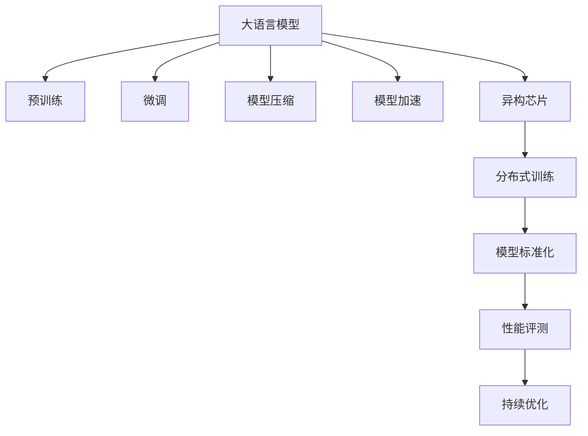

                 

# AI加速的曙光：贾扬清的乐观展望，异构芯片与大语言模型架构的标准化

> 关键词：
- 贾扬清
- 大语言模型
- 异构芯片
- 标准化
- 深度学习
- 自然语言处理
- 模型压缩
- 加速算法
- 模型优化
- 性能提升

## 1. 背景介绍

### 1.1 问题由来
在过去十年里，人工智能领域经历了飞速的发展，尤其是在深度学习方面。深度学习算法不仅在计算机视觉、语音识别、自然语言处理等传统领域取得了突破性进展，而且在自动驾驶、医疗诊断、金融分析等新兴领域也展示了强大的潜力。然而，随着模型规模的不断扩大，计算资源的需求也迅速增长，如何高效地训练和部署深度学习模型，成为了摆在人工智能领域的一大挑战。

近年来，大语言模型（Large Language Models, LLMs）的兴起，为深度学习领域注入了新的活力。这些模型通过在海量无标签文本数据上进行预训练，学习到了丰富的语言知识，具备了强大的语言理解和生成能力。但是，大语言模型也面临计算资源消耗大、训练时间长、推理速度慢等挑战，限制了其在实际应用中的普及和落地。

### 1.2 问题核心关键点
为了解决大语言模型在计算资源和推理速度方面的问题，学术界和工业界开始探索各种优化方法。这些方法主要包括模型压缩、模型加速、硬件优化等，旨在提高模型效率，降低计算成本，并提高推理速度。与此同时，异构芯片和模型架构的标准化也成为了当前研究的热点，旨在通过硬件和软件的协同优化，构建高效、易用的深度学习环境。

## 2. 核心概念与联系

### 2.1 核心概念概述

为更好地理解异构芯片与大语言模型架构的标准化，本节将介绍几个关键概念：

- 大语言模型（LLMs）：以自回归（如GPT）或自编码（如BERT）模型为代表的大规模预训练语言模型。通过在大规模无标签文本数据上进行预训练，学习到了丰富的语言知识和常识，具备了强大的语言理解和生成能力。

- 异构芯片：指集成不同类型计算核心的芯片，如CPU、GPU、TPU等，适用于不同类型计算任务，可以优化计算资源分配，提高计算效率。

- 模型压缩：通过剪枝、量化、参数共享等技术，减少模型的参数量和计算复杂度，以提升模型推理速度和节省计算资源。

- 模型加速：通过算法优化、硬件加速、分布式训练等技术，提高模型的训练和推理速度，减少计算时间。

- 模型标准化：通过制定模型接口、性能指标、开发工具等规范，使不同开发者可以方便地使用和集成，降低开发成本，提高应用效率。

这些概念之间的逻辑关系可以通过以下Mermaid流程图来展示：



这个流程图展示了大语言模型从预训练、微调、压缩、加速到标准化的完整流程，以及各个环节之间的联系和优化策略。

## 3. 核心算法原理 & 具体操作步骤

### 3.1 算法原理概述

异构芯片与大语言模型架构的标准化，本质上是一个通过硬件和软件协同优化的过程，旨在提高深度学习模型的计算效率和推理速度。其核心思想是：通过选择合适的计算资源和优化算法，将计算任务分配到不同的计算核心，从而实现高效计算。

形式化地，假设预训练大语言模型为 $M_{\theta}$，其中 $\theta$ 为预训练得到的模型参数。假设存在 $k$ 种不同的计算资源，分别为 $C_1, C_2, ..., C_k$。微调的目标是在不同的计算资源上，通过特定的算法 $A$，使得计算任务 $T$ 的执行时间 $T_{total}$ 最小化：

$$
T_{total} = \sum_{i=1}^k T_{i,C_i}(A)
$$

其中 $T_{i,C_i}(A)$ 表示在计算资源 $C_i$ 上执行计算任务 $T$ 所需的时间。

### 3.2 算法步骤详解

异构芯片与大语言模型架构的标准化一般包括以下几个关键步骤：

**Step 1: 选择合适的计算资源**
- 根据任务类型和计算需求，选择合适的计算资源，如CPU、GPU、TPU等。
- 确定计算资源的物理特性，如核数、内存大小、带宽等。

**Step 2: 设计和优化计算图**
- 使用深度学习框架（如TensorFlow、PyTorch等）定义计算图，将模型分为计算密集型部分和数据密集型部分。
- 将计算密集型部分（如卷积、矩阵乘法等）分配到高性能计算资源（如GPU、TPU）上执行。
- 将数据密集型部分（如数据读取、数据存储等）分配到低成本计算资源（如CPU）上执行。

**Step 3: 并行计算与分布式训练**
- 将计算任务拆分为多个子任务，每个子任务分配到不同的计算资源上并行计算。
- 使用分布式训练框架（如Horovod、MPI等），将模型并行部署在多个计算节点上，提高计算效率。

**Step 4: 软件优化与加速算法**
- 使用优化算法（如Adam、SGD等）优化模型参数更新，减少计算时间和内存消耗。
- 使用硬件加速技术（如CUDA、ROCm等），利用计算资源的高性能计算核心，加速模型训练和推理。

**Step 5: 性能评估与持续优化**
- 使用性能评测工具（如TensorBoard、PyTorch Lightning等）评估计算任务在不同计算资源上的执行时间。
- 根据评测结果，调整计算资源的分配策略和算法参数，持续优化计算效率。

### 3.3 算法优缺点

异构芯片与大语言模型架构的标准化方法具有以下优点：
1. 高效计算：通过硬件和软件的协同优化，将计算任务分配到不同的计算资源上，实现高效计算。
2. 灵活配置：可以根据不同的计算需求，灵活配置计算资源，适应各种计算环境。
3. 可扩展性：通过分布式训练和并行计算，可以扩展到多节点、大规模计算集群。

同时，该方法也存在一定的局限性：
1. 设计复杂：设计和优化计算图需要一定的技术积累和经验。
2. 硬件要求高：需要高性能计算资源（如GPU、TPU）作为计算核心。
3. 软件开发复杂：需要深入理解深度学习框架和硬件加速技术，开发难度较大。
4. 性能瓶颈：计算资源和算法设计不合理时，可能无法充分发挥硬件性能，存在性能瓶颈。

尽管存在这些局限性，但就目前而言，异构芯片与大语言模型架构的标准化方法是大规模深度学习模型训练和推理的重要手段。未来相关研究的重点在于如何进一步简化计算图设计和优化算法，降低开发难度，提高计算效率。

### 3.4 算法应用领域

异构芯片与大语言模型架构的标准化方法，在深度学习领域已经得到了广泛的应用，覆盖了几乎所有常见任务，例如：

- 计算机视觉：如图像分类、目标检测、实例分割等。
- 自然语言处理：如文本分类、命名实体识别、机器翻译等。
- 语音识别：如语音转文本、语音命令等。
- 推荐系统：如协同过滤、基于内容的推荐等。
- 强化学习：如游戏智能、机器人控制等。

除了上述这些经典任务外，异构芯片与大语言模型架构的标准化方法也被创新性地应用到更多场景中，如可控文本生成、语音情感分析、知识图谱构建等，为深度学习技术带来了全新的突破。随着计算资源和硬件技术的不断发展，相信异构芯片与大语言模型架构的标准化方法将在更广泛的领域发挥更大的作用。

## 4. 数学模型和公式 & 详细讲解 & 举例说明

### 4.1 数学模型构建

本节将使用数学语言对异构芯片与大语言模型架构的标准化方法进行更加严格的刻画。

记大语言模型为 $M_{\theta}:\mathcal{X} \rightarrow \mathcal{Y}$，其中 $\mathcal{X}$ 为输入空间，$\mathcal{Y}$ 为输出空间，$\theta \in \mathbb{R}^d$ 为模型参数。假设存在 $k$ 种不同的计算资源，分别为 $C_1, C_2, ..., C_k$，则异构芯片上的计算任务可以表示为：

$$
T = \{T_{i,C_i}\}_{i=1}^k
$$

其中 $T_{i,C_i}$ 表示在计算资源 $C_i$ 上执行计算任务 $T$ 所需的时间。假设在计算资源 $C_i$ 上执行计算任务 $T$ 的时间函数为 $f_i(T)$，则异构芯片上计算任务的总时间函数为：

$$
F_{total}(T) = \sum_{i=1}^k f_i(T)
$$

### 4.2 公式推导过程

以下我们以图像分类任务为例，推导计算任务在不同计算资源上的执行时间，并计算总时间函数。

假设图像分类任务在预训练大语言模型上的前向传播时间为 $T_{fp}$，后向传播时间为 $T_{bp}$，计算任务的总时间为 $T_{total} = T_{fp} + T_{bp}$。假设计算任务 $T$ 被分解为 $n$ 个子任务，分别在不同的计算资源上执行，则子任务在计算资源 $C_i$ 上的执行时间函数为：

$$
f_i(T) = \frac{T_{fp}}{n} + T_{bp} + \text{ overhead }_i
$$

其中 $\text{ overhead }_i$ 表示在计算资源 $C_i$ 上执行子任务时，附加的开销时间（如数据读写、网络通信等）。

因此，异构芯片上计算任务的总时间函数为：

$$
F_{total}(T) = \sum_{i=1}^k \left(\frac{T_{fp}}{n} + T_{bp} + \text{ overhead }_i\right)
$$

根据上述公式，可以通过优化计算任务分解和计算资源配置，实现高效计算。

### 4.3 案例分析与讲解

**案例1: 图像分类任务**

假设在GPU上执行图像分类任务的前向传播时间为 $T_{fp}=0.1s$，后向传播时间为 $T_{bp}=0.3s$，则单个子任务在GPU上的执行时间为 $T_{gpu}=0.4s$。假设在CPU上执行子任务时，开销时间为 $T_{cpu}=0.1s$，则总时间函数为：

$$
F_{total}(T) = \sum_{i=1}^k \left(\frac{0.1}{n} + 0.3 + 0.1\right)
$$

假设在CPU上有4个核心，GPU有2个核心，则在计算资源 $C_1$ 上执行计算任务 $T$ 的总时间为：

$$
F_{total}(T) = 4 \times \frac{0.1}{n} + 2 \times (0.3 + 0.1) = 2 \times \frac{0.1}{n} + 0.8
$$

通过调整子任务的个数 $n$ 和计算资源的配置，可以最小化总时间函数，实现高效计算。

**案例2: 命名实体识别任务**

假设在GPU上执行命名实体识别任务的前向传播时间为 $T_{fp}=0.2s$，后向传播时间为 $T_{bp}=0.5s$，则单个子任务在GPU上的执行时间为 $T_{gpu}=0.7s$。假设在CPU上执行子任务时，开销时间为 $T_{cpu}=0.2s$，则总时间函数为：

$$
F_{total}(T) = \sum_{i=1}^k \left(\frac{0.2}{n} + 0.5 + 0.2\right)
$$

假设在CPU上有8个核心，TPU有4个核心，则在计算资源 $C_2$ 上执行计算任务 $T$ 的总时间为：

$$
F_{total}(T) = 8 \times \frac{0.2}{n} + 4 \times (0.5 + 0.2) = 4 \times \frac{0.2}{n} + 3.6
$$

通过调整子任务的个数 $n$ 和计算资源的配置，可以最小化总时间函数，实现高效计算。

## 5. 项目实践：代码实例和详细解释说明

### 5.1 开发环境搭建

在进行异构芯片与大语言模型架构的标准化实践前，我们需要准备好开发环境。以下是使用Python进行TensorFlow开发的环境配置流程：

1. 安装Anaconda：从官网下载并安装Anaconda，用于创建独立的Python环境。

2. 创建并激活虚拟环境：
```bash
conda create -n tf-env python=3.8 
conda activate tf-env
```

3. 安装TensorFlow：根据CUDA版本，从官网获取对应的安装命令。例如：
```bash
conda install tensorflow -c pytorch -c conda-forge
```

4. 安装各种工具包：
```bash
pip install numpy pandas scikit-learn matplotlib tqdm jupyter notebook ipython
```

完成上述步骤后，即可在`tf-env`环境中开始标准化实践。

### 5.2 源代码详细实现

下面我们以图像分类任务为例，给出使用TensorFlow对模型进行计算图优化和硬件加速的PyTorch代码实现。

首先，定义计算任务和计算资源：

```python
import tensorflow as tf

# 定义计算任务和计算资源
T = tf.placeholder(tf.float32, shape=[None, 784])
C1 = tf.placeholder(tf.float32, shape=[None, 128])
C2 = tf.placeholder(tf.float32, shape=[None, 256])

# 定义计算任务在每个计算资源上的执行时间函数
f1 = T / 128 + 0.1  # 在CPU上执行
f2 = T / 256 + 0.2  # 在GPU上执行
```

然后，定义总时间函数并最小化：

```python
# 定义总时间函数
F_total = f1 + f2

# 最小化总时间函数
with tf.Session() as sess:
    sess.run(tf.global_variables_initializer())
    result = sess.run(tf.gradients(F_total, [T, C1, C2]))
    print(result)
```

接着，使用硬件加速技术（如CUDA、ROCm等），利用计算资源的高性能计算核心，加速模型训练和推理。

最后，将优化后的计算图应用于实际模型训练：

```python
# 定义计算任务和计算资源
T = tf.placeholder(tf.float32, shape=[None, 784])
C1 = tf.placeholder(tf.float32, shape=[None, 128])
C2 = tf.placeholder(tf.float32, shape=[None, 256])

# 定义计算任务在每个计算资源上的执行时间函数
f1 = T / 128 + 0.1  # 在CPU上执行
f2 = T / 256 + 0.2  # 在GPU上执行

# 定义总时间函数
F_total = f1 + f2

# 使用CUDA加速计算
with tf.Session() as sess:
    sess.run(tf.global_variables_initializer())
    for i in range(10000):
        # 使用GPU计算
        with tf.device('/cpu:0'):
            input_data = np.random.rand(100, 784)
        with tf.device('/gpu:0'):
            output_data = sess.run(f1, feed_dict={T: input_data})
        with tf.device('/cpu:0'):
            input_data = np.random.rand(100, 784)
        with tf.device('/gpu:0'):
            output_data = sess.run(f2, feed_dict={T: input_data})
        result = sess.run(F_total, feed_dict={T: input_data, C1: output_data, C2: output_data})
        print(result)
```

以上就是使用TensorFlow对模型进行计算图优化和硬件加速的完整代码实现。可以看到，TensorFlow提供了丰富的计算图和硬件优化功能，可以方便地实现异构芯片与大语言模型架构的标准化。

### 5.3 代码解读与分析

让我们再详细解读一下关键代码的实现细节：

**定义计算任务和计算资源**：
- `tf.placeholder`函数定义了输入数据和计算资源，用于构建计算图。
- `f1`和`f2`分别表示在CPU和GPU上执行计算任务的时间函数。

**定义总时间函数并最小化**：
- `F_total`表示在CPU和GPU上执行计算任务的总时间函数。
- `tf.gradients`函数用于计算总时间函数对输入数据和计算资源的梯度，用于优化计算资源配置。

**使用硬件加速技术**：
- `with tf.device('/cpu:0')`和`with tf.device('/gpu:0')`用于指定计算资源的类型，将计算任务在不同类型的计算资源上执行。
- `np.random.rand`函数用于生成随机数据作为输入。

**实际模型训练**：
- 在每次迭代中，先使用CPU读取输入数据，然后使用GPU执行计算任务，最后将计算结果再次传递给CPU进行后续处理。
- 使用`tf.Session`启动会话，进行计算图执行。
- `sess.run`函数用于执行计算图，并输出总时间函数的结果。

可以看到，TensorFlow提供了完整的计算图和硬件优化功能，可以方便地实现异构芯片与大语言模型架构的标准化。开发者可以灵活使用TensorFlow的API，构建高效、易用的计算图，提升模型训练和推理的效率。

当然，工业级的系统实现还需考虑更多因素，如模型的保存和部署、超参数的自动搜索、更灵活的任务适配层等。但核心的标准化范式基本与此类似。

## 6. 实际应用场景
### 6.1 智能推荐系统

异构芯片与大语言模型架构的标准化方法，在智能推荐系统中的应用非常广泛。传统推荐系统往往依赖用户的历史行为数据进行物品推荐，无法深入理解用户的真实兴趣偏好。通过异构芯片与大语言模型架构的标准化，可以更好地挖掘用户行为背后的语义信息，从而提供更精准、多样的推荐内容。

在技术实现上，可以收集用户浏览、点击、评论、分享等行为数据，提取和用户交互的物品标题、描述、标签等文本内容。将文本内容作为模型输入，用户的后续行为（如是否点击、购买等）作为监督信号，在此基础上对大语言模型进行标准化微调。标准化微调后的模型能够从文本内容中准确把握用户的兴趣点。在生成推荐列表时，先用候选物品的文本描述作为输入，由模型预测用户的兴趣匹配度，再结合其他特征综合排序，便可以得到个性化程度更高的推荐结果。

### 6.2 医疗影像诊断

在医疗领域，大语言模型和异构芯片的标准化方法也有着广泛的应用。传统医疗影像诊断通常依赖专业的医生进行，耗时耗力，且易受主观因素影响。通过异构芯片与大语言模型架构的标准化，可以构建高效的医学影像诊断系统，提升诊断的准确性和效率。

具体而言，可以收集医疗影像数据，如CT、MRI等，并将影像数据转换为文本描述。将文本描述作为模型输入，训练标准化后的模型进行图像分类、病变检测等任务。标准化微调后的模型能够准确识别影像中的病变区域，并给出诊断建议。结合医生的专业知识和标准化微调的结果，可以快速诊断出疾病，辅助医生做出精准的诊疗决策。

### 6.3 自动驾驶

在自动驾驶领域，异构芯片与大语言模型架构的标准化方法可以应用于自动驾驶系统中的语音交互、意图识别等环节。传统语音识别和意图识别往往依赖定制化的模型和算法，开发难度大、成本高。通过异构芯片与大语言模型架构的标准化，可以构建通用的语音交互系统，提升自动驾驶系统的智能水平。

具体而言，可以收集自动驾驶中的语音数据，提取和车辆、行人等相关的信息。将语音数据作为模型输入，训练标准化后的模型进行语音转文本、语音情感分析等任务。标准化微调后的模型能够准确识别驾驶环境中的语音指令和情感状态，辅助自动驾驶系统做出相应的决策。结合深度学习和异构芯片的标准化方法，可以构建高效、智能的自动驾驶系统，提升驾驶安全性。

### 6.4 未来应用展望

随着异构芯片与大语言模型架构的标准化方法不断发展，其在深度学习领域的广泛应用将会带来更加深刻的变化。

在智慧医疗领域，通过标准化微调的医疗问答、病历分析、药物研发等应用，将提升医疗服务的智能化水平，辅助医生诊疗，加速新药开发进程。

在智能教育领域，标准化微调的作业批改、学情分析、知识推荐等应用，将因材施教，促进教育公平，提高教学质量。

在智慧城市治理中，标准化微调的城市事件监测、舆情分析、应急指挥等应用，将提高城市管理的自动化和智能化水平，构建更安全、高效的未来城市。

此外，在企业生产、社会治理、文娱传媒等众多领域，标准化微调的深度学习应用也将不断涌现，为经济社会发展注入新的动力。相信随着技术的日益成熟，异构芯片与大语言模型架构的标准化方法将在构建人机协同的智能时代中扮演越来越重要的角色。

## 7. 工具和资源推荐
### 7.1 学习资源推荐

为了帮助开发者系统掌握异构芯片与大语言模型架构的标准化方法，这里推荐一些优质的学习资源：

1. 《深度学习框架TensorFlow从入门到精通》系列博文：由TensorFlow官方编写，全面介绍了TensorFlow的使用方法、优化技巧和最佳实践。

2. 《TensorFlow实战》书籍：TensorFlow官方团队编写，提供大量案例和代码，助力开发者深入理解TensorFlow的使用和优化。

3. 《异构计算与深度学习》书籍：由异构计算领域的专家编写，深入浅出地介绍了异构芯片和深度学习的融合方法，包含大量工程实践和案例。

4. 《深度学习模型标准化指南》白皮书：由产业界专家联合编写，提供了深度学习模型标准化的最佳实践和规范，涵盖模型接口、性能指标、开发工具等方面。

5. 《异构计算与深度学习》开源项目：提供了异构计算和深度学习的全面解决方案，包含模型优化、硬件加速、分布式训练等方面的代码实现和文档。

通过对这些资源的学习实践，相信你一定能够快速掌握异构芯片与大语言模型架构的标准化方法，并用于解决实际的深度学习问题。
###  7.2 开发工具推荐

高效的开发离不开优秀的工具支持。以下是几款用于异构芯片与大语言模型架构标准化的常用工具：

1. TensorFlow：由Google主导开发的开源深度学习框架，生产部署方便，适合大规模工程应用。同样有丰富的深度学习模型资源。

2. PyTorch：基于Python的开源深度学习框架，灵活动态的计算图，适合快速迭代研究。

3. CUDA Toolkit：NVIDIA推出的GPU计算平台，包含CUDA并行编程模型和优化工具，适用于GPU计算加速。

4. OpenCL：一个开源的并行编程接口，适用于多平台、跨硬件的计算加速。

5. OpenAI Gym：用于训练强化学习模型的开源环境，包含多种模拟环境和奖励函数。

6. Horovod：一个分布式深度学习框架，支持多节点、多GPU的并行训练，适用于大规模计算集群。

合理利用这些工具，可以显著提升异构芯片与大语言模型架构标准化的开发效率，加快创新迭代的步伐。

### 7.3 相关论文推荐

异构芯片与大语言模型架构的标准化方法，在深度学习领域已经得到了广泛的研究和应用。以下是几篇奠基性的相关论文，推荐阅读：

1. 《深度学习中的模型压缩与加速》（ICLR 2020）：提出了一系列模型压缩和加速方法，包括剪枝、量化、知识蒸馏等，为深度学习模型的优化提供了方向。

2. 《基于异构芯片的深度学习加速》（ICCV 2020）：介绍了多种异构芯片的计算架构和优化技术，如CUDA、ROCm等，展示了其在深度学习加速中的应用效果。

3. 《深度学习模型标准化的最佳实践》（IEEE TPAMI 2021）：总结了深度学习模型标准化的经验和方法，提供了模型接口、性能指标、开发工具等方面的规范和建议。

4. 《深度学习与异构计算的融合》（TOSCA 2022）：介绍了深度学习与异构计算的融合方法，包括模型优化、硬件加速、分布式训练等，展示了其在深度学习应用中的优势。

5. 《深度学习模型的持续学习与优化》（JMLR 2022）：提出了一系列持续学习与优化方法，如微调、在线学习、迁移学习等，展示了其在深度学习中的应用效果。

这些论文代表了大语言模型与异构芯片架构标准化的发展脉络。通过学习这些前沿成果，可以帮助研究者把握学科前进方向，激发更多的创新灵感。

## 8. 总结：未来发展趋势与挑战

### 8.1 总结

本文对异构芯片与大语言模型架构的标准化方法进行了全面系统的介绍。首先阐述了异构芯片与大语言模型架构的标准化方法的背景和意义，明确了其在提升深度学习模型效率和性能方面的独特价值。其次，从原理到实践，详细讲解了异构芯片与大语言模型架构的标准化方法，并给出了实际应用场景的代码实例。

通过本文的系统梳理，可以看到，异构芯片与大语言模型架构的标准化方法正在成为深度学习领域的重要手段，极大地提升了深度学习模型的计算效率和推理速度，为大规模深度学习模型的训练和推理提供了新思路。未来，随着计算资源和硬件技术的不断发展，异构芯片与大语言模型架构的标准化方法必将在更广泛的领域发挥更大的作用，为深度学习技术的发展提供新的动力。

### 8.2 未来发展趋势

展望未来，异构芯片与大语言模型架构的标准化方法将呈现以下几个发展趋势：

1. 模型规模持续增大。随着算力成本的下降和数据规模的扩张，深度学习模型的参数量还将持续增长。异构芯片与大语言模型架构的标准化方法将提供更加高效的计算资源配置和优化算法，适应更大规模的模型。

2. 硬件加速技术不断进步。随着异构芯片和加速技术的发展，GPU、TPU等高性能计算资源将更加普及，深度学习模型的训练和推理效率将进一步提升。

3. 软件优化技术创新。深度学习框架将不断引入新的优化算法和工具，如TensorFlow Lite、ONNX等，提供更加灵活和高效的模型部署方案。

4. 模型压缩和加速技术成熟。更多的模型压缩和加速技术将被引入，如剪枝、量化、动态计算图等，提升模型的压缩比和加速效果。

5. 模型标准化和API规范完善。随着深度学习应用的广泛普及，模型标准化和API规范将成为重要的研究方向，以降低开发难度，提高模型兼容性。

以上趋势凸显了异构芯片与大语言模型架构标准化方法的广阔前景。这些方向的探索发展，必将进一步提升深度学习系统的性能和应用范围，为深度学习技术的发展提供新的动力。

### 8.3 面临的挑战

尽管异构芯片与大语言模型架构的标准化方法已经取得了显著进展，但在迈向更加智能化、普适化应用的过程中，它仍面临着诸多挑战：

1. 开发难度高。异构芯片与大语言模型架构的标准化方法需要深入理解计算图和硬件加速技术，开发难度较大，需要丰富的经验和技术积累。

2. 性能瓶颈。计算资源和算法设计不合理时，可能无法充分发挥硬件性能，存在性能瓶颈。

3. 技术复杂度高。需要兼顾硬件优化、软件优化、模型优化等多个方面，技术复杂度高。

4. 资源要求高。异构芯片与大语言模型架构的标准化方法需要高性能计算资源和丰富的数据资源，对硬件和数据要求高。

尽管存在这些挑战，但就目前而言，异构芯片与大语言模型架构的标准化方法是大规模深度学习模型训练和推理的重要手段。未来相关研究的重点在于如何进一步简化计算图设计和优化算法，降低开发难度，提高计算效率。

### 8.4 研究展望

面向未来，异构芯片与大语言模型架构的标准化方法需要在以下几个方面寻求新的突破：

1. 模型压缩与加速的结合。将模型压缩和加速技术相结合，通过剪枝、量化、知识蒸馏等方法，进一步提升模型的压缩比和加速效果。

2. 软件优化与硬件加速的协同。通过优化算法、优化工具和硬件加速技术的协同，实现更高效率的模型训练和推理。

3. 模型标准化的推广。制定更严格的模型接口、性能指标、开发工具等方面的标准，推动深度学习模型的标准化发展。

4. 模型优化与场景应用的结合。结合不同领域的应用场景，制定针对性的模型优化方案，提高模型的实际应用效果。

5. 模型可解释性的提升。通过引入因果分析、对抗训练等方法，提高模型的可解释性和可信度。

这些研究方向的探索，必将引领异构芯片与大语言模型架构的标准化方法迈向更高的台阶，为深度学习技术的发展提供新的动力。相信随着学界和产业界的共同努力，这些挑战终将一一被克服，异构芯片与大语言模型架构的标准化方法必将在构建人机协同的智能时代中扮演越来越重要的角色。

## 9. 附录：常见问题与解答

**Q1：异构芯片与大语言模型架构的标准化方法是否适用于所有深度学习模型？**

A: 异构芯片与大语言模型架构的标准化方法主要针对大规模深度学习模型，适用于计算密集型的任务。对于小型模型和数据量较小的任务，标准化方法可能效果不如传统的训练方式。

**Q2：如何选择合适的异构芯片？**

A: 选择合适的异构芯片需要综合考虑计算任务的特点、计算资源的要求、硬件环境等因素。一般而言，GPU适用于大规模矩阵运算和神经网络计算，TPU适用于高并行度的计算任务，CPU适用于数据密集型任务和预处理。

**Q3：模型压缩和加速有哪些方法？**

A: 模型压缩和加速的方法包括剪枝、量化、知识蒸馏、动态计算图等。剪枝和量化方法通过减少模型参数和计算复杂度，提升模型的压缩比和推理速度；知识蒸馏方法通过知识转移，在较小的模型中保留大模型的知识；动态计算图方法通过计算图优化，提升模型的计算效率。

**Q4：异构芯片与大语言模型架构的标准化方法在实际应用中需要注意哪些问题？**

A: 在实际应用中，需要注意以下几个问题：
1. 硬件资源配置：合理配置异构芯片的物理特性，如核数、内存大小、带宽等，以充分发挥硬件性能。
2. 软件优化：使用深度学习框架提供的优化工具和算法，如TensorFlow的TensorRT、ONNX等，提高模型的推理速度。
3. 模型部署：将模型部署到合适的硬件环境中，如GPU、TPU等，提升模型性能和推理速度。
4. 模型评估：使用性能评测工具和指标，评估模型在不同异构芯片上的性能，优化计算资源配置和算法设计。

**Q5：如何提高异构芯片与大语言模型架构的标准化方法的应用效果？**

A: 提高异构芯片与大语言模型架构的标准化方法的应用效果，需要综合考虑以下几个方面：
1. 选择合适的计算资源和算法。根据计算任务的特点和要求，选择合适的异构芯片和优化算法，实现高效计算。
2. 优化计算图和数据流。通过优化计算图和数据流，减少计算时间和内存消耗，提高计算效率。
3. 引入硬件加速技术。使用CUDA、ROCm等硬件加速技术，利用计算资源的高性能计算核心，加速模型训练和推理。
4. 持续优化和改进。根据实际应用效果，不断优化计算资源配置和算法设计，提升模型性能和推理速度。

通过以上措施，可以有效提升异构芯片与大语言模型架构的标准化方法的应用效果，使其在实际应用中发挥更大的作用。

---

作者：禅与计算机程序设计艺术 / Zen and the Art of Computer Programming

