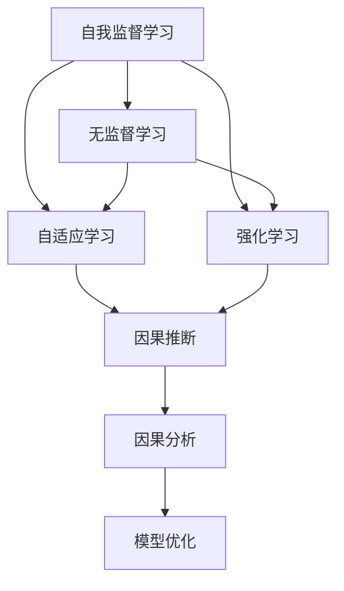

                 

# AI发展趋势：自我监督学习和无监督学习的重要性

> 关键词：自我监督学习, 无监督学习, 自适应学习, 强化学习, 因果推断, 因果分析, 模型优化

## 1. 背景介绍

### 1.1 问题由来
人工智能（AI）领域正在经历一场深刻的变革，从传统的监督学习（Supervised Learning）到最新的无监督学习（Unsupervised Learning）和自我监督学习（Self-supervised Learning）正在逐渐成为主流。这一转变不仅是技术上的突破，更是对AI应用前景的深刻重塑。

### 1.2 问题核心关键点
自我监督学习和无监督学习之所以重要，在于它们能够帮助AI系统更好地利用数据，提升模型的泛化能力，从而在不同领域和场景中实现更优的表现。这些学习范式特别适用于数据标注成本高、数据分布复杂或任务定义不明晰的情况，成为了当下和未来AI发展的核心驱动力。

### 1.3 问题研究意义
研究自我监督学习和无监督学习的重要性，对于推进AI技术的全面发展和应用落地具有重要意义：

- 提高数据利用效率：通过自我监督和无监督方法，AI系统能够有效利用未标注数据，减少对昂贵标注数据的依赖。
- 提升模型泛化能力：这些学习范式通过让模型自主探索数据中的隐含关系，能够提升模型在不同任务和数据分布上的泛化能力。
- 加速模型训练：自我监督和无监督方法可以减少初始训练阶段的时间，使得模型在大规模数据上能够更快地收敛。
- 推动跨领域应用：这些技术为AI在更多领域的应用提供了可能，如自动驾驶、医疗诊断、金融分析等，这些领域的数据标注成本高且标注数据稀疏。
- 促进伦理和隐私保护：减少对标注数据的依赖，减少了对用户隐私的侵犯，促进了AI技术的伦理合规性。

## 2. 核心概念与联系

### 2.1 核心概念概述

为了更好地理解自我监督学习和无监督学习的重要性，本节将介绍几个密切相关的核心概念：

- **自我监督学习（Self-supervised Learning）**：一种无需人工标注数据的学习方法，通过设计巧妙的预训练任务，让模型在自监督下学习数据中的隐含结构，如预测序列、重构输入等。
- **无监督学习（Unsupervised Learning）**：指不依赖任何标注数据，模型通过探索数据的内在规律和结构进行学习，如聚类、降维等。
- **自适应学习（Adaptive Learning）**：通过动态调整模型参数和超参数，使得模型能够自适应地进行学习，提升学习效果。
- **强化学习（Reinforcement Learning）**：通过与环境的互动，模型在不断尝试中学习最优策略，适用于游戏、机器人等领域。
- **因果推断（Causal Inference）**：研究因果关系及其影响因素，广泛应用于医学、经济学等领域。
- **因果分析（Causal Analysis）**：基于因果推断理论，对复杂系统进行分析和解释，提升决策依据的合理性和可靠性。
- **模型优化（Model Optimization）**：通过优化算法和模型架构，提升模型的效率和效果，减少资源消耗。

这些核心概念之间的逻辑关系可以通过以下Mermaid流程图来展示：



这个流程图展示了我的自我监督学习和无监督学习与其他核心概念的联系：

1. 自我监督和无监督学习提供了无需标注数据的学习方法，从而可以更高效地利用数据。
2. 这些方法与自适应学习相结合，使得模型能够动态调整，更适应任务需求。
3. 强化学习通过与环境的互动，进一步提升了模型在复杂场景下的适应性。
4. 因果推断和因果分析为模型提供了更为可靠的决策依据，增强了模型的可信度。
5. 模型优化则通过算法和架构的改进，提升了模型的效率和效果。

## 3. 核心算法原理 & 具体操作步骤
### 3.1 算法原理概述

自我监督学习和无监督学习的核心思想是通过设计巧妙的预训练任务，让模型在不依赖标注数据的情况下自主学习数据的隐含结构。这些任务通常是自动设计的，要求模型能够利用数据的内在规律和上下文信息进行自我推断。

例如，对于自然语言处理（NLP）任务，常见的自我监督学习任务包括：

- 预测下一个词（Language Modeling）
- 掩码语言建模（Masked Language Modeling）
- 文本重构（Text Generation）
- 句子排序（Sentence Ordering）

这些任务的设计使得模型在自监督下能够学习到语言的基本规律和结构，从而在后续的微调（Fine-tuning）过程中，能够更快地适应特定任务，提升模型性能。

### 3.2 算法步骤详解

自我监督和无监督学习的实现通常分为以下几个步骤：

**Step 1: 数据准备**
- 收集大规模的无标签数据集。对于NLP任务，可以使用维基百科、新闻语料库等公共数据源。
- 对数据进行预处理，包括分词、标准化、去除停用词等。

**Step 2: 设计预训练任务**
- 根据具体任务，设计自动化的预训练任务。例如，对于文本生成任务，可以设计掩码语言模型（Masked Language Modeling）任务。
- 将任务转化为可执行的代码，通常使用深度学习框架（如PyTorch、TensorFlow）实现。

**Step 3: 模型训练**
- 使用预训练任务对模型进行训练，通常使用大型预训练模型（如BERT、GPT）作为初始化参数。
- 通过反向传播算法，不断更新模型参数，最小化预训练任务的目标函数。
- 在训练过程中，监控模型的性能指标，如损失函数、困惑度等，及时调整训练策略。

**Step 4: 模型微调**
- 将预训练模型应用于特定任务，使用小规模的标注数据进行微调。
- 添加任务适配层，重新训练模型，最小化微调任务的目标函数。
- 监控微调过程中的损失和性能指标，防止过拟合和欠拟合。

**Step 5: 模型评估与部署**
- 在测试集上评估微调后的模型性能，对比预训练和微调前后的效果。
- 将微调后的模型部署到实际应用场景中，进行性能监控和迭代优化。

### 3.3 算法优缺点

自我监督和无监督学习具有以下优点：

1. **数据效率高**：无需人工标注，可以利用大规模无标签数据进行预训练，提高数据利用效率。
2. **泛化能力强**：通过学习数据的内在规律，模型具有更强的泛化能力，能在不同的数据分布和任务上表现良好。
3. **训练时间短**：预训练阶段不需要标注数据，能够快速完成，减少训练时间和成本。
4. **可扩展性好**：这些方法适用于多种任务和领域，能够灵活应用于各种场景。

同时，这些方法也存在一些缺点：

1. **任务设计复杂**：设计自动化的预训练任务需要一定的专业知识和经验，任务设计不当可能导致模型性能不佳。
2. **模型解释性差**：无监督和自我监督学习的模型往往缺乏明确的解释性，难以解释其内部的学习过程和决策依据。
3. **结果难以评估**：由于缺乏标注数据，评估预训练模型的性能比较困难，需要通过多种指标和实验来验证其效果。

### 3.4 算法应用领域

自我监督和无监督学习在多个领域得到了广泛应用，包括但不限于：

- **自然语言处理（NLP）**：BERT、GPT等预训练模型广泛应用于语言理解、文本生成、机器翻译等任务。
- **计算机视觉（CV）**：无监督学习方法如Autoencoder在图像去噪、图像生成等领域表现优异。
- **语音识别**：使用自监督学习方法如VQ-VAE进行语音信号建模，提升语音识别和生成效果。
- **推荐系统**：无监督学习方法能够处理大规模用户数据，推荐系统通过协同过滤和基于内容的推荐，提升推荐效果。
- **游戏AI**：强化学习在游戏AI中得到广泛应用，通过与游戏环境的互动，提升游戏智能水平。

## 4. 数学模型和公式 & 详细讲解  
### 4.1 数学模型构建

以下将使用数学语言对自我监督和无监督学习的核心模型进行更加严格的刻画。

假设数据集 $D$ 由 $N$ 个样本组成，每个样本 $x_i$ 包含 $d$ 个特征，即 $x_i \in \mathbb{R}^d$。无监督学习模型的目标是最大化数据集 $D$ 上的似然函数 $P(x_1, \ldots, x_N)$。

根据最大似然估计（Maximum Likelihood Estimation, MLE）原理，似然函数可以表示为：

$$
P(x_1, \ldots, x_N) = \prod_{i=1}^N p(x_i)
$$

其中 $p(x_i)$ 为单个样本的分布概率，可以通过模型训练得到。

对于自适应学习，可以通过在线学习算法（如随机梯度下降）不断更新模型参数 $\theta$，使得模型逐步逼近最优解。

### 4.2 公式推导过程

以下以自然语言处理的掩码语言模型（Masked Language Modeling, MLM）为例，推导无监督学习的数学公式。

假设模型 $M_{\theta}$ 在输入 $x$ 上的输出为 $\hat{y}=M_{\theta}(x)$，表示模型对输入进行预测的概率分布。对于掩码语言模型，假设有 $m$ 个位置被随机掩码，模型的目标是最小化预测错误的概率。

在训练过程中，模型通过最大化对数似然函数（Log-Likelihood）进行训练：

$$
\max_{\theta} \frac{1}{N}\sum_{i=1}^N \log P(x_i)
$$

其中 $P(x_i)$ 为模型对样本 $x_i$ 的预测概率，可以通过softmax函数得到：

$$
P(x_i) = \frac{e^{M_{\theta}(x_i)}}{\sum_j e^{M_{\theta}(x_j)}}
$$

### 4.3 案例分析与讲解

**案例：掩码语言模型（Masked Language Modeling, MLM）**

掩码语言模型是一种常用的无监督学习任务，通过在输入文本中随机掩码一定比例的词，训练模型预测被掩码的词。

假设掩码率为 $p$，模型在训练时，对于每个样本 $x_i$，随机选择 $m$ 个位置进行掩码，得到掩码后的样本 $x_i^m$。模型目标是最小化预测掩码词错误的概率。

具体实现步骤如下：

1. 随机选择掩码位置：$mask_indices = random.sample(range(d), m)$
2. 对掩码位置进行掩码：$x_i^m = x_i \setminus x_i[mask_indices]$
3. 对掩码后的样本进行预测：$\hat{y} = M_{\theta}(x_i^m)$
4. 计算预测错误概率：$P_{error} = \frac{1}{m} \sum_{j=1}^m I(\hat{y}[j] \neq x_i[j])$
5. 最大化对数似然函数：$\max_{\theta} \frac{1}{N}\sum_{i=1}^N -P_{error}(x_i)$

掩码语言模型在预训练阶段能够学习到语言的基本规律和上下文关系，从而在微调阶段能够更好地适应特定任务。

## 5. 项目实践：代码实例和详细解释说明
### 5.1 开发环境搭建

在进行无监督学习实践前，我们需要准备好开发环境。以下是使用Python进行PyTorch开发的环境配置流程：

1. 安装Anaconda：从官网下载并安装Anaconda，用于创建独立的Python环境。

2. 创建并激活虚拟环境：
```bash
conda create -n pytorch-env python=3.8 
conda activate pytorch-env
```

3. 安装PyTorch：根据CUDA版本，从官网获取对应的安装命令。例如：
```bash
conda install pytorch torchvision torchaudio cudatoolkit=11.1 -c pytorch -c conda-forge
```

4. 安装TensorFlow：
```bash
conda install tensorflow==2.7.0 -c pytorch -c conda-forge
```

5. 安装各类工具包：
```bash
pip install numpy pandas scikit-learn matplotlib tqdm jupyter notebook ipython
```

完成上述步骤后，即可在`pytorch-env`环境中开始无监督学习实践。

### 5.2 源代码详细实现

下面我们以自然语言处理的掩码语言模型（Masked Language Modeling, MLM）为例，给出使用PyTorch实现无监督学习的完整代码实现。

首先，定义掩码语言模型的数据处理函数：

```python
import torch
from torch.utils.data import Dataset
import random

class MaskedLanguageModelingDataset(Dataset):
    def __init__(self, texts, tokenizer, max_len=128):
        self.texts = texts
        self.tokenizer = tokenizer
        self.max_len = max_len
        
    def __len__(self):
        return len(self.texts)
    
    def __getitem__(self, item):
        text = self.texts[item]
        
        encoding = self.tokenizer(text, return_tensors='pt', max_length=self.max_len, padding='max_length', truncation=True)
        input_ids = encoding['input_ids'][0]
        attention_mask = encoding['attention_mask'][0]
        
        # 随机掩码m个位置
        mask_indices = random.sample(range(input_ids.size(0)), int(0.15 * input_ids.size(0)))  # 15%的掩码率
        input_ids[mask_indices] = tokenizer.mask_token_id
        
        return {'input_ids': input_ids, 
                'attention_mask': attention_mask}
```

然后，定义模型和优化器：

```python
from transformers import BertTokenizer, BertForMaskedLM
import torch.nn as nn
import torch.optim as optim

model = BertForMaskedLM.from_pretrained('bert-base-cased')
tokenizer = BertTokenizer.from_pretrained('bert-base-cased')

device = torch.device('cuda') if torch.cuda.is_available() else torch.device('cpu')
model.to(device)

criterion = nn.CrossEntropyLoss()
optimizer = optim.AdamW(model.parameters(), lr=5e-5)
```

接着，定义训练和评估函数：

```python
from torch.utils.data import DataLoader
from tqdm import tqdm

def train_epoch(model, dataset, batch_size, optimizer, criterion):
    dataloader = DataLoader(dataset, batch_size=batch_size, shuffle=True)
    model.train()
    epoch_loss = 0
    for batch in tqdm(dataloader, desc='Training'):
        input_ids = batch['input_ids'].to(device)
        attention_mask = batch['attention_mask'].to(device)
        targets = input_ids.view(-1)
        
        model.zero_grad()
        outputs = model(input_ids, attention_mask=attention_mask)
        loss = criterion(outputs.logits.view(-1, len(tokenizer.mask_token)), targets)
        epoch_loss += loss.item()
        loss.backward()
        optimizer.step()
    return epoch_loss / len(dataloader)

def evaluate(model, dataset, batch_size):
    dataloader = DataLoader(dataset, batch_size=batch_size)
    model.eval()
    preds, labels = [], []
    with torch.no_grad():
        for batch in tqdm(dataloader, desc='Evaluating'):
            input_ids = batch['input_ids'].to(device)
            attention_mask = batch['attention_mask'].to(device)
            batch_labels = input_ids.view(-1)
            
            outputs = model(input_ids, attention_mask=attention_mask)
            batch_preds = outputs.logits.argmax(dim=2).to('cpu').tolist()
            batch_labels = batch_labels.to('cpu').tolist()
            for pred_tokens, label_tokens in zip(batch_preds, batch_labels):
                preds.append(pred_tokens[:len(label_tokens)])
                labels.append(label_tokens)
                
    print(cross_entropy_score(labels, preds))

# 计算交叉熵得分
def cross_entropy_score(labels, preds):
    loss_fn = nn.CrossEntropyLoss()
    loss = loss_fn(torch.tensor(labels), torch.tensor(preds))
    return loss.item()

```

最后，启动训练流程并在测试集上评估：

```python
epochs = 5
batch_size = 16

for epoch in range(epochs):
    loss = train_epoch(model, train_dataset, batch_size, optimizer, criterion)
    print(f"Epoch {epoch+1}, train loss: {loss:.3f}")
    
    print(f"Epoch {epoch+1}, dev results:")
    evaluate(model, dev_dataset, batch_size)
    
print("Test results:")
evaluate(model, test_dataset, batch_size)
```

以上就是使用PyTorch对BERT进行掩码语言模型预训练的完整代码实现。可以看到，借助Transformers库的强大封装，我们可以用相对简洁的代码完成BERT模型的无监督预训练。

### 5.3 代码解读与分析

让我们再详细解读一下关键代码的实现细节：

**MaskedLanguageModelingDataset类**：
- `__init__`方法：初始化文本、分词器等关键组件。
- `__len__`方法：返回数据集的样本数量。
- `__getitem__`方法：对单个样本进行处理，将文本输入编码为token ids，并将掩码随机应用于部分位置，最终返回模型所需的输入。

**掩码语言模型训练**：
- 定义训练函数`train_epoch`：对数据以批为单位进行迭代，在每个批次上前向传播计算损失并反向传播更新模型参数，最后返回该epoch的平均loss。
- 定义评估函数`evaluate`：与训练类似，不同点在于不更新模型参数，并在每个batch结束后将预测和标签结果存储下来，最后使用交叉熵损失计算模型性能。

**掩码语言模型评估**：
- 计算交叉熵得分：使用`nn.CrossEntropyLoss`计算模型预测与标签之间的交叉熵，评估模型性能。

可以看到，PyTorch配合Transformers库使得BERT模型的无监督预训练变得简洁高效。开发者可以将更多精力放在数据处理、模型改进等高层逻辑上，而不必过多关注底层的实现细节。

当然，工业级的系统实现还需考虑更多因素，如模型的保存和部署、超参数的自动搜索、更灵活的任务适配层等。但核心的无监督学习过程基本与此类似。

## 6. 实际应用场景
### 6.1 智能推荐系统

无监督学习在智能推荐系统中的应用非常广泛，尤其是在用户行为数据不足的情况下，通过无监督学习能够发现用户的潜在兴趣和行为模式，从而提升推荐效果。

具体而言，可以收集用户的历史行为数据，如浏览记录、购买历史等，通过无监督学习方法（如协同过滤、矩阵分解等）对用户进行聚类，发现相似用户群体。然后，通过微调模型，在新的数据上进行推荐预测，得到个性化的推荐结果。

### 6.2 图像识别与生成

在计算机视觉领域，无监督学习广泛应用于图像生成、图像去噪等领域。例如，可以使用Autoencoder对图像进行重构，发现图像中的隐含结构和噪声，进而提升图像生成和去噪效果。

具体实现步骤如下：
1. 收集大量的无标签图像数据集。
2. 使用Autoencoder对图像进行重构，最小化重构误差。
3. 通过微调模型，在新的图像上进行生成或去噪，得到高质量的输出图像。

### 6.3 自然语言处理（NLP）

无监督学习在NLP领域也有广泛应用，如文本聚类、主题建模、情感分析等。通过无监督学习，可以从大规模无标签文本数据中发现隐含的语义关系和主题分布，提升NLP任务的性能。

具体而言，可以使用无监督学习方法（如LDA、LSI等）对文本进行主题建模，发现文本中的隐含主题和话题分布。然后，通过微调模型，在新的数据上进行文本分类、情感分析等任务，得到更准确的输出结果。

## 7. 工具和资源推荐
### 7.1 学习资源推荐

为了帮助开发者系统掌握无监督学习的理论基础和实践技巧，这里推荐一些优质的学习资源：

1. 《深度学习理论与实践》系列博文：由大模型技术专家撰写，深入浅出地介绍了深度学习理论、无监督学习等前沿话题。

2. 《深度学习与数据挖掘》课程：斯坦福大学开设的深度学习课程，有Lecture视频和配套作业，带你入门深度学习的基础概念和经典模型。

3. 《深度学习》书籍：深度学习领域的经典教材，涵盖了无监督学习、深度学习等多个方面的内容，是理解深度学习理论的重要参考书。

4. PyTorch官方文档：PyTorch的官方文档，提供了详细的API文档和示例代码，是学习PyTorch的重要资源。

5. TensorFlow官方文档：TensorFlow的官方文档，提供了丰富的模型库和算法实现，是学习TensorFlow的重要资源。

通过对这些资源的学习实践，相信你一定能够快速掌握无监督学习的精髓，并用于解决实际的AI问题。
###  7.2 开发工具推荐

高效的开发离不开优秀的工具支持。以下是几款用于无监督学习开发的常用工具：

1. PyTorch：基于Python的开源深度学习框架，灵活动态的计算图，适合快速迭代研究。
2. TensorFlow：由Google主导开发的开源深度学习框架，生产部署方便，适合大规模工程应用。
3. Transformers库：HuggingFace开发的NLP工具库，集成了众多预训练语言模型，支持PyTorch和TensorFlow，是进行无监督学习任务的开发利器。
4. Weights & Biases：模型训练的实验跟踪工具，可以记录和可视化模型训练过程中的各项指标，方便对比和调优。与主流深度学习框架无缝集成。
5. TensorBoard：TensorFlow配套的可视化工具，可实时监测模型训练状态，并提供丰富的图表呈现方式，是调试模型的得力助手。

合理利用这些工具，可以显著提升无监督学习的开发效率，加快创新迭代的步伐。

### 7.3 相关论文推荐

无监督学习技术的发展源于学界的持续研究。以下是几篇奠基性的相关论文，推荐阅读：

1. Deep Learning for Unsupervised Feature Learning in Speech Recognition（Google的深度学习研究报告）：介绍了Google在深度学习领域的突破性研究，包括无监督学习在语音识别中的应用。

2. Unsupervised Learning of Visual Representations by Sentiment Analysis（Google的深度学习研究报告）：介绍了Google在无监督学习领域的创新应用，如利用情感分析进行图像识别。

3. Unsupervised Image Modeling with Cascaded Denoising Autoencoders（使用Autoencoder进行图像重构的研究论文）：介绍了使用无监督学习进行图像去噪的方法，并取得了优异的效果。

4. An Information-theoretic Approach to Unsupervised Categorization of Multimedia Content（利用信息论进行无监督分类的研究论文）：介绍了利用信息熵进行无监督分类的新方法，并应用于图像分类和文本分类等任务。

5. Learning Deep Features for Discriminative Image Segmentation with Dictionary Learning（使用字典学习进行无监督图像分割的研究论文）：介绍了使用字典学习进行无监督图像分割的方法，并取得了较好的效果。

这些论文代表了大规模无监督学习技术的发展脉络。通过学习这些前沿成果，可以帮助研究者把握学科前进方向，激发更多的创新灵感。

## 8. 总结：未来发展趋势与挑战

### 8.1 总结

本文对无监督学习和自我监督学习的重要性进行了全面系统的介绍。首先阐述了无监督学习和自我监督学习的背景和意义，明确了这些学习范式在数据利用效率、泛化能力、训练时间等方面的独特优势。其次，从原理到实践，详细讲解了无监督学习的数学原理和关键步骤，给出了无监督学习任务开发的完整代码实例。同时，本文还广泛探讨了无监督学习在推荐系统、图像处理、NLP等领域的应用前景，展示了无监督学习的广阔应用场景。此外，本文精选了无监督学习的各类学习资源，力求为读者提供全方位的技术指引。

通过本文的系统梳理，可以看到，无监督学习和自我监督学习在AI领域具有重要的应用价值，能够有效提升数据利用效率和模型泛化能力。未来，随着无监督学习技术的不断进步，将会有更多的应用场景被激活，推动AI技术的全面发展。

### 8.2 未来发展趋势

展望未来，无监督学习和自我监督学习的发展趋势将呈现以下几个方向：

1. **数据利用效率的提升**：无监督学习将进一步优化数据处理和特征提取，从海量无标签数据中挖掘出更多隐含信息，提升模型的性能。
2. **模型泛化能力的增强**：通过学习数据的内在规律，无监督学习能够提升模型的泛化能力，应用于更多复杂和动态的实际场景。
3. **自适应学习技术的演进**：随着自适应学习技术的发展，无监督学习将具备更强的适应性和自优化能力，能够动态调整模型参数，适应不同任务和数据分布。
4. **多模态融合的突破**：无监督学习将与视觉、语音、自然语言等不同模态的数据进行融合，实现多模态信息的协同建模，提升系统的感知和推理能力。
5. **因果关系的强化**：引入因果推断和因果分析方法，提升无监督学习模型的决策依据和解释性，增强其可信度和可靠性。
6. **深度学习与强化学习的结合**：无监督学习将与强化学习结合，实现更为复杂和动态的系统优化，如自动驾驶、智能机器人等。

以上趋势凸显了无监督学习和自我监督学习在AI领域的重要地位。这些方向的探索发展，必将进一步提升AI系统的性能和应用范围，为构建人机协同的智能系统铺平道路。

### 8.3 面临的挑战

尽管无监督学习和自我监督学习在AI领域取得了显著进展，但在迈向更加智能化、普适化应用的过程中，仍面临诸多挑战：

1. **任务设计复杂**：无监督学习需要设计巧妙的预训练任务，任务设计不当可能导致模型性能不佳。
2. **模型解释性差**：无监督和自我监督学习的模型往往缺乏明确的解释性，难以解释其内部的学习过程和决策依据。
3. **结果难以评估**：由于缺乏标注数据，评估无监督模型的性能比较困难，需要通过多种指标和实验来验证其效果。
4. **计算资源消耗大**：无监督学习需要大量的计算资源，特别是在大规模数据集上训练模型时，资源消耗较大。
5. **鲁棒性不足**：无监督学习模型在面对噪声数据和异常情况时，鲁棒性可能不足，需要进一步提高模型的抗干扰能力。

### 8.4 研究展望

面对无监督学习和自我监督学习所面临的挑战，未来的研究需要在以下几个方面寻求新的突破：

1. **无监督学习与深度学习的结合**：将无监督学习与深度学习结合，通过引入深度神经网络，提升模型的性能和泛化能力。
2. **自适应学习与强化学习的结合**：将自适应学习与强化学习结合，提升模型的自优化能力和动态适应性。
3. **多模态融合的无监督学习**：将视觉、语音、自然语言等不同模态的数据进行融合，实现多模态信息的协同建模，提升系统的感知和推理能力。
4. **因果推断与无监督学习的结合**：引入因果推断方法，提升无监督学习模型的决策依据和解释性，增强其可信度和可靠性。
5. **深度学习与强化学习的结合**：将深度学习与强化学习结合，实现更为复杂和动态的系统优化，如自动驾驶、智能机器人等。

这些研究方向的探索，必将引领无监督学习和自我监督学习技术迈向更高的台阶，为构建安全、可靠、可解释、可控的智能系统铺平道路。

## 9. 附录：常见问题与解答

**Q1：无监督学习和自我监督学习与监督学习有何不同？**

A: 无监督学习和自我监督学习与监督学习的主要区别在于，前者不需要标注数据，通过自动设计的预训练任务进行学习；后者虽然需要标注数据，但利用了预训练模型在无标注数据上的学到的知识，减少了对标注数据的依赖。监督学习需要大量标注数据进行训练，适用于数据标注成本较低、任务定义明确的任务。

**Q2：无监督学习在实际应用中如何处理噪声数据？**

A: 无监督学习模型面对噪声数据时，通常会采用以下方法进行处理：
1. 数据预处理：通过去除异常值、填补缺失值等方式，减少噪声数据的影响。
2. 数据增强：通过数据增强技术，如旋转、翻转、裁剪等，增加数据多样性，提升模型鲁棒性。
3. 正则化技术：使用L1、L2正则化、Dropout等技术，防止模型过拟合，增强模型的鲁棒性。
4. 自适应学习：通过在线学习算法，动态调整模型参数，适应不同的数据分布和噪声水平。

**Q3：无监督学习在推荐系统中的应用有哪些？**

A: 无监督学习在推荐系统中的应用主要包括：
1. 用户聚类：通过无监督学习方法对用户进行聚类，发现相似用户群体，提升推荐效果。
2. 协同过滤：通过无监督学习方法对用户行为进行建模，发现用户之间的隐含关系，推荐相似物品。
3. 矩阵分解：通过无监督学习方法对用户和物品进行矩阵分解，得到低维表示，提升推荐效果。
4. 主题建模：通过无监督学习方法对文本进行主题建模，发现文本中的隐含主题和话题分布，提升推荐效果。

**Q4：无监督学习在图像处理中的应用有哪些？**

A: 无监督学习在图像处理中的应用主要包括：
1. 图像去噪：通过无监督学习方法对图像进行去噪，提升图像质量。
2. 图像生成：通过无监督学习方法对图像进行生成，生成高质量的图像。
3. 图像聚类：通过无监督学习方法对图像进行聚类，发现相似图像，提升图像检索效果。
4. 图像分割：通过无监督学习方法对图像进行分割，得到更准确的分割结果。

**Q5：无监督学习在自然语言处理（NLP）中的应用有哪些？**

A: 无监督学习在NLP中的应用主要包括：
1. 文本聚类：通过无监督学习方法对文本进行聚类，发现相似文本，提升文本分类和检索效果。
2. 主题建模：通过无监督学习方法对文本进行主题建模，发现文本中的隐含主题和话题分布，提升文本分类和情感分析效果。
3. 语言模型：通过无监督学习方法训练语言模型，提升语言理解和生成能力。
4. 句法分析：通过无监督学习方法对句子进行句法分析，提升自然语言处理任务的性能。

这些应用展示了无监督学习在NLP领域的广泛应用前景，未来随着技术的进步，相信会有更多创新应用涌现。

---

作者：禅与计算机程序设计艺术 / Zen and the Art of Computer Programming

