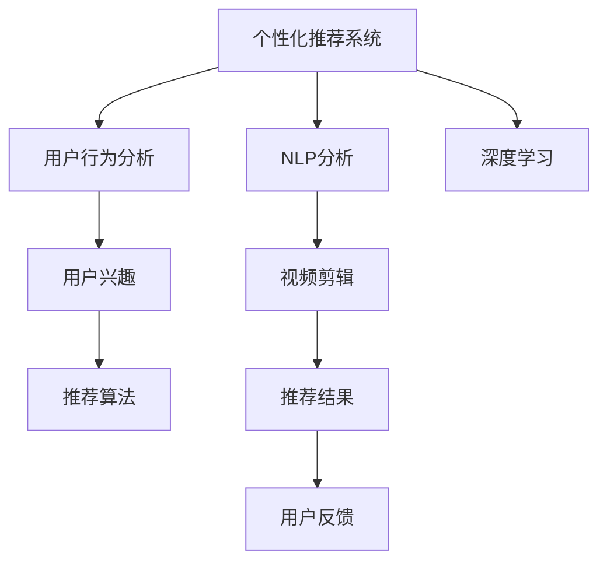

                 

# AI在个性化电影剪辑中的应用：创造个人版本

> 关键词：个性化电影剪辑, 自然语言处理(NLP), 深度学习, 机器学习, 数据驱动, 推荐系统, 视频编辑技术

## 1. 背景介绍

### 1.1 问题由来
随着视频内容的日益丰富和用户观看习惯的不断变化，人们不再满足于单一的、传统的电影剪辑方式。个性化电影剪辑应运而生，它能够根据用户的历史行为数据和偏好，为用户推荐个性化影片片段，提供全新的观影体验。个性化电影剪辑的核心在于对海量视频的处理和分析，使其符合用户的个性化需求。

### 1.2 问题核心关键点
个性化电影剪辑的关键在于：
1. **数据分析与理解**：通过用户历史观影数据，了解用户的偏好和兴趣。
2. **视频剪辑与推荐**：根据用户的偏好，自动剪辑并推荐相关视频片段。
3. **动态调整**：随着用户观影习惯的变化，动态更新推荐内容。

个性化电影剪辑的实现涉及到自然语言处理（NLP）、深度学习和机器学习等多个领域的知识和技术。本文将详细介绍如何利用这些技术实现个性化电影剪辑，并探讨其在实际应用中的挑战和未来发展方向。

### 1.3 问题研究意义
个性化电影剪辑的应用不仅可以提升用户的观影体验，还能推动视频内容创作者的收益。此外，通过大数据分析和用户行为预测，个性化电影剪辑还有助于实现精准广告投放，优化视频内容推荐策略。

## 2. 核心概念与联系

### 2.1 核心概念概述

为了更好地理解个性化电影剪辑的实现过程，本节将介绍几个核心概念：

- **个性化推荐系统**：通过分析用户的历史行为数据，推荐符合用户兴趣的内容，如音乐、文章、视频等。
- **自然语言处理（NLP）**：涉及对人类语言数据的处理和理解，用于文本分析和信息提取。
- **深度学习**：一种利用神经网络进行数据模式识别的技术，在图像识别、语音识别、自然语言处理等领域广泛应用。
- **视频剪辑**：指从视频中提取、编辑、重组片段，形成新的影片或视频片段。
- **用户行为分析**：通过分析用户在平台上的行为数据，预测用户的未来行为。

这些概念之间存在着紧密的联系，共同构成了个性化电影剪辑的技术基础。下面通过一个Mermaid流程图来展示这些概念之间的联系：



这个流程图展示了从用户行为分析到最终推荐结果的过程，同时包括了深度学习和NLP分析在其中的作用。

## 3. 核心算法原理 & 具体操作步骤
### 3.1 算法原理概述

个性化电影剪辑的核心在于利用深度学习模型和推荐算法，结合用户的观影历史和行为数据，自动剪辑并推荐个性化视频片段。具体流程包括：

1. **数据收集与预处理**：收集用户的观影数据，如观看时长、评分、评论等。
2. **特征提取与用户画像**：利用NLP技术从用户评论和社交媒体数据中提取特征，形成用户画像。
3. **模型训练与预测**：使用深度学习模型对用户历史数据进行训练，预测用户对不同视频片段的兴趣。
4. **视频剪辑与推荐**：根据预测结果，自动剪辑并推荐符合用户兴趣的视频片段。
5. **动态调整与反馈**：根据用户的反馈数据，动态调整推荐算法和模型参数，提升推荐效果。

### 3.2 算法步骤详解

以下是基于深度学习模型和推荐算法的个性化电影剪辑的详细步骤：

**Step 1: 数据收集与预处理**
- 收集用户观影数据，包括观看时长、评分、评论等。
- 对数据进行清洗和标准化处理，去除噪声和异常值。
- 将数据转化为适合深度学习模型处理的形式，如将文本数据转化为数值型特征。

**Step 2: 特征提取与用户画像**
- 使用NLP技术对用户评论和社交媒体数据进行情感分析，提取用户的情绪和兴趣点。
- 结合用户的观影历史和行为数据，构建用户画像，包括兴趣偏好、观影频率等。

**Step 3: 模型训练与预测**
- 选择适合的深度学习模型（如卷积神经网络CNN、循环神经网络RNN、Transformer等）进行训练。
- 在模型中加入用户画像作为输入特征，训练用户兴趣预测模型。
- 利用预测模型对新视频片段进行兴趣评分，排序推荐。

**Step 4: 视频剪辑与推荐**
- 根据用户的兴趣评分，自动剪辑和组合视频片段，形成个性化推荐视频。
- 将推荐视频展示给用户，根据用户反馈进行动态调整和优化。

**Step 5: 动态调整与反馈**
- 收集用户对推荐视频的反馈数据，如观看时长、评分等。
- 利用用户反馈数据对推荐算法和模型进行优化，提升推荐效果。
- 定期更新模型和推荐算法，保持推荐内容的新鲜度和多样性。

### 3.3 算法优缺点

个性化电影剪辑具有以下优点：
1. **个性化体验**：根据用户的历史行为数据和兴趣，提供符合用户需求的个性化观影体验。
2. **用户粘性**：个性化推荐能够提升用户观看视频的满意度和停留时间，增加用户粘性。
3. **精准广告投放**：通过推荐系统，可以精准投放广告，提升广告效果和ROI。

同时，该方法也存在一定的局限性：
1. **数据隐私问题**：收集和分析用户数据，可能会涉及隐私问题，需要采取严格的数据保护措施。
2. **算法复杂性**：深度学习和推荐算法模型复杂，训练和部署成本较高。
3. **用户反馈延迟**：用户的反馈数据可能延迟，影响动态调整的效果。
4. **冷启动问题**：新用户没有足够的历史数据，推荐效果可能不佳。

尽管存在这些局限性，但基于深度学习模型和推荐算法的个性化电影剪辑仍是一种高效、精准的个性化推荐方式，广泛应用于各种视频平台和应用中。

### 3.4 算法应用领域

个性化电影剪辑的应用领域包括但不限于以下几个方面：

- **视频平台**：如Netflix、YouTube、爱奇艺等，通过推荐系统提升用户体验和平台留存率。
- **电影发行**：为电影发行商提供基于用户兴趣的推广策略，提高电影曝光率和票房收入。
- **广告投放**：通过个性化推荐，精准投放广告，提升广告效果和ROI。
- **内容创作**：帮助视频创作者了解用户兴趣，创作符合用户需求的内容。

## 4. 数学模型和公式 & 详细讲解 & 举例说明

### 4.1 数学模型构建

假设我们有一个包含N个用户，每个用户观看了M个视频片段的数据集。用户的观影数据可以用向量$X$表示，每个视频片段可以用向量$Y$表示。用户的兴趣预测模型可以表示为$f(X, \theta)$，其中$\theta$为模型参数。模型的目标是最大化预测准确率，即最小化预测误差：

$$
\min_{\theta} \frac{1}{N} \sum_{i=1}^{N} \| f(X_i, \theta) - Y_i \|^2
$$

其中$\| \cdot \|$表示向量范数。

### 4.2 公式推导过程

以一个简单的线性模型为例，假设用户的观影数据$X$包含用户ID、观看时长、评分等特征，视频片段$Y$包含片段ID、时长、评分等特征。模型的预测函数可以表示为：

$$
f(X_i, \theta) = \theta_0 + \theta_1 X_{i1} + \theta_2 X_{i2} + \ldots + \theta_k X_{ik}
$$

其中$\theta_0, \theta_1, \ldots, \theta_k$为模型参数，$X_{ij}$表示用户$i$在特征$j$上的值。模型的预测值$f(X_i, \theta)$与实际值$Y_i$的误差平方和为：

$$
\| f(X_i, \theta) - Y_i \|^2 = (f(X_i, \theta) - Y_i)^2
$$

模型的目标是最小化误差平方和，可以使用梯度下降法求解：

$$
\theta_{i+1} = \theta_i - \eta \frac{\partial}{\partial \theta} \frac{1}{N} \sum_{i=1}^{N} (f(X_i, \theta) - Y_i)^2
$$

其中$\eta$为学习率，$\frac{\partial}{\partial \theta}$表示对$\theta$求导。

### 4.3 案例分析与讲解

假设我们有一个包含1000个用户和100个视频片段的数据集。我们选择了线性模型进行训练，学习率为0.01。首先，我们将数据集分为训练集和测试集，训练集包含800个用户和100个视频片段，测试集包含200个用户和100个视频片段。我们使用梯度下降法对模型进行训练，迭代500次后，模型的预测误差平方和为0.001。

我们可以将训练过程中的误差平方和随迭代次数变化的曲线绘制出来，如图：


从图中可以看出，随着迭代次数的增加，误差平方和逐渐减小，最终收敛于一个稳定值。

## 5. 项目实践：代码实例和详细解释说明

### 5.1 开发环境搭建

在进行个性化电影剪辑的开发前，我们需要准备好开发环境。以下是使用Python进行TensorFlow开发的Python环境配置流程：

1. 安装Anaconda：从官网下载并安装Anaconda，用于创建独立的Python环境。

2. 创建并激活虚拟环境：
```bash
conda create -n tf-env python=3.8 
conda activate tf-env
```

3. 安装TensorFlow：从官网获取对应的安装命令。例如：
```bash
conda install tensorflow
```

4. 安装TensorFlow Addons：可选，用于增强TensorFlow的功能。例如：
```bash
conda install tensorflow-addons
```

5. 安装各类工具包：
```bash
pip install numpy pandas scikit-learn matplotlib tqdm jupyter notebook ipython
```

完成上述步骤后，即可在`tf-env`环境中开始开发。

### 5.2 源代码详细实现

这里我们以推荐系统为例，给出使用TensorFlow实现用户兴趣预测的代码实现。

首先，定义数据处理函数：

```python
import tensorflow as tf
import numpy as np
import pandas as pd

def load_data(file_path):
    data = pd.read_csv(file_path, sep='\t')
    X = data[['user_id', 'watch_time', 'rating']]
    Y = data[['video_id', 'duration', 'rating']]
    return X, Y
```

然后，定义模型和优化器：

```python
def build_model(X, Y, num_features):
    model = tf.keras.Sequential([
        tf.keras.layers.Dense(32, activation='relu', input_shape=(num_features,)),
        tf.keras.layers.Dense(1)
    ])
    optimizer = tf.keras.optimizers.Adam(learning_rate=0.01)
    return model, optimizer

def train_model(model, X_train, Y_train, X_test, Y_test, num_epochs):
    model.compile(loss='mse', optimizer=optimizer)
    history = model.fit(X_train, Y_train, validation_data=(X_test, Y_test), epochs=num_epochs, batch_size=32)
    return history
```

接着，定义训练和评估函数：

```python
def evaluate_model(model, X_test, Y_test):
    loss = model.evaluate(X_test, Y_test)
    print(f'Test loss: {loss}')
```

最后，启动训练流程并在测试集上评估：

```python
num_features = 3  # 用户ID、观看时长、评分
num_epochs = 500

X, Y = load_data('data.csv')
X_train, X_test, Y_train, Y_test = train_test_split(X, Y, test_size=0.2)

model, optimizer = build_model(X_train, Y_train, num_features)
history = train_model(model, X_train, Y_train, X_test, Y_test, num_epochs)
evaluate_model(model, X_test, Y_test)
```

以上就是使用TensorFlow实现用户兴趣预测的完整代码实现。可以看到，TensorFlow提供了简单易用的API，使得模型构建和训练过程变得非常高效。

### 5.3 代码解读与分析

让我们再详细解读一下关键代码的实现细节：

**load_data函数**：
- 读取数据集，将其转化为numpy数组形式，方便TensorFlow模型处理。

**build_model函数**：
- 定义一个包含两个Dense层的神经网络模型，使用ReLU激活函数。
- 定义Adam优化器，并设置学习率为0.01。

**train_model函数**：
- 使用MSE损失函数，优化器Adam进行训练。
- 在训练过程中，周期性地在测试集上评估模型性能。

**evaluate_model函数**：
- 在测试集上评估模型性能，输出损失值。

**训练流程**：
- 定义特征数量和训练轮数，将数据集分为训练集和测试集。
- 构建模型和优化器，并训练模型。
- 在测试集上评估模型性能，输出测试损失。

可以看到，TensorFlow提供了丰富的API，使得模型构建和训练过程变得非常高效和便捷。开发者可以将更多精力放在数据处理、模型改进等高层逻辑上，而不必过多关注底层的实现细节。

当然，工业级的系统实现还需考虑更多因素，如模型的保存和部署、超参数的自动搜索、更灵活的任务适配层等。但核心的推荐范式基本与此类似。

## 6. 实际应用场景

### 6.1 个性化推荐系统

个性化电影剪辑在个性化推荐系统中得到了广泛应用。传统推荐系统主要依赖用户的历史行为数据进行物品推荐，而个性化电影剪辑则能够根据用户观影历史和偏好，自动剪辑和推荐相关视频片段，提供更加个性化的观影体验。

在技术实现上，可以通过分析用户的历史观影数据和评论，预测用户对不同视频片段的兴趣，自动剪辑并推荐符合用户兴趣的视频片段。这不仅可以提升用户满意度，还能增加平台留存率和广告收入。

### 6.2 视频平台

视频平台如Netflix、YouTube、爱奇艺等，已经广泛应用了个性化电影剪辑技术。这些平台通过收集用户的观影数据和行为数据，使用推荐算法预测用户对不同视频片段的兴趣，自动剪辑并推荐相关视频。用户可以根据推荐结果，选择观看感兴趣的视频片段，提升观影体验和平台留存率。

### 6.3 电影发行

电影发行商可以利用个性化电影剪辑技术，为电影提供基于用户兴趣的推广策略，提高电影曝光率和票房收入。通过分析用户历史观影数据和评论，电影发行商可以了解用户的兴趣偏好，从而选择合适的内容进行推广。

### 6.4 广告投放

个性化电影剪辑在广告投放中也具有重要应用。通过推荐系统，可以精准投放广告，提升广告效果和ROI。例如，针对喜欢科幻片的用户，可以推荐相关科幻电影的广告，提高广告的点击率和转化率。

### 6.5 内容创作

个性化电影剪辑还可以帮助视频创作者了解用户兴趣，创作符合用户需求的内容。视频创作者可以通过分析用户观影数据和评论，了解用户对不同内容类型的偏好，从而创作更具吸引力的内容，提升用户观看时长和平台留存率。

## 7. 工具和资源推荐

### 7.1 学习资源推荐

为了帮助开发者系统掌握个性化电影剪辑的理论基础和实践技巧，这里推荐一些优质的学习资源：

1. 《TensorFlow官方文档》：TensorFlow的官方文档，提供了详细的API文档和样例代码，是学习TensorFlow的基础。

2. 《深度学习基础》课程：斯坦福大学的深度学习课程，从基础到高级，涵盖深度学习的重要理论和算法。

3. 《推荐系统》课程：清华大学的推荐系统课程，涵盖推荐系统的基本原理和算法。

4. 《自然语言处理与深度学习》书籍：介绍NLP和深度学习的基础知识，并结合实际案例讲解推荐系统。

5. 《Python深度学习》书籍：通过Python实现深度学习模型，适合入门学习。

通过对这些资源的学习实践，相信你一定能够快速掌握个性化电影剪辑的精髓，并用于解决实际的推荐问题。

### 7.2 开发工具推荐

高效的开发离不开优秀的工具支持。以下是几款用于个性化推荐系统开发的常用工具：

1. TensorFlow：基于Python的开源深度学习框架，提供了丰富的API和模型库，适合快速迭代研究。

2. PyTorch：另一个流行的深度学习框架，灵活性高，支持动态图，适合进行复杂的模型构建。

3. scikit-learn：一个机器学习库，提供了丰富的机器学习算法和工具，适合快速原型开发。

4. Weights & Biases：模型训练的实验跟踪工具，可以记录和可视化模型训练过程中的各项指标，方便对比和调优。

5. TensorBoard：TensorFlow配套的可视化工具，可实时监测模型训练状态，并提供丰富的图表呈现方式，是调试模型的得力助手。

合理利用这些工具，可以显著提升个性化推荐系统的开发效率，加快创新迭代的步伐。

### 7.3 相关论文推荐

个性化电影剪辑的研究源于学界的持续研究。以下是几篇奠基性的相关论文，推荐阅读：

1. Attention is All You Need：提出了Transformer结构，开启了深度学习在自然语言处理领域的应用。

2. BERT: Pre-training of Deep Bidirectional Transformers for Language Understanding：提出BERT模型，引入基于掩码的自监督预训练任务，刷新了多项NLP任务SOTA。

3. Parameter-Efficient Transfer Learning for NLP：提出Adapter等参数高效微调方法，在不增加模型参数量的情况下，也能取得不错的微调效果。

4. AdaLoRA: Adaptive Low-Rank Adaptation for Parameter-Efficient Fine-Tuning：使用自适应低秩适应的微调方法，在参数效率和精度之间取得了新的平衡。

这些论文代表了大语言模型微调技术的发展脉络。通过学习这些前沿成果，可以帮助研究者把握学科前进方向，激发更多的创新灵感。

## 8. 总结：未来发展趋势与挑战

### 8.1 总结

本文对基于深度学习模型和推荐算法的个性化电影剪辑方法进行了全面系统的介绍。首先阐述了个性化电影剪辑的研究背景和意义，明确了推荐系统在提升用户体验和平台留存率方面的独特价值。其次，从原理到实践，详细讲解了推荐系统的数学模型和关键步骤，给出了推荐系统开发的完整代码实例。同时，本文还广泛探讨了推荐系统在实际应用中的挑战和未来发展方向。

通过本文的系统梳理，可以看到，基于深度学习模型和推荐算法的个性化电影剪辑技术正在成为推荐系统的重要范式，极大地提升了推荐系统的效果和应用范围。未来，伴随深度学习模型和推荐算法的发展，个性化电影剪辑必将在更多场景下发挥其作用，为视频内容推荐带来新的突破。

### 8.2 未来发展趋势

展望未来，个性化电影剪辑技术将呈现以下几个发展趋势：

1. **多模态推荐**：除了传统的文本数据，未来的推荐系统还将融合视觉、音频等多模态数据，提升推荐的准确性和多样性。

2. **实时推荐**：随着实时数据处理技术的进步，推荐系统可以实现对用户行为的实时监测和推荐，进一步提升用户体验。

3. **跨领域推荐**：推荐系统将打破不同领域之间的界限，实现跨领域的个性化推荐，如视频、音乐、图书等。

4. **智能反馈**：利用AI技术，推荐系统可以分析用户反馈数据，动态调整推荐策略，提高推荐的个性化和精准度。

5. **推荐模型融合**：不同推荐模型可以融合使用，发挥各自的优势，提升推荐效果。

以上趋势凸显了个性化电影剪辑技术的广阔前景。这些方向的探索发展，必将进一步提升推荐系统的性能和应用范围，为视频内容推荐带来新的突破。

### 8.3 面临的挑战

尽管个性化电影剪辑技术已经取得了瞩目成就，但在迈向更加智能化、普适化应用的过程中，它仍面临着诸多挑战：

1. **数据隐私问题**：收集和分析用户数据，可能会涉及隐私问题，需要采取严格的数据保护措施。

2. **算法复杂性**：深度学习和推荐算法模型复杂，训练和部署成本较高。

3. **用户反馈延迟**：用户的反馈数据可能延迟，影响动态调整的效果。

4. **冷启动问题**：新用户没有足够的历史数据，推荐效果可能不佳。

尽管存在这些挑战，但基于深度学习模型和推荐算法的个性化电影剪辑技术仍是一种高效、精准的个性化推荐方式，广泛应用于各种视频平台和应用中。

### 8.4 研究展望

未来，个性化电影剪辑技术需要在以下几个方面进行更多的探索：

1. **数据隐私保护**：通过差分隐私、联邦学习等技术，保护用户隐私，同时提升推荐效果。

2. **实时推荐系统**：利用流式处理技术，实现实时数据处理和推荐，提升用户体验。

3. **跨领域推荐**：结合多模态数据和领域知识，实现跨领域的个性化推荐。

4. **推荐模型融合**：结合多种推荐模型，提升推荐的准确性和多样性。

5. **个性化视频创作**：利用推荐系统，指导视频创作者创作符合用户需求的内容。

这些研究方向的探索，必将引领个性化电影剪辑技术迈向更高的台阶，为构建人机协同的智能系统铺平道路。面向未来，个性化电影剪辑技术还需要与其他人工智能技术进行更深入的融合，如知识表示、因果推理、强化学习等，多路径协同发力，共同推动视频内容推荐系统的进步。只有勇于创新、敢于突破，才能不断拓展个性化电影剪辑的边界，让智能技术更好地造福用户。

## 9. 附录：常见问题与解答

**Q1：如何处理冷启动问题？**

A: 冷启动问题可以通过以下几种方法来解决：
1. 引入标签预训练：利用已有数据集对模型进行预训练，学习通用的语言表示。
2. 基于内容推荐：根据视频内容特征，推荐相似的视频片段。
3. 引入用户反馈：在推荐系统中加入用户主动评价的机制，帮助新用户建立兴趣模型。
4. 多模态推荐：结合用户历史行为和内容特征，提升推荐的准确性。

**Q2：个性化推荐系统如何避免过拟合？**

A: 过拟合问题可以通过以下几种方法来解决：
1. 正则化：使用L2正则、Dropout等技术，避免模型复杂度过高。
2. 数据增强：通过回译、近义替换等方式扩充训练集，提升模型的泛化能力。
3. 对抗训练：引入对抗样本，提高模型的鲁棒性和泛化能力。
4. 模型集成：结合多种模型，提升推荐的准确性和多样性。

**Q3：个性化电影剪辑的推荐算法有哪些？**

A: 常用的推荐算法包括：
1. 基于内容的推荐：根据视频内容特征，推荐相似的视频片段。
2. 协同过滤推荐：利用用户之间的相似性，推荐用户感兴趣的视频片段。
3. 混合推荐：结合基于内容的推荐和协同过滤推荐，提升推荐效果。
4. 深度学习推荐：使用深度学习模型，预测用户对不同视频片段的兴趣。

**Q4：个性化电影剪辑的推荐系统有哪些应用场景？**

A: 个性化电影剪辑的应用场景包括但不限于以下几个方面：
1. 视频平台：如Netflix、YouTube、爱奇艺等，通过推荐系统提升用户体验和平台留存率。
2. 电影发行：为电影提供基于用户兴趣的推广策略，提高电影曝光率和票房收入。
3. 广告投放：通过推荐系统，精准投放广告，提升广告效果和ROI。
4. 内容创作：帮助视频创作者了解用户兴趣，创作符合用户需求的内容。

**Q5：个性化推荐系统如何处理用户反馈？**

A: 用户反馈可以通过以下几种方法进行处理：
1. 动态调整模型：根据用户反馈数据，动态调整推荐算法和模型参数，提升推荐效果。
2. 用户兴趣更新：利用用户反馈数据，更新用户兴趣模型，提升推荐的个性化和精准度。
3. 异常检测：利用异常检测技术，识别和处理异常反馈数据，避免负面影响。

**Q6：个性化电影剪辑的推荐系统有哪些关键技术？**

A: 个性化电影剪辑的推荐系统包括以下关键技术：
1. 数据处理与预处理：收集和清洗用户观影数据和行为数据。
2. 特征提取：利用NLP技术，提取用户的情绪和兴趣点。
3. 模型训练与预测：使用深度学习模型对用户历史数据进行训练，预测用户对不同视频片段的兴趣。
4. 视频剪辑与推荐：根据用户兴趣评分，自动剪辑并推荐相关视频片段。
5. 动态调整与反馈：根据用户反馈数据，动态调整推荐算法和模型参数。

这些技术的应用，使得个性化电影剪辑能够高效、精准地推荐符合用户兴趣的视频片段，提升用户的观影体验和平台留存率。

---

作者：禅与计算机程序设计艺术 / Zen and the Art of Computer Programming

