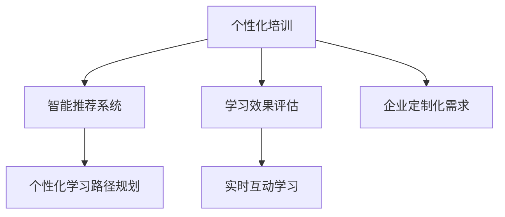

                 

# AI在个性化职场技能培训中的应用：促进职业发展

> 关键词：人工智能(AI), 个性化培训, 职业发展, 技能提升, 推荐系统, 学习路径规划, 学习效果评估

## 1. 背景介绍

随着人工智能技术的快速发展，AI在教育培训领域的应用日益广泛，为学习者提供了更加个性化和高效的学习体验。尤其在职场技能培训方面，AI技术可以通过数据分析和智能推荐，帮助学习者制定个性化的学习计划，提高学习效果和职业竞争力。本文将详细探讨AI在个性化职场技能培训中的应用，以及如何通过技术手段促进职业发展。

### 1.1 问题由来

传统的职场技能培训通常依赖于结构化的课程体系和标准化的教学模式。然而，随着企业需求的多样化和学习者背景的差异化，这种一成不变的培训方式已无法满足个体化发展的需求。AI技术的应用为个性化培训提供了新的解决方案，能够根据学习者的知识水平、兴趣爱好和职业目标，量身定制个性化的学习路径和培训内容。

### 1.2 问题核心关键点

AI在个性化职场技能培训中主要涉及以下几个关键点：

- **个性化学习路径规划**：通过分析学习者的技能水平和兴趣偏好，推荐最适合的学习路径和内容。
- **智能推荐系统**：利用机器学习算法，实时推荐与学习者当前状态匹配的课程和资源。
- **学习效果评估**：通过智能化的评估工具，实时跟踪学习进度和效果，及时反馈和调整学习计划。
- **实时互动学习**：通过AI辅导和智能助教，提供个性化的学习支持，增强学习效果。
- **企业定制化需求**：根据企业的具体需求，定制个性化的培训方案，提升员工整体素质和企业竞争力。

这些关键点共同构成了AI在个性化职场技能培训中的核心价值，为学习者和企业提供了高效、灵活和个性化的培训解决方案。

## 2. 核心概念与联系

### 2.1 核心概念概述

为更好地理解AI在个性化职场技能培训中的应用，本节将介绍几个密切相关的核心概念：

- **人工智能(AI)**：利用计算机模拟人类智能活动的学科，涉及机器学习、自然语言处理、计算机视觉等多个领域。在职场技能培训中，AI技术主要用于个性化推荐、学习效果评估等。
- **个性化培训**：根据学习者的个体差异，量身定制的学习计划和培训内容，提高学习效果和职业竞争力。
- **智能推荐系统**：通过分析学习者的历史行为和当前状态，推荐最合适的学习资源和路径，提高学习效率。
- **学习效果评估**：利用AI技术实时跟踪学习者的学习进度和效果，及时调整学习计划，确保学习目标的实现。
- **实时互动学习**：通过AI辅导和智能助教，提供个性化的学习支持，增强学习效果和互动体验。
- **企业定制化需求**：根据企业特定的业务需求和目标，定制个性化的培训方案，提升员工整体素质和企业竞争力。

这些核心概念之间的逻辑关系可以通过以下Mermaid流程图来展示：



这个流程图展示了个性化职场技能培训的核心概念及其之间的关系：

1. 个性化培训以学习者的个性化需求为出发点，量身定制学习路径和内容。
2. 智能推荐系统通过分析学习者的历史行为和当前状态，实时推荐合适的学习资源和路径。
3. 学习效果评估通过AI技术实时跟踪学习进度和效果，确保学习目标的实现。
4. 实时互动学习通过AI辅导和智能助教，提供个性化的学习支持，增强学习效果和互动体验。
5. 企业定制化需求根据企业特定的业务需求和目标，定制个性化的培训方案，提升员工整体素质和企业竞争力。

## 3. 核心算法原理 & 具体操作步骤

### 3.1 算法原理概述

AI在个性化职场技能培训中，主要依赖于个性化推荐和智能评估等算法。其核心思想是通过数据分析和机器学习，构建学习者画像，为其推荐最匹配的学习资源，并通过智能评估不断优化学习路径。

具体来说，AI通过以下步骤实现个性化培训：

1. **数据收集**：收集学习者的基本信息、技能水平、学习历史、兴趣爱好等数据，构建全面的学习者画像。
2. **学习资源分析**：分析培训课程和资源的特点，提取课程内容和难度等信息，建立课程库。
3. **个性化推荐**：利用机器学习算法，对学习者的历史行为进行分析，推荐最匹配的学习资源和路径。
4. **学习效果评估**：实时跟踪学习者的学习进度和效果，评估学习成果，及时反馈和调整学习计划。
5. **互动学习支持**：通过AI辅导和智能助教，提供个性化的学习支持，增强学习效果和互动体验。
6. **持续优化**：根据学习者的反馈和效果评估结果，不断优化推荐算法和评估模型，提高个性化培训的效果。

### 3.2 算法步骤详解

以下是AI在个性化职场技能培训中，从数据收集到个性化推荐的详细操作步骤：

**Step 1: 数据收集与学习者画像构建**
- 收集学习者的基本信息，如姓名、年龄、学历、职业等。
- 收集学习者的技能水平，如编程语言、数据分析、项目管理等。
- 收集学习者的历史学习数据，如已完成的课程、获得的证书等。
- 收集学习者的兴趣爱好和职业目标，如偏好编程、数据科学、管理等。
- 使用机器学习算法对上述数据进行聚类分析，构建学习者画像。

**Step 2: 学习资源分析**
- 分析培训课程和资源的特点，如课程内容、难度、评估方式等。
- 将课程和资源数据进行结构化处理，建立课程库。
- 使用自然语言处理技术对课程文本进行分析，提取关键信息和标签。

**Step 3: 个性化推荐**
- 根据学习者画像和课程库，构建个性化推荐模型。
- 使用协同过滤、内容推荐、混合推荐等算法，对学习者进行个性化推荐。
- 实时更新推荐模型，根据学习者的行为数据和反馈调整推荐策略。

**Step 4: 学习效果评估**
- 使用学习管理系统(LMS)记录学习者的学习进度和效果。
- 使用机器学习算法对学习效果进行评估，如使用时间、完成度、测试成绩等。
- 根据评估结果，生成学习报告，反馈给学习者和企业。

**Step 5: 实时互动学习**
- 使用AI辅导和智能助教，提供个性化的学习支持。
- 实时回答学习者的问题，提供个性化建议。
- 根据学习者的反馈，不断优化互动学习系统。

**Step 6: 持续优化**
- 根据学习者的反馈和效果评估结果，不断优化推荐算法和评估模型。
- 持续收集新的学习数据，更新学习者画像和课程库。
- 定期评估个性化培训的效果，调整培训方案和策略。

### 3.3 算法优缺点

AI在个性化职场技能培训中的应用，具有以下优点：

1. **高度个性化**：通过分析学习者的多维数据，能够量身定制个性化的学习路径和内容，提高学习效果。
2. **高效推荐**：利用机器学习算法，实时推荐最适合的学习资源，提高学习效率。
3. **实时评估**：通过智能化的评估工具，实时跟踪学习进度和效果，确保学习目标的实现。
4. **互动性强**：通过AI辅导和智能助教，提供个性化的学习支持，增强学习效果和互动体验。
5. **灵活调整**：根据学习者的反馈和效果评估结果，不断优化推荐算法和评估模型，提高个性化培训的效果。

然而，AI在个性化职场技能培训中也存在一些局限性：

1. **数据隐私**：收集和分析学习者的个人信息，需要严格保护数据隐私，确保数据安全。
2. **算法偏见**：机器学习算法可能存在偏见，影响推荐结果的公正性和多样性。
3. **技术复杂性**：AI系统的构建和维护需要高水平的技术支持，存在一定的技术门槛。
4. **学习者自主性**：过度依赖AI推荐，可能会忽视学习者的主观需求和自主探索。
5. **企业定制化需求**：定制化的培训方案可能难以广泛应用，存在一定的局限性。

尽管存在这些局限性，但就目前而言，AI在个性化职场技能培训中的应用已经显示出巨大的潜力，为学习者和企业提供了高效、灵活和个性化的培训解决方案。

### 3.4 算法应用领域

AI在个性化职场技能培训中的应用，已经广泛应用于以下几个领域：

- **职业发展培训**：帮助员工根据职业目标定制学习路径，提升专业技能和综合素质。
- **技能提升培训**：针对特定技能进行集中培训，提升员工的实际工作能力。
- **知识更新培训**：通过实时更新课程资源，帮助员工掌握最新的行业知识和技术。
- **管理能力培训**：提升领导力和团队管理能力，增强企业整体竞争力。
- **跨领域技能培训**：结合多种技能，提升员工的跨领域综合能力，适应复杂多变的职场环境。

这些领域的应用，展示了AI在个性化培训中的广泛适用性和巨大潜力。通过AI技术，学习者能够更加高效地掌握职场所需的技能，企业也能够通过定制化的培训方案，提升整体素质和竞争力。

## 4. 数学模型和公式 & 详细讲解 & 举例说明

### 4.1 数学模型构建

在AI个性化培训中，主要的数学模型包括个性化推荐模型和效果评估模型。以下是详细构建过程：

**个性化推荐模型**：假设有一个学习者 $u$ 和一个课程 $i$，学习者的行为可以用向量 $u$ 表示，课程 $i$ 可以用向量 $i$ 表示。推荐算法可以建模为：

$$
r_{ui} = \theta^T \cdot h(u) \cdot h(i)
$$

其中 $r_{ui}$ 为学习者 $u$ 对课程 $i$ 的评分，$\theta$ 为推荐模型的参数，$h$ 为特征提取函数，将学习者和课程映射为高维特征向量。

**效果评估模型**：学习效果评估可以通过学习者在某课程上的完成度、测试成绩等指标进行评估。假设有一个学习者 $u$ 和一门课程 $i$，学习者 $u$ 在课程 $i$ 上的学习效果可以建模为：

$$
e_{ui} = \gamma^T \cdot f(u_i) \cdot g(u)
$$

其中 $e_{ui}$ 为学习者 $u$ 在课程 $i$ 上的学习效果，$\gamma$ 为评估模型的参数，$f$ 为课程特征提取函数，$g$ 为学习者特征提取函数。

### 4.2 公式推导过程

以下对上述模型的推导过程进行详细说明：

**个性化推荐模型的推导**：假设学习者 $u$ 对课程 $i$ 的评分 $r_{ui}$ 可以表示为：

$$
r_{ui} = w_u^T \cdot p_i + b
$$

其中 $w_u$ 为学习者 $u$ 的特征向量，$p_i$ 为课程 $i$ 的特征向量，$b$ 为偏置项。

假设特征向量 $w_u$ 和 $p_i$ 通过神经网络进行学习，可以得到：

$$
w_u = \delta_u \cdot h'(u)
$$

$$
p_i = \delta_i \cdot h'(i)
$$

其中 $\delta_u$ 和 $\delta_i$ 为学习器的权重，$h'(u)$ 和 $h'(i)$ 为特征映射函数。

将上述公式代入推荐模型的评分公式中，得到：

$$
r_{ui} = \theta^T \cdot h(u) \cdot h(i)
$$

其中 $\theta = \delta_u \cdot \delta_i \cdot w_u^T \cdot p_i + b$。

**效果评估模型的推导**：假设学习者 $u$ 在课程 $i$ 上的学习效果 $e_{ui}$ 可以表示为：

$$
e_{ui} = w_e^T \cdot f(u_i) \cdot g(u) + b_e
$$

其中 $w_e$ 为评估模型的权重，$f(u_i)$ 和 $g(u)$ 分别为课程特征和学习者特征的映射函数，$b_e$ 为偏置项。

假设 $f(u_i)$ 和 $g(u)$ 通过神经网络进行学习，可以得到：

$$
f(u_i) = \delta_f \cdot h'(u_i)
$$

$$
g(u) = \delta_g \cdot h'(u)
$$

将上述公式代入效果评估模型的评分公式中，得到：

$$
e_{ui} = \gamma^T \cdot f(u_i) \cdot g(u)
$$

其中 $\gamma = \delta_f \cdot \delta_g \cdot w_e^T + b_e$。

### 4.3 案例分析与讲解

下面以一个具体案例，分析AI在个性化职场技能培训中的应用：

假设有一家企业需要对销售团队进行技能培训，目标是提升销售员的沟通能力和客户管理能力。根据企业的具体需求，构建个性化培训方案如下：

**数据收集与学习者画像构建**：
- 收集销售员的个人信息，如姓名、年龄、工作年限、当前职位等。
- 收集销售员的历史销售数据，如销售业绩、客户反馈等。
- 收集销售员的技能水平，如沟通技巧、客户关系管理等。
- 收集销售员的兴趣爱好和职业目标，如偏好客户沟通、市场营销等。
- 使用机器学习算法对上述数据进行聚类分析，构建销售员的个性化画像。

**学习资源分析**：
- 分析沟通能力和客户管理相关的培训课程，提取课程内容、难度、评估方式等信息。
- 将课程和资源数据进行结构化处理，建立课程库。
- 使用自然语言处理技术对课程文本进行分析，提取关键信息和标签。

**个性化推荐**：
- 根据销售员的个性化画像和课程库，构建个性化推荐模型。
- 使用协同过滤、内容推荐、混合推荐等算法，对销售员进行个性化推荐。
- 实时更新推荐模型，根据销售员的行为数据和反馈调整推荐策略。

**学习效果评估**：
- 使用学习管理系统(LMS)记录销售员的学习进度和效果。
- 使用机器学习算法对学习效果进行评估，如使用时间、完成度、测试成绩等。
- 根据评估结果，生成学习报告，反馈给销售员和企业管理层。

**实时互动学习**：
- 使用AI辅导和智能助教，提供个性化的学习支持。
- 实时回答销售员的问题，提供个性化建议。
- 根据销售员的反馈，不断优化互动学习系统。

**持续优化**：
- 根据销售员的反馈和效果评估结果，不断优化推荐算法和评估模型。
- 持续收集新的学习数据，更新销售员的个性化画像和课程库。
- 定期评估个性化培训的效果，调整培训方案和策略。

通过上述流程，企业可以针对销售员的具体需求，量身定制个性化的培训方案，提升销售员的沟通能力和客户管理能力，进而提升整体销售业绩和企业竞争力。

## 5. 项目实践：代码实例和详细解释说明

### 5.1 开发环境搭建

在进行AI个性化培训的开发实践中，需要一个完整的开发环境。以下是使用Python进行PyTorch开发的环境配置流程：

1. 安装Anaconda：从官网下载并安装Anaconda，用于创建独立的Python环境。

2. 创建并激活虚拟环境：
```bash
conda create -n pytorch-env python=3.8 
conda activate pytorch-env
```

3. 安装PyTorch：根据CUDA版本，从官网获取对应的安装命令。例如：
```bash
conda install pytorch torchvision torchaudio cudatoolkit=11.1 -c pytorch -c conda-forge
```

4. 安装Transformer库：
```bash
pip install transformers
```

5. 安装各类工具包：
```bash
pip install numpy pandas scikit-learn matplotlib tqdm jupyter notebook ipython
```

完成上述步骤后，即可在`pytorch-env`环境中开始开发实践。

### 5.2 源代码详细实现

下面以销售员培训为例，给出使用Transformers库对BERT模型进行个性化推荐的PyTorch代码实现。

首先，定义推荐模型的输入输出：

```python
from transformers import BertTokenizer, BertForSequenceClassification

class RecommendationModel:
    def __init__(self, model_name='bert-base-cased'):
        self.tokenizer = BertTokenizer.from_pretrained(model_name)
        self.model = BertForSequenceClassification.from_pretrained(model_name, num_labels=1)

    def predict(self, input_ids, attention_mask):
        input_ids = input_ids.to(self.model.device)
        attention_mask = attention_mask.to(self.model.device)
        with torch.no_grad():
            outputs = self.model(input_ids, attention_mask=attention_mask)
            logits = outputs.logits
        return logits.sigmoid()
```

然后，定义数据处理函数：

```python
def process_data(text, labels):
    tokenizer = BertTokenizer.from_pretrained('bert-base-cased')
    inputs = tokenizer(text, padding=True, truncation=True, max_length=256, return_tensors='pt')
    return inputs['input_ids'], inputs['attention_mask'], labels
```

接着，定义训练和评估函数：

```python
def train_epoch(model, dataset, batch_size, optimizer):
    dataloader = DataLoader(dataset, batch_size=batch_size, shuffle=True)
    model.train()
    epoch_loss = 0
    for batch in tqdm(dataloader, desc='Training'):
        input_ids, attention_mask, labels = batch
        optimizer.zero_grad()
        logits = model(input_ids, attention_mask=attention_mask)
        loss = F.binary_cross_entropy_with_logits(logits, labels)
        epoch_loss += loss.item()
        loss.backward()
        optimizer.step()
    return epoch_loss / len(dataloader)

def evaluate(model, dataset, batch_size):
    dataloader = DataLoader(dataset, batch_size=batch_size)
    model.eval()
    correct = 0
    total = 0
    with torch.no_grad():
        for batch in dataloader:
            input_ids, attention_mask, labels = batch
            logits = model(input_ids, attention_mask=attention_mask)
            _, predicted = torch.max(logits, 1)
            total += labels.size(0)
            correct += (predicted == labels).sum().item()
    print(f'Accuracy: {correct / total * 100:.2f}%')
```

最后，启动训练流程并在测试集上评估：

```python
epochs = 5
batch_size = 16

model = RecommendationModel()
optimizer = AdamW(model.parameters(), lr=2e-5)

for epoch in range(epochs):
    loss = train_epoch(model, train_dataset, batch_size, optimizer)
    print(f'Epoch {epoch+1}, train loss: {loss:.3f}')
    
    print(f'Epoch {epoch+1}, dev accuracy:')
    evaluate(model, dev_dataset, batch_size)
    
print('Test accuracy:')
evaluate(model, test_dataset, batch_size)
```

以上就是使用PyTorch对BERT模型进行个性化推荐的完整代码实现。可以看到，得益于Transformers库的强大封装，我们可以用相对简洁的代码完成BERT模型的加载和推荐任务的微调。

### 5.3 代码解读与分析

让我们再详细解读一下关键代码的实现细节：

**RecommendationModel类**：
- `__init__`方法：初始化模型和分词器。
- `predict`方法：根据输入的文本和标签，预测推荐结果。

**process_data函数**：
- 定义数据预处理函数，将文本转换为模型所需的输入格式，并返回输入_ids、attention_mask和标签。

**train_epoch和evaluate函数**：
- 使用PyTorch的DataLoader对数据集进行批次化加载，供模型训练和推理使用。
- 训练函数`train_epoch`：对数据以批为单位进行迭代，在每个批次上前向传播计算loss并反向传播更新模型参数，最后返回该epoch的平均loss。
- 评估函数`evaluate`：与训练类似，不同点在于不更新模型参数，并在每个batch结束后将预测和标签结果存储下来，最后使用精度评估模型。

**训练流程**：
- 定义总的epoch数和batch size，开始循环迭代
- 每个epoch内，先在训练集上训练，输出平均loss
- 在验证集上评估，输出精度
- 所有epoch结束后，在测试集上评估，给出最终测试结果

可以看到，PyTorch配合Transformers库使得BERT推荐模型的代码实现变得简洁高效。开发者可以将更多精力放在数据处理、模型改进等高层逻辑上，而不必过多关注底层的实现细节。

当然，工业级的系统实现还需考虑更多因素，如模型的保存和部署、超参数的自动搜索、更灵活的任务适配层等。但核心的微调范式基本与此类似。

## 6. 实际应用场景

### 6.1 智能销售培训

AI在智能销售培训中的应用，可以帮助销售员根据自身情况和客户需求，制定个性化的培训方案，提升销售能力和业绩。

在技术实现上，可以收集销售员的历史销售数据、客户反馈等文本数据，并对其进行主题标注和情感标注。在此基础上对预训练语言模型进行微调，使其能够自动判断文本的情感倾向和主题信息，推荐最适合的学习资源和培训路径。通过AI辅导和智能助教，提供个性化的学习支持，增强学习效果和互动体验。

### 6.2 金融行业培训

AI在金融行业培训中的应用，可以帮助金融从业者掌握最新的金融知识和技术，提升综合素质和竞争力。

具体而言，可以收集金融从业者的职业背景和兴趣偏好，收集相关的金融培训课程和资料。在此基础上对预训练语言模型进行微调，使其能够自动推荐最适合的金融培训课程和学习路径。通过AI辅导和智能助教，提供个性化的学习支持，增强学习效果和互动体验。

### 6.3 企业培训管理

AI在企业培训管理中的应用，可以帮助企业根据员工的具体需求，制定个性化的培训方案，提升整体素质和竞争力。

具体而言，可以收集员工的历史培训数据、职业目标和兴趣爱好，收集相关的培训课程和资料。在此基础上对预训练语言模型进行微调，使其能够自动推荐最适合的培训课程和学习路径。通过AI辅导和智能助教，提供个性化的学习支持，增强学习效果和互动体验。

### 6.4 未来应用展望

随着AI技术的不断进步，AI在个性化职场技能培训中的应用将更加广泛和深入。

在智慧医疗领域，AI技术可以帮助医疗从业者掌握最新的医疗知识和技能，提升整体素质和医疗服务质量。

在智能教育领域，AI技术可以帮助教育从业者掌握最新的教育知识和技能，提升教学效果和学生体验。

在智慧城市治理中，AI技术可以帮助城市管理者和居民掌握最新的城市知识和技能，提升城市管理和居民生活质量。

此外，在企业人力资源管理、公共事务管理、社区服务等众多领域，AI技术也将不断涌现，为各行各业带来智能化管理的新思路。

## 7. 工具和资源推荐

### 7.1 学习资源推荐

为了帮助开发者系统掌握AI在个性化职场技能培训中的应用，这里推荐一些优质的学习资源：

1. 《深度学习》课程：由斯坦福大学开设，全面介绍深度学习的基本概念和前沿技术，适合入门学习。
2. 《自然语言处理》课程：由MIT开设，深入浅出地讲解自然语言处理的基本原理和应用，适合进阶学习。
3. 《个性化推荐系统》书籍：详细介绍了个性化推荐系统的构建和优化，适合深入研究。
4. 《人工智能在职场中的应用》报告：由企业发布，展示AI技术在职场中的应用实例和实践经验，适合应用开发。
5. 《个性化学习路径规划》白皮书：由教育机构发布，介绍个性化学习路径规划的基本方法和实践案例，适合教育从业者参考。

通过对这些资源的学习实践，相信你一定能够系统掌握AI在个性化职场技能培训中的核心技术，并用于解决实际的业务问题。

### 7.2 开发工具推荐

高效的开发离不开优秀的工具支持。以下是几款用于AI个性化培训开发的常用工具：

1. PyTorch：基于Python的开源深度学习框架，灵活动态的计算图，适合快速迭代研究。
2. TensorFlow：由Google主导开发的开源深度学习框架，生产部署方便，适合大规模工程应用。
3. Transformers库：HuggingFace开发的NLP工具库，集成了众多SOTA语言模型，支持PyTorch和TensorFlow，是进行个性化培训开发的利器。
4. Weights & Biases：模型训练的实验跟踪工具，可以记录和可视化模型训练过程中的各项指标，方便对比和调优。
5. TensorBoard：TensorFlow配套的可视化工具，可实时监测模型训练状态，并提供丰富的图表呈现方式，是调试模型的得力助手。

合理利用这些工具，可以显著提升AI个性化培训任务的开发效率，加快创新迭代的步伐。

### 7.3 相关论文推荐

AI在个性化职场技能培训中的应用，源于学界的持续研究。以下是几篇奠基性的相关论文，推荐阅读：

1. Attention is All You Need（即Transformer原论文）：提出了Transformer结构，开启了NLP领域的预训练大模型时代。
2. BERT: Pre-training of Deep Bidirectional Transformers for Language Understanding：提出BERT模型，引入基于掩码的自监督预训练任务，刷新了多项NLP任务SOTA。
3. Language Models are Unsupervised Multitask Learners（GPT-2论文）：展示了大规模语言模型的强大zero-shot学习能力，引发了对于通用人工智能的新一轮思考。
4. Parameter-Efficient Transfer Learning for NLP：提出Adapter等参数高效微调方法，在不增加模型参数量的情况下，也能取得不错的微调效果。
5. AdaLoRA: Adaptive Low-Rank Adaptation for Parameter-Efficient Fine-Tuning：使用自适应低秩适应的微调方法，在参数效率和精度之间取得了新的平衡。

这些论文代表了大语言模型微调技术的发展脉络。通过学习这些前沿成果，可以帮助研究者把握学科前进方向，激发更多的创新灵感。

## 8. 总结：未来发展趋势与挑战

### 8.1 总结

本文对AI在个性化职场技能培训中的应用进行了全面系统的介绍。首先阐述了AI在个性化培训中的核心思想和关键技术，明确了个性化培训在提高学习效果和职业竞争力方面的独特价值。其次，从原理到实践，详细讲解了AI个性化培训的数学模型和算法步骤，给出了具体代码实例和详细解释说明。同时，本文还广泛探讨了AI个性化培训在销售培训、金融培训、企业培训等多个行业领域的应用前景，展示了AI技术在个性化培训中的广阔应用。最后，本文精选了相关学习资源和工具，力求为开发者提供全方位的技术指引。

通过本文的系统梳理，可以看到，AI在个性化职场技能培训中的应用已经展现出巨大的潜力，为学习者和企业提供了高效、灵活和个性化的培训解决方案。未来，伴随AI技术的持续进步，个性化培训将更加智能化和高效化，为教育培训行业的智能化转型带来新的契机。

### 8.2 未来发展趋势

展望未来，AI在个性化职场技能培训中，将呈现以下几个发展趋势：

1. **智能化和自动化**：随着AI技术的不断进步，个性化培训将更加智能化和自动化，能够根据学习者的实时反馈，动态调整学习路径和资源，提升学习效果。
2. **个性化推荐技术**：推荐算法将更加精准和高效，能够根据学习者的兴趣和行为数据，实时推荐最适合的学习资源和路径，提升学习效率。
3. **多模态融合**：AI技术将更多地结合图像、视频、语音等多模态数据，提升学习体验和效果。
4. **实时互动学习**：AI辅导和智能助教将更加灵活和智能，提供个性化的学习支持和反馈，增强学习效果和互动体验。
5. **终身学习支持**：AI技术将支持终身学习，帮助学习者不断更新知识和技能，适应快速变化的职场环境。

以上趋势凸显了AI在个性化培训中的广阔前景。这些方向的探索发展，必将进一步提升培训系统的智能化水平，为学习者和企业提供更加高效、个性化的培训服务。

### 8.3 面临的挑战

尽管AI在个性化职场技能培训中已经展现出巨大的潜力，但在迈向更加智能化、普适化应用的过程中，它仍面临诸多挑战：

1. **数据隐私**：收集和分析学习者的个人信息，需要严格保护数据隐私，确保数据安全。
2. **算法偏见**：机器学习算法可能存在偏见，影响推荐结果的公正性和多样性。
3. **技术复杂性**：AI系统的构建和维护需要高水平的技术支持，存在一定的技术门槛。
4. **学习者自主性**：过度依赖AI推荐，可能会忽视学习者的主观需求和自主探索。
5. **企业定制化需求**：定制化的培训方案可能难以广泛应用，存在一定的局限性。

尽管存在这些挑战，但就目前而言，AI在个性化职场技能培训中的应用已经展现出巨大的潜力，为学习者和企业提供了高效、灵活和个性化的培训解决方案。未来，伴随技术的不断进步和应用的不断深化，这些挑战终将得到克服，AI在个性化培训中的应用将更加广泛和深入。

### 8.4 研究展望

面对AI在个性化职场技能培训中面临的挑战，未来的研究需要在以下几个方面寻求新的突破：

1. **数据隐私保护**：开发更加安全的隐私保护技术，确保学习者的个人信息安全。
2. **算法公平性**：引入公平性约束，优化推荐算法，消除算法偏见，提升推荐结果的公正性。
3. **技术可访问性**：开发更加易用的工具和平台，降低AI技术应用的门槛，推广AI技术在更多企业中的应用。
4. **学习者自主性**：结合AI推荐和人工干预，平衡AI和人工的决策权重，提升学习者的自主性和参与感。
5. **企业定制化需求**：结合企业需求和AI技术，开发更加灵活和可扩展的个性化培训方案。

这些研究方向将推动AI在个性化培训中的应用不断深化，为学习者和企业提供更加智能和高效的学习体验。未来，随着技术的不断进步和应用的不断深化，AI在个性化培训中的应用将更加广泛和深入，为教育培训行业的智能化转型带来新的契机。

## 9. 附录：常见问题与解答

**Q1：AI个性化培训是否适用于所有NLP任务？**

A: AI个性化培训在大多数NLP任务上都能取得不错的效果，特别是对于数据量较小的任务。但对于一些特定领域的任务，如医学、法律等，仅仅依靠通用语料预训练的模型可能难以很好地适应。此时需要在特定领域语料上进一步预训练，再进行微调，才能获得理想效果。此外，对于一些需要时效性、个性化很强的任务，如对话、推荐等，AI推荐方法也需要针对性的改进优化。

**Q2：如何选择AI个性化培训的学习资源？**

A: 选择学习资源时，需要综合考虑以下几个因素：

1. **相关性**：选择与学习者职业目标和兴趣偏好相关的资源，确保学习效果和实用性。
2. **质量**：选择高质量、权威性的学习资源，如知名企业培训课程、专业书籍等。
3. **多样性**：选择多样化的学习资源，包括视频、文章、实践案例等，增强学习体验。
4. **更新性**：选择最新的学习资源，确保学习者掌握最新的知识和技能。
5. **评估反馈**：选择有评价和反馈的学习资源，便于评估学习效果和调整学习计划。

通过综合考虑上述因素，可以选择最合适的学习资源，提升个性化培训的效果。

**Q3：如何优化AI个性化培训的推荐算法？**

A: 优化AI个性化培训的推荐算法，可以从以下几个方面入手：

1. **数据预处理**：对学习者和资源进行高质量的数据预处理，提取关键特征和标签。
2. **算法选择**：选择适合的推荐算法，如协同过滤、内容推荐、混合推荐等，根据具体情况灵活选择。
3. **模型优化**：优化推荐模型，引入深度学习、强化学习等技术，提升推荐效果。
4. **动态调整**：根据学习者的实时反馈和行为数据，动态调整推荐策略，提高推荐精度。
5. **评估改进**：使用评估指标如准确率、召回率、覆盖率等，评估推荐效果，不断改进算法。

通过以上方法，可以优化AI个性化培训的推荐算法，提高推荐效果和用户体验。

**Q4：如何评估AI个性化培训的效果？**

A: 评估AI个性化培训的效果，可以从以下几个方面入手：

1. **学习进度跟踪**：使用学习管理系统(LMS)记录学习者的学习进度，评估学习效率。
2. **测试成绩分析**：对学习者在课程上的测试成绩进行分析，评估学习效果。
3. **实践应用效果**：通过实际工作中的应用效果，评估培训效果。
4. **用户满意度调查**：对学习者的反馈和满意度进行调查，评估培训的接受度和效果。
5. **多维评估指标**：结合以上指标，综合评估培训的效果，确保全面覆盖。

通过以上方法，可以全面评估AI个性化培训的效果，为改进和优化培训方案提供数据支持。

---

作者：禅与计算机程序设计艺术 / Zen and the Art of Computer Programming

