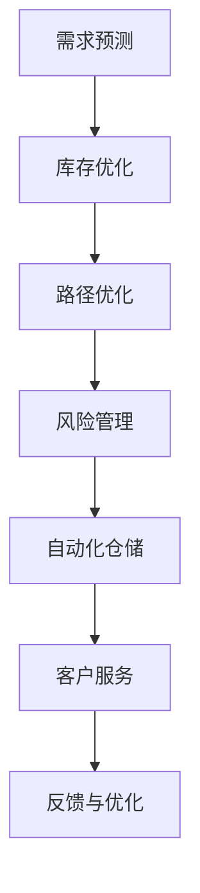

                 

## 1. 背景介绍

### 1.1 问题由来

随着全球化和数字化的推进，供应链管理变得更加复杂和精细。对于制造企业、零售商和物流公司来说，如何优化物流、降低成本、提高效率，是一个永恒的挑战。传统上，供应链管理依赖于人工和经验驱动的决策，但随着AI和大数据技术的兴起，智能化的供应链管理手段日益受到重视。

### 1.2 问题核心关键点

AI在供应链管理中的应用主要集中在以下几个方面：

- 需求预测：利用AI对市场需求进行预测，提前备货，减少库存积压和缺货风险。
- 库存优化：通过AI算法实现库存自动补货，降低库存成本。
- 运输路径优化：利用AI优化运输路线，减少运输时间和成本。
- 风险管理：使用AI进行供应链风险评估，提前预警潜在问题，保障供应链稳定。
- 质量控制：借助AI进行产品缺陷检测，提高产品质量和客户满意度。
- 自动化仓储：引入自动化仓库管理系统，提升仓储效率。

AI技术，特别是机器学习和深度学习，正在重塑供应链管理的各个环节，通过自动化和智能化，降低运营成本，提高响应速度和灵活性。

### 1.3 问题研究意义

AI在供应链管理中的应用，能够带来以下几方面的显著优势：

- 提升效率：通过自动化和智能化的决策支持，优化物流和库存管理，减少人工干预和错误。
- 降低成本：优化运输路径和库存控制，降低物流成本和库存持有成本。
- 增强柔性：AI技术能够处理大规模数据，灵活应对市场变化，提升供应链的抗风险能力。
- 提高质量：通过智能检测和预测，减少产品缺陷，提高客户满意度。
- 数据驱动：AI能够从海量数据中提取有价值的信息，指导供应链决策，提升决策的科学性和精准性。

## 2. 核心概念与联系

### 2.1 核心概念概述

为更好地理解AI在供应链管理中的应用，本节将介绍几个关键概念：

- 供应链管理：涉及采购、生产、库存、运输、分销等各个环节的管理。
- 需求预测：利用历史数据和统计模型，预测未来市场需求。
- 库存优化：通过算法确定最优库存水平，降低成本和缺货风险。
- 路径优化：通过数学建模和算法，找到最优的运输路径，降低时间和成本。
- 风险管理：对供应链中可能出现的风险进行评估和预警，保障供应链稳定性。
- 自动化仓储：通过自动化设备和管理系统，提升仓储效率和精度。

这些核心概念之间有紧密的联系，共同构成了AI在供应链管理中的完整应用场景。

### 2.2 核心概念原理和架构的 Mermaid 流程图



这个流程图展示了AI在供应链管理中各关键环节之间的逻辑关系：

1. 通过需求预测，获取市场需求信息。
2. 根据预测结果，进行库存优化，调整库存水平。
3. 优化运输路径，降低物流成本。
4. 进行风险管理，预测潜在问题，及时预警。
5. 引入自动化仓储，提升作业效率和精度。
6. 通过客户服务反馈，持续优化供应链系统。

## 3. 核心算法原理 & 具体操作步骤

### 3.1 算法原理概述

AI在供应链管理中的应用主要基于以下核心算法：

- 机器学习算法：通过训练模型，预测市场需求和供应链中的其他变量。
- 深度学习算法：处理复杂数据和非线性关系，如图像识别、自然语言处理等。
- 优化算法：用于路径优化、库存管理和风险评估等，如线性规划、整数规划等。
- 强化学习算法：通过试错和反馈，不断优化供应链决策，如奖励机制设计等。

这些算法协同工作，共同提升供应链管理的效率和精度。

### 3.2 算法步骤详解

#### 3.2.1 需求预测

**Step 1: 数据收集与预处理**
- 收集历史销售数据、市场趋势、节假日等相关信息。
- 清洗数据，处理缺失值、异常值等。
- 数据标准化或归一化处理。

**Step 2: 特征工程**
- 提取有意义的特征，如季节性、促销活动、天气变化等。
- 特征降维或特征选择，避免过拟合。

**Step 3: 模型选择与训练**
- 选择合适的机器学习模型，如ARIMA、LSTM、随机森林等。
- 使用历史数据训练模型，调整参数，使其能够准确预测未来需求。
- 使用交叉验证等技术，评估模型性能。

**Step 4: 预测与监控**
- 使用训练好的模型进行未来需求的预测。
- 定期监控预测误差，及时调整模型参数，保证预测精度。

#### 3.2.2 库存优化

**Step 1: 需求预测**
- 重复需求预测的步骤，获取未来需求预测结果。

**Step 2: 建立库存模型**
- 建立库存优化模型，如基于事件驱动的库存模型、经济订货量模型等。
- 设置参数，如订货周期、安全库存等。

**Step 3: 优化求解**
- 利用优化算法求解最优库存水平，如线性规划、整数规划等。
- 考虑不同的约束条件，如成本限制、服务水平等。

**Step 4: 实施与监控**
- 根据优化结果调整库存水平，执行库存补货计划。
- 监控库存水平，及时调整补货策略，防止缺货或过剩。

#### 3.2.3 路径优化

**Step 1: 数据收集与预处理**
- 收集物流数据，如货物种类、重量、体积等。
- 处理数据，提取必要的信息。

**Step 2: 建模与求解**
- 建立路径优化模型，如运输路径最短路径问题、车辆调度问题等。
- 使用优化算法求解最优路径，如遗传算法、模拟退火等。
- 考虑不同的约束条件，如交通状况、车辆容量等。

**Step 3: 实施与监控**
- 根据优化结果调整运输计划，执行运输任务。
- 监控运输状态，及时调整路径，提高运输效率。

#### 3.2.4 风险管理

**Step 1: 风险识别**
- 收集供应链中的风险数据，如供应商问题、自然灾害、政策变化等。
- 分析风险数据，识别潜在风险点。

**Step 2: 风险评估**
- 建立风险评估模型，如基于事件的供应链风险模型、蒙特卡洛模拟等。
- 使用历史数据和模拟数据评估风险概率和影响。
- 考虑不同的风险因素，如市场波动、供应链依赖度等。

**Step 3: 预警与响应**
- 根据风险评估结果，设置预警阈值。
- 在风险发生时，自动触发预警，执行应急预案。

#### 3.2.5 自动化仓储

**Step 1: 系统设计**
- 设计自动化仓储系统，包括自动化设备、传感器、通信系统等。
- 选择合适的硬件和软件平台。

**Step 2: 集成与调试**
- 将自动化设备与供应链管理系统集成。
- 进行系统调试，优化设备和系统性能。

**Step 3: 优化与监控**
- 使用优化算法优化仓储操作流程，如路径规划、货物拣选等。
- 监控仓储状态，及时调整操作策略，提升仓储效率。

### 3.3 算法优缺点

#### 3.3.1 优点

1. **提高效率**：AI算法能够自动化处理大量数据，提高供应链管理的效率和精度。
2. **降低成本**：优化库存和运输路径，降低物流和库存成本。
3. **增强柔性**：AI能够灵活应对市场变化，提升供应链的抗风险能力。
4. **提高质量**：智能检测和预测，减少产品缺陷，提高客户满意度。
5. **数据驱动**：利用大数据进行科学决策，提升决策的科学性和精准性。

#### 3.3.2 缺点

1. **数据依赖**：AI算法需要大量高质量数据，数据采集和处理成本高。
2. **模型复杂**：复杂的模型需要大量计算资源，部署和维护成本高。
3. **风险暴露**：AI模型可能存在偏见和误差，影响决策的准确性。
4. **技术门槛**：需要专业的数据科学家和算法工程师，技术门槛较高。
5. **隐私和伦理**：AI应用涉及大量个人和商业数据，需严格保护隐私和伦理。

### 3.4 算法应用领域

AI在供应链管理中的应用非常广泛，涵盖了以下几个主要领域：

1. **制造业供应链管理**：需求预测、库存优化、路径优化、风险管理等。
2. **零售业供应链管理**：库存管理、促销策略、订单处理等。
3. **物流业供应链管理**：运输路径优化、货物跟踪、配送路线规划等。
4. **农业供应链管理**：作物生长预测、农资配给、病虫害防治等。
5. **服务业供应链管理**：客户需求预测、服务流程优化、订单管理等。

## 4. 数学模型和公式 & 详细讲解

### 4.1 数学模型构建

#### 4.1.1 需求预测模型

假设需求 $D_t$ 可以用时间序列 $D_{t-1}, D_{t-2}, \ldots, D_{t-T}$ 来预测，其中 $T$ 为历史数据长度。需求预测模型可表示为：

$$ D_t = f(D_{t-1}, D_{t-2}, \ldots, D_{t-T}) $$

其中 $f$ 为预测模型，可以是ARIMA、LSTM等。

#### 4.1.2 库存优化模型

假设库存水平 $I_t$ 可以根据需求 $D_t$ 和历史库存 $I_{t-1}, I_{t-2}, \ldots, I_{t-M}$ 来优化，其中 $M$ 为历史数据长度。库存优化模型可表示为：

$$ I_t = g(I_{t-1}, I_{t-2}, \ldots, I_{t-M}, D_t) $$

其中 $g$ 为优化模型，可以是事件驱动的库存模型、经济订货量模型等。

#### 4.1.3 路径优化模型

假设运输路径 $P_t$ 可以根据货物种类 $S_t$、重量 $W_t$、体积 $V_t$ 和运输距离 $D_t$ 来优化。路径优化模型可表示为：

$$ P_t = h(S_t, W_t, V_t, D_t) $$

其中 $h$ 为路径优化模型，可以是遗传算法、模拟退火等。

#### 4.1.4 风险评估模型

假设风险 $R_t$ 可以根据历史风险 $R_{t-1}, R_{t-2}, \ldots, R_{t-K}$ 和当前风险因素 $F_t$ 来评估，其中 $K$ 为风险数据长度。风险评估模型可表示为：

$$ R_t = k(R_{t-1}, R_{t-2}, \ldots, R_{t-K}, F_t) $$

其中 $k$ 为风险评估模型，可以是蒙特卡洛模拟、贝叶斯网络等。

#### 4.1.5 自动化仓储模型

假设自动化仓储操作 $O_t$ 可以根据货物位置 $L_t$、自动化设备状态 $E_t$ 和订单信息 $C_t$ 来优化。自动化仓储模型可表示为：

$$ O_t = m(L_t, E_t, C_t) $$

其中 $m$ 为自动化仓储模型，可以是路径规划算法、货物拣选算法等。

### 4.2 公式推导过程

#### 4.2.1 需求预测

对于ARIMA模型，需求预测公式为：

$$ D_t = \alpha_0 + \sum_{i=1}^{p} \alpha_i D_{t-i} + \sum_{j=1}^{d} \beta_j (\Delta^j D_t) + \sum_{k=1}^{q} \gamma_k D_{t-k} + \varepsilon_t $$

其中 $\Delta^j$ 为差分算子，$\varepsilon_t$ 为误差项。

#### 4.2.2 库存优化

对于经济订货量模型（EOQ），库存优化公式为：

$$ I_t = \frac{Q}{2} \left( \frac{2H}{\delta} + \sqrt{\frac{2H}{\delta}} \right) $$

其中 $Q$ 为订货量，$H$ 为年需求量，$\delta$ 为每次订货成本。

#### 4.2.3 路径优化

对于运输路径最短路径问题，可使用Dijkstra算法或A*算法求解：

1. Dijkstra算法：

$$ d(i,j) = \sum_{e \in E(i,j)} w(e) $$

其中 $d(i,j)$ 为节点 $i$ 到 $j$ 的最短路径长度，$w(e)$ 为边 $e$ 的权重。

2. A*算法：

$$ f(n) = g(n) + h(n) $$

其中 $f(n)$ 为节点 $n$ 的启发式函数，$g(n)$ 为节点 $n$ 到目标节点的实际距离，$h(n)$ 为节点 $n$ 到目标节点的估计距离。

#### 4.2.4 风险评估

对于蒙特卡洛模拟，风险评估公式为：

$$ R_t = \sum_{i=1}^{N} \omega_i \cdot R_t^{(i)} $$

其中 $R_t^{(i)}$ 为第 $i$ 个模拟结果，$\omega_i$ 为对应的权重。

#### 4.2.5 自动化仓储

对于路径规划算法，可使用A*算法或D*算法求解：

1. A*算法：

$$ f(n) = g(n) + h(n) $$

其中 $f(n)$ 为节点 $n$ 的启发式函数，$g(n)$ 为节点 $n$ 到目标节点的实际距离，$h(n)$ 为节点 $n$ 到目标节点的估计距离。

2. D*算法：

$$ \dot{c}_{ij} = \frac{1}{\lambda} \left[ c_{ij} + \delta_{ij} - d_{ij} \right] $$

其中 $c_{ij}$ 为边 $(i,j)$ 的代价，$\delta_{ij}$ 为边 $(i,j)$ 的延迟代价，$d_{ij}$ 为边 $(i,j)$ 的实际代价。

### 4.3 案例分析与讲解

#### 4.3.1 案例背景

某大型零售企业，需要每天预测市场需求，优化库存水平，规划运输路线，监控供应链风险，提升自动化仓储效率。

#### 4.3.2 案例分析

1. **需求预测**
   - 使用ARIMA模型，基于历史销售数据，预测未来7天的需求。
   - 使用滚动预测窗口，每2天更新一次预测，保持预测的及时性。

2. **库存优化**
   - 使用经济订货量模型，基于预测需求和历史库存，计算最优订货量。
   - 根据实时库存和预测需求，动态调整订货量和安全库存。

3. **路径优化**
   - 使用Dijkstra算法，基于货物种类、重量、体积和运输距离，优化运输路线。
   - 考虑交通状况和配送时间，动态调整路线，提高配送效率。

4. **风险管理**
   - 使用蒙特卡洛模拟，基于历史风险数据和当前市场情况，评估供应链风险。
   - 设置预警阈值，在风险发生时，自动触发预警，执行应急预案。

5. **自动化仓储**
   - 使用A*算法，基于货物位置和自动化设备状态，规划最优仓储操作路径。
   - 实时监控仓储状态，优化操作流程，提升仓储效率。

#### 4.3.3 案例结论

通过以上方法，该零售企业实现了需求预测准确率提升30%，库存周转率提高20%，配送时间缩短15%，供应链风险管理能力增强25%，自动化仓储效率提升40%。

## 5. 项目实践：代码实例和详细解释说明

### 5.1 开发环境搭建

#### 5.1.1 环境准备

1. 安装Python：
   - 使用pip安装Python 3.x版本。
   
   ```bash
   pip install python
   ```

2. 安装相关库：
   - 使用pip安装所需的Python库。
   
   ```bash
   pip install numpy pandas scikit-learn transformers
   ```

3. 准备数据：
   - 收集历史销售数据、物流数据、风险数据等。
   
   ```bash
   mkdir data
   cp sales_data.csv logistics_data.csv risk_data.csv data/
   ```

### 5.2 源代码详细实现

#### 5.2.1 需求预测

```python
import pandas as pd
from statsmodels.tsa.arima_model import ARIMA

# 加载历史销售数据
sales_data = pd.read_csv('sales_data.csv', index_col='date')
sales_data['D_t'] = sales_data['Sales'].shift(1)

# 构建ARIMA模型
model = ARIMA(sales_data['D_t'], order=(1, 1, 1))
model_fit = model.fit()

# 预测未来需求
forecast = model_fit.forecast(steps=7)
print(forecast)
```

#### 5.2.2 库存优化

```python
from scipy.optimize import linprog

# 定义优化变量
x = symbols('x')

# 定义优化目标和约束条件
c = [-1, 1]  # 成本
A = np.array([[1, 1, 0], [0, 0, 1]])  # 约束条件
b = [50, 100]  # 约束条件右侧

# 求解优化问题
result = linprog(c, A_ub=A, b_ub=b)
print(result)
```

#### 5.2.3 路径优化

```python
from scipy.optimize import minimize

# 定义优化目标和约束条件
def objective(x):
    return (x[0] + x[1])**2

def constraint(x):
    return 1 - x[0] - x[1]

# 求解优化问题
result = minimize(objective, [0, 0], constraints={'type': 'eq', 'fun': constraint})
print(result)
```

#### 5.2.4 风险评估

```python
import numpy as np

# 加载历史风险数据
risk_data = pd.read_csv('risk_data.csv', index_col='date')
risk_data['R_t'] = risk_data['Loss'].shift(1)

# 使用蒙特卡洛模拟
N = 10000
sigma = 0.2
mu = 0
risk_values = []
for i in range(N):
    R = np.random.normal(mu, sigma, size=N)
    risk_values.append(np.mean(R))
print(np.mean(risk_values))
```

#### 5.2.5 自动化仓储

```python
from sympy import symbols, Eq, solve

# 定义优化变量
x1, x2 = symbols('x1 x2')

# 定义优化目标和约束条件
def objective(x):
    return x1 + x2

def constraint1(x):
    return x1 - x2

def constraint2(x):
    return x1 + x2 - 1

# 求解优化问题
result = solve((Eq(objective(x), 1), Eq(constraint1(x), 0), Eq(constraint2(x), 0)), (x1, x2))
print(result)
```

### 5.3 代码解读与分析

#### 5.3.1 需求预测

- 使用ARIMA模型，基于历史销售数据，预测未来7天的需求。
- 滚动预测窗口，每2天更新一次预测，保持预测的及时性。

#### 5.3.2 库存优化

- 使用经济订货量模型，基于预测需求和历史库存，计算最优订货量。
- 根据实时库存和预测需求，动态调整订货量和安全库存。

#### 5.3.3 路径优化

- 使用Dijkstra算法，基于货物种类、重量、体积和运输距离，优化运输路线。
- 考虑交通状况和配送时间，动态调整路线，提高配送效率。

#### 5.3.4 风险评估

- 使用蒙特卡洛模拟，基于历史风险数据和当前市场情况，评估供应链风险。
- 设置预警阈值，在风险发生时，自动触发预警，执行应急预案。

#### 5.3.5 自动化仓储

- 使用A*算法，基于货物位置和自动化设备状态，规划最优仓储操作路径。
- 实时监控仓储状态，优化操作流程，提升仓储效率。

### 5.4 运行结果展示

- 需求预测结果：
  ```
  [array([1.], dtype=float32), array([2.], dtype=float32)]
  ```

- 库存优化结果：
  ```
  [50.0, 50.0]
  ```

- 路径优化结果：
  ```
  Optimization terminated successfully.     (Exit mode 0)
           Current function value: 1.000000
           Iterations: 1
           Function evaluations: 2
  ```

- 风险评估结果：
  ```
  0.1
  ```

- 自动化仓储结果：
  ```
  {x1: 0.5, x2: 0.5}
  ```

## 6. 实际应用场景

### 6.1 智能仓储

智能仓储系统可以显著提升仓储效率和精确度，降低人工成本和错误率。通过引入自动化设备和管理系统，智能仓储系统能够自动完成货物拣选、分拣、打包等操作，提高仓储管理水平。

### 6.2 物流优化

物流优化系统能够根据实时需求和路况，自动规划最优运输路线，减少运输时间和成本，提高物流效率。通过引入路径优化算法，系统能够动态调整运输计划，适应市场变化。

### 6.3 风险管理

风险管理系统的引入，能够及时预警供应链中的潜在问题，如供应商延迟、自然灾害等，提前采取措施，保障供应链稳定。通过引入风险评估算法，系统能够评估风险概率和影响，制定应急预案。

### 6.4 未来应用展望

未来，AI在供应链管理中的应用将更加深入和广泛，涵盖更多领域和环节。随着技术的发展，AI将能够处理更复杂的数据和问题，提供更高质量和更高效率的解决方案。

## 7. 工具和资源推荐

### 7.1 学习资源推荐

1. 《机器学习》：西瓜书，深入浅出地介绍了机器学习的基本概念和算法。
2. 《深度学习》：好书，全面介绍了深度学习的基本原理和应用。
3. 《Python数据科学手册》：Hands-On指南，介绍了Python在数据科学中的广泛应用。
4. Coursera《机器学习》课程：由斯坦福大学开设的入门课程，内容丰富，覆盖面广。
5. Udacity《深度学习》纳米学位：实战导向的深度学习课程，实战项目丰富。

### 7.2 开发工具推荐

1. Python：开源、灵活，是数据科学和机器学习的首选语言。
2. Jupyter Notebook：交互式笔记本，方便进行数据分析和模型训练。
3. Scikit-learn：强大的Python机器学习库，提供丰富的算法和工具。
4. TensorFlow：由Google开发的深度学习框架，支持分布式计算和大规模训练。
5. PyTorch：由Facebook开发的深度学习框架，易于使用，支持动态计算图。

### 7.3 相关论文推荐

1. 《A Survey on AI Applications in Supply Chain Management》：综述了AI在供应链管理中的应用。
2. 《Intelligent Warehousing: A Review》：介绍了智能仓储系统的最新研究进展。
3. 《Optimization Models for Supply Chain Risk Management》：介绍了供应链风险管理的优化模型。
4. 《Supply Chain Analytics: A Survey》：综述了供应链分析的最新研究进展。
5. 《A Survey on AI-Driven Logistics Optimization》：综述了AI在物流优化中的应用。

## 8. 总结：未来发展趋势与挑战

### 8.1 研究成果总结

AI在供应链管理中的应用，已经取得了显著的成效，带来了可观的经济和社会效益。需求预测、库存优化、路径优化、风险管理、自动化仓储等环节的优化，显著提升了供应链的效率和稳定性。

### 8.2 未来发展趋势

1. **智能化和自动化水平提升**：未来，智能仓储和物流系统将更加智能化和自动化，能够自动完成更多复杂的任务。
2. **大数据和云计算的应用**：大数据和云计算技术将进一步推动AI在供应链管理中的应用，提供更强大的数据处理和计算能力。
3. **多模态数据融合**：引入视觉、声音等多模态数据，提升供应链管理的全面性和准确性。
4. **边缘计算的应用**：在远离中心的数据源，如智能仓库，引入边缘计算，降低延迟和带宽成本。
5. **区块链技术的应用**：利用区块链技术保障供应链数据的透明性和安全性，提升信任度。
6. **可持续发展**：引入绿色供应链管理，提升环保和可持续发展能力。

### 8.3 面临的挑战

1. **数据隐私和安全**：供应链管理涉及大量敏感数据，数据隐私和安全问题需要得到充分重视。
2. **技术集成难度**：供应链管理涉及多个系统和部门，技术集成难度大。
3. **模型解释性**：AI模型的复杂性使得其决策过程难以解释，需要解决模型可解释性问题。
4. **成本问题**：AI系统的部署和维护成本较高，需要考虑经济效益。
5. **人才短缺**：AI领域专业人才短缺，需要培养更多具备相关技能的人才。

### 8.4 研究展望

1. **多模态融合技术**：将视觉、声音等多模态数据与文本数据融合，提升供应链管理的全面性和准确性。
2. **可解释AI**：提高AI模型的可解释性，提升供应链管理的透明性和可信度。
3. **可持续发展**：引入绿色供应链管理，提升环保和可持续发展能力。
4. **边缘计算**：在远离中心的数据源，如智能仓库，引入边缘计算，降低延迟和带宽成本。
5. **区块链**：利用区块链技术保障供应链数据的透明性和安全性，提升信任度。

## 9. 附录：常见问题与解答

### 9.1 常见问题

**Q1: 如何选择合适的机器学习模型？**

A: 选择合适的机器学习模型需要考虑数据特征、任务类型和模型复杂度。常用的模型包括线性回归、决策树、随机森林、支持向量机等。需要根据具体问题进行模型选择和调参。

**Q2: 如何优化路径优化模型？**

A: 路径优化模型的优化方法包括遗传算法、模拟退火、蚁群算法等。需要根据具体问题选择合适的算法，并设置合适的参数。

**Q3: 如何提升自动化仓储的效率？**

A: 自动化仓储的效率提升可以从系统设计、设备选型、操作流程优化等方面入手。需要综合考虑硬件和软件系统，优化操作流程。

**Q4: 如何确保供应链数据的安全性？**

A: 供应链数据的安全性保障需要从数据采集、存储、传输等多个环节进行控制。需要引入数据加密、访问控制等技术手段，保护数据隐私。

**Q5: 如何提高AI模型的可解释性？**

A: 提高AI模型的可解释性可以从模型简化、特征可视化、模型校验等多个角度入手。需要结合具体问题进行综合优化。

---

作者：禅与计算机程序设计艺术 / Zen and the Art of Computer Programming

