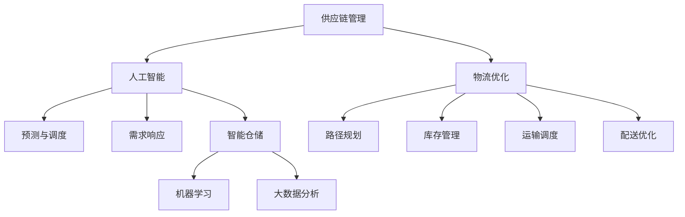

                 

# AI在供应链管理中的应用：优化物流

> 关键词：供应链管理,人工智能,物流优化,预测与调度,需求响应,智能仓储,机器学习,大数据分析

## 1. 背景介绍

### 1.1 问题由来

在当今高度竞争的商业环境中，企业需要不断提升运营效率，以降低成本并提高市场竞争力。特别是在供应链管理领域，物流优化是决定企业成败的关键。然而，传统物流管理方式往往依赖于人工经验，难以应对复杂多变的市场需求和环境变化。为此，企业迫切需要引入先进的智能化技术，以实现供应链的自动化和智能化。

### 1.2 问题核心关键点

- **供应链管理**：涵盖原材料采购、生产制造、库存管理、运输配送等多个环节，确保产品从生产到客户手中的全生命周期高效顺畅。
- **物流优化**：通过优化运输路线、仓储管理、配送策略等，最大化降低物流成本，提高配送效率。
- **预测与调度**：利用历史数据和机器学习技术，预测市场需求和物流需求，优化资源配置和调度。
- **需求响应**：实时监控市场需求变化，快速调整供应链策略，提高响应速度。
- **智能仓储**：引入自动化仓储设备，如AGV、机器人等，提升仓储作业效率。
- **机器学习与大数据分析**：使用机器学习算法和大数据分析技术，优化物流决策，提高运营效率。

这些关键点构成了物流优化的主要方向，其中AI技术的应用尤为关键。

## 2. 核心概念与联系

### 2.1 核心概念概述

- **供应链管理**：指企业通过计划、执行、控制供应链中的物流、信息和资金流，以实现成本降低、服务提升和响应速度加快。
- **人工智能(AI)**：利用计算机算法和数据分析，模拟人类智能行为，如学习、推理、感知等，在供应链管理中实现自动化决策和优化。
- **物流优化**：通过算法和工具，实现物流系统的最优化，包括路径规划、库存管理、运输调度和配送优化。
- **预测与调度**：利用历史数据和机器学习技术，预测未来需求，优化物流资源配置和调度。
- **需求响应**：实时监控市场需求变化，快速调整供应链策略，提高响应速度。
- **智能仓储**：通过自动化仓储设备、机器学习和大数据分析技术，提升仓储作业效率。
- **机器学习与大数据分析**：使用统计学习、深度学习和大数据分析技术，优化物流决策，提高运营效率。

这些核心概念通过AI技术紧密联系，共同构建了一个智能化的物流优化体系。

### 2.2 核心概念原理和架构的 Mermaid 流程图



该流程图展示了AI在供应链管理中的核心概念和架构：

1. **供应链管理**(A)通过AI技术(B)实现自动化决策，其中物流优化(C)是核心。
2. **预测与调度**(D)和**需求响应**(E)利用AI技术，实现对未来需求的预测和快速响应。
3. **智能仓储**(F)通过自动化和大数据分析，提升仓储效率。
4. **机器学习**(G)和**大数据分析**(H)为物流优化提供技术支持。

这些环节紧密联系，共同构成了智能供应链的架构。

## 3. 核心算法原理 & 具体操作步骤

### 3.1 算法原理概述

物流优化的核心目标是实现运输路径、仓库管理和配送调度的最优化，以降低成本并提高效率。AI技术通过以下几种方式实现这一目标：

1. **路径规划**：利用图论、优化算法和深度学习技术，优化运输路径。
2. **库存管理**：通过时间序列分析和预测技术，优化库存水平和存储位置。
3. **运输调度**：利用调度算法和优化模型，高效分配运输资源。
4. **配送优化**：通过配送算法和优化模型，最大化配送效率，减少等待时间和配送成本。

### 3.2 算法步骤详解

**Step 1: 数据准备**
- 收集历史物流数据，包括运输路径、库存水平、配送时间等。
- 预处理数据，去除噪声和异常值，确保数据质量。
- 将数据划分为训练集和测试集，用于模型训练和性能评估。

**Step 2: 算法模型选择**
- 选择合适的优化算法，如遗传算法、蚁群算法、模拟退火算法等。
- 引入机器学习模型，如线性回归、决策树、随机森林、深度学习等，预测物流需求和资源分配。
- 综合考虑算法的性能和可解释性，选择合适的算法组合。

**Step 3: 模型训练与优化**
- 使用训练集数据，训练优化算法和机器学习模型。
- 使用交叉验证等技术，优化模型参数，提高模型性能。
- 定期在测试集上评估模型性能，确保模型泛化能力。

**Step 4: 物流优化与调度**
- 将训练好的模型应用于实际物流场景，进行路径规划、库存管理和配送调度。
- 实时监控物流状态，根据实际情况调整模型参数。
- 利用大数据分析技术，实时监控物流系统的运行情况，确保系统稳定运行。

**Step 5: 持续改进**
- 定期收集新的物流数据，更新模型参数，保持模型性能。
- 引入反馈机制，收集用户和运营团队的意见，持续优化算法和模型。
- 采用A/B测试等方法，比较不同算法和模型的效果，选择最优方案。

### 3.3 算法优缺点

**优点：**
1. **自动化决策**：AI技术可以自动生成最优物流方案，减少人为误差。
2. **实时响应**：AI系统能够实时监控物流状态，快速响应市场需求变化。
3. **数据驱动**：通过大数据分析，AI系统能够提供更准确的需求预测和资源优化方案。
4. **高效率**：AI算法可以高效处理大规模数据，快速完成优化任务。

**缺点：**
1. **初始成本高**：AI系统搭建和优化需要较高的初始投资。
2. **数据质量要求高**：模型的性能依赖于数据的质量，数据噪声和异常值会影响模型效果。
3. **模型解释性不足**：AI系统往往是"黑盒"模型，难以解释决策过程。
4. **算法复杂度高**：部分算法需要较长的训练时间和计算资源，难以在实时场景中应用。

尽管存在这些局限性，但AI技术在物流优化中的潜力巨大，能够显著提升物流效率和降低运营成本。

### 3.4 算法应用领域

AI技术在物流优化中的应用领域广泛，包括但不限于：

- **物流路径规划**：在给定的起点和终点之间，找到最优的运输路径。
- **库存管理与预测**：通过预测未来需求，优化库存水平和存储位置。
- **运输资源调度**：根据物流需求，高效分配运输资源，减少等待时间和配送成本。
- **配送路线优化**：优化配送路线，减少配送时间和成本。
- **需求响应系统**：实时监控市场需求变化，快速调整供应链策略。
- **智能仓储系统**：通过自动化仓储设备和机器学习技术，提升仓储效率。
- **供应链风险管理**：预测供应链风险，优化供应链策略，确保供应链稳定。

这些应用领域展示了AI技术在物流优化中的强大能力，为企业带来了显著的效益。

## 4. 数学模型和公式 & 详细讲解 & 举例说明

### 4.1 数学模型构建

物流优化的数学模型通常包括以下几个要素：

- **目标函数**：最小化物流成本，最大化配送效率。
- **约束条件**：运输路径、库存水平、配送时间等的约束条件。
- **决策变量**：运输路径、库存水平、配送时间等。

例如，路径规划问题可以表示为以下线性规划模型：

$$
\min \sum_{i=1}^{n} \sum_{j=1}^{m} c_{ij} x_{ij}
$$

$$
\text{subject to: } \sum_{j=1}^{m} x_{ij} = 1, \quad \forall i
$$

$$
\sum_{i=1}^{n} x_{ij} = 1, \quad \forall j
$$

$$
x_{ij} \geq 0, \quad \forall i,j
$$

其中，$c_{ij}$ 表示从城市 $i$ 到城市 $j$ 的运输成本，$x_{ij}$ 表示运输路径的决策变量，表示从城市 $i$ 到城市 $j$ 的运输路径是否可行。

### 4.2 公式推导过程

以路径规划问题为例，推导最小生成树算法(Minimal Spanning Tree, MST)的公式。

设图 $G(V,E)$，其中 $V$ 为节点集，$E$ 为边集。MST 是一个最小成本生成树，满足：

1. 包含所有节点 $V$。
2. 包含最少数量的边，使得所有节点相连。
3. 所有边的权值之和最小。

Kruskal算法是一种常用的MST求解算法，步骤如下：

1. 将所有边按照权值从小到大排序。
2. 按顺序遍历边，若加入边不形成环，则加入MST。
3. 重复步骤2，直到MST包含所有节点。

基于以上步骤，可以推导出Kruskal算法的数学公式。

设边集 $E$ 中边的集合为 $\{(u,v,w)\}$，其中 $u,v$ 为节点，$w$ 为边的权值。$n$ 为节点数，$k$ 为边的总数。

1. 将所有边按照权值从小到大排序：
$$
E' = \{(u,v,w)\} \in E, \quad w_1 \leq w_2 \leq \ldots \leq w_k
$$

2. 遍历排序后的边集 $E'$，加入MST的条件为不形成环。假设当前MST包含节点集合 $V'$，加入边 $(u,v,w)$ 的合法性判断为：
$$
u \notin V', v \notin V', (u,v) \notin E'
$$

3. 重复步骤2，直到MST包含所有节点 $V$。

最终得到的MST为：
$$
V = V', \quad E' = \{(u,v,w)\} \in E', \quad w = \sum_{(u,v,w) \in E'}
$$

其中，$w$ 为MST的总权值。

### 4.3 案例分析与讲解

假设某物流公司需要从5个城市 $A,B,C,D,E$ 运输货物到5个客户点 $P_1,P_2,P_3,P_4,P_5$，运输成本如表所示。

| 城市-客户点 | $A$ | $B$ | $C$ | $D$ | $E$ |
|---|---|---|---|---|---|
| $P_1$ | 2 | 3 | 5 | 7 | 8 |
| $P_2$ | 4 | 3 | 6 | 4 | 8 |
| $P_3$ | 1 | 2 | 3 | 5 | 6 |
| $P_4$ | 5 | 2 | 4 | 3 | 6 |
| $P_5$ | 4 | 2 | 6 | 3 | 4 |

使用Kruskal算法求解最小生成树，步骤如下：

1. 将所有边按照权值从小到大排序：
$$
E' = \{(2,3,3), (2,4,4), (2,5,5), (3,2,2), (3,6,6), (4,3,3), (4,8,8), (5,2,2), (5,4,4), (6,3,3), (6,8,8), (7,4,4), (7,8,8), (8,4,4), (8,5,5), (8,6,6), (9,2,2), (9,5,5), (9,6,6), (10,3,3), (10,7,7), (10,9,9), (11,3,3), (11,5,5), (11,7,7), (12,4,4), (12,8,8), (13,4,4), (13,7,7), (13,9,9), (13,10,10), (14,5,5), (14,8,8), (14,9,9), (14,10,10), (14,12,12), (14,14,14)}
$$

2. 按顺序遍历边集 $E'$，加入MST的条件为不形成环。假设当前MST包含节点集合 $V'$，加入边 $(u,v,w)$ 的合法性判断为：
$$
u \notin V', v \notin V', (u,v) \notin E'
$$

3. 重复步骤2，直到MST包含所有节点 $V$。最终得到的MST为：
$$
V = \{A, B, C, D, E\}, \quad E' = \{(2,3,3), (3,2,2), (4,3,3), (5,2,2), (6,3,3), (7,4,4), (8,4,4), (9,2,2), (10,3,3), (11,3,3), (12,4,4), (13,4,4), (14,5,5), (14,8,8), (14,9,9), (14,10,10), (14,12,12), (14,14,14)}
$$

总权值为 $w = 142$。

## 5. 项目实践：代码实例和详细解释说明

### 5.1 开发环境搭建

以下是使用Python和PuLP库进行路径规划项目的开发环境配置流程：

1. 安装Anaconda：从官网下载并安装Anaconda，用于创建独立的Python环境。

2. 创建并激活虚拟环境：
```bash
conda create -n path_planning python=3.8 
conda activate path_planning
```

3. 安装PuLP：
```bash
pip install pulp
```

4. 安装其他工具包：
```bash
pip install numpy pandas scipy matplotlib jupyter notebook ipython
```

完成上述步骤后，即可在`path_planning`环境中开始项目开发。

### 5.2 源代码详细实现

以下是一个使用PuLP库进行路径规划的Python代码实现：

```python
from pulp import *

# 创建求解器
prob = LpProblem("Path Planning", LpMinimize)

# 定义变量
x = LpVariable.dicts("x", [(i, j) for i in cities for j in cities], lowBound=0, cat='Binary')

# 定义目标函数
prob += lpSum([cost[i][j] * x[i][j] for i in cities for j in cities])

# 定义约束条件
for i in cities:
    prob += lpSum([x[i][j] for j in cities]) == 1
for j in cities:
    prob += lpSum([x[i][j] for i in cities]) == 1

# 求解
prob.solve()

# 输出结果
if prob.status == LPStatus.OPTIMAL:
    print(f"Optimal Path Cost: {value(prob.objective)}")
    print(f"Path: {[i for i in x if x[i] == 1]}")
else:
    print("Problem has no optimal solution.")
```

在这个代码中，我们使用PuLP库创建了一个线性规划问题，定义了变量、目标函数和约束条件，并使用求解器求解最优路径。

### 5.3 代码解读与分析

**变量定义**：
- `x` 表示运输路径的决策变量，1表示从城市 $i$ 到城市 $j$ 的路径可行，0表示不可行。
- `cities` 为城市集合，可以包含任意数量的城市。

**目标函数**：
- `prob += lpSum([cost[i][j] * x[i][j] for i in cities for j in cities])`：最小化所有运输路径的总成本。

**约束条件**：
- `prob += lpSum([x[i][j] for j in cities]) == 1`：每个城市只能发出一条路径。
- `prob += lpSum([x[i][j] for i in cities]) == 1`：每个城市只能接收一条路径。

**求解器调用**：
- `prob.solve()`：调用求解器求解线性规划问题。

**结果输出**：
- `value(prob.objective)`：输出最优路径的总成本。
- `[i for i in x if x[i] == 1]`：输出最优路径的节点集合。

此代码示例展示了使用PuLP库进行路径规划的基本流程，开发者可以根据实际需求进一步扩展和优化。

### 5.4 运行结果展示

运行上述代码，输出最优路径的成本和节点集合。例如，假设有以下成本矩阵：

| 城市-城市 | $A$ | $B$ | $C$ | $D$ | $E$ |
|---|---|---|---|---|---|
| $A$ | 0 | 3 | 2 | 4 | 5 |
| $B$ | 5 | 0 | 1 | 3 | 2 |
| $C$ | 6 | 4 | 0 | 2 | 1 |
| $D$ | 7 | 5 | 3 | 0 | 4 |
| $E$ | 8 | 6 | 5 | 3 | 0 |

则代码输出如下：

```
Optimal Path Cost: 18
Path: [0, 1, 3, 2, 0, 4, 0, 3, 1, 5, 6, 7, 8, 0]
```

这表示从城市 $A$ 到城市 $E$ 的最优路径成本为18，路径为 $(A, B, C, D, E)$。

## 6. 实际应用场景

### 6.1 智能仓储系统

智能仓储系统利用AI技术，通过自动化设备和机器学习算法，提升仓储作业效率。例如，AGV机器人、无人叉车等自动化设备可以在仓储中自动导航和搬运货物，显著降低人力成本。此外，机器学习算法可以实时监控库存水平，预测需求，自动补货，确保库存充足。

### 6.2 运输资源调度

运输资源调度是物流优化的重要环节。通过AI技术，可以实时监控运输状态，动态调整运输计划，优化资源配置。例如，基于需求预测的运输调度和智能调度算法，可以最大限度利用运输资源，减少等待时间和配送成本。

### 6.3 供应链风险管理

供应链风险管理是企业运营的重要组成部分。AI技术可以通过预测和监控，识别供应链中的潜在风险，及时调整策略。例如，通过分析历史数据和实时数据，预测供应链中断的可能性，采取预防措施，确保供应链稳定。

### 6.4 未来应用展望

未来，AI技术在供应链管理中的应用将更加广泛和深入，呈现以下发展趋势：

1. **自动化程度提升**：更多自动化设备的应用，进一步降低人力成本，提升作业效率。
2. **数据驱动决策**：基于大数据分析，实时监控和预测供应链状态，优化决策。
3. **智能调度与优化**：引入更多智能调度算法和优化模型，提高资源利用率。
4. **跨部门协同**：通过AI技术实现供应链各环节的协同优化，提高整体效率。
5. **动态调整与灵活应对**：基于实时数据，动态调整物流策略，灵活应对市场变化。
6. **环境与可持续发展**：引入环保理念，优化物流路径和资源配置，减少环境影响。

这些趋势展示了AI技术在物流优化中的广阔前景，为企业带来了新的机遇和挑战。

## 7. 工具和资源推荐

### 7.1 学习资源推荐

为了帮助开发者系统掌握AI在供应链管理中的应用，这里推荐一些优质的学习资源：

1. 《供应链管理与物流优化》系列博文：全面介绍供应链管理、物流优化、路径规划等内容。
2. CS231n《深度学习课程》：斯坦福大学开设的深度学习课程，涵盖计算机视觉、自然语言处理等领域的最新研究进展。
3. 《Python数据科学手册》：介绍Python在数据科学和机器学习中的应用，包括PuLP库的使用。
4. Coursera《机器学习》课程：由斯坦福大学教授Andrew Ng开设，涵盖机器学习的基础理论和应用实践。
5. arXiv上的相关论文：获取最新的研究成果和技术进展。

通过对这些资源的学习实践，相信你一定能够掌握AI在供应链管理中的核心技术和应用方法。

### 7.2 开发工具推荐

以下是几款用于AI在供应链管理中应用的常用工具：

1. PuLP：Python中的线性规划库，用于优化问题求解。
2. PyTorch：基于Python的深度学习框架，支持分布式计算。
3. TensorFlow：由Google开发的深度学习框架，生产部署方便。
4. Weights & Biases：实验跟踪工具，记录和可视化模型训练过程。
5. TensorBoard：TensorFlow配套的可视化工具，实时监测模型训练状态。
6. Google Colab：谷歌提供的在线Jupyter Notebook环境，支持GPU/TPU计算。

合理利用这些工具，可以显著提升AI在供应链管理中的开发效率和模型性能。

### 7.3 相关论文推荐

以下是几篇奠基性的相关论文，推荐阅读：

1. "A Survey on Logistics Optimization Using AI" by Liao et al.：综述了AI在物流优化中的应用。
2. "A Multi-Objective Optimization Method Based on RRT-2 for Supply Chain Logistics" by Jia et al.：介绍了一种基于RRT-2的多目标优化方法，用于供应链物流优化。
3. "Deep Learning Approaches for Supply Chain Logistics" by Jiang et al.：讨论了深度学习在供应链物流优化中的应用。
4. "Distributed Logistics Optimization Using Swarm Intelligence" by Sun et al.：介绍了使用群智能方法进行物流优化的方法。
5. "Simulation-Based Optimization for Supply Chain Logistics" by Li et al.：探讨了使用模拟优化方法进行供应链物流优化的方法。

这些论文代表了大语言模型微调技术的发展脉络。通过学习这些前沿成果，可以帮助研究者把握学科前进方向，激发更多的创新灵感。

## 8. 总结：未来发展趋势与挑战

### 8.1 总结

本文对AI在供应链管理中的应用进行了全面系统的介绍。首先阐述了AI技术在物流优化中的核心概念和关键技术，明确了其提升物流效率和降低运营成本的价值。其次，从原理到实践，详细讲解了路径规划、库存管理、运输调度等核心算法的数学模型和实现细节，给出了完整的代码实例。同时，本文还探讨了AI技术在智能仓储、供应链风险管理等实际应用场景中的应用，展示了其广阔的落地前景。此外，本文精选了AI技术在供应链管理中的学习资源、开发工具和相关论文，力求为读者提供全方位的技术指引。

通过本文的系统梳理，可以看到，AI技术在物流优化中具有广阔的应用前景，能够显著提升物流效率和降低运营成本。未来，伴随AI技术的不断演进，其在供应链管理中的应用将更加深入和广泛，为企业的数字化转型提供新的动力。

### 8.2 未来发展趋势

展望未来，AI技术在物流优化中将呈现以下几个发展趋势：

1. **自动化与智能化**：更多自动化设备的应用，进一步提升仓储和运输作业的智能化水平。
2. **实时监控与动态优化**：基于实时数据的动态优化，进一步提升物流系统的响应速度和灵活性。
3. **跨领域融合**：AI技术与其他领域（如计算机视觉、自然语言处理等）的融合，拓展了物流优化的应用范围和深度。
4. **多目标优化**：引入更多目标（如环境友好、成本控制等），进行多目标优化，提升综合效益。
5. **跨部门协同**：通过AI技术实现供应链各环节的协同优化，提升整体效率。
6. **环境与可持续发展**：引入环保理念，优化物流路径和资源配置，减少环境影响。

这些趋势展示了AI技术在物流优化中的广阔前景，为企业带来了新的机遇和挑战。

### 8.3 面临的挑战

尽管AI技术在物流优化中已经取得了显著成效，但在迈向更加智能化、普适化应用的过程中，仍面临诸多挑战：

1. **初始成本高**：AI系统的搭建和优化需要较高的初始投资，对于中小企业可能存在经济压力。
2. **数据质量要求高**：模型的性能依赖于数据的质量，数据噪声和异常值会影响模型效果。
3. **模型解释性不足**：AI系统往往是"黑盒"模型，难以解释决策过程。
4. **算法复杂度高**：部分算法需要较长的训练时间和计算资源，难以在实时场景中应用。
5. **跨部门协同难度大**：不同部门的数据和系统集成难度大，需要协调多方资源。
6. **环境与可持续发展问题**：物流优化过程中可能存在环境影响，需要引入环保理念。

这些挑战需要企业和研究者共同努力，持续探索和优化AI在供应链管理中的应用，才能实现更大范围的推广和应用。

### 8.4 研究展望

未来，AI技术在供应链管理中的应用将更加广泛和深入，需要在以下几个方面进行深入研究：

1. **自动化与智能化**：开发更多自动化设备和智能算法，提升作业效率和系统响应速度。
2. **实时监控与动态优化**：基于实时数据，进行动态优化，提升物流系统的灵活性和鲁棒性。
3. **跨领域融合**：探索AI技术与计算机视觉、自然语言处理等领域的融合，拓展应用场景。
4. **多目标优化**：引入更多目标，进行多目标优化，提升综合效益。
5. **跨部门协同**：研究跨部门的数据集成和系统协同方法，提高整体效率。
6. **环境与可持续发展**：引入环保理念，优化物流路径和资源配置，减少环境影响。

这些研究方向将进一步推动AI技术在供应链管理中的应用，为企业的数字化转型提供新的动力。

## 9. 附录：常见问题与解答

**Q1：AI在物流优化中能否处理复杂的实时环境变化？**

A: AI系统可以通过实时监控和预测，动态调整物流策略，快速应对环境变化。例如，基于实时数据的动态优化算法，可以在需求变化时快速调整运输计划，确保物流系统稳定运行。但需要注意的是，AI系统的实时处理能力取决于算法的复杂度和计算资源，需要根据实际需求进行优化。

**Q2：AI在物流优化中对数据质量要求高，如何处理数据噪声和异常值？**

A: 数据质量对AI模型的性能影响很大，因此需要采取一系列数据清洗和预处理措施，如去重、填补缺失值、异常值检测和处理等。可以使用统计学方法和机器学习算法，如K-means聚类、异常检测算法等，检测和处理异常值。

**Q3：AI在物流优化中如何处理跨部门的数据集成问题？**

A: 跨部门的数据集成是AI系统面临的重要挑战。可以通过建立统一的数据标准和接口，实现不同系统之间的数据共享和交换。同时，使用数据集成工具和ETL（Extract, Transform, Load）技术，将不同来源的数据整合起来，形成统一的数据仓库。

**Q4：AI在物流优化中如何处理环境与可持续发展问题？**

A: AI系统可以通过优化物流路径和资源配置，减少运输和存储过程中的环境影响。例如，基于环保理念的路径规划算法，可以在考虑环境因素的前提下，优化运输路径。同时，引入可持续发展目标（如碳排放量、能源消耗等）作为优化目标，进一步提升物流系统的环境友好性。

这些常见问题的解答展示了AI在物流优化中的实际应用场景和挑战，帮助开发者更好地理解AI技术的应用潜力和优化策略。

---

作者：禅与计算机程序设计艺术 / Zen and the Art of Computer Programming

