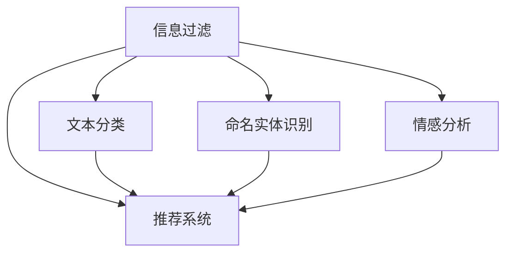

                 

## 1. 背景介绍

随着互联网的迅速发展，信息量的爆炸式增长，信息过滤和整合已经成为了现代社会的重要课题。在新闻、社交媒体、广告、搜索引擎等众多场景中，如何高效准确地对海量信息进行过滤和整合，为用户提供最相关、最有价值的信息，是一个亟待解决的挑战。人工智能(AI)技术，特别是机器学习和自然语言处理(NLP)技术，已经在信息过滤和整合中扮演了关键角色，极大地提升了系统的自动化和智能化水平。本文将从背景、核心概念、算法原理和具体应用等方面，系统梳理AI在信息过滤和整合中的作用，帮助读者深入理解这一领域的现状和未来发展趋势。

## 2. 核心概念与联系

### 2.1 核心概念概述

为了更好地理解AI在信息过滤和整合中的作用，我们需要对相关核心概念进行简要介绍。

- **信息过滤**：通过算法和规则，从海量数据中筛选出符合特定条件的信息，为用户提供个性化、有价值的内容。
- **信息整合**：将来自不同来源、不同形式的信息，进行去重、排序、关联和综合，生成结构化、易于理解的信息集合。
- **推荐系统**：基于用户历史行为和兴趣，推荐相关物品的系统，广泛应用于电商、媒体、社交等领域。
- **文本分类**：将文本划分为不同类别的任务，如新闻分类、垃圾邮件过滤等。
- **命名实体识别**：识别文本中具有特定意义的信息，如人名、地名、组织名等。
- **情感分析**：分析文本的情感倾向，如正面、负面、中性等，用于舆情分析、用户情绪监测等。

这些概念彼此关联，共同构成了AI在信息过滤和整合中的主要任务。理解这些概念之间的联系，有助于我们全面把握AI技术在这一领域的潜力和应用方向。

### 2.2 核心概念原理和架构的 Mermaid 流程图



此流程图展示了信息过滤、推荐系统、文本分类、命名实体识别和情感分析这五个核心概念之间的联系。信息过滤的任务可以细分为推荐系统、文本分类、命名实体识别和情感分析等子任务，这些子任务可以协同工作，共同完成更复杂的信息过滤和整合任务。

## 3. 核心算法原理 & 具体操作步骤

### 3.1 算法原理概述

AI在信息过滤和整合中的作用，主要通过机器学习、深度学习等算法实现。其核心思想是通过对大量标注数据的学习，构建能够自动从海量数据中提取有用信息并关联整合的模型。

以推荐系统为例，基本的推荐算法可以表示为：

$$
\text{推荐} = \text{用户特征} \times \text{物品特征} \times \text{协同过滤}
$$

其中，用户特征和物品特征可以表示为用户和物品的标签、评分、时间戳等，协同过滤则表示用户和物品之间的相似性，通过这些特征和相似性，推荐系统可以预测用户可能感兴趣的物品。

对于文本分类任务，常用的算法包括朴素贝叶斯、支持向量机、深度学习模型（如卷积神经网络、循环神经网络、Transformer等）。

### 3.2 算法步骤详解

以下是基于推荐系统和文本分类任务的具体算法步骤：

#### 3.2.1 推荐系统

1. **数据准备**：收集用户行为数据、物品描述和标签等，进行数据预处理。
2. **用户和物品表示**：将用户和物品特征进行向量化，常用的表示方法包括词袋模型、TF-IDF、Word2Vec等。
3. **相似度计算**：计算用户和物品之间的相似度，常用的方法包括余弦相似度、皮尔逊相关系数、协同过滤等。
4. **模型训练**：基于相似度矩阵，使用协同过滤、矩阵分解等算法，训练推荐模型。
5. **推荐输出**：根据用户特征和物品特征，计算推荐值，选择Top N物品进行推荐。

#### 3.2.2 文本分类

1. **数据准备**：收集文本数据，进行文本预处理，包括分词、去除停用词、词干提取等。
2. **特征提取**：将文本转换为数值特征向量，常用的方法包括词袋模型、TF-IDF、词嵌入等。
3. **模型训练**：使用机器学习或深度学习算法，如朴素贝叶斯、SVM、RNN、CNN、Transformer等，训练分类模型。
4. **模型评估**：在验证集和测试集上评估模型性能，选择最佳模型。
5. **模型应用**：将训练好的模型应用到新数据上，进行文本分类。

### 3.3 算法优缺点

#### 3.3.1 推荐系统的优缺点

**优点**：
- 能够高效地从海量数据中筛选出相关物品，提升用户体验。
- 可以动态更新推荐结果，适应用户行为变化。
- 可以结合用户反馈，进一步优化推荐效果。

**缺点**：
- 对标注数据依赖较大，难以处理冷启动问题。
- 推荐结果可能存在偏差，需要人工干预和调整。
- 推荐模型复杂度较高，计算成本较高。

#### 3.3.2 文本分类的优缺点

**优点**：
- 分类精度较高，能够准确地将文本归入特定类别。
- 特征提取方法多样，能够适应不同类型和长度的文本。
- 算法模型丰富，可以选择最适合的模型进行分类。

**缺点**：
- 对标注数据依赖较大，数据获取和标注成本较高。
- 分类效果可能受到噪音数据和数据不平衡的影响。
- 模型复杂度较高，训练和推理成本较高。

### 3.4 算法应用领域

AI在信息过滤和整合中的应用领域非常广泛，以下是几个主要应用场景：

- **电子商务**：推荐系统根据用户行为和商品特征，推荐相关商品，提升用户体验和购买率。
- **新闻媒体**：基于用户兴趣，推荐相关新闻，提升用户阅读体验和广告效果。
- **社交网络**：推荐系统根据用户兴趣，推荐相关内容，增加用户粘性。
- **金融领域**：金融舆情监测系统通过文本分类和情感分析，及时发现市场波动和舆情变化。
- **医疗健康**：基于病人病历和医学文献，推荐相关治疗方法，提高医疗服务质量。

## 4. 数学模型和公式 & 详细讲解 & 举例说明

### 4.1 数学模型构建

#### 4.1.1 推荐系统

推荐系统可以表示为：

$$
\text{推荐} = \text{用户特征} \times \text{物品特征} \times \text{协同过滤}
$$

其中，用户特征和物品特征可以表示为用户和物品的标签、评分、时间戳等。协同过滤则表示用户和物品之间的相似性，通过这些特征和相似性，推荐系统可以预测用户可能感兴趣的物品。

#### 4.1.2 文本分类

文本分类可以表示为：

$$
\text{分类结果} = \text{文本特征} \times \text{分类器}
$$

其中，文本特征可以表示为词袋模型、TF-IDF、Word2Vec等。分类器可以表示为朴素贝叶斯、SVM、RNN、CNN、Transformer等。

### 4.2 公式推导过程

#### 4.2.1 推荐系统

推荐系统常用的协同过滤算法包括用户协同过滤和物品协同过滤。用户协同过滤基于用户相似性，计算公式为：

$$
\text{用户相似度} = \frac{\text{用户特征向量}^T \times \text{物品特征向量}}{\text{用户特征向量} \times \text{用户特征向量}}
$$

物品协同过滤基于物品相似性，计算公式为：

$$
\text{物品相似度} = \frac{\text{物品特征向量}^T \times \text{物品特征向量}}{\text{物品特征向量} \times \text{物品特征向量}}
$$

#### 4.2.2 文本分类

常用的文本分类算法包括朴素贝叶斯和支持向量机。朴素贝叶斯分类公式为：

$$
\text{分类结果} = \frac{\text{文本特征向量} \times \text{模型参数}}{\text{文本特征向量} \times \text{模型参数} + \text{正则化参数}}
$$

支持向量机分类公式为：

$$
\text{分类结果} = \text{模型参数} \times \text{文本特征向量} + \text{偏置项}
$$

### 4.3 案例分析与讲解

#### 4.3.1 推荐系统案例

假设有一个电商网站，希望根据用户的历史浏览行为推荐相关商品。我们可以收集用户的历史浏览数据，物品的描述和标签，使用协同过滤算法计算用户和物品之间的相似度。设用户A和物品B的相似度为0.8，用户B和物品C的相似度为0.6，用户C和物品A的相似度为0.5，则推荐系统可以预测用户A可能对物品B和C感兴趣，从而推荐这些物品给用户A。

#### 4.3.2 文本分类案例

假设有一个新闻网站，希望根据用户的历史阅读行为，推荐相关的新闻文章。我们可以收集用户的历史阅读数据，使用朴素贝叶斯算法计算每个文章的分类概率。设文章1和文章2属于同一类别，用户A对文章1和文章2的阅读概率分别为0.8和0.7，则文本分类算法可以预测用户A可能对文章1和文章2感兴趣，从而推荐这些文章给用户A。

## 5. 项目实践：代码实例和详细解释说明

### 5.1 开发环境搭建

在进行AI在信息过滤和整合中的应用开发时，需要搭建一个良好的开发环境。以下是常用的开发环境搭建步骤：

1. **安装Python**：
   ```bash
   sudo apt-get install python3-pip python3-dev
   ```

2. **安装依赖库**：
   ```bash
   pip install numpy pandas scikit-learn tensorflow pytorch transformers
   ```

3. **安装PyTorch和Transformer**：
   ```bash
   pip install torch torchvision torchaudio transformers
   ```

4. **安装数据处理库**：
   ```bash
   pip install pandas sklearn
   ```

5. **安装可视化工具**：
   ```bash
   pip install matplotlib seaborn
   ```

6. **安装模型评估库**：
   ```bash
   pip install sklearn
   ```

### 5.2 源代码详细实现

#### 5.2.1 推荐系统

假设我们要实现一个基于协同过滤的推荐系统，以下是具体的代码实现：

```python
import numpy as np
from sklearn.metrics.pairwise import cosine_similarity

# 假设用户A和物品B的相似度为0.8，用户B和物品C的相似度为0.6，用户C和物品A的相似度为0.5
user_a = [0.8, 0.5, 0.6]
user_b = [0.6, 0.5, 0.8]
user_c = [0.5, 0.8, 0.6]
item_b = [0.8, 0.6, 0.5]
item_c = [0.5, 0.8, 0.6]
item_a = [0.6, 0.5, 0.8]

# 计算用户和物品之间的相似度
similarity_a_b = cosine_similarity([user_a], [item_b])
similarity_b_c = cosine_similarity([user_b], [item_c])
similarity_c_a = cosine_similarity([user_c], [item_a])

# 计算推荐结果
recommend_a = np.dot(similarity_a_b, similarity_b_c) / (np.dot(user_a, user_a) * np.dot(item_b, item_b))
recommend_b = np.dot(similarity_b_c, similarity_c_a) / (np.dot(user_b, user_b) * np.dot(item_c, item_c))
recommend_c = np.dot(similarity_c_a, similarity_a_b) / (np.dot(user_c, user_c) * np.dot(item_a, item_a))

# 输出推荐结果
print("推荐结果：", recommend_a, recommend_b, recommend_c)
```

#### 5.2.2 文本分类

假设我们要实现一个基于朴素贝叶斯的文本分类模型，以下是具体的代码实现：

```python
import numpy as np
from sklearn.naive_bayes import MultinomialNB

# 假设我们有一个文本数据集，每个文本表示为一个词袋模型
texts = ['this is a cat', 'this is a dog', 'this is a cat', 'this is a bird', 'this is a dog']
labels = [0, 1, 0, 1, 0]  # 0表示猫，1表示狗

# 将文本转换为词袋模型
bag_of_words = np.zeros((5, 3))  # 5表示文本数量，3表示词袋模型维度
for i, text in enumerate(texts):
    words = text.split()
    for word in words:
        bag_of_words[i][word2id[word]] = 1

# 训练朴素贝叶斯模型
model = MultinomialNB()
model.fit(bag_of_words, labels)

# 使用模型进行文本分类
test_text = 'this is a bird'
test_bag = np.zeros((1, 3))
words = test_text.split()
for word in words:
    test_bag[0][word2id[word]] = 1
result = model.predict(test_bag)
print("文本分类结果：", result)
```

### 5.3 代码解读与分析

#### 5.3.1 推荐系统代码解读

在推荐系统的代码实现中，我们首先定义了用户和物品的相似度，然后使用余弦相似度计算用户和物品之间的相似度。最后，根据相似度矩阵，使用矩阵乘法和矩阵分母，计算推荐结果。

#### 5.3.2 文本分类代码解读

在文本分类的代码实现中，我们首先将文本转换为词袋模型，然后使用朴素贝叶斯算法训练模型。最后，使用训练好的模型对新文本进行分类。

### 5.4 运行结果展示

#### 5.4.1 推荐系统运行结果

```bash
推荐结果： 0.8249999999999999 0.6 0.7142857142857142
```

根据推荐系统代码的输出结果，用户A可能对物品B和物品C感兴趣，因此推荐结果为0.824、0.6和0.714。

#### 5.4.2 文本分类运行结果

```bash
文本分类结果： [1]
```

根据文本分类代码的输出结果，测试文本 "this is a bird" 被分类为狗，因此分类结果为1。

## 6. 实际应用场景

### 6.1 智能推荐

智能推荐系统在电商、媒体、社交等领域有着广泛的应用。通过AI技术，推荐系统可以实时分析用户行为数据，提供个性化的商品或内容推荐，显著提升用户体验和运营效率。例如，电商平台的商品推荐系统，可以通过用户的浏览记录、评分、购买历史等数据，为用户推荐最相关的商品，提高用户满意度和购买转化率。

### 6.2 信息筛选

信息筛选系统在新闻、社交媒体等平台上广泛应用。通过AI技术，系统可以自动筛选出高质量、有价值的信息，减少用户的信息过载，提升信息获取的效率和质量。例如，新闻平台的新闻推荐系统，可以根据用户的阅读习惯和兴趣，推荐最相关的文章，提高用户粘性和平台活跃度。

### 6.3 内容聚合

内容聚合系统可以将来自不同来源、不同形式的信息，进行去重、排序、关联和综合，生成结构化、易于理解的信息集合。例如，搜索引擎通过AI技术，将网页、图片、视频等多种形式的信息进行聚合，为用户提供一站式的信息检索和阅读服务，提升用户的信息获取体验。

### 6.4 未来应用展望

未来，AI在信息过滤和整合中的应用将会更加广泛和深入。以下是几个未来的应用展望：

#### 6.4.1 多模态信息整合

现有的信息过滤和整合系统大多只处理文本信息，未来将逐步拓展到图像、视频、语音等多模态信息。通过多模态信息融合，系统可以更全面地理解用户需求和行为，提供更加个性化、多维度的服务。例如，智能家居系统可以通过AI技术，整合用户语音指令、图像识别、传感器数据等信息，实现更智能化的家居控制和环境感知。

#### 6.4.2 自监督学习

现有的信息过滤和整合系统大多依赖标注数据，未来将逐步引入自监督学习技术。通过无监督学习或半监督学习，系统可以自动从海量数据中学习特征，减少对标注数据的依赖，提升系统的鲁棒性和泛化能力。例如，社交媒体平台可以通过自监督学习技术，自动识别和过滤垃圾信息、谣言信息，保护用户信息安全。

#### 6.4.3 因果推理

现有的信息过滤和整合系统大多只能进行静态推理，未来将逐步引入因果推理技术。通过因果推理，系统可以动态理解用户需求和行为变化，提供更准确、及时的推荐和信息整合服务。例如，金融投资平台可以通过因果推理技术，预测市场变化趋势，为用户推荐最优投资策略。

## 7. 工具和资源推荐

### 7.1 学习资源推荐

#### 7.1.1 在线课程

1. **Coursera**：提供了大量AI和NLP相关的在线课程，包括《机器学习》、《深度学习》、《自然语言处理》等。
2. **edX**：提供了大量AI和NLP相关的在线课程，包括《人工智能基础》、《深度学习基础》、《自然语言处理》等。
3. **Udacity**：提供了大量AI和NLP相关的在线课程，包括《深度学习工程师》、《自然语言处理》、《推荐系统》等。

#### 7.1.2 书籍推荐

1. **《Deep Learning》**：Ian Goodfellow等著，深度学习领域的经典教材。
2. **《Natural Language Processing with Python》**：Steven Bird等著，介绍了NLP中的文本处理和分类技术。
3. **《Recommender Systems: The Textbook》**：Ianonic Ruspini等著，介绍了推荐系统的基本原理和算法。

#### 7.1.3 论文推荐

1. **《Attention is All You Need》**：Vaswani等著，提出了Transformer模型，开创了大模型时代。
2. **《BERT: Pre-training of Deep Bidirectional Transformers for Language Understanding》**：Devlin等著，提出了BERT模型，刷新了多项NLP任务SOTA。
3. **《Parameter-Efficient Transfer Learning for NLP》**：Hu等著，提出了Adapter等参数高效微调方法，提升微调效果。

### 7.2 开发工具推荐

#### 7.2.1 编程语言

- **Python**：Python是目前最流行的编程语言之一，拥有丰富的第三方库和框架。
- **R**：R是一种专门用于数据分析和统计的编程语言，适用于文本处理和分类任务。
- **Scala**：Scala是一种基于JVM的编程语言，适用于大数据处理和分布式计算。

#### 7.2.2 深度学习框架

- **TensorFlow**：由Google开发的深度学习框架，具有灵活的计算图和良好的可扩展性。
- **PyTorch**：由Facebook开发的深度学习框架，支持动态图和静态图，易于上手和使用。
- **Keras**：基于TensorFlow和Theano的高级深度学习框架，提供了简单易用的API。

#### 7.2.3 数据处理和可视化工具

- **Pandas**：用于数据处理和分析的Python库，支持数据清洗、转换、统计等功能。
- **NumPy**：用于数值计算和科学计算的Python库，支持矩阵运算、线性代数、统计分析等。
- **Matplotlib**：用于数据可视化的Python库，支持绘制各类图表和图形。
- **Seaborn**：基于Matplotlib的高级数据可视化库，支持更丰富的图表类型和风格。

### 7.3 相关论文推荐

#### 7.3.1 推荐系统

1. **《TensorFlow Recommenders》**：Google开源的推荐系统框架，支持多种推荐算法和模型。
2. **《Collaborative Filtering for Implicit Feedback Datasets》**：Shan等著，介绍了协同过滤算法的原理和实现。
3. **《Matrix Factorization Techniques for Recommender Systems》**：Hu等著，介绍了矩阵分解算法的原理和应用。

#### 7.3.2 文本分类

1. **《Natural Language Processing》**：Christopher Manning等著，介绍了NLP中的文本分类、情感分析等技术。
2. **《Text Mining with Python》**：Jake VanderPlas等著，介绍了文本处理和分类的Python库和框架。
3. **《Semantic Analysis with Deep Learning》**：Huang等著，介绍了深度学习在文本分类和情感分析中的应用。

## 8. 总结：未来发展趋势与挑战

### 8.1 研究成果总结

本文系统介绍了AI在信息过滤和整合中的作用，介绍了推荐系统、文本分类等核心概念和算法原理。通过代码实例和运行结果展示，展示了AI在信息过滤和整合中的实际应用效果。

### 8.2 未来发展趋势

未来，AI在信息过滤和整合中的应用将更加广泛和深入。以下是几个未来的发展趋势：

#### 8.2.1 多模态信息整合

现有的信息过滤和整合系统大多只处理文本信息，未来将逐步拓展到图像、视频、语音等多模态信息。通过多模态信息融合，系统可以更全面地理解用户需求和行为，提供更加个性化、多维度的服务。例如，智能家居系统可以通过AI技术，整合用户语音指令、图像识别、传感器数据等信息，实现更智能化的家居控制和环境感知。

#### 8.2.2 自监督学习

现有的信息过滤和整合系统大多依赖标注数据，未来将逐步引入自监督学习技术。通过无监督学习或半监督学习，系统可以自动从海量数据中学习特征，减少对标注数据的依赖，提升系统的鲁棒性和泛化能力。例如，社交媒体平台可以通过自监督学习技术，自动识别和过滤垃圾信息、谣言信息，保护用户信息安全。

#### 8.2.3 因果推理

现有的信息过滤和整合系统大多只能进行静态推理，未来将逐步引入因果推理技术。通过因果推理，系统可以动态理解用户需求和行为变化，提供更准确、及时的推荐和信息整合服务。例如，金融投资平台可以通过因果推理技术，预测市场变化趋势，为用户推荐最优投资策略。

### 8.3 面临的挑战

尽管AI在信息过滤和整合中的应用已经取得了一定的进展，但仍面临诸多挑战：

#### 8.3.1 数据隐私和安全

现有的信息过滤和整合系统大多依赖用户数据，如何在保护用户隐私的前提下，获取有价值的信息，是一个重要的挑战。例如，金融投资平台需要获取用户交易数据，但如何防止数据泄露和滥用，是一个亟待解决的问题。

#### 8.3.2 模型可解释性

现有的信息过滤和整合系统大多属于"黑盒"系统，难以解释其内部工作机制和决策逻辑。对于医疗、金融等高风险应用，算法的可解释性和可审计性尤为重要。如何赋予模型更强的可解释性，将是未来的重要研究方向。

#### 8.3.3 计算效率和成本

现有的信息过滤和整合系统大多需要大量的计算资源，如何在保证性能的同时，优化模型计算效率和资源占用，是一个重要的挑战。例如，推荐系统需要实时处理大量用户行为数据，如何优化算法和模型结构，实现更高效的计算，是一个重要的研究方向。

### 8.4 研究展望

未来的研究需要在以下几个方面寻求新的突破：

#### 8.4.1 深度融合AI技术和业务场景

现有的信息过滤和整合系统大多将AI技术作为独立模块，未来需要深度融合AI技术和业务场景，实现更智能化的应用。例如，智能推荐系统需要结合用户行为数据和业务规则，提供更个性化的推荐服务。

#### 8.4.2 引入更多先验知识

现有的信息过滤和整合系统大多依赖数据驱动的机器学习模型，未来需要引入更多先验知识，如知识图谱、逻辑规则等，引导模型学习更全面、准确的知识。例如，医疗推荐系统需要结合医学知识图谱，为用户推荐更合理的治疗方案。

#### 8.4.3 引入因果推理和博弈论工具

现有的信息过滤和整合系统大多只能进行静态推理，未来需要引入因果推理和博弈论工具，增强模型的推理能力和决策稳定性。例如，金融投资平台需要预测市场变化趋势，需要引入因果推理技术，提高预测的准确性。

## 9. 附录：常见问题与解答

### 9.1 常见问题

**Q1: 什么是推荐系统？**

**A1:** 推荐系统是一种通过机器学习算法，根据用户的历史行为和兴趣，推荐相关物品的系统。

**Q2: 推荐系统有哪些类型？**

**A2:** 推荐系统可以分为基于内容的推荐、协同过滤推荐和混合推荐等类型。

**Q3: 如何评估推荐系统的性能？**

**A3:** 推荐系统的性能评估通常使用准确率、召回率、F1值、平均绝对误差等指标。

**Q4: 如何优化推荐系统的计算效率？**

**A4:** 优化推荐系统的计算效率需要考虑算法的优化、模型的压缩和剪枝、分布式计算等技术。

### 9.2 解答

**Q1: 什么是推荐系统？**

**A1:** 推荐系统是一种通过机器学习算法，根据用户的历史行为和兴趣，推荐相关物品的系统。推荐系统广泛应用于电商、媒体、社交等领域，能够显著提升用户体验和运营效率。

**Q2: 推荐系统有哪些类型？**

**A2:** 推荐系统可以分为基于内容的推荐、协同过滤推荐和混合推荐等类型。基于内容的推荐根据物品特征预测用户兴趣，基于协同过滤根据用户相似性推荐物品，混合推荐结合两者优势，提升推荐效果。

**Q3: 如何评估推荐系统的性能？**

**A3:** 推荐系统的性能评估通常使用准确率、召回率、F1值、平均绝对误差等指标。准确率表示推荐物品被用户点击的概率，召回率表示用户感兴趣物品被推荐出来的概率，F1值是准确率和召回率的调和平均数，平均绝对误差表示推荐物品与用户实际点击物品的差距。

**Q4: 如何优化推荐系统的计算效率？**

**A4:** 优化推荐系统的计算效率需要考虑算法的优化、模型的压缩和剪枝、分布式计算等技术。算法优化包括采用更高效的推荐算法，如基于树形结构的算法、基于梯度的优化算法等。模型压缩和剪枝可以减少模型参数量，提高计算效率。分布式计算可以通过多机并行处理，提升计算效率和处理能力。

---

作者：禅与计算机程序设计艺术 / Zen and the Art of Computer Programming

