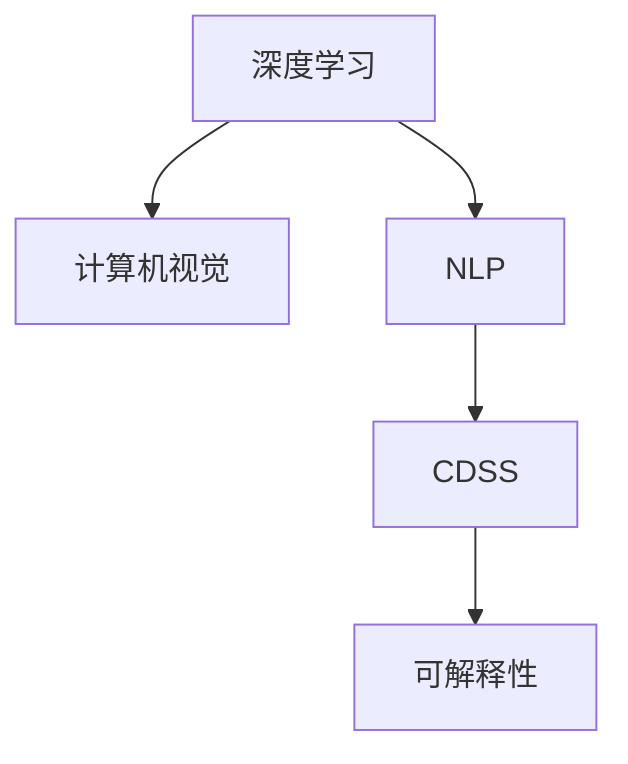

                 

# AI在医疗诊断中的应用与挑战

> 关键词：人工智能,医疗诊断,深度学习,计算机视觉,自然语言处理,临床决策支持

## 1. 背景介绍

### 1.1 问题由来
随着人工智能(AI)技术的飞速发展，其在医疗诊断领域的应用逐渐成为热门话题。AI通过深度学习、计算机视觉、自然语言处理等技术，能够辅助医生进行疾病诊断、病理分析、治疗决策等关键任务，显著提高了医疗服务的质量和效率。然而，尽管AI在许多方面展现了其巨大的潜力，其在医疗诊断中的广泛应用仍然面临诸多挑战，需要解决一系列关键技术难题。本文将深入探讨AI在医疗诊断中的核心概念、技术原理及其实际应用，同时揭示其在落地过程中面临的诸多挑战。

### 1.2 问题核心关键点
AI在医疗诊断中的应用，核心在于其利用机器学习算法，对医疗数据进行高效分析和处理，从而辅助医生进行更准确、更快速的诊断和治疗。其关键技术点包括：

- 数据预处理：将复杂多样的医疗数据转换为机器学习算法可处理的结构化形式。
- 模型训练：构建高效的深度学习模型，并使用医疗数据集进行训练。
- 特征提取：从医疗数据中提取具有代表性的特征，供模型进行诊断。
- 模型评估：采用适当的评估指标，对模型的诊断性能进行客观评估。
- 实际应用：将训练好的模型应用于临床实践，辅助医生进行诊断和治疗决策。

## 2. 核心概念与联系

### 2.1 核心概念概述

为更好地理解AI在医疗诊断中的应用，本节将介绍几个密切相关的核心概念：

- **深度学习**：一种基于神经网络的机器学习算法，通过多层次的特征提取和模型训练，能够学习到数据的复杂特征。
- **计算机视觉**：利用机器学习算法，实现对医学图像的自动分析和处理，如CT、MRI等。
- **自然语言处理(NLP)**：处理和理解医学文本数据，包括电子病历、临床报告等。
- **临床决策支持系统(CDSS)**：集成AI算法，辅助医生进行诊断和治疗决策的系统。
- **可解释性**：AI诊断模型的决策过程应可解释，使医生能够理解其诊断依据。

这些核心概念之间的逻辑关系可以通过以下Mermaid流程图来展示：



这个流程图展示了几项关键技术的相互联系：

1. **深度学习**：作为AI的核心技术，通过多层次的特征提取和模型训练，为其他技术提供强有力的支持。
2. **计算机视觉**：利用深度学习，实现对医学图像的自动分析和处理。
3. **NLP**：通过自然语言处理，处理和理解医学文本数据。
4. **CDSS**：将以上技术集成，辅助医生进行诊断和治疗决策。
5. **可解释性**：保证AI诊断模型的透明性，使医生能够理解其决策依据。

这些核心概念共同构成了AI在医疗诊断中的技术框架，使得其在诊断和治疗过程中发挥重要作用。

## 3. 核心算法原理 & 具体操作步骤

### 3.1 算法原理概述

AI在医疗诊断中的应用，主要基于深度学习模型。其核心思想是通过大量医疗数据的训练，构建具有强大诊断能力的模型。模型的诊断能力主要通过特征提取和模型训练两个环节来实现：

1. **特征提取**：通过卷积神经网络(CNN)、循环神经网络(RNN)等深度学习模型，自动从医疗图像和文本中提取特征，供模型进行诊断。
2. **模型训练**：通过使用医疗数据集进行训练，使模型学习到疾病的特征表示，并在测试数据集上进行评估。

### 3.2 算法步骤详解

基于深度学习的AI医疗诊断，一般包括以下几个关键步骤：

**Step 1: 数据收集与预处理**

- **数据收集**：收集大量的医疗数据，包括医学图像、电子病历、临床报告等。
- **数据预处理**：对原始数据进行清洗、归一化、分割等预处理操作，将其转换为模型可处理的格式。

**Step 2: 特征提取**

- **图像特征提取**：使用卷积神经网络对医学图像进行特征提取，生成高维特征向量。
- **文本特征提取**：使用循环神经网络对医学文本进行特征提取，生成高维文本向量。

**Step 3: 模型训练**

- **模型选择**：选择合适的深度学习模型，如CNN、RNN、Transformer等。
- **模型训练**：使用训练数据集对模型进行训练，调整模型参数，使其能够学习到疾病的特征表示。

**Step 4: 模型评估**

- **评估指标**：选择合适的评估指标，如准确率、召回率、F1分数等，对模型进行评估。
- **模型优化**：根据评估结果，对模型进行调参，提高其诊断性能。

**Step 5: 实际应用**

- **模型集成**：将训练好的模型集成到CDSS中，辅助医生进行诊断和治疗决策。
- **用户反馈**：收集医生的反馈，不断优化模型，提高其临床实用性。

### 3.3 算法优缺点

基于深度学习的AI医疗诊断方法具有以下优点：

1. **高效性**：通过自动化的特征提取和模型训练，大幅提升诊断效率。
2. **准确性**：深度学习模型能够学习到复杂的疾病特征，提升诊断准确率。
3. **可扩展性**：模型可以轻松扩展，适应新的疾病和医疗数据。

同时，该方法也存在一些局限性：

1. **数据依赖**：需要大量的医疗数据进行训练，数据量不足会影响模型性能。
2. **可解释性差**：深度学习模型通常是"黑盒"系统，难以解释其内部决策过程。
3. **模型泛化能力**：在特定领域数据上训练的模型，可能无法泛化到其他领域。
4. **计算资源要求高**：深度学习模型通常需要高性能计算资源进行训练和推理。

尽管存在这些局限性，但深度学习在医疗诊断中的应用已经显示出巨大的潜力，被广泛应用于各种疾病诊断、病理分析等场景。

### 3.4 算法应用领域

AI在医疗诊断中的应用，已经覆盖了多个领域，包括但不限于：

- **影像诊断**：利用计算机视觉技术，对医学图像进行自动分析和诊断，如CT、MRI、X光等。
- **病理学分析**：通过深度学习模型，对病理切片图像进行自动分析和诊断，辅助病理医生进行诊断。
- **电子病历分析**：利用自然语言处理技术，对电子病历进行自动分析和提取，辅助医生进行临床决策。
- **药物研发**：使用深度学习模型，预测药物对疾病的疗效，加速新药研发进程。
- **个性化治疗**：根据患者的基因、病历等数据，使用深度学习模型进行个性化治疗方案的推荐。

## 4. 数学模型和公式 & 详细讲解 & 举例说明

### 4.1 数学模型构建

本节将使用数学语言对AI在医疗诊断中的应用进行更加严格的刻画。

设医疗数据集为 $D=\{(x_i,y_i)\}_{i=1}^N$，其中 $x_i$ 为输入数据，$y_i$ 为标签，表示疾病的存在与否。使用深度学习模型 $M$ 对数据进行训练，模型的参数为 $\theta$。模型的目标是最小化损失函数 $\mathcal{L}(\theta)$，即：

$$
\theta^* = \mathop{\arg\min}_{\theta} \mathcal{L}(M_{\theta},D)
$$

其中 $\mathcal{L}$ 为损失函数，通常使用交叉熵损失函数。在实践中，我们通常使用梯度下降等优化算法来近似求解上述最优化问题。

### 4.2 公式推导过程

以医学图像分类为例，假设计算机视觉模型 $M_{\theta}$ 为卷积神经网络，其输出层节点数为 $C$，表示不同类别的概率分布。则交叉熵损失函数为：

$$
\mathcal{L}(M_{\theta},D) = -\frac{1}{N}\sum_{i=1}^N \sum_{c=1}^C y_i^{(c)}\log M_{\theta}(x_i)^{(c)}
$$

其中 $y_i^{(c)}$ 表示样本 $x_i$ 属于第 $c$ 个类别的真实标签。对损失函数求导，得：

$$
\frac{\partial \mathcal{L}(M_{\theta},D)}{\partial \theta} = -\frac{1}{N}\sum_{i=1}^N \sum_{c=1}^C y_i^{(c)}\frac{1}{M_{\theta}(x_i)^{(c)}}\frac{\partial M_{\theta}(x_i)^{(c)}}{\partial \theta}
$$

其中 $\frac{\partial M_{\theta}(x_i)^{(c)}}{\partial \theta}$ 为模型 $M_{\theta}$ 对输入 $x_i$ 的第 $c$ 个输出节点的梯度，可以通过反向传播算法计算得到。

### 4.3 案例分析与讲解

假设我们有一组乳腺癌图像数据集，包含正常和异常的乳腺癌图像。使用卷积神经网络对图像进行特征提取和分类，步骤如下：

1. **数据预处理**：对图像进行归一化、裁剪、缩放等预处理操作，将其转换为标准输入格式。
2. **模型选择**：选择卷积神经网络模型，使用多个卷积层和池化层进行特征提取。
3. **模型训练**：使用交叉熵损失函数，对模型进行训练，调整模型参数，使其能够学习到乳腺癌的特征表示。
4. **模型评估**：在测试数据集上使用准确率、召回率、F1分数等指标对模型进行评估，选择性能最优的模型。
5. **实际应用**：将训练好的模型集成到临床决策支持系统中，辅助医生进行乳腺癌的诊断和治疗决策。

## 5. 项目实践：代码实例和详细解释说明

### 5.1 开发环境搭建

在进行AI医疗诊断开发前，我们需要准备好开发环境。以下是使用Python进行Keras开发的环境配置流程：

1. 安装Anaconda：从官网下载并安装Anaconda，用于创建独立的Python环境。

2. 创建并激活虚拟环境：
```bash
conda create -n keras-env python=3.8 
conda activate keras-env
```

3. 安装Keras：
```bash
pip install keras
```

4. 安装TensorFlow：
```bash
pip install tensorflow
```

5. 安装图像处理库：
```bash
pip install opencv-python matplotlib
```

完成上述步骤后，即可在`keras-env`环境中开始AI医疗诊断的开发实践。

### 5.2 源代码详细实现

下面以医学图像分类为例，给出使用Keras框架实现AI医疗诊断的Python代码实现。

首先，定义数据处理函数：

```python
import numpy as np
import cv2
from sklearn.model_selection import train_test_split
from keras.preprocessing.image import ImageDataGenerator

def load_images(file_list):
    images = []
    labels = []
    for file in file_list:
        image = cv2.imread(file)
        image = cv2.cvtColor(image, cv2.COLOR_BGR2RGB)
        image = cv2.resize(image, (224, 224))
        images.append(image)
        label = file.split('.')[0].split('/')[-1]
        labels.append(label)
    return np.array(images), np.array(labels)

def train_test_split_images(images, labels, test_ratio=0.2):
    images_train, images_test, labels_train, labels_test = train_test_split(images, labels, test_size=test_ratio, stratify=labels)
    return images_train, images_test, labels_train, labels_test
```

然后，定义模型和训练函数：

```python
from keras.models import Sequential
from keras.layers import Conv2D, MaxPooling2D, Flatten, Dense
from keras.preprocessing.image import ImageDataGenerator
from keras.optimizers import Adam

model = Sequential()
model.add(Conv2D(32, (3, 3), activation='relu', input_shape=(224, 224, 3)))
model.add(MaxPooling2D((2, 2)))
model.add(Conv2D(64, (3, 3), activation='relu'))
model.add(MaxPooling2D((2, 2)))
model.add(Conv2D(128, (3, 3), activation='relu'))
model.add(MaxPooling2D((2, 2)))
model.add(Flatten())
model.add(Dense(128, activation='relu'))
model.add(Dense(2, activation='softmax'))
model.compile(optimizer=Adam(lr=0.001), loss='categorical_crossentropy', metrics=['accuracy'])

def train_model(model, images_train, labels_train, images_test, labels_test, epochs=10):
    model.fit(images_train, labels_train, batch_size=32, epochs=epochs, validation_data=(images_test, labels_test))
```

最后，启动训练流程并在测试集上评估：

```python
# 加载数据集
images, labels = load_images(file_list)
images_train, images_test, labels_train, labels_test = train_test_split_images(images, labels, test_ratio=0.2)

# 训练模型
train_model(model, images_train, labels_train, images_test, labels_test, epochs=10)

# 评估模型
test_loss, test_accuracy = model.evaluate(images_test, labels_test)
print(f'Test accuracy: {test_accuracy}')
```

以上就是使用Keras框架实现医学图像分类的完整代码实现。可以看到，得益于Keras的高层封装，我们可以用相对简洁的代码完成AI模型的开发。

### 5.3 代码解读与分析

让我们再详细解读一下关键代码的实现细节：

**load_images函数**：
- 加载图像数据，并将其转换为模型所需的格式。

**train_test_split_images函数**：
- 将数据集划分为训练集和测试集，并保证类别分布的一致性。

**model定义**：
- 定义卷积神经网络模型，包括卷积层、池化层、全连接层等。

**train_model函数**：
- 定义训练函数，使用交叉熵损失函数，Adam优化器进行模型训练。

**代码解读与分析**：
- 首先，通过load_images函数加载数据集，将其转换为模型所需的格式。
- 接着，使用train_test_split_images函数将数据集划分为训练集和测试集，并保证类别分布的一致性。
- 然后，定义卷积神经网络模型，包括卷积层、池化层、全连接层等。
- 最后，使用train_model函数对模型进行训练，并评估其性能。

## 6. 实际应用场景

### 6.1 医学影像诊断

AI在医学影像诊断中的应用，已经取得了显著的成果。利用计算机视觉技术，对医学图像进行自动分析和诊断，如CT、MRI等，大大提升了诊断的效率和准确性。

在实际应用中，可以从大量的医疗影像数据中学习到疾病的特征表示，构建高效的分类模型，辅助医生进行快速、准确的诊断。例如，利用卷积神经网络对乳腺癌影像进行分类，能够显著提高乳腺癌的早期检测率，为患者的及时治疗争取时间。

### 6.2 电子病历分析

自然语言处理技术在电子病历分析中的应用，也取得了重要进展。通过深度学习模型，对电子病历进行自动分析和提取，能够辅助医生快速获取关键信息，辅助临床决策。

例如，使用循环神经网络对电子病历进行文本分类，能够自动识别病人的病史、症状、诊断等信息，为医生的诊断和治疗决策提供重要参考。此外，利用NLP技术对临床报告进行自动提取和分析，能够快速获取病人的实验室检查结果、影像诊断等信息，辅助医生进行综合诊断。

### 6.3 个性化治疗

AI在个性化治疗中的应用，也逐渐成为热点。利用深度学习模型，根据患者的基因、病历等数据，进行个性化治疗方案的推荐，能够显著提升治疗效果，减少副作用。

例如，利用深度学习模型对病人的基因数据进行分析，能够预测不同药物对疾病的疗效，为医生推荐最适合的治疗方案。此外，利用NLP技术对病人的病历进行自动分析和提取，能够快速获取病人的症状、病史等信息，为医生的诊断和治疗决策提供重要参考。

## 7. 工具和资源推荐

### 7.1 学习资源推荐

为了帮助开发者系统掌握AI在医疗诊断中的理论基础和实践技巧，这里推荐一些优质的学习资源：

1. **《深度学习》书籍**：Ian Goodfellow等人所著，全面介绍了深度学习的基本概念和核心算法。
2. **《Python深度学习》书籍**：Francois Chollet等人所著，详细介绍了使用Keras进行深度学习开发的方法和技巧。
3. **Coursera《深度学习专项课程》**：由Andrew Ng等知名教授开设，涵盖深度学习的基本理论和实践技巧。
4. **arXiv预印本**：大量关于AI在医疗诊断中的应用研究的预印本，提供了前沿的学术研究成果。
5. **医学影像数据集**：如LIDC-IDRI、ChestX-ray8等，为深度学习模型训练提供了丰富的数据资源。

通过对这些资源的学习实践，相信你一定能够快速掌握AI在医疗诊断中的精髓，并用于解决实际的医疗问题。

### 7.2 开发工具推荐

高效的开发离不开优秀的工具支持。以下是几款用于AI医疗诊断开发的常用工具：

1. **TensorFlow**：由Google主导开发的开源深度学习框架，生产部署方便，适合大规模工程应用。
2. **Keras**：高层深度学习API，封装了TensorFlow等底层框架，使用方便，适合快速开发原型。
3. **PyTorch**：基于Python的开源深度学习框架，灵活动态，适合快速迭代研究。
4. **OpenCV**：开源计算机视觉库，提供了丰富的图像处理和分析工具。
5. **Matplotlib**：Python绘图库，用于可视化模型的训练和评估结果。

合理利用这些工具，可以显著提升AI医疗诊断任务的开发效率，加快创新迭代的步伐。

### 7.3 相关论文推荐

AI在医疗诊断领域的研究已积累了丰富的研究成果。以下是几篇奠基性的相关论文，推荐阅读：

1. **《医学影像分类的深度学习算法》**：Wang等人，详细介绍了卷积神经网络在医学影像分类中的应用。
2. **《电子病历文本分类的深度学习方法》**：Sutskever等人，详细介绍了使用循环神经网络进行电子病历文本分类的方法。
3. **《基于深度学习的个性化治疗推荐系统》**：Hu等人，详细介绍了使用深度学习模型进行个性化治疗方案推荐的方法。

这些论文代表了大数据诊断技术的发展脉络。通过学习这些前沿成果，可以帮助研究者把握学科前进方向，激发更多的创新灵感。

## 8. 总结：未来发展趋势与挑战

### 8.1 总结

本文对AI在医疗诊断中的应用进行了全面系统的介绍。首先阐述了AI在医疗诊断中的核心概念和应用场景，明确了AI在提升诊断效率、辅助临床决策等方面的重要价值。其次，从原理到实践，详细讲解了AI在医疗诊断中的数学模型和关键步骤，给出了实际应用中的代码实例。同时，本文还广泛探讨了AI在医疗诊断中面临的诸多挑战，展示了其在落地过程中需要解决的关键技术难题。

通过本文的系统梳理，可以看到，AI在医疗诊断中的应用已经取得了显著的进展，但在实际落地中仍面临诸多挑战，需要从技术、伦理等多个层面进行深入研究。

### 8.2 未来发展趋势

展望未来，AI在医疗诊断中的应用将呈现以下几个发展趋势：

1. **多模态融合**：未来AI诊断将结合多种模态数据，如医学影像、电子病历、基因数据等，进行全面综合分析，提升诊断的准确性和全面性。
2. **深度学习与其他技术的融合**：AI诊断将与自然语言处理、知识图谱等技术深度融合，提升其在多领域、多场景中的应用能力。
3. **个性化医疗**：AI将根据患者的基因、病历等数据，进行个性化治疗方案的推荐，显著提升治疗效果。
4. **自适应学习**：AI诊断将具备自适应学习能力，能够不断学习新的疾病和诊断方法，提升其诊断性能。
5. **可解释性**：未来AI诊断模型将具备更高的可解释性，使医生能够理解其内部决策过程。

以上趋势凸显了AI在医疗诊断中的广阔前景。这些方向的探索发展，必将进一步提升AI诊断系统的性能和应用范围，为医疗服务的智能化转型提供强有力的技术支撑。

### 8.3 面临的挑战

尽管AI在医疗诊断中已经取得了显著的进展，但在迈向更加智能化、普适化应用的过程中，仍面临诸多挑战：

1. **数据质量和隐私保护**：医疗数据通常包含敏感信息，数据的收集和处理需要严格遵守隐私保护法规。同时，数据的准确性和完整性对AI模型的训练效果至关重要。
2. **模型泛化能力**：AI模型在特定领域数据上训练的性能可能无法泛化到其他领域，限制了其应用范围。
3. **计算资源需求**：深度学习模型通常需要高性能计算资源进行训练和推理，限制了其在计算资源有限的场景中的应用。
4. **伦理和安全问题**：AI诊断模型可能存在偏见、误导性输出等问题，需要从数据和算法层面进行伦理和安全考虑。
5. **模型可解释性**：深度学习模型通常是"黑盒"系统，难以解释其内部决策过程。

正视AI在医疗诊断中面临的这些挑战，积极应对并寻求突破，将是大数据诊断技术走向成熟的必由之路。相信随着学界和产业界的共同努力，这些挑战终将一一被克服，AI诊断技术必将在构建人机协同的智能医疗时代中发挥更大的作用。

### 8.4 研究展望

面对AI在医疗诊断中面临的诸多挑战，未来的研究需要在以下几个方面寻求新的突破：

1. **数据治理**：构建统一、标准化的数据治理体系，确保数据的准确性和隐私保护。
2. **多模态融合**：研究多模态数据融合技术，提升AI诊断系统的全面性和准确性。
3. **模型优化**：开发更加高效的模型结构，提高计算资源利用效率，降低对高性能计算资源的需求。
4. **可解释性研究**：研究可解释性技术，提高AI诊断模型的透明度，使医生能够理解其内部决策过程。
5. **伦理和安全**：研究伦理和安全约束，确保AI诊断系统的公平性和安全性。

这些研究方向将推动AI在医疗诊断中的进一步发展，为构建更加智能化、普适化的医疗系统提供坚实的技术基础。总之，AI在医疗诊断中的未来，将不断拓展其应用边界，提升医疗服务的智能化水平，助力人类健康事业的持续进步。

## 9. 附录：常见问题与解答

**Q1: 深度学习模型在医疗诊断中的应用有哪些？**

A: 深度学习模型在医疗诊断中的应用包括但不限于以下几个方面：

1. **医学影像分类**：利用卷积神经网络对医学影像进行分类，如CT、MRI等。
2. **电子病历分析**：利用循环神经网络对电子病历进行文本分类和实体识别。
3. **个性化治疗推荐**：利用深度学习模型对患者基因数据进行分析，推荐最适合的治疗方案。
4. **疾病预测**：利用深度学习模型对病人的病历数据进行分析，预测其患病风险。

这些应用展示了深度学习在医疗诊断中的强大能力，为医生提供辅助决策支持。

**Q2: 深度学习模型在医疗诊断中需要多少数据？**

A: 深度学习模型在医疗诊断中需要大量的高质量数据进行训练，数据量的大小直接影响模型的性能。一般来说，医疗影像分类任务需要数百到数千张标注的影像数据，而电子病历分析任务则需要数十万甚至数百万条标注的电子病历数据。数据量不足会导致模型过拟合，降低其泛化能力。因此，数据质量和数量都是深度学习模型在医疗诊断中应用的关键。

**Q3: 深度学习模型在医疗诊断中的可解释性如何？**

A: 深度学习模型通常是"黑盒"系统，难以解释其内部决策过程。为了提高可解释性，研究者们提出了多种方法，如注意力机制、可解释性框架等，使医生能够理解模型的诊断依据。此外，结合自然语言处理技术，对模型输出进行解释和推理，也有助于提高其可解释性。

**Q4: 深度学习模型在医疗诊断中的计算资源需求如何？**

A: 深度学习模型通常需要高性能计算资源进行训练和推理，如GPU或TPU等。特别是在大规模医疗数据集上训练模型时，计算资源的需求尤为突出。因此，合理优化模型结构和计算图，降低计算资源消耗，是深度学习在医疗诊断中应用的重要方向。

**Q5: 深度学习模型在医疗诊断中的伦理和安全问题如何处理？**

A: 深度学习模型在医疗诊断中的应用需要严格遵守伦理和安全规范，确保其公平性和安全性。研究者们提出了多种方法，如公平性约束、对抗样本攻击防御、隐私保护等，确保模型的公平性和安全性。同时，也需要对模型的输出进行伦理和安全审查，确保其符合医学伦理标准。

综上所述，深度学习在医疗诊断中的应用前景广阔，但也需要面对诸多挑战。通过不断优化模型、数据和算法，提升其性能和可解释性，确保其公平性和安全性，深度学习必将在医疗诊断中发挥更加重要的作用，为人类健康事业的持续进步提供强有力的技术支撑。

---

作者：禅与计算机程序设计艺术 / Zen and the Art of Computer Programming

