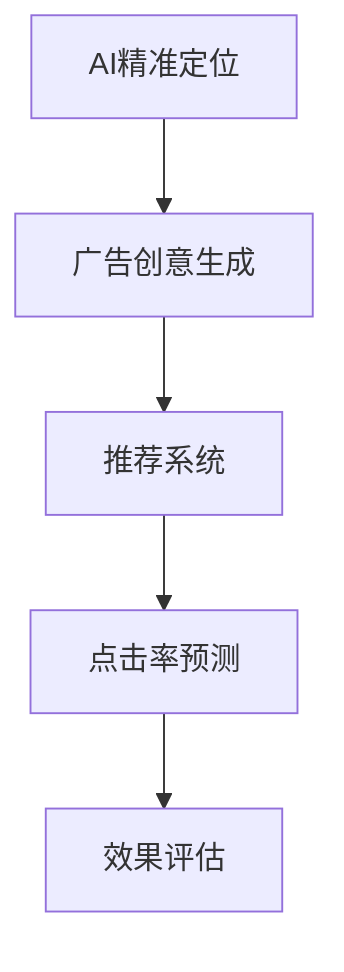

                 

# AI在广告领域的应用：精准定位与创意

> 关键词：人工智能,广告技术,精准定位,创意生成,广告投放优化

## 1. 背景介绍

### 1.1 问题由来
广告行业一直是互联网技术应用最为活跃的领域之一。随着大数据、机器学习和人工智能技术的不断成熟，广告投放从简单的投放优化演变成一个系统性、多维度、智能化的复杂过程。特别是在搜索引擎广告、社交媒体广告和程序化广告等线上渠道中，广告投放的精准度和效果成为广告主最为关心的两个问题。

过去，广告主主要依赖于第三方广告平台提供的点击率（CTR）等指标来衡量广告效果。这种基于历史数据的统计分析方法在数据量和维度较低的传统广告时代尚能满足需求，但面对海量数据和复杂场景的现代广告投放环境，已经显得力不从心。

为了解决这些问题，广告主开始探索利用人工智能技术对广告投放进行优化。本文将详细讨论AI在广告投放优化中的两大学习任务：精准定位和创意生成。

### 1.2 问题核心关键点
精准定位和创意生成是广告投放优化中的两大核心任务。精准定位的目的是在庞大的受众群体中找到最有可能对广告内容产生兴趣的目标用户；创意生成则是根据用户特征和广告目标，自动生成具有高转化率的广告内容。两者的目标均是提升广告的投放效果和ROI。

本文将重点介绍如何通过AI技术实现这两个任务，并进一步讨论其在广告投放优化中的实际应用。

## 2. 核心概念与联系

### 2.1 核心概念概述

为了更好地理解AI在广告领域的应用，本节将介绍几个密切相关的核心概念：

- **AI精准定位**：利用机器学习算法对大量用户数据进行分析，找到最有可能点击或转化广告的目标用户群体。

- **广告创意生成**：根据用户的特征和广告目标，自动生成能够吸引目标用户点击和转化的广告内容。

- **推荐系统**：广告投放优化的核心技术之一，通过协同过滤、深度学习等方法，实现个性化广告推荐，提高广告效果。

- **点击率预测**：利用历史广告数据，预测广告点击的概率，指导投放策略的调整。

- **效果评估**：通过A/B测试等方法，对广告投放效果进行评估，迭代优化广告投放策略。

这些核心概念之间的逻辑关系可以通过以下Mermaid流程图来展示：



这个流程图展示了大语言模型的工作原理和优化方向：

1. 精准定位是广告投放的基础，通过机器学习算法找到目标用户。
2. 创意生成在精准定位的基础上，自动生成符合用户兴趣的广告内容。
3. 推荐系统对广告内容进行智能排序和推荐，提升点击率和转化率。
4. 点击率预测根据历史数据预测广告效果，指导广告投放策略。
5. 效果评估通过A/B测试等方法，对广告投放效果进行评估，反馈迭代优化。

## 3. 核心算法原理 & 具体操作步骤
### 3.1 算法原理概述

AI精准定位和创意生成的核心原理都是机器学习与深度学习。本文将详细介绍这两大任务的具体算法原理和操作步骤。

### 3.2 算法步骤详解

#### 3.2.1 精准定位

精准定位的核心目标是找到最有可能点击或转化广告的目标用户。主要算法包括：

- **协同过滤**：基于用户的历史行为和兴趣，找到与其相似的潜在用户。协同过滤算法分为基于用户的协同过滤和基于物品的协同过滤两种。
- **深度学习**：使用深度神经网络模型，根据用户的特征（如年龄、性别、地理位置等）和历史行为数据，预测用户对广告的响应概率。
- **内容嵌入**：将用户的特征和广告内容转化为向量，通过向量内积的方式计算相似度，找到目标用户。

精准定位的步骤主要包括：

1. 数据准备：收集用户的各项特征数据和历史行为数据。
2. 模型训练：选择协同过滤或深度学习模型，根据已有用户数据进行训练。
3. 用户相似度计算：根据用户的历史行为数据或特征向量，计算目标用户与已有用户的相似度。
4. 目标用户筛选：筛选出相似度最高的用户作为目标用户群体。

#### 3.2.2 广告创意生成

广告创意生成的核心目标是自动生成符合用户兴趣的广告内容。主要算法包括：

- **序列生成**：利用循环神经网络（RNN）或变压器模型，根据用户特征和广告目标，生成文本、图片、视频等广告内容。
- **文本生成**：使用基于Transformer的GPT系列模型，自动生成吸引用户的广告文案和图片说明。
- **图像生成**：利用生成对抗网络（GAN）或变分自编码器（VAE），根据用户特征和广告目标生成创意图片。

广告创意生成的操作步骤如下：

1. 数据准备：收集用户的各项特征数据和广告目标数据。
2. 模型训练：选择序列生成或文本生成模型，根据已有数据进行训练。
3. 创意生成：利用训练好的模型，根据用户特征和广告目标生成创意内容。
4. 效果评估：通过A/B测试等方法，评估广告创意的效果，反馈迭代优化。

### 3.3 算法优缺点

精准定位和广告创意生成算法的主要优缺点如下：

#### 精准定位

- **优点**：
  - 能够在大规模用户数据中找到最有可能点击或转化广告的目标用户。
  - 自动化程度高，无需人工干预，能够快速筛选目标用户。

- **缺点**：
  - 对数据的依赖性强，需要大量高质量用户数据。
  - 算法复杂度高，模型训练和部署成本较高。

#### 广告创意生成

- **优点**：
  - 能够自动生成高质量的广告内容，提高广告的吸引力和点击率。
  - 能够快速迭代优化，提升广告效果。

- **缺点**：
  - 创意生成过程可能存在一定的局限性，无法完全满足所有用户需求。
  - 生成的广告内容可能存在版权问题，需要严格审核和管理。

### 3.4 算法应用领域

精准定位和广告创意生成技术已经在多个广告领域得到了广泛应用，包括：

- **搜索引擎广告**：通过精准定位找到搜索关键字相关的目标用户，自动生成吸引用户的广告创意，提高点击率和转化率。
- **社交媒体广告**：根据用户的社交行为和兴趣，自动生成适合的内容，提高广告投放效果。
- **程序化广告**：在程序化广告投放中，精准定位和创意生成能够优化广告位的选择和广告内容的生成，提升广告效果。
- **电子商务广告**：在电商平台上，精准定位能够找到最有可能购买产品的用户，创意生成能够生成符合用户兴趣的商品广告。

此外，精准定位和广告创意生成技术还在视频广告、移动应用广告等广告领域有广泛应用，为广告主提供更精准、高效的广告投放服务。

## 4. 数学模型和公式 & 详细讲解 & 举例说明

### 4.1 数学模型构建

#### 精准定位

精准定位的数学模型主要包括以下几个部分：

1. **用户特征矩阵**：表示用户的历史行为和特征。
2. **广告特征矩阵**：表示广告的内容和目标。
3. **相似度矩阵**：表示用户和广告之间的相似度。

#### 广告创意生成

广告创意生成的数学模型主要包括以下几个部分：

1. **输入编码器**：将用户特征和广告目标编码成向量。
2. **生成器**：基于编码向量生成广告内容。
3. **损失函数**：用于衡量生成内容与真实内容的差异。

### 4.2 公式推导过程

#### 精准定位

精准定位的公式推导过程如下：

设用户特征矩阵为 $X$，广告特征矩阵为 $Y$，相似度矩阵为 $S$。则相似度矩阵的计算公式为：

$$
S_{ij} = \text{similarity}(X_i, Y_j)
$$

其中，$\text{similarity}$ 表示用户和广告之间的相似度计算方法。常用的相似度计算方法包括余弦相似度、欧式距离等。

目标用户筛选的过程如下：

$$
\text{target\_users} = \text{arg\_max}\{S_{ij}\}
$$

即选取相似度最高的用户作为目标用户。

#### 广告创意生成

广告创意生成的公式推导过程如下：

设输入编码器为 $E$，生成器为 $G$，损失函数为 $\mathcal{L}$。则生成器的训练过程如下：

$$
G_{\theta} = \text{arg\_min}\mathcal{L}(G(E(X_i), Y_j))
$$

其中，$\theta$ 表示生成器的参数。

生成器的输出 $Z$ 可以表示为：

$$
Z = G(E(X_i))
$$

### 4.3 案例分析与讲解

以搜索引擎广告为例，详细讲解精准定位和广告创意生成的过程：

#### 精准定位

1. 收集用户的搜索行为数据和特征数据。
2. 使用协同过滤算法，计算用户之间的相似度。
3. 使用深度学习模型，根据用户特征和搜索历史预测点击概率。
4. 筛选出相似度最高且预测点击概率最大的用户作为目标用户。

#### 广告创意生成

1. 收集用户的特征数据和广告目标数据。
2. 使用GPT模型，自动生成与用户特征和广告目标相符的广告文案和图片。
3. 使用A/B测试评估广告创意的效果，反馈迭代优化。

## 5. 项目实践：代码实例和详细解释说明

### 5.1 开发环境搭建

在进行AI精准定位和广告创意生成的项目实践前，我们需要准备好开发环境。以下是使用Python进行PyTorch开发的环境配置流程：

1. 安装Anaconda：从官网下载并安装Anaconda，用于创建独立的Python环境。

2. 创建并激活虚拟环境：
```bash
conda create -n pytorch-env python=3.8 
conda activate pytorch-env
```

3. 安装PyTorch：根据CUDA版本，从官网获取对应的安装命令。例如：
```bash
conda install pytorch torchvision torchaudio cudatoolkit=11.1 -c pytorch -c conda-forge
```

4. 安装相关库：
```bash
pip install numpy pandas scikit-learn sklearn.metrics matplotlib tqdm jupyter notebook ipython
```

完成上述步骤后，即可在`pytorch-env`环境中开始项目实践。

### 5.2 源代码详细实现

以下是使用PyTorch实现精准定位和广告创意生成的代码示例。

首先，定义精准定位的数据处理函数：

```python
import pandas as pd
from sklearn.metrics.pairwise import cosine_similarity

def generate_similarity_matrix(X, Y):
    similarity_matrix = cosine_similarity(X, Y)
    return similarity_matrix
```

然后，定义广告创意生成的模型：

```python
from transformers import GPT2Tokenizer, GPT2LMHeadModel

tokenizer = GPT2Tokenizer.from_pretrained('gpt2')
model = GPT2LMHeadModel.from_pretrained('gpt2')

def generate_ad_text(user_features, ad_targets):
    input_ids = tokenizer.encode(user_features, return_tensors='pt', max_length=64)
    ad_ids = tokenizer.encode(ad_targets, return_tensors='pt', max_length=64)
    outputs = model.generate(input_ids, max_length=16)
    ad_text = tokenizer.decode(outputs[0], skip_special_tokens=True)
    return ad_text
```

最后，启动精准定位和广告创意生成的训练流程：

```python
# 训练精准定位模型
user_data = pd.read_csv('user_data.csv')
ad_data = pd.read_csv('ad_data.csv')

similarity_matrix = generate_similarity_matrix(user_data['features'], ad_data['targets'])

# 训练广告创意生成模型
user_features = pd.read_csv('user_features.csv')
ad_targets = pd.read_csv('ad_targets.csv')

ad_text = generate_ad_text(user_features['features'], ad_targets['targets'])
print(ad_text)
```

以上就是使用PyTorch对精准定位和广告创意生成进行项目实践的完整代码实现。可以看到，得益于Transformers库的强大封装，我们可以用相对简洁的代码实现精准定位和广告创意生成的功能。

### 5.3 代码解读与分析

让我们再详细解读一下关键代码的实现细节：

**generate_similarity_matrix函数**：
- 定义了精准定位模型中的相似度计算函数，使用余弦相似度计算用户和广告之间的相似度。

**generate_ad_text函数**：
- 定义了广告创意生成模型，使用GPT2模型自动生成广告文案和图片。

**精准定位训练流程**：
- 使用精准定位的数据集，生成相似度矩阵，用于后续的目标用户筛选。

**广告创意生成训练流程**：
- 使用广告创意生成的数据集，生成广告文案和图片，并通过A/B测试等方法进行效果评估。

可以看到，利用PyTorch和Transformers库，精准定位和广告创意生成的代码实现变得简洁高效。开发者可以将更多精力放在数据处理、模型改进等高层逻辑上，而不必过多关注底层的实现细节。

当然，工业级的系统实现还需考虑更多因素，如模型的保存和部署、超参数的自动搜索、更灵活的任务适配层等。但核心的算法原理和实现流程基本与此类似。

## 6. 实际应用场景

### 6.1 搜索引擎广告

搜索引擎广告是最具代表性的精准定位和广告创意生成应用场景之一。通过AI技术，搜索引擎广告能够实现以下功能：

1. **精准定位**：根据用户的搜索历史和特征，找到最有可能点击广告的目标用户。
2. **广告创意生成**：自动生成吸引用户的广告文案和图片，提升广告效果。

### 6.2 社交媒体广告

社交媒体广告是另一个典型的应用场景。AI技术可以帮助社交媒体平台实现以下功能：

1. **精准定位**：根据用户的社交行为和兴趣，找到最有可能点击广告的目标用户。
2. **广告创意生成**：自动生成符合用户兴趣的广告内容，提高广告投放效果。

### 6.3 程序化广告

程序化广告是一种基于数据的广告投放方式，通过精准定位和广告创意生成，可以实现以下功能：

1. **精准定位**：根据用户的行为和特征，找到最有可能点击广告的目标用户。
2. **广告创意生成**：自动生成符合用户兴趣的广告内容，提升广告效果。

### 6.4 电子商务广告

电子商务平台上，精准定位和广告创意生成可以带来以下优势：

1. **精准定位**：找到最有可能购买产品的目标用户。
2. **广告创意生成**：生成符合用户兴趣的商品广告，提升广告效果。

## 7. 工具和资源推荐

### 7.1 学习资源推荐

为了帮助开发者系统掌握精准定位和广告创意生成的理论基础和实践技巧，这里推荐一些优质的学习资源：

1. 《Deep Learning for Advertisers》书籍：介绍如何利用深度学习技术优化广告投放策略，涵盖精准定位和广告创意生成等多个方面。

2. 《Recommender Systems: Text Mining, Search and Recommendation》课程：涵盖推荐系统理论，包括协同过滤和深度学习等推荐方法，适合学习精准定位的算法原理。

3. 《Transformers for Text Generation》博文：详细介绍基于Transformer的文本生成技术，适合学习广告创意生成的算法原理。

4. Kaggle平台：提供大量广告数据集和广告创意生成比赛，适合实践精准定位和广告创意生成。

通过对这些资源的学习实践，相信你一定能够快速掌握精准定位和广告创意生成的精髓，并用于解决实际的广告投放问题。

### 7.2 开发工具推荐

高效的开发离不开优秀的工具支持。以下是几款用于精准定位和广告创意生成开发的常用工具：

1. PyTorch：基于Python的开源深度学习框架，灵活动态的计算图，适合快速迭代研究。

2. TensorFlow：由Google主导开发的开源深度学习框架，生产部署方便，适合大规模工程应用。

3. Transformers库：HuggingFace开发的NLP工具库，集成了众多SOTA语言模型，支持精准定位和广告创意生成。

4. Weights & Biases：模型训练的实验跟踪工具，可以记录和可视化模型训练过程中的各项指标，方便对比和调优。

5. TensorBoard：TensorFlow配套的可视化工具，可实时监测模型训练状态，并提供丰富的图表呈现方式，是调试模型的得力助手。

6. Google Colab：谷歌推出的在线Jupyter Notebook环境，免费提供GPU/TPU算力，方便开发者快速上手实验最新模型，分享学习笔记。

合理利用这些工具，可以显著提升精准定位和广告创意生成的开发效率，加快创新迭代的步伐。

### 7.3 相关论文推荐

精准定位和广告创意生成技术的发展源于学界的持续研究。以下是几篇奠基性的相关论文，推荐阅读：

1. Matrix Factorization Techniques for Recommender Systems（协同过滤算法）：介绍协同过滤算法的基本原理和应用。

2. Attention Is All You Need（Transformer算法）：提出Transformer结构，引入注意力机制，显著提升广告创意生成的效果。

3. Adversarial Training Methods for Deep Neural Networks（对抗训练）：提出对抗训练方法，提高广告创意生成的鲁棒性和泛化能力。

4. GPT-2: A Language Model for Generative Dialogue（GPT-2模型）：介绍GPT-2模型在广告创意生成中的应用，展示了大规模语言模型的潜力。

5. Text Generation Using Deep Reinforcement Learning（强化学习在文本生成中的应用）：提出基于强化学习的广告创意生成方法，提升广告效果。

这些论文代表了大语言模型微调技术的发展脉络。通过学习这些前沿成果，可以帮助研究者把握学科前进方向，激发更多的创新灵感。

## 8. 总结：未来发展趋势与挑战

### 8.1 总结

本文对精准定位和广告创意生成的AI应用进行了全面系统的介绍。首先阐述了AI在广告投放优化中的两大学习任务，明确了精准定位和广告创意生成的独特价值。其次，从原理到实践，详细讲解了精准定位和广告创意生成的算法原理和操作步骤，给出了广告投放优化的完整代码实例。同时，本文还广泛探讨了精准定位和广告创意生成在搜索引擎广告、社交媒体广告、程序化广告等多个广告领域的应用前景，展示了AI技术在广告投放优化中的巨大潜力。此外，本文精选了精准定位和广告创意生成的各类学习资源，力求为读者提供全方位的技术指引。

通过本文的系统梳理，可以看到，AI技术在广告投放优化中的应用已经进入了一个新的发展阶段，有望进一步提升广告投放的精准度和效果，大幅降低广告主的人工成本和试错成本。未来，伴随AI技术在广告领域的深入应用，将进一步提升广告主的市场竞争力和广告投放的效果。

### 8.2 未来发展趋势

展望未来，精准定位和广告创意生成技术将呈现以下几个发展趋势：

1. **多模态数据融合**：精准定位和广告创意生成将进一步拓展到图像、视频等多模态数据，实现视觉、语音等多模态信息的协同建模。

2. **联邦学习**：利用联邦学习技术，在保护用户隐私的前提下，实现广告投放数据的分布式计算和协同优化。

3. **实时推荐**：基于实时数据流，实现广告投放的实时推荐和优化，提高广告投放的动态响应能力。

4. **跨域优化**：通过跨域优化技术，实现广告投放的跨平台、跨渠道优化，提升广告效果。

5. **生成对抗网络（GAN）**：利用GAN技术，生成高质量的广告创意内容，进一步提升广告效果。

这些趋势凸显了精准定位和广告创意生成技术的广阔前景。这些方向的探索发展，必将进一步提升广告投放的精准度和效果，为广告主提供更精准、高效的广告投放服务。

### 8.3 面临的挑战

尽管精准定位和广告创意生成技术已经取得了瞩目成就，但在迈向更加智能化、普适化应用的过程中，它仍面临着诸多挑战：

1. **数据隐私问题**：广告投放优化过程中需要收集大量的用户数据，如何保护用户隐私是一个重要问题。

2. **广告创意的多样性**：广告创意的生成可能存在一定的局限性，无法完全满足所有用户需求。

3. **计算资源消耗**：精准定位和广告创意生成过程对计算资源的需求较高，如何提高计算效率是一个重要挑战。

4. **广告效果的评估**：如何科学合理地评估广告效果，确保广告投放的效果和ROI，是一个重要问题。

5. **广告创意的版权问题**：生成的广告内容可能存在版权问题，如何确保广告创意的合法性是一个重要问题。

这些挑战需要开发者在技术、法律、伦理等多个维度进行深入探讨，找到可行的解决方案，才能将精准定位和广告创意生成技术推向新的高度。

### 8.4 研究展望

为了解决精准定位和广告创意生成技术所面临的挑战，未来的研究需要在以下几个方面寻求新的突破：

1. **隐私保护技术**：利用差分隐私、联邦学习等技术，保护用户隐私，确保广告投放数据的安全性。

2. **多样性生成技术**：利用多样性生成技术，生成更多样化的广告创意内容，满足用户需求。

3. **计算效率优化**：利用分布式计算、模型压缩等技术，提高精准定位和广告创意生成过程的计算效率。

4. **效果评估方法**：利用A/B测试、因果推断等方法，科学合理地评估广告效果，确保广告投放的效果和ROI。

5. **创意版权管理**：利用版权管理技术，确保广告创意的合法性，避免版权纠纷。

这些研究方向将推动精准定位和广告创意生成技术的发展，为广告主提供更精准、高效的广告投放服务，同时也将进一步提升AI技术在广告领域的应用价值。

## 9. 附录：常见问题与解答

**Q1：精准定位和广告创意生成的算法如何提升广告效果？**

A: 精准定位和广告创意生成算法能够在大规模用户数据中找到最有可能点击广告的目标用户，并自动生成符合用户兴趣的广告内容。通过精准定位和广告创意生成，广告投放能够更精准地触达目标用户，提高广告的点击率和转化率，从而提升广告效果和ROI。

**Q2：如何避免精准定位和广告创意生成过程中的过拟合问题？**

A: 避免过拟合问题的方法包括：

1. 数据增强：通过回译、近义替换等方式扩充训练集。
2. 正则化：使用L2正则、Dropout等技术防止过拟合。
3. 对抗训练：引入对抗样本，提高模型鲁棒性。
4. 参数高效微调：只更新极少量的任务相关参数，避免过拟合。

**Q3：精准定位和广告创意生成在实际应用中需要注意哪些问题？**

A: 精准定位和广告创意生成在实际应用中需要注意以下问题：

1. 数据隐私：保护用户隐私，确保广告投放数据的安全性。
2. 广告创意的多样性：生成更多样化的广告创意内容，满足用户需求。
3. 计算资源消耗：提高计算效率，降低资源消耗。
4. 广告效果的评估：科学合理地评估广告效果，确保广告投放的效果和ROI。
5. 广告创意的版权问题：确保广告创意的合法性，避免版权纠纷。

通过解决这些实际问题，才能将精准定位和广告创意生成技术推向新的高度，为广告主提供更精准、高效的广告投放服务。

**Q4：如何在实际应用中优化广告创意生成的效果？**

A: 优化广告创意生成的效果的方法包括：

1. 数据收集：收集更多样化的用户特征和广告目标数据。
2. 模型选择：选择适合任务的模型，如GPT系列、Transformer等。
3. 超参数调优：调整模型超参数，如学习率、批量大小等。
4. 反馈迭代：利用A/B测试等方法，评估广告创意效果，反馈迭代优化。
5. 创意版权管理：确保广告创意的合法性，避免版权纠纷。

通过这些方法，可以显著提升广告创意生成的效果，为广告主提供更精准、高效的广告投放服务。

---

作者：禅与计算机程序设计艺术 / Zen and the Art of Computer Programming

