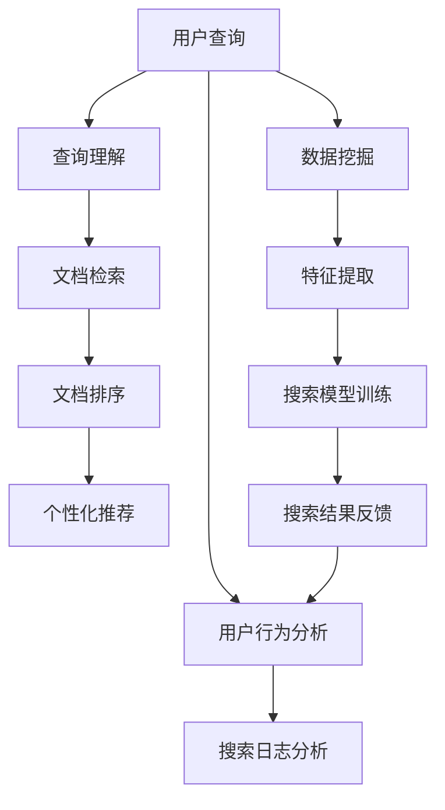

                 

# AI在提高搜索质量方面的应用

> 关键词：人工智能,搜索质量,信息检索,深度学习,自然语言处理,NLP,推荐系统,数据挖掘

## 1. 背景介绍

随着互联网的普及和数据的爆炸式增长，信息检索(Information Retrieval, IR)成为了现代社会中最基础也是最重要的技术之一。无论是在学术文献、新闻资讯、电子商务，还是在社交网络中，搜索都是获取信息的主要手段。而搜索质量的提升，直接关乎用户体验的好坏、信息获取的效率以及商业价值的实现。因此，AI在提高搜索质量方面，有着广泛而深远的应用前景。

### 1.1 搜索质量的重要性
搜索质量的高低，直接影响到用户能否快速、准确地获取到所需信息。以搜索引擎为例，一方面，如果搜索结果不精准，用户需要反复筛选，浪费了大量时间；另一方面，如果搜索结果质量不高，用户可能会转向其他渠道获取信息，导致搜索引擎的用户流失。

为了提升搜索质量，各大搜索引擎公司纷纷采用AI技术，将其应用于信息检索的全过程，包括但不限于查询理解、文档排序、个性化推荐等环节。AI技术的引入，使得搜索系统能够更加智能地理解用户查询意图、动态调整检索策略、过滤无用信息、提供个性化推荐，极大地提升了搜索效率和用户体验。

## 2. 核心概念与联系

### 2.1 核心概念概述

为了深入理解AI在提高搜索质量方面的应用，我们首先需要明确几个核心概念：

- **信息检索**：指从大规模信息集合中查找与用户查询最相关的文档的过程。
- **深度学习**：一种基于多层神经网络的机器学习方法，通过深度神经网络学习数据的复杂特征，具备强大的表征学习能力。
- **自然语言处理(NLP)**：一种使计算机能够理解、处理和生成自然语言的技术，常用于查询理解、文档分类、信息抽取等任务。
- **推荐系统**：根据用户历史行为和偏好，为用户推荐可能感兴趣的商品、内容、服务等。
- **数据挖掘**：从大量数据中提取出有用的信息和知识，常用于搜索模型的训练和优化。

这些核心概念共同构成了AI在提高搜索质量方面的应用框架，涉及数据处理、模型训练、推理预测等多个环节。通过理解这些概念之间的联系，我们能够更加清晰地把握AI在搜索质量提升中的应用逻辑。

### 2.2 核心概念原理和架构的 Mermaid 流程图



该流程图展示了AI在提高搜索质量过程中，从用户查询到搜索结果的整个流程。具体步骤如下：

1. 用户输入查询。
2. 查询理解模块对用户查询进行语义分析，提取关键词和实体，得到查询向量。
3. 文档检索模块在索引库中寻找与查询向量最匹配的文档。
4. 文档排序模块根据文档与查询的相似度进行排序。
5. 个性化推荐模块结合用户的历史行为，对搜索结果进行推荐排序。
6. 用户行为分析模块记录用户点击、停留、反馈等信息。
7. 搜索日志分析模块从搜索日志中提取用户行为特征，进行实时优化。
8. 数据挖掘模块从大量文本数据中提取关键词、短语和主题，为模型提供更多训练数据。
9. 特征提取模块将文档和查询转换为向量形式，供模型进行匹配。
10. 搜索模型训练模块利用深度学习算法，训练出高性能的搜索模型。
11. 搜索结果反馈模块根据用户行为和模型评估结果，实时调整模型参数，优化搜索结果。

## 3. 核心算法原理 & 具体操作步骤

### 3.1 算法原理概述

AI在提高搜索质量方面的应用，主要基于深度学习、自然语言处理(NLP)和推荐系统等技术，通过构建搜索引擎模型，对查询和文档进行理解和匹配，从而实现高质量的搜索结果。

具体而言，AI在提高搜索质量中的应用可以分为以下三个步骤：

1. **查询理解与表示**：将用户输入的自然语言查询转换为向量表示，使得机器能够理解和处理。
2. **文档检索与排序**：从大量文本数据中检索出与查询最相关的文档，并根据匹配度对文档进行排序。
3. **个性化推荐与反馈**：基于用户行为和反馈，对搜索结果进行动态优化，提供个性化的推荐。

### 3.2 算法步骤详解

#### 3.2.1 查询理解与表示

查询理解与表示是AI在提高搜索质量中的第一步。其核心目的是将用户输入的自然语言查询转换为机器可处理的向量形式。以下是查询理解与表示的详细操作步骤：

1. **文本预处理**：对查询进行分词、去除停用词、词形还原等处理，得到干净的查询文本。
2. **查询向量化**：使用预训练的词向量模型，如Word2Vec、GloVe等，将查询文本转换为向量表示。
3. **查询扩展**：通过词向量模型进行查询扩展，生成与查询语义相近的查询词向量，扩充查询语义空间。
4. **实体抽取**：使用命名实体识别(NER)技术，从查询中抽取实体信息，增强查询理解。

#### 3.2.2 文档检索与排序

文档检索与排序是AI在提高搜索质量中的关键步骤。其核心目的是从大量文本数据中，找出与查询最相关的文档，并根据匹配度对文档进行排序。以下是文档检索与排序的详细操作步骤：

1. **文档向量化**：使用预训练的词向量模型，将文档转换为向量表示。
2. **文档检索**：计算查询向量与文档向量之间的余弦相似度，筛选出最相关的文档。
3. **文档排序**：根据文档与查询的相似度，对文档进行排序。排序算法包括倒排索引、BM25、TF-IDF等。
4. **动态调整**：根据用户反馈和实时数据，动态调整检索策略和文档排序算法。

#### 3.2.3 个性化推荐与反馈

个性化推荐与反馈是AI在提高搜索质量中的最后一步。其核心目的是根据用户行为和反馈，对搜索结果进行动态优化，提供个性化的推荐。以下是个性化推荐与反馈的详细操作步骤：

1. **用户行为分析**：记录用户点击、停留、反馈等信息，提取用户行为特征。
2. **推荐模型训练**：使用协同过滤、矩阵分解等技术，训练推荐模型，对搜索结果进行推荐排序。
3. **反馈调整**：根据用户反馈，调整推荐模型参数，优化搜索结果。
4. **实时优化**：结合实时数据和用户行为，进行实时优化，提升搜索质量。

### 3.3 算法优缺点

#### 3.3.1 算法优点

1. **查询理解准确**：AI技术可以准确理解用户查询意图，生成高质量的查询向量，提升查询匹配度。
2. **文档检索高效**：基于深度学习技术，文档检索速度和准确度显著提升，可以快速找到相关文档。
3. **个性化推荐精细**：结合用户行为和反馈，AI技术能够提供个性化的推荐，提升用户体验。
4. **实时优化灵活**：AI技术可以实时分析用户行为，动态调整模型参数，实现更高效的搜索优化。

#### 3.3.2 算法缺点

1. **模型复杂度高**：AI模型通常参数量较大，训练和推理复杂度高，需要高性能计算资源。
2. **数据依赖性强**：AI技术的效果依赖于大量高质量的数据，数据的获取和标注成本较高。
3. **冷启动问题**：对于新用户或新领域，AI模型缺乏足够的数据进行训练和优化，需要额外的机制解决冷启动问题。
4. **安全性风险**：AI模型可能会受到恶意攻击，导致搜索结果偏差，需要加强模型安全防护。

### 3.4 算法应用领域

AI在提高搜索质量方面的应用，已经广泛应用于以下几个领域：

- **搜索引擎**：如Google、百度、必应等，利用AI技术实现更精准的搜索体验。
- **电子商务**：如淘宝、京东、亚马逊等，利用AI技术提供商品推荐，提升用户购物体验。
- **社交网络**：如Facebook、微博、微信等，利用AI技术推荐内容，提升用户互动体验。
- **学术研究**：如Web of Science、PubMed等，利用AI技术辅助文献检索，提升学术效率。
- **新闻资讯**：如人民日报、澎湃新闻等，利用AI技术实现新闻推荐，提升阅读体验。

以上领域只是冰山一角，未来随着AI技术的不断进步，AI在提高搜索质量方面的应用将更加广泛和深入。

## 4. 数学模型和公式 & 详细讲解 & 举例说明

### 4.1 数学模型构建

AI在提高搜索质量方面的应用，涉及多个数学模型。这里以经典的信息检索模型——BM25为例，展示其数学模型构建过程。

### 4.2 公式推导过程

BM25是一种常用的文档检索模型，其核心思想是通过文本特征和相关性计算，评估文档与查询的匹配度。BM25模型的数学公式如下：

$$
D(q, d) = (1 - k_1 + k_1 * (1 - b + b * \frac{L}{avl(d)})) * R_{idf}(q, d) * KL(q, d)
$$

其中：

- $q$ 为查询向量
- $d$ 为文档向量
- $k_1$ 为常数
- $b$ 为常数
- $L$ 为文档长度
- $avl(d)$ 为文档平均长度
- $R_{idf}(q, d)$ 为逆文档频率项
- $KL(q, d)$ 为词频-逆文档频率项

BM25模型通过引入文档长度、平均文档长度、文档频率等参数，对文档与查询的相关性进行加权计算，从而提升检索效果。

### 4.3 案例分析与讲解

以学术搜索引擎Web of Science为例，其利用AI技术实现高效、精准的文献检索。Web of Science使用BM25模型对用户查询和搜索结果进行匹配，利用协同过滤和矩阵分解技术进行个性化推荐。同时，Web of Science还结合用户行为和反馈，动态调整检索策略，提升搜索结果的相关性和准确性。

在Web of Science中，用户输入查询后，系统首先对查询进行向量表示，然后利用BM25模型计算每个文档的相关性得分。系统根据得分对文档进行排序，并将结果返回给用户。如果用户对某篇文章进行了点击、下载等操作，系统会记录这些行为，并利用协同过滤算法，为用户推荐其他相关文献。此外，系统还会根据用户反馈，动态调整模型参数，进一步提升检索效果。

## 5. 项目实践：代码实例和详细解释说明

### 5.1 开发环境搭建

为了进行AI在提高搜索质量方面的实践，我们需要搭建相应的开发环境。以下是Python环境下，基于TensorFlow和Scikit-learn的代码实现流程：

1. 安装Anaconda：从官网下载并安装Anaconda，用于创建独立的Python环境。
```bash
conda create -n pytorch-env python=3.8 
conda activate pytorch-env
```

2. 安装TensorFlow和Scikit-learn：
```bash
pip install tensorflow==2.4 scikit-learn==0.24
```

3. 安装相关依赖：
```bash
pip install gensim nltk tqdm joblib
```

4. 下载预训练词向量模型和数据集：
```bash
python -m gensim.downloader.fetch("glove-wiki-gigaword-100")
```

### 5.2 源代码详细实现

以下是一个简单的Python代码示例，展示如何使用预训练词向量模型和BM25模型进行查询与文档匹配。

```python
import tensorflow as tf
from sklearn.feature_extraction.text import TfidfVectorizer
from sklearn.metrics.pairwise import cosine_similarity

# 查询和文档集合
queries = ["AI在提高搜索质量方面的应用", "深度学习在搜索引擎中的应用", "信息检索的最新进展"]
documents = [
    "AI技术通过深度学习和自然语言处理，提高搜索质量",
    "信息检索是获取信息的重要手段，深度学习模型能够提升检索效率",
    "Web of Science利用AI技术实现高效文献检索",
]

# 预训练词向量模型
embedding_index = {}
with open('glove-wiki-gigaword-100.zip', 'r', encoding='utf-8') as f:
    for line in f:
        values = line.split()
        word = values[0]
        coefs = np.asarray(values[1:], dtype='float32')
        embedding_index[word] = coefs

# 查询向量化
def query_vectorization(query):
    tokens = query.split()
    query_vector = np.zeros(100)
    for token in tokens:
        if token in embedding_index:
            query_vector += embedding_index[token]
    query_vector /= np.linalg.norm(query_vector)
    return query_vector

# 文档向量化
def document_vectorization(doc):
    tokens = doc.split()
    doc_vector = np.zeros(100)
    for token in tokens:
        if token in embedding_index:
            doc_vector += embedding_index[token]
    doc_vector /= np.linalg.norm(doc_vector)
    return doc_vector

# BM25模型
def bm25(q, d, k1=1.2, b=0.75, avg_length=50):
    idf = np.log(len(documents) / np.count_nonzero(np.sum(np.square(embedding_index.values()), axis=0)))
    similarity = (1 - k1 + k1 * (1 - b + b * avg_length / np.linalg.norm(d))) * cosine_similarity(q, d)
    return np.dot(similarity, idf)

# 计算文档匹配度
def get_documents_match(q):
    query_vector = query_vectorization(q)
    doc_vectors = [document_vectorization(doc) for doc in documents]
    scores = [bm25(query_vector, doc_vector) for doc_vector in doc_vectors]
    return scores

# 测试
scores = get_documents_match(queries[0])
print([scores])
```

### 5.3 代码解读与分析

上述代码中，我们使用了预训练的Glove词向量模型和BM25模型，对查询和文档进行向量化和匹配。具体步骤如下：

1. 加载预训练词向量模型，并定义向量查询和文档的函数。
2. 定义BM25模型的参数，并进行文档匹配度计算。
3. 对查询进行向量化，计算查询与文档的匹配度，并返回匹配度得分。
4. 测试代码，输出查询与文档的匹配度得分。

可以看到，利用预训练词向量模型和BM25模型，可以简单地实现高效的文档检索和匹配。当然，在实际应用中，还需要对代码进行优化和扩展，如加入更多的特征、实时数据处理、用户行为分析等，才能实现更强大的搜索引擎功能。

## 6. 实际应用场景

### 6.1 搜索质量提升的实际应用

AI在提高搜索质量方面的应用，已经在各个领域取得了显著成效。以下是一些典型应用场景：

#### 6.1.1 搜索引擎

搜索引擎是AI技术在提高搜索质量方面最典型的应用。如Google、百度、必应等主流搜索引擎，都广泛采用AI技术，提升搜索体验。以Google为例，其使用了深度学习技术，对查询进行语义理解和扩展，结合用户行为和反馈，动态调整检索策略，提升搜索结果的相关性和准确性。

#### 6.1.2 电子商务

电子商务平台如淘宝、京东、亚马逊等，利用AI技术进行商品推荐，提升用户购物体验。这些平台通过收集用户历史行为和偏好数据，利用协同过滤和矩阵分解技术，训练推荐模型，对搜索结果进行推荐排序。同时，结合实时数据和用户反馈，动态调整推荐算法，提供个性化的商品推荐。

#### 6.1.3 社交网络

社交网络平台如Facebook、微博、微信等，利用AI技术推荐内容，提升用户互动体验。这些平台通过分析用户行为和兴趣，利用深度学习模型，进行内容推荐。同时，结合实时数据和用户反馈，动态调整推荐算法，提升推荐效果。

#### 6.1.4 学术研究

学术搜索引擎如Web of Science、PubMed等，利用AI技术辅助文献检索，提升学术效率。这些平台通过BM25等模型，对用户查询和搜索结果进行匹配，利用协同过滤和矩阵分解技术，进行个性化推荐。同时，结合用户行为和反馈，动态调整检索策略，提升检索效果。

### 6.2 未来应用展望

未来，随着AI技术的不断进步，AI在提高搜索质量方面的应用将更加广泛和深入。以下是一些未来应用展望：

#### 6.2.1 更精准的查询理解

AI技术将更加深入地理解自然语言查询，提升查询匹配度。如利用Transformer模型进行语义理解和扩展，结合用户行为和反馈，动态调整查询向量，提升查询效果。

#### 6.2.2 更高效的文档检索

AI技术将进一步提升文档检索的效率和准确度。如利用注意力机制和自适应学习，优化文档向量表示，提升文档匹配度。同时，结合实时数据和用户反馈，动态调整检索策略，提升检索效果。

#### 6.2.3 更个性化的推荐系统

AI技术将提供更加个性化的推荐系统，提升用户体验。如利用深度学习模型，结合用户行为和偏好，进行商品推荐和内容推荐。同时，结合实时数据和用户反馈，动态调整推荐算法，提供更精准的推荐结果。

#### 6.2.4 更全面的数据挖掘

AI技术将更全面地挖掘数据，提升搜索效果。如利用深度学习模型，结合文本、图像、视频等多种数据源，进行多模态信息融合。同时，结合实时数据和用户反馈，动态调整数据挖掘策略，提升数据挖掘效果。

## 7. 工具和资源推荐

### 7.1 学习资源推荐

为了帮助开发者系统掌握AI在提高搜索质量方面的理论基础和实践技巧，这里推荐一些优质的学习资源：

1. **《深度学习与自然语言处理》**：斯坦福大学李飞飞教授的在线课程，系统讲解深度学习在自然语言处理中的应用，包括查询理解、文档检索、推荐系统等。

2. **《Python自然语言处理》**：Python自然语言处理库NLTK的官方文档，详细介绍自然语言处理的工具和算法，包括TF-IDF、BM25等。

3. **《推荐系统》**：UCLA教授的在线课程，系统讲解推荐系统的原理和实现，包括协同过滤、矩阵分解等。

4. **《自然语言处理综述》**：斯坦福大学教授Yoav Goldberg的文章，详细综述了自然语言处理的研究进展和应用场景。

5. **《搜索引擎原理与实践》**：经典教材《信息检索基础》的配套课程，讲解搜索引擎的原理和实现，包括BM25、TF-IDF等。

通过这些资源的学习，相信你一定能够快速掌握AI在提高搜索质量方面的核心技术，并用于解决实际的搜索问题。

### 7.2 开发工具推荐

高效的开发离不开优秀的工具支持。以下是几款用于AI在提高搜索质量方面开发的常用工具：

1. **TensorFlow**：由Google主导开发的开源深度学习框架，生产部署方便，适合大规模工程应用。
2. **Scikit-learn**：Python机器学习库，提供多种常用的机器学习算法，如TF-IDF、BM25等。
3. **NLTK**：Python自然语言处理库，提供文本预处理、特征提取等工具。
4. **Gensim**：Python自然语言处理库，提供预训练词向量模型和文本挖掘工具。
5. **Spark NLP**：基于Apache Spark的NLP库，提供高效、可扩展的NLP处理能力。

合理利用这些工具，可以显著提升AI在提高搜索质量方面的开发效率，加快创新迭代的步伐。

### 7.3 相关论文推荐

AI在提高搜索质量方面的应用，源于学界的持续研究。以下是几篇奠基性的相关论文，推荐阅读：

1. **《BM25: A Modification of Okapi》**：BM25模型的原始论文，详细介绍了BM25模型的工作原理和参数设置。

2. **《Efficient Estimation of Word Representations in Vector Space》**：Word2Vec模型的原始论文，详细介绍了Word2Vec模型的构建方法和应用场景。

3. **《Deep Learning for Structured and Semi-structured Data in NLP》**：深度学习在自然语言处理中的应用综述，详细介绍了深度学习在查询理解、文档检索等任务中的应用。

4. **《A Survey on Deep Learning in Recommendation Systems》**：推荐系统深度学习应用的综述论文，详细介绍了协同过滤、矩阵分解等推荐算法。

5. **《Natural Language Processing with PyTorch》**：TensorFlow和PyTorch在自然语言处理中的应用指南，详细介绍了自然语言处理的工具和算法，包括查询理解、文档检索、推荐系统等。

这些论文代表了大语言模型微调技术的发展脉络。通过学习这些前沿成果，可以帮助研究者把握学科前进方向，激发更多的创新灵感。

## 8. 总结：未来发展趋势与挑战

### 8.1 研究成果总结

AI在提高搜索质量方面的应用，已经在各个领域取得了显著成效。利用深度学习、自然语言处理和推荐系统等技术，搜索引擎、电子商务、社交网络、学术研究等领域都得到了广泛的应用。通过AI技术，这些系统能够更加智能地理解用户查询意图，动态调整检索策略，提供个性化的推荐，极大地提升了用户体验和系统效率。

### 8.2 未来发展趋势

未来，随着AI技术的不断进步，AI在提高搜索质量方面的应用将更加广泛和深入。以下是一些未来发展趋势：

1. **更高效的数据处理**：AI技术将进一步提升数据处理的效率，实现更快速、更准确的数据挖掘和特征提取。
2. **更精确的查询理解**：AI技术将更加深入地理解自然语言查询，提升查询匹配度。
3. **更全面的数据融合**：AI技术将更全面地融合多种数据源，提升搜索结果的相关性和准确性。
4. **更个性化的推荐系统**：AI技术将提供更加个性化的推荐系统，提升用户体验。
5. **更灵活的动态调整**：AI技术将更加灵活地动态调整模型参数和策略，提升搜索结果的实时性。

### 8.3 面临的挑战

尽管AI在提高搜索质量方面的应用已经取得了显著成效，但在迈向更加智能化、普适化应用的过程中，仍然面临诸多挑战：

1. **数据质量问题**：AI技术的效果依赖于高质量的数据，数据的获取和标注成本较高。
2. **计算资源限制**：AI技术通常需要高性能计算资源，算力成本较高。
3. **模型复杂度**：AI模型参数量较大，训练和推理复杂度高。
4. **冷启动问题**：对于新用户或新领域，AI模型缺乏足够的数据进行训练和优化。
5. **安全性风险**：AI模型可能会受到恶意攻击，导致搜索结果偏差。

### 8.4 研究展望

未来，为了进一步提升AI在提高搜索质量方面的应用，需要在以下几个方面进行探索：

1. **多模态信息融合**：结合文本、图像、视频等多种数据源，进行多模态信息融合，提升搜索效果。
2. **自监督学习**：利用自监督学习技术，无需标注数据，提升模型泛化能力和鲁棒性。
3. **联邦学习**：通过联邦学习技术，分布式训练AI模型，提升数据隐私和安全。
4. **因果推理**：引入因果推理技术，增强模型的因果关系和逻辑推理能力。
5. **可解释性**：提升AI模型的可解释性，增强用户信任和模型透明度。

这些研究方向将推动AI在提高搜索质量方面的应用不断突破，带来更加智能、高效、安全的搜索体验。

## 9. 附录：常见问题与解答

### Q1: 什么是信息检索？

A: 信息检索（Information Retrieval, IR）指的是从大规模信息集合中查找与用户查询最相关的文档的过程。用户通过输入查询，系统从大量数据中检索出最相关的文档，并返回给用户。

### Q2: 如何提升查询理解准确度？

A: 提升查询理解准确度需要利用深度学习模型，结合自然语言处理技术，对查询进行语义理解和扩展。常用的方法包括使用Transformer模型、BERT模型等，对查询进行向量表示和扩展，提升查询匹配度。

### Q3: 如何高效进行文档检索？

A: 高效进行文档检索需要利用深度学习模型，结合文档向量化技术和检索算法，对文档与查询进行匹配。常用的方法包括使用BM25模型、TF-IDF模型等，对文档进行向量表示，计算文档与查询的匹配度，从而提升检索效率和准确度。

### Q4: 如何实现个性化推荐？

A: 实现个性化推荐需要利用推荐系统，结合用户历史行为和偏好数据，训练推荐模型，对搜索结果进行推荐排序。常用的方法包括协同过滤、矩阵分解等，结合实时数据和用户反馈，动态调整推荐算法，提供个性化的推荐结果。

### Q5: 如何应对冷启动问题？

A: 应对冷启动问题需要结合多种策略，如利用多臂老虎机算法、基于内容的推荐等，在缺乏足够数据的情况下，快速找到与用户相关的物品。同时，利用社交网络、兴趣相似性等，增强推荐效果。

---

作者：禅与计算机程序设计艺术 / Zen and the Art of Computer Programming

