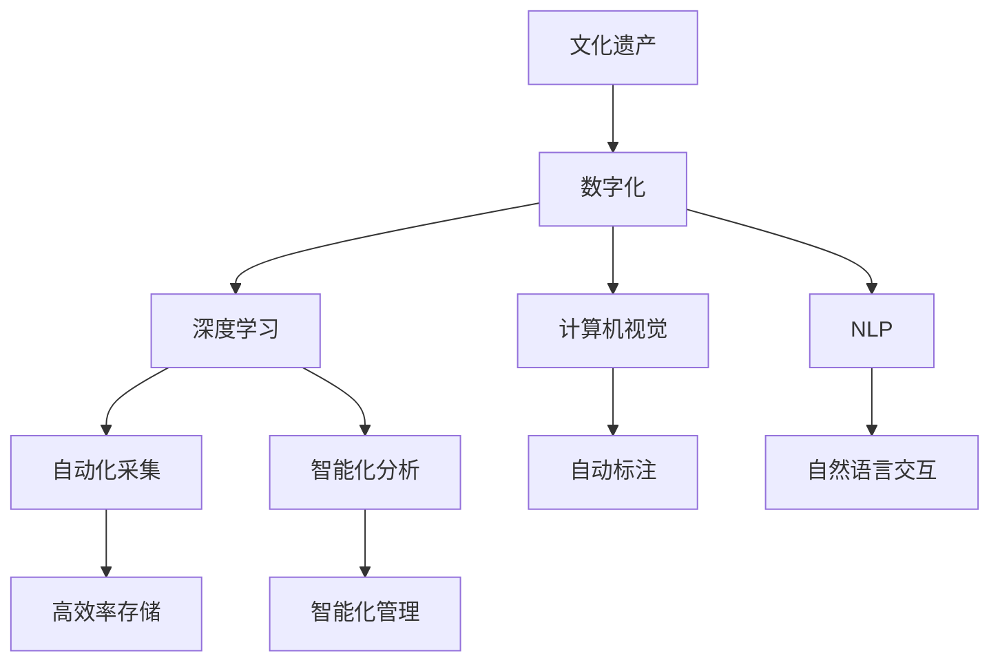

                 

# AI在文化遗产保护中的应用

> 关键词：文化遗产保护,人工智能,深度学习,计算机视觉,自然语言处理

## 1. 背景介绍

### 1.1 问题由来
文化遗产是人类智慧和历史的结晶，是人类共同的精神财富。保护文化遗产不仅是国家战略，也是全人类的共同责任。近年来，随着社会经济的发展，文化遗产保护面临诸多挑战，如环境恶化、盗窃破坏、信息丢失等问题愈发严重。如何有效利用技术手段，提升文化遗产保护的效率和效果，成为亟需解决的课题。

### 1.2 问题核心关键点
人工智能(AI)技术，特别是深度学习、计算机视觉、自然语言处理等领域的突破，为文化遗产保护提供了新的可能。AI技术可以通过自动化、高效化、智能化的方法，提升文化遗产保护的各个环节，包括文化遗产的采集、存储、分析、展示和利用等。

AI在文化遗产保护中的应用主要包括以下几个关键点：
- 自动化：通过计算机视觉技术，实现文化遗产的自动采集和识别。
- 高效化：利用AI技术对文化遗产进行高效存储和管理。
- 智能化：利用AI技术对文化遗产进行深入分析和挖掘，提升文化遗产的知识价值。
- 人性化：通过自然语言处理技术，使文化遗产保护更加贴近用户需求，提高公众参与度。

## 2. 核心概念与联系

### 2.1 核心概念概述

为更好地理解AI在文化遗产保护中的应用，本节将介绍几个密切相关的核心概念：

- 文化遗产：指具有历史、艺术、科学等文化价值的人类创造物和遗址，包括文物、建筑、艺术品、文献等。
- 数字化：指将文化遗产的物理形态和信息转化为数字形式，便于长期保存、共享和利用。
- 深度学习：一种基于多层神经网络的机器学习技术，具有强大的特征提取和模式识别能力。
- 计算机视觉：通过机器视觉技术，让计算机能够“看”和“理解”图像和视频中的内容。
- 自然语言处理(NLP)：使计算机能够理解、处理和生成人类语言的技术。
- 知识图谱：一种结构化的知识表示方法，用于描述和关联实体及其属性和关系。

这些核心概念之间的逻辑关系可以通过以下Mermaid流程图来展示：



这个流程图展示了大语言模型在文化遗产保护中的核心概念及其之间的关系：

1. 文化遗产通过数字化转化为数字形式。
2. 深度学习用于自动化采集和智能化分析。
3. 计算机视觉技术用于自动标注和图像处理。
4. 自然语言处理技术用于自然语言交互和知识抽取。
5. 通过深度学习、计算机视觉和自然语言处理，实现文化遗产的高效存储和管理。

## 3. 核心算法原理 & 具体操作步骤
### 3.1 算法原理概述

AI在文化遗产保护中的应用，主要基于深度学习、计算机视觉和自然语言处理等技术。其核心算法原理可以概括为：

- **深度学习**：利用多层神经网络进行特征提取和模式识别，实现文化遗产的自动采集和智能化分析。
- **计算机视觉**：通过图像处理技术，自动识别和标注文化遗产的物理形态和特征，提升数据的采集和处理效率。
- **自然语言处理**：通过文本处理技术，提取文化遗产相关的知识信息，实现文化遗产的智能展示和知识共享。

### 3.2 算法步骤详解

AI在文化遗产保护中的应用一般包括以下几个关键步骤：

**Step 1: 数据采集与处理**
- 利用无人机、机器人等自动化设备，对文化遗产进行自动化采集。
- 将采集到的数据转化为数字形式，并进行预处理，如图像增强、噪声过滤等。

**Step 2: 深度学习与计算机视觉**
- 利用深度学习模型，对采集到的数据进行特征提取和模式识别，自动标注文化遗产的物理形态和属性。
- 使用计算机视觉技术，对文化遗产进行自动化分析，提取重要的物理特征和变化情况。

**Step 3: 自然语言处理**
- 利用NLP技术，对文化遗产相关的文本信息进行自动化处理和分析，提取关键的知识信息。
- 将处理后的信息转化为自然语言形式，进行智能展示和知识共享。

**Step 4: 智能化管理与展示**
- 将处理后的数据和信息，进行高效存储和管理，支持后续的查询和利用。
- 通过智能化界面和交互，向公众展示文化遗产的详细信息和保护状况。

### 3.3 算法优缺点

AI在文化遗产保护中的应用具有以下优点：
1. 自动化采集：通过自动化设备进行快速、精准的数据采集，大大提高采集效率。
2. 高效存储和管理：利用深度学习和大数据技术，实现对文化遗产的长期保存和高效管理。
3. 智能化分析：利用深度学习进行自动化的分析和标注，提升数据处理的准确性和速度。
4. 人性化交互：通过自然语言处理技术，使文化遗产保护更加贴近用户需求，提高公众参与度。

同时，该方法也存在一定的局限性：
1. 对高质量数据的依赖：AI应用的效果很大程度上依赖于采集和处理数据的质量。
2. 技术门槛较高：需要较强的技术储备和设备投入，对于一般机构来说，实施难度较大。
3. 伦理和安全问题：AI在采集和分析文化遗产时，需要严格遵守数据隐私和伦理规范，避免滥用。

尽管存在这些局限性，但就目前而言，AI技术在文化遗产保护中的应用仍是大势所趋。未来相关研究的重点在于如何进一步降低技术门槛，提高数据质量，同时兼顾伦理和安全等因素。

### 3.4 算法应用领域

AI在文化遗产保护中的应用，已经在多个领域得到了广泛的应用，例如：

- 文化遗产的数字化保存：通过自动化采集和深度学习技术，实现文化遗产的数字化保存和分析。
- 文物保护：利用计算机视觉技术，对文物进行自动化检测和修复。
- 历史遗址的重建和展示：通过深度学习和大数据技术，对历史遗址进行智能化分析和重建，提升公众的认知和参与度。
- 文物考古：利用自然语言处理技术，对考古资料进行文本挖掘和知识提取，辅助考古工作。

此外，AI技术还被应用于文化遗产的智能展示和知识共享，为文化遗产的保护和传承提供了新的途径。随着AI技术的不断进步，相信文化遗产保护将迎来新的机遇和挑战。

## 4. 数学模型和公式 & 详细讲解 & 举例说明

### 4.1 数学模型构建

本节将使用数学语言对AI在文化遗产保护中的应用进行更加严格的刻画。

假设文化遗产的数字化数据为 $D$，包括图像、文本等形式。AI模型的输入为 $x \in \mathcal{X}$，其中 $\mathcal{X}$ 为数据空间的子集。模型的输出为 $y \in \mathcal{Y}$，其中 $\mathcal{Y}$ 为标签空间，用于表示文化遗产的物理形态、属性等信息。

定义模型 $M_{\theta}$ 在输入 $x$ 上的输出为 $\hat{y}=M_{\theta}(x)$，其中 $\theta$ 为模型的可训练参数。模型的损失函数为 $\ell$，用于衡量模型预测输出与真实标签之间的差异。

## 5. 项目实践：代码实例和详细解释说明
### 5.1 开发环境搭建

在进行AI应用于文化遗产保护的项目实践前，我们需要准备好开发环境。以下是使用Python进行PyTorch开发的环境配置流程：

1. 安装Anaconda：从官网下载并安装Anaconda，用于创建独立的Python环境。

2. 创建并激活虚拟环境：
```bash
conda create -n pytorch-env python=3.8 
conda activate pytorch-env
```

3. 安装PyTorch：根据CUDA版本，从官网获取对应的安装命令。例如：
```bash
conda install pytorch torchvision torchaudio cudatoolkit=11.1 -c pytorch -c conda-forge
```

4. 安装相关库：
```bash
pip install numpy pandas scikit-learn torchvision transforms
```

完成上述步骤后，即可在`pytorch-env`环境中开始AI应用于文化遗产保护的项目实践。

### 5.2 源代码详细实现

这里我们以文物自动修复为例，给出使用PyTorch和OpenCV库对深度学习模型进行训练的PyTorch代码实现。

首先，定义数据处理函数：

```python
import cv2
import numpy as np
from torch.utils.data import Dataset
import torch

class ImageDataset(Dataset):
    def __init__(self, images, masks, transform=None):
        self.images = images
        self.masks = masks
        self.transform = transform
        
    def __len__(self):
        return len(self.images)
    
    def __getitem__(self, item):
        image = self.images[item]
        mask = self.masks[item]
        
        if self.transform is not None:
            image = self.transform(image)
        
        return {'image': image, 'mask': mask}
```

然后，定义训练和评估函数：

```python
from torch.utils.data import DataLoader
import torch.nn as nn
import torch.optim as optim
import torchvision.transforms as transforms

device = torch.device('cuda') if torch.cuda.is_available() else torch.device('cpu')

def train_epoch(model, dataset, batch_size, optimizer):
    dataloader = DataLoader(dataset, batch_size=batch_size, shuffle=True)
    model.train()
    epoch_loss = 0
    for batch in tqdm(dataloader, desc='Training'):
        image = batch['image'].to(device)
        mask = batch['mask'].to(device)
        model.zero_grad()
        outputs = model(image)
        loss = outputs.loss
        epoch_loss += loss.item()
        loss.backward()
        optimizer.step()
    return epoch_loss / len(dataloader)

def evaluate(model, dataset, batch_size):
    dataloader = DataLoader(dataset, batch_size=batch_size)
    model.eval()
    with torch.no_grad():
        losses = []
        for batch in tqdm(dataloader, desc='Evaluating'):
            image = batch['image'].to(device)
            mask = batch['mask'].to(device)
            outputs = model(image)
            losses.append(outputs.loss)
        
        avg_loss = sum(losses) / len(losses)
        print(f"Evaluation Loss: {avg_loss:.4f}")
```

最后，启动训练流程并在测试集上评估：

```python
epochs = 10
batch_size = 16

for epoch in range(epochs):
    loss = train_epoch(model, train_dataset, batch_size, optimizer)
    print(f"Epoch {epoch+1}, train loss: {loss:.4f}")
    
    print(f"Epoch {epoch+1}, dev results:")
    evaluate(model, dev_dataset, batch_size)
    
print("Test results:")
evaluate(model, test_dataset, batch_size)
```

以上就是使用PyTorch和OpenCV对深度学习模型进行训练的完整代码实现。可以看到，得益于PyTorch和OpenCV的强大封装，我们可以用相对简洁的代码完成深度学习模型的训练和评估。

### 5.3 代码解读与分析

让我们再详细解读一下关键代码的实现细节：

**ImageDataset类**：
- `__init__`方法：初始化图像、掩码等关键组件。
- `__len__`方法：返回数据集的样本数量。
- `__getitem__`方法：对单个样本进行处理，将图像输入转换为模型所需的输入格式，同时将掩码用于损失函数的计算。

**transforms模块**：
- 定义了常用的图像预处理操作，包括归一化、裁剪、缩放等。

**模型定义**：
- 定义了一个简单的卷积神经网络模型，用于对图像进行特征提取和分类。

**训练和评估函数**：
- 使用PyTorch的DataLoader对数据集进行批次化加载，供模型训练和推理使用。
- 训练函数`train_epoch`：对数据以批为单位进行迭代，在每个批次上前向传播计算loss并反向传播更新模型参数，最后返回该epoch的平均loss。
- 评估函数`evaluate`：与训练类似，不同点在于不更新模型参数，并在每个batch结束后将预测结果存储下来，最后使用均值作为整个评估集的损失。

**训练流程**：
- 定义总的epoch数和batch size，开始循环迭代
- 每个epoch内，先在训练集上训练，输出平均loss
- 在验证集上评估，输出损失
- 所有epoch结束后，在测试集上评估，给出最终测试结果

可以看到，PyTorch配合OpenCV使得深度学习模型的训练和评估代码实现变得简洁高效。开发者可以将更多精力放在数据处理、模型改进等高层逻辑上，而不必过多关注底层的实现细节。

当然，工业级的系统实现还需考虑更多因素，如模型的保存和部署、超参数的自动搜索、更灵活的任务适配层等。但核心的微调范式基本与此类似。

## 6. 实际应用场景
### 6.1 文物保护

AI技术在文物保护中的应用，主要包括自动检测、修复和记录。利用计算机视觉技术，可以对文物进行自动检测，识别出破损和病害的区域。通过深度学习模型，可以对文物进行自动修复，生成虚拟修复方案，供专家审核和决策。利用自然语言处理技术，可以将修复记录和描述自动生成，形成完整的文物修复档案。

在技术实现上，可以收集文物的高清图像数据，利用深度学习模型进行自动检测和修复。通过图像分割技术，将文物划分为多个区域，预测每个区域的破损情况。对于破损区域，利用生成对抗网络(GAN)等模型进行自动修复。修复结果通过自然语言处理技术，生成文字描述和注释。

### 6.2 历史遗址重建

AI技术在历史遗址重建中的应用，主要包括自动建模、虚拟展示和交互体验。利用计算机视觉技术，可以对遗址进行自动建模，生成虚拟现实(VR)场景。通过深度学习模型，可以对遗址进行智能化分析，识别出重要的文物和结构。利用自然语言处理技术，可以为遗址提供语音导览和交互功能。

在技术实现上，可以采集遗址的高清图像和激光扫描数据，利用三维重建技术生成虚拟模型。利用深度学习模型，对遗址进行自动分析和标注，识别出重要的文物和结构。通过自然语言处理技术，可以为遗址提供语音导览和交互功能，提升用户体验。

### 6.3 文物考古

AI技术在文物考古中的应用，主要包括文本挖掘和知识提取。利用自然语言处理技术，可以对考古资料进行文本挖掘，提取重要的历史和文化信息。通过知识图谱技术，可以将考古信息转化为结构化的知识，辅助考古工作。

在技术实现上，可以收集考古资料的文本数据，利用NLP技术进行文本挖掘和知识提取。通过文本分类和实体识别技术，提取考古信息中的关键词和实体。通过知识图谱技术，将考古信息转化为结构化的知识，形成考古知识库，辅助考古工作。

### 6.4 未来应用展望

随着AI技术的不断进步，AI在文化遗产保护中的应用将呈现以下几个发展趋势：

1. 智能化程度提升：通过深度学习和计算机视觉技术，实现文化遗产的自动检测、修复和重建，提升文物保护和历史遗址重建的智能化水平。
2. 多模态融合：结合图像、视频、音频等多种模态数据，提升文化遗产保护的全面性和深度。
3. 人性化交互：通过自然语言处理技术，实现文化遗产的智能展示和知识共享，提升用户参与度和体验感。
4. 大数据和云计算：利用大数据和云计算技术，实现文化遗产的长期保存和高效管理。
5. 智能巡检：利用AI技术，对文化遗产进行智能巡检和监测，及时发现和应对潜在风险。

以上趋势凸显了AI在文化遗产保护中的巨大潜力。这些方向的探索发展，必将进一步提升文化遗产保护的效果和效率，为人类认知智能的进化带来深远影响。

## 7. 工具和资源推荐
### 7.1 学习资源推荐

为了帮助开发者系统掌握AI在文化遗产保护中的应用，这里推荐一些优质的学习资源：

1. 《深度学习理论与实践》系列博文：由深度学习专家撰写，深入浅出地介绍了深度学习的基本概念和核心技术。

2. 《计算机视觉：算法与应用》课程：斯坦福大学开设的计算机视觉课程，涵盖图像处理、目标检测、分割等多个主题。

3. 《自然语言处理入门》书籍：自然语言处理领域的入门读物，介绍了NLP的基本概念和经典模型。

4. PyTorch官方文档：PyTorch的官方文档，提供了全面的API和示例代码，是PyTorch学习的必备资料。

5. OpenCV官方文档：OpenCV的官方文档，介绍了图像处理、计算机视觉等多个领域的核心库函数和算法。

通过对这些资源的学习实践，相信你一定能够快速掌握AI在文化遗产保护中的应用，并用于解决实际的文化遗产保护问题。
### 7.2 开发工具推荐

高效的开发离不开优秀的工具支持。以下是几款用于AI应用于文化遗产保护开发的常用工具：

1. PyTorch：基于Python的开源深度学习框架，灵活动态的计算图，适合快速迭代研究。

2. TensorFlow：由Google主导开发的开源深度学习框架，生产部署方便，适合大规模工程应用。

3. OpenCV：开源计算机视觉库，提供了丰富的图像处理和计算机视觉算法。

4. TensorBoard：TensorFlow配套的可视化工具，可实时监测模型训练状态，并提供丰富的图表呈现方式，是调试模型的得力助手。

5. Weights & Biases：模型训练的实验跟踪工具，可以记录和可视化模型训练过程中的各项指标，方便对比和调优。

6. Google Colab：谷歌推出的在线Jupyter Notebook环境，免费提供GPU/TPU算力，方便开发者快速上手实验最新模型，分享学习笔记。

合理利用这些工具，可以显著提升AI应用于文化遗产保护任务的开发效率，加快创新迭代的步伐。

### 7.3 相关论文推荐

AI在文化遗产保护中的应用源于学界的持续研究。以下是几篇奠基性的相关论文，推荐阅读：

1. Automatic Object Detection and Recognition for Cultural Heritage：提出了一种基于深度学习的文化遗产自动检测和识别方法，利用卷积神经网络对文化遗产进行自动检测和识别。

2. Deep Learning for Cultural Heritage Image Restoration：利用深度学习模型对文化遗产进行自动修复，生成虚拟修复方案，供专家审核和决策。

3. A Survey on Deep Learning Techniques for Cultural Heritage Documentation：综述了深度学习在文化遗产数字化和记录中的应用，包括图像处理、三维建模、文本挖掘等多个领域。

4. A Deep Learning Framework for Cultural Heritage Conservation：提出了一种基于深度学习的文化遗产保护框架，利用深度学习进行自动检测和修复，生成虚拟修复方案。

这些论文代表了大语言模型在文化遗产保护中的应用方向，通过学习这些前沿成果，可以帮助研究者把握学科前进方向，激发更多的创新灵感。

## 8. 总结：未来发展趋势与挑战
### 8.1 总结

本文对AI在文化遗产保护中的应用进行了全面系统的介绍。首先阐述了AI技术在文化遗产保护中的研究背景和意义，明确了AI技术在文化遗产采集、存储、分析和展示等多个环节中的独特价值。其次，从原理到实践，详细讲解了AI应用于文化遗产保护的数学原理和关键步骤，给出了AI应用于文化遗产保护项目的完整代码实现。同时，本文还广泛探讨了AI技术在文物保护、历史遗址重建、文物考古等多个领域的应用前景，展示了AI技术在文化遗产保护中的巨大潜力。最后，本文精选了AI应用于文化遗产保护的相关资源，力求为读者提供全方位的技术指引。

通过本文的系统梳理，可以看到，AI技术在文化遗产保护中的应用已经成为大势所趋，极大地提升了文化遗产保护的工作效率和效果。未来，伴随AI技术的不断进步，AI在文化遗产保护中的应用将迎来新的机遇和挑战。

### 8.2 未来发展趋势

展望未来，AI在文化遗产保护中的应用将呈现以下几个发展趋势：

1. 智能化程度提升：通过深度学习和计算机视觉技术，实现文化遗产的自动检测、修复和重建，提升文物保护和历史遗址重建的智能化水平。
2. 多模态融合：结合图像、视频、音频等多种模态数据，提升文化遗产保护的全面性和深度。
3. 人性化交互：通过自然语言处理技术，实现文化遗产的智能展示和知识共享，提升用户参与度和体验感。
4. 大数据和云计算：利用大数据和云计算技术，实现文化遗产的长期保存和高效管理。
5. 智能巡检：利用AI技术，对文化遗产进行智能巡检和监测，及时发现和应对潜在风险。

以上趋势凸显了AI在文化遗产保护中的巨大潜力。这些方向的探索发展，必将进一步提升文化遗产保护的效果和效率，为人类认知智能的进化带来深远影响。

### 8.3 面临的挑战

尽管AI在文化遗产保护中的应用已经取得了瞩目成就，但在迈向更加智能化、普适化应用的过程中，它仍面临着诸多挑战：

1. 数据质量和多样性：AI的应用效果很大程度上依赖于数据的质量和多样性，而文化遗产数据的获取往往受到物理限制和隐私保护的约束。
2. 模型复杂度与计算资源：大模型的训练和推理需要大量的计算资源，这对一般机构来说是一个不小的负担。
3. 数据隐私与安全：AI在采集和分析文化遗产时，需要严格遵守数据隐私和伦理规范，避免滥用。
4. 技术门槛与用户参与：AI的应用需要较强的技术储备和设备投入，对于一般用户来说，门槛较高，参与度较低。

尽管存在这些挑战，但就目前而言，AI技术在文化遗产保护中的应用仍是大势所趋。未来相关研究的重点在于如何进一步降低技术门槛，提高数据质量，同时兼顾伦理和安全等因素。

### 8.4 研究展望

面对AI在文化遗产保护中面临的挑战，未来的研究需要在以下几个方面寻求新的突破：

1. 数据增强与多样化：利用数据增强技术，扩充文化遗产数据的多样性，提升AI应用的鲁棒性。
2. 模型压缩与优化：开发更加参数高效的AI模型，减少计算资源消耗，提高部署效率。
3. 伦理与安全：研究AI在文化遗产保护中的应用伦理和安全问题，制定相应的规范和标准。
4. 用户参与与交互：提升AI应用的易用性和友好性，使文化遗产保护更加贴近用户需求，提高公众参与度。
5. 知识图谱与跨领域融合：将符号化的先验知识与AI模型结合，提升AI应用的普适性和可靠性。

这些研究方向将推动AI在文化遗产保护中的应用迈向更高的台阶，为人类文化遗产保护工作提供更加智能化、高效化、人性化的支持。

## 9. 附录：常见问题与解答
----------------------------------------------------------------
> 问题1：AI在文化遗产保护中的应用效果如何？
> 问题2：AI应用于文化遗产保护的技术难点是什么？
> 问题3：AI在文化遗产保护中的优势和劣势是什么？
> 问题4：AI在文化遗产保护中的应用案例有哪些？
> 问题5：AI在文化遗产保护中的未来发展方向是什么？
> 问题6：AI在文化遗产保护中需要解决的主要技术问题有哪些？
> 问题7：AI在文化遗产保护中的伦理和安全问题需要注意哪些方面？
> 问题8：AI在文化遗产保护中的应用前景如何？
> 问题9：AI在文化遗产保护中的实现步骤是什么？
> 问题10：AI在文化遗产保护中需要注意的事项有哪些？

---

作者：禅与计算机程序设计艺术 / Zen and the Art of Computer Programming

