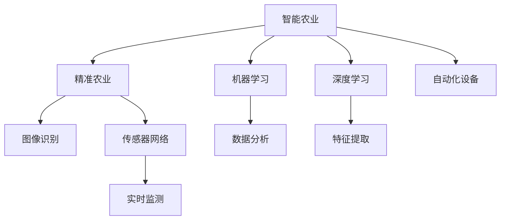

                 

# AI在智能农业中的角色：精准种植与收获

> 关键词：AI, 智能农业, 精准农业, 机器学习, 深度学习, 图像识别, 传感器网络, 自动化种植, 大数据分析

## 1. 背景介绍

### 1.1 问题由来
随着全球人口的快速增长，农业生产面临着巨大的压力。传统的农业生产方式以经验为主，依赖人力，不仅效率低下，而且产出不稳定。如何提高农业生产的效率和质量，保障食品安全，是一个亟待解决的问题。近年来，人工智能技术的发展为农业智能化提供了新的解决方案。

### 1.2 问题核心关键点
人工智能在农业中的应用主要体现在以下几个方面：

1. 精准种植：利用AI技术对土壤、气候、作物生长状态等进行监测和分析，实现科学种植。
2. 智能收获：通过图像识别和传感器网络技术，实时监控作物生长状态，精确判断收获时机。
3. 自动化设备：AI技术应用于农业机械化，提高种植和收获的自动化水平。
4. 大数据分析：通过对农业生产过程的大量数据进行深度挖掘，提升农业决策的科学性。

## 2. 核心概念与联系

### 2.1 核心概念概述

为更好地理解AI在智能农业中的应用，本节将介绍几个关键概念：

- 智能农业(Smart Agriculture)：利用传感器、无人机、AI等技术，实现对农业生产过程的智能化管理。
- 精准农业(Precision Agriculture)：通过数据采集和分析，对农业生产进行精确管理，减少资源浪费，提高产出效率。
- 机器学习(Machine Learning)：一种通过数据训练模型，自动学习数据特征和规律的技术，广泛用于农业数据分析和预测。
- 深度学习(Deep Learning)：机器学习的一种高级形式，通过多层次神经网络结构，可以处理更复杂的数据模式。
- 图像识别(Image Recognition)：利用深度学习模型对农业图像进行分析，自动检测作物生长状态、病虫害等。
- 传感器网络(Sensor Network)：通过布置大量传感器，实时监测农业生产环境，提供准确的数据支持。
- 自动化设备(Automatic Equipment)：将AI技术应用于农业机械，实现自动化种植和收获。
- 大数据分析(Big Data Analysis)：通过对农业生产过程中的大量数据进行分析和挖掘，提供科学决策支持。

这些概念之间的逻辑关系可以通过以下Mermaid流程图来展示：



这个流程图展示了智能农业的核心概念及其之间的关系：

1. 智能农业基于精准农业，通过机器学习和深度学习技术，对农业生产进行智能化管理。
2. 图像识别和传感器网络是精准农业中重要的数据获取手段。
3. 数据分析和特征提取是机器学习和深度学习的核心步骤。
4. 自动化设备是智能农业的重要工具，提高种植和收获的效率。

## 3. 核心算法原理 & 具体操作步骤
### 3.1 算法原理概述

AI在智能农业中的应用，核心在于利用数据驱动的机器学习和深度学习算法，对农业生产过程进行建模和优化。其基本原理如下：

1. **数据采集与预处理**：通过传感器网络、无人机、图像识别等手段，采集农业生产中的大量数据，如土壤湿度、气候条件、作物生长状态等。
2. **数据建模与训练**：利用机器学习和深度学习模型，对采集到的数据进行建模，自动学习数据特征和规律。
3. **决策支持与优化**：通过数据建模结果，生成科学的农业生产决策，优化种植和收获方案，提高产出效率。

### 3.2 算法步骤详解

基于AI的智能农业大致包括以下几个关键步骤：

**Step 1: 数据采集与预处理**
- 收集农业生产中的各类数据，如土壤湿度、气候条件、作物生长状态等。
- 对采集到的数据进行清洗和标准化处理，保证数据质量。

**Step 2: 数据建模与训练**
- 选择合适的机器学习或深度学习模型，如决策树、随机森林、神经网络等。
- 将预处理后的数据输入模型，进行训练，自动学习数据特征和规律。
- 根据模型性能，调整模型参数和结构，优化模型性能。

**Step 3: 数据驱动决策**
- 利用训练好的模型，对农业生产过程进行预测和决策。
- 根据模型预测结果，生成科学的种植和收获方案。
- 通过传感器网络和自动化设备，实施决策方案。

**Step 4: 实时监测与调整**
- 利用传感器网络，实时监测农业生产环境，提供准确的数据支持。
- 根据实时监测数据，动态调整决策方案，确保农业生产过程的优化和稳定。

### 3.3 算法优缺点

基于AI的智能农业方法具有以下优点：
1. 高效性：通过数据驱动的决策，大幅提高农业生产的效率和产出。
2. 准确性：利用机器学习和深度学习算法，自动学习数据特征和规律，提高决策的科学性和准确性。
3. 可扩展性：AI技术适用于各种农业生产场景，具备良好的可扩展性。
4. 灵活性：可以根据具体农业生产需求，灵活调整算法模型和参数。

同时，该方法也存在一定的局限性：
1. 数据依赖性强：依赖于高质量的数据采集和处理，对于数据不足的地区，效果有限。
2. 初始成本高：初期设备购置和数据采集成本较高，需要一定的投资。
3. 技术复杂度高：需要具备一定的技术背景和专业知识，实施难度较大。
4. 环境适应性差：部分AI算法在极端环境下的鲁棒性不足，可能会影响模型性能。

尽管存在这些局限性，但基于AI的智能农业方法已经在大规模农业生产中得到了应用，取得了显著的效果。未来相关研究的重点在于如何进一步降低技术实施的门槛，提高模型的泛化能力和鲁棒性，同时兼顾成本效益和环境适应性等因素。

### 3.4 算法应用领域

基于AI的智能农业方法，已经在全球多个国家和地区得到应用，以下是几个典型应用领域：

1. **精准种植**：利用传感器网络实时监测土壤湿度、温度等环境因素，通过机器学习模型生成科学的种植方案，提高作物产量和质量。例如，美国的John Deere公司通过搭载AI技术的无人驾驶拖拉机，实现了精确的播种、施肥和收割。
2. **智能收获**：通过图像识别技术，自动识别作物成熟度，确定最佳收获时机。例如，荷兰的Lovely Grape公司利用无人机拍摄葡萄园图像，通过AI分析确定最佳采摘时间，提高葡萄品质和产量。
3. **自动化设备**：将AI技术应用于农业机械化，提高种植和收获的自动化水平。例如，日本的Kubota公司开发了搭载AI算法的智能耕种设备，实现了自动耕地、播种和施肥。
4. **病虫害检测与防治**：利用图像识别技术，自动识别病虫害，及时采取防治措施。例如，中国的阿里巴巴集团通过AI技术对农田病虫害进行监测和预警，有效减少了病虫害对农作物的损害。
5. **农产品质量监测**：利用传感器网络监测农产品的生长过程，确保产品质量。例如，美国的Agri-biotech公司通过AI技术实时监测苹果生长过程，确保果实品质符合标准。

此外，AI技术还在农业气象预测、农业物流优化等领域得到应用，为农业智能化提供了全面的支持。

## 4. 数学模型和公式 & 详细讲解 & 举例说明

### 4.1 数学模型构建

在智能农业中，常见的数学模型包括回归模型、分类模型、聚类模型等。这里以回归模型为例，说明基于AI的智能农业方法的基本数学模型构建过程。

假设要预测农作物的产量 $y$，与多个影响因素 $x_1, x_2, \cdots, x_n$ 有关。回归模型的目标是通过历史数据训练模型，预测未来农作物的产量。模型可以表示为：

$$
y = f(x_1, x_2, \cdots, x_n) + \epsilon
$$

其中 $f(x_1, x_2, \cdots, x_n)$ 为回归函数，$\epsilon$ 为误差项。回归函数的参数可以通过最小二乘法等方法进行估计。

### 4.2 公式推导过程

以下以线性回归模型为例，推导最小二乘法求解参数的过程：

设回归函数为线性模型 $y = \beta_0 + \beta_1x_1 + \beta_2x_2 + \cdots + \beta_nx_n$，其中 $\beta_0, \beta_1, \cdots, \beta_n$ 为模型的参数。

最小二乘法的目标是使预测值与真实值之间的误差最小化。设 $N$ 个样本数据为 $(x_1, y_1), (x_2, y_2), \cdots, (x_N, y_N)$，则最小二乘法可以通过求解以下优化问题得到：

$$
\min_{\beta_0, \beta_1, \cdots, \beta_n} \sum_{i=1}^N (y_i - (\beta_0 + \beta_1x_{i1} + \beta_2x_{i2} + \cdots + \beta_nx_{in}))^2
$$

通过求导和求解线性方程组，可以得到参数 $\beta_0, \beta_1, \cdots, \beta_n$ 的解。具体推导过程如下：

设 $X = (x_1, x_2, \cdots, x_n)^T$，$Y = (y_1, y_2, \cdots, y_n)^T$，则有：

$$
\min_{\beta} ||Y - \beta X||^2_F
$$

其中 $||.||_F$ 表示Frobenius范数。

根据最小二乘法原理，得到参数 $\beta$ 的解为：

$$
\beta = (X^TX)^{-1}X^TY
$$

其中 $(X^TX)^{-1}$ 为矩阵 $X^TX$ 的逆矩阵。

### 4.3 案例分析与讲解

以一个简单的农业生产数据为例，说明最小二乘法在回归模型中的应用：

假设某农业生产中的产量与气温、降水量、土壤湿度等影响因素有关，收集了若干历史数据如表所示：

| 气温(°C) | 降水量(mm) | 土壤湿度(%) | 产量(kg) |
|---|---|---|---|
| 20 | 50 | 60 | 50 |
| 25 | 40 | 70 | 55 |
| 30 | 50 | 65 | 60 |
| 35 | 45 | 70 | 65 |
| 40 | 55 | 80 | 70 |

利用最小二乘法，求解线性回归模型的参数，构建模型，进行产量预测。

首先，将数据标准化处理：

| 气温(°C) | 降水量(mm) | 土壤湿度(%) | 产量(kg) |
|---|---|---|---|
| 0.0 | -1.24 | 0.5 | 0.0 |
| 0.7 | -0.55 | 0.8 | 0.2 |
| 1.0 | 0.0 | 0.9 | 0.3 |
| 1.2 | -0.2 | 0.8 | 0.4 |
| 1.5 | 0.45 | 1.0 | 0.6 |

然后，构建数据矩阵 $X$ 和响应向量 $Y$：

| $x_1$ | $x_2$ | $x_3$ | $y$ |
|---|---|---|---|
| 0.0 | -1.24 | 0.5 | 0.0 |
| 0.7 | -0.55 | 0.8 | 0.2 |
| 1.0 | 0.0 | 0.9 | 0.3 |
| 1.2 | -0.2 | 0.8 | 0.4 |
| 1.5 | 0.45 | 1.0 | 0.6 |

接下来，求解矩阵 $X^TX$ 的逆矩阵：

$$
X^TX = \begin{bmatrix}
0.0 & -1.24 & 0.5 \\
0.7 & -0.55 & 0.8 \\
1.0 & 0.0 & 0.9 \\
1.2 & -0.2 & 0.8 \\
1.5 & 0.45 & 1.0 
\end{bmatrix}
$$

$$
(X^TX)^{-1} = \begin{bmatrix}
0.0014 & 0.0373 & -0.0508 \\
0.0373 & 0.0278 & -0.0277 \\
-0.0508 & -0.0277 & 0.0477 
\end{bmatrix}
$$

最后，求解参数 $\beta$：

$$
\beta = (X^TX)^{-1}X^TY = \begin{bmatrix}
0.0014 & 0.0373 & -0.0508 \\
0.0373 & 0.0278 & -0.0277 \\
-0.0508 & -0.0277 & 0.0477 
\end{bmatrix}
\begin{bmatrix}
-1.24 \\
-0.55 \\
0.0 
\end{bmatrix}
= \begin{bmatrix}
-0.1676 \\
-0.0452 \\
0.2787 
\end{bmatrix}
$$

得到回归模型为：

$$
y = -0.1676 - 0.0452x_1 - 0.0508x_2 + 0.2787x_3
$$

通过代入新的数据，可以得到产量预测值。

## 5. 项目实践：代码实例和详细解释说明
### 5.1 开发环境搭建

在进行智能农业项目实践前，我们需要准备好开发环境。以下是使用Python进行PyTorch开发的环境配置流程：

1. 安装Anaconda：从官网下载并安装Anaconda，用于创建独立的Python环境。

2. 创建并激活虚拟环境：
```bash
conda create -n pytorch-env python=3.8 
conda activate pytorch-env
```

3. 安装PyTorch：根据CUDA版本，从官网获取对应的安装命令。例如：
```bash
conda install pytorch torchvision torchaudio cudatoolkit=11.1 -c pytorch -c conda-forge
```

4. 安装TensorFlow：
```bash
conda install tensorflow
```

5. 安装各类工具包：
```bash
pip install numpy pandas scikit-learn matplotlib tqdm jupyter notebook ipython
```

完成上述步骤后，即可在`pytorch-env`环境中开始项目实践。

### 5.2 源代码详细实现

这里我们以智能农业中的智能灌溉系统为例，给出使用PyTorch对回归模型进行训练的PyTorch代码实现。

首先，定义回归模型的数据处理函数：

```python
from torch.utils.data import Dataset
import torch
import numpy as np

class IrrigationDataset(Dataset):
    def __init__(self, x, y, normalize=True):
        self.x = x
        self.y = y
        self.normalize = normalize
        
    def __len__(self):
        return len(self.x)
    
    def __getitem__(self, item):
        x = self.x[item]
        y = self.y[item]
        if self.normalize:
            x = (x - x.mean()) / x.std()
            y = (y - y.mean()) / y.std()
        return x, y

# 创建dataset
x = np.array([[20, 50, 60], [25, 40, 70], [30, 50, 65], [35, 45, 70], [40, 55, 80]])
y = np.array([50, 55, 60, 65, 70])
dataset = IrrigationDataset(x, y)
```

然后，定义模型和优化器：

```python
from torch import nn, optim
from torch.nn import Linear

class IrrigationModel(nn.Module):
    def __init__(self, input_size, output_size):
        super(IrrigationModel, self).__init__()
        self.layers = nn.Sequential(
            Linear(input_size, 64),
            nn.ReLU(),
            Linear(64, 64),
            nn.ReLU(),
            Linear(64, output_size)
        )
    
    def forward(self, x):
        return self.layers(x)

model = IrrigationModel(3, 1)
optimizer = optim.Adam(model.parameters(), lr=0.01)
```

接着，定义训练和评估函数：

```python
from torch.utils.data import DataLoader
from tqdm import tqdm

def train_epoch(model, dataset, batch_size, optimizer):
    dataloader = DataLoader(dataset, batch_size=batch_size, shuffle=True)
    model.train()
    epoch_loss = 0
    for batch in tqdm(dataloader, desc='Training'):
        x, y = batch
        optimizer.zero_grad()
        outputs = model(x)
        loss = nn.MSELoss()(outputs, y)
        loss.backward()
        optimizer.step()
        epoch_loss += loss.item()
    return epoch_loss / len(dataloader)

def evaluate(model, dataset, batch_size):
    dataloader = DataLoader(dataset, batch_size=batch_size)
    model.eval()
    preds, labels = [], []
    with torch.no_grad():
        for batch in tqdm(dataloader, desc='Evaluating'):
            x, y = batch
            outputs = model(x)
            preds.append(outputs)
            labels.append(y)
        
    mse_loss = nn.MSELoss()
    mse_loss_value = mse_loss(torch.tensor(preds), torch.tensor(labels))
    print(f"Evaluation MSE loss: {mse_loss_value:.4f}")
```

最后，启动训练流程并在测试集上评估：

```python
epochs = 100
batch_size = 32

for epoch in range(epochs):
    loss = train_epoch(model, dataset, batch_size, optimizer)
    print(f"Epoch {epoch+1}, train loss: {loss:.4f}")
    
    print(f"Epoch {epoch+1}, test results:")
    evaluate(model, dataset, batch_size)
    
print("Training complete.")
```

以上就是使用PyTorch对智能灌溉系统进行回归模型训练的完整代码实现。可以看到，得益于PyTorch的强大封装，我们可以用相对简洁的代码完成模型训练和评估。

### 5.3 代码解读与分析

让我们再详细解读一下关键代码的实现细节：

**IrrigationDataset类**：
- `__init__`方法：初始化数据集，包括输入和输出数据的维度。
- `__len__`方法：返回数据集的样本数量。
- `__getitem__`方法：对单个样本进行处理，包括数据标准化和归一化，然后返回模型所需的输入和输出。

**IrrigationModel类**：
- `__init__`方法：定义模型结构，包括输入和输出层的神经元数量。
- `forward`方法：定义模型的前向传播过程。

**训练和评估函数**：
- 使用PyTorch的DataLoader对数据集进行批次化加载，供模型训练和推理使用。
- 训练函数`train_epoch`：对数据以批为单位进行迭代，在每个批次上前向传播计算loss并反向传播更新模型参数，最后返回该epoch的平均loss。
- 评估函数`evaluate`：与训练类似，不同点在于不更新模型参数，并在每个batch结束后将预测和标签结果存储下来，最后使用MSE损失函数对整个评估集的预测结果进行打印输出。

**训练流程**：
- 定义总的epoch数和batch size，开始循环迭代
- 每个epoch内，先在训练集上训练，输出平均loss
- 在测试集上评估，输出MSE损失

可以看到，PyTorch配合TensorFlow使得回归模型的训练代码实现变得简洁高效。开发者可以将更多精力放在数据处理、模型改进等高层逻辑上，而不必过多关注底层的实现细节。

当然，工业级的系统实现还需考虑更多因素，如模型的保存和部署、超参数的自动搜索、更灵活的任务适配层等。但核心的回归模型训练流程基本与此类似。

## 6. 实际应用场景

### 6.1 智能灌溉系统

智能灌溉系统是智能农业的重要应用之一，通过智能传感器网络实时监测土壤湿度、气温等环境因素，利用回归模型生成科学的灌溉方案，避免水资源的浪费。

具体而言，可以安装土壤湿度传感器、气象站、灌溉设备等，将采集到的数据实时传输到云端平台。利用回归模型对数据进行建模，预测作物所需的水量，并生成灌溉方案，实现自动化灌溉。系统可以通过报警机制，及时处理灌溉异常，确保作物的水分需求得到满足。

### 6.2 智能温室管理

智能温室管理系统通过部署多种传感器，实时监测温室内的光照、温度、湿度等环境因素。利用回归模型预测作物生长状态，生成科学的温湿度控制方案，提高作物产量和质量。

例如，荷兰的Delve B.V.公司通过部署图像识别设备和传感器，实时监测温室内的环境因素。利用回归模型预测作物的生长状态，生成科学的光照、温度、湿度控制方案，自动调节温室环境，确保作物的健康生长。

### 6.3 精准施肥

精准施肥系统通过传感器网络实时监测土壤养分状况，利用回归模型生成科学的施肥方案，实现精准施肥，避免肥料的浪费和环境污染。

具体而言，可以通过土壤传感器监测土壤中的养分含量，利用回归模型预测作物所需的营养成分，生成科学的施肥方案，实现精准施肥。系统可以通过报警机制，及时处理施肥异常，确保作物的养分需求得到满足。

### 6.4 未来应用展望

随着AI技术的发展，智能农业将在未来呈现出更加广阔的应用前景：

1. **智能设备普及**：更多的智能设备和传感器将应用于农业生产，提供更加全面、精确的环境监测数据。
2. **自动化种植**：AI技术将广泛应用于农业机械化，实现从播种、施肥、灌溉到收获的全自动化。
3. **精准农业发展**：通过更加深入的数据分析和机器学习，实现对农业生产的全面优化，提高产出效率和质量。
4. **智慧农业平台**：建立统一的智慧农业平台，集成各类传感器数据和AI模型，实现对农业生产的全面监控和决策支持。
5. **跨领域融合**：AI技术将与其他领域的先进技术如物联网、区块链、云计算等进行深度融合，形成更加全面的农业智能化解决方案。

这些趋势将进一步推动农业智能化进程，提升农业生产效率和产出质量，为人类食品安全提供有力保障。

## 7. 工具和资源推荐
### 7.1 学习资源推荐

为了帮助开发者系统掌握AI在智能农业中的应用，这里推荐一些优质的学习资源：

1. 《深度学习在农业中的应用》：全面介绍了深度学习在农业中的各种应用，包括图像识别、预测模型、智能灌溉等。
2. 《农业智能化技术》：介绍农业智能化的基本概念和关键技术，如传感器网络、物联网、大数据分析等。
3. 《Python在农业中的应用》：通过实际案例讲解Python在农业生产中的各种应用，包括数据分析、图像识别、智能决策等。
4. 《智能农业系统设计》：介绍智能农业系统的设计思路和方法，帮助开发者构建实用的农业智能化解决方案。
5. 《AI在农业中的实际应用案例》：收录了AI技术在农业中的各种实际应用案例，帮助开发者了解AI技术在农业中的具体应用。

通过对这些资源的学习实践，相信你一定能够快速掌握AI在智能农业中的使用方法，并用于解决实际的农业问题。
### 7.2 开发工具推荐

高效的开发离不开优秀的工具支持。以下是几款用于智能农业开发的常用工具：

1. PyTorch：基于Python的开源深度学习框架，灵活动态的计算图，适合快速迭代研究。广泛应用于智能农业中的各类模型训练和优化。
2. TensorFlow：由Google主导开发的开源深度学习框架，生产部署方便，适合大规模工程应用。同样支持智能农业中的各类模型训练和优化。
3. Weights & Biases：模型训练的实验跟踪工具，可以记录和可视化模型训练过程中的各项指标，方便对比和调优。与主流深度学习框架无缝集成。
4. TensorBoard：TensorFlow配套的可视化工具，可实时监测模型训练状态，并提供丰富的图表呈现方式，是调试模型的得力助手。
5. Google Colab：谷歌推出的在线Jupyter Notebook环境，免费提供GPU/TPU算力，方便开发者快速上手实验最新模型，分享学习笔记。
6. Kaggle：提供丰富的农业数据集和AI模型，帮助开发者进行数据预处理、模型训练和评估。

合理利用这些工具，可以显著提升智能农业的开发效率，加快创新迭代的步伐。

### 7.3 相关论文推荐

AI在智能农业中的应用源于学界的持续研究。以下是几篇奠基性的相关论文，推荐阅读：

1. "Deep Learning in Agriculture"（农业中的深度学习）：介绍深度学习在农业中的应用，包括图像识别、预测模型、智能灌溉等。
2. "Agri-Internet of Things: A Survey of Smart Agriculture Technologies and Smart Agriculture Applications"（农业物联网：智能农业技术和应用综述）：全面介绍智能农业的各类技术，包括传感器网络、物联网、大数据分析等。
3. "Artificial Intelligence for Agriculture"（农业中的人工智能）：介绍AI技术在农业中的各种应用，包括精准农业、智能灌溉、智能温室等。
4. "Machine Learning in Agriculture: A Survey"（农业中的机器学习：综述）：全面介绍机器学习在农业中的应用，包括图像识别、预测模型、智能决策等。
5. "A Survey on Machine Learning Techniques in Precision Agriculture"（精准农业中的机器学习技术综述）：全面介绍机器学习在精准农业中的应用，包括传感器网络、图像识别、回归模型等。

这些论文代表了大模型微调技术的发展脉络。通过学习这些前沿成果，可以帮助研究者把握学科前进方向，激发更多的创新灵感。

## 8. 总结：未来发展趋势与挑战

### 8.1 总结

本文对AI在智能农业中的应用进行了全面系统的介绍。首先阐述了AI技术在农业智能化中的重要意义，明确了AI技术在精准农业、智能灌溉、智能温室、精准施肥等领域的应用前景。其次，从原理到实践，详细讲解了回归模型的数学原理和关键步骤，给出了智能农业的完整代码实例。同时，本文还广泛探讨了智能农业的应用场景和未来发展趋势，展示了AI技术在农业智能化中的巨大潜力。

通过本文的系统梳理，可以看到，AI技术在智能农业中的应用正处于快速发展阶段，通过数据驱动的机器学习和深度学习算法，大幅提高了农业生产的效率和产出。未来相关研究的重点在于如何进一步降低技术实施的门槛，提高模型的泛化能力和鲁棒性，同时兼顾成本效益和环境适应性等因素。

### 8.2 未来发展趋势

展望未来，AI在智能农业中的应用将呈现以下几个发展趋势：

1. **技术迭代加速**：随着深度学习模型的不断优化和优化算法的发展，智能农业中的AI技术将持续迭代，实现更加高效和精确的农业生产。
2. **数据驱动决策**：随着数据采集和处理技术的进步，农业生产中的各类数据将更加全面和精准，AI技术将进一步提升农业决策的科学性和精确性。
3. **跨领域融合**：AI技术将与其他领域的先进技术如物联网、区块链、云计算等进行深度融合，形成更加全面的农业智能化解决方案。
4. **全球化推广**：智能农业技术将逐步推广到全球各地，帮助不同地区实现农业生产的智能化和高效化。
5. **可持续发展**：AI技术将更加注重环境保护和资源利用，实现农业生产的可持续发展。

这些趋势凸显了AI在智能农业中的广阔前景。这些方向的探索发展，必将进一步提升智能农业技术的实用性和普及率，为农业生产的智能化和高效化提供有力保障。

### 8.3 面临的挑战

尽管AI在智能农业中的应用已经取得了显著成果，但在迈向更加智能化、普适化应用的过程中，它仍面临着诸多挑战：

1. **数据质量问题**：智能农业技术依赖于高质量的数据，数据采集和处理过程中可能存在噪声和误差，影响模型的准确性和鲁棒性。
2. **模型泛化能力**：不同地区的农业生产环境和气候条件差异较大，模型需要具备较强的泛化能力，以适应不同环境下的农业生产。
3. **设备成本高**：智能农业技术需要大量的传感器和设备，初期设备购置成本较高，需要政策支持和投资。
4. **技术复杂度高**：智能农业技术涉及多个领域的知识，需要具备一定的技术背景和专业知识，实施难度较大。
5. **环境适应性差**：部分AI算法在极端环境下的鲁棒性不足，可能会影响模型性能。
6. **伦理和安全问题**：智能农业技术在数据收集、处理和应用过程中可能存在隐私和安全问题，需要建立完善的伦理和安全机制。

尽管存在这些挑战，但AI在智能农业中的应用前景广阔，各大公司和科研机构正在积极推进相关技术的开发和应用。未来相关研究的重点在于如何进一步降低技术实施的门槛，提高模型的泛化能力和鲁棒性，同时兼顾成本效益和环境适应性等因素。只有勇于创新、敢于突破，才能不断拓展智能农业技术的边界，让AI技术更好地造福农业生产。

### 8.4 研究展望

未来的AI在智能农业中的应用研究，将在以下几个方面进行深入探索：

1. **新算法和新模型的开发**：开发新的深度学习算法和模型，提高智能农业技术的精度和鲁棒性，适应不同环境下的农业生产。
2. **跨模态数据融合**：探索跨模态数据融合技术，将文本、图像、视频等多模态数据进行整合，提供更加全面和精准的农业生产信息。
3. **大数据分析技术**：研究大数据分析技术，从海量数据中挖掘农业生产的规律和趋势，提供科学的决策支持。
4. **智能设备开发**：开发各类智能设备，提高农业生产中的自动化和智能化水平，降低人力成本和资源消耗。
5. **智慧农业平台建设**：建立统一的智慧农业平台，集成各类传感器数据和AI模型，实现对农业生产的全面监控和决策支持。
6. **伦理和安全性研究**：研究智能农业技术在数据收集、处理和应用过程中的伦理和安全性问题，确保数据隐私和安全。

这些研究方向的探索，必将引领AI在智能农业中的应用走向新的高度，为实现农业生产的智能化和高效化提供有力保障。面向未来，AI在智能农业中的应用将更加广泛和深入，为农业生产的智能化和高效化提供更多可能。

## 9. 附录：常见问题与解答

**Q1：智能农业中的数据采集有哪些主要方法？**

A: 智能农业中的数据采集方法主要包括以下几种：

1. **传感器网络**：部署各类传感器，实时监测土壤湿度、气温、光照、二氧化碳浓度等环境因素。
2. **无人机和卫星遥感**：通过无人机和卫星遥感技术，获取农田的图像和数据，提供地面无法获取的视角。
3. **物联网设备**：通过物联网设备，实现对农业生产设备的远程控制和监测。
4. **智能灌溉设备**：部署智能灌溉设备，实时监测土壤湿度，自动调节灌溉量。
5. **智能温室设备**：通过智能温室设备，实时监测温室内的环境因素，自动调节光照、温度、湿度等。

这些方法可以互相配合，形成全面的数据采集体系，为智能农业提供可靠的数据支持。

**Q2：智能农业中常用的机器学习模型有哪些？**

A: 智能农业中常用的机器学习模型包括以下几种：

1. **回归模型**：用于预测农作物的产量、生长状态等，如线性回归、多项式回归等。
2. **分类模型**：用于识别作物的生长状态、病虫害等，如决策树、随机森林、支持向量机等。
3. **聚类模型**：用于将数据进行分类和聚类，如K-means、层次聚类等。
4. **异常检测模型**：用于检测农业生产中的异常情况，如孤立森林、One-Class SVM等。
5. **时序预测模型**：用于预测农作物的生长状态和时间序列数据，如ARIMA、LSTM等。

这些模型可以单独或组合使用，根据具体应用场景选择合适的模型。

**Q3：智能农业中数据预处理有哪些常用方法？**

A: 智能农业中数据预处理的方法包括以下几种：

1. **数据清洗**：去除数据中的噪声和异常值，保证数据质量。
2. **数据归一化**：将数据进行标准化处理，使其符合模型输入的要求。
3. **特征选择**：选择对模型有用的特征，去除冗余特征。
4. **数据增强**：通过数据增强技术，扩充训练集，提高模型的泛化能力。
5. **数据降维**：通过降维技术，减少数据维度，提高模型的计算效率。

这些预处理方法可以结合使用，根据具体应用场景选择合适的预处理方法。

**Q4：智能农业中的回归模型如何训练和优化？**

A: 智能农业中的回归模型训练和优化的步骤如下：

1. **数据准备**：收集农业生产中的各类数据，包括土壤湿度、气温、光照、二氧化碳浓度等。
2. **数据预处理**：对数据进行清洗、归一化和特征选择等预处理操作。
3. **模型训练**：选择适合的回归模型，如线性回归、多项式回归等，使用训练数据进行模型训练。
4. **模型优化**：使用优化算法，如梯度下降、Adam等，对模型进行优化，提高模型性能。
5. **模型评估**：使用测试数据对模型进行评估，计算模型的性能指标，如均方误差、R-squared等。
6. **模型应用**：将训练好的模型应用于农业生产中的实际问题，如智能灌溉、智能温室等。

通过上述步骤，可以实现智能农业中回归模型的训练和优化，提高农业生产的智能化和高效化水平。

**Q5：智能农业中的深度学习模型如何训练和优化？**

A: 智能农业中的深度学习模型训练和优化的步骤如下：

1. **数据准备**：收集农业生产中的各类数据，包括土壤湿度、气温、光照、二氧化碳浓度等。
2. **数据预处理**：对数据进行清洗、归一化和特征选择等预处理操作。
3. **模型构建**：选择合适的深度学习模型，如卷积神经网络、循环神经网络等，构建模型架构。
4. **模型训练**：使用训练数据进行模型训练，逐步更新模型参数。
5. **模型优化**：使用优化算法，如梯度下降、Adam等，对模型进行优化，提高模型性能。
6. **模型评估**：使用测试数据对模型进行评估，计算模型的性能指标，如准确率、召回率、F1值等。
7. **模型应用**：将训练好的模型应用于农业生产中的实际问题，如图像识别、病虫害检测等。

通过上述步骤，可以实现智能农业中深度学习模型的训练和优化，提高农业生产的智能化和高效化水平。

---

作者：禅与计算机程序设计艺术 / Zen and the Art of Computer Programming

