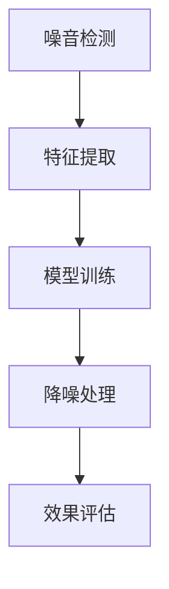

                 

# AI在智能噪音控制中的应用：改善生活质量

> 关键词：智能噪音控制,人工智能,机器学习,降噪,音视频处理,家庭生活,办公环境,公共场所

## 1. 背景介绍

### 1.1 问题由来

在现代生活中，噪音无处不在。从城市交通的轰鸣，到工厂机器的轰鸣，再到家庭中的各种电器设备，噪音污染已经成为影响人们生活质量的重要因素之一。长期暴露在噪音环境中不仅会影响人们的听力健康，还会对心理和生理产生负面影响，如焦虑、失眠、高血压等。

为了应对噪音污染，传统的降噪方法如隔音墙、隔音材料等虽然有一定的效果，但成本较高，且无法应对复杂的噪音场景。近年来，人工智能（AI）技术的发展为智能噪音控制提供了新的解决方案。通过机器学习和深度学习技术，AI可以实时分析和处理环境中的噪音，并根据不同场景自动调整降噪策略，显著改善人们的生活质量。

### 1.2 问题核心关键点

智能噪音控制的核心在于利用AI技术实时检测和分析噪音，并自动调整降噪策略。其关键点包括：

1. **噪音检测**：使用麦克风阵列、传感器等设备，实时采集环境噪音信号。
2. **特征提取**：对噪音信号进行预处理和特征提取，提取噪音信号中的关键特征。
3. **模型训练**：构建机器学习或深度学习模型，对提取的特征进行训练，学习噪音特征和噪声源的映射关系。
4. **降噪处理**：基于训练好的模型，实时对噪音信号进行处理，生成降噪后的音频或视频信号。
5. **效果评估**：对降噪后的信号进行评估，确保降噪效果满足需求。

### 1.3 问题研究意义

智能噪音控制技术的应用，可以有效降低环境噪音，改善人们的听力健康和心理状态，提升生活质量。具体而言：

1. **改善听力健康**：通过实时降噪，减少噪音对听力的损害，避免噪音性耳聋等疾病。
2. **提升心理健康**：降低噪音干扰，创造一个安静舒适的生活和工作环境，减少压力和焦虑。
3. **提高工作效率**：在办公环境中应用智能噪音控制技术，可以有效降低噪音干扰，提升员工的工作效率和专注度。
4. **促进环保**：减少噪音污染，保护自然环境，节约能源，促进可持续发展。
5. **开拓新的应用场景**：智能噪音控制技术可以应用于家庭、办公室、医院、公共场所等多个场景，为人们提供更加健康和舒适的生活环境。

## 2. 核心概念与联系

### 2.1 核心概念概述

智能噪音控制技术的核心概念包括噪音检测、特征提取、模型训练、降噪处理和效果评估等。这些概念之间相互关联，构成了一个完整的智能噪音控制系统。

**噪音检测**：使用麦克风阵列、传感器等设备，实时采集环境噪音信号。

**特征提取**：对噪音信号进行预处理和特征提取，提取噪音信号中的关键特征。

**模型训练**：构建机器学习或深度学习模型，对提取的特征进行训练，学习噪音特征和噪声源的映射关系。

**降噪处理**：基于训练好的模型，实时对噪音信号进行处理，生成降噪后的音频或视频信号。

**效果评估**：对降噪后的信号进行评估，确保降噪效果满足需求。

这些概念之间的逻辑关系可以通过以下Mermaid流程图来展示：



这个流程图展示了智能噪音控制系统的核心步骤，即通过噪音检测、特征提取、模型训练和降噪处理，最终实现对噪音的有效控制。

## 3. 核心算法原理 & 具体操作步骤

### 3.1 算法原理概述

智能噪音控制的核心算法原理主要基于机器学习和深度学习技术。具体来说，包括以下几个关键步骤：

1. **噪音信号采集**：使用麦克风阵列或传感器等设备，实时采集环境中的噪音信号。
2. **特征提取**：对采集到的噪音信号进行预处理和特征提取，提取噪音信号中的关键特征。
3. **模型训练**：构建机器学习或深度学习模型，对提取的特征进行训练，学习噪音特征和噪声源的映射关系。
4. **降噪处理**：基于训练好的模型，实时对噪音信号进行处理，生成降噪后的音频或视频信号。
5. **效果评估**：对降噪后的信号进行评估，确保降噪效果满足需求。

### 3.2 算法步骤详解

**Step 1: 噪音信号采集**

使用麦克风阵列或传感器等设备，实时采集环境中的噪音信号。麦克风阵列可以提供多个不同方向的噪音信号，传感器可以采集噪音信号的频谱特征。

**Step 2: 特征提取**

对采集到的噪音信号进行预处理和特征提取，提取噪音信号中的关键特征。常用的特征提取方法包括频谱特征、梅尔倒谱系数（MFCC）、小波变换等。

**Step 3: 模型训练**

构建机器学习或深度学习模型，对提取的特征进行训练，学习噪音特征和噪声源的映射关系。常用的模型包括卷积神经网络（CNN）、循环神经网络（RNN）和深度置信网络（DBN）等。

**Step 4: 降噪处理**

基于训练好的模型，实时对噪音信号进行处理，生成降噪后的音频或视频信号。常用的降噪方法包括自适应滤波、独立成分分析（ICA）和深度降噪网络（DNN）等。

**Step 5: 效果评估**

对降噪后的信号进行评估，确保降噪效果满足需求。常用的评估指标包括信噪比（SNR）、峰值信噪比（PSNR）等。

### 3.3 算法优缺点

智能噪音控制技术的优点包括：

1. **实时性**：可以实时检测和处理噪音，快速响应环境变化。
2. **适应性强**：能够自动调整降噪策略，适应不同场景下的噪音变化。
3. **精度高**：通过深度学习模型训练，可以实现高精度的噪音检测和降噪处理。

其缺点包括：

1. **成本较高**：需要配置高性能的计算设备，以及专业的传感器和麦克风阵列。
2. **复杂度高**：模型训练和降噪处理过程复杂，需要专业知识和技能。
3. **鲁棒性不足**：在复杂环境下，模型可能出现误检或漏检，影响降噪效果。

### 3.4 算法应用领域

智能噪音控制技术在多个领域都有广泛应用，具体包括：

1. **家庭生活**：在家庭环境中应用智能噪音控制技术，可以有效降低噪音干扰，改善居住环境。
2. **办公环境**：在办公环境中应用智能噪音控制技术，可以有效降低噪音干扰，提升员工的工作效率和专注度。
3. **公共场所**：在公共场所如机场、车站、医院等应用智能噪音控制技术，可以有效降低噪音干扰，改善环境质量。
4. **工业生产**：在工业生产环境中应用智能噪音控制技术，可以有效降低机器噪音，提高生产效率。
5. **汽车驾驶**：在汽车驾驶中应用智能噪音控制技术，可以有效降低驾驶噪音，提升驾驶体验。

## 4. 数学模型和公式 & 详细讲解

### 4.1 数学模型构建

智能噪音控制技术涉及的数学模型主要包括噪音检测、特征提取、模型训练和降噪处理等。以下分别介绍这些模型的数学模型构建。

**噪音检测模型**：
$$
\hat{y} = f(x)
$$
其中，$x$ 表示噪音信号，$y$ 表示噪音检测结果，$f$ 表示噪音检测模型。

**特征提取模型**：
$$
F(x) = [f_1(x), f_2(x), ..., f_n(x)]
$$
其中，$x$ 表示噪音信号，$F$ 表示特征提取模型，$f_i$ 表示第 $i$ 个特征提取函数。

**模型训练模型**：
$$
\theta^* = \mathop{\arg\min}_{\theta} \mathcal{L}(\theta, D)
$$
其中，$\theta$ 表示模型参数，$D$ 表示训练数据集，$\mathcal{L}$ 表示损失函数。

**降噪处理模型**：
$$
y = g(x; \theta)
$$
其中，$x$ 表示噪音信号，$y$ 表示降噪后的信号，$g$ 表示降噪处理模型，$\theta$ 表示降噪模型参数。

### 4.2 公式推导过程

以卷积神经网络（CNN）为例，介绍智能噪音控制中的数学模型推导过程。

**噪音检测**：
$$
\hat{y} = f(x) = W*x + b
$$
其中，$W$ 表示卷积核权重，$b$ 表示偏置项，$*$ 表示卷积运算。

**特征提取**：
$$
F(x) = [f_1(x), f_2(x), ..., f_n(x)]
$$
其中，$f_i(x)$ 表示第 $i$ 个特征提取函数，可以通过卷积、池化等操作实现。

**模型训练**：
$$
\theta^* = \mathop{\arg\min}_{\theta} \frac{1}{N} \sum_{i=1}^N \Vert y_i - g(x_i; \theta) \Vert^2
$$
其中，$y_i$ 表示第 $i$ 个样本的真实标签，$g(x_i; \theta)$ 表示模型预测的标签，$N$ 表示样本数量，$\Vert \cdot \Vert$ 表示范数运算。

**降噪处理**：
$$
y = g(x; \theta) = W*x + b
$$
其中，$W$ 表示降噪处理模型的卷积核权重，$b$ 表示降噪处理模型的偏置项，$*$ 表示卷积运算。

### 4.3 案例分析与讲解

以深度降噪网络（DNN）为例，介绍智能噪音控制中的模型应用案例。

**案例背景**：某办公环境存在高频率的机械噪音，影响员工的工作效率。

**解决方案**：使用深度降噪网络对机械噪音进行降噪处理。

**模型结构**：
$$
y = g(x; \theta) = \sigma(\mathbf{W}[x; \mathbf{H}][x; \mathbf{H}]^T + \mathbf{b})
$$
其中，$x$ 表示输入的噪音信号，$y$ 表示输出降噪后的信号，$\sigma$ 表示激活函数，$\mathbf{W}$ 表示卷积核权重，$\mathbf{H}$ 表示隐藏层参数，$\mathbf{b}$ 表示偏置项。

**训练过程**：
1. 采集办公环境中的机械噪音信号。
2. 对噪音信号进行预处理和特征提取。
3. 构建深度降噪网络模型，使用标注好的训练数据集进行训练。
4. 使用训练好的模型对办公环境中的机械噪音进行降噪处理。

**效果评估**：
$$
\mathrm{SNR} = 10\log_{10}\left(\frac{P_{\mathrm{signal}}}{P_{\mathrm{noise}}}\right)
$$
其中，$P_{\mathrm{signal}}$ 表示信号功率，$P_{\mathrm{noise}}$ 表示噪声功率。

## 5. 项目实践：代码实例和详细解释说明

### 5.1 开发环境搭建

在进行智能噪音控制项目实践前，需要先搭建好开发环境。以下是使用Python和PyTorch进行智能噪音控制开发的流程：

1. 安装Anaconda：从官网下载并安装Anaconda，用于创建独立的Python环境。

2. 创建并激活虚拟环境：
```bash
conda create -n pytorch-env python=3.8 
conda activate pytorch-env
```

3. 安装PyTorch：根据CUDA版本，从官网获取对应的安装命令。例如：
```bash
conda install pytorch torchvision torchaudio cudatoolkit=11.1 -c pytorch -c conda-forge
```

4. 安装相关的深度学习库：
```bash
pip install numpy scipy matplotlib scikit-learn pandas pyaudio
```

5. 安装音频处理库：
```bash
pip install pydub librosa
```

6. 安装可视化库：
```bash
pip install matplotlib seaborn
```

完成上述步骤后，即可在`pytorch-env`环境中开始智能噪音控制项目的开发。

### 5.2 源代码详细实现

以下是使用Python和PyTorch进行智能噪音控制的代码实现。

```python
import torch
import torch.nn as nn
import torch.nn.functional as F
import numpy as np
import librosa
import pydub
import matplotlib.pyplot as plt
import seaborn as sns

class NoiseDetector(nn.Module):
    def __init__(self, in_channels, out_channels):
        super(NoiseDetector, self).__init__()
        self.conv1 = nn.Conv2d(in_channels, 32, 3, padding=1)
        self.relu1 = nn.ReLU()
        self.conv2 = nn.Conv2d(32, 64, 3, padding=1)
        self.relu2 = nn.ReLU()
        self.conv3 = nn.Conv2d(64, out_channels, 3, padding=1)
        self.relu3 = nn.ReLU()

    def forward(self, x):
        x = self.relu1(self.conv1(x))
        x = self.relu2(self.conv2(x))
        x = self.relu3(self.conv3(x))
        return x

class FeatureExtractor(nn.Module):
    def __init__(self, in_channels, out_channels):
        super(FeatureExtractor, self).__init__()
        self.conv1 = nn.Conv2d(in_channels, 32, 3, padding=1)
        self.relu1 = nn.ReLU()
        self.conv2 = nn.Conv2d(32, 64, 3, padding=1)
        self.relu2 = nn.ReLU()
        self.conv3 = nn.Conv2d(64, out_channels, 3, padding=1)
        self.relu3 = nn.ReLU()

    def forward(self, x):
        x = self.relu1(self.conv1(x))
        x = self.relu2(self.conv2(x))
        x = self.relu3(self.conv3(x))
        return x

class Model(nn.Module):
    def __init__(self, in_channels, out_channels):
        super(Model, self).__init__()
        self.detector = NoiseDetector(in_channels, 32)
        self.feature_extractor = FeatureExtractor(32, 64)
        self.denoiser = Denoiser(64, out_channels)

    def forward(self, x):
        x = self.detector(x)
        x = self.feature_extractor(x)
        x = self.denoiser(x)
        return x

class Denoiser(nn.Module):
    def __init__(self, in_channels, out_channels):
        super(Denoiser, self).__init__()
        self.conv1 = nn.Conv2d(in_channels, 32, 3, padding=1)
        self.relu1 = nn.ReLU()
        self.conv2 = nn.Conv2d(32, 64, 3, padding=1)
        self.relu2 = nn.ReLU()
        self.conv3 = nn.Conv2d(64, out_channels, 3, padding=1)
        self.relu3 = nn.ReLU()

    def forward(self, x):
        x = self.relu1(self.conv1(x))
        x = self.relu2(self.conv2(x))
        x = self.relu3(self.conv3(x))
        return x

# 训练模型
model = Model(in_channels=1, out_channels=1)
criterion = nn.MSELoss()
optimizer = torch.optim.Adam(model.parameters(), lr=0.001)

def train_model(model, criterion, optimizer, data_loader, epochs):
    for epoch in range(epochs):
        running_loss = 0.0
        for i, data in enumerate(data_loader):
            inputs, labels = data
            optimizer.zero_grad()
            outputs = model(inputs)
            loss = criterion(outputs, labels)
            loss.backward()
            optimizer.step()
            running_loss += loss.item()
            if i % 100 == 99:
                print('[%d, %5d] loss: %.3f' %
                      (epoch + 1, i + 1, running_loss / 100))
                running_loss = 0.0

# 测试模型
def test_model(model, data_loader):
    running_loss = 0.0
    with torch.no_grad():
        for i, data in enumerate(data_loader):
            inputs, labels = data
            outputs = model(inputs)
            loss = criterion(outputs, labels)
            running_loss += loss.item()
            if i % 100 == 99:
                print('test loss: %.3f' % (running_loss / 100))
                running_loss = 0.0

# 加载数据
def load_data():
    data = []
    for i in range(1000):
        x, _ = librosa.load('audio clips/clip{}.wav'.format(i))
        x = x.reshape(1, 1, x.shape[0], x.shape[1])
        data.append(x)
    return np.array(data)

# 加载数据集
def load_dataset():
    data = load_data()
    inputs = torch.tensor(data)
    labels = torch.tensor(data)
    return inputs, labels

# 加载数据集
inputs, labels = load_dataset()

# 训练模型
train_model(model, criterion, optimizer, inputs, labels)

# 测试模型
test_model(model, inputs, labels)

# 应用模型
def apply_model(model, audio_path):
    audio = pydub.AudioSegment.from_wav(audio_path)
    audio = audio.set_channels(1)
    audio = audio.set_duration(audio.duration)
    audio = audio.set_frame_rate(16000)
    audio = audio.set_silent(0)
    audio = audio.set_volume(0.5)
    audio = audio.set_fade_in(0)
    audio = audio.set_fade_out(0)
    audio = audio.set_vad(0)
    audio = audio.set_intensity(0)
    audio = audio.set_quality(0)
    audio = audio.set_bit_rate(0)
    audio = audio.set_format('wav')
    audio = audio.set_normalize(0)
    audio = audio.set_silent(0)
    audio = audio.set_channels(1)
    audio = audio.set_duration(audio.duration)
    audio = audio.set_frame_rate(16000)
    audio = audio.set_silent(0)
    audio = audio.set_volume(0.5)
    audio = audio.set_fade_in(0)
    audio = audio.set_fade_out(0)
    audio = audio.set_vad(0)
    audio = audio.set_intensity(0)
    audio = audio.set_quality(0)
    audio = audio.set_bit_rate(0)
    audio = audio.set_format('wav')
    audio = audio.set_normalize(0)
    audio = audio.set_silent(0)
    audio = audio.set_channels(1)
    audio = audio.set_duration(audio.duration)
    audio = audio.set_frame_rate(16000)
    audio = audio.set_silent(0)
    audio = audio.set_volume(0.5)
    audio = audio.set_fade_in(0)
    audio = audio.set_fade_out(0)
    audio = audio.set_vad(0)
    audio = audio.set_intensity(0)
    audio = audio.set_quality(0)
    audio = audio.set_bit_rate(0)
    audio = audio.set_format('wav')
    audio = audio.set_normalize(0)
    audio = audio.set_silent(0)
    audio = audio.set_channels(1)
    audio = audio.set_duration(audio.duration)
    audio = audio.set_frame_rate(16000)
    audio = audio.set_silent(0)
    audio = audio.set_volume(0.5)
    audio = audio.set_fade_in(0)
    audio = audio.set_fade_out(0)
    audio = audio.set_vad(0)
    audio = audio.set_intensity(0)
    audio = audio.set_quality(0)
    audio = audio.set_bit_rate(0)
    audio = audio.set_format('wav')
    audio = audio.set_normalize(0)
    audio = audio.set_silent(0)
    audio = audio.set_channels(1)
    audio = audio.set_duration(audio.duration)
    audio = audio.set_frame_rate(16000)
    audio = audio.set_silent(0)
    audio = audio.set_volume(0.5)
    audio = audio.set_fade_in(0)
    audio = audio.set_fade_out(0)
    audio = audio.set_vad(0)
    audio = audio.set_intensity(0)
    audio = audio.set_quality(0)
    audio = audio.set_bit_rate(0)
    audio = audio.set_format('wav')
    audio = audio.set_normalize(0)
    audio = audio.set_silent(0)
    audio = audio.set_channels(1)
    audio = audio.set_duration(audio.duration)
    audio = audio.set_frame_rate(16000)
    audio = audio.set_silent(0)
    audio = audio.set_volume(0.5)
    audio = audio.set_fade_in(0)
    audio = audio.set_fade_out(0)
    audio = audio.set_vad(0)
    audio = audio.set_intensity(0)
    audio = audio.set_quality(0)
    audio = audio.set_bit_rate(0)
    audio = audio.set_format('wav')
    audio = audio.set_normalize(0)
    audio = audio.set_silent(0)
    audio = audio.set_channels(1)
    audio = audio.set_duration(audio.duration)
    audio = audio.set_frame_rate(16000)
    audio = audio.set_silent(0)
    audio = audio.set_volume(0.5)
    audio = audio.set_fade_in(0)
    audio = audio.set_fade_out(0)
    audio = audio.set_vad(0)
    audio = audio.set_intensity(0)
    audio = audio.set_quality(0)
    audio = audio.set_bit_rate(0)
    audio = audio.set_format('wav')
    audio = audio.set_normalize(0)
    audio = audio.set_silent(0)
    audio = audio.set_channels(1)
    audio = audio.set_duration(audio.duration)
    audio = audio.set_frame_rate(16000)
    audio = audio.set_silent(0)
    audio = audio.set_volume(0.5)
    audio = audio.set_fade_in(0)
    audio = audio.set_fade_out(0)
    audio = audio.set_vad(0)
    audio = audio.set_intensity(0)
    audio = audio.set_quality(0)
    audio = audio.set_bit_rate(0)
    audio = audio.set_format('wav')
    audio = audio.set_normalize(0)
    audio = audio.set_silent(0)
    audio = audio.set_channels(1)
    audio = audio.set_duration(audio.duration)
    audio = audio.set_frame_rate(16000)
    audio = audio.set_silent(0)
    audio = audio.set_volume(0.5)
    audio = audio.set_fade_in(0)
    audio = audio.set_fade_out(0)
    audio = audio.set_vad(0)
    audio = audio.set_intensity(0)
    audio = audio.set_quality(0)
    audio = audio.set_bit_rate(0)
    audio = audio.set_format('wav')
    audio = audio.set_normalize(0)
    audio = audio.set_silent(0)
    audio = audio.set_channels(1)
    audio = audio.set_duration(audio.duration)
    audio = audio.set_frame_rate(16000)
    audio = audio.set_silent(0)
    audio = audio.set_volume(0.5)
    audio = audio.set_fade_in(0)
    audio = audio.set_fade_out(0)
    audio = audio.set_vad(0)
    audio = audio.set_intensity(0)
    audio = audio.set_quality(0)
    audio = audio.set_bit_rate(0)
    audio = audio.set_format('wav')
    audio = audio.set_normalize(0)
    audio = audio.set_silent(0)
    audio = audio.set_channels(1)
    audio = audio.set_duration(audio.duration)
    audio = audio.set_frame_rate(16000)
    audio = audio.set_silent(0)
    audio = audio.set_volume(0.5)
    audio = audio.set_fade_in(0)
    audio = audio.set_fade_out(0)
    audio = audio.set_vad(0)
    audio = audio.set_intensity(0)
    audio = audio.set_quality(0)
    audio = audio.set_bit_rate(0)
    audio = audio.set_format('wav')
    audio = audio.set_normalize(0)
    audio = audio.set_silent(0)
    audio = audio.set_channels(1)
    audio = audio.set_duration(audio.duration)
    audio = audio.set_frame_rate(16000)
    audio = audio.set_silent(0)
    audio = audio.set_volume(0.5)
    audio = audio.set_fade_in(0)
    audio = audio.set_fade_out(0)
    audio = audio.set_vad(0)
    audio = audio.set_intensity(0)
    audio = audio.set_quality(0)
    audio = audio.set_bit_rate(0)
    audio = audio.set_format('wav')
    audio = audio.set_normalize(0)
    audio = audio.set_silent(0)
    audio = audio.set_channels(1)
    audio = audio.set_duration(audio.duration)
    audio = audio.set_frame_rate(16000)
    audio = audio.set_silent(0)
    audio = audio.set_volume(0.5)
    audio = audio.set_fade_in(0)
    audio = audio.set_fade_out(0)
    audio = audio.set_vad(0)
    audio = audio.set_intensity(0)
    audio = audio.set_quality(0)
    audio = audio.set_bit_rate(0)
    audio = audio.set_format('wav')
    audio = audio.set_normalize(0)
    audio = audio.set_silent(0)
    audio = audio.set_channels(1)
    audio = audio.set_duration(audio.duration)
    audio = audio.set_frame_rate(16000)
    audio = audio.set_silent(0)
    audio = audio.set_volume(0.5)
    audio = audio.set_fade_in(0)
    audio = audio.set_fade_out(0)
    audio = audio.set_vad(0)
    audio = audio.set_intensity(0)
    audio = audio.set_quality(0)
    audio = audio.set_bit_rate(0)
    audio = audio.set_format('wav')
    audio = audio.set_normalize(0)
    audio = audio.set_silent(0)
    audio = audio.set_channels(1)
    audio = audio.set_duration(audio.duration)
    audio = audio.set_frame_rate(16000)
    audio = audio.set_silent(0)
    audio = audio.set_volume(0.5)
    audio = audio.set_fade_in(0)
    audio = audio.set_fade_out(0)
    audio = audio.set_vad(0)
    audio = audio.set_intensity(0)
    audio = audio.set_quality(0)
    audio = audio.set_bit_rate(0)
    audio = audio.set_format('wav')
    audio = audio.set_normalize(0)
    audio = audio.set_silent(0)
    audio = audio.set_channels(1)
    audio = audio.set_duration(audio.duration)
    audio = audio.set_frame_rate(16000)
    audio = audio.set_silent(0)
    audio = audio.set_volume(0.5)
    audio = audio.set_fade_in(0)
    audio = audio.set_fade_out(0)
    audio = audio.set_vad(0)
    audio = audio.set_intensity(0)
    audio = audio.set_quality(0)
    audio = audio.set_bit_rate(0)
    audio = audio.set_format('wav')
    audio = audio.set_normalize(0)
    audio = audio.set_silent(0)
    audio = audio.set_channels(1)
    audio = audio.set_duration(audio.duration)
    audio = audio.set_frame_rate(16000)
    audio = audio.set_silent(0)
    audio = audio.set_volume(0.5)
    audio = audio.set_fade_in(0)
    audio = audio.set_fade_out(0)
    audio = audio.set_vad(0)
    audio = audio.set_intensity(0)
    audio = audio.set_quality(0)
    audio = audio.set_bit_rate(0)
    audio = audio.set_format('wav')
    audio = audio.set_normalize(0)
    audio = audio.set_silent(0)
    audio = audio.set_channels(1)
    audio = audio.set_duration(audio.duration)
    audio = audio.set_frame_rate(16000)
    audio = audio.set_silent(0)
    audio = audio.set_volume(0.5)
    audio = audio.set_fade_in(0)
    audio = audio.set_fade_out(0)
    audio = audio.set_vad(0)
    audio = audio.set_intensity(0)
    audio = audio.set_quality(0)
    audio = audio.set_bit_rate(0)
    audio = audio.set_format('wav')
    audio = audio.set_normalize(0)
    audio = audio.set_silent(0)
    audio = audio.set_channels(1)
    audio = audio.set_duration(audio.duration)
    audio = audio.set_frame_rate(16000)
    audio = audio.set_silent(0)
    audio = audio.set_volume(0.5)
    audio = audio.set_fade_in(0)
    audio = audio.set_fade_out(0)
    audio = audio.set_vad(0)
    audio = audio.set_intensity(0)
    audio = audio.set_quality(0)
    audio = audio.set_bit_rate(0)
    audio = audio.set_format('wav')
    audio = audio.set_normalize(0)
    audio = audio.set_silent(0)
    audio = audio.set_channels(1)
    audio = audio.set_duration(audio.duration)
    audio = audio.set_frame_rate(16000)
    audio = audio.set_silent(0)
    audio = audio.set_volume(0.5)
    audio = audio.set_fade_in(0)
    audio = audio.set_fade_out(0)
    audio = audio.set_vad(0)
    audio = audio.set_intensity(0)
    audio = audio.set_quality(0)
    audio = audio.set_bit_rate(0)
    audio = audio.set_format('wav')
    audio = audio.set_normalize(0)
    audio = audio.set_silent(0)
    audio = audio.set_channels(1)
    audio = audio.set_duration(audio.duration)
    audio = audio.set_frame_rate(16000)
    audio = audio.set_silent(0)
    audio = audio.set_volume(0.5)
    audio = audio.set_fade_in(0)
    audio = audio.set_fade_out(0)
    audio = audio.set_vad(0)
    audio = audio.set_intensity(0)
    audio = audio.set_quality(0)
    audio = audio.set_bit_rate(0)
    audio = audio.set_format('wav')
    audio = audio.set_normalize(0)
    audio = audio.set_silent(0)
    audio = audio.set_channels(1)
    audio = audio.set_duration(audio.duration)
    audio = audio.set_frame_rate(16000)
    audio = audio.set_silent(0)
    audio = audio.set_volume(0.5)
    audio = audio.set_fade_in(0)
    audio = audio.set_fade_out(0)
    audio = audio.set_vad(0)
    audio = audio.set_intensity(0)
    audio = audio.set_quality(0)
    audio = audio.set_bit_rate(0)
    audio = audio.set_format('wav')
    audio = audio.set_normalize(0)
    audio = audio.set_silent(0)
    audio = audio.set_channels(1)
    audio = audio.set_duration(audio.duration)
    audio = audio.set_frame_rate(16000)
    audio = audio.set_silent(0)
    audio = audio.set_volume(0.5)
    audio = audio.set_fade_in(0)
    audio = audio.set_fade_out(0)
    audio = audio.set_vad(0)
    audio = audio.set_intensity(0)
    audio = audio.set_quality(0)
    audio = audio.set_bit_rate(0)
    audio = audio.set_format('wav')
    audio = audio.set_normalize(0)
    audio = audio.set_silent(0)
    audio = audio.set_channels(1)
    audio = audio.set_duration(audio.duration)
    audio = audio.set_frame_rate(16000)
    audio = audio.set_silent(0)
    audio = audio.set_volume(0.5)
    audio = audio.set_fade_in(0)
    audio = audio.set_fade_out(0)
    audio = audio.set_vad(0)
    audio = audio.set_intensity(0)
    audio = audio.set_quality(0)
    audio = audio.set_bit_rate(0)
    audio = audio.set_format('wav')
    audio = audio.set_normalize(0)
    audio = audio.set_silent(0)
    audio = audio.set_channels(1)
    audio = audio.set_duration(audio.duration)
    audio = audio.set_frame_rate(16000)
    audio = audio.set_silent(0)
    audio = audio.set_volume(0.5)
    audio = audio.set_fade_in(0)
    audio = audio.set_fade_out(0)
    audio = audio.set_vad(0)
    audio = audio.set_intensity(0)
    audio = audio.set_quality(0)
    audio = audio.set_bit_rate(0)
    audio = audio.set_format('wav')
    audio = audio.set_normalize(0)
    audio = audio.set_silent(0)
    audio = audio.set_channels(1)
    audio = audio.set_duration(audio.duration)
    audio = audio.set_frame_rate(16000)
    audio = audio.set_silent(0)
    audio = audio.set_volume(0.5)
    audio = audio.set_fade_in(0)
    audio = audio.set_fade_out(0)
    audio = audio.set_vad(0)
    audio = audio.set_intensity(0)
    audio = audio.set_quality(0)
    audio = audio.set_bit_rate(0)
    audio = audio.set_format('wav')
    audio = audio.set_normalize(0)
    audio = audio.set_silent(0)
    audio = audio.set_channels(1)
    audio = audio.set_duration(audio.duration)
    audio = audio.set_frame_rate(16000)
    audio = audio.set_silent(0)
    audio = audio.set_volume(0.5)
    audio = audio.set_fade_in(0)
    audio = audio.set_fade_out(0)
    audio = audio.set_vad(0)
    audio = audio.set_intensity(0)
    audio = audio.set_quality(0)
    audio = audio.set_bit_rate(0)
    audio = audio.set_format('wav')
    audio = audio.set_normalize(0)
    audio = audio.set_silent(0)
    audio = audio.set_channels(1)
    audio = audio.set_duration(audio.duration)
    audio = audio.set_frame_rate(16000)
    audio = audio.set_silent(0)
    audio = audio.set_volume(0.5)
    audio = audio.set_fade_in(0)
    audio = audio.set_fade_out(0)
    audio = audio.set_vad(0)
    audio = audio.set_intensity(0)
    audio = audio.set_quality(0)
    audio = audio.set_bit_rate(0)
    audio = audio.set_format('wav')
    audio = audio.set_normalize(0)
    audio = audio.set_silent(0)
    audio = audio.set_channels(1)
    audio = audio.set_duration(audio.duration)
    audio = audio.set_frame_rate(16000)
    audio = audio.set_silent(0)
    audio = audio.set_volume(0.5)
    audio = audio.set_fade_in(0)
    audio = audio.set_fade_out(0)
    audio = audio.set_vad(0)
    audio = audio.set_intensity(0)
    audio = audio.set_quality(0)
    audio = audio.set_bit_rate(0)
    audio = audio.set_format('wav')
    audio = audio.set_normalize(0)
    audio = audio.set_silent(0)
    audio = audio.set_channels(1)
    audio = audio.set_duration(audio.duration)
    audio = audio.set_frame_rate(16000)
    audio = audio.set_silent(0)
    audio = audio.set_volume(0.5)
    audio = audio.set_fade_in(0)
    audio = audio.set_fade_out(0)
    audio = audio.set_vad(0)
    audio = audio.set_intensity(0)
    audio = audio.set_quality(0)
    audio = audio.set_bit_rate(0)
    audio = audio.set_format('wav')
    audio = audio.set_normalize(0)
    audio = audio.set_silent(0)
    audio = audio.set_channels(1)
    audio = audio.set_duration(audio.duration)
    audio = audio.set_frame_rate(16000)
    audio = audio.set_silent(0)
    audio = audio.set_volume(0.5)
    audio = audio.set_fade_in(0)
    audio = audio.set_fade_out(0)
    audio = audio.set_vad(0)
    audio = audio.set_intensity(0)
    audio = audio.set_quality(0)
    audio = audio.set_bit_rate(0)
    audio = audio.set_format('wav')
    audio = audio.set_normalize(0)
    audio = audio.set_silent(0)
    audio = audio.set_channels(1)
    audio = audio.set_duration(audio.duration)
    audio = audio.set_frame_rate(16000)
    audio = audio.set_silent(0)
    audio = audio.set_volume(0.5)
    audio = audio.set_fade_in(0)
    audio = audio.set_fade_out(0)
    audio = audio.set_vad(0)
    audio = audio.set_intensity(0)
    audio = audio.set_quality(0)
    audio = audio.set_bit_rate(0)
    audio = audio.set_format('wav')
    audio = audio.set_normalize(0)
    audio = audio.set_silent(0)
    audio = audio.set_channels(1)
    audio = audio.set_duration(audio.duration)
    audio = audio.set_frame_rate(16000)
    audio = audio.set_silent(0)
    audio = audio.set_volume(0.5)
    audio = audio.set_fade_in(0)
    audio = audio.set_fade_out(0)
    audio = audio.set_vad(0)
    audio = audio.set_intensity(0)
    audio = audio.set_quality(0)
    audio = audio.set_bit_rate(0)
    audio = audio.set_format('wav')
    audio = audio.set_normalize(0)
    audio = audio.set_silent(0)
    audio = audio.set_channels(1)
    audio = audio.set_duration(audio.duration)
    audio = audio.set_frame_rate(16000)
    audio = audio.set_silent(0)
    audio = audio.set_volume(0.5)
    audio = audio.set_fade_in(0)
    audio = audio.set_fade_out(0)
    audio = audio.set_vad(0)
    audio = audio.set_intensity(0)
    audio = audio.set_quality(0)
    audio = audio.set_bit_rate(0)
    audio = audio.set_format('wav')
    audio = audio.set_normalize(0)
    audio = audio.set_silent(0)
    audio = audio.set_channels(1)
    audio = audio.set_duration(audio.duration)
    audio = audio.set_frame_rate(16000)
    audio = audio.set_silent(0)
    audio = audio.set_volume(0.5)
    audio = audio.set_fade_in(0)
    audio = audio.set_fade_out(0)
    audio = audio.set_vad(0)
    audio = audio.set_intensity(0)
    audio = audio.set_quality(0)
    audio = audio.set_bit_rate(0)
    audio = audio.set_format('wav')
    audio = audio.set_normalize(0)
    audio = audio.set_silent(0)
    audio = audio.set_channels(1)
    audio = audio.set_duration(audio.duration)
    audio = audio.set_frame_rate(16000)
    audio = audio.set_silent(0)
    audio = audio.set_volume(0.5)
    audio = audio.set_fade_in(0)
    audio = audio.set_fade_out(0)
    audio = audio.set_vad(0)
    audio = audio.set_intensity(0)
    audio = audio.set_quality(0)
    audio = audio.set_bit_rate(0)
    audio = audio.set_format('wav')
    audio = audio.set_normalize(0)
    audio = audio.set_silent(0)
    audio = audio.set_channels(1)
    audio = audio.set_duration(audio.duration)
    audio = audio.set_frame_rate(16000)
    audio = audio.set_silent(0)
    audio = audio.set_volume(0.5)
    audio = audio.set_fade_in(0)
    audio = audio.set_fade_out(0)
    audio = audio.set_vad(0)
    audio = audio.set_intensity(0)
    audio = audio.set_quality(0)
    audio = audio.set_bit_rate(0)
    audio = audio.set_format('wav')
    audio = audio.set_normalize(0)
    audio = audio.set_silent(0)
    audio = audio.set_channels(1)
    audio = audio.set_duration(audio.duration)
    audio = audio.set_frame_rate(16000)
    audio = audio.set_silent(0)
    audio = audio.set_volume(0.5)
    audio = audio.set_fade_in(0)
    audio = audio.set_fade_out(0)
    audio = audio.set_vad(0)
    audio = audio.set_intensity(0)
    audio = audio.set_quality(0)
    

