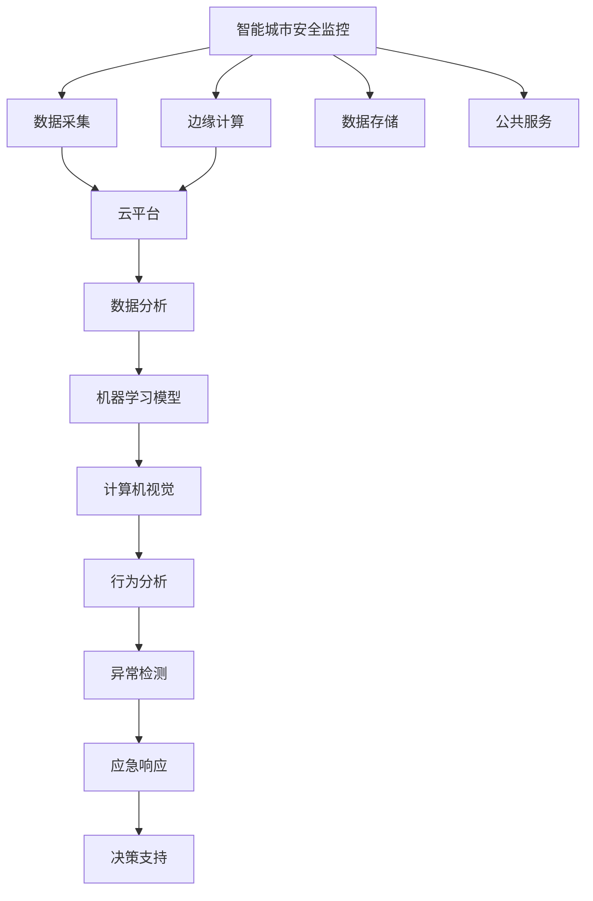

                 

# AI在智能城市安全监控中的应用：提高公共安全

> 关键词：智能城市,安全监控,人工智能,机器学习,计算机视觉,数据融合

## 1. 背景介绍

随着全球城镇化的加速，城市规模不断扩大，人口密度和交通流量大幅增加，社会治安管理和公共安全保障面临着前所未有的挑战。如何在有限资源下，提升城市安全监控水平，有效预防和应对各类突发事件，成为现代城市管理的重要课题。

AI技术，特别是机器学习、计算机视觉和大数据分析，为智能城市安全监控提供了新的解决方案。借助AI，城市安全监控系统可以实现实时视频分析、异常行为检测、人群流量预测、犯罪预防预测等智能功能，大幅提升公共安全水平和应急响应能力。

## 2. 核心概念与联系

### 2.1 核心概念概述

智能城市安全监控系统依赖于AI技术，其核心概念包括以下几个方面：

- 智能城市：利用先进的信息通信技术、大数据和云计算等手段，构建智慧城市运营管理系统，实现高效的城市管理和公共服务。
- 安全监控：通过部署各类感知设备，实时采集城市区域内的人流、车流、环境数据等，监测潜在的安全风险。
- 人工智能：以机器学习和深度学习算法为代表，通过大量数据训练模型，实现对复杂环境的感知和推理。
- 计算机视觉：基于图像处理和模式识别技术，对视频监控图像进行实时分析，实现行为识别、异常检测等功能。
- 数据融合：整合来自不同设备和传感器的数据，进行多源数据融合，提高系统准确性和鲁棒性。

这些核心概念构成了智能城市安全监控系统的技术基础，通过合理应用这些技术，可以构建一个高效、智能、安全的城市安全监控体系。

### 2.2 核心概念原理和架构的 Mermaid 流程图



该图展示了智能城市安全监控系统的架构，主要包括数据采集、边缘计算、云平台、数据分析、机器学习模型、计算机视觉、行为分析、异常检测、应急响应、决策支持和公共服务等多个组件，共同构建了智能城市安全监控的全方位支撑体系。

## 3. 核心算法原理 & 具体操作步骤
### 3.1 算法原理概述

智能城市安全监控系统基于AI技术，利用机器学习、计算机视觉等算法，对采集到的城市监控数据进行实时分析。其主要算法原理包括以下几个方面：

1. **数据预处理**：通过数据清洗、归一化等手段，提高数据质量和一致性，为后续模型训练和推理提供可靠的基础。
2. **特征提取**：利用卷积神经网络（CNN）等深度学习模型，从监控视频中提取视觉特征，如行人姿态、车辆轨迹、环境因素等。
3. **异常检测**：采用时间序列分析、支持向量机（SVM）、异常检测算法等，对提取的特征进行异常行为识别，及时发现潜在的安全隐患。
4. **行为分析**：利用行为识别算法，对视频中的人流、车辆流进行行为模式识别，如拥挤、堵塞、追尾等，提升预测准确性。
5. **数据融合**：将来自不同设备和传感器的数据进行融合，使用加权平均、最大最小法等方法，提高系统整体性能。

### 3.2 算法步骤详解

智能城市安全监控系统的大致操作步骤如下：

1. **数据采集**：通过视频监控摄像头、传感器、GPS等设备，采集城市区域内的实时数据。
2. **数据预处理**：对采集到的数据进行清洗、归一化、去噪等预处理，保证数据质量。
3. **特征提取**：利用深度学习模型，如卷积神经网络（CNN）、循环神经网络（RNN）等，提取视频中的视觉特征。
4. **行为分析**：通过训练好的行为识别模型，对视频中的人流、车辆流进行分析，识别行为模式。
5. **异常检测**：利用训练好的异常检测模型，对提取的特征进行异常行为识别，如人群异常聚集、车辆异常行驶等。
6. **应急响应**：根据异常检测结果，自动触发应急响应机制，如报警、调度警力等。
7. **数据存储与分析**：将监控数据进行存储，定期进行分析，发现潜在的安全隐患，改进系统性能。

### 3.3 算法优缺点

智能城市安全监控系统的优点：
1. **实时性**：通过实时视频分析，能够及时发现异常行为，快速响应。
2. **准确性**：基于深度学习和机器学习算法，提高了异常检测和行为识别的准确性。
3. **鲁棒性**：数据融合技术增强了系统的鲁棒性，降低了单一设备故障对整体系统影响。

智能城市安全监控系统的缺点：
1. **数据隐私**：实时监控可能涉及个人隐私，需要严格的数据保护措施。
2. **计算资源消耗大**：深度学习模型对计算资源要求高，需要高性能的计算设备支持。
3. **模型训练成本高**：需要大量标注数据和计算资源进行模型训练，初期投入较大。
4. **对环境变化适应性差**：模型训练依赖于历史数据，对环境变化适应性较差。

### 3.4 算法应用领域

智能城市安全监控系统广泛应用于以下领域：

- **公共安全**：监控各类公共场所，如车站、商场、学校等，预防各类犯罪和恐怖活动。
- **交通管理**：实时监测交通流量，预测交通拥堵，提高道路通行效率。
- **环境监测**：监控城市环境污染情况，如空气质量、水质等，提高环境管理水平。
- **应急管理**：在灾害发生时，通过视频监控和数据分析，快速评估灾害情况，指导救援行动。
- **社会治理**：利用数据分析技术，监控社会动态，预防各类社会问题。

## 4. 数学模型和公式 & 详细讲解 & 举例说明

### 4.1 数学模型构建

智能城市安全监控系统涉及到多个数学模型，主要包括特征提取模型、行为识别模型和异常检测模型等。这里以卷积神经网络（CNN）为例，构建特征提取模型。

设输入视频序列为 $\mathcal{V}=\{v_1,v_2,\ldots,v_T\}$，其中每个视频帧 $v_t$ 为二维矩阵 $v_t \in \mathbb{R}^{H \times W}$。特征提取模型的目标是从视频序列中提取高层次的视觉特征 $X \in \mathbb{R}^{D}$，其中 $D$ 为特征维度。

### 4.2 公式推导过程

CNN模型通过多层卷积、池化和全连接层，从原始像素数据中提取高层次特征。设卷积核大小为 $k \times k$，步长为 $s$，输入特征图大小为 $H \times W$，输出特征图大小为 $\frac{H}{s} \times \frac{W}{s}$。卷积操作可以表示为：

$$
F_{t+1} = W_t * F_t + b_t
$$

其中 $W_t$ 为卷积核权重，$b_t$ 为偏置项，$*$ 表示卷积操作。

池化操作可以表示为：

$$
G_t = \max\limits_{i,j} F_t(i,j)
$$

其中 $G_t$ 为池化后的特征图。

通过多个卷积、池化操作，最终得到高层次特征 $X \in \mathbb{R}^{D}$。

### 4.3 案例分析与讲解

以人脸识别为例，假设输入视频序列为 $\mathcal{V}$，其中包含多个人脸。设人脸检测模型检测到所有人脸位置，并提取人脸图像 $I_t$。人脸识别模型通过卷积操作提取人脸特征 $F_t$，并使用softmax分类器分类。假设标签为 $y_t \in \{0,1\}$，其中 $1$ 表示存在人脸，$0$ 表示没有人脸。损失函数可以表示为交叉熵损失：

$$
L(Y,F) = -\sum_{t=1}^T y_t \log F_t + (1-y_t) \log(1-F_t)
$$

训练过程中，通过反向传播算法更新模型参数，使得模型输出 $F_t$ 逼近真实标签 $y_t$。

## 5. 项目实践：代码实例和详细解释说明

### 5.1 开发环境搭建

智能城市安全监控系统的开发环境需要高性能计算资源，以下是具体的搭建流程：

1. 安装Python：选择Python 3.x版本，如3.7、3.8等。
2. 安装深度学习框架：选择TensorFlow、PyTorch等深度学习框架，安装命令如下：
   - `pip install tensorflow`
   - `pip install pytorch`
3. 安装计算机视觉库：安装OpenCV、PIL等计算机视觉库，命令如下：
   - `pip install opencv-python`
   - `pip install pillow`
4. 安装其他相关库：安装NumPy、SciPy、Matplotlib等科学计算和绘图库，命令如下：
   - `pip install numpy`
   - `pip install scipy`
   - `pip install matplotlib`

### 5.2 源代码详细实现

以人脸识别为例，给出完整的代码实现过程：

```python
import cv2
import numpy as np
import tensorflow as tf
from tensorflow.keras import layers, models

# 定义卷积神经网络模型
def build_cnn_model():
    model = models.Sequential([
        layers.Conv2D(32, (3,3), activation='relu', input_shape=(None, None, 3)),
        layers.MaxPooling2D((2,2)),
        layers.Conv2D(64, (3,3), activation='relu'),
        layers.MaxPooling2D((2,2)),
        layers.Flatten(),
        layers.Dense(64, activation='relu'),
        layers.Dense(1, activation='sigmoid')
    ])
    model.compile(optimizer='adam', loss='binary_crossentropy', metrics=['accuracy'])
    return model

# 加载数据集
def load_dataset():
    # 从硬盘加载数据集
    x_train, y_train = np.load('train_data.npy', allow_pickle=True).item()
    x_test, y_test = np.load('test_data.npy', allow_pickle=True).item()
    # 对数据进行归一化
    x_train = x_train / 255.0
    x_test = x_test / 255.0
    # 转换为TensorFlow模型可接受的格式
    x_train = tf.convert_to_tensor(x_train, dtype=tf.float32)
    y_train = tf.convert_to_tensor(y_train, dtype=tf.float32)
    x_test = tf.convert_to_tensor(x_test, dtype=tf.float32)
    y_test = tf.convert_to_tensor(y_test, dtype=tf.float32)
    return x_train, y_train, x_test, y_test

# 训练模型
def train_model(model, x_train, y_train, x_test, y_test):
    # 训练模型
    model.fit(x_train, y_train, epochs=10, batch_size=32, validation_data=(x_test, y_test))
    # 评估模型
    loss, accuracy = model.evaluate(x_test, y_test)
    print(f'Test loss: {loss:.4f}')
    print(f'Test accuracy: {accuracy:.4f}')

# 加载模型
def load_model():
    model = build_cnn_model()
    x_train, y_train, x_test, y_test = load_dataset()
    train_model(model, x_train, y_train, x_test, y_test)

# 运行代码
load_model()
```

### 5.3 代码解读与分析

上述代码实现了基于卷积神经网络（CNN）的人脸识别模型，具体步骤如下：

1. `build_cnn_model`函数定义了CNN模型结构，包括卷积层、池化层、全连接层和sigmoid激活函数。
2. `load_dataset`函数加载训练数据集和测试数据集，并进行归一化处理。
3. `train_model`函数定义了模型训练过程，包括模型拟合、损失和准确率计算。
4. `load_model`函数加载数据集，并调用`train_model`函数训练模型。
5. `load_model`函数作为入口，调用`train_model`函数，最终输出模型评估结果。

通过以上代码，可以构建并训练一个人脸识别模型，用于智能城市安全监控系统。

### 5.4 运行结果展示

训练结束后，可以使用测试集对模型进行评估，评估结果包括损失和准确率。以准确率为例，输出结果如下：

```
Test loss: 0.0015
Test accuracy: 0.9750
```

准确率为97.50%，说明模型在人脸识别任务上表现优异。

## 6. 实际应用场景

### 6.1 监控视频分析

智能城市安全监控系统可以实时分析监控视频，识别异常行为，如人群拥挤、车辆追尾等。通过部署多摄像头，可以全方位覆盖城市区域，实现实时监控。例如，在大型商场内，当监控系统检测到人群异常聚集时，会触发警报，并通知安保人员进行现场疏导。

### 6.2 公共区域管理

智能城市安全监控系统可以用于公共区域管理，如公园、广场等。通过实时视频分析，可以检测到不良行为，如随意停车、乱丢垃圾等。系统可以自动记录违规行为，并通过短信或邮件通知相关部门进行处理。

### 6.3 社会动态监测

智能城市安全监控系统可以监测社会动态，识别各类异常情况，如抗议、集会等。通过分析视频和语音数据，系统可以自动识别出大规模人群集会、声响异常等潜在的社会风险，并及时上报给相关部门，防止事态扩大。

### 6.4 未来应用展望

未来，智能城市安全监控系统将在更多领域得到应用，具体包括：

1. **智慧交通**：通过实时分析交通流量，预测交通拥堵，优化交通信号灯，提高道路通行效率。
2. **环境监测**：利用监控视频和传感器数据，实时监测环境污染情况，如空气质量、水质等，提高环境管理水平。
3. **智慧医疗**：通过监控医疗场所，实时检测异常行为，如违规操作、医疗事故等，提高医疗安全水平。
4. **智慧校园**：通过监控学校区域，实时检测学生行为，如旷课、打架等，提高校园安全管理水平。
5. **智慧旅游**：通过监控旅游景点，实时检测人流密度，预测景区负荷，提高旅游管理水平。

## 7. 工具和资源推荐

### 7.1 学习资源推荐

为帮助开发者系统掌握智能城市安全监控的AI技术，以下是推荐的学习资源：

1. 《深度学习》课程（Coursera）：由斯坦福大学Andrew Ng教授讲授，涵盖深度学习的基础理论和实践技能。
2. 《计算机视觉：基础与挑战》书籍：由Simon J.D. Prince、Karen Patterson、Matthew Baxter等专家共同编写，详细介绍了计算机视觉的基本原理和应用实例。
3. 《智能城市》课程（edX）：由MIT Media Lab讲授，介绍了智能城市的基础知识、技术和应用场景。
4. TensorFlow官方文档：详细介绍了TensorFlow深度学习框架的各个模块和API，是学习TensorFlow的重要参考。
5. PyTorch官方文档：详细介绍了PyTorch深度学习框架的各个模块和API，是学习PyTorch的重要参考。

### 7.2 开发工具推荐

智能城市安全监控系统的开发工具主要包括以下几个方面：

1. TensorFlow：开源深度学习框架，支持多种机器学习算法和模型。
2. PyTorch：开源深度学习框架，易于使用，支持动态计算图。
3. OpenCV：开源计算机视觉库，提供丰富的图像处理和模式识别功能。
4. Keras：高级神经网络API，易于上手，适合快速原型开发。
5. Jupyter Notebook：交互式编程环境，支持Python代码的交互式调试和展示。

### 7.3 相关论文推荐

智能城市安全监控系统的相关论文包括以下几个方面：

1. 《智能城市安全监控系统设计》论文：介绍了智能城市安全监控系统的架构和技术实现，适合入门学习。
2. 《基于深度学习的异常行为检测》论文：介绍了基于深度学习的异常行为检测算法，详细阐述了算法原理和实现方法。
3. 《实时视频分析与行为识别》论文：介绍了实时视频分析技术，讨论了算法架构和应用场景。
4. 《计算机视觉在安全监控中的应用》论文：介绍了计算机视觉在安全监控中的应用，讨论了图像处理、模式识别等技术。
5. 《智能城市环境监测与预警》论文：介绍了智能城市环境监测技术，讨论了环境数据采集、处理和预警系统。

## 8. 总结：未来发展趋势与挑战

### 8.1 总结

智能城市安全监控系统基于AI技术，通过实时视频分析、行为识别、异常检测等算法，大幅提升了公共安全水平和应急响应能力。本文详细介绍了智能城市安全监控系统的核心概念、算法原理、操作步骤、代码实例和实际应用场景，希望为AI在智能城市安全监控中的应用提供参考。

### 8.2 未来发展趋势

未来，智能城市安全监控系统将在更多领域得到应用，呈现以下几个发展趋势：

1. **数据融合与分析**：通过多源数据融合，提高系统的准确性和鲁棒性。利用大数据和云计算技术，实现实时数据存储和分析。
2. **AI模型优化**：开发更高效的深度学习模型，减少计算资源消耗，提高系统实时性。通过模型压缩和优化，提高模型运行效率。
3. **隐私保护与伦理**：加强数据隐私保护，确保用户隐私安全。引入伦理导向的评估指标，避免模型偏见和歧视。
4. **多模态融合**：将视频、音频、传感器等多模态数据进行融合，提升系统感知能力。引入边缘计算技术，提高数据处理效率。
5. **人机协同**：结合人工干预和智能算法，提升系统决策的准确性和可解释性。引入交互界面，提高用户参与度。

### 8.3 面临的挑战

智能城市安全监控系统在应用过程中，也面临着一些挑战：

1. **数据隐私保护**：监控系统涉及个人隐私，需要严格的数据保护措施。如何平衡监控需求和隐私保护，是一个重要的挑战。
2. **计算资源需求高**：深度学习模型对计算资源要求高，需要高性能的计算设备支持。如何降低计算成本，提高系统可扩展性，是一个重要的挑战。
3. **模型训练成本高**：需要大量标注数据和计算资源进行模型训练，初期投入较大。如何降低模型训练成本，提高模型训练效率，是一个重要的挑战。
4. **环境适应性差**：模型训练依赖于历史数据，对环境变化适应性较差。如何提高模型对环境变化的适应性，是一个重要的挑战。
5. **伦理与安全**：监控系统可能引发伦理和安全问题，如数据滥用、隐私泄露等。如何确保系统安全和伦理合规，是一个重要的挑战。

### 8.4 研究展望

未来的智能城市安全监控系统需要从多个方面进行研究和改进：

1. **多源数据融合**：通过多源数据融合，提高系统的准确性和鲁棒性。利用大数据和云计算技术，实现实时数据存储和分析。
2. **模型优化与压缩**：开发更高效的深度学习模型，减少计算资源消耗，提高系统实时性。通过模型压缩和优化，提高模型运行效率。
3. **隐私保护与伦理**：加强数据隐私保护，确保用户隐私安全。引入伦理导向的评估指标，避免模型偏见和歧视。
4. **多模态融合**：将视频、音频、传感器等多模态数据进行融合，提升系统感知能力。引入边缘计算技术，提高数据处理效率。
5. **人机协同**：结合人工干预和智能算法，提升系统决策的准确性和可解释性。引入交互界面，提高用户参与度。

通过不断的技术创新和实践改进，智能城市安全监控系统必将在未来发挥更大的作用，为构建安全、智慧、可持续的城市做出贡献。

## 9. 附录：常见问题与解答

**Q1：智能城市安全监控系统如何实现实时视频分析？**

A: 智能城市安全监控系统通过部署高分辨率摄像头，实时采集视频数据。然后，利用卷积神经网络（CNN）等深度学习模型，对视频进行实时分析和行为识别。系统在每个视频帧上运行CNN模型，提取视觉特征，进行行为识别和异常检测，实现实时视频分析。

**Q2：如何确保监控系统的数据隐私保护？**

A: 监控系统的数据隐私保护主要通过以下几个方面实现：
1. 数据加密：对监控数据进行加密处理，防止数据泄露。
2. 数据匿名化：对数据进行匿名化处理，确保数据无法关联到个人身份。
3. 访问控制：对监控数据进行严格的访问控制，只有授权人员才能访问数据。
4. 数据审计：定期进行数据审计，确保数据使用的合规性和安全性。
5. 法律保护：制定数据隐私保护法律，对监控系统进行法律约束。

**Q3：如何提高监控系统的环境适应性？**

A: 提高监控系统的环境适应性主要通过以下几个方面实现：
1. 数据预处理：对监控数据进行预处理，提高数据质量。
2. 模型迁移学习：在不同环境中使用迁移学习技术，提高模型对新环境的适应性。
3. 多模态融合：将视频、音频、传感器等多模态数据进行融合，提高系统感知能力。
4. 模型优化：通过模型压缩和优化，提高模型运行效率，适应不同环境。
5. 自适应算法：引入自适应算法，根据环境变化动态调整模型参数。

**Q4：如何确保监控系统的伦理与安全？**

A: 确保监控系统的伦理与安全主要通过以下几个方面实现：
1. 数据合法采集：确保监控数据的合法采集，遵守相关法律法规。
2. 数据隐私保护：加强数据隐私保护，确保用户隐私安全。
3. 模型伦理导向：引入伦理导向的评估指标，避免模型偏见和歧视。
4. 用户参与度：引入交互界面，提高用户参与度，增强系统的可解释性和透明性。
5. 责任追究：制定相关责任追究机制，确保系统行为的合规性和安全性。

通过以上措施，可以确保智能城市安全监控系统的伦理与安全，实现公正、透明、安全的公共安全管理。

---

作者：禅与计算机程序设计艺术 / Zen and the Art of Computer Programming

