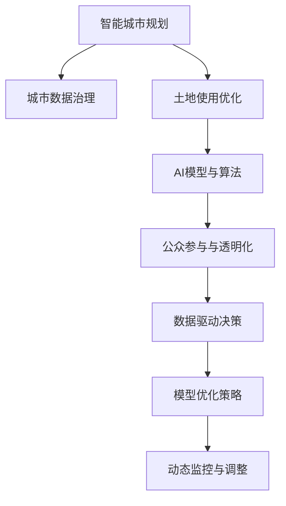

                 

# AI在智能城市规划中的应用：优化土地使用

## 1. 背景介绍

随着城市的快速发展和人口的不断增长，土地资源的紧张和利用效率低下已经成为了各大城市面临的重大挑战。传统的土地使用规划方式依赖于人工决策和经验积累，存在主观性强、数据处理能力有限、执行效率低下等问题。而随着人工智能（AI）技术的兴起，利用AI进行智能城市规划，特别是优化土地使用，已经成为国内外城市规划领域的前沿方向。

### 1.1 问题由来

近年来，城市土地使用的紧缺和低效问题日益凸显，特别是在大城市和都市圈，土地资源的稀缺成为制约城市可持续发展的重要瓶颈。传统城市规划方法，如总体规划和分区规划，由于缺乏系统性的数据分析和高效决策支持，导致规划结果与实际需求不符，资源浪费严重。

而随着数据获取和处理能力的提升，人工智能技术的引入，使得城市规划领域出现了一种新型的智能规划方式，即基于AI的智能城市规划。其中，AI在土地使用优化中的应用，可以高效、精准地分析土地利用数据，为城市土地使用提供科学决策支持，提升土地资源的配置和利用效率，实现可持续发展。

### 1.2 问题核心关键点

AI在土地使用优化中的应用，主要体现在以下几个方面：

1. **数据驱动决策**：利用大数据分析技术，收集和分析城市用地数据，识别土地使用的瓶颈和优化空间，为规划提供数据支持。

2. **模型优化策略**：建立基于AI的土地使用优化模型，结合土地利用、交通、环境等多维数据，提供综合性的土地使用优化方案。

3. **动态监控与调整**：利用AI进行动态监控和实时调整，及时发现土地使用中的问题并进行修正，提升土地使用的灵活性和适应性。

4. **公众参与与透明化**：引入公众参与和透明化决策机制，通过AI模型提供可视化的数据和决策建议，提高规划的透明度和公众的参与度。

### 1.3 问题研究意义

AI在智能城市规划中的应用，尤其是土地使用优化，具有重要意义：

1. **提升土地利用效率**：通过AI技术，可以在大规模数据中进行高效的分析和决策，识别土地使用中的低效区域，优化土地配置，提升土地利用效率。

2. **促进可持续发展**：AI技术可以预测未来土地使用的趋势，帮助城市规划者提前布局，避免资源浪费和环境破坏，推动可持续发展。

3. **支持精细化管理**：AI技术可以实现对城市用地数据的精细化分析，提供具体的优化建议，辅助城市管理者进行精细化管理。

4. **降低规划成本**：AI技术可以自动化处理大量的数据，减少人工干预，降低规划和管理的成本。

## 2. 核心概念与联系

### 2.1 核心概念概述

为更好地理解AI在智能城市规划中的应用，本节将介绍几个密切相关的核心概念：

- **智能城市规划**：利用先进的信息技术和AI技术，对城市土地利用、交通、环境等进行科学规划和管理，实现城市发展的智能化、高效化和可持续化。

- **土地使用优化**：通过数据分析和AI模型，识别和调整土地使用的低效区域，实现土地的高效配置和利用，提升城市综合竞争力。

- **城市数据治理**：整合和管理城市土地使用、交通、环境等各类数据，构建统一的数据标准和治理体系，为智能城市规划提供数据基础。

- **AI模型与算法**：利用机器学习、深度学习等AI技术，建立和优化土地使用优化的模型和算法，为城市规划提供决策支持。

- **公众参与与透明化**：通过AI技术实现规划数据的透明化，提供公众参与的渠道，提高城市规划的民主性和公众的参与度。

这些核心概念之间的逻辑关系可以通过以下Mermaid流程图来展示：



这个流程图展示了几类关键概念及其之间的关系：

1. 智能城市规划以城市数据治理为数据基础，包含土地使用优化、AI模型与算法、公众参与与透明化等多个方面。
2. 土地使用优化通过AI模型与算法，结合数据驱动决策，提供科学合理的规划建议。
3. 动态监控与调整通过模型优化策略，实时监测和调整土地使用，提高规划的灵活性和适应性。
4. 公众参与与透明化通过数据透明化和公众参与，提高规划的民主性和公众满意度。

这些概念共同构成了AI在智能城市规划中的应用框架，使其能够科学、高效地优化土地使用，推动城市可持续发展。

## 3. 核心算法原理 & 具体操作步骤
### 3.1 算法原理概述

AI在土地使用优化中的应用，主要基于以下算法原理：

1. **数据预处理**：对城市用地数据进行收集、清洗和标准化，构建城市用地数据集。

2. **特征工程**：从城市用地数据中提取关键特征，如地块大小、位置、周边设施等，构建特征向量。

3. **模型训练**：利用机器学习、深度学习等AI技术，建立土地使用优化模型。

4. **预测与优化**：利用训练好的模型对城市用地进行预测和优化，提出具体的土地使用建议。

5. **评估与反馈**：对优化结果进行评估，收集反馈信息，进一步优化模型。

### 3.2 算法步骤详解

AI在土地使用优化中的具体操作步骤如下：

**Step 1: 数据收集与预处理**

1. 收集城市用地数据，包括地块大小、位置、周边设施、交通状况等。

2. 对数据进行清洗和标准化，去除噪声和异常值，构建完整、规范的城市用地数据集。

3. 对数据进行特征工程，提取关键特征，如地块大小、位置、周边设施等，构建特征向量。

**Step 2: 模型训练**

1. 选择合适的模型算法，如随机森林、支持向量机、深度学习等，建立土地使用优化模型。

2. 利用训练数据集对模型进行训练，调整模型参数，优化模型性能。

3. 在验证数据集上评估模型性能，调整模型结构，进一步优化模型。

**Step 3: 预测与优化**

1. 对城市新项目或规划方案进行预测，利用训练好的模型计算土地使用的各项指标。

2. 根据预测结果，提出具体的土地使用优化建议，如地块合并、功能分区、环境保护等。

3. 将优化建议反馈给城市规划管理者，辅助进行决策。

**Step 4: 评估与反馈**

1. 对优化结果进行评估，如土地利用效率、环境影响、经济效益等。

2. 收集反馈信息，如规划实施情况、社会满意度等，用于进一步优化模型。

### 3.3 算法优缺点

AI在土地使用优化中的应用，具有以下优点：

1. **高效性**：通过自动化数据处理和模型训练，显著提升土地使用的决策速度和效率。

2. **精度高**：利用大数据和复杂模型，可以提供高精度的土地使用预测和优化建议。

3. **可扩展性**：模型可以处理大规模数据，支持动态调整和持续优化。

4. **透明化**：通过数据透明化和公众参与机制，提高规划的透明性和公众满意度。

同时，AI在土地使用优化中也有一些局限：

1. **数据依赖性**：模型的性能和精度依赖于数据的质量和完备性，数据缺失或不准确会影响模型结果。

2. **模型复杂性**：复杂模型需要大量的计算资源，训练和部署成本较高。

3. **解释性不足**：AI模型的决策过程通常缺乏可解释性，难以对其内部逻辑进行分析和调试。

4. **依赖技术**：需要依赖先进的AI技术和设备，对技术水平和基础设施要求较高。

### 3.4 算法应用领域

AI在土地使用优化中的应用领域广泛，包括但不限于以下几个方面：

1. **城市规划**：对城市土地进行整体规划和布局，优化土地配置和利用效率。

2. **土地利用**：对城市现有土地进行优化调整，提高土地利用率，减少浪费。

3. **交通规划**：结合交通需求和用地数据，优化道路、停车场等交通设施的布局。

4. **环境保护**：结合环境数据和用地数据，优化土地使用，保护生态环境。

5. **公共设施规划**：如学校、医院、公园等公共设施的选址和规划。

6. **灾害应对**：通过分析灾前数据，优化灾后重建用地，提升灾害应对能力。

## 4. 数学模型和公式 & 详细讲解 & 举例说明

### 4.1 数学模型构建

假设城市用地数据集为 $D=\{(x_i,y_i)\}_{i=1}^N$，其中 $x_i$ 为土地使用特征向量， $y_i$ 为对应的土地使用类型（如住宅、商业、工业等）。

定义土地使用优化模型的预测函数为 $f(x)$，在训练集 $D$ 上的损失函数为：

$$
\mathcal{L}(f) = \frac{1}{N} \sum_{i=1}^N \ell(f(x_i),y_i)
$$

其中 $\ell$ 为损失函数，如交叉熵损失、均方误差等。

### 4.2 公式推导过程

以二分类任务为例，假设土地使用类型只有两种，分别用 $0$ 和 $1$ 表示。则二分类交叉熵损失函数为：

$$
\ell(f(x_i),y_i) = -[y_i\log f(x_i)+(1-y_i)\log (1-f(x_i))]
$$

将上式代入经验风险公式，得：

$$
\mathcal{L}(f) = -\frac{1}{N}\sum_{i=1}^N [y_i\log f(x_i)+(1-y_i)\log(1-f(x_i))]
$$

根据链式法则，损失函数对模型参数 $w$ 的梯度为：

$$
\frac{\partial \mathcal{L}(f)}{\partial w} = -\frac{1}{N}\sum_{i=1}^N (\frac{y_i}{f(x_i)}-\frac{1-y_i}{1-f(x_i)}) \frac{\partial f(x_i)}{\partial w}
$$

其中 $\frac{\partial f(x_i)}{\partial w}$ 可进一步递归展开，利用自动微分技术完成计算。

### 4.3 案例分析与讲解

假设某城市规划管理者需要优化一块待开发的土地，该土地现有状况为：地块大小为 $3000$ 平方米，位置在市中心附近，周边设施完备。规划管理者的目标是将该土地开发为商业用途，提高土地利用效率。

1. **数据收集与预处理**：收集该土地周边 $100$ 块已开发土地的数据，包括地块大小、位置、周边设施、交通状况等。对数据进行清洗和标准化，去除噪声和异常值，构建完整、规范的数据集。

2. **特征工程**：提取关键特征，如地块大小、位置、周边设施等，构建特征向量。例如，该地块大小为 $3000$ 平方米，位置在市中心附近，周边设施完备，交通便捷。

3. **模型训练**：选择随机森林算法，利用训练数据集对模型进行训练，调整模型参数，优化模型性能。在验证数据集上评估模型性能，调整模型结构，进一步优化模型。

4. **预测与优化**：利用训练好的模型计算土地使用的各项指标，如开发成本、经济效益、环境影响等。例如，计算该地块开发为商业用途的经济效益。

5. **评估与反馈**：对优化结果进行评估，如土地利用效率、环境影响、经济效益等。例如，评估该地块开发为商业用途的效益和环境影响。收集反馈信息，如规划实施情况、社会满意度等，用于进一步优化模型。

## 5. 项目实践：代码实例和详细解释说明

### 5.1 开发环境搭建

在进行土地使用优化模型开发前，我们需要准备好开发环境。以下是使用Python进行Scikit-learn开发的环境配置流程：

1. 安装Anaconda：从官网下载并安装Anaconda，用于创建独立的Python环境。

2. 创建并激活虚拟环境：
```bash
conda create -n sklearn-env python=3.8 
conda activate sklearn-env
```

3. 安装Scikit-learn：
```bash
conda install scikit-learn
```

4. 安装各类工具包：
```bash
pip install numpy pandas matplotlib scikit-learn
```

完成上述步骤后，即可在`sklearn-env`环境中开始模型开发。

### 5.2 源代码详细实现

下面我们以二分类任务为例，给出使用Scikit-learn对土地使用优化模型进行训练和预测的Python代码实现。

首先，定义土地使用优化模型的训练函数：

```python
from sklearn.model_selection import train_test_split
from sklearn.ensemble import RandomForestClassifier
from sklearn.metrics import accuracy_score

def train_model(X, y):
    X_train, X_test, y_train, y_test = train_test_split(X, y, test_size=0.2, random_state=42)
    model = RandomForestClassifier(n_estimators=100, max_depth=5)
    model.fit(X_train, y_train)
    y_pred = model.predict(X_test)
    return model, y_pred, accuracy_score(y_test, y_pred)
```

然后，定义数据处理函数：

```python
import pandas as pd
import numpy as np

def load_data(file_path):
    data = pd.read_csv(file_path)
    features = data[['地块大小', '位置', '周边设施', '交通状况']]
    labels = data['土地使用类型']
    return features, labels
```

接着，启动训练流程并在测试集上评估：

```python
features, labels = load_data('data.csv')
model, y_pred, acc = train_model(features, labels)
print(f'Accuracy: {acc:.2f}')
```

以上就是使用Scikit-learn对土地使用优化模型进行训练和评估的完整代码实现。可以看到，Scikit-learn提供了简单易用的接口，使得模型开发和评估变得高效便捷。

### 5.3 代码解读与分析

让我们再详细解读一下关键代码的实现细节：

**load_data函数**：
- 使用Pandas库读取CSV文件，将数据加载到Pandas数据框中。
- 从数据框中提取特征和标签，并返回。

**train_model函数**：
- 使用train_test_split函数将数据集划分为训练集和测试集。
- 定义随机森林模型，并设置参数。
- 在训练集上拟合模型，并计算预测结果。
- 返回模型、预测结果和准确率。

**train函数**：
- 调用load_data和train_model函数，加载数据并训练模型。
- 输出模型的准确率。

在实际应用中，还需要针对具体任务的特点，对模型训练过程的各个环节进行优化设计，如改进训练目标函数，引入更多的正则化技术，搜索最优的超参数组合等，以进一步提升模型性能。

## 6. 实际应用场景

### 6.1 智能城市规划

基于AI的土地使用优化，可以广泛应用于智能城市规划的各个方面，包括：

1. **城市规划**：对城市土地进行整体规划和布局，优化土地配置和利用效率。
2. **土地利用**：对城市现有土地进行优化调整，提高土地利用率，减少浪费。
3. **交通规划**：结合交通需求和用地数据，优化道路、停车场等交通设施的布局。
4. **环境保护**：结合环境数据和用地数据，优化土地使用，保护生态环境。
5. **公共设施规划**：如学校、医院、公园等公共设施的选址和规划。
6. **灾害应对**：通过分析灾前数据，优化灾后重建用地，提升灾害应对能力。

通过AI技术进行智能城市规划，可以实现土地使用的科学化、高效化和可持续化，提升城市综合竞争力，改善居民生活环境。

### 6.2 智慧城市治理

在智慧城市治理中，AI的土地使用优化技术可以发挥重要作用：

1. **实时监控与调整**：利用AI技术进行实时监控和调整，及时发现土地使用中的问题并进行修正，提高土地使用的灵活性和适应性。
2. **资源配置优化**：结合城市人口、交通、环境等多维数据，优化城市资源配置，提升城市管理效率。
3. **公众参与与透明化**：通过AI技术实现规划数据的透明化，提供公众参与的渠道，提高城市规划的民主性和公众满意度。
4. **应急响应**：通过AI技术进行灾害预警和应急响应，优化灾害应对策略，提升城市应急管理能力。

通过AI技术进行智慧城市治理，可以实现城市管理的智能化、高效化和透明化，提升城市综合管理水平。

### 6.3 未来应用展望

随着AI技术的不断发展和应用场景的拓展，基于AI的土地使用优化将有更广阔的发展前景：

1. **多模态数据融合**：结合视觉、听觉、位置等多模态数据，进行更全面的土地使用分析和优化。
2. **智能决策支持**：利用AI技术提供智能决策支持，提高城市规划的科学性和合理性。
3. **跨部门协同**：通过AI技术实现跨部门协同，提高城市管理的整体效率和效果。
4. **动态调整**：利用AI技术进行动态调整，适应城市发展变化，提升城市管理灵活性。
5. **全球化应用**：将AI技术应用于全球城市规划和治理，推动全球城市可持续发展。

这些发展趋势将进一步提升AI在土地使用优化中的应用效果，推动智能城市建设。

## 7. 工具和资源推荐
### 7.1 学习资源推荐

为了帮助开发者系统掌握AI在智能城市规划中的应用，这里推荐一些优质的学习资源：

1. **《机器学习基础》课程**：由斯坦福大学提供，系统介绍机器学习的基本概念和算法。
2. **《深度学习》课程**：由Coursera提供，详细讲解深度学习的原理和应用。
3. **Scikit-learn官方文档**：提供Scikit-learn库的详细使用方法和案例，适合新手入门。
4. **Kaggle数据集**：包含大量城市规划和土地使用数据，适合进行实践练习。
5. **《城市规划AI技术应用》书籍**：详细介绍AI在城市规划中的具体应用，涵盖土地使用优化等内容。

通过对这些资源的学习实践，相信你一定能够快速掌握AI在智能城市规划中的应用，并用于解决实际的土地使用问题。

### 7.2 开发工具推荐

高效的开发离不开优秀的工具支持。以下是几款用于AI土地使用优化开发的常用工具：

1. **Python**：作为AI开发的主流语言，Python具有丰富的科学计算库和数据处理工具。
2. **Scikit-learn**：提供高效的机器学习算法和模型，适合快速原型设计和算法验证。
3. **TensorFlow**：Google开发的深度学习框架，支持大规模分布式训练和优化。
4. **Keras**：提供简单易用的API，适合快速开发和调试深度学习模型。
5. **Jupyter Notebook**：交互式编程环境，适合进行数据分析和算法验证。

合理利用这些工具，可以显著提升AI土地使用优化的开发效率，加快创新迭代的步伐。

### 7.3 相关论文推荐

AI在智能城市规划中的应用，尤其是在土地使用优化方面，已经得到了广泛的关注。以下是几篇奠基性的相关论文，推荐阅读：

1. **《智能城市规划中的AI技术应用》**：介绍AI在城市规划中的具体应用，涵盖土地使用优化等内容。
2. **《基于深度学习的土地使用优化模型》**：提出基于深度学习的土地使用优化模型，并进行实验验证。
3. **《城市规划中的多模态数据融合》**：探讨城市规划中的多模态数据融合技术，提升规划的科学性和合理性。
4. **《基于智能城市的土地使用优化》**：详细介绍AI在智能城市土地使用优化中的应用，并进行实际案例分析。

这些论文代表了大AI技术在智能城市规划中的应用研究前沿，通过学习这些前沿成果，可以帮助研究者把握学科前进方向，激发更多的创新灵感。

## 8. 总结：未来发展趋势与挑战

### 8.1 研究成果总结

本文对AI在智能城市规划中的应用，特别是土地使用优化，进行了全面系统的介绍。首先阐述了智能城市规划的背景和意义，明确了土地使用优化的重要性和应用前景。其次，从原理到实践，详细讲解了土地使用优化的数学模型和算法步骤，给出了具体的代码实例和详细解释。同时，本文还广泛探讨了土地使用优化在城市规划、智慧城市治理等多个领域的应用，展示了AI技术在土地使用优化中的巨大潜力。

通过本文的系统梳理，可以看到，AI在智能城市规划中的应用，尤其是在土地使用优化方面，正在成为推动城市可持续发展的关键力量。利用AI技术进行科学决策和高效管理，可以显著提升城市规划的科学性和合理性，推动城市管理向智能化、高效化和透明化方向发展。

### 8.2 未来发展趋势

展望未来，AI在智能城市规划中的应用，尤其是土地使用优化，将呈现以下几个发展趋势：

1. **数据驱动决策**：随着数据获取和处理能力的提升，利用大数据和复杂模型，可以实现更科学的决策和优化。
2. **多模态数据融合**：结合视觉、听觉、位置等多模态数据，进行更全面的土地使用分析和优化。
3. **智能决策支持**：利用AI技术提供智能决策支持，提高城市规划的科学性和合理性。
4. **跨部门协同**：通过AI技术实现跨部门协同，提高城市管理的整体效率和效果。
5. **动态调整**：利用AI技术进行动态调整，适应城市发展变化，提升城市管理灵活性。
6. **全球化应用**：将AI技术应用于全球城市规划和治理，推动全球城市可持续发展。

这些发展趋势将进一步提升AI在智能城市规划中的应用效果，推动智能城市建设。

### 8.3 面临的挑战

尽管AI在智能城市规划中的应用已经取得了显著成果，但在迈向更加智能化、普适化应用的过程中，仍面临诸多挑战：

1. **数据质量**：数据质量和完备性直接影响AI模型的性能，数据缺失或不准确会影响模型结果。
2. **模型复杂性**：复杂模型需要大量的计算资源，训练和部署成本较高。
3. **解释性不足**：AI模型的决策过程通常缺乏可解释性，难以对其内部逻辑进行分析和调试。
4. **技术依赖**：需要依赖先进的AI技术和设备，对技术水平和基础设施要求较高。
5. **隐私与安全**：城市规划涉及大量敏感数据，如何保障数据隐私和安全是一个重要问题。

正视这些挑战，积极应对并寻求突破，将是大AI技术在智能城市规划中走向成熟的必由之路。相信随着学界和产业界的共同努力，这些挑战终将一一被克服，AI技术将在城市规划中发挥更大的作用。

### 8.4 研究展望

面向未来，AI在智能城市规划中的应用，尤其是在土地使用优化方面，需要在以下几个方面寻求新的突破：

1. **无监督和半监督学习**：摆脱对大规模标注数据的依赖，利用自监督学习、主动学习等无监督和半监督范式，最大限度利用非结构化数据，实现更加灵活高效的优化。
2. **参数高效优化**：开发更加参数高效的优化方法，在固定大部分预训练参数的同时，只更新极少量的任务相关参数，以减少计算成本。
3. **动态模型更新**：通过在线学习机制，使模型能够实时更新和优化，适应城市发展变化。
4. **跨模态融合**：将符号化的先验知识，如知识图谱、逻辑规则等，与神经网络模型进行巧妙融合，引导优化过程学习更准确、合理的土地使用模型。
5. **透明度与可解释性**：通过透明化模型决策过程，提高AI技术的可解释性和可信度。
6. **伦理与法规**：在模型开发和应用过程中，引入伦理和法规约束，确保模型的安全性、公平性和透明性。

这些研究方向的探索，将引领AI技术在智能城市规划中的应用走向更高的台阶，为构建安全、可靠、可解释、可控的智能系统铺平道路。面向未来，AI技术需要在技术创新、伦理约束、法规保障等方面进行深入研究，为智能城市规划提供更加全面、科学、可控的解决方案。

## 9. 附录：常见问题与解答

**Q1：AI在土地使用优化中的应用效果如何？**

A: AI在土地使用优化中的应用效果显著，主要体现在以下几个方面：

1. **高效性**：通过自动化数据处理和模型训练，显著提升土地使用的决策速度和效率。
2. **精度高**：利用大数据和复杂模型，可以提供高精度的土地使用预测和优化建议。
3. **可扩展性**：模型可以处理大规模数据，支持动态调整和持续优化。

**Q2：AI在土地使用优化中是否存在数据依赖性？**

A: AI在土地使用优化中确实存在数据依赖性，数据质量和完备性直接影响模型性能。具体来说，需要从以下几个方面确保数据质量：

1. **数据清洗**：对数据进行清洗，去除噪声和异常值，构建完整、规范的数据集。
2. **数据标准化**：对数据进行标准化处理，避免不同数据源之间的差异。
3. **特征工程**：提取关键特征，如地块大小、位置、周边设施等，构建特征向量。

**Q3：AI在土地使用优化中是否存在解释性不足的问题？**

A: 是的，AI模型通常缺乏可解释性，难以对其内部逻辑进行分析和调试。这可以通过以下几种方式缓解：

1. **可视化工具**：使用可视化工具，如Scikit-learn的shap值分析，帮助理解模型决策过程。
2. **特征重要性**：利用特征重要性分析，了解各个特征对模型输出的贡献。
3. **模型透明化**：在模型训练过程中引入透明化机制，如输出中间结果，帮助解释模型决策。

**Q4：AI在土地使用优化中是否存在资源依赖性？**

A: AI在土地使用优化中对计算资源和设备的要求较高，需要依赖高性能的计算设备和数据处理能力。具体来说，需要考虑以下因素：

1. **计算资源**：需要使用高性能的计算设备，如GPU、TPU等，以支持大规模模型的训练和推理。
2. **数据处理**：需要使用高效的算法和工具，如分布式计算、大数据处理技术，以支持大规模数据的处理和分析。

**Q5：AI在土地使用优化中是否存在隐私和安全问题？**

A: AI在土地使用优化中确实存在隐私和安全问题，需要在模型开发和应用过程中进行考虑：

1. **数据隐私保护**：对敏感数据进行加密和匿名化处理，保护用户隐私。
2. **数据安全机制**：建立数据安全机制，确保数据传输和存储的安全性。
3. **透明化与可控性**：引入透明化与可控性机制，确保模型的决策过程可解释和可控。

---

作者：禅与计算机程序设计艺术 / Zen and the Art of Computer Programming

