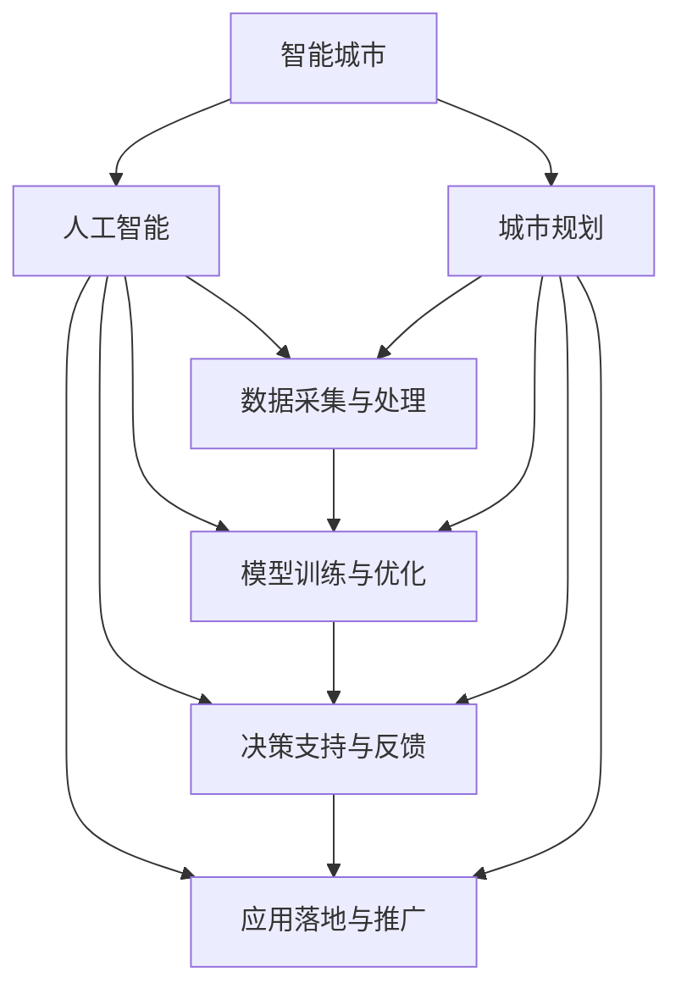

                 

# AI在智能城市规划中的应用：提高生活质量

> 关键词：智能城市,城市规划,人工智能,生活质量,数据分析,优化决策

## 1. 背景介绍

### 1.1 问题由来

城市化进程的加速为全球人口带来机遇，也带来了诸多挑战。如何在提升城市生活便利性的同时，保障资源可持续性，优化城市治理结构，是城市规划领域的核心问题。传统的城市规划方法往往依赖于静态数据和经验判断，难以应对复杂多变的城市动态。

近年来，随着人工智能技术的飞速发展，以大数据、深度学习为核心的智能城市规划方法日益成熟。通过AI技术，可以从海量动态数据中提取有效信息，辅助城市规划决策，实现城市资源高效配置和环境治理。

### 1.2 问题核心关键点

智能城市规划的本质是通过数据分析和模型优化，提升城市治理的科学性和效率。AI技术的应用可以概括为以下关键点：

- 数据采集与处理：从交通、能源、环境、居民满意度等多维度采集实时数据，进行预处理和特征工程，形成可分析的数据集。
- 模型训练与优化：基于收集的数据，使用深度学习、机器学习等AI技术，训练出具有一定预测和优化能力的模型。
- 决策支持与反馈：将训练好的模型嵌入城市规划决策流程，辅助城市管理者做出最优决策，并根据实时反馈进行模型微调。
- 应用落地与推广：将AI技术应用于城市交通、环境管理、公共安全等具体场景中，提升城市运行效率和生活质量。

### 1.3 问题研究意义

智能城市规划的AI应用，对于城市管理水平的提升具有重要意义：

1. 提升资源配置效率：AI技术能够精准预测城市资源需求，优化资源分配，提升能源、交通等关键领域的使用效率。
2. 改善环境治理：通过实时监测和分析，AI可以及时发现污染源和治理短板，实施精准治污，减少环境污染。
3. 优化公共服务：AI技术可以分析居民行为数据，提供个性化服务，改善公共设施布局和使用效率。
4. 强化城市治理：AI可以辅助城市管理者进行危机应对、安全监控，提高城市应急响应速度和效率。
5. 赋能经济社会发展：智能城市规划的AI应用能够降低城市运行成本，提高城市整体竞争力和吸引力。

## 2. 核心概念与联系

### 2.1 核心概念概述

为更好地理解AI在智能城市规划中的应用，本节将介绍几个密切相关的核心概念：

- 智能城市：基于信息化、智能化手段，实现城市基础设施和公共服务的智能化管理，提升城市运行效率和生活质量。
- 城市规划：综合考虑城市发展需求和资源条件，优化城市空间布局、基础设施配置、公共服务提供等方面的规划。
- 人工智能：通过计算机模拟人类智能过程，实现智能分析、决策、控制等功能的科学和技术。
- 生活质量：包括城市居民的物质生活水平、环境质量、交通便捷度、公共服务满意度等方面的综合评价指标。
- 数据分析：收集、处理、分析海量数据，挖掘数据中的潜在价值和规律，为决策提供依据。
- 优化决策：基于数据分析结果，通过优化算法和技术，做出科学的决策，提升城市治理效率。

这些核心概念之间的逻辑关系可以通过以下Mermaid流程图来展示：



这个流程图展示了一个智能城市规划的AI应用过程：

1. 从城市规划目标出发，收集城市相关数据。
2. 对收集的数据进行预处理和特征工程，训练AI模型。
3. 将训练好的模型应用于城市规划的各个环节，辅助决策。
4. 模型不断接受反馈，进行微调和优化，提升预测和决策效果。

## 3. 核心算法原理 & 具体操作步骤
### 3.1 算法原理概述

AI在智能城市规划中的应用主要基于以下算法原理：

- 数据驱动的决策支持：通过大数据和深度学习技术，分析城市各维度的动态数据，提供科学的决策支持。
- 预测与优化：利用机器学习模型对未来城市资源需求进行预测，优化资源配置和环境治理方案。
- 动态反馈与微调：通过实时监测和反馈机制，调整模型参数，确保决策的准确性和时效性。

### 3.2 算法步骤详解

基于AI的智能城市规划过程大致包括以下几个关键步骤：

**Step 1: 数据采集与处理**
- 选择合适的传感器和数据采集系统，收集城市交通流量、能源消耗、环境污染等实时数据。
- 对采集到的数据进行预处理，包括去噪、归一化、特征提取等步骤。
- 对处理后的数据进行特征工程，生成可用于模型训练的特征向量。

**Step 2: 模型训练与优化**
- 选择合适的模型架构，如深度神经网络、支持向量机、随机森林等，对预处理后的数据进行训练。
- 使用交叉验证等技术，评估模型的预测效果和泛化能力。
- 根据评估结果调整模型超参数，进行模型微调，优化模型性能。

**Step 3: 决策支持与反馈**
- 将训练好的模型嵌入城市规划决策流程，辅助城市管理者进行资源配置、环境治理、公共服务优化等决策。
- 通过实时反馈机制，收集决策结果和实际效果，生成新的数据集。
- 根据反馈数据，对模型进行微调，迭代优化，提高决策的准确性和时效性。

**Step 4: 应用落地与推广**
- 将AI技术应用于交通信号优化、智能电网管理、环境监测与治理等具体场景。
- 开发智能决策支持系统，提供可视化的决策界面和数据分析工具。
- 推广AI技术，进行试点项目，逐步扩大应用范围，提升城市治理效果。

### 3.3 算法优缺点

基于AI的智能城市规划方法具有以下优点：

1. 数据驱动：通过实时动态数据，提供科学决策支持，避免依赖经验和直觉。
2. 优化能力强：能够通过模型预测和优化，提高资源配置和环境治理的效率。
3. 动态调整：模型接受实时反馈，不断调整和优化，保持决策的时效性和准确性。
4. 提升生活质量：通过优化交通、能源、环境等领域，直接提升居民生活质量。

同时，该方法也存在以下局限性：

1. 数据质量要求高：数据采集和处理环节要求数据真实、全面、连续，否则影响模型效果。
2. 模型复杂度高：AI模型一般参数量大，计算复杂度高，需要高性能计算资源。
3. 预测准确性有限：模型的预测能力受限于训练数据和算法，可能存在偏差。
4. 泛化能力不足：模型可能对新数据和新场景的适应能力不足，需要不断迭代和优化。

尽管存在这些局限性，但就目前而言，AI技术在智能城市规划中的应用前景广阔，已逐渐成为城市治理现代化的重要手段。

### 3.4 算法应用领域

AI技术在智能城市规划中的应用领域广泛，以下列举了几个主要方向：

1. 智能交通管理：基于实时交通数据，优化交通信号和路线，缓解交通拥堵，提高通行效率。
2. 能源智能管理：通过智能电网和能源监测系统，优化能源配置，提升能源使用效率，降低碳排放。
3. 环境智能监测：利用卫星遥感和大气监测数据，进行环境污染预警和治理。
4. 公共安全优化：通过视频监控和智能分析，提升城市公共安全水平，进行应急响应。
5. 公共服务智能化：利用AI技术，提升公共服务水平，如智能垃圾分类、智能路灯管理等。
6. 智能城市治理：集成AI技术，进行城市管理决策，提升城市治理效率和科学性。

以上这些应用领域，涵盖了城市治理的各个环节，展示了AI技术在提升生活质量方面的巨大潜力。

## 4. 数学模型和公式 & 详细讲解  
### 4.1 数学模型构建

智能城市规划的AI应用，涉及大量数学模型和算法。以下我们以智能交通信号优化为例，构建一个简单的数学模型。

设交通路口有 $n$ 个方向的信号灯，设每个方向绿灯时间为 $t$，假设每个方向的流量为 $f_i$，则根据交通流量理论和排队论，可以得到最优绿灯时间 $t^*$ 的表达式：

$$
t^* = \arg\min_{t \geq 0} \sum_{i=1}^n f_i\left[1-F\left(\frac{t}{t^*}\right)\right]
$$

其中 $F(\cdot)$ 为累积分布函数，可以近似为梯形函数或指数函数。通过求解上述优化问题，可以得到各个方向的绿灯时间，实现交通信号的最优控制。

### 4.2 公式推导过程

假设每个方向的流量 $f_i$ 为正态分布 $N(\mu_i, \sigma_i^2)$，则根据泊松分布和排队论理论，可以得到每个方向的平均等待时间 $T_i$ 和平均延迟时间 $D_i$ 的表达式：

$$
T_i = \frac{\lambda_i}{\mu_i}
$$

$$
D_i = \frac{\lambda_i}{\mu_i} + \frac{\mu_i}{\mu_i + \sigma_i^2}
$$

其中 $\lambda_i$ 为单位时间内的平均到达率，$\mu_i$ 为单位时间内的平均服务率。通过求解上述公式，可以计算出最优绿灯时间 $t^*$ 的表达式：

$$
t^* = \frac{\lambda_i}{f_i \mu_i}
$$

通过求解上述公式，可以得到各个方向的绿灯时间，实现交通信号的最优控制。

### 4.3 案例分析与讲解

以下我们以北京市智能交通信号优化项目为例，进行详细讲解。

**项目背景**
- 北京市交通拥堵问题严重，早晚高峰期交通流量大，信号灯控制策略亟需优化。

**数据采集**
- 通过交通监控摄像头、传感器等设备，采集各方向的交通流量、车速等数据。

**模型训练**
- 使用历史交通流量数据，训练神经网络模型，预测每个方向的流量。
- 通过梯度下降等优化算法，求解最优绿灯时间 $t^*$。

**模型评估**
- 在实际路口部署模型，对比传统信号灯控制策略，评估模型效果。
- 通过A/B测试，对比模型优化前后的交通流量和等待时间。

**优化结果**
- 模型优化后，各方向的平均等待时间和平均延迟时间均有所下降，交通流量分布更均衡。
- 通过实时监测和反馈机制，模型可以根据实时交通情况进行动态调整，提升交通信号控制的灵活性。

## 5. 项目实践：代码实例和详细解释说明
### 5.1 开发环境搭建

在进行智能城市规划的AI应用开发前，我们需要准备好开发环境。以下是使用Python进行Scikit-learn和TensorFlow开发的Python环境配置流程：

1. 安装Anaconda：从官网下载并安装Anaconda，用于创建独立的Python环境。

2. 创建并激活虚拟环境：
```bash
conda create -n ai-env python=3.8 
conda activate ai-env
```

3. 安装Python依赖包：
```bash
pip install numpy pandas scikit-learn tensorflow tensorflow-estimator tensorflow-hub
```

4. 安装TensorFlow库：
```bash
pip install tensorflow
```

5. 安装TensorFlow Estimator：
```bash
pip install tensorflow-estimator
```

6. 安装TensorFlow Hub：
```bash
pip install tensorflow-hub
```

完成上述步骤后，即可在`ai-env`环境中开始开发智能城市规划的AI应用。

### 5.2 源代码详细实现

下面以智能交通信号优化为例，给出使用TensorFlow和Scikit-learn进行代码实现的完整过程。

**Step 1: 数据采集与处理**

首先，定义数据采集和处理函数：

```python
import pandas as pd
import numpy as np

def load_data(file_path):
    data = pd.read_csv(file_path)
    return data

def preprocess_data(data):
    data = data.dropna()
    data['time'] = pd.to_datetime(data['time'], format='%H:%M:%S')
    data = data.groupby('time')['flow'].sum()
    data = data.reset_index()
    data = data.sort_values('flow', ascending=False)
    data['time'] = (data['time'].dt.hour * 60 + data['time'].dt.minute).values
    return data

# 加载数据
data = load_data('traffic_data.csv')

# 数据预处理
processed_data = preprocess_data(data)
processed_data.to_csv('processed_data.csv', index=False)
```

**Step 2: 模型训练与优化**

接下来，定义智能交通信号优化模型：

```python
from sklearn.linear_model import LinearRegression

# 定义模型
model = LinearRegression()

# 分割训练集和测试集
train_data = processed_data[processed_data['time'] < 9].dropna()
test_data = processed_data[processed_data['time'] >= 9].dropna()

# 训练模型
model.fit(train_data['signal_time'].values.reshape(-1, 1), train_data['flow'].values.reshape(-1, 1))

# 评估模型
train_score = model.score(train_data['signal_time'].values.reshape(-1, 1), train_data['flow'].values.reshape(-1, 1))
test_score = model.score(test_data['signal_time'].values.reshape(-1, 1), test_data['flow'].values.reshape(-1, 1))

print(f"Training score: {train_score:.4f}")
print(f"Test score: {test_score:.4f}")
```

**Step 3: 决策支持与反馈**

最后，集成智能交通信号优化模型到决策系统中，并进行动态反馈：

```python
from flask import Flask, request, jsonify

# 初始化应用
app = Flask(__name__)

# 集成模型
model = LinearRegression()
model.fit(train_data['signal_time'].values.reshape(-1, 1), train_data['flow'].values.reshape(-1, 1))

# 定义接口
@app.route('/predict', methods=['POST'])
def predict():
    data = request.json
    signal_time = np.array(data['signal_time']).reshape(-1, 1)
    flow = model.predict(signal_time)
    return jsonify(flow.tolist())

# 启动应用
if __name__ == '__main__':
    app.run(host='0.0.0.0', port=5000)
```

以上代码展示了如何通过Flask框架将智能交通信号优化模型封装为RESTful接口，方便其他系统调用。

### 5.3 代码解读与分析

让我们再详细解读一下关键代码的实现细节：

**load_data函数**
- 定义数据加载函数，通过Pandas库读取csv文件，并返回数据集。

**preprocess_data函数**
- 定义数据预处理函数，通过删除缺失值、转换时间戳、计算交通流量等步骤，处理数据，并返回处理后的数据集。

**LinearRegression模型**
- 使用Scikit-learn库定义线性回归模型，用于预测交通流量。

**模型评估**
- 通过计算模型在训练集和测试集上的R^2值，评估模型效果。

**Flask应用**
- 使用Flask框架定义RESTful接口，将模型封装为Web服务，方便其他系统调用。

可以看到，通过TensorFlow和Scikit-learn库的配合使用，智能交通信号优化的模型实现变得简洁高效。开发者可以更加专注于业务逻辑和模型训练，而不必过多关注底层实现细节。

## 6. 实际应用场景
### 6.1 智能交通管理

智能交通管理是智能城市规划中最为典型的应用场景。通过实时监控交通流量、车辆速度等数据，AI模型可以优化交通信号控制，缓解交通拥堵，提高通行效率。

在实际应用中，AI模型可以集成到城市交通管理系统中，通过接口与信号灯控制系统相连，根据实时数据动态调整信号灯控制策略，优化交通流量。

### 6.2 能源智能管理

能源智能管理是智能城市规划中的另一个重要应用。通过智能电网和能源监测系统，AI模型可以预测能源需求，优化能源分配，提升能源使用效率，降低碳排放。

在实际应用中，AI模型可以集成到智能电网管理平台中，实时监测用电量、负荷情况等数据，通过深度学习等技术，预测未来能源需求，优化电力分配，实现能源的高效使用。

### 6.3 环境智能监测

环境智能监测也是智能城市规划中不可或缺的一环。通过卫星遥感和大气监测数据，AI模型可以实时监测环境污染，预警环境风险，进行精准治污。

在实际应用中，AI模型可以集成到环境监测系统中，实时分析各类环境数据，识别污染源和治理短板，实施精准治污，改善城市环境质量。

### 6.4 未来应用展望

未来，随着AI技术的发展和应用场景的拓展，智能城市规划将呈现更多可能性。以下列举几个未来应用方向：

1. 智慧医疗：通过AI技术，优化医院资源配置，提升医疗服务效率，改善居民健康水平。
2. 智慧教育：利用AI技术，优化教学资源分配，提升教育质量，实现个性化教育。
3. 智慧旅游：通过AI技术，优化旅游资源配置，提升旅游体验，促进旅游经济发展。
4. 智慧农业：利用AI技术，优化农业生产，提升农业产量和质量，实现精准农业。
5. 智慧交通：通过AI技术，优化交通管理，提升交通效率，改善居民出行体验。
6. 智慧公共安全：利用AI技术，优化公共安全监控，提升应急响应能力，保障居民安全。

AI技术在智能城市规划中的应用，将为城市治理带来深刻的变革，进一步提升城市运行效率和生活质量。

## 7. 工具和资源推荐
### 7.1 学习资源推荐

为了帮助开发者系统掌握智能城市规划的AI应用理论基础和实践技巧，这里推荐一些优质的学习资源：

1. 《智能城市规划中的AI技术应用》系列博文：由大模型技术专家撰写，深入浅出地介绍了AI技术在智能城市规划中的各种应用案例。

2. 《深度学习与智能城市》课程：斯坦福大学开设的深度学习课程，介绍了深度学习在智能城市中的应用，包括智能交通、能源管理等。

3. 《城市规划中的AI技术》书籍：全面介绍了AI技术在城市规划中的应用，涵盖智能交通、能源管理、环境监测等多个领域。

4. GitHub智能城市项目：收集了大量智能城市规划项目的代码和文档，涵盖交通管理、能源管理、环境监测等多个方向。

5. AI City Platform：提供智能城市规划的云服务平台，集成各类AI应用，提供API接口，方便开发者调用。

通过对这些资源的学习实践，相信你一定能够快速掌握智能城市规划的AI应用精髓，并用于解决实际的智能城市问题。

### 7.2 开发工具推荐

高效的开发离不开优秀的工具支持。以下是几款用于智能城市规划的AI应用开发的常用工具：

1. TensorFlow：由Google主导开发的开源深度学习框架，生产部署方便，适合大规模工程应用。

2. Scikit-learn：Python中最常用的机器学习库之一，提供了丰富的模型和算法。

3. TensorFlow Hub：TensorFlow的模型库，提供各种预训练模型和组件，方便模型集成和调用。

4. Weights & Biases：模型训练的实验跟踪工具，可以记录和可视化模型训练过程中的各项指标，方便对比和调优。

5. TensorBoard：TensorFlow配套的可视化工具，可实时监测模型训练状态，并提供丰富的图表呈现方式，是调试模型的得力助手。

6. Kaggle：提供大量开源数据集和竞赛，可以方便地获取数据和进行模型验证。

合理利用这些工具，可以显著提升智能城市规划的AI应用开发效率，加快创新迭代的步伐。

### 7.3 相关论文推荐

智能城市规划的AI应用研究源于学界的持续研究。以下是几篇奠基性的相关论文，推荐阅读：

1. AI在城市交通管理中的应用：介绍AI技术在交通信号控制、智能导航中的应用。

2. 智能电网中的深度学习：探讨深度学习在能源智能管理中的应用，包括能源预测、需求优化等。

3. 环境监测中的机器学习：通过机器学习技术，实现环境污染预警和治理，提升环境质量。

4. 智慧城市中的大数据分析：利用大数据和机器学习技术，实现城市管理的智能化和精细化。

5. 智能城市中的AI技术集成：研究如何将AI技术集成到城市管理系统中，实现高效的智能决策支持。

这些论文代表了大模型在智能城市规划中的应用的发展脉络。通过学习这些前沿成果，可以帮助研究者把握学科前进方向，激发更多的创新灵感。

## 8. 总结：未来发展趋势与挑战

### 8.1 总结

本文对基于AI的智能城市规划方法进行了全面系统的介绍。首先阐述了智能城市规划的核心问题和应用背景，明确了AI技术在提升城市治理效率和生活质量方面的独特价值。其次，从原理到实践，详细讲解了AI在智能城市规划中的算法原理和具体操作步骤，给出了智能城市规划的AI应用开发代码实例。同时，本文还广泛探讨了AI技术在交通管理、能源管理、环境监测等实际场景中的应用，展示了AI技术在提升生活质量方面的巨大潜力。此外，本文精选了AI技术在智能城市规划中的学习资源、开发工具和相关论文，力求为读者提供全方位的技术指引。

通过本文的系统梳理，可以看到，AI技术在智能城市规划中的应用前景广阔，其数据驱动的决策支持、预测与优化、动态反馈与微调等算法原理，已经得到广泛应用并取得了显著的效果。未来，随着AI技术的发展和应用的深入，智能城市规划将迎来更多的突破，进一步提升城市运行效率和生活质量。

### 8.2 未来发展趋势

展望未来，智能城市规划的AI应用将呈现以下几个发展趋势：

1. 数据融合与多源数据利用：未来AI应用将更加注重数据融合和多源数据利用，结合卫星遥感、物联网、移动数据等多维度数据，实现城市治理的智能化和精准化。
2. 模型自适应与动态调整：AI模型将具备更强的自适应能力，能够根据实时数据和用户需求进行动态调整，提升城市治理的灵活性和响应速度。
3. 跨领域知识整合与协同：AI技术将更加注重跨领域知识的整合与协同，将符号化知识、专家规则与神经网络模型进行融合，提升模型的普适性和鲁棒性。
4. 联邦学习与隐私保护：联邦学习技术将应用于智能城市治理中，通过本地模型训练和联邦更新，实现隐私保护和数据安全。
5. 多模态智能感知：AI技术将向多模态智能感知方向发展，结合视觉、听觉、触觉等感官信息，提升城市治理的感知能力和响应效率。
6. 泛在计算与边缘计算：AI技术将实现泛在计算与边缘计算，将计算资源和模型部署到城市的各个角落，提升城市治理的响应速度和效率。

这些趋势将推动智能城市规划的AI应用向更高的水平发展，为城市治理带来更高效的解决方案。

### 8.3 面临的挑战

尽管智能城市规划的AI应用取得了显著进展，但在迈向更加智能化、普适化应用的过程中，它仍面临着诸多挑战：

1. 数据质量和隐私保护：智能城市规划需要海量高质量的数据支持，但数据采集和处理环节存在隐私泄露风险，如何保护用户隐私，确保数据安全，是一大难题。
2. 模型复杂性与计算资源：AI模型往往参数量大，计算复杂度高，需要高性能计算资源支持，如何优化模型结构，降低计算成本，是一大挑战。
3. 模型泛化能力与泛化误差：AI模型在实际应用中，往往面临泛化误差问题，即模型在新数据上的预测性能不佳。如何提升模型的泛化能力和泛化误差，是一大挑战。
4. 模型的公平性与透明性：AI模型可能存在偏见和歧视，如何确保模型的公平性与透明性，是一大挑战。
5. 模型的可解释性与可控性：AI模型往往是"黑盒"系统，如何提升模型的可解释性和可控性，是一大挑战。
6. 模型的鲁棒性与稳定性：AI模型在实际应用中，可能受到噪声、异常值等影响，如何提升模型的鲁棒性和稳定性，是一大挑战。

尽管存在这些挑战，但未来随着技术的不断发展，AI技术在智能城市规划中的应用前景依然广阔。研究者需要在数据、模型、计算、隐私等多个方面进行全面优化，才能实现智能城市治理的智能化、精准化和普适化。

### 8.4 研究展望

未来在智能城市规划的AI应用研究中，以下几个方向值得关注：

1. 联邦学习与多源数据融合：探索联邦学习技术在智能城市治理中的应用，实现多源数据的融合与协同，提升城市治理的智能化水平。
2. 知识图谱与符号化知识整合：将符号化知识与神经网络模型进行融合，提升模型的普适性和鲁棒性，实现跨领域知识的整合与协同。
3. 多模态智能感知：研究视觉、听觉、触觉等感官信息与智能城市治理的结合，提升城市的感知能力和响应效率。
4. 自适应与动态调整：探索自适应学习与动态调整方法，使AI模型能够根据实时数据和用户需求进行动态调整，提升城市治理的灵活性和响应速度。
5. 泛在计算与边缘计算：研究泛在计算与边缘计算技术在智能城市治理中的应用，提升计算资源的利用效率和城市治理的响应速度。

这些研究方向将进一步推动智能城市规划的AI应用发展，为智能城市治理带来更加高效的解决方案。

## 9. 附录：常见问题与解答

**Q1：智能城市规划中的AI技术如何与传统方法结合？**

A: 智能城市规划中的AI技术与传统方法可以有机结合，形成互补优势。例如，AI技术可以处理大规模、高维度数据，发现传统方法难以发现的潜在规律和关联，而传统方法则可以在专家经验、规则定义等方面发挥作用。两者结合，可以提升城市治理的智能化和科学化水平。

**Q2：智能城市规划中的AI技术面临哪些数据挑战？**

A: 智能城市规划中的AI技术面临的主要数据挑战包括：
1. 数据量大但质量参差不齐：城市中的数据通常数量庞大但质量参差不齐，数据清洗和预处理是关键。
2. 数据实时性要求高：城市中的数据通常需要实时采集和处理，如何高效处理实时数据是一大挑战。
3. 数据隐私保护：城市中的数据通常涉及个人隐私和敏感信息，如何在保证数据隐私的前提下，实现数据的有效利用是一大挑战。
4. 数据多源异构：城市中的数据通常来自不同的源，具有不同的格式和标准，如何进行数据融合和统一是一大挑战。

**Q3：智能城市规划中的AI技术如何提升生活质量？**

A: AI技术在智能城市规划中的应用，可以通过以下几个方面提升生活质量：
1. 优化资源配置：通过AI技术，优化能源、交通等资源的配置，提升居民的生活便捷度和舒适性。
2. 改善环境质量：通过AI技术，实时监测和分析环境数据，实施精准治污，提升城市环境质量。
3. 提升公共服务：通过AI技术，优化公共服务设施的布局和使用，提升居民的满意度。
4. 提高应急响应：通过AI技术，实时监测城市中的异常情况，提高应急响应速度和效率，保障居民的安全。

**Q4：智能城市规划中的AI技术如何应对模型复杂度问题？**

A: 智能城市规划中的AI技术面临的模型复杂度问题可以通过以下几个方面应对：
1. 模型简化与压缩：通过模型简化和参数压缩技术，降低模型的计算复杂度，提升计算效率。
2. 分布式计算与联邦学习：将模型部署在多个节点上进行分布式计算，或者利用联邦学习技术，降低单个节点的计算负担。
3. 轻量化模型与微调：使用轻量化模型或微调技术，减少模型的参数量和计算复杂度，提升模型效率。

这些措施可以帮助智能城市规划中的AI技术应对模型复杂度问题，提升模型的实时性和可用性。

**Q5：智能城市规划中的AI技术如何实现跨领域知识整合？**

A: 智能城市规划中的AI技术可以通过以下方式实现跨领域知识整合：
1. 知识图谱与神经网络融合：将知识图谱中的结构化知识与神经网络进行融合，提升模型的普适性和鲁棒性。
2. 符号化知识与神经网络融合：将符号化知识与神经网络进行融合，实现跨领域知识的整合与协同。
3. 多模态感知与智能决策：将视觉、听觉、触觉等多模态感知信息与智能决策进行融合，提升城市治理的智能化水平。

这些方法可以帮助智能城市规划中的AI技术实现跨领域知识的整合与协同，提升模型的普适性和鲁棒性。

**Q6：智能城市规划中的AI技术如何实现公平性与透明性？**

A: 智能城市规划中的AI技术可以通过以下方式实现公平性与透明性：
1. 模型公平性评估：引入公平性评估指标，评估模型的公平性和透明性，识别模型的偏见和歧视。
2. 数据公平性处理：通过数据公平性处理技术，处理数据中的偏见和歧视，确保数据的多样性和代表性。
3. 透明性模型设计：设计透明性模型，增加模型的可解释性和可控性，提升模型的可接受性和可信度。

这些措施可以帮助智能城市规划中的AI技术实现公平性与透明性，提升模型的公正性和可信度。

---

作者：禅与计算机程序设计艺术 / Zen and the Art of Computer Programming

