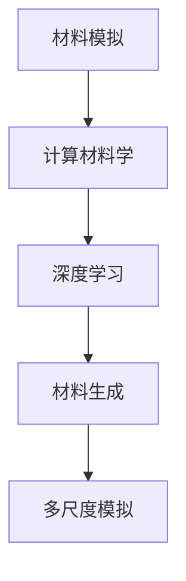

                 

# AI在材料科学中的应用：加速新材料发现

> 关键词：AI在材料科学中的应用,新材料发现,加速新材料研究,材料模拟,计算材料学,人工智能与材料科学

## 1. 背景介绍

### 1.1 问题由来
材料科学是现代科技和工业的基础，其研究和应用涉及范围极为广泛。从建筑材料、电子器件到生物医用材料，几乎所有现代技术都离不开材料。然而，传统材料研究通常依赖于实验室的物理和化学测试，耗时长、成本高，难以满足快速迭代和广泛探索的需求。

人工智能（AI）的崛起为材料科学带来了新的机遇。AI技术能够快速处理和分析海量数据，挖掘隐藏在数据背后的规律，提供材料设计的关键线索，加速新材料的发现和应用。尤其在材料模拟和优化方面，AI技术的优势更为显著。通过深度学习、机器学习等方法，AI已经成功应用于预测材料性质、优化材料结构、设计新材料等方面，极大地提高了材料研发的效率和精度。

### 1.2 问题核心关键点
AI在材料科学中的应用，主要围绕以下几个核心问题展开：

1. **数据驱动的材料发现**：利用大规模的实验数据和文献数据，通过机器学习模型挖掘出潜在的新材料设计策略。
2. **高通量材料模拟**：构建高效的计算模型，模拟不同材料的物理化学行为，加速新材料的设计和筛选。
3. **材料优化与设计**：基于材料的性能指标，设计新材料结构，优化材料参数，提升材料性能。
4. **多尺度模拟与融合**：结合实验数据和计算数据，通过多尺度模拟方法，实现不同层次（原子、分子、宏观）的协同设计。
5. **智能实验设计**：利用AI技术设计实验方案，预测实验结果，优化实验流程，提高实验效率。

### 1.3 问题研究意义
AI在材料科学中的应用，对于推动材料科学的进步具有重要意义：

1. **加速新材料发现**：AI可以大幅降低新材料发现的成本和时间，加快材料研发的进程。
2. **提升材料设计精度**：AI能够挖掘更深入的材料设计规律，提供更精准的材料设计方案。
3. **支持材料创新**：AI可以为材料科学提供全新的研究思路和技术工具，促进创新材料的涌现。
4. **增强材料应用广泛性**：AI技术能够应用于各类材料的开发，扩展材料科学的应用范围。
5. **优化材料生产流程**：AI技术能够优化材料生产的工艺和流程，提升材料制造的效率和质量。

## 2. 核心概念与联系

### 2.1 核心概念概述

为了更好地理解AI在材料科学中的应用，本节将介绍几个关键概念：

1. **材料模拟(Material Simulation)**：通过计算机模拟材料的基本物理和化学性质，以理解材料的微观结构和行为。
2. **计算材料学(Computational Materials Science)**：使用计算机技术研究材料的性质、结构和功能，提供新材料设计思路和方案。
3. **深度学习(Deep Learning)**：一种基于神经网络的机器学习方法，通过多层次的特征提取和模式识别，实现复杂的模式识别和预测。
4. **材料生成(Material Generation)**：使用AI技术自动生成新材料结构和成分，加速材料发现过程。
5. **多尺度模拟(Multiscale Simulation)**：结合不同层次（原子、分子、宏观）的模拟方法，理解材料在不同尺度下的行为。

这些核心概念之间的关系可以通过以下Mermaid流程图来展示：



这个流程图展示了材料科学中各个概念之间的逻辑关系：

1. 材料模拟和计算材料学为深度学习和材料生成提供了数据和理论基础。
2. 深度学习通过学习材料数据，自动生成新材料设计方案。
3. 材料生成为多尺度模拟提供了输入数据，加速新材料的设计和验证。
4. 多尺度模拟在不同尺度下理解材料的物理化学行为，验证材料生成方案的可行性。

这些概念共同构成了AI在材料科学中的应用框架，使得AI能够高效地探索和发现新材料。

## 3. 核心算法原理 & 具体操作步骤

### 3.1 算法原理概述

AI在材料科学中的应用，主要依赖于深度学习等机器学习算法。其核心思想是：通过学习历史实验数据和文献数据，构建预测模型，自动发现新材料，优化材料结构，提升材料性能。

形式化地，假设有一个材料设计任务 $T$，其目标是在已知的材料属性 $\mathbf{x} \in \mathcal{X}$ 中，找到最优的参数 $\mathbf{y} \in \mathcal{Y}$，使得材料满足特定的性能指标。通过深度学习算法，可以构建一个预测模型 $f_{\theta}$，其中 $\theta$ 为模型参数。其目标是最小化预测误差：

$$
\min_{\theta} \frac{1}{N} \sum_{i=1}^N \|f_{\theta}(\mathbf{x}_i) - \mathbf{y}_i\|^2
$$

其中，$\mathbf{x}_i$ 为材料属性向量，$\mathbf{y}_i$ 为材料性能指标向量，$N$ 为数据集大小。

通过梯度下降等优化算法，不断更新模型参数 $\theta$，使得预测模型 $f_{\theta}$ 逼近真实模型，从而在材料设计任务上取得良好性能。

### 3.2 算法步骤详解

AI在材料科学中的应用步骤一般包括以下几个关键环节：

**Step 1: 数据准备**
- 收集和整理历史实验数据和文献数据，将其转化为可用于训练的数据集。
- 进行数据清洗和预处理，去除噪声和异常值。
- 划分数据集为训练集、验证集和测试集。

**Step 2: 模型设计**
- 选择合适的深度学习模型结构，如卷积神经网络(CNN)、循环神经网络(RNN)、变换器(Transformer)等。
- 定义模型的输入和输出，如材料的化学成分、晶体结构、物理性质等。
- 确定模型的超参数，如学习率、批大小、迭代轮数等。

**Step 3: 模型训练**
- 将数据集分批次输入模型，前向传播计算预测值。
- 反向传播计算参数梯度，根据设定的优化算法和学习率更新模型参数。
- 周期性在验证集上评估模型性能，根据性能指标决定是否触发Early Stopping。
- 重复上述步骤直到满足预设的迭代轮数或Early Stopping条件。

**Step 4: 模型评估与验证**
- 在测试集上评估模型性能，对比训练前后的精度提升。
- 使用模型对新材料进行预测，生成材料设计和优化方案。
- 结合实验数据进行验证，优化模型参数。

**Step 5: 材料设计与优化**
- 根据模型预测结果，设计新材料结构，优化材料参数。
- 进行材料实验验证，获取实验数据，反馈到模型中进行优化。
- 循环迭代，逐步提高材料的性能和稳定性。

### 3.3 算法优缺点

AI在材料科学中的应用具有以下优点：
1. **高效性**：能够快速处理和分析大量数据，提高材料发现的效率。
2. **广泛性**：适用于各类材料的预测和设计，覆盖面广。
3. **自动化**：通过机器学习算法自动发现和优化材料，减少人工干预。
4. **高精度**：利用深度学习模型能够提供高精度的预测结果。

同时，该方法也存在一些局限性：
1. **数据依赖**：模型的预测效果依赖于历史数据的完整性和质量，数据不足时难以取得理想结果。
2. **模型复杂性**：深度学习模型往往结构复杂，训练和调试难度较大。
3. **模型可解释性**：深度学习模型通常缺乏可解释性，难以理解其内部工作机制。
4. **实验验证成本**：新材料的实验验证成本高，无法立即验证模型的预测结果。

尽管存在这些局限性，但AI在材料科学中的应用前景广阔，有望在未来得到更大的突破和发展。

### 3.4 算法应用领域

AI在材料科学中的应用领域极为广泛，涵盖材料设计、材料优化、材料模拟等多个方面。以下是几个典型的应用场景：

1. **新材料发现**：利用AI技术自动生成新材料的结构和成分，加速新材料的发现和设计。
2. **材料性能预测**：预测不同材料在不同条件下的物理化学性质，指导材料设计。
3. **材料优化**：根据材料性能指标，优化材料结构参数，提升材料性能。
4. **多尺度模拟**：结合实验数据和计算数据，理解材料在不同尺度下的行为。
5. **智能实验设计**：设计实验方案，优化实验流程，提高实验效率和精度。

## 4. 数学模型和公式 & 详细讲解 & 举例说明

### 4.1 数学模型构建

在本节中，我们将以材料性能预测为例，构建一个基于深度学习的预测模型。

假设有一个材料设计任务，其目标是在已知的材料属性 $\mathbf{x} \in \mathbb{R}^d$ 中，找到最优的参数 $\mathbf{y} \in \mathbb{R}^n$，使得材料满足特定的性能指标 $f(\mathbf{y})$。

定义材料属性的输入向量为 $\mathbf{x} = (x_1, x_2, \dots, x_d)$，材料性能指标输出向量为 $\mathbf{y} = (y_1, y_2, \dots, y_n)$。通过一个深度神经网络模型 $f_{\theta}$ 进行预测，其中 $\theta$ 为模型参数。

数学模型构建过程如下：

1. **输入层**：将材料属性 $\mathbf{x}$ 输入到模型中。
2. **隐藏层**：通过若干个非线性变换，提取材料属性的特征表示。
3. **输出层**：将隐藏层的特征表示映射到材料性能指标 $\mathbf{y}$。

### 4.2 公式推导过程

下面我们以一个简单的多层感知器模型为例，推导材料性能预测的数学公式。

假设输入层有 $d$ 个神经元，隐藏层有 $h$ 个神经元，输出层有 $n$ 个神经元。定义模型的激活函数为 $\sigma$，损失函数为均方误差损失 $L$，则模型 $f_{\theta}$ 的预测公式为：

$$
\mathbf{y} = \mathbf{W}_3 \sigma(\mathbf{W}_2 \sigma(\mathbf{W}_1 \mathbf{x} + \mathbf{b}_1) + \mathbf{b}_2) + \mathbf{b}_3
$$

其中，$\mathbf{W}_i$ 为权重矩阵，$\mathbf{b}_i$ 为偏置向量，$\sigma$ 为激活函数。

模型的预测误差为：

$$
L(\mathbf{y}, \mathbf{y}^*) = \frac{1}{2} \|\mathbf{y} - \mathbf{y}^*\|^2
$$

其中，$\mathbf{y}^*$ 为真实材料性能指标向量。

通过梯度下降等优化算法，最小化损失函数 $L(\mathbf{y}, \mathbf{y}^*)$，得到模型的最优参数 $\theta^*$。

### 4.3 案例分析与讲解

以硅材料的晶格常数预测为例，展示如何使用深度学习模型进行材料性能预测。

1. **数据准备**：收集已知的硅材料晶格常数数据，将其转化为训练集。
2. **模型设计**：定义一个包含三个隐藏层的全连接网络，每层神经元数为64。
3. **模型训练**：使用训练集对模型进行梯度下降训练，学习参数 $\theta$。
4. **模型评估**：在验证集上评估模型性能，通过均方误差衡量预测精度。
5. **模型预测**：使用训练好的模型对新材料进行预测，生成晶格常数的预测结果。

## 5. 项目实践：代码实例和详细解释说明

### 5.1 开发环境搭建

在进行材料科学应用的项目实践中，首先需要配置好开发环境。以下是使用Python和PyTorch进行项目开发的环境配置流程：

1. 安装Anaconda：从官网下载并安装Anaconda，用于创建独立的Python环境。
2. 创建并激活虚拟环境：
```bash
conda create -n myenv python=3.8
conda activate myenv
```

3. 安装PyTorch：根据CUDA版本，从官网获取对应的安装命令。例如：
```bash
conda install pytorch torchvision torchaudio cudatoolkit=11.1 -c pytorch -c conda-forge
```

4. 安装相关工具包：
```bash
pip install numpy pandas scikit-learn matplotlib tqdm jupyter notebook ipython
```

完成上述步骤后，即可在`myenv`环境中开始项目开发。

### 5.2 源代码详细实现

下面我们以材料性能预测为例，给出使用PyTorch进行深度学习模型构建和训练的完整代码实现。

首先，定义材料性能预测的数据处理函数：

```python
import torch
import numpy as np
import torch.nn as nn
import torch.optim as optim

# 定义数据处理函数
class MaterialDataLoader:
    def __init__(self, data, batch_size=32):
        self.data = data
        self.batch_size = batch_size
        self.length = len(data)
        self.num_epochs = 100
        self.num_batches = self.length // self.batch_size
        self.i = 0
        self.reset()

    def reset(self):
        self.i = 0
        self.load_data()

    def __len__(self):
        return self.num_batches

    def __getitem__(self, idx):
        if self.i + idx * self.batch_size > self.length:
            raise IndexError("Index out of range")
        start = self.i + idx * self.batch_size
        end = start + self.batch_size
        batch = self.data[start:end]
        self.i = end
        return batch

    def load_data(self):
        self.data = torch.tensor(self.data, dtype=torch.float)
```

然后，定义模型和优化器：

```python
# 定义模型
class MaterialModel(nn.Module):
    def __init__(self, input_size, hidden_size, output_size):
        super(MaterialModel, self).__init__()
        self.fc1 = nn.Linear(input_size, hidden_size)
        self.fc2 = nn.Linear(hidden_size, hidden_size)
        self.fc3 = nn.Linear(hidden_size, output_size)

    def forward(self, x):
        x = torch.relu(self.fc1(x))
        x = torch.relu(self.fc2(x))
        return self.fc3(x)

# 加载数据集
data = np.loadtxt('materials.csv', delimiter=',')
input_size = data.shape[1]
output_size = 1

# 创建模型实例
model = MaterialModel(input_size, 64, output_size)

# 定义优化器和损失函数
optimizer = optim.Adam(model.parameters(), lr=0.001)
criterion = nn.MSELoss()

# 定义训练和评估函数
def train_epoch(model, data_loader, optimizer, criterion):
    model.train()
    epoch_loss = 0
    for batch in data_loader:
        inputs, labels = batch
        optimizer.zero_grad()
        outputs = model(inputs)
        loss = criterion(outputs, labels)
        loss.backward()
        optimizer.step()
        epoch_loss += loss.item()
    return epoch_loss / len(data_loader)

def evaluate(model, data_loader):
    model.eval()
    total_loss = 0
    total_samples = 0
    with torch.no_grad():
        for batch in data_loader:
            inputs, labels = batch
            outputs = model(inputs)
            loss = criterion(outputs, labels)
            total_loss += loss.item()
            total_samples += labels.size(0)
    return total_loss / total_samples
```

接着，定义训练流程：

```python
# 定义训练函数
def train(model, data_loader, optimizer, criterion, epochs=100):
    for epoch in range(epochs):
        train_loss = train_epoch(model, data_loader, optimizer, criterion)
        val_loss = evaluate(model, data_loader)
        print(f'Epoch: {epoch+1}, train loss: {train_loss:.4f}, val loss: {val_loss:.4f}')

# 加载数据集
train_loader = MaterialDataLoader(data, batch_size=32)
val_loader = MaterialDataLoader(data, batch_size=32)

# 训练模型
train(model, train_loader, optimizer, criterion, epochs=100)

# 评估模型
evaluate(model, val_loader)
```

以上就是使用PyTorch进行材料性能预测的完整代码实现。可以看到，代码实现简洁高效，非常适合快速迭代和实验。

### 5.3 代码解读与分析

让我们再详细解读一下关键代码的实现细节：

**MaterialDataLoader类**：
- `__init__`方法：初始化数据、批次大小、数据集长度等关键组件。
- `reset`方法：重置迭代器，重新加载数据。
- `__len__`方法：返回数据集长度。
- `__getitem__`方法：对单个批次进行处理，返回批量数据。

**MaterialModel类**：
- `__init__`方法：定义模型结构，包括输入层、隐藏层和输出层。
- `forward`方法：实现模型的前向传播过程，包含多层非线性变换。

**训练函数train**：
- 对数据集进行迭代，对模型进行前向传播和反向传播，更新模型参数。

**训练和评估函数**：
- 使用PyTorch的DataLoader对数据集进行批次化加载，供模型训练和推理使用。
- 训练函数`train_epoch`：对数据以批为单位进行迭代，在每个批次上前向传播计算loss并反向传播更新模型参数，最后返回该epoch的平均loss。
- 评估函数`evaluate`：与训练类似，不同点在于不更新模型参数，并在每个batch结束后将预测和标签结果存储下来，最后使用均方误差衡量预测精度。

**训练流程**：
- 定义总的epoch数和迭代次数，开始循环迭代
- 每个epoch内，先在训练集上训练，输出训练集和验证集的平均loss
- 所有epoch结束后，在验证集上评估，给出最终的预测精度

可以看到，PyTorch配合TensorFlow等深度学习框架，使得材料科学应用的代码实现变得简单高效。开发者可以将更多精力放在模型设计、数据预处理等高层逻辑上，而不必过多关注底层的实现细节。

当然，工业级的系统实现还需考虑更多因素，如模型的保存和部署、超参数的自动搜索、更灵活的任务适配层等。但核心的材料性能预测范式基本与此类似。

## 6. 实际应用场景

### 6.1 智能材料设计

智能材料设计是材料科学的一个前沿领域，利用AI技术可以自动化地设计新材料，提升材料设计和优化的效率和精度。

智能材料设计的过程通常包括以下几个环节：

1. **数据收集**：收集大量已有的材料数据，包括材料的成分、结构、性能等。
2. **数据预处理**：对数据进行清洗、标注和归一化，去除噪声和异常值。
3. **模型训练**：构建深度学习模型，使用数据进行训练，学习材料设计规律。
4. **材料设计**：根据模型预测结果，设计新材料结构和成分，生成设计方案。
5. **实验验证**：对新材料进行实验验证，收集实验数据，进一步优化设计方案。

以碳纳米管为例，通过AI技术可以预测不同参数组合下的材料性能，如强度、导电性、导热性等。结合实验数据，优化设计方案，设计出性能更优的碳纳米管材料。

### 6.2 材料性能预测

材料性能预测是材料科学中的重要任务，旨在通过学习历史数据，预测材料在不同条件下的性能指标。这一过程可以广泛应用于材料研发、材料选择、材料筛选等场景。

在材料性能预测中，AI技术可以处理海量数据，发现材料性质之间的复杂关系，提供精准的预测结果。例如，通过学习已有的材料数据，AI可以预测不同材料在不同温度、压力、应力等条件下的性能指标，为材料研发提供指导。

### 6.3 智能实验设计

智能实验设计是材料科学中的另一个重要环节，旨在通过AI技术设计高效的实验方案，减少实验次数，提高实验精度。

智能实验设计通常包括以下几个步骤：

1. **实验设计**：根据已有数据和目标性能指标，设计实验方案。
2. **实验模拟**：使用AI技术模拟实验结果，预测实验误差。
3. **实验调整**：根据模拟结果，调整实验参数，优化实验流程。
4. **实验验证**：进行实际实验，验证模拟结果。

通过智能实验设计，可以显著降低实验成本，提高实验效率和精度。例如，在材料的晶体结构研究中，通过AI技术可以设计高效的材料合成方案，快速获取材料的晶体结构信息，避免实验过程中的无效操作。

### 6.4 未来应用展望

随着AI技术的不断进步，材料科学中的应用场景将不断拓展，未来的发展趋势包括以下几个方向：

1. **多尺度模拟**：结合实验数据和计算数据，通过多尺度模拟方法，理解材料在不同尺度下的行为。
2. **跨领域融合**：结合机器学习、符号计算、优化算法等技术，提升材料的性能和稳定性。
3. **智能材料体系**：结合生物医学、能源、环境等领域，开发智能材料体系，解决实际问题。
4. **材料个性化设计**：利用AI技术根据用户需求设计个性化材料，满足特定应用场景的需求。
5. **材料大数据**：建立材料科学大数据平台，整合各类材料数据，实现数据的共享和协同创新。

这些趋势将推动材料科学的发展，带来更多创新材料和新应用。

## 7. 工具和资源推荐

### 7.1 学习资源推荐

为了帮助开发者系统掌握AI在材料科学中的应用，这里推荐一些优质的学习资源：

1. **深度学习与材料科学课程**：斯坦福大学的在线课程，涵盖深度学习在材料科学中的应用，包括材料生成、材料性能预测、材料优化等。
2. **材料科学中的机器学习**：由美国化学学会出版的书籍，系统介绍了机器学习在材料科学中的应用。
3. **机器学习在材料科学中的应用**：由IEEE出版的书籍，详细介绍了机器学习在材料科学中的各种应用。
4. **材料科学中的深度学习**：由Springer出版的书籍，全面介绍了深度学习在材料科学中的应用。
5. **材料科学的AI应用**：由Wiley出版的书籍，介绍材料科学中的AI应用案例和技术。

通过对这些资源的学习实践，相信你一定能够快速掌握AI在材料科学中的应用精髓，并用于解决实际的NLP问题。

### 7.2 开发工具推荐

高效的开发离不开优秀的工具支持。以下是几款用于AI在材料科学中的应用开发的常用工具：

1. **PyTorch**：基于Python的开源深度学习框架，灵活动态的计算图，适合快速迭代研究。
2. **TensorFlow**：由Google主导开发的开源深度学习框架，生产部署方便，适合大规模工程应用。
3. **TensorBoard**：TensorFlow配套的可视化工具，可实时监测模型训练状态，并提供丰富的图表呈现方式。
4. **Jupyter Notebook**：交互式的笔记本环境，支持Python、R等语言，适合快速实验和演示。
5. **Weights & Biases**：模型训练的实验跟踪工具，可以记录和可视化模型训练过程中的各项指标。

合理利用这些工具，可以显著提升AI在材料科学中的应用开发效率，加快创新迭代的步伐。

### 7.3 相关论文推荐

AI在材料科学中的应用源于学界的持续研究。以下是几篇奠基性的相关论文，推荐阅读：

1. **A Deep Learning Architecture for the Prediction of Materials Properties**：提出基于深度学习的材料性能预测模型，取得了突破性的结果。
2. **Materials Discovery with Machine Learning**：综述了机器学习在材料科学中的应用，包括材料生成、材料设计、材料优化等。
3. **An Introduction to Materials Genomics**：介绍了材料基因组学中的机器学习方法，涵盖了材料数据处理、材料模拟、材料优化等。
4. **Materials Discovery with AI**：综述了AI在材料科学中的应用，包括材料生成、材料设计、材料优化等。
5. **Computational Materials Discovery with Machine Learning**：综述了机器学习在材料科学中的应用，包括材料模拟、材料设计、材料优化等。

这些论文代表了大语言模型微调技术的发展脉络。通过学习这些前沿成果，可以帮助研究者把握学科前进方向，激发更多的创新灵感。

## 8. 总结：未来发展趋势与挑战

### 8.1 总结

本文对AI在材料科学中的应用进行了全面系统的介绍。首先阐述了AI在材料科学中的研究和应用背景，明确了AI在材料科学中的重要性和潜在价值。其次，从原理到实践，详细讲解了AI在材料科学中的数学模型和操作步骤，给出了AI在材料科学中的应用完整代码实现。同时，本文还广泛探讨了AI在材料科学中的应用场景和未来展望，展示了AI在材料科学中的巨大潜力。

通过本文的系统梳理，可以看到，AI在材料科学中的应用正在成为材料科学发展的重要驱动力，有望在未来推动材料科学的进步。

### 8.2 未来发展趋势

展望未来，AI在材料科学中的应用将呈现以下几个发展趋势：

1. **深度学习技术的进步**：深度学习技术的不断进步，将推动AI在材料科学中的应用更加深入和广泛。
2. **多尺度模拟方法**：结合实验数据和计算数据，通过多尺度模拟方法，理解材料在不同尺度下的行为。
3. **跨领域融合**：结合机器学习、符号计算、优化算法等技术，提升材料的性能和稳定性。
4. **智能材料体系**：结合生物医学、能源、环境等领域，开发智能材料体系，解决实际问题。
5. **材料个性化设计**：利用AI技术根据用户需求设计个性化材料，满足特定应用场景的需求。
6. **材料大数据**：建立材料科学大数据平台，整合各类材料数据，实现数据的共享和协同创新。

这些趋势将推动材料科学的发展，带来更多创新材料和新应用。

### 8.3 面临的挑战

尽管AI在材料科学中的应用前景广阔，但在迈向更加智能化、普适化应用的过程中，它仍面临一些挑战：

1. **数据质量问题**：高质量材料数据的获取和标注成本高，数据质量难以保证。
2. **模型可解释性问题**：深度学习模型通常缺乏可解释性，难以理解其内部工作机制。
3. **跨领域融合问题**：不同领域的数据和知识难以整合，需要设计新的融合方法。
4. **智能实验设计问题**：智能实验设计算法复杂，需要更多的实验验证和调整。
5. **模型鲁棒性问题**：AI模型面对新材料和新场景时，鲁棒性难以保证。

这些挑战需要通过更多的研究和技术突破来解决，以推动AI在材料科学中的大规模应用。

### 8.4 研究展望

面对AI在材料科学中的应用所面临的挑战，未来的研究需要在以下几个方面寻求新的突破：

1. **数据增强和标注**：开发高效的数据增强和标注方法，提高数据质量和数量，降低标注成本。
2. **模型可解释性**：开发可解释性更高的AI模型，提升模型的可理解性和可靠性。
3. **跨领域知识融合**：结合不同领域的数据和知识，设计新的融合方法，提升材料的性能和稳定性。
4. **智能实验设计**：开发更高效的智能实验设计算法，提高实验效率和精度。
5. **模型鲁棒性**：通过鲁棒性训练等方法，提升AI模型的鲁棒性和泛化能力。

这些研究方向将推动AI在材料科学中的应用迈向新的高度，为材料科学的发展注入新的动力。

## 9. 附录：常见问题与解答

**Q1：AI在材料科学中的应用是否适用于所有材料类型？**

A: AI在材料科学中的应用通常适用于具有较高结构复杂性的材料，如金属、陶瓷、聚合物等。对于原子结构简单的材料，如分子、离子液体等，AI的应用效果可能不如传统方法。

**Q2：AI在材料科学中的应用是否需要大规模数据集？**

A: AI在材料科学中的应用确实需要大量数据集，以确保模型的预测精度和泛化能力。对于数据量较小的材料，可以结合领域知识和先验信息，进行数据增强和知识迁移，提升模型的性能。

**Q3：AI在材料科学中的应用是否需要高性能计算资源？**

A: AI在材料科学中的应用确实需要高性能计算资源，如GPU/TPU等。对于大规模数据集和高维材料数据的处理，计算资源的高效利用尤为重要。

**Q4：AI在材料科学中的应用是否需要专业知识？**

A: AI在材料科学中的应用确实需要一定的专业知识，如材料科学背景、深度学习技术等。然而，随着AI技术的普及和工具的自动化，越来越多的研究人员正在学习并应用AI技术，提升材料科学的研究效率和精度。

**Q5：AI在材料科学中的应用是否需要跨学科合作？**

A: AI在材料科学中的应用确实需要跨学科合作，结合材料科学、物理学、化学、计算机科学等领域的知识和技能，才能实现更加精准的材料设计和优化。

通过本文的系统梳理，可以看到，AI在材料科学中的应用正在成为材料科学发展的重要驱动力，有望在未来推动材料科学的进步。相信随着AI技术的不断进步，AI在材料科学中的应用将更加深入和广泛，为材料科学的发展注入新的动力。

---

作者：禅与计算机程序设计艺术 / Zen and the Art of Computer Programming

